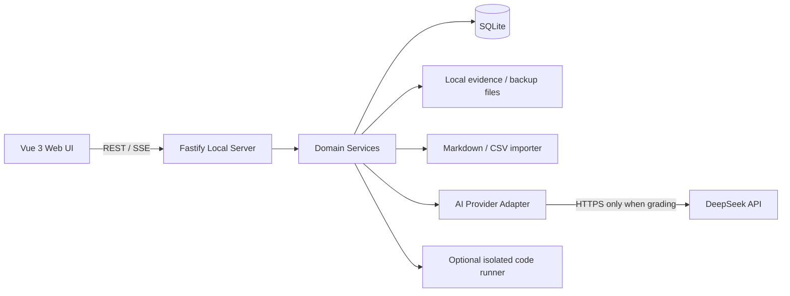
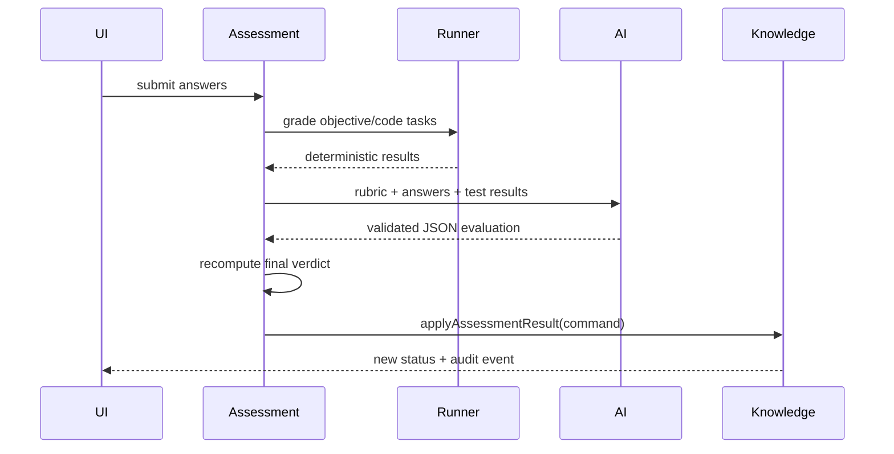

# 技术架构

## 1. 总体架构

采用本地 Web 应用而不是纯浏览器应用。原因是 SQLite、文件备份、Markdown 导入和模型密钥都需要可信的本地服务边界。



核心约束：

- 服务只监听 `127.0.0.1`，默认端口 `41730`。
- 浏览器不能直接调用 DeepSeek，也不能获取 API Key。
- 领域服务是唯一能修改知识状态的代码层。
- AI 返回结果必须经过 schema、确定性规则和状态机校验。
- 断网只影响 AI 评分和外部资料，其他功能保持可用。

## 2. 推荐技术栈

| 层 | 技术 | 说明 |
| --- | --- | --- |
| 工作区 | pnpm workspace | Web、Server、Shared 分包，单仓维护 |
| Web | Vue 3、TypeScript、Vite | Composition API、`<script setup>` 与严格类型检查 |
| UI | Element Plus、CSS Modules/CSS Variables | 复用成熟交互，但遵循自定义视觉 Token |
| 路由 | Vue Router | 本地 SPA 路由、路由级懒加载与守卫 |
| 请求 | `@tanstack/vue-query` | 服务端状态、缓存和失效管理 |
| 本地 UI 状态 | Pinia | 只存布局、筛选、偏好和跨页面临时状态 |
| Vue 工具 | VueUse | 复用可靠的组合式函数，不重复造轮子 |
| 图谱 | `@vue-flow/core` | 节点、边、聚焦路径和自定义双环节点 |
| 日历 | `@fullcalendar/vue3` | 月、周、日、议程和拖拽 |
| Markdown | unified + remark/rehype | 安全渲染、代码块、任务清单 |
| 编辑器 | CodeMirror 6 | Markdown 与代码答题 |
| Server | Node.js、Fastify、TypeScript | REST、SSE、校验和本地文件操作 |
| Schema | Zod | API、导入和 DeepSeek 输出统一校验 |
| DB | SQLite + Drizzle ORM | 本地关系数据和迁移 |
| 测试 | Vitest、Vue Test Utils、Testing Library Vue、Playwright | 单元、组件和关键路径 |

不要引入 Vuex 或其他第二套状态方案。Vue Query 管服务端数据，组件 `ref/reactive/computed` 管本地状态，只有跨页面 UI 状态和用户偏好进入 Pinia。

Vue 代码统一采用 Composition API 和 `<script setup lang="ts">`，不混用 Options API。可复用逻辑优先抽成 `useXxx` composable，但不得把业务对象、服务端缓存和组件状态全部塞进全局 store。

## 3. 仓库结构

```text
career-planning/
├── apps/
│   ├── web/
│   │   ├── src/
│   │   │   ├── app/
│   │   │   ├── router/
│   │   │   ├── stores/
│   │   │   ├── composables/
│   │   │   ├── features/
│   │   │   │   ├── today/
│   │   │   │   ├── knowledge/
│   │   │   │   ├── learning/
│   │   │   │   ├── assessment/
│   │   │   │   ├── calendar/
│   │   │   │   ├── jobs/
│   │   │   │   └── settings/
│   │   │   ├── components/
│   │   │   ├── api/
│   │   │   └── styles/
│   │   └── tests/
│   └── server/
│       ├── src/
│       │   ├── modules/
│       │   │   ├── content/
│       │   │   ├── knowledge/
│       │   │   ├── assessment/
│       │   │   ├── planning/
│       │   │   ├── jobs/
│       │   │   ├── ai/
│       │   │   └── backup/
│       │   ├── db/
│       │   ├── http/
│       │   └── config/
│       └── tests/
├── packages/
│   ├── shared/              # DTO、Zod schema、枚举、状态机
│   └── content-parser/      # Markdown/CSV 解析，无数据库依赖
├── docs/                    # 现有内容与开发文档
├── templates/               # 现有 CSV
├── data/                    # 本地数据库、附件、备份；不提交 Git
├── drizzle/
├── pnpm-workspace.yaml
└── package.json
```

## 4. 模块边界

### content

- 读取 Markdown/CSV。
- 生成导入预览和 source hash。
- 不直接写用户状态。

### knowledge

- 管理领域、知识点、资料、关系、笔记和掌握状态。
- 状态只能通过领域命令修改，不允许通用 PATCH 任意改状态。

### assessment

- 创建试卷、保存答案、运行确定性评分、请求 AI 评分。
- 根据统一规则计算最终结果并发出领域事件。

### planning

- 管理计划事件、重复规则、打卡、日/周复盘。
- 接收考核模块发出的复测安排。

### jobs

- 管理岗位、求职活动、项目资产、技能缺口。
- 技能缺口引用 knowledge ID，不复制知识点文本。

### ai

- 封装 Provider、重试、超时、结构化输出、token 使用和脱敏日志。
- 不拥有业务状态，也不能直接访问数据库表。

## 5. 数据流

### 内容导入

```mermaid
sequenceDiagram
  participant UI
  participant Importer
  participant DB
  UI->>Importer: scan source files
  Importer-->>UI: preview(new/update/conflict)
  UI->>Importer: confirm import
  Importer->>DB: transaction upsert content
  Importer->>DB: preserve user progress and history
  DB-->>UI: import summary
```



### AI 评分与状态更新



## 6. 本地运行与配置

`.env.local` 示例：

```dotenv
HOST=127.0.0.1
PORT=41730
DATABASE_URL=./data/career.db
DATA_DIR=./data
AI_PROVIDER=deepseek
DEEPSEEK_API_KEY=
DEEPSEEK_BASE_URL=https://api.deepseek.com
DEEPSEEK_MODEL=deepseek-v4-pro
DEEPSEEK_TIMEOUT_MS=120000
```

- `.env.local` 加入 `.gitignore`。
- 启动时检查目录写权限、数据库迁移、内容版本和备份状态。
- 开发环境 Web 使用 Vite proxy；生产本地模式由 Fastify 托管静态资源。
- 提供 `pnpm dev`、`pnpm build`、`pnpm test`、`pnpm db:migrate`、`pnpm content:check`、`pnpm backup:create`。

## 7. 安全边界

- 仅允许同源 UI 访问本地 API；生产模式不启用宽泛 CORS。
- 所有 API 输入、导入文件和模型输出通过 Zod 校验。
- Markdown 禁止原始 HTML，链接添加安全属性，代码块只展示不执行。
- 附件文件名与路径由服务生成，拒绝 `..`、绝对路径和符号链接逃逸。
- 日志不记录 API Key、完整答卷、JD 私密信息或附件内容。
- 模型输入中的 Markdown、JD、回答和项目内容都视为不可信文本，不能改变系统指令。
- 代码执行只能进入隔离运行器；Node `vm`、`eval` 和普通 child process 不是安全沙箱。

## 8. 性能要求

- 首屏本地数据 1 秒内可交互。
- 92 个知识点图谱首次布局小于 500ms；默认只展开当前领域。
- 常用列表使用数据库分页和索引，不一次读取全部历史答卷。
- 模型评分采用 SSE 展示阶段状态，但只在完整 JSON 校验后保存结果。
- 数据库写入使用事务；日历拖拽采用乐观更新，失败时回滚并提示。
