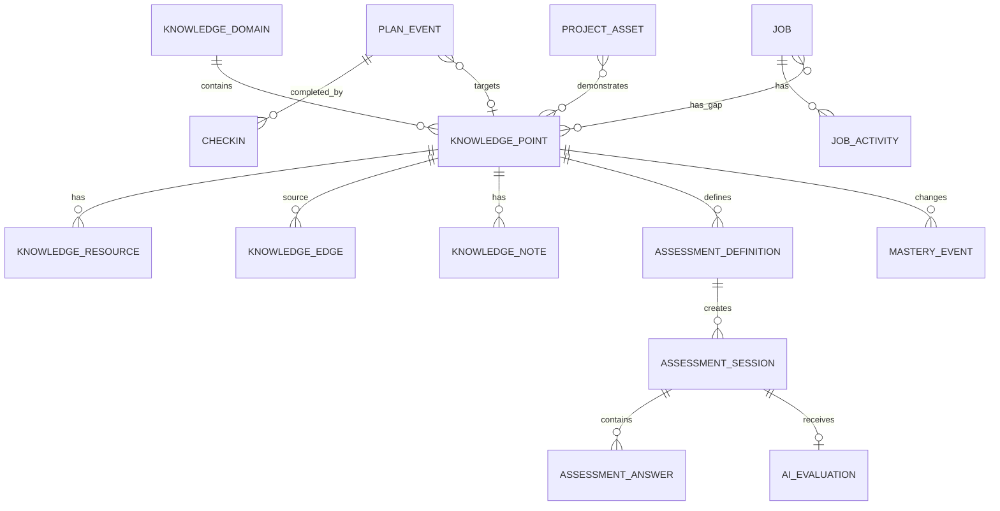

# 数据模型与内容导入

## 1. 数据原则

- Markdown/CSV 是内容种子，SQLite 是运行时事实来源。
- 用户状态、笔记、答卷、打卡和求职记录只存数据库及附件目录。
- 内容重新导入不能覆盖用户数据。
- 所有关键状态变化记录审计事件。
- 时间以 UTC ISO 字符串存储，界面按 `Asia/Shanghai` 展示。
- 业务主键使用 UUID；知识点同时保留稳定业务编号，如 `TS-02`。

## 2. 主要实体关系



## 3. 知识表

### knowledge_domains

| 字段 | 类型 | 说明 |
| --- | --- | --- |
| id | text PK | UUID |
| code | text unique | `01`、`02` 等稳定代码 |
| title | text | 领域名称 |
| description | text | 领域说明 |
| order_index | integer | 排序 |
| source_path | text | 来源文件 |
| source_hash | text | 内容 hash |
| created_at / updated_at | text | 时间 |

### knowledge_points

| 字段 | 类型 | 说明 |
| --- | --- | --- |
| id | text PK | UUID |
| code | text unique | `TS-02` 等稳定编号 |
| domain_id | text FK | 所属领域 |
| title | text | 标题 |
| summary | text nullable | 用户补充摘要 |
| study_material_md | text | 学习资料 Markdown |
| assessment_spec_md | text | 严格考核 Markdown |
| pass_criteria_md | text | 通过标准 Markdown |
| difficulty | text | intermediate/senior/advanced |
| plan_week | integer nullable | 推荐周次 |
| status | text | 状态枚举 |
| self_mastered_at | text nullable | 自评时间 |
| first_passed_at | text nullable | 初试通过时间 |
| mastered_at | text nullable | 复测通过时间 |
| next_review_at | text nullable | 下次抽测 |
| source_path / source_hash | text | 来源追踪 |
| created_at / updated_at | text | 时间 |

状态枚举：

```text
NOT_STARTED
LEARNING
SELF_MASTERED
FIRST_PASS_PENDING_RETEST
MASTERED
NEEDS_RELEARNING
```

### knowledge_resources

- `id`, `knowledge_point_id`, `type`, `title`, `url`, `local_path`, `notes`, `order_index`, `last_checked_at`。
- type：`OFFICIAL_DOC`、`STANDARD`、`LOCAL_MARKDOWN`、`PROJECT_FILE`、`VIDEO`、`BOOK`、`OTHER`。

### knowledge_edges

- `id`, `source_point_id`, `target_point_id`, `type`, `description`, `weight`。
- type：`PREREQUISITE`、`RELATED`、`COMPARES_WITH`、`APPLIED_WITH`。
- `(source_point_id, target_point_id, type)` 唯一。

### knowledge_notes

- `id`, `knowledge_point_id`, `content_md`, `note_type`, `created_at`, `updated_at`。
- note_type：`LEARNING`、`SUMMARY`、`MISTAKE`、`PROJECT_EVIDENCE`、`INTERVIEW`。

## 4. 考核表

### assessment_definitions

- `id`, `knowledge_point_id`, `version`, `assessment_type`, `rubric_json`, `pass_rule_json`, `source_hash`, `active`。
- assessment_type：`FIRST`、`RETEST`、`MONTHLY_REVIEW`、`DOMAIN_COMPREHENSIVE`。
- 已产生会话的定义不可原地修改，必须创建新版本。

### assessment_sessions

| 字段 | 说明 |
| --- | --- |
| id | UUID |
| assessment_definition_id | 固化的考核版本 |
| knowledge_point_id | 冗余用于查询 |
| type | FIRST/RETEST/MONTHLY_REVIEW |
| status | DRAFT/IN_PROGRESS/SUBMITTED/GRADING/GRADED/ERROR |
| question_set_json | 固化题目、rubric 和预期点 |
| started_at / submitted_at / graded_at | 时间 |
| duration_seconds | 实际用时 |
| objective_score | 确定性分数 |
| ai_score | 模型 rubric 分数 |
| final_score | 服务端重算总分 |
| verdict | PASS/FAIL/MANUAL_REVIEW |
| model_provider / model_name | 模型追踪 |
| prompt_version | 评分提示词版本 |

### assessment_answers

- `id`, `session_id`, `question_id`, `answer_type`, `content_text`, `content_json`, `attachment_path`, `saved_at`。
- 答案每次保存递增 revision，交卷时生成不可变快照。

### deterministic_results

- `id`, `session_id`, `question_id`, `runner_type`, `passed`, `score`, `stdout`, `stderr`, `test_summary_json`, `duration_ms`。
- stdout/stderr 限长并脱敏。

### ai_evaluations

- `id`, `session_id`, `schema_version`, `raw_response`, `parsed_json`, `valid`, `confidence`, `error_code`, `created_at`。
- raw_response 用于本地诊断，界面默认不展示模型思考内容。

### mastery_events

- `id`, `knowledge_point_id`, `from_status`, `to_status`, `reason_type`, `reason_id`, `created_at`。
- reason_type：`SELF_ASSESSMENT`、`ASSESSMENT_PASS`、`RETEST_PASS`、`REVIEW_FAIL`、`MANUAL_CORRECTION`、`IMPORT`。
- 不允许删除，只允许追加更正事件。

## 5. 计划与打卡表

### plan_events

- `id`, `event_type`, `title`, `description`, `start_at`, `end_at`, `all_day`, `status`, `priority`。
- `knowledge_point_id`、`job_id`、`assessment_session_id` 均可为空，但一个事件至少关联一个业务对象或填写独立描述。
- event_type：`LEARNING`、`ASSESSMENT`、`RETEST`、`PROJECT_OUTPUT`、`JOB_APPLICATION`、`INTERVIEW`、`REVIEW`。
- status：`PLANNED`、`IN_PROGRESS`、`COMPLETED`、`PARTIAL`、`SKIPPED`、`RESCHEDULED`。
- 重复事件使用 `recurrence_rule` 与 `recurrence_parent_id`。

### checkins

- `id`, `plan_event_id`, `result`, `actual_minutes`, `note_md`, `energy_level`, `difficulty_level`, `evidence_path`, `checked_at`。
- 同一事件可以有多条记录，最终状态由最后一次有效记录决定。

### daily_reviews / weekly_reviews

- 保存日期范围、完成率、总结、困难、调整和下周期重点。
- 周复盘生成后不自动改变未来计划，必须预览确认。

## 6. 求职表

### jobs

- `id`, `company`, `title`, `salary_text`, `experience_text`, `location`, `source_url`, `direction`, `tech_stack_json`, `jd_text`, `status`, `next_action`, `next_action_at`, `notes`。
- status：`SAVED`、`TO_APPLY`、`APPLIED`、`CONTACTING`、`ASSESSMENT`、`INTERVIEWING`、`OFFER`、`REJECTED`、`WITHDRAWN`。

### job_knowledge_gaps

- `job_id`, `knowledge_point_id`, `gap_level`, `note`, `resolved_at`。
- gap_level：`HIGH`、`MEDIUM`、`LOW`。

### job_activities

- `id`, `job_id`, `type`, `occurred_at`, `summary`, `details_md`, `result`, `next_action`, `next_action_at`。
- type：`APPLICATION`、`MESSAGE`、`WRITTEN_TEST`、`INTERVIEW`、`FOLLOW_UP`、`OFFER`、`REJECTION`。

### project_assets

- `id`, `name`, `project_type`, `background_md`, `responsibility_md`, `challenge_md`, `solution_md`, `result_md`, `reflection_md`, `evidence_json`。
- 通过关联表连接知识点、岗位和不同简历版本。

## 7. 内容导入协议

### Markdown 知识点解析

识别规则：

1. `#` 是领域标题。
2. `## <ID> <标题>` 开始一个知识点，ID 匹配 `[A-Z]+-[0-9]+`。
3. `- [ ] 自评已掌握` 和 `- [ ] 已通过严格考核` 只作为初始状态提示；已有数据库时不得覆盖。
4. `- 学习资料：`、`- 严格考核：`、`- 通过标准：` 分别解析成字段。
5. `## 领域综合考核` 解析成领域级考核定义，不作为普通知识点。

### CSV 映射

- `learning-tracker-template.csv` -> plan template items。
- `daily-8h-learning-schedule.csv` -> daily time-block template。
- `hangzhou-frontend-jobs-template.csv` -> jobs + job gaps 草稿。
- CSV 使用真正的解析库，不允许用 `split(',')`。

### 幂等与冲突

- source hash 未变：跳过。
- 内容变化、用户未编辑对应内容：自动更新预览为安全更新。
- 内容变化、用户编辑过：标记冲突，显示本地/来源差异。
- 用户状态、笔记、考核和打卡从不受内容导入覆盖。

## 8. 索引与约束

- `knowledge_points(code)` unique。
- `knowledge_points(domain_id, status)` index。
- `assessment_sessions(knowledge_point_id, submitted_at)` index。
- `plan_events(start_at, event_type)` index。
- `jobs(status, next_action_at)` index。
- 所有外键开启 `PRAGMA foreign_keys = ON`。
- 关键枚举使用数据库 check constraint 与 Zod 双重校验。

## 9. 备份格式

```text
career-atlas-backup-YYYYMMDD-HHmmss.zip
├── manifest.json          # 版本、校验和、记录数
├── database.json          # 按表导出的可迁移 JSON
├── notes/                 # Markdown 笔记
├── evidence/              # 用户选择包含的证据
└── source-snapshot/       # 导入内容版本摘要，不复制无关仓库
```

恢复前校验 manifest、版本和 checksum；恢复写入临时数据库，验证通过后原子替换正式数据库。
