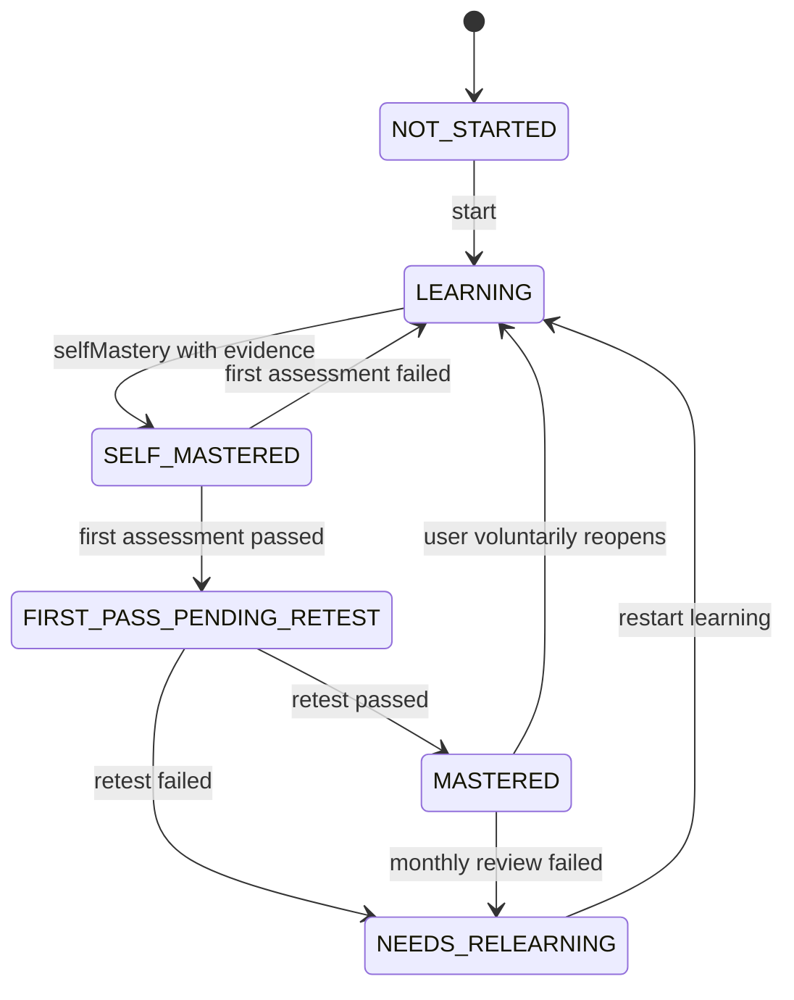
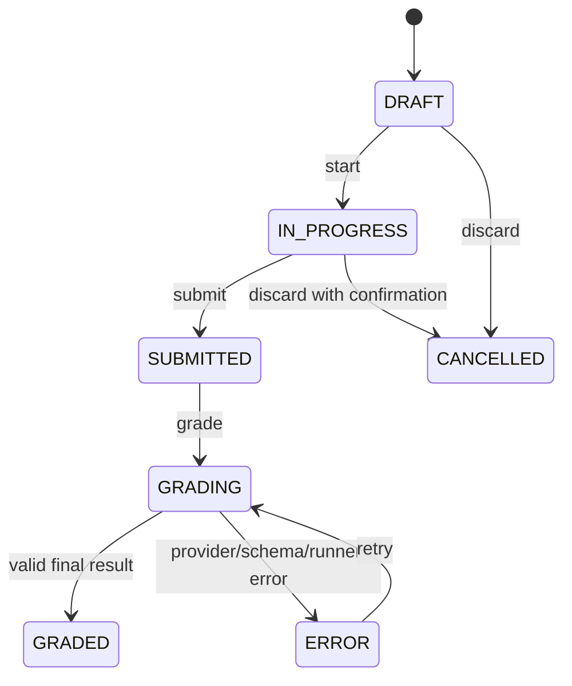

# 本地 API 与状态机

## 1. API 约定

- 前缀：`/api/v1`。
- JSON 使用 camelCase。
- 所有写操作使用 Zod 校验。
- 时间返回 ISO 8601 UTC 字符串。
- 分页使用 `cursor`；简单配置列表可不分页。
- 删除用户数据默认软删除，备份和审计记录不级联清除。

成功响应：

```json
{
  "data": {},
  "meta": {
    "requestId": "uuid"
  }
}
```

错误响应：

```json
{
  "error": {
    "code": "ASSESSMENT_OUTPUT_INVALID",
    "message": "模型返回格式不符合评分协议",
    "details": {},
    "retryable": true
  },
  "meta": {
    "requestId": "uuid"
  }
}
```

## 2. 内容与导入 API

| 方法 | 路径 | 说明 |
| --- | --- | --- |
| POST | `/content/import/scan` | 扫描 Markdown/CSV，返回预览 |
| POST | `/content/import/commit` | 按 preview token 提交导入 |
| GET | `/content/import/history` | 导入历史 |
| GET | `/content/diagnostics` | 缺失字段、重复 ID、坏链接摘要 |

`commit` 必须使用服务端生成的短期 preview token，避免扫描后源文件变化却继续提交旧预览。

## 3. 知识 API

| 方法 | 路径 | 说明 |
| --- | --- | --- |
| GET | `/knowledge/domains` | 领域和聚合进度 |
| GET | `/knowledge/points` | 筛选、搜索、分页 |
| GET | `/knowledge/points/:code` | 详情、资料、关系、历史 |
| POST | `/knowledge/points/:code/start` | NOT_STARTED -> LEARNING |
| POST | `/knowledge/points/:code/self-mastery` | 提交摘要/证据并自评掌握 |
| POST | `/knowledge/points/:code/reopen` | 主动改为 NEEDS_RELEARNING |
| GET | `/knowledge/graph` | 节点、边和过滤元数据 |
| POST | `/knowledge/edges` | 新增用户关系 |
| DELETE | `/knowledge/edges/:id` | 删除用户创建的关系 |
| GET/POST | `/knowledge/points/:code/notes` | 笔记列表/新增 |
| PATCH | `/knowledge/notes/:id` | 修改笔记 |

禁止提供通用 `PATCH /knowledge/points/:code { status }`。状态必须通过明确命令或考核结果改变。

知识点列表与详情响应必须包含 `studyMinutes`、`practiceMinutes`、`projectMinutes`、`assessmentMinutes`、`retestMinutes` 和 `estimatedTotalMinutes`。其中 `estimatedTotalMinutes` 由服务端用前四项重算，客户端不得自行持久化总数。

## 4. 考核 API

| 方法 | 路径 | 说明 |
| --- | --- | --- |
| POST | `/assessments` | 为知识点创建会话 |
| GET | `/assessments/:id` | 会话、题目和保存状态 |
| POST | `/assessments/:id/start` | 开始并固定计时 |
| PUT | `/assessments/:id/answers/:questionId` | 幂等保存答案 |
| POST | `/assessments/:id/attachments` | 上传项目/文件证据 |
| POST | `/assessments/:id/submit` | 固化答卷快照 |
| POST | `/assessments/:id/grade` | 启动确定性与 AI 评分 |
| GET | `/assessments/:id/grade/events` | SSE 阶段状态 |
| GET | `/assessments/:id/result` | 最终评分和反馈 |
| POST | `/assessments/:id/regrade` | 仅对 ERROR/无效输出重试 |
| POST | `/assessments/:id/manual-review` | 人工更正，需原因 |

创建请求：

```json
{
  "knowledgePointCode": "TS-02",
  "type": "FIRST",
  "durationMinutes": 60
}
```

`grade` 必须幂等。若已有有效最终结果，重复请求返回原结果；如正在评分，返回当前 job ID。

SSE 事件只允许：

```text
grading.started
grading.deterministic.completed
grading.ai.started
grading.ai.completed
grading.validation.completed
grading.state.updated
grading.failed
```

不得流式发送模型隐藏思考内容。

## 5. 计划与打卡 API

| 方法 | 路径 | 说明 |
| --- | --- | --- |
| GET | `/calendar/events` | 按日期范围查询 |
| POST | `/calendar/events` | 创建事件 |
| PATCH | `/calendar/events/:id` | 改期、描述和优先级 |
| POST | `/calendar/events/:id/checkins` | 完成、部分、跳过或改期 |
| POST | `/calendar/plan/import` | 从 64 周模板生成预览 |
| POST | `/calendar/plan/commit` | 确认生成 |
| GET/POST | `/reviews/daily` | 日复盘 |
| GET/POST | `/reviews/weekly` | 周复盘 |
| GET | `/statistics/learning` | 完成率、时长和复测数据 |

日历查询必须使用范围参数：`from`、`to`，禁止无范围读取全部历史。

模板学习事件返回可选的 `learningBrief`，其中 `effort` 包含五阶段分钟、`estimatedTotalMinutes`、`capacityMinutes`、`utilizationPercent` 和 `overloaded`。该对象表达该事件当天实际承接的阶段负载，不代表关联知识点完整生命周期的总耗时。

## 6. 求职 API

| 方法 | 路径 | 说明 |
| --- | --- | --- |
| GET/POST | `/jobs` | 查询/新建岗位 |
| GET/PATCH | `/jobs/:id` | 详情/修改 |
| POST | `/jobs/import/preview` | CSV 预览 |
| POST | `/jobs/import/commit` | CSV 导入 |
| POST | `/jobs/:id/activities` | 新增投递、面试等活动 |
| POST | `/jobs/:id/knowledge-gaps` | 关联技能缺口 |
| PATCH | `/jobs/:id/knowledge-gaps/:code` | 更新或关闭缺口 |
| GET | `/jobs/funnel` | 求职漏斗与转化 |
| GET/POST | `/project-assets` | 项目资产 |
| GET/PATCH | `/project-assets/:id` | 项目详情/修改 |

岗位状态更新通过 `PATCH /jobs/:id`，服务端同时追加 activity；不能只改状态而丢失时间线。

## 7. 系统 API

| 方法 | 路径 | 说明 |
| --- | --- | --- |
| GET | `/system/health` | DB、数据目录、模型配置状态 |
| GET | `/system/ai/status` | Provider、模型名、连接状态，不返回密钥 |
| POST | `/system/ai/test` | 最小连接测试 |
| GET | `/import/status` | 当前已入库知识领域、知识点数量和编号 |
| GET | `/import/preview` | 预览 Markdown 知识库导入结果 |
| POST | `/import/execute` | 增量同步知识内容，保留已有学习进度 |
| POST | `/import/reset-learning-progress` | 同步最新知识库，清空学习进度和学习证据，并按最新版 64 周模板重建计划 |
| POST | `/backup` | 创建备份 |
| GET | `/backup` | 备份列表 |
| POST | `/backup/restore/preview` | 恢复预览 |
| POST | `/backup/restore/commit` | 事务恢复 |

`/import/reset-learning-progress` 只影响学习主线：`knowledge_points` 的掌握状态、摘要和掌握时间，模板/系统学习计划、考核会话、评分结果、掌握事件、打卡、日复盘、周复盘和请假记录会被清空；岗位、项目资产、技能缺口、知识内容、知识关系和备份保留。默认从当前北京时间日期重新生成 448 条模板计划，也可传入 `{ "startDate": "YYYY-MM-DD" }` 指定计划起点。

## 8. 知识状态机



守卫条件：

- `selfMastery` 必须包含摘要或证据。
- 首次考核只能从 `SELF_MASTERED` 发起。
- 复测只能在首次通过后且默认间隔至少 7 天发起；管理员调试模式除外。
- `MASTERED` 只能由复测通过命令进入。
- 任一转换都追加 mastery event。

## 9. 考核会话状态机



- `SUBMITTED` 后答案不可修改。
- `GRADED` 后重新评分只允许创建新的 evaluation revision，不覆盖历史。
- 用户答错是 `GRADED + FAIL`，不是系统 `ERROR`。

## 10. 日历事件状态机

```text
PLANNED -> IN_PROGRESS -> COMPLETED
PLANNED/IN_PROGRESS -> PARTIAL
PLANNED -> SKIPPED
PLANNED/IN_PROGRESS/PARTIAL -> RESCHEDULED -> new PLANNED event
```

改期保留原事件，创建新事件并通过 `rescheduledToId` 连接，确保计划变更可复盘。

## 11. 错误码

至少实现：

- `VALIDATION_ERROR`
- `NOT_FOUND`
- `STATE_TRANSITION_INVALID`
- `IMPORT_CONFLICT`
- `SOURCE_CHANGED_AFTER_PREVIEW`
- `AI_NOT_CONFIGURED`
- `AI_RATE_LIMITED`
- `AI_TIMEOUT`
- `ASSESSMENT_OUTPUT_INVALID`
- `ASSESSMENT_EVIDENCE_INSUFFICIENT`
- `CODE_RUNNER_UNAVAILABLE`
- `BACKUP_CHECKSUM_INVALID`
- `DATABASE_READ_ONLY`
