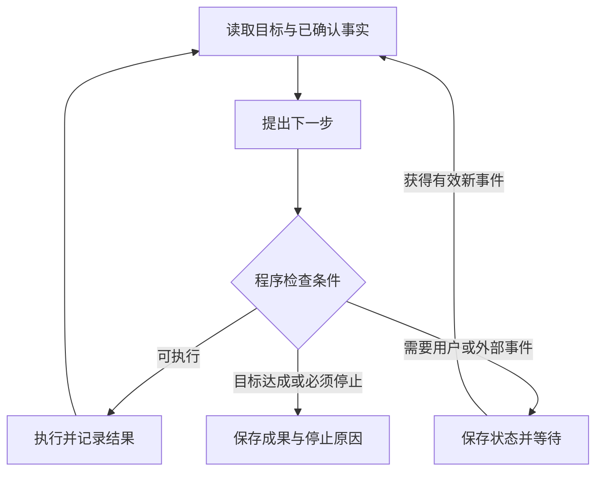

# Agent 循环、规划、停止与恢复知识点讲义

## AGENT-01 Agent 循环、规划、停止条件与失败恢复

你让助手整理三份发票，生成报销草稿，然后等待你确认。它读完第二份时发现日期模糊，于是再次读取；第三次仍读到同一结果，却继续重复。另一次运行更麻烦：草稿已经保存，服务端响应丢失，助手重启后又创建了一份。

这两个问题分别要求系统知道“继续有没有进展”和“上一步究竟发生了什么”。提示模型谨慎一些有帮助，但循环、预算、权限与恢复边界需要由应用管理。本篇从一个小型整理任务出发，解释观察、规划、执行与停止的分工，再用两个独立实验观察空转和回执丢失。读完应能画出可恢复的运行过程，而不是只写一个不断调用模型的循环。

### 学习前先确认

- 直接前置：[AIAPP-04 工具调用、执行语义与结果 UI](../chinese-guides/aiapp-04-tool-calling-execution-result-ui.md#aiapp-04)，理解工具提议、执行授权、幂等与未知结果。

### 一、循环由应用推进，模型提供候选决定

**Agent 循环（Agent Loop）**是应用反复观察任务状态、选择下一步、执行允许的动作，再根据结果更新状态的过程。模型可以参与决定下一步，应用仍负责核验输入、限制能力和记录事实。

固定流程与 Agent 的差别，主要在运行路径由谁决定。如果需求始终是“上传三份发票 → 提取字段 → 校验 → 生成草稿”，固定工作流通常更直接。若需要根据材料情况选择补读、查规则或询问用户，才有动态规划的空间。两者可以组合：外层固定审批流程，内部某一步用 Agent 补齐资料。

在整理发票的例子里，观察是“已有两份可读记录，第三份日期不清”；候选决定是“请用户补充日期”；执行是发出一次明确询问；结果是进入等待，而不是立刻再问模型同一个问题。反思也应指向新结果与目标的差距，不是再生成一段自我评价就算前进。



图中的等待会结束当前工作占用，再由事件唤醒；不是在后台保持无期限的紧循环。事件可能重复或迟到，所以恢复前仍要检查运行 ID、目标版本和任务是否已取消。

### 二、目标必须变成能够核验的完成条件

“把报销处理好”太宽泛。可以先限定为：三份发票都有来源引用；金额与日期已确认；草稿已保存；没有提交审批或付款。这样，生成一段“已经完成”的文字并不满足条件，系统需要找到相应记录和回执。

观察也要区分事实与推断。用户说“应该是周五”，可以作为待确认输入；OCR 返回日期字符串，是工具提取结果；数据库中已核验的日期，则是另一个状态。它们进入模型上下文时应保留来源和不确定性，不能在摘要里统一写成“日期已确认”。

目标会变化。用户中途删掉一张发票、修改预算或要求停止，应增加目标版本或写入取消状态。规划器基于旧版本提出的动作，即使参数格式正确，也不能继续执行。执行前重新核对变化频繁的事实，可以缩短“观察时允许，执行时已经失效”的窗口；若操作必须与版本一致，还需要资源侧的条件写入。

对于没有唯一正确答案的研究任务，完成条件可以是覆盖指定问题、提供可访问来源、明确未解决分歧，而不是声称程序能够证明答案绝对正确。条件越可观察，用户越容易理解为什么任务完成或仍需确认。方法可对照 [评估中的可检查事实](../chinese-guides/aiapp-08-evaluation-observability-release-gates.md#一先把成功拆成能够检查的事实)。

### 三、规划器选择下一步，执行器决定能否做

**规划器（Planner）**把当前目标和观察转换成候选步骤。它可以由模型、规则或二者组合实现，输出应包含动作种类、参数、前置条件和预期取得的证据。计划的自然语言理由可以帮助说明意图，但执行器不应从理由中猜参数。

整理任务可以先给出“读取剩余发票”这个短步骤，再根据结果决定是否询问。一次生成几十步完整计划，后半段往往依赖尚不存在的事实。长任务可先给里程碑，但最近一步仍要在执行前验证。

执行器需要检查候选是否属于允许动作、参数是否有效、资源是否在当前主体范围、审批是否适用，以及是否还有预算。模型提出“把所有发票发送到这个网址方便识别”，即使有完整 JSON，也不能自行增加网络出口或获得访问权限。工具合同的详细设计见 [工具合同与后果](../chinese-guides/aiapp-04-tool-calling-execution-result-ui.md#二工具合同应说明能力与后果)。

并行也需要真实独立性。读取三份互不影响的文件可以并发；根据总金额判断审批等级，必须等读取完成；两步都修改同一草稿，则需要合并策略或串行提交。让模型输出一个数组，不会自动消除资源冲突。

### 四、运行一个会主动停止的整理循环

**停止条件（Stop Condition）**是程序可判断的结束或暂停规则，包括目标完成、用户取消、预算耗尽、输入无效、权限不符和连续无进展。不同原因要保留不同结果：预算用完可能已有部分成果，不应显示成完成；需要补充材料则是等待，不必伪装成系统故障。

把下面代码保存为 `bounded-agent.mjs`，用 Node.js 22 执行 `node bounded-agent.mjs`。这是确定性的内存实验，规划器由函数模拟，工具只读取两份合成资料。它不调用模型、不写真实文件，也不测量 token 或实际费用。

```js example=agent01-bounded-loop
const documents = { a: '金额 120，日期已确认', b: '金额 80，日期已确认' };
function run(planner, { maxSteps = 6, cancelAt = Infinity } = {}) {
  const state = { records: {}, draft: null };
  let stagnant = 0;
  const finish = (reason, steps) => ({ reason, steps, count: Object.keys(state.records).length });
  const fingerprint = () => JSON.stringify([Object.keys(state.records).sort(), state.draft]);
  for (let step = 0; step < maxSteps; step += 1) {
    if (step >= cancelAt) return finish('cancelled', step);
    if (state.draft && Object.keys(state.records).length === 2) return finish('completed', step);
    const proposal = planner(structuredClone(state));
    if (!proposal || typeof proposal !== 'object') return finish('invalid-plan', step);
    const before = fingerprint();
    if (proposal.kind === 'read') {
      if (!Object.hasOwn(documents, proposal.id)) return finish('invalid-resource', step);
      state.records[proposal.id] = documents[proposal.id];
    } else if (proposal.kind === 'draft') {
      if (Object.keys(state.records).length !== 2) return finish('missing-evidence', step);
      state.draft = '两份材料已整理，总金额 200；等待用户确认。';
    } else if (proposal.kind === 'finish') {
      return finish('unproven-completion', step);
    } else return finish('invalid-plan', step);
    stagnant = fingerprint() === before ? stagnant + 1 : 0;
    if (stagnant >= 2) return finish('no-progress', step + 1);
  }
  // 最后一个允许步骤也可能恰好完成目标，不能一律报预算耗尽。
  return finish(state.draft && Object.keys(state.records).length === 2 ? 'completed' : 'step-limit', maxSteps);
}
function next(state) {
  for (const id of Object.keys(documents)) if (!(id in state.records)) return { kind: 'read', id };
  return { kind: 'draft' };
}
const normal = run(next, { maxSteps: 3 });
console.log(normal.reason, normal.steps, normal.count);
// => completed 3 2
const looping = run(() => ({ kind: 'read', id: 'a' }));
console.log(looping.reason, looping.steps, looping.count);
// => no-progress 3 1
const limited = run(next, { maxSteps: 1 });
console.log(limited.reason, limited.count);
// => step-limit 1
console.log(run(next, { cancelAt: 1 }).reason);
// => cancelled
console.log(run(() => ({ kind: 'finish' })).reason);
// => unproven-completion
console.log(run(() => ({ kind: 'read', id: 'outside-scope' })).reason);
// => invalid-resource
```

正常路径读 a、读 b、生成草稿，恰好在第 3 步完成。重复路径第一次读 a 增加记录，后两次没有新增事实，于是以 `no-progress` 停止。只允许一步时保留一份记录，并明确目标尚未完成；取消同样不会清空已经整理的材料。

这里用“已读取 ID 和草稿内容”作为进展指纹，是因为合成资料在运行中不会改变。真实资料可能更新，需要把资源版本、已解决条件和结果状态纳入比较，否则会把重新读取的新证据误判为空转。只比较模型的自然语言不可靠，它可以每轮换说法却没有新结果。

示例用动作分支直接限制能力，只演示单次循环的控制边界。真实系统需要完整 Schema、服务端身份校验、异常分类和调用超时。生产中的 `maxSteps` 也必须验证为受限正整数；模型调用、工具调用和恢复尝试各自还要有时间、token、费用及重试预算。一个步骤耗尽所有资源时，步数限制本身救不了它。

### 五、没有进展时，先分清等待、重试与重规划

第三份发票日期模糊，可以询问用户；工具因短时限流失败，可以在允许的额度内退避重试；文件版本变化，则应重新观察和规划。这三种情况分别缺少信息、缺少暂时可用的依赖、缺少仍然有效的计划，不应全部执行“再问模型一次”。

| 观察结果 | 合理的下一状态 | 不应发生的行为 |
| --- | --- | --- |
| 用户需要补充日期 | 等待输入 | 连续重复读取同一模糊图片 |
| 权限已撤回 | 停止或请求有权限者处理 | 换措辞继续尝试绕过 |
| 可重试的临时错误 | 有预算的延迟重试 | 无上限循环或多个层次叠加重试 |
| 写入响应丢失 | 查询与对账 | 直接认定失败后重新创建 |
| 目标已改变 | 基于新版本重规划 | 继续执行旧计划的剩余步骤 |

等待外部事件时，持久保存当前状态、释放连接和工作槽位，设置明确的超时或唤醒条件。取消应先阻止新步骤启动，再向可取消的操作传递信号，最后记录仍需对账的外部动作。取消本地 fetch 不证明远端提交没有发生，具体见 [未知结果与取消](../chinese-guides/aiapp-04-tool-calling-execution-result-ui.md#五未知结果和取消都不能伪装成失败)。

连续相同状态只是最简单的空转。真实系统还可能出现 A→B→A 的振荡，或每次都改一点无关内容来制造进展。可记录一个有限的近期窗口，比较任务相关状态和动作组合，触发换策略或人工接管。检测规则也可能误报，因此停止说明应带上已取得材料和停滞原因，让用户可以判断下一步，而不是仅显示“Agent 失败”。

### 六、检查点要能回答崩溃前正在做什么

**检查点（Checkpoint）**是在约定边界保存的任务状态，使运行中断后能够继续判断下一步。至少需要目标及版本、已确认事实、待处理动作、操作标识、预算余额和工作流版本。只有一份聊天记录，不足以分清工具正在执行、已经成功还是从未开始。

考虑最危险的时间段：系统记录“准备创建草稿”之后，外部服务创建成功，但本地尚未保存回执就崩溃。恢复时看到的是待处理动作，不能由此推断“没有执行”。应使用稳定操作 ID 查询结果，已完成就吸收回执，仍未知就继续查询或交给人工。

保存为 `checkpoint-recovery.mjs`，执行 `node checkpoint-recovery.mjs`。示例用两个独立内存对象模拟应用检查点和外部操作记录，通过序列化丢弃本地新状态来模拟回执丢失；它不是真实进程重启，也不证明数据库持久性。

```js example=agent01-checkpoint-recovery
const external = { operations: new Map(), created: 0 };
function createDraft(operationId) {
  if (external.operations.has(operationId)) return external.operations.get(operationId);
  external.created += 1;
  const receipt = { draftId: `draft-${external.created}`, status: 'succeeded' };
  external.operations.set(operationId, receipt);
  return receipt;
}
const savedBeforeCall = JSON.stringify({
  workflowVersion: 1, goalVersion: 7, stepsLeft: 2,
  pending: { operationId: 'run-5/create-draft', state: 'pending' },
  completed: [],
});
// 外部成功，模拟本地没有收到或保存回执。
createDraft('run-5/create-draft');
function recover(serialized, current) {
  const task = JSON.parse(serialized);
  if (task.workflowVersion !== 1) return { status: 'needs-migration', task };
  const receipt = external.operations.get(task.pending.operationId);
  if (!receipt) return { status: 'needs-reconciliation', task };
  task.completed.push({ operationId: task.pending.operationId, ...receipt });
  task.pending = null;
  // 吸收已发生的事实之后，再决定是否允许启动后续动作。
  if (current.cancelled) return { status: 'cancelled-after-reconciliation', task };
  if (current.goalVersion !== task.goalVersion) return { status: 'needs-replan', task };
  if (!current.approved) return { status: 'waiting-approval', task };
  if (task.stepsLeft <= 0) return { status: 'step-limit', task };
  return { status: 'ready', task };
}
const restored = recover(savedBeforeCall, { goalVersion: 7, approved: false, cancelled: false });
console.log(restored.status, external.created, restored.task.completed[0].draftId);
// => waiting-approval 1 draft-1
console.log(recover(savedBeforeCall, { goalVersion: 8, approved: true, cancelled: false }).status);
// => needs-replan
console.log(recover(savedBeforeCall, { goalVersion: 7, approved: true, cancelled: true }).status);
// => cancelled-after-reconciliation
external.operations.clear();
console.log(recover(savedBeforeCall, { goalVersion: 7, approved: true, cancelled: false }).status);
// => needs-reconciliation
console.log(external.created);
// => 1
```

第一次恢复取得已有草稿回执，但当前审批已撤回，因此停在等待状态，创建次数仍为 1。第二次发现目标版本变化，转去重规划；第三次取消后仍保留“草稿已创建”的事实。最后删除模拟查询记录，只能得到未知状态，不能据此再创建一份。

例子刻意只支持一个待处理动作，并且每次从同一个旧快照恢复。生产系统要持久提交对账结果、对恢复者做并发控制、对回执去重，并在故障后继续保存新的检查点。读取对账信息本身也需要授权；后续动作审批撤回，不代表允许任意查询其他主体的记录。

检查点与外部服务通常不在同一事务里，因此不能仅凭检查点宣称“恰好执行一次”。需要外部幂等约定、可查询回执或业务级对账共同约束重复副作用。LangGraph 的 checkpointer 是一种框架实现；内存保存器不能承诺进程退出后仍有状态，具体能力取决于所选持久层和运行配置。

### 七、恢复也有版本、预算和不能撤销的后果

代码升级后，旧检查点字段可能已经不适用。例如过去只需要“审批通过”，现在要求审批绑定金额版本；恢复时不能给缺失字段填一个宽松默认值。可迁移到新结构、只读展示旧成果，或请求重新确认，选择应写进版本策略。

恢复预算还要延续。每次重启都重新获得完整步骤额度，会让本来受限的任务无限续命。已消耗费用、重试次数、截止时间和未结算预留都应保留；未完成工具的费用需要对账后再释放。预算的底层处理见 [预留与结算](../chinese-guides/aiapp-09-cost-quota-cache-reliability.md#二预算预留先发生后续请求才看得到额度已被占用)。

外部副作用并非都能回滚。删除一份未分享的草稿可能可逆；发出的邮件已经被收件人看到，即使系统提供撤回也不能保证消除影响；取消预订还可能产生费用。补偿是新的业务动作，需要自己的授权、回执和失败处理，不是简单倒放原计划。

因此，高影响动作应尽量靠近明确确认，并把确认绑定到实际将执行的参数。部分完成时列出已完成、未完成和仍未知的事项，给出安全的继续或人工处理入口。用户想停止整个任务时，应能知道哪些动作还在收尾，不能仅看见页面动画消失。

### 八、用状态与证据解释运行，不记录无限的内部独白

一条有用的运行记录应串起 run、step、操作 ID、目标版本、状态迁移、耗时、预算变化和结果引用。它能回答“为什么在这里停下”“恢复后为何没有重复创建”，不需要把全部模型推理和敏感原文永久存进日志。

界面显示的进度应来自这些事实。例如“已整理 2/3 份，等待补充日期”比“正在深度思考”更可操作。无进展停止时保留可用材料，审批等待时说明需要确认的动作，未知结果时提供查询状态。用户如何理解这些状态，可以继续阅读 [AI 交互中的事实状态](../chinese-guides/aiapp-10-ai-interaction-trust-recovery.md#二状态来自事实进度文字不能替系统猜测)。

验证优先选择最容易改变结论的边界：最后一步恰好完成、同一资料重复读取、用户中途取消、提交成功但回执丢失、恢复时权限撤回、旧工作流版本无法解释。以上实验覆盖其中的控制逻辑，未覆盖真实网络、数据库故障、跨进程竞争或模型规划质量。把这些范围写清，才能知道上线前还缺少什么证据。

### 自检问题

1. 如果固定工作流已经能表达全部路径，额外引入动态规划会增加哪些成本？
2. 连续三次读取同一资源，什么变化才算取得了新进展？
3. 检查点显示 pending，而外部记录查不到，为什么不能直接重新执行？
4. 用户取消后恢复出了一个已创建草稿，怎样同时保留事实和停止后续动作？

### 参考与延伸阅读

- [Anthropic：Building effective agents](https://www.anthropic.com/engineering/building-effective-agents)：对照固定工作流与动态 Agent 的组织方式，判断任务是否需要开放式规划。
- [LangGraph：Persistence](https://docs.langchain.com/oss/javascript/langgraph/persistence)：查 checkpointer、store 的作用范围，以及内存保存器不能跨进程重启保留状态的限制。
- [MDN：AbortController](https://developer.mozilla.org/en-US/docs/Web/API/AbortController)：查本地异步操作的取消机制；远端动作是否已提交仍需要业务状态来回答。

资料核对日期：2026-10-04。状态名、步骤预算和实验存储均为本篇教学约定；框架持久化与模型规划行为需要按实际版本和部署方式验证。
