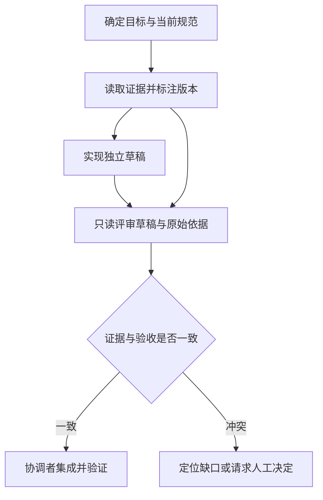

# 多 Agent 协作、上下文隔离与冲突处理知识点讲义

## AGENT-07 多 Agent 拆分、协调、隔离与合并

一个团队让三个 Agent 研究上传限制、实现表单、审查结果。研究者找到旧版“最多 20 MB”，实现者按新版文档写成 10 MB，评审者只看两份总结，认为多数意见更可信，最后把正确实现改回旧规则。与此同时，为了方便协作，所有 Agent 都收到了本来只有协调者需要知道的用户资料。

更多执行者增加了并行机会，也增加了交接、冲突和信息传播的路径。本篇从这次协作出发，解释何时值得拆分、交给每个角色什么、结果怎样验收，以及取消后如何拒绝旧任务的迟到产物。读完应能比较单 Agent、普通工作流和多 Agent 的成本，避免把角色数量当作质量保证。

### 学习前先确认

- 直接前置：[AGENT-01 Agent 循环、规划、停止与恢复](../chinese-guides/agent-01-loop-planning-stopping-recovery.md#agent-01)，理解单个执行单元的目标、预算、停止条件与检查点。

### 一、先找能够独立完成的工作，再决定角色数量

**多 Agent 系统（Multi-Agent System）**由多个各自推进任务的执行单元协作完成目标。它们可以使用同一个模型，也可以采用不同实现；协调者负责分工、依赖、预算、结果验收和冲突处理。仅在同一提示里写三个角色名，不会自动产生独立状态或权限。

开头的任务并非三步都能同时开始。研究确定当前规范后，实现才有稳定依据；评审至少要拿到实现产物与验收条件。如果让三者一开始同时猜规则，看似并行，后续返工可能比串行更慢。

真正独立的工作可以并发，例如分别核查客户端和服务端对同一已确定限制的处理；依赖同一尚未确定决策的工作应先等待。画任务图时，边表示需要哪个产物、哪个版本，而不是“谁职位更高”。图中出现环，要先明确怎样切成可完成阶段，不能让角色互相等待直到预算耗尽。



这张图选择顺序依赖较强的情境，用来说明多角色也可能主要串行。若只是把一个字段改名，普通脚本或单 Agent 往往足够；若需独立搜索多个领域，分支可能带来收益。评估时比较相同目标与预算下的成功率、耗时、费用和人工返工，而不是只展示一次最快演示。

### 二、任务信封让子任务可以被验收

**任务信封（Task Envelope）**是交给某个执行者的明确工作合同。它说明目标、输入版本、范围、允许能力、预算、截止条件和预期证据。字段名由应用设计，不是 MCP 的通用多 Agent 消息格式。

“帮忙看看上传功能”无法验收。更清晰的任务是：“只读检查草稿 patch-7 是否拒绝超过当前策略 10 MB 的文件；依据 policy-v2；返回发现、证据位置和未覆盖范围；不修改源文件，不发布。”这样，评审者知道该检查什么，协调者也知道怎样判断是否完成。

返回内容应包括状态、产物引用、基础版本、主张与证据对应、未决事项、已发生副作用和已消耗预算。自然语言摘要用于阅读，不能替代产物本身。产物引用应指向有版本与访问控制的存储，而不是某个 Agent 私有上下文里“已经写好”的一段话。

同一子任务重试沿用逻辑任务身份，新的尝试另有 attempt。父任务修改目标时增加父版本，旧尝试的结果不能自动当成新目标的完成证据。不要用模型生成的一句“符合要求”直接标记任务完成，完成条件的设计见 [可核验目标](../chinese-guides/agent-01-loop-planning-stopping-recovery.md#二目标必须变成能够核验的完成条件)。

### 三、裁剪上下文和限制能力要同时做

**上下文隔离（Context Isolation）**让每个 Agent 只获得完成当前子任务所需的信息，并限制它能继续访问的资源。把敏感字段从初始提示里删掉，只减少一次暴露；如果它仍持有读取整个数据库的凭据，隔离就没有真正落到访问路径。

研究者可以读取公开规范，实现者可写自己的草稿分支，评审者读取产物与规范但不能直接修改被审对象。协调者拥有集成职责，也不因此需要把生产密钥放进全部上下文。子权限应是父授权与本次任务政策的交集；继续委派也只能收窄，不能扩张。

保存为 `delegation-budget.mjs`，使用 Node.js 22 执行。输入是合成上下文；角色政策与预算是应用规则。代码只演示投影与分配，不启动 Agent、不给真实凭据，也不提供操作系统沙箱。

```js example=agent07-delegation-budget
const parent = {
  version: 4, goal: '核对上传限制', policy: 'policy-v2',
  patch: 'patch-7', privateContact: 'synthetic-private@example.test',
  capabilities: ['read-policy', 'read-patch', 'write-draft'],
};
const policies = {
  research: { fields: ['goal', 'policy'], capabilities: ['read-policy'] },
  review: { fields: ['goal', 'policy', 'patch'], capabilities: ['read-policy', 'read-patch'] },
};
const budget = { total: 12, integrationReserve: 2, allocated: 0 };
const dispatched = new Map();
function delegate(id, role, units) {
  const rule = policies[role];
  if (!rule || !Number.isSafeInteger(units) || units <= 0) return { status: 'invalid' };
  const prior = dispatched.get(id);
  if (prior) return prior.role === role && prior.units === units
    ? { status: 'replayed', envelope: prior } : { status: 'id-conflict' };
  if (budget.allocated + units > budget.total - budget.integrationReserve) return { status: 'budget-stop' };
  const envelope = { id, role, units, parentVersion: parent.version,
    context: Object.fromEntries(rule.fields.map(field => [field, parent[field]])),
    capabilities: rule.capabilities.filter(capability => parent.capabilities.includes(capability)) };
  budget.allocated += units;
  dispatched.set(id, envelope);
  return { status: 'allocated', envelope };
}
const research = delegate('research-1', 'research', 4);
const review = delegate('review-1', 'review', 4);
console.log(Object.keys(review.envelope.context).join(','));
// => goal,policy,patch
console.log(review.envelope.capabilities.join(','));
// => read-policy,read-patch
console.log('privateContact' in research.envelope.context);
// => false
console.log(delegate('research-1', 'research', 4).status, budget.allocated);
// => replayed 8
console.log(delegate('review-2', 'review', 4).status);
// => budget-stop
```

评审者拿到了目标、规范和草稿引用，没有获得联系人或写能力。重复投递同一任务不再次扣分配额度；再开一个相同规模的评审会超过可分配预算，保留的集成额度也不会被分支抢走。这里的单位是合成预算，不是实际 token 或金额。

生产中还要在工具执行端校验能力，并用独立凭据、受控文件范围或沙箱限制访问。上下文中的 `capabilities` 数组只是说明，不能阻止任意代码访问宿主资源。并发预算分配需原子更新，未用额度如何归还也要依据实际结算；不能由子 Agent 自报“没有花钱”就重复释放。

### 四、共享产物需要版本与写入归属

如果研究者与实现者同时修改同一份规则文件，即使提示都写了“不要冲突”，也可能覆盖彼此。更容易管理的方式是分配独立产物或工作区，由一个集成者合并共享文件；必须共享可变对象时，用版本条件、锁或明确的字段所有权保护。

任务开始时记录输入版本，提交时说明产物基于哪份输入。原始规范从 v2 更新到 v3 后，旧评审不能直接给新补丁盖章；可以复用仍适用的观察，但必须重新判断变更影响。聊天消息里说“我改好了”也不能替代实际文件差异或存储回执。

消息可能重复、乱序或晚到。分派和结果应带任务、尝试、父版本与消息身份，协调者检查任务是否仍接受结果，再决定是否采用。来源内容不因被子 Agent 摘要就变可信，详见 [摘要与记忆中的来源身份](../chinese-guides/aiapp-07-prompt-injection-untrusted-content.md#五摘要和记忆不能洗掉原来的数据身份)。

大型产物用受权引用传递，避免把文件全文反复复制到每段对话。引用失效时明确缺口，不让汇总者凭记忆补写。删除或撤销源数据时，相关摘要与下游产物也需标记失效，不能让“协作缓存”成为数据撤回的旁路。

### 五、冲突先找证据差异，再决定采用什么

**冲突仲裁（Conflict Arbitration）**依据原始证据、版本和验收标准处理不一致结果。它可以选择一份结果、合并互补部分、安排有边界的补查，或请求有责任的人决定；不是让最后到达的消息覆盖前一份，也不是简单多数投票。

先问冲突来自哪里：20 MB 与 10 MB 是否引用不同版本？一个结果说客户端校验通过，另一个说服务端失败，是否实际在检查不同层？两份都引用同一错误摘要，不能算独立证据。角色名称不同也不会自动消除相关错误。

保存为 `evidence-arbitration.mjs`，执行 `node evidence-arbitration.mjs`。可信资料仓库在本例中是固定 Map，当前任务只接受 v2；示例验证结构化数值主张，不验证任意自然语言真假。

```js example=agent07-evidence-arbitration
const sources = new Map([
  ['policy-v1', { version: 1, maxUploadMB: 20 }],
  ['policy-v2', { version: 2, maxUploadMB: 10 }],
]);
const task = { parentVersion: 4, sourceVersion: 2, accepting: true };
const accepted = new Map();
function review(report) {
  if (!task.accepting || report.parentVersion !== task.parentVersion) return 'obsolete';
  const source = sources.get(report.sourceId);
  if (!source) return 'missing-source';
  if (source.version !== task.sourceVersion) return 'stale-source';
  if (report.maxUploadMB !== source.maxUploadMB) return 'unsupported-claim';
  const previous = accepted.get(report.id);
  if (previous) return JSON.stringify(previous) === JSON.stringify(report) ? 'duplicate' : 'id-conflict';
  accepted.set(report.id, { ...report });
  return 'accepted';
}
const current = { id: 'r-1', parentVersion: 4, sourceId: 'policy-v2', maxUploadMB: 10 };
console.log(review({ ...current, id: 'old', sourceId: 'policy-v1', maxUploadMB: 20 }));
// => stale-source
console.log(review({ ...current, id: 'forged', maxUploadMB: 999 }));
// => unsupported-claim
console.log(review({ ...current, id: 'missing', sourceId: 'invented' }));
// => missing-source
console.log(review(current), review(current));
// => accepted duplicate
task.parentVersion = 5;
console.log(review({ ...current, id: 'late' }));
// => obsolete
console.log(accepted.size);
// => 1
```

旧版 20 MB 被拒绝，因为任务要求当前规范；伪造 999 MB 即使引用存在，也没有证据支持。正确结果重复到达不会重复采用，父任务改版后迟到结果退出。示例没有让模型对另一模型投票，判断直接回到原始事实。

真实仓库还需验证来源权限、产物完整性和报告提交者，不能允许 Agent 自己改写验证所依据的“可信 Map”。代码成果应依据实际差异和运行结果，研究结论应核对来源与适用条件；有争议的产品取舍需要记录选择理由，无法自动判定时保留冲突，而不是合成一句貌似一致的结论。

### 六、计划变化与取消要阻止迟到结果覆盖

父任务从“检查团队内上传”改成“检查公开上传”时，先找受影响的分支。与受众有关的研究和评审需要重新核对，纯粹的文件大小解析工具可能仍可复用。是否复用由输入与证据适用性决定，不是简单看哪个子 Agent 已经说完成。

取消时停止新委派，向相关执行者传递取消，并记录已完成、在途和未知动作。父任务可以进入“正在收敛”状态，等待必要对账；不能页面显示取消，后台却继续集成旧产物。上例的 accepting 与 parentVersion 只是采用结果的门槛，真正停止工具还需要执行端传播与检查。

子任务失败通常只影响依赖它的后继，不必重做所有成功兄弟节点。无副作用的分析可按预算重试，未知写入先对账；达到截止时间时给出部分成果与未完成原因。跨连接长任务的取消语义见 [Tasks 的取消边界](../chinese-guides/agent-06-tasks-long-running-recovery-idempotency.md#五取消请求被收到不等于任务已经取消)。

协调者重启后，需要从持久任务图、分派记录、产物和预算恢复。Promise.all 只能组织当前进程中的等待，不会替系统持久保存任务，也不会自动取消其他 Promise。租约过期的新执行者接管时，还要防止旧执行者继续提交；具体恢复逻辑沿用单 Agent 的检查点和业务幂等边界。

### 七、模型调用、MCP 工具与协作协议各有职责

多 Agent 可以由应用直接调用模型供应商接口来运行各自循环，再通过 MCP 使用外部工具。模型请求、工具调用和子任务交接是不同接口；名为“Agent”的服务也不意味着自动实现跨组织协作协议。

2026-07-28 的 MCP 发布说明已将 Sampling 标为弃用，仍处于兼容期，不能说它已经从所有实现中立即消失；新系统不应以 MCP Sampling 作为主要模型编排通道。直接模型调用也不是无条件安全，仍需限制数据发送范围、凭据、费用和输出用途。模型接入边界复用 [AIAPP-01](../chinese-guides/aiapp-01-model-interface-instructions-context-boundaries.md#aiapp-01)。

跨组织 Agent 会带来额外的数据用途、留存、删除和身份边界。交接之前确认接收方和授权，返回结果按外部输入处理。不能因为对方名称是“审核专家”就授予生产写权限，也不能因为双方使用同一协议就认为数据保护条件相同。

最终汇总器只组织已经核验的产物，说明剩余缺口与冲突。三个 partial 不会相加成 complete；多个 Agent 同意也不能替代有权主体的高风险审批。将外部发布等动作留给明确的执行入口，有助于让协作成果与业务副作用分别审查。

### 八、用同等预算比较收益，让稳定步骤逐渐固定下来

先用普通工作流或单 Agent 完成代表任务，再尝试多 Agent，观察独立探索是否减少遗漏、并行是否真的缩短时间、集成是否带来新错误。模型、输入规模与预算要尽量可比，否则质量提升可能只来自更多 token 与重试，而不是协作结构。

指标围绕任务结果：可核验主张比例、重复工作、过期产物、人工修改、总费用与尾部等待。权限泄露、绕过审批和未验证发布应作为独立失败，即使最终回答写得流畅也不能抵消。保留集成与验证预算，避免所有分支把额度耗尽后只剩一个未经核验的汇总。

不需要为每次小任务创建完整团队。重复稳定的步骤可以固化为确定性检查器，开放性判断保留为有界子任务。角色、权限矩阵、交接格式和原始证据比角色数量更值得维护；新增一个 Agent 之前，先指出它负责哪个尚未覆盖且可验收的问题。

### 自检问题

1. 研究、实现、评审为什么不总能同时开始？
2. 初始提示不含敏感字段，为什么还不能证明隔离完成？
3. 两个角色引用同一错误摘要，多数意见为什么不能证明事实？
4. 父目标已改变，哪些旧产物可以复用，哪些必须退出采用？

### 参考与延伸阅读

- [Anthropic：多 Agent 研究系统的工程经验](https://www.anthropic.com/engineering/multi-agent-research-system)：了解一个具体产品的分工、协调和成本取舍，不将其内部评测推广成所有任务的收益保证。
- [MCP 2026-07-28 发布说明](https://blog.modelcontextprotocol.io/posts/2026-07-28/)：查 Sampling 的弃用状态与兼容期，区分工具协议和模型编排。
- [LangGraph：Persistence](https://docs.langchain.com/oss/javascript/langgraph/persistence)：对照任务状态与跨线程存储的实现方式；框架持久层不自动解决任务授权或冲突仲裁。

核对日期：2026-10-05。示例中没有真正并行 Agent、模型服务或权限沙箱；字段过滤、预算和数值证据检查的结果不能扩张为完整安全隔离保证。
