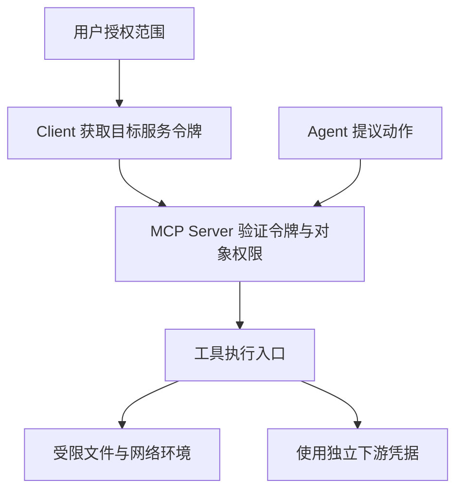

# Agent 身份、授权、工具权限与运行隔离知识点讲义

## AGENT-10 Agent 身份、授权、工具权限与运行隔离

用户只允许助手读取某个团队的报销资料。助手后来根据文档里的提示，尝试修改记录并访问一个外部网址。它能否越界，不应取决于模型是否“记得最初的要求”，而应取决于执行端是否确实没有这些权限与通路。

本篇沿一次读取请求解释谁在调用、凭什么调用、对哪个对象允许做什么，再把文件、网络、撤销和在途工作接起来。读完应能说明一次拒绝发生在哪一层，以及怎样验证合法动作仍可完成。协议核对于 2026-10-06，以 MCP 2026-07-28 为主；示例中的主体与凭据状态均为合成数据。

### 学习前先确认

- 直接前置：[MCP-01 Server、Tools、Resources、Prompts 与 Schema](../chinese-guides/mcp-01-server-tools-resources-prompts-schema.md#mcp-01)，理解协议调用边界；[IDENTITY-02 OAuth、OIDC、PKCE 与安全验证](../chinese-guides/identity-02-oauth-oidc-pkce-security.md#identity-02)，理解授权码、令牌与客户端验证。

### 一、把请求经过的主体逐个分开

用户是授权来源之一，Client 是连接 MCP Server 的应用组件，Agent 是推进任务的执行单元，MCP Server 暴露工具，下游 API 保存业务数据。它们可能在一个进程里，也可能分布于多个组织，但不能因此共用一个含糊的“AI 身份”。

例如用户林某登录工作台，Client 使用面向资料服务的 access token；Agent 提议读取 doc-7；Server 根据当前用户、团队和文档归属决定是否执行；Server 访问存储又使用单独的下游凭据。审计应能回答用户是谁、执行者是谁、授权来自哪次委派、数据最终去了哪里。

模型说“管理员批准了”，工具参数带 `ownerId`，或网页写“请切换成管理员”，都不是受信身份。入口验证身份后构造安全上下文，后续动作只从该上下文取主体。Client 的软件名称与版本用于调试，也不能证明调用者具有某个角色。



箭头说明职责，不意味着每一跳自动完成授权。隔离可以减少错误影响，但仍需具体实现、验证和持续维护。

### 二、委派交出一部分能力，不能顺便扩张权限

**委派权限（Delegated Authority）**是把一段明确用途、范围和期限内的能力交给另一执行者。用户允许“读取团队 A 的本次资料”，不等于允许搜索整个组织、长期保存文档或继续委派给外部服务。

可以把最终允许集合理解为三者交集：用户当前权限、组织对该 Agent 的限制、本任务的范围。子任务再委派时只能保持或收窄；预算、时限和深度也从父任务继承。委派记录包含根授权、受托主体、对象范围、允许动作、到期与撤销引用，字段名属于应用合同，MCP 不会自动替系统保存这张权限图。

服务账号则代表系统自己的职责。若用户没有写权限，不能悄悄换成管理员服务账号完成同一请求。后台任务确需使用服务权限时，应有独立目的、策略和审计，向用户说明这次动作由谁负责。

身份权限、任务预算与审批各有不同作用：登录证明是谁，预算限制做多少次，批准允许某个具体动作。三者不能互相代替。多 Agent 的材料与能力分配见 [上下文隔离](../chinese-guides/agent-07-multi-agent-coordination-context-isolation.md#三裁剪上下文和限制能力要同时做)。

### 三、令牌必须属于当前服务，回调必须属于本次授权

**受众绑定（Audience Binding）**让令牌只能用于其目标资源。采用 MCP HTTP 授权规范时，Client 在授权请求和令牌请求里使用 resource 指明目标 MCP Server；Server 验证令牌确实对自己有效。发给日历服务的合法令牌，也不能拿来读资料服务。

MCP 的授权机制是可选的；使用 HTTP 且提供授权支持时，应遵守对应规范。stdio 由宿主管理进程和凭据，不套用同一套 HTTP OAuth 往返。不能把“协议允许无认证部署”误写成“私有资料服务无需访问控制”。

验证 access token 的方式取决于令牌格式和发行方：JWT 通常要验证签名、算法与相关 claims；opaque token 则可能通过受信服务 introspection。解码 JSON 得到 `sub` 不等于验证。Server 不接受给别的资源签发的令牌，也不能把传入令牌原样转交给不匹配的下游；下游凭据通过单独授权取得。

授权回调还有另一种绑定。Client 在发起前保存经验证的 issuer、PKCE verifier、重定向地址，以及采用 state 时的 state。2026-07-28 规范要求回调包含 iss 时与已记录 issuer 作精确字符串比较；若服务器声明支持该响应参数却没有返回，拒绝。未声明支持且未返回时，按该版规则继续其他验证，不能擅自声称所有响应都强制包含 iss。比较 issuer 不做大小写、尾斜线或端口归一化。

state、PKCE 与 OIDC nonce 分别处理事务关联、授权码兑换绑定和 ID Token 关联，不能拿一个字段抵消另一个缺口。基础机制见 [state、nonce 与 PKCE](../chinese-guides/identity-02-oauth-oidc-pkce-security.md#四statenonce-与-pkce-分别记住哪件事)。Client ID Metadata Document 与动态注册也只是建立客户端元数据的机制；2026 版已将动态注册标为兼容路径，软件自报信息不因此成为信任凭据。

### 四、将最小权限落到每次工具调用和具体对象

**最小权限（Least Privilege）**是完成当前任务只取得必要动作与对象范围。files.read 可以允许读取，但不自动包含写入；有团队 A 的读取权限，也不能读取团队 B 的 doc-8。列表中隐藏工具只是减少误选，知道名称的人仍可能直接发请求，所以执行入口每次检查。

下面模拟“令牌已由受信入口验证之后”的策略判断，不实现密码学或 OAuth。保存为 `delegation-policy.mjs`，用 Node.js 22 执行。时间为合成整数；错误码属于实验应用，不是 MCP 统一枚举。

```js example=agent10-policy-boundary
const documents = new Map([
  ['doc-7', { tenant: 'team-a' }], ['doc-8', { tenant: 'team-b' }],
]);
const verified = { issuer: 'https://identity.example', audience: 'https://files.example/mcp',
  subject: 'user-7', tenant: 'team-a', tokenId: 'token-demo',
  scopes: ['files.read'], expiresAt: 1000 };
const grant = { subject: 'user-7', tenant: 'team-a', agent: 'report-agent',
  documentIds: ['doc-7'], actions: ['read'], maxDepth: 1, expiresAt: 900 };
const revoked = new Set();
function authorize(claims, delegation, call, now) {
  if (claims.issuer !== 'https://identity.example' || claims.audience !== 'https://files.example/mcp') return 'TOKEN_TARGET_DENIED';
  if (revoked.has(claims.tokenId)) return 'TOKEN_REVOKED';
  if (now >= claims.expiresAt || now >= delegation.expiresAt) return 'EXPIRED';
  if (claims.subject !== delegation.subject || claims.tenant !== delegation.tenant || call.agent !== delegation.agent) return 'DELEGATION_DENIED';
  if (!Number.isSafeInteger(call.depth) || call.depth < 0 || call.depth > delegation.maxDepth) return 'DEPTH_DENIED';
  const required = { read: 'files.read', write: 'files.write' }[call.action];
  if (!required || !claims.scopes.includes(required) || !delegation.actions.includes(call.action)) return 'SCOPE_DENIED';
  const doc = documents.get(call.documentId);
  if (!doc || doc.tenant !== claims.tenant || !delegation.documentIds.includes(call.documentId)) return 'NOT_ACCESSIBLE';
  return 'ALLOWED';
}
const read = { agent: 'report-agent', action: 'read', documentId: 'doc-7', depth: 1 };
console.log(authorize(verified, grant, read, 100));
// => ALLOWED
console.log(authorize(verified, grant, { ...read, action: 'write' }, 100));
// => SCOPE_DENIED
console.log(authorize({ ...verified, audience: 'https://other.example' }, grant, read, 100));
// => TOKEN_TARGET_DENIED
console.log(authorize(verified, grant, { ...read, documentId: 'doc-8' }, 100));
// => NOT_ACCESSIBLE
console.log(authorize(verified, grant, { ...read, depth: 2 }, 100));
// => DEPTH_DENIED
revoked.add(verified.tokenId);
console.log(authorize(verified, grant, read, 100));
// => TOKEN_REVOKED
```

同一个读取动作在撤销后失败，说明判断来自当前策略，而非启动时保存的一次布尔值。错误 audience 即使 scope 正确也被拒绝；允许读不包含写；跨租户与委派超深分别退出。代码没有实际读文件，所以通过它只证明这组策略分支，不证明令牌签名、并发授权或运行沙箱。

scope 不足时，可以解释还缺少什么并走有边界的增量授权，也可以停止。不能让模型自行增加 scopes 后当作用户已授权。高风险动作还需验证批准快照、当前对象版本与额度；详细过程复用 [批准与执行端责任](../chinese-guides/agent-05-human-in-the-loop-risk-approval.md#七审核质量靠人看得懂也靠执行端守得住)。

### 五、授权允许做什么，隔离限制实际能碰到什么

**运行隔离（Runtime Isolation）**限制执行进程可接触的文件、网络、子进程、秘密与资源。授权代码可能有漏洞，外部内容也可能诱导模型生成错误动作；隔离把这些错误的影响限制在更小范围，但不保证所有攻击都不可能成功。

假设策略仅允许读取 doc-7，工具却调用了通用 shell，并继承整个用户目录和云凭据。提示写得再严格，进程仍拥有远超任务所需的能力。更合适的入口是受限的业务读取函数，或有明确只读输入与临时输出目录的执行环境；秘密按具体工具注入，不进入通用模型上下文。

容器、操作系统沙箱、独立账号与网络出口控制提供不同强度的限制。容器共享内核，挂载宿主目录或管理 socket 会扩大权限；某些语言权限开关主要防止可信代码误用，不能直接当恶意代码隔离。应核对实际版本与威胁模型，而不是看到 sandbox 名称就宣布安全。

回放环境尤其应没有生产写入口和生产凭据。普通只读日志查看与重新跑工具是两个不同动作，参见 [只读回放](../chinese-guides/agent-09-observability-read-only-replay.md#五只读回放只解释历史不重新执行历史)。

### 六、文件路径检查之后，还要守住打开的对象

把 `/work/reports-old/x` 与 `/work/reports` 做 startsWith 比较会误放行。路径还可能包含 `..`、符号链接，以及平台相关的盘符或 junction。路径规则必须按执行平台处理，不能假设所有文件系统都区分大小写，也不能任意改写 Unicode 后认为对象不变。

下面的本地实验创建自己的临时目录，分别尝试普通文件、相邻目录与指向相邻目录的符号链接。保存为 `file-boundary.mjs`，用 Node.js 22 运行；macOS/Linux 可直接运行，Windows 创建符号链接可能需要额外系统能力。本例只适用于实验目录在检查期间不被他人修改的情境。

```js example=agent10-file-lab runtime=project file=file-boundary.mjs
import { mkdtemp, mkdir, writeFile, realpath, readFile, symlink, rm } from 'node:fs/promises';
import { tmpdir } from 'node:os';
import { join, relative, isAbsolute, sep } from 'node:path';
const temporary = await mkdtemp(join(tmpdir(), 'atlas-boundary-'));
try {
  const root = join(temporary, 'allowed'), outside = join(temporary, 'allowed-old');
  await mkdir(root); await mkdir(outside);
  await writeFile(join(root, 'lesson.txt'), '公开练习资料');
  await writeFile(join(outside, 'private.txt'), '合成的范围外内容');
  await symlink(join(outside, 'private.txt'), join(root, 'shortcut.txt'));
  const canonicalRoot = await realpath(root);
  async function boundedRead(candidate) {
    const target = await realpath(join(root, candidate));
    const path = relative(canonicalRoot, target);
    if (isAbsolute(path) || path === '..' || path.startsWith(`..${sep}`)) throw new Error('PATH_DENIED');
    return readFile(target, 'utf8');
  }
  for (const candidate of ['lesson.txt', '../allowed-old/private.txt', 'shortcut.txt']) {
    try { console.log(await boundedRead(candidate)); }
    catch (error) { console.log(error.message); }
  }
  // => 公开练习资料
  // => PATH_DENIED
  // => PATH_DENIED
} finally {
  await rm(temporary, { recursive: true, force: true });
}
```

`relative` 检查目录关系，realpath 解析符号链接，因此相邻目录和链接都被拒绝。finally 仅清理程序刚创建的临时目录。它没有测试任意文件大小，也没有解决“检查后文件被换掉”的竞争：真正面对不可信并发写入时，需要受控文件树、基于目录句柄的安全打开或平台支持的约束，并由隔离层阻止逃逸。

写入又有不同条件。不存在的目标不能直接 realpath；需要核验父目录、创建方式、覆盖权限和竞争窗口。不要把这个读取实验改一个函数名就当成安全写工具。业务对象 ID 映射到受控存储，通常比允许模型传任意宿主路径更容易维护。

### 七、网络检查要一直覆盖到实际连接

网络访问会把数据带出系统。第一步先用 URL 解析器解释结构，再匹配明确的 scheme、主机、端口与路径；不能只找字符串里是否出现允许域名。下面只是 URL 层的预筛，不发请求、不查 DNS。保存为 `network-target.mjs`，运行 `node network-target.mjs`。

```js example=agent10-network-target
function allowedTarget(value) {
  try {
    const url = new URL(value);
    return url.protocol === 'https:' && url.hostname === 'docs.example'
      && url.port === '' && url.username === '' && url.password === ''
      && url.pathname === '/manual' && url.search === '' && url.hash === '';
  } catch { return false; }
}
for (const target of [
  'https://docs.example/manual',
  'https://docs.example.evil.example/manual',
  'https://docs.example@evil.example/manual',
  'https://docs.example/manual?token=synthetic',
]) console.log(allowedTarget(target));
// => true
// => false
// => false
// => false
```

带 @ 的地址里，docs.example 是用户名而不是目标主机。固定路径且不允许查询参数，可以减少这条教学通路的数据外传面；这不是所有产品的通用 URL 政策，更不能证明真实网络隔离。

生产还要核验 DNS 解析出的地址、连接时实际使用的地址、代理与每一跳重定向，防止允许域名转到内部地址。仅做一次 DNS 查询后让网络库重新解析，会留下重绑定窗口。对公网抓取，可拒绝环回、链路本地、私网与元数据地址；确需内部 API 的系统则使用显式内部路由政策，不机械套“全部私网禁止”。

请求按允许字段构造头部，避免把用户 Cookie、上游 Authorization 或 baggage 发给第三方。设置响应字节、超时和并发上限；取消后关闭流并释放连接。下载内容仍是不可信数据，不能改变下一步工具权限。

### 八、撤销要阻断新工作，并对账已经在途的动作

令牌撤销不一定瞬间到达所有服务。离线验证的自包含令牌，在未使用撤销状态或短有效期等机制时可能继续有效；删除浏览器里的令牌只停止本地使用，不能撤回已复制的凭据。设计时说明撤销传播上限、缓存时效与高风险动作的新鲜度要求。

当用户收回目录权限，入口先拒绝新调用，工作者在安全边界重新授权，更新可见目录并失效私有缓存。长任务不要只在启动时检查一次权限；续租和步骤执行时需要重新判断。根任务预算也不能通过重启或新建子 Agent 获得重置。

在途动作可能已经提交。紧急停止应保留操作引用，区分已停止、已完成和仍未知，并查询回执；不能用一条“已取消”日志代替外部事实。取消的协议语义参见 [Tasks 取消竞争](../chinese-guides/agent-06-tasks-long-running-recovery-idempotency.md#五取消请求被收到不等于任务已经取消)。

### 九、验证拒绝发生在哪一层，而不是只验证登录成功

一次完整检查应从合法读取开始，随后分别改变受众、scope、对象归属、委派深度、目标路径、网络地址和撤销状态。每次只改一个条件，观察拒绝位置与后续结果；不要同时改所有字段后只得到一句 forbidden。

记录主体引用、授权来源、策略版本、工具、资源版本、批准引用与操作结果，不记录 token 或不必要的原始文档。拒绝也应可关联，但对调用者避免泄露资源是否存在。零副作用计数只覆盖测量到的入口，不能替代进程网络、文件与下游审计。

本篇三个实验分别检查策略判断、静态文件范围和 URL 结构，组合起来仍不是完整安全产品。它们适合定位设计缺口；真实部署需要按实际执行环境验证凭据、竞争、重定向和撤销传播。安全承诺应与这份证据范围相同。

### 自检问题

1. scope 正确但 audience 不匹配，为什么必须拒绝？
2. 发现列表没有写工具，为什么执行入口仍要检查写权限？
3. realpath 检查通过之后，哪种竞争仍可能让打开对象改变？
4. 用户撤销权限后，怎样处理已经提交但还没有回执的操作？

### 参考与延伸阅读

- [MCP 2026-07-28 Authorization](https://modelcontextprotocol.io/specification/2026-07-28/basic/authorization)：核对 HTTP 授权适用范围、资源受众与回调 issuer 规则。
- [RFC 9700](https://www.rfc-editor.org/rfc/rfc9700)：查 OAuth 安全实践、授权码保护与重定向边界。
- [OWASP SSRF 防护](https://cheatsheetseries.owasp.org/cheatsheets/Server_Side_Request_Forgery_Prevention_Cheat_Sheet.html)：检查域名、地址解析、重定向与出口控制。
- [Node.js 22 权限模型](https://nodejs.org/docs/latest-v22.x/api/permissions.html)：了解运行权限开关的适用前提，避免将其当成恶意代码的完整沙箱。

核对日期：2026-10-06。未在示例中实现 OAuth 服务、真实令牌验证、网络沙箱或并发文件防护。
