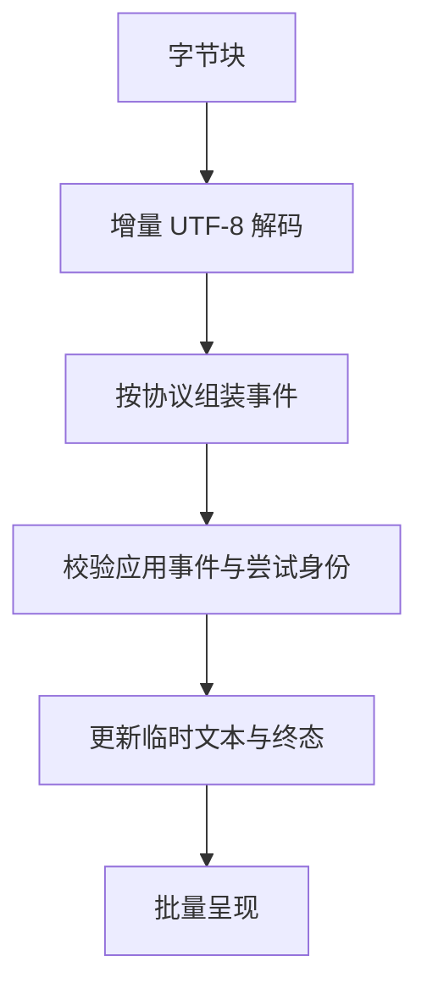

# AI 流式传输与增量界面知识点讲义

## AIAPP-02 流式响应、SSE 与增量渲染

回答已经显示了“资料每周”，连接忽然断了。页面应该显示“完成”，还是“未完成”？另一边，用户取消后开始编辑自己的草稿，旧请求的最后一段又到了。直接把每个 chunk 追加到页面，既不能判断第一种情况，也保护不了第二种情况。

本讲沿字节、事件、业务状态和显示四层建立流式模型，再分别运行分块解析与桌面状态实验。读完后，你应能解释中文为什么会被切开、终态为什么需要明示、取消和恢复怎样保护已有工作。

### 学习前先确认

- 直接前置：[AIAPP-01 模型接口、指令与上下文边界](../chinese-guides/aiapp-01-model-interface-instructions-context-boundaries.md#aiapp-01)。需要区分任务、尝试、内容块和模型接口的结束原因。
- 直接前置：[NET-01 浏览器网络、Fetch 与可靠性](../chinese-guides/net-01-browser-network-fetch-reliability.md#net-01)。需要理解流读取、取消、重试和未知结果。

### 一、网络给的是字节，不是完整答案

HTTP 响应的一个 chunk 可能只有半个 UTF-8 汉字，也可能装了多条完整事件。解码后的文本仍可能只有半行 SSE 或半个 JSON。供应商的一次 delta 又不一定等于一个模型 token。不能拿 `reader.read()` 的一次结果作为业务消息边界。



例如“你”在 UTF-8 中占三个字节。三个字节分两次到达时，独立解码每次输入可能产生替代字符；同一个 TextDecoder 使用 streaming 模式则能等待后半部分。输入结束时还要 flush 解码器，但这只结束字节解码，不能凭空补上一条业务 completed。

### 二、SSE 的分隔规则与应用的完成规则分开

**服务器发送事件（Server-Sent Events）**使用 UTF-8 的 `text/event-stream`。字段包括 data、event、id 和 retry；空行结束事件，多行 data 以换行组合，冒号开头是注释。行结尾允许 LF、CRLF 或 CR。字段名区分大小写，冒号后至多移除一个空格。

尤其要分清文件结束与事件结束：没有最后空行的待处理事件应丢弃，不能因为 EOF 就派发。SSE 的 id 是不透明标识，可以继承前一值；它不是自动递增的序号。`[DONE]` 是某些厂商使用的载荷约定，不是 SSE 规范定义的通用结束事件。

原生 EventSource 建立 GET 事件连接，可自动重连，接口没有任意请求体或自定义请求头参数。需要 POST、JSON 请求体或自定义认证头时，常用 fetch 读取流并自行处理协议。WebSocket 适合频繁双向交互，但恢复、预算和状态同样要设计。文本生成并不因为“实时”就必须用 WebSocket。

自动重连只说明重新连接。服务端必须保留事件、理解 Last-Event-ID 并授权原任务，才能恢复原业务；否则可能重新生成一份不同答案。使用 fetch 不会自动获得 EventSource 的重连机制。

### 三、把不同切块方式送入同一个解析器

保存为 `sse-frames.mjs`，用 Node.js 22 运行，也可整体在现代浏览器控制台执行。它解析合成字节流，没有发网络请求。实验处理 data、event、id、注释及三种行尾；retry 留给真实连接层，因此忽略，不实现重连或完整 EventSource。

```js example=aiapp02-sse-frames
function parseChunks(chunks) {
  const decoder = new TextDecoder();
  const events = [];
  let line = '', data = [], type = '', id = '', skipLF = false, total = 0, eventSize = 0;
  function processLine(value) {
    if (value === '') {
      if (data.length) events.push({ type: type || 'message', id, data: data.join('\n') });
      if (events.length > 64) throw new Error('too_many_events');
      data = []; type = ''; eventSize = 0;
      return;
    }
    if (value.startsWith(':')) return;
    const colon = value.indexOf(':');
    const field = colon < 0 ? value : value.slice(0, colon);
    let payload = colon < 0 ? '' : value.slice(colon + 1);
    if (payload.startsWith(' ')) payload = payload.slice(1);
    if (field === 'data') {
      eventSize += payload.length + 1;
      if (eventSize > 8192) throw new Error('event_too_large');
      data.push(payload);
    } else if (field === 'event') type = payload;
    else if (field === 'id' && !payload.includes('\0')) id = payload;
  }
  function consume(text) {
    total += text.length;
    if (total > 16384) throw new Error('stream_too_large');
    for (const char of text) {
      if (skipLF) { skipLF = false; if (char === '\n') continue; }
      if (char === '\r' || char === '\n') {
        processLine(line); line = ''; skipLF = char === '\r';
      } else {
        line += char;
        if (line.length > 4096) throw new Error('line_too_large');
      }
    }
  }
  for (const chunk of chunks) consume(decoder.decode(chunk, { stream: true }));
  consume(decoder.decode());
  // EOF 不派发未由空行结束的事件。
  return events;
}
const wire = ': heartbeat\r\nevent: text\r\nid: 7\r\ndata: 你\r\ndata: 好\r\n\r\ndata: 未结束';
const bytes = new TextEncoder().encode(wire);
const chunksOf = (size) => Array.from({ length: Math.ceil(bytes.length / size) },
  (_, i) => bytes.slice(i * size, (i + 1) * size));
const expected = JSON.stringify([{ type: 'text', id: '7', data: '你\n好' }]);
console.log([1, 2, 5, 17].every((size) => JSON.stringify(parseChunks(chunksOf(size))) === expected)); // => true
console.log(parseChunks(chunksOf(1))[0].data.replace('\n', '/')); // => 你/好
console.log(parseChunks([new TextEncoder().encode('data: a\r\r')]).length); // => 1
console.log(parseChunks([new TextEncoder().encode('data: a\n')]).length); // => 0
```

按一个字节切块时，中文和 CRLF 都被拆开，结果仍相同。没有空行的“未结束”不会成为第二条事件。把最后一个样本再补一个换行，才得到完整事件。这里的 data 是普通文本；只有应用约定它为 JSON 时，才在完整事件到达后 JSON.parse。

TextDecoder 默认对非法 UTF-8 使用替代字符；某个应用也可选择严格失败，但应明确这是自己的策略。本例的大小是字符串长度限制，真实网络入口还要限制字节数、时间、事件量和总输出。它没有覆盖网络背压、重连或所有协议一致性测试，不能直接称为生产 SSE 客户端。

### 四、应用事件需要连续位置与明确终态

在自定应用协议中，可以要求每条事件有 attemptId、连续 seq、type 与 payload。这里的连续序号是项目约定，不是 SSE 保证。单条 HTTP 连接保持接收字节顺序；出现应用事件 1、3、2，通常来自上游合并、重放或异步处理，不应归咎于 TCP 随机乱序。

下面是独立的事件状态实验。保存为 `event-state.mjs`，用 Node.js 22 运行。数据已视为通过固定事件结构校验，只推演身份、顺序和终态：

```js example=aiapp02-event-state
function createState(attempt) {
  let next = 1, text = '', status = 'streaming';
  const waiting = new Map();
  return {
    accept(event) {
      if (event.attempt !== attempt || status !== 'streaming') return;
      if (!Number.isInteger(event.seq) || event.seq < next || event.seq > next + 16) return;
      if (!waiting.has(event.seq)) waiting.set(event.seq, event);
      while (waiting.has(next)) {
        const current = waiting.get(next); waiting.delete(next); next += 1;
        if (current.type === 'delta') text += current.text;
        else if (current.type === 'completed') { status = 'completed'; waiting.clear(); break; }
      }
    },
    end() { if (status === 'streaming') { status = 'incomplete'; waiting.clear(); } },
    snapshot() { return `${status} / ${next - 1} / ${text}`; }
  };
}
const state = createState('a2');
const event = (seq, type, text = '') => ({ attempt: 'a2', seq, type, text });
state.accept(event(1, 'delta', '你'));
state.accept(event(3, 'completed'));
console.log(state.snapshot()); // => streaming / 1 / 你
state.accept({ ...event(2, 'delta', '旧'), attempt: 'a1' });
state.accept(event(2, 'delta', '好'));
state.accept(event(2, 'delta', '好'));
state.accept(event(4, 'delta', '迟到'));
console.log(state.snapshot()); // => completed / 3 / 你好
const broken = createState('a2');
broken.accept(event(1, 'delta', '半句')); broken.end();
console.log(broken.snapshot()); // => incomplete / 1 / 半句
```

收到 completed 但前面有缺口时，仍不能宣布文本完整；第二条补齐后才连续应用到第三条。重复与旧尝试被忽略，终态后不再追加。若结束前缺口没有补齐，就保持未完成，不能用“最大见过 seq”跳过丢失内容。

生产实现还要处理缺口超时、冲突重复、事件版本、工具与引用类型以及缓冲上限。相同 seq 却有不同内容应视为协议问题；本例只保留第一条，不证明冲突处理。使用已经验证的内部事件，才能让渲染组件专注于状态。

### 五、在桌面上观察取消与草稿保留

把完整页面保存为 `stream-lab.html`，用现代桌面浏览器打开，无需依赖。这里模拟的是应用事件到达，不是真实 SSE 或模型速度；上面的独立实验承担字节与帧解释。选择“中途断流”会保留部分文字并显示未完成。

```html example=aiapp02-stream-page runtime=project file=stream-lab.html
<!doctype html>
<html lang="zh-CN">
<meta charset="utf-8">
<title>流式状态观察页</title>
<style>
body { max-width: 900px; margin: 32px auto; font: 18px/1.6 system-ui; }
textarea { box-sizing: border-box; width: 100%; min-height: 90px; font: inherit; }
button, select { font: inherit; margin: 8px 8px 8px 0; }
#view { height: 240px; overflow: auto; border: 1px solid #53766b; padding: 12px; }
pre { white-space: pre-wrap; overflow-wrap: anywhere; margin: 0; }
:focus-visible { outline: 3px solid #a65b20; }
</style>
<h1>流式状态观察页</h1>
<p>合成事件，每 200ms 到达一段。下方备注独立保存，不会被生成替换。</p>
<label for="draft">我的备注</label><textarea id="draft">需要核对来源日期。</textarea>
<label for="mode">结束方式</label>
<select id="mode"><option value="complete">正常完成</option><option value="break">中途断流</option></select>
<div><button id="start">开始新尝试</button><button id="cancel" disabled>取消当前尝试</button>
<button id="latest">回到最新</button></div>
<p id="status" role="status">尚未开始</p>
<div id="view" tabindex="0" aria-label="生成预览"><pre id="output"></pre></div>
<script>
const start = document.querySelector('#start'), cancel = document.querySelector('#cancel');
const mode = document.querySelector('#mode'), status = document.querySelector('#status');
const view = document.querySelector('#view'), output = document.querySelector('#output');
let epoch = 0, controller, frame = 0, pending = '', following = true;
function flush() {
  cancelAnimationFrame(frame); frame = 0;
  if (pending) { output.append(document.createTextNode(pending)); pending = ''; }
  if (following) view.scrollTop = view.scrollHeight;
}
function pause(ms, signal) {
  return new Promise((resolve, reject) => {
    const stop = () => { clearTimeout(timer); signal.removeEventListener('abort', stop);
      reject(new DOMException('Cancelled', 'AbortError')); };
    const timer = setTimeout(() => { signal.removeEventListener('abort', stop); resolve(); }, ms);
    signal.addEventListener('abort', stop, { once: true });
    if (signal.aborted) stop();
  });
}
function stop() {
  if (!controller) return;
  epoch += 1; // 先使旧 success/catch/finally 无权改变页面。
  controller.abort(); controller = undefined; flush();
  cancel.disabled = true; status.textContent = '已取消；保留已收到的预览与备注';
}
view.addEventListener('scroll', () => {
  following = view.scrollHeight - view.clientHeight - view.scrollTop < 24;
});
document.querySelector('#latest').addEventListener('click', () => { following = true; flush(); });
cancel.addEventListener('click', stop);
start.addEventListener('click', async () => {
  stop(); const mine = ++epoch, aborter = new AbortController(); controller = aborter;
  output.replaceChildren(); pending = ''; following = true;
  const broken = mode.value === 'break';
  status.textContent = '生成中；尚未完成'; cancel.disabled = false;
  try {
    for (let i = 1; i <= 30; i += 1) {
      await pause(200, aborter.signal);
      if (mine !== epoch) return;
      if (broken && i === 12) { flush(); status.textContent = '未完成：模拟连接结束，未收到完成事件'; return; }
      pending += `第 ${i} 段：这是合成资料预览， 仍然是文字。\n`;
      if (!frame) frame = requestAnimationFrame(flush);
    }
    if (mine === epoch) { flush(); status.textContent = '已完成：已收到本实验的完成事件'; }
  } catch (error) {
    if (mine === epoch) { flush(); status.textContent = error.name === 'AbortError' ? '已取消' : '生成失败'; }
  } finally {
    if (mine === epoch) { controller = undefined; cancel.disabled = true; }
  }
});
window.addEventListener('pagehide', () => { stop(); cancelAnimationFrame(frame); });
</script>
</html>
```

先填写备注，生成几段后取消，预览停下且备注不变；再开始新尝试，旧任务不能把新状态改成取消。正常完成出现三十段，中途断流只有十一段且明确未完成。预览较长时向上滚动，应暂停跟随，再用“回到最新”恢复。

页面只显示文本节点，`` 不创建图片。动画帧合并呈现，终态与取消会 flush 已收到的缓冲；每次等待移除 abort 监听并清理计时器。刷新会丢失本页内存状态，它没有服务端持久化、真实恢复、模型审核或富文本解析，不能据此宣称这些能力已经实现。

### 六、取消先让旧尝试失效，再释放资源

取消的第一步是停止旧尝试改写当前界面，再向下游发送 Abort。随后取消计时器、监听和待呈现任务，释放流 reader。真实 fetch 还需检查响应状态、内容类型和 body 是否存在；在 finally 释放 reader 锁，异常或取消时中止请求和剩余读取。释放锁本身不等于取消网络。

客户端可立即显示“已停止接收，保留部分内容”，但远端生成、计费或工具动作是否停止要靠服务端状态确认。本例纯本地，可以直接终止计时器；不能把这个结论推广到供应商。已有副作用的恢复参照 [BIZ-07](../chinese-guides/biz-07-errors-idempotency-eventual-consistency.md#三结果未知时查询原意图不要先换一个新键)。

真实任务的完成与取消竞争，需要服务端按任务版本确定最终事实；UI 的本地取消只是自己的显示决定。晚到成功可以在查状态时说明，但不能覆盖用户已编辑的草稿。重新生成使用新 attempt，若要续写，明确引用哪份部分草稿和版本。

### 七、渲染批次不等于安全边界

**增量渲染（Incremental Rendering）**是在内容到达时更新所需部分。纯文本可以追加 Text 节点；Markdown 的代码围栏、链接和表格可能跨多次到达，不能按网络块分别解析后拼 HTML。即使段落看起来闭合，也可能被后续引用定义影响，应按实际解析器能力处理。

一种朴素方案是生成中显示纯文本，完成后一次安全解析；需要丰富预览时，使用经过验证的流式解析器或受控块策略，禁用原始 HTML，对合并后的可执行上下文净化。代码高亮、公式和图表推迟到适当边界并限制大小，不让每个 token 触发整篇重建。

安全渲染只防部分解释器风险，已经展示的敏感文本无法靠最终净化收回。需要发布前内容检查的场景，要先缓冲相应范围或不向用户直接流出。引用与工具参数未完整验证时，不显示为已确认事实或可执行动作，详见 [AISAFE-01](../chinese-guides/aisafe-01-output-validation-content-safety-guardrails.md#三在真正使用内容的位置守住解释边界)。

### 八、背压与阅读意图分别控制节奏

**背压（Backpressure）**是在下游跟不上时约束生产或接收，防止积压无限增长。浏览器少读一点可能影响本地流队列，却不保证远端模型立刻停止生成或计费；要理解每一层缓冲和取消能力。合并文本更新只是减少渲染工作，不等于完整端到端背压。

设置队列、单帧、总输出和任务时间上限；文本 delta 可以合并，错误、工具、引用和终态不能丢。超限时明确结束并保留安全内容，不能通过无限延迟避免报错。批处理与主线程让出机会可复用 [PERF-03](../chinese-guides/perf-03-main-thread-rendering-long-tasks-inp.md#perf-03)。

自动跟随只在用户仍接近底部时进行；用户上滚、选择文字或主动查看引用时暂停。新内容不抢焦点，状态区只播报开始、完成和失败等阶段，避免读屏每个字符都重读。示例实现近底部跟随；选择区保护、复杂富文本和虚拟列表需按产品另行补充。

### 九、恢复与指标必须对应真实观察

恢复同一任务需要服务端保留事件或最终版本、授权原任务并接受连续检查点。保留过期或服务端不支持恢复时，把部分回答标未完成，让用户选择保留、重新生成或放弃。不要把一次新生成接在旧尾部，冒充同一条断流恢复。

持久化保存稳定消息、attempt 状态和连续位置，更新带版本条件，最终提交幂等。跨标签页同步不必复制每个动画帧；刷新先查服务端，再决定恢复或显示最终结果。已删除会话的流和短期事件日志也要按数据政策处理。

**首词元时间（Time to First Token）**常指请求开始到首个模型 token 的时间，但应用还应分别测首事件、首可见文本和总完成时间。自己定义计时起终点与时钟来源，不把心跳、占位“正在思考”或代理空白计为有效回答。客户端通常只能观察首个可用增量，不应宣称精确测得模型内部首 token。

本讲的 200ms 是合成时间间隔，不是供应商性能或网络优化结果。真实验证重点是切块不改变内容、缺失终态不报成功、取消不覆盖输入、积压有上限。根据实际故障补查代理缓冲、空闲超时和恢复窗口，不需要为理解这些机制建立全设备测试矩阵。

### 带着问题回看

- 字节解码 flush、SSE 空行与业务 completed 分别结束什么？
- completed 先于缺失事件到达，为什么不能立即保存完整答案？
- 为什么页面已取消后，仍可能需要查询远端任务或业务操作？

### 参考与延伸阅读

核对日期：2026-09-26。字节、事件、时间线和页面数据均为本地合成输入，没有调用真实模型或部署流服务。

- [WHATWG Server-sent Events](https://html.spec.whatwg.org/multipage/server-sent-events.html)：查 UTF-8、行尾、空行派发、id 与 EOF 规则。
- [MDN TextDecoder](https://developer.mozilla.org/en-US/docs/Web/API/TextDecoder/decode)：查 streaming 解码、flush 与错误处理。
- [MDN 使用 SSE](https://developer.mozilla.org/en-US/docs/Web/API/Server-sent_events/Using_server-sent_events)：查 EventSource、命名事件及连接管理。
- [Chrome 流式响应呈现](https://developer.chrome.com/docs/ai/render-llm-responses)：查文本追加、富文本更新和呈现性能。
