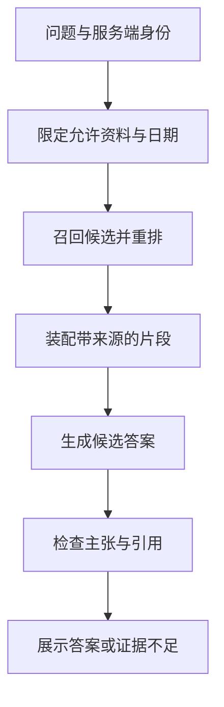

# RAG 检索、引用与来源可信度知识点讲义

## AIAPP-06 RAG、引用与来源可信度

同事问：“项目组今天订酒店，每晚最多能报销多少？”助手很快回答“600 元”，还附上公司手册链接。打开链接才发现，那是去年的标准，今年已经改成 500 元。另一份 800 元的政策只适用于别的业务主体。回答有出处，却仍然答错了。

这一篇从这个问题出发，解释怎样找到适用资料、把结论绑定到具体证据，并在资料不足或互相矛盾时停止推断。读完后，你应能画出一次查询的证据路径，判断错误发生在检索、排序还是生成，并设计能够重新核查的引用。文中的政策、分数和租户都是合成数据，不代表任何公司的真实报销规则。

### 学习前先确认

- 直接前置：[AIAPP-01 模型接口、指令与上下文边界](../chinese-guides/aiapp-01-model-interface-instructions-context-boundaries.md#aiapp-01)。先记住模型只能利用本次收到的上下文；本篇继续讨论哪些外部资料有资格进入其中。

### 一、回答问题之前，先确定证据应该回答什么

**检索增强生成（Retrieval-Augmented Generation）**通常在生成回答之前，从外部资料中检索相关内容，再把它们作为上下文提供给模型。外部资料可以更新，因此不必每次改政策都重新训练模型；但检索只是增加可用证据，并不保证模型正确使用它。

“今天能报多少”至少包含主体、地点、住宿日期和费用类型。缺少地点时，北京的上限不能直接套到所有城市。查询理解应保留原问题，提取这些约束；确实缺少会改变答案的条件时，先问清楚。让模型自动把“今天”改成“最近一版”也可能丢失生效日期：最新发布的政策可能下个月才生效。

把任务写成一句可检查的约定：“只根据当前主体有权查看、住宿日期适用的政策，说明上限和例外；没有充分证据就说明缺少什么。”这使后续阶段各有职责：检索寻找候选，过滤检查资格，重排选择有用片段，生成组织回答，引用检查把主张接回证据。它们不能互相替代。



图描述应用应守住的边界，不规定所有搜索引擎内部必须采用同一种过滤算法。搜索基础设施本身需要被授权处理索引；关键是无权内容不能进入模型、用户响应或普通诊断日志。对高敏感集合，可以从存储分区开始隔离。

### 二、切分时保留下来的条件，决定答案会不会变样

**切分片段（Chunk）**是用于检索和引用的一段资料。好的片段不只是满足字符数限制，还应让读者看得出“谁、在什么条件下、适用什么结论”。

假设原文是：“境内普通出差：北京每晚 500 元。经事先批准参加指定会议的人员，按会议酒店协议价执行。”如果只留下“按会议酒店协议价执行”，模型可能把例外误当普遍规则；如果只留下“500 元”，它会失去城市、单位和例外。表格也一样：单独的数字行没有列标题，就分不清是每晚金额还是总晚数。

因此入库时保留标题路径、表头、单位、脚注、页码或段落位置，并把例外与主规则连接起来。需要扩展相邻片段时也要再次检查其权限。重叠切分可以保留跨段语义，但十个重叠块可能都来自同一句话，不能把它们算成十个独立来源。

文档登记需要稳定 documentId、版本、所有者、来源地址、适用范围和生效时间。片段再记录 chunkId、文档版本、位置与内容哈希。哈希帮助发现内容变化，不证明原文真实。网页抓取成功、PDF 可以解析，也不证明许可允许模型使用；OCR 错字和缺失表头应带质量标记，必要时暂缓入库。

### 三、相似度负责找候选，不能决定谁有资格回答

Embedding（向量嵌入）把文本转换成数值向量，让系统比较表达的接近程度。教学上，假设查询向量是 `[1, 0]`，两个单位向量分别是 `[0.99, 0.14]` 的近似值与 `[0.8, 0.6]`；前者方向更接近查询，但它完全可能来自过期政策。距离衡量的是表示空间中的接近，不是日期有效性或事实支持。

关键词检索擅长找订单号、错误码和专名；向量检索更容易找到用不同词表达的相近内容；字段过滤处理主体、日期和状态。混合检索把它们组合起来，但不同评分不能不经校准就相加。更换嵌入模型后，维度相同也不意味着新旧向量属于同一个空间，通常需要重建并比较索引结果。

以下候选的分数都是人为设定，用来区分“高分”和“可用”：

| 片段 | 分数 | 事实 | 本次处理 |
| --- | --- | --- | --- |
| old | 0.99 | 同主体，已失效，600 元 | 排除当前查询，可用于显式历史查询 |
| other | 0.98 | 另一主体，800 元 | 不向当前模型与用户提供 |
| blog | 0.96 | 旅行博客，没有报销规则 | 不能作为公司上限依据 |
| current | 0.86 | 同主体，当前普通出差，500 元 | 可以回答普通出差问题 |
| conference | 0.81 | 同主体，会议例外 | 问题涉及会议时必须补充 |

**重排（Reranking）**对召回候选再次筛选或排序，以便有限上下文优先放入有用证据。它可以使用模型、交叉编码器或业务规则。权限、生效时间等硬条件先确定候选资格；重排再比较问题相关性、覆盖和重复度。不能给无权资料减几分后继续保留。

增加 top-k（返回的候选数量）可能找回遗漏的例外，也可能加入噪声。候选内容太多时，应按问题覆盖压缩，而不是永远取前几百字。复杂问题需要多跳检索，例如先确定会议类别，再查对应例外；每一步产生的实体都要有依据，不能把上一轮猜测当成下一轮已知事实。

### 四、运行一次过滤与排序，观察高分资料如何退出

将下面完整代码保存为 `rag-selection.mjs`，用 Node.js 22 执行 `node rag-selection.mjs`，或在现代浏览器控制台单独运行。没有依赖、网络或真实模型。认证上下文由代码中的固定对象模拟，实际项目必须由服务端会话生成，不能从模型参数取租户。

```js example=aiapp06-select-evidence
const identity = { tenant: 'team-a' };
const day = '2026-10-02';
const chunks = [
  { id: 'old', tenant: 'team-a', from: '2025-01-01', to: '2026-01-01',
    kind: 'policy', score: 0.99, text: '北京普通出差每晚600元' },
  { id: 'other', tenant: 'team-b', from: '2026-01-01', to: '2027-01-01',
    kind: 'policy', score: 0.98, text: '另一主体每晚800元' },
  { id: 'blog', tenant: 'team-a', from: '2026-01-01', to: '2027-01-01',
    kind: 'blog', score: 0.96, text: '北京住宿体验' },
  { id: 'current', tenant: 'team-a', from: '2026-01-01', to: '2027-01-01',
    kind: 'policy', score: 0.86, text: '北京普通出差每晚500元' },
  { id: 'conference', tenant: 'team-a', from: '2026-01-01', to: '2027-01-01',
    kind: 'policy', score: 0.81, text: '已批准会议按协议价执行' },
];
function retrieve(subject, date, minimum) {
  // 日期已规范为 YYYY-MM-DD；区间采用左闭右开。
  const allowed = chunks.filter(c => c.tenant === subject.tenant);
  const applicable = allowed.filter(c => c.from <= date && date < c.to);
  return applicable.filter(c => c.kind === 'policy' && c.score >= minimum)
    .sort((a, b) => b.score - a.score);
}
console.log(retrieve(identity, day, 0.8).map(c => c.id).join(','));
// => current,conference
console.log(retrieve(identity, '2027-02-01', 0.8).length);
// => 0
console.log(retrieve(identity, day, 0.9).length);
// => 0
```

第一次保留主规则与会议例外。日期改到所有片段失效之后，结果为空；把阈值提高到 0.9，也会错过当前政策。这两种空结果原因不同，说明阈值需要用标注查询评估，而不是凭感觉设高就称为安全。

实验内存里保存了全部资料，只演示过滤顺序与输入变化；它不是生产租户隔离方案，也没有验证向量召回率。真实搜索还要检查过滤模式：某些引擎先取全局近邻再过滤，可能使允许集合中的相关资料未进入 top-k。选择模式时同时验证授权和召回，不把底层名为 preFilter 的参数当成完整访问控制。

### 五、引用存在与引用支持结论，是两次不同的检查

**引用落地（Citation Grounding）**把回答中的具体主张与能够支持它的证据对应起来。例如“北京普通出差每晚最多 500 元”需要主体、城市、出差类型和金额都匹配；“所有员工任何出差都能报 500 元”即使引用同一段，也扩大了范围。

模型可以提出 citationId，但链接、标题和摘录由受信服务根据本次允许片段解析。先检查 ID 是否属于本次集合、版本和哈希是否匹配、来源是否仍可访问，再检查语义支持。下例故意让一个没有依据的主张通过 ID 检查，说明代码能证明到哪里。保存为 `citation-membership.mjs`，同样用 Node.js 22 运行。

```js example=aiapp06-citation-membership
const evidence = new Map([
  ['c-1', { version: 'v2', text: '北京普通出差每晚最多500元。' }],
]);
const claims = [
  { text: '北京普通出差上限500元', citation: 'c-1', version: 'v2' },
  { text: '所有城市均可报销800元', citation: 'c-1', version: 'v2' },
  { text: '另有无限额补贴', citation: 'invented', version: 'v2' },
];
function checkReference(claim) {
  const source = evidence.get(claim.citation);
  if (!source || source.version !== claim.version) return 'invalid-reference';
  return 'needs-support-review';
}
console.log(claims.map(checkReference).join(','));
// => needs-support-review,needs-support-review,invalid-reference
```

前两项都能定位来源，第二项却与原文不符。开放文本的支持判断需要人工或经过校准的语义评审；如果业务使用经过审核的结构化金额表，可以用确定规则比较字段，但不能假装正则表达式已经理解整份政策。事实、隐私和内容政策也不是同一种判断，可继续阅读[输出边界的事实核验](../chinese-guides/aisafe-01-output-validation-content-safety-guardrails.md#四事实隐私与内容政策是三种判断)。

引用在页面上应贴近对应主张，能展开具体段落和时间。用户点击时重新检查权限；原文失效就说明不可用，不能让旧 chunkId 悄悄指向另一段。服务端不要跟随模型任意提供的 URL 抓取资源，也不要把检索片段中的指令升级为工具授权；后者见[提示注入的数据身份](../chinese-guides/aiapp-07-prompt-injection-untrusted-content.md#二可信来源也不能自动取得指令权)。

### 六、没有足够证据时，仍然可以给出有用回答

如果两份当前有效政策分别写 500 元与 600 元，先检查是否适用于不同地区、职级或日期；范围一致且无法裁决时，保留冲突并交给资料所有者确认。取平均值 550 元没有任何来源支持，选分数较高的一份也不能解决规则冲突。

无命中时可以说明“当前可用资料未找到该条件下的标准”，让用户补充日期或改用人工路径。低相关时说明证据不足；服务超时时说明暂时无法检索，不把服务故障说成“政策不存在”。对无权资料，错误文案不能透露其标题、数量或存在性，外部通常统一表达为“未找到可用资料”。

部分主张有证据时，允许分段回答并标明剩余问题。例如先说明普通出差上限，再说明无法确认本次是否属于会议例外。不要把“模型置信度 0.9”当作来源支持，也不要在来源打不开时沿用确定语气。

### 七、资料更新之后，旧答案也需要退出使用

索引不是原文的实时镜像。发布新政策需要经历抓取、解析、切分、嵌入和索引发布。每一步记录版本和失败对象，新索引在隔离区域构建，检查完成后再切换。对跨多份政策的查询，可以绑定一个索引快照，避免回答一半来自旧索引、一半来自新索引。

普通内容更新可以等待完整新索引；权限撤销需要更及时的拒绝读取机制。在线授权检查和撤销水位先阻止旧片段继续进入上下文，再异步清理索引与副本。回退到旧索引也不能恢复已撤销的权限。

删除还要找到缓存答案、摘要、评测样本和历史导出。当前搜索不到只能证明在线召回没有返回，不能证明所有派生副本都已删除。资料派生关系可以复用[来源撤回的追踪方法](../chinese-guides/aigov-01-data-model-change-audit-accountability.md#二来源撤回要沿派生链找到影响)。旧引用保留“版本已失效”的解释入口，是否保留受限原文由留存规则决定。

对于中文译本、英文原文、PDF 与网页，登记它们的版本对应关系和权威语言。自动翻译是派生产物，不自动成为新的权威来源；OCR 页码定位与 HTML 锚点也不能互换。来源更新后，答案缓存要按证据版本失效，具体复用条件见[缓存的业务含义](../chinese-guides/aiapp-09-cost-quota-cache-reliability.md#四三种缓存复用的是不同东西)。

### 八、沿证据链定位失败，才能知道该改哪一步

建立一组包含有答案、无答案、例外、冲突、过期、权限撤销、标识符、跨语言、表格和注入的查询。给每个查询标注允许资料、相关片段和必须支持的主张。真实任务与合成边界分开统计；需要十类查询不意味着十条样本就足以估计生产质量。

如果允许的相关片段有 4 个，召回候选找到其中 3 个，召回率是 3/4；如果送入模型的 2 个片段都相关，精确率是 2/2。后一个高分仍可能漏掉决定性的例外。继续看重排后有没有保留关键条件，以及回答是否准确表达这些条件。最终答案正确也可能只是模型记忆碰巧答对，不能掩盖错误引用。

诊断记录保存 requestId、索引与解析版本、过滤策略、候选 ID、入选 ID、引用关系和失败类别。正文只在获准的受控存储中按需留存，普通 trace 不复制完整私有文档。同一问题在冻结索引上回放，才能区分“找不到”“没选入”“读错了”；评估和发布决定的衔接见[分层评估](../chinese-guides/aiapp-08-evaluation-observability-release-gates.md#一先把成功拆成能够检查的事实)。

### 带着问题回看

1. 过期政策相似度最高，应该在哪一步退出当前答案？历史查询会怎样改变条件？
2. 一个引用 ID 合法，但结论把“普通出差”扩展成“所有出差”，还缺哪一步检查？
3. 两份政策冲突时，为什么不能取平均数或直接取重排第一名？
4. 权限撤销后，旧索引、答案缓存和已生成页面分别需要做什么？

### 参考与延伸阅读

官方资料核对于 2026-10-02。正文实验为本站独立编写，所示策略需要按实际资料和权限系统实现。

- [Microsoft：RAG 的组成与检索挑战](https://learn.microsoft.com/en-us/azure/search/retrieval-augmented-generation-overview)：核对检索、内容准备与上下文的关系；Azure 的具体产品能力不代表所有 RAG 系统。
- [Microsoft：向量查询的过滤方式](https://learn.microsoft.com/en-us/azure/search/vector-search-filters)：比较过滤发生阶段如何影响召回，实施时核对所用搜索引擎的实际语义。
- [OWASP：提示注入防护](https://cheatsheetseries.owasp.org/cheatsheets/LLM_Prompt_Injection_Prevention_Cheat_Sheet.html)：查阅检索内容为何仍需要来源隔离和工具边界。
