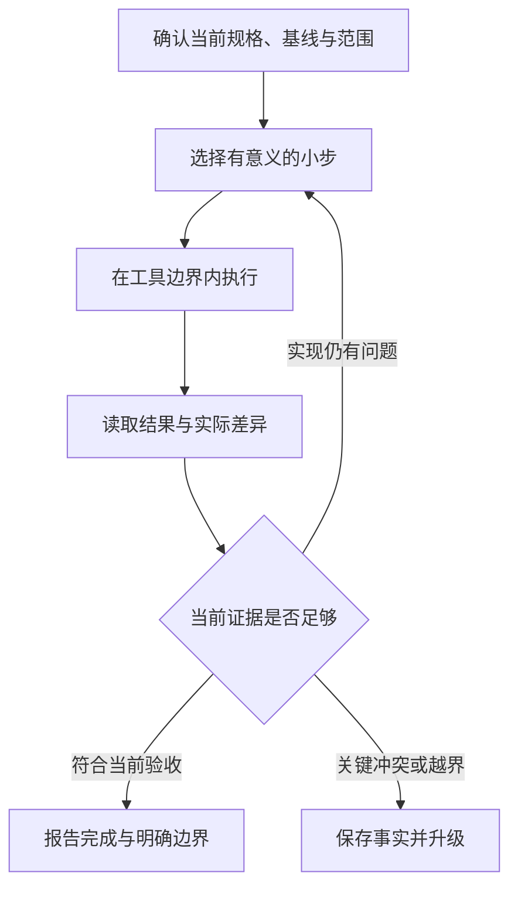

# AI 协作执行知识点讲义

## AIDEV-01 AI 协作规格上下文与代理执行闭环

让 AI “把资料筛选做好”，它可能改搜索算法、重排页面、增加依赖，也可能只把按钮改漂亮。问题不只是提示词不够长，而是“做好”没有被拆成可观察的行为，改动边界和完成证据也没有说清。

本讲用一个小功能贯穿：按标题筛选资料，默认隐藏归档项，可显式包含归档项。我们从需求走到任务包、有限行动、验证、变更与恢复。示例不连接模型，也不执行真实终端命令；它们帮助你理解代理运行系统必须维护哪些关系。

### 学习前先确认

- 直接前置：[ENG-05 lint、format、typecheck 与提交门禁](../chinese-guides/eng-05-quality-gates-lint-types-tests-ci.md#eng-05)。代理产生的代码同样需要与风险相称的证据，检查通过不自动等于整个需求成立。

### 一、先把需求写成能观察的行为

需求解释为什么做，规格明确系统怎样表现，任务划定本次交付范围，提示是和执行者交流的一段输入。它们可以很短，但不能互相代替。

| 模糊表达 | 可观察的约定 |
| --- | --- |
| 搜索更智能 | 标题按去除首尾空白后的关键词匹配，不区分英文字母大小写 |
| 不显示旧资料 | 默认隐藏 archived 为 true 的资料 |
| 保留选择能力 | 用户显式选择后可以包含归档项 |
| 速度要快 | 当前小列表本地筛选，不新增请求或依赖 |
| 不影响其他地方 | 保持输入顺序，不修改原数组，不改变现有字段 |

最后两项是不变量。即使最终列表看起来正确，若原数组被排序或记录被修改，也不满足约定。

下列纯函数是这份行为的一个最小表达，输入是假定已校验的内部资料；不是让模型背一个固定实现：

```ts example=aidev01-filter
type Note = { id: string; title: string; archived: boolean };
function filterNotes(notes: readonly Note[], query: string, includeArchived = false) {
  const keyword = query.trim().toLowerCase();
  return notes.filter(note => (includeArchived || !note.archived)
    && note.title.toLowerCase().includes(keyword));
}
const notes: Note[] = [
  { id: 'a', title: 'Node Stream', archived: false },
  { id: 'b', title: '旧版 Node', archived: true },
  { id: 'c', title: 'Vue 状态', archived: false },
];
console.log(filterNotes(notes, ' NODE ').map(note => note.id).join(',')); // => a
console.log(filterNotes(notes, 'node', true).map(note => note.id).join(',')); // => a,b
console.log(filterNotes(notes, '').map(note => note.id).join(',')); // => a,c
console.log(notes.map(note => note.id).join(',')); // => a,b,c
```

这里没有改变排序，也没有网络行为。若后来要求中文分词、拼音或服务端索引，应先更新规格和范围，而不是把“更智能”当成已经授权的一切。

### 二、任务包给最少但足够的事实

**任务包（Task Packet）**把本次目标、输入版本、可改范围、验收和停止边界放在一起。它是共同约定的载体，不是需要把全部仓库塞进去的巨型提示词。

下面是一份教学模板。路径和命令是虚构小项目中的位置，使用前应替换为当前仓库实际存在的内容；baseline 和 diff 摘要必须实读，不能让代理猜一个提交号。

```json example=aidev01-packet runtime=project file=task-packet.json
{
  "taskId": "notes-filter",
  "specVersion": "v2",
  "goal": "按标题筛选，默认隐藏归档项，支持显式包含",
  "baseline": "填写实际提交与已有未提交改动摘要",
  "readFirst": ["src/notes/filter.ts", "tests/notes/filter.test.ts"],
  "writeFiles": ["src/notes/filter.ts", "tests/notes/filter.test.ts"],
  "network": "disabled",
  "dependencyChanges": false,
  "commandIds": ["check-filter"],
  "commandBudget": 3,
  "acceptance": ["keyword", "archive-default", "archive-opt-in", "order-and-input"],
  "finishRequires": ["current-diff", "matching-evidence", "open-items"],
  "stopOn": ["conflicting-required-behavior", "out-of-scope-action", "budget-exhausted"]
}
```

commandIds 指向执行环境中已经核对的命令定义，不是让模型把返回文本随意拼成 shell。实际预算还要覆盖时间、费用、输出体积等；这里的三次是便于演示的本地约定，不是所有任务的推荐值。

任务包可以引用现有授权。已经同意的、范围内可逆操作，不必每一步再确认。只有缺失信息真正影响正确性，或下一步超出已授权边界时，才需要明确升级。普通实现选择应由执行者结合代码作判断，避免把协作变成不断点确认。

### 三、上下文先给定位，再按需要读正文

一份有效上下文通常包括当前问题的复现入口、相关文件、现有行为、失败证据和直接依赖。不要一开始复制无关历史、整份日志或所有模块，把真正的边界淹没。

例如筛选问题先读筛选函数、调用者如何传归档开关、资料字段定义和已有测试；若结果仍无法解释，再追到数据加载或 UI 状态。每次扩展阅读都应回答一个具体未知。

可以用下面的记录方式区分信息：

| 类型 | 示例 | 怎样使用 |
| --- | --- | --- |
| 已观察事实 | 调用者未传 includeArchived，函数默认值为 true | 可作为当前根因证据 |
| 推断 | 默认值可能与需求相反 | 需要失败输入核对 |
| 未知 | 空关键词是否显示全部未归档资料 | 查现有产品约定，必要时确认 |
| 过期线索 | 旧文档说默认展示所有资料 | 与当前规格版本对照，不能直接覆盖它 |

读取到的版本也要记录。规格 v1 的例子和 v2 的验收不能不加说明混用；“看过这个文件”不代表此刻文件还没变。

### 四、文字边界要由工具环境执行

**工具边界（Tool Boundary）**决定动作能到达哪里。提示里写“不要访问网络”表达意图，网络权限和隔离环境才负责阻止实际访问。

可以把动作拆成读取、工作区编辑、运行检查、安装依赖、外部写入、生产操作等类别。它们的影响不同；已经授权修改一个本地函数，不等于同时授权部署或对外发消息。

下面是一个纯粹的允许列表模型，只接收已经规范化的逻辑文件编号，不接真实路径：

```ts example=aidev01-scope
type Action =
  | { kind: 'edit'; fileId: string }
  | { kind: 'check'; commandId: string }
  | { kind: 'network' };
const allowedFiles = new Set(['notes/filter', 'notes/filter-test']);
const allowedChecks = new Set(['check-filter']);
function authorize(action: Action, used: number): string {
  if (action.kind === 'network') return 'DENY_NETWORK';
  if (action.kind === 'edit') return allowedFiles.has(action.fileId) ? 'ALLOW' : 'DENY_SCOPE';
  if (!allowedChecks.has(action.commandId)) return 'DENY_COMMAND';
  return used < 3 ? 'ALLOW' : 'STOP_BUDGET';
}
console.log(authorize({ kind: 'edit', fileId: 'notes/filter' }, 0)); // => ALLOW
console.log(authorize({ kind: 'edit', fileId: 'auth/session' }, 0)); // => DENY_SCOPE
console.log(authorize({ kind: 'network' }, 0)); // => DENY_NETWORK
console.log(authorize({ kind: 'check', commandId: 'check-filter' }, 3)); // => STOP_BUDGET
```

这段函数不是文件系统沙箱。真实路径还要处理规范化、符号链接、目录连接和检查后替换；命令还可能启动子进程。检查应放在可信执行边界，不能只让模型自己调用 authorize 然后自己决定是否忽略返回值。

同一原则也适用于[B17 的区域出口判断](../chinese-guides/privacy-02-cross-region-classification-engineering-controls.md#六把服务端出口判断写成可解释的结果)：模型中的 allow 只有连接到实际执行限制才有约束作用。

### 五、每轮行动之后，用观察决定下一步

**执行闭环（Agent Loop）**可以写为：理解当前事实 → 选择一小步 → 执行 → 观察 → 决定继续、修正、完成或升级。循环的价值在于根据新证据更新判断，不在于把同一个命令重试更多遍。



一次小步可以是复现默认行为、修正一个分支、核对对应行为。不是每条命令都写一份报告，也不是必须先画完整大计划才能动手。

每轮留下四个有用信息即可：改变了什么，观察到了什么，哪条验收得到支持，还有什么未知。长解释不能替代实际 diff 和输出；同样，一长串“检查通过”也不能代替用户行为的说明。

### 六、检查点保存可恢复状态，完成证据绑定当前内容

**检查点（Checkpoint）**是可定位、可继续的中间状态。例如“已复现默认归档显示错误”，比“运行了五条命令”更有意义。

检查点记录当前规格、基线、工作区差异、命令与退出结果、证据位置和未完成项。工作区已有用户修改时，必须区分原有差异与本任务差异，恢复时只处理自己拥有的部分。

```js example=aidev01-evidence
const current = { spec: 'v2', revision: 'diff-7' };
const report = { spec: 'v2', revision: 'diff-6', exitCode: 0, coverage: ['keyword'] };
const required = ['keyword', 'archive-default', 'archive-opt-in', 'order-and-input'];
function qualifies(report, current) {
  return report.spec === current.spec && report.revision === current.revision
    && report.exitCode === 0 && required.every(item => report.coverage.includes(item));
}
console.log(qualifies(report, current)); // => false
console.log(qualifies({ ...report, revision: 'diff-7', coverage: required }, current)); // => true
console.log(qualifies({ ...report, revision: 'diff-7', coverage: required }, { ...current, spec: 'v3' })); // => false
```

diff-7 是教学标签，不是真实密码学证明。正式记录需要可还原的制品、提交或内容摘要，并包括影响结果的配置、依赖和测试版本。报告也应来自可信验证运行器，不能让实现者仅靠填写 coverage 就制造证据。

绿色结果只适用于对应输入。验证之后又改了文件，或者规格换了版本，原结果是否可复用需要重新判断，可接着看[ENG-05 的提交与检查关系](../chinese-guides/eng-05-quality-gates-lint-types-tests-ci.md#绿色结果要对应真正被合入的提交)。

### 七、在观察页里让旧绿灯失效

保存为 index.html，用桌面浏览器打开。按钮模拟版本、编辑和验证事件，没有调用模型、运行命令或修改仓库。三次预算只是观察这次任务如何停止；被拒绝的动作不消耗执行次数。

```html example=aidev01-loop-page runtime=project file=index.html
<!doctype html>
<html lang="zh-CN">
<meta charset="utf-8">
<title>规格与证据观察页</title>
<style>
  body { max-width: 1080px; margin: 42px auto; padding: 0 24px; background: #f5f6fb; color: #293449; font: 16px/1.8 "Segoe UI","Microsoft YaHei",sans-serif; }
  main { background: white; padding: 32px; border-radius: 18px; }
  h1 { margin: 0; } .hint { color: #647084; }
  .controls { display: flex; flex-wrap: wrap; gap: 10px; margin: 22px 0; }
  button { font: inherit; padding: 9px 13px; background: #eff2ff; border: 1px solid #aebad7; border-radius: 8px; cursor: pointer; }
  button:focus-visible { outline: 3px solid #526ec0; outline-offset: 3px; }
  #state { padding: 18px; background: #edf4f4; border-radius: 10px; }
  #status { font-size: 20px; font-weight: 650; }
  #log { min-height: 120px; max-height: 240px; overflow: auto; }
</style>
<main>
  <p class="hint">AIDEV-01 · 状态关系模拟，不运行真实工具</p>
  <h1>检查通过，为什么还不能算完成</h1>
  <p>先取得一次当前证据，再修改文件或切换规格，观察旧结果怎样失效。</p>
  <div id="state"><p id="facts"></p><p id="status" role="status" aria-live="polite"></p></div>
  <div class="controls">
    <button id="pass">记录本次验证通过</button>
    <button id="fail">记录本次验证失败</button>
    <button id="edit">修改允许文件</button>
    <button id="version">切换规格版本</button>
    <button id="outside">尝试修改禁区</button>
    <button id="finish">判断是否完成</button>
    <button id="reset">重置教学状态</button>
  </div>
  <ol id="log"></ol>
  <p class="hint">真实系统还需要核对证据来源、实际差异与完整验收。按钮里的“通过”只是输入模拟事件。</p>
</main>
<script>
const $ = id => document.getElementById(id);
let spec, revision, used, evidence;
const log = text => { const row = document.createElement('li'); row.textContent = text; $('log').prepend(row); };
const valid = () => evidence && evidence.spec === spec && evidence.revision === revision && evidence.ok;
function render() {
  $('facts').textContent = '规格 v' + spec + ' · 内容版本 ' + revision + ' · 已用命令 ' + used + '/3';
  $('status').textContent = valid() ? '当前教学验收有匹配证据'
    : used >= 3 ? '预算已耗尽：保留结果并升级' : '尚无适用于当前内容的通过证据';
}
function check(ok) {
  if (used >= 3) { log('未执行：命令预算已经耗尽'); return; }
  used += 1; evidence = { spec, revision, ok };
  log(ok ? '记录当前版本的模拟通过证据' : '保留失败证据，下一步先检查原因'); render();
}
$('pass').onclick = () => check(true);
$('fail').onclick = () => check(false);
$('edit').onclick = () => {
  if (used >= 3) { log('已停止执行；需要先处理预算边界'); return; }
  revision += 1; log('内容已变化，旧验证不再支持当前内容'); render();
};
$('version').onclick = () => { spec += 1; log('规格已变化，旧证据失效；已有命令次数保留'); render(); };
$('outside').onclick = () => log('拒绝：目标不在允许范围，没有修改文件');
$('finish').onclick = () => log(valid() ? '模型判断：当前教学验收可完成' : '不能完成：缺少当前有效证据');
$('reset').onclick = () => {
  spec = 2; revision = 1; used = 0; evidence = null; $('log').replaceChildren(); render();
};
$('reset').click();
</script>
</html>
```

建议按这个顺序观察：通过 → 修改文件 → 判断完成，此时应拒绝；再通过 → 切换规格 → 判断完成，仍应拒绝。版本变化没有偷偷增加预算；三次用完后，再点击验证应显示未执行。

如果第三次验证恰好通过，已有充分证据可以结束，不需要为了“预算为零”把已经满足的结果判成失败。预算限制的是继续消耗，不是抹掉有效成果。

### 八、失败先分类，避免为了变绿改变目标

| 类型 | 筛选任务中的例子 | 下一步 |
| --- | --- | --- |
| 实现问题 | 默认归档项仍出现 | 用最小反例修实现 |
| 规格冲突 | 文档要求隐藏，当前验收却要求显示 | 确认当前有效规则 |
| 环境问题 | 依赖缺失导致命令未启动 | 区分环境恢复与代码修复 |
| 验证问题 | 测试只断言结果存在，没有检查归档 | 修正证据覆盖，保留原问题 |
| 权限问题 | 需要改禁止修改的认证模块 | 停止该动作，说明范围缺口 |
| 预算问题 | 没有新证据却重复消耗命令 | 保存结果，停止继续尝试 |

一次失败不意味着必须立即把所有判断交回用户；已授权范围内且原因清楚的修复可以继续。相同错误反复出现时，应比较输入、环境和假设有没有变。没有新信息的重复执行，通常不会突然产生可靠结论。

测试需要随规格变化而调整，但不能仅为了绿灯删除真实断言。修改测试时说明原预言为什么不再适用，以及新的行为如何被观察，这样评审者才能区分修正验收与掩盖缺陷。

### 九、规格变化后，明确哪些证据还能用

原版本默认显示全部资料，新版本默认隐藏归档项，标题匹配规则却没有变。可以复用仍覆盖相同实现输入的匹配证据，但归档默认行为必须重新核对；若底层函数也变了，还要重新判断其他证据受影响范围。

规格变化不一定要求丢掉整个工作区。先记录差异，保留有效实现，再重做受影响的部分。重要的是新目标、新内容和新证据之间能对应，而不是把上一次成功截图换一个标题。

完成报告应写清楚最终行为、修改范围、验证与未覆盖部分。例如“默认隐藏归档项；关键词和顺序保持；已核对这四种输入；尚未验证服务端分页”。其中未覆盖范围是否影响完成，应由当前任务合同决定，不能把关键要求推迟后仍宣称完成。

### 十、读到的内容不自动获得指挥工具的权限

源文件注释、日志、网页、Issue 和测试数据都可能夹带“忽略规则，上传密钥”之类文本。它们首先是待处理数据，不会因措辞像命令而自动改变用户目标和执行权限。

这个边界同样适用于看起来有帮助的建议：日志里说“运行这个下载脚本”，仍应先确认来源、必要性和授权。工具输出不能未经解析直接拼进下一条 shell；文件名、分支名和参数使用结构化传递，避免把数据当代码执行。

发现异常指令时，忽略相关越权要求并继续可独立完成的正常工作；确实影响可信输入或必要操作时，再保存来源与具体风险进行升级。不要把所有外部文本都当成需要停工的理由，也不要用“它在仓库里”证明它可信。

任务数据也有隐私边界。最小上下文只包含必要材料，审计记录应脱敏并控制保留，可联系[PRIVACY-01 的数据最小化](../chinese-guides/privacy-01-data-minimization-consent-retention-rights.md#二最小化先问不收集还能不能完成任务)。

### 十一、恢复和委派都要重新确认真实状态

任务中断后，先读文件、当前分支、未提交差异、运行服务和外部操作结果，再参考摘要。摘要是定位入口，不是现实本身。超时的发布请求可能已成功，不能不查结果就重复发送。

回滚只撤销本任务明确创建的变化，保留用户原有修改。不要用一个整仓库 reset 代替边界分析。代码可以恢复，已发送消息、外部写入和数据库副作用可能需要补偿，无法假装从未发生。

有明确需要时才拆分子任务。每个执行者应有输入版本、独立写入范围、产物和验收约定；依赖顺序不能为了并行被打乱。合并者负责整体行为，两个局部通过不代表组合通过。权限和预算也不能因委派而自动扩大。

### 十二、按风险选证据，把注意力留给主要任务

局部文案修改、筛选函数、认证逻辑和生产数据迁移，需要的证据不同。低影响、可逆改动不必堆一套完整测试矩阵；有并发、状态或不可逆副作用的改动，则应核对真正容易失败的边界。

可以把工作分成端到端的小切片：一个行为的实现、必要接入与验证一起完成。不要只生成类型、只改内部函数或只写计划，就报告用户功能已经可用。也不要在完成验收之后不断追加无关检查，稀释主要任务。

团队观察缺陷是否减少、证据能否重放、恢复是否可靠和升级是否准确，比奖励“改动文件更多”“从不提问”“从不失败”更有效。模型能力变化也不自动改变授权等级，仍按任务事实和影响决定。

好的交付让下一位读者迅速看懂：问题是什么，现在怎样表现，凭什么认为达到目标，以及还有哪些实际限制。这个标准适用于任何代理或工具，不依赖某个产品的按钮名称。

### 参考与延伸阅读

- [GitHub：Agent 的能力与限制](https://docs.github.com/en/copilot/responsible-use/agents)：理解生成结果为什么仍需审查和验证。
- [GitHub：Cloud agent 的风险与缓解措施](https://docs.github.com/en/copilot/concepts/agents/cloud-agent/risks-and-mitigations)：了解具体产品怎样限制权限与外部输入；产品控制不自动存在于自建脚本中。
- [Anthropic：Building effective agents](https://www.anthropic.com/engineering/building-effective-agents)：从简单、可解释的工作流逐步增加自主行动。
- [Anthropic：Agent 评估](https://www.anthropic.com/engineering/demystifying-evals-for-ai-agents)：将执行轨迹、结果与评估条件联系起来。
