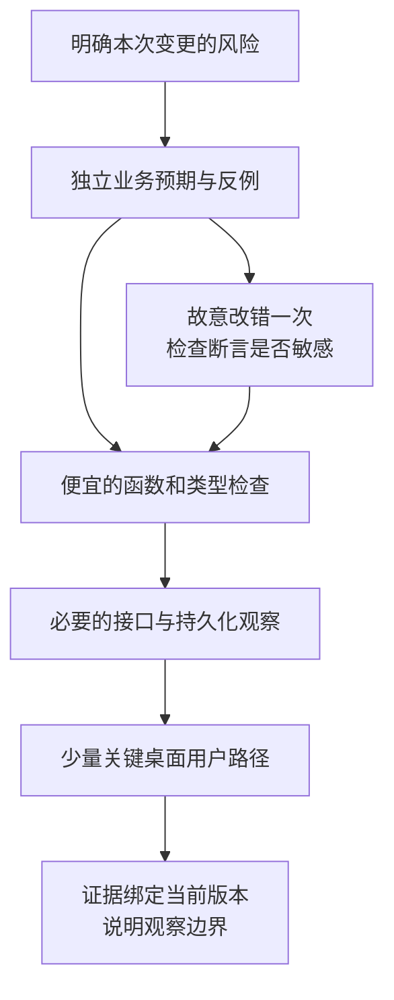

# 怎样判断 AI 写出的代码真的做对了

## AIDEV-03 AI 生成代码的验证、反例与防伪通过

AI 写了一段名单筛选，又写了测试。运行结果全绿，覆盖率也不低。上线后却发现候补学员出现在录取名单里。回头看，测试的预期值正是用同一段错误筛选逻辑算出来的。

这类问题的难点不是“检查太少”，而是检查有没有能力推翻实现。增加十份同样的断言，可能仍然证明不了正确性。本讲用一个名单导出函数，依次建立独立预期、寻找反例、观察错误修改能否被发现，再决定哪些风险值得穿过真实接口和页面验证。

所有示例只处理合成记录；筛选正确不代表实际接口已完成身份认证、权限校验或文件安全处理。

### 学习前先确认

- 直接前置：[AIDEV-01 规格驱动与受控代理循环](../chinese-guides/aidev-01-specification-controlled-agent-loop.md#aidev-01)。先明确本次要交付什么，以及证据对应哪个版本。
- 直接前置：[TEST-03 端到端、视觉回归、隔离与不稳定测试](../chinese-guides/test-03-e2e-visual-regression-isolation-flakiness.md#test-03)。本讲会区分本地函数检查、真实接口观察和桌面用户路径。

### 一、预期结果必须有独立于生成代码的依据

**Test Oracle** 是判断结果对错的依据。它可以是人工确认的业务例子、明确公式、独立的参考实现，也可以是运行后应保持的事实。它不一定是一个测试框架，更不等于“另一段 AI 生成的回答”。

先明确本讲合同：输入已经过格式校验；报名 ID 唯一且为 ASCII 字符串；只导出状态恰好为 ENROLLED 的记录；结果按 ID 的字符顺序排列；不修改输入。WAITLISTED 是候补，CANCELLED 是已取消，未来未知状态也不能默认纳入。

```js example=aidev03-self-confirming-test
const rows = [
  { id: 'e2', status: 'WAITLISTED' },
  { id: 'e1', status: 'ENROLLED' },
];
const wrong = input => input.filter(row => row.status !== 'CANCELLED')
  .map(row => row.id).sort();
const generatedExpected = rows.filter(row => row.status !== 'CANCELLED')
  .map(row => row.id).sort();
console.log(JSON.stringify(wrong(rows)) === JSON.stringify(generatedExpected));
console.log(JSON.stringify(wrong(rows)) === JSON.stringify(['e1']));
// => true
// => false
```

第一个 `true` 只说明两段相同逻辑彼此一致。第二个预期 `['e1']` 来自前面的业务定义，候补 e2 不该出现，因此它揭示了错误。

独立性也有程度。换模型但仍读取同一份过期需求，来源并不独立；两个实现调用同一个错误转换器，实现也不独立；页面标签和数据库查询都读取同一份假数据，观察同样可能失真。对高风险规则，先问两种依据会不会一起犯同一个错，再问有多少条测试。

### 二、先留下能暴露错误的最小例子，再修实现

一个反例需要同时给出输入、合同和实际结果。只写“候补有问题”，别人无法重放。上面的两条记录已经足以复现，不需要把整份真实名单带进测试。

修复应让同一个反例由失败转为通过，同时保留原来的正确行为。下面补上乱序录取、候补、未知状态和空输入：

```js example=aidev03-fixed-roster
function rosterIds(rows) {
  return rows.filter(row => row.status === 'ENROLLED')
    .map(row => row.id).sort();
}
const input = [
  { id: 'e3', status: 'ENROLLED' },
  { id: 'e2', status: 'WAITLISTED' },
  { id: 'e1', status: 'ENROLLED' },
  { id: 'e4', status: 'REVIEWING' },
];
const before = JSON.stringify(input);
console.log(JSON.stringify(rosterIds(input)));
console.log(JSON.stringify(rosterIds([])));
console.log(JSON.stringify(input) === before);
// => ["e1","e3"]
// => []
// => true
```

这里先 `map` 再 `sort`，排序作用于新建的 ID 数组。若直接对输入调用 `sort`，即使导出名单正确，也可能改变页面列表顺序。第三条输出观察了这一副作用。

这仍是一个局部函数：没有验证输入 Schema，没有处理重复 ID，也没有按中文姓名排序。合同已经把这些责任放在边界之外；若真实需求需要它们，应明确补充实现及相应例子，而不是默默假设上述代码已覆盖。

### 三、属性描述一类输入，但要防止空洞的真命题

**Property-based Testing** 从某条应普遍成立的性质出发，生成许多输入来寻找反例。例如“导出 ID 都来自已录取记录”“增加候补不改变录取名单”“函数执行后输入不变”。生成器负责造数据，属性负责判断，两者职责不同。

一句“输出中的每一项都合法”仍不完整。总是返回空数组的函数也满足它，却把全部已录取学员漏掉了。因此还需检查完整性，或者用一组人工确认的非空结果补上这一缺口。

| 想守住的规则 | 有用的观察 | 容易漏掉什么 |
| --- | --- | --- |
| 不混入候补 | 所有导出项都有明确录取事实 | 是否漏掉真正已录取的人 |
| 不漏项 | 已录取集合与输出集合相同 | 顺序、重复和额外字段 |
| 排序稳定 | 相邻 ID 按合同有序 | 是否筛选了错误的人 |
| 不改输入 | 前后输入内容一致 | 是否向外部服务发起了调用 |

属性不是把实现重写一遍。能用集合关系、边界条件或人工样例表达，就优先用这些不同角度。复杂的参考算法本身也可能有错，需要单独检查其适用范围。关于生成器、收缩和常见观察，可以继续读 [TEST-01 属性测试](../chinese-guides/test-01-test-design-oracles-properties-mutation.md#test-01)。

### 四、变换输入后，某些结果关系应该保持

有时完整预期很难计算，但输入变化后应满足的关系比较清楚，这就是 **Metamorphic Testing**。本讲合同规定排序与输入顺序无关，因此颠倒输入后，导出结果应保持一致。

```js example=aidev03-metamorphic-limit
const wrong = rows => rows.filter(row => row.status !== 'CANCELLED')
  .map(row => row.id).sort();
const rows = [
  { id: 'e2', status: 'WAITLISTED' },
  { id: 'e1', status: 'ENROLLED' },
];
const same = (a, b) => JSON.stringify(a) === JSON.stringify(b);
console.log(same(wrong(rows), wrong([...rows].reverse())));
console.log(same(wrong(rows), wrong([...rows, { id: 'e3', status: 'WAITLISTED' }])));
// => true
// => false
```

颠倒输入的关系通过了，增加候补的关系失败了。这说明一条变换关系只覆盖一个方面，不能代替完整合同。

关系还依赖前提。若名单要求“按报名先后取前 20 名”，输入排列可能承载时间顺序，随意打乱就未必等价；若新增记录是已录取，结果本就应该变化。不要因为“交换顺序后不变”听起来像普适性质，就把它套到所有函数上。

### 五、参考实现适合对照，但旧版本不是天然正确答案

**Differential Testing** 比较两个实现面对相同输入时的结果。它适合迁移解析器、替换计算库或重写算法，但差异只说明双方不一致，不能自动认定新实现错了。

例如旧名单函数包含候补，新函数排除了候补。若规格本次就要求修复旧行为，差分失败是预期现象，应把这一类变化写成经确认的例外，并保留原始两份输出。不能为了差分全绿，把修复改回旧错误。

对比前还要对齐环境：时间、排序规则、Unicode 处理、版本和默认选项。只消除合同不关心的差异，例如不参与判断的生成时间；不要把所有顺序和空字段都抹掉，因为它们可能正是缺陷所在。

一个朴素、可读、只处理小输入的参考实现，有时比另一套同样复杂的优化实现更有用。它的价值在于便于审阅和不同的出错方式，不在于“它写得更早”。

### 六、生成更多输入之后，把失败缩到看得懂

**Fuzzing** 用大量变化输入探索边界。它可以瞄准格式错误、极端长度、意外状态或操作序列，但需要限定运行次数、输入大小和资源。真实凭据、生产数据和不可逆接口不应成为随意生成的试验材料。

下面是一个有固定种子的微型生成与删减实验。它只有 30 组、每组 4 条合成记录；用于看清可重放和缩小反例，不替代成熟 fuzz 或属性测试工具。

```js example=aidev03-seed-and-shrink
const wrong = rows => rows.filter(row => row.status !== 'CANCELLED').map(row => row.id);
const violates = rows => wrong(rows).some(id =>
  rows.find(row => row.id === id)?.status !== 'ENROLLED');
function search(seed) {
  let state = seed >>> 0;
  const next = () => (state = (Math.imul(state, 1664525) + 1013904223) >>> 0);
  const statuses = ['ENROLLED', 'WAITLISTED', 'CANCELLED'];
  for (let run = 0; run < 30; run += 1) {
    const rows = Array.from({ length: 4 }, (_, i) => ({
      id: `e${i}`, status: statuses[next() % statuses.length],
    }));
    if (violates(rows)) return rows;
  }
  throw new Error('这组预算没有找到反例');
}
function shrink(rows) {
  let result = rows;
  for (let i = 0; i < result.length;) {
    const smaller = result.filter((_, index) => index !== i);
    if (violates(smaller)) result = smaller;
    else i += 1;
  }
  return result;
}
const seed = 2026;
const found = search(seed);
const minimal = shrink(found);
console.log(JSON.stringify(found) === JSON.stringify(search(seed)));
console.log(minimal.length, minimal[0]?.status, violates(minimal));
// => true
// => 1 WAITLISTED true
```

收缩后只剩一条候补记录，足以让读者解释错误。这种删除法只尝试缩短数组，没有缩小字符串或证明“所有意义上的全局最小”；成熟工具有更系统的生成与收缩策略。

保留种子时也记录生成器、依赖版本和输入上限。种子不是脱离环境仍然通用的证据；生成器代码改变后，同一个种子可能产生不同输入。因此最好同时保存已经找到的具体反例，作为稳定回归材料。fast-check 的生成、属性和运行器职责，以及种子配置，可在文末官方入口核对。

### 七、故意改错一次，观察断言有没有反应

**Mutation Testing** 会有意制造小错误，再观察现有检查能否发现。能发现称为“杀死”这次变异；没发现时，要判断是缺少有用输入、断言太弱，还是这个修改在当前合同下确实等价。

```js example=aidev03-mutations
const rows = [
  { id: 'e3', status: 'ENROLLED' },
  { id: 'e2', status: 'WAITLISTED' },
  { id: 'e1', status: 'ENROLLED' },
];
const expected = '["e1","e3"]'; // 人工按本讲合同确认
const mutants = [
  ['纳入候补', input => input.filter(x => x.status !== 'CANCELLED').map(x => x.id).sort()],
  ['倒序排列', input => input.filter(x => x.status === 'ENROLLED').map(x => x.id).sort().reverse()],
  ['全部漏掉', () => []],
];
for (const [name, run] of mutants) {
  console.log(name, JSON.stringify(run(rows)) !== expected ? '发现错误' : '未发现');
}
// => 纳入候补 发现错误
// => 倒序排列 发现错误
// => 全部漏掉 发现错误
```

这三种修改分别破坏筛选、排序和完整性。它们被发现，说明这个例子对三类错误敏感；没有证明所有输入都正确，也没有测到权限边界。

高风险权限可用同样办法：临时去掉租户条件，确认跨租户拒绝用例确实失败；临时允许普通成员执行管理员动作，确认服务端观察能发现。应在隔离副本或专用工具里做变异，恢复后再验证实际交付版本。不要把故意改错的实现混进交付文件。

### 八、验证金字塔按风险分工，每层都回答具体问题

验证金字塔强调用成本较低的局部检查覆盖细节，再用较少的集成和端到端路径确认关键连接。它不规定每个仓库必须满足某个百分比，也不要求每层重复全部场景。

| 风险 | 主要证据 | 需要补上的真实边界 |
| --- | --- | --- |
| 候补混入名单 | 独立预期、边界例子、有效变异 | 接口确实调用了该筛选 |
| 无权用户仍能导出 | 按业务批准的权限矩阵 | 实际服务端拒绝且无敏感响应 |
| 导出文件列错位 | 文件解析后的列和值 | 真实下载产物，不能只看按钮 |
| 名单画面溢出 | 长内容和桌面布局观察 | 浏览器字体、滚动和交互 |
| 重复请求导致重复操作 | 意图、状态和副作用记录 | 持久化或外部服务所在边界 |

例如权限规则可以先由业务例子明确“谁对什么资源做什么”，再通过实际接口用无权身份调用，并观察响应和数据是否泄露。一个从规则来，一个从实际执行来；若两者都被同一套 mock 替换，就失去了第二个角度。



阅读 [TEST-03 的真实边界](../chinese-guides/test-03-e2e-visual-regression-isolation-flakiness.md#端到端先说明穿过哪些真实边界)时，重点看请求、服务、存储分别是否真实存在，而不是只看测试文件名里有没有 e2e。

### 九、把时间、随机和网络变成可控输入

AI 生成的测试常用“等待一会儿”掩盖时序假设。等待 500 ms 通过，可能只说明本机恰好够快；并未证明迟到请求不会覆盖新状态。

对纯逻辑，传入时钟或明确的时间值；对请求竞态，控制每个响应何时完成；对生成输入，保留种子和反例；对页面快照，固定视口、字体、数据和动画状态。每个控制点都要说明替换了什么，避免把替身通过当作真实外部系统验证。

性能检查尤其需要基线。比较相同输入、相同环境下多次观察的分布，记录数据规模、缓存和预热。一次运行快了几毫秒，不足以推出生产收益；也不应为了得到漂亮数字，删掉真实路径中的校验成本。

模型参与判分时也要记录模型版本、提示和样本。它可以帮助定位可疑差异，涉及严格合同的结论仍应尽量落到可重放的业务观察。模型说“看起来符合要求”，是分析意见，不是独立运行证据。

### 十、审查测试本身，尤其留意悄悄削弱的断言

读 AI 的测试 diff 时，可以从一个问题开始：如果实现把关键条件删掉，这条检查会失败吗？前面的变异就是把这个问题变成一次观察。

几种常见的“变绿”方式都需要进一步解释：把精确名单改成“数组非空”；把拒绝响应改成“任意状态码”；把真实解析器换成总返回成功的替身；更新了整页快照，却没查看差异；删除失败样例后宣布通过。这些修改未必都有恶意，但可能让检查不再覆盖原风险。

mock 的位置也很重要。为了让下载稳定，可以固定时间戳；为了证明权限拒绝，却把权限函数 mock 为拒绝，就只验证了调用方处理一个预设结果。若要观察授权本身，替身应移到它以外的边界。

遇到失败，先分清需求变化、实现错误、测试假设过期还是环境异常。改变预期需要独立的业务依据；环境问题需要记录原因并修好环境。简单重试直到出现一次通过，会丢掉最值得调查的信号。

### 十一、交付证据要对应当前代码，也说明还没证明什么

一份简洁证据可以写成：“工作区摘要 h18，名单函数的候补、乱序、空输入和未知状态输出符合规格 r4；三种错误修改均被发现；实际下载入口尚未运行。”它明确、有边界，也能指导下一步。

如果接着改了路由或合同，就要判断哪些证据受影响。只调整注释通常不会使函数行为证据失效；改变筛选逻辑则必须重跑相关例子。不要机械重跑整个系统，也不要把所有旧结果一直当作当前结果。

关于来源、新鲜度和缓存，可回到 [AIDEV-02 的版本记录](../chinese-guides/aidev-02-context-engineering-repository-instructions.md#五引用要带来源与版本别只留下一个结论)。验证系统本身也会消费上下文：过期规格和错误 fixture 会让非常严格的测试认真验证错误目标。

保留可重放材料时，优先保存合成输入、版本、必要日志和输出摘要。不要为“证据完整”复制整份真实名单、凭据或用户隐私。截图帮助看页面，原始请求与状态帮助解释业务结果，两者互相补充。

### 十二、把验证投入留给会改变结论的地方

普通说明文字修改，可以核对内容、链接和实际阅读效果；纯函数规则变化，先跑针对性例子；身份、资金或跨系统状态变化，则需要更强的实际边界观察。测试投入应随风险变化，而不是随 AI 生成了多少行代码机械增长。

当必要检查已通过，继续加同类 happy path 往往收益很低。更有价值的是挑一个可能推翻结论的例子：未知状态、重复意图、另一租户、截止时刻、外部成功但本地未收到响应。选出与本次修改相关的一两项，观察后及时完成交付。

本讲没有要求你为每个函数搭建 fuzz、变异、差分和端到端全套工具。它们提供不同的提问方式：预期从哪来，反例是什么，生成器能探索哪里，现有断言会不会发现错误。选用能回答当前风险的那一层即可。

下一步进入 [BIZ-01](../chinese-guides/biz-01-domain-objects-relations-ubiquitous-language.md#biz-01)：当团队对“已录取”本身理解不同，首先需要改进业务模型；再严密的验证，也不能替团队决定一个尚未明确的业务含义。

### 动手想一想

一个实现永远返回 `[]`，却通过了“每个导出项都是已录取”和“改变输入顺序不影响输出”两条属性。先指出它漏掉哪条业务要求，再写一个最短的反例。只需要一名已录取学员，就能让遗漏显现；无需先增加随机样本数量。

### 参考与延伸阅读

- [fast-check：生成器、属性与运行器](https://fast-check.dev/docs/core-blocks/)：核对属性测试的职责划分；本文的小型生成器不依赖此库，也不模拟它完整的收缩能力。
- [fast-check：运行配置](https://fast-check.dev/docs/configuration/)：了解次数、种子、上限与结果记录。实际使用时按项目安装版本核对 API。
- [GitHub：负责任地使用代理](https://docs.github.com/en/copilot/responsible-use/agents)：补充生成代码仍需审查与验证的产品说明。
- [TEST-01：测试策略与属性检查](../chinese-guides/test-01-test-design-oracles-properties-mutation.md#test-01)：进一步练习反例、替身、差分和变异的适用条件。
