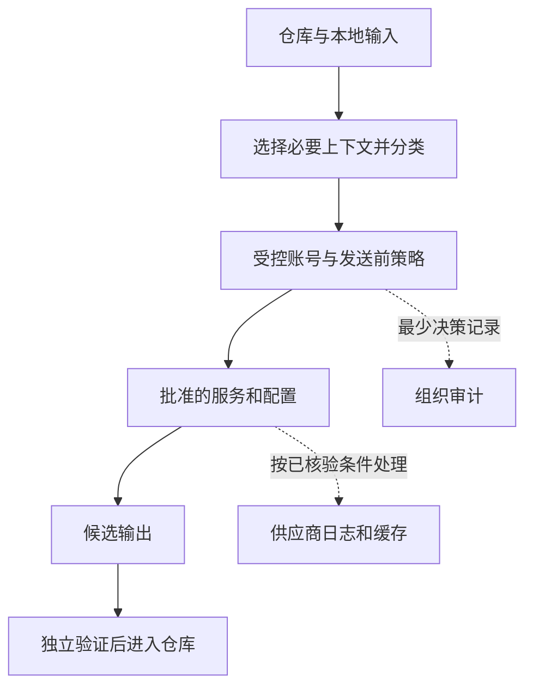

# 团队允许用 AI，究竟允许发送什么

## AIDEV-10 AI 研发工具准入、数据与团队治理

团队批准了一款代码助手。有人用组织账号生成公开示例，有人把客户工单贴到同名产品的个人网页，还有人启用了插件，让助手自动索引整个主目录。三个人都说自己在使用“获批工具”，实际的数据接收者、账号和权限却完全不同。

本篇围绕一次修复请求建立治理模型：先看数据怎么流动，再决定什么组合可以使用，最后让配置、例外、日志与撤销在真实路径生效。读完应能解释一条规则在哪里执行、失效时会发生什么，以及如何在不复制敏感正文的情况下调查事故。

### 学习前先确认

- 直接前置：[AGENT-10 身份、授权、工具权限与运行隔离](../chinese-guides/agent-10-identity-authorization-runtime-isolation.md#agent-10)。理解授权与实际执行能力分别由哪一层限制。
- 直接前置：[AIGOV-01 AI 数据、模型变更、审计与问责](../chinese-guides/aigov-01-data-model-change-audit-accountability.md#aigov-01)。理解产品能力、配置版本、来源与责任的登记。

### 一、沿一次请求找出真正的数据接收者

开发者希望修复表格报错，可能只需要异常栈与几十行组件代码。IDE 却可能同时发送当前文件、邻近文件、检索片段和工具执行结果。请求经过组织代理、供应商、模型服务后，还可能进入诊断日志、缓存、支持系统或子处理商。最后的回答返回仓库，不代表所有中间副本都已删除。

先画出这条流，再核对每一段的负责人、目的、存储位置、访问者和保留规则。工具名称只帮助找到调查入口；网页、CLI、IDE 扩展、企业 API 与插件连接器应作为不同路径核验。同一个供应商的产品层级和组织设置也可能不同，不能从一份 API 条款推导个人网页的全部行为。



图中的“受控”是团队需要实现的控制点，不是所有 AI 工具自带的保证。例如只在代理设置过滤，但客户端仍能直接连接供应商，数据流就多出一条绕过路径。插件、MCP Server 和浏览器自动化还会引入新的接收者与执行者，需要分别登记，不能借用主工具的批准。

“本地模型”也只是部署位置的描述。需要继续检查遥测、更新下载、崩溃报告、云端回退、扩展访问与共享缓存。禁用外发和实际限制出口需要配置与验证，不能由“模型在本机”四个字推导出来。

### 二、把数据分类变成发送前能回答的问题

**数据分类（Data Classification）**按照信息泄露和误用的后果，决定它可以由谁、为哪个目的、在什么条件下处理。等级名称由组织确定；本篇用公开、内部、客户个人信息和秘密四类演示，不声称它们是统一法规分类。

源码不是同一种数据。开源教学例子可能公开，内部业务规则可能机密，测试文件也可能含真实客户姓名或生产 token。日志更常混合多类内容：错误码可以分享，但旁边的请求头和 URL 参数未必可以。分类应针对实际发送片段，遇到无法分开的混合材料先采用更严格条件，再做拆分。

脱敏要保留调试所需结构，同时去掉身份与秘密。例如把客户姓名换成合成人名，把生产 token 替换为明确无效的占位符，保留错误码、字段类型和事件顺序。仅遮住界面不等于修改上传内容；稳定哈希、截图、摘要和 embedding 也可能保留身份关联或原文信息，不能自动降为公开数据。

下面的矩阵是虚构团队的一份政策草案，用于说明规则怎样具体化。三类工具均需登记实际配置，“待复核”意味着发送尚未获准；本地列还假设已限制外发、限定仓库并受组织管理。

| 材料 | 组织 IDE 助手 | 受控 API 代理 | 受管本地模型 |
| --- | --- | --- | --- |
| 公开代码 | 可用于批准任务 | 可用于批准任务 | 可用于批准任务 |
| 内部源码 | 限已批准仓库和功能 | 限批准模型、地区和保留条件 | 限设备与目录权限 |
| 客户个人信息 | 默认不发送，先用合成数据 | 需专门目的、批准与最小字段 | 仍需目的与访问审查 |
| 密钥 | 禁止作为上下文发送 | 禁止作为上下文发送 | 禁止作为上下文发送 |
| 生产日志 | 本地裁剪后重新分类 | 本地裁剪后重新分类 | 同样裁剪并限制保留 |

矩阵表达本团队的风险选择，不能用它宣称某真实产品“不训练”“零保留”或满足某地区要求。真实使用时应将合同、供应商文档、控制台配置和验证记录逐项绑定；查不到的条件明确写未知。先使用合成材料，可以让多数调试继续进行，而不必等待全部客户数据许可。

### 三、批准的是配置组合，不是一个产品名字

**批准工具（Approved Tool）**在这里指一组有期限的条件：产品与功能、组织账号、模型、地区、仓库、数据等级、目的、保留期和执行权限。批准补全不能自动授权 shell；批准一个仓库不能自动索引相邻目录；批准一个模型也不能自动允许客户端回退到另一个供应商。

可给组合一个稳定编号，例如 tool-profile-17，再保存 policyVersion、owner、核验日期与证据地址。每次调用记录组合编号和版本。这样供应商更改保留设置时，团队能找到受影响的仓库，而不是重新搜索所有聊天记录。组合版本的基本机制见 [AIGOV-01](../chinese-guides/aigov-01-data-model-change-audit-accountability.md#三批准必须绑定整个配置组合)。

组织账号负责统一入离职、角色、SSO、MFA 与撤销。服务凭据还要有 owner、用途、过期和轮换。使用获批域名但登录个人账号，仍可能落入另一套数据处理条件。个人网页是否允许用于纯公开材料由组织政策决定，不能把域名命中直接等同于内部数据泄露。

对于只能提供粗粒度授权的工具，应减少它能看到的目录、数据和凭据，或只允许低风险用途。如果工具不能满足某个必需条件，就保留无 AI 的工作路径，不能把无法执行的政策写成已实现控制。公开工具目录最好直接说明“这个任务该用哪个入口、可以传什么”，减少成员凭印象猜测。

### 四、让策略在每一次发送时重新生效

**策略执行（Policy Enforcement）**指在真实数据路径上计算并执行允许、拒绝或待复核的决定。策略文件本身不会阻止上传；必须有网关、客户端、身份或网络控制承接决定，并覆盖可能绕过的入口。发送前检查还要绑定真正将发送的内容，避免检查后上下文自动扩展。

下面是完整的离线策略实验。保存为 `tool-policy.mjs`，用 Node.js 22 执行 `node tool-policy.mjs`。输入均为合成元数据，没有真实账号、正文或网络发送。生产中的身份、数据标签、配置版本和时间应由可信系统取得，不能接受调用者自己声称“我已经审批”。

```js example=aidev10-policy
const now = Date.parse('2026-10-07T08:00:00Z');
const profile = {
  id: 'tool-profile-17', policy: 'p4', tool: 'org-api', account: 'team-a',
  model: 'model-a', region: 'region-a', retentionDays: 7,
  repo: 'report-ui', purpose: 'debug', capability: 'text-only',
};
const binding = Object.keys(profile);
function decide(request, exception, clock) {
  if (!['public', 'internal', 'customer', 'secret'].includes(request.dataClass)) {
    return 'deny:unknown-class';
  }
  if (request.dataClass === 'secret') return 'deny:secret';
  if (binding.some(key => request[key] !== profile[key])) return 'deny:profile';
  if (request.dataClass !== 'customer') return 'allow:standard';
  const expires = Date.parse(exception?.expiresAt ?? '');
  const active = exception?.approvedBy === 'data-owner'
    && exception?.state === 'active'
    && exception?.dataClass === request.dataClass
    && binding.every(key => exception[key] === request[key])
    && Number.isFinite(expires) && clock < expires;
  return active ? 'allow:exception' : 'review:customer';
}
const request = { ...profile, dataClass: 'internal' };
const customer = { ...request, dataClass: 'customer' };
const exception = {
  ...customer, approvedBy: 'data-owner', state: 'active',
  expiresAt: '2026-10-07T09:00:00Z',
};
console.log(decide(request, null, now)); // => allow:standard
console.log(decide(customer, null, now)); // => review:customer
console.log(decide(customer, exception, now)); // => allow:exception
console.log(decide(customer, exception, Date.parse(exception.expiresAt)));
// => review:customer
console.log(decide({ ...request, capability: 'shell' }, null, now));
// => deny:profile
console.log(decide({ ...customer, dataClass: 'secret' }, exception, now));
// => deny:secret
console.log(decide(customer, { ...exception, state: 'revoked' }, now));
// => review:customer
```

先判断不可外发的秘密，再核对配置，最后处理例外，所以一个“已审批”的对象不能覆盖硬性拒绝。到期时刻使用严格小于，等于到期时间即失效；撤销后的例外也不能继续使用。把模型、地区、保留或 capability 改掉，旧批准不会跟着扩张。

实验只验证规则计算，不实现账号真实性、数据分类器、DLP、签名或网关隔离。真实系统还需保证调用者不能绕过 decide，决定与发送使用相同配置和材料，策略变更能及时失效缓存。客户字段的专门审批也不代表法律依据自动成立，必须由组织依据实际业务和义务确定。

DLP 是识别和限制敏感内容的数据防泄漏控制。正则只能抓到部分已知格式，语义机密、压缩附件和截图可能漏检，公开测试字符串也可能误报。应给高风险仓库配置受控出口和明确禁止范围，同时提供申诉与纠正路径；不能把“扫描零命中”当成数据公开的证明。

### 五、临时例外需要完整的结束动作

**例外生命周期（Exception Lifecycle）**包括申请、接受风险、限定范围、启用、到期或撤销、清理与关闭。紧急调试不是无限许可，应说明材料、用途、账号、接收者、补偿控制、批准人和截止时间。审批者要有承担相应风险的责任，模型不能替组织签字。

假设一次客户故障需要临时发送经裁剪的三条事件。批准应绑定那份材料或可复核的范围、工具配置和策略版本；补偿控制可以是短期隔离存储、禁正文日志和人工审查输出。如果后来新增整个工单附件，就需要重新判断，不属于原来的三条事件。

到期不仅要在 UI 显示“已失效”，还要阻断新调用、清理待发送队列、失效缓存并撤回临时权限。已经发送的材料不能通过本地取消收回；需要按供应商与组织的删除机制处理副本，并保存确认与未覆盖范围。正常关闭则记录临时数据是否删除、相关 token 是否撤销、是否仍有在途任务。

续期要依据新证据重新决定。频繁申请同一种例外可能说明批准路径缺失，应建设更合适的工具配置或明确不支持该任务。用无到期的白名单消除申请次数，只会把临时风险永久藏起来。

### 六、日志要能解释决定，又不重复保存敏感正文

治理审计通常需要 requestId、主体标识、工具配置版本、数据分类、目的、决定、原因码、例外编号、时间和结果类别。默认不需要整段提示、仓库源码、附件或模型输出。采集前做字段允许列表，比“全部写入之后再脱敏”更容易控制副本数量。

下面保存为 `audit-event.mjs`，用 Node.js 22 运行。使用人工创建的非真实文字观察哪些字段留下；这不是通用脱敏器，也不要给它喂真实秘密做演示。

```js example=aidev10-audit
const request = {
  id: 'request-demo-1', profile: 'tool-profile-17', policy: 'p4',
  dataClass: 'internal', prompt: '合成的内部源码片段',
};
function audit(input, decision) {
  return {
    requestId: input.id, profile: input.profile, policy: input.policy,
    dataClass: input.dataClass, decision,
  };
}
const event = audit(request, 'allow:standard');
console.log(Object.keys(event).join(','));
// => requestId,profile,policy,dataClass,decision
console.log('prompt' in event); // => false
```

没有把输入对象整体展开，所以新增 prompt 等正文不会自动进入日志。如果把实现改成复制整个 request，再删除少数已知字段，就需要不断追赶以后新增的敏感字段。实际日志还要约束 ID、错误文本与原因码的格式，不能让外部输入借这些字段夹带正文。

组织代理、供应商、IDE 缓存、索引、对话记忆和备份各有保留位置。应为每处指定期限、访问控制、删除办法和负责人。“不用于训练”“不保存正文”“界面清空”是不同承诺。需要正文诊断时，单独授权短期存储，不把临时调查变成全量长期采集。

删除验证包括查询主存储和索引、检查缓存、确认供应商处理以及备份恢复后的删除策略。日志访问也要审计。更细的采集与回放边界见 [AGENT-09](../chinese-guides/agent-09-observability-read-only-replay.md#四先裁剪字段再让事件进入存储)；本地事件没有 prompt 不能证明供应商没有副本。

### 七、让输出审核与团队日常工作衔接

获批输入路径不保证输出正确。生成代码仍要做需求验证、评审、来源与依赖检查；自动执行命令、发布或生产写入需要另外的授权边界。不要把“这是企业账号生成的”当成跳过普通工程生命周期的理由。来源安全详见 [AIDEV-07](../chinese-guides/aidev-07-dependency-source-security.md#六生成代码的出处与使用许可要单独核验)。

团队规则应提供实际可用的替代：受控 API 不可用时能否转本地合成材料，插件无法限权时能否只使用文本建议，模型故障时怎样回到人工流程。审批耗时太长、批准工具缺关键能力，容易促使成员绕过流程，必须同时改善合规路径。

影子 AI 是绕过组织批准条件处理组织数据的行为。可结合组织账号、受控出口、扩展清单和最少事件发现异常，但域名访问只提供线索，不证明发了什么，也不应成为收集员工所有聊天的理由。发现异常时先核实账号、用途、数据类别和实际发送结果，并允许纠正误报。

衡量效果也要回到同类任务：交付周期、返工、评审时间、缺陷和恢复耗时，比生成行数或 token 更接近结果。风险侧观察过期例外、新增绕过路径、未解决缺证据项与撤销延迟。不要用使用率迫使所有人上传更多上下文，也不要用“零事故”压制主动报告。

### 八、事故演练验证控制是否真的连在一起

以“已批准代理把客户正文写入调试日志”为例，先停用相关日志采集与继续发送的路径，限制访问，并保存最少的事件时间线。若含密钥，撤销轮换凭据；删除日志不能让已经泄露的凭据重新安全。随后确定涉及的版本、账号、时间范围、接收者、派生索引与备份。

调查材料使用受限证据入口，不把原文复制到普通工单“便于沟通”。按实际合同与适用义务由安全、隐私、法律和业务责任人决定通知与后续动作，不从一个通用框架推导统一通知期限。恢复前修复默认配置、历史副本与绕过路径，并重新验证原来能触发泄露的样例。

演练使用合成材料和隔离账号，依次观察公开材料允许、秘密拒绝、个人账号不符合配置、例外到期、代理绕过、日志裁剪和撤销传播。每个结果要指出执行点：规则函数拒绝、网关拒绝、网络阻断或供应商删除确认是不同证据。模拟函数全部通过不代表真正网络隔离已经完成。

供应商的模型、地区、条款、子处理商、插件权限和默认保留变化都应触发事件驱动复审。退出时导出必要配置、删除数据、撤销账号和连接，回到可用替代。工具 owner 负责跟踪这些变化，而不是让每位开发者碰运气看到更新公告。

### 带着问题回看

1. 同名企业 API 已获批，为什么个人网页和新插件仍需分别判断？
2. 实验中把 capability 改为 shell，为什么不能继续使用原批准？
3. 例外到期时请求已在供应商处理，哪些动作能停止，哪些需要对账或删除确认？
4. 本地日志没有 prompt，还需要检查哪些副本才能说明保留边界？

### 参考与延伸阅读

核验日期：2026-10-07。本文的矩阵、期限和规则均为教学用组织约定，不代表任何供应商默认设置。

- [NIST AI RMF](https://www.nist.gov/itl/ai-risk-management-framework)：用于组织风险治理、范围识别、测量与处理；框架是自愿使用的管理方法，不是自动合规认证。页面提供 AI RMF 1.0 与生成式 AI Profile 的入口，使用时记录具体版本。
- [NIST AI RMF Playbook](https://airc.nist.gov/airmf-resources/playbook/)：用于进一步检查责任、记录与风险响应活动；应映射到团队实际控制点。
- [MCP 安全最佳实践](https://modelcontextprotocol.io/specification/2025-11-25/basic/security_best_practices)：核对接入 MCP 时的具体协议安全边界；MCP 接入不是工具整体准入的替代。
