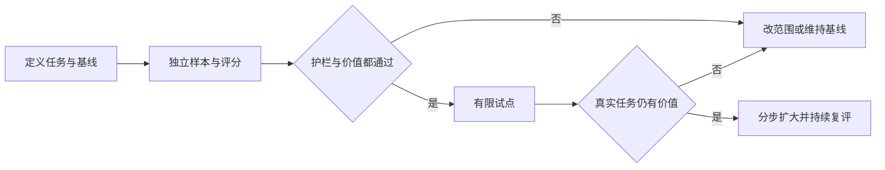

# AI 产品任务与价值验证知识点讲义

## AIPROD-01 AI 任务定义、模型选择与价值验证

客服原来用两分钟整理一张工单。接入模型后，摘要五秒就出现了，团队于是说“效率提升了二十多倍”。实际使用时，客服还要打开原文核对日期、修改承诺、补回遗漏，有时干脆重写。五秒描述的是生成速度，用户真正要完成的整理任务还没有结束。

本讲沿“工单交接摘要”建立一条判断路径：先定义什么叫完成，再建立不用 AI 的参照，最后比较完整方案的质量、成本和失败。读完后，你应能写出可验证的任务卡，用相同样本比较候选，并有依据地决定试点、缩小范围或不采用 AI。

### 学习前先确认

- 直接前置：[PRIVACY-01 数据最小化、同意、留存与权利](../chinese-guides/privacy-01-data-minimization-consent-retention-rights.md#privacy-01)。评测样本和运行日志也有明确的目的、访问者与保留期限。
- 直接前置：[BIZ-08 需求到验收的可追踪性](../chinese-guides/biz-08-requirement-acceptance-traceability.md#biz-08)。需要把用户目标变成输入、观察结果和版本证据。

### 一、把任务写成可以观察的完成条件

“做 AI 客服”包含查订单、解释政策、草拟回复、退款和投诉升级等不同动作，不能用一个准确率评价。先缩到一个任务：晚班客服接手工单时，用已有记录生成可编辑的交接摘要，确认后保存到内部草稿，不自动发给客户。

一张任务卡不需要很长，但要让另一位同事知道如何判断结果。下面是教学项目的自定约束，不是行业统一阈值：

| 项目 | 工单交接摘要的决定 |
| --- | --- |
| 用户与终点 | 接班客服核对后保存内部摘要，下一位客服能继续处理 |
| 输入 | 已授权的聊天记录、订单状态及当前政策；附来源时间 |
| 必须保留 | 客户诉求、已经做过的动作、仍待处理事项、已明确承诺的期限 |
| 不允许补全 | 没有证据的退款承诺、身份、金额和完成时间 |
| 缺信息时 | 标为待核实，并链接到缺失或冲突的位置 |
| 首版范围 | 单个中文工单；复杂跨单争议继续走人工流程 |
| 价值与约束 | 完整整理时间下降；关键错误、数据泄漏、延迟与费用不越界 |
| 退出方式 | 保留原文与人工模板；停止模型仍能交接 |

看一条输入：“客户周二来电说尚未到账，客服表示先核对支付回执。”合格摘要可以写“客户反馈未到账；待核对回执”。写成“退款失败，将在周三补发”则新增了两个没有来源的结论。即使语句更流畅，也没有完成任务。

把过程拆成读取、提取事实、草拟、核对、保存后，会发现很多步骤不需要模型。金额来自可信订单字段；保存权限由业务系统决定。生成式 AI 擅长产生文本变体，不因此拥有事实源或执行权。如何把验收写成可观察输入输出，参照 [BIZ-08 的验收条件](../chinese-guides/biz-08-requirement-acceptance-traceability.md#三验收条件写输入观察和不能发生的事)。

### 二、先比较规则、搜索和人工，再比较模型

**问题—方案匹配（Problem Solution Fit）**表示方案真的适合这个任务的结构和约束。它不是“能生成一段演示”的同义词。为交接摘要保留以下候选，有助于看清模型究竟增加了什么：

| 候选 | 更适合的输入 | 主要代价或失败 |
| --- | --- | --- |
| 固定模板加订单字段 | 事实已结构化，输出格式稳定 | 不擅长整理散落的自然语言 |
| 搜索原文加人工摘录 | 用户主要需要找到已有证据 | 人工仍需组织，但来源直接可见 |
| 传统分类或抽取模型 | 标签稳定、训练数据足够 | 标签外的新任务需重新定义与评测 |
| 生成模型草拟加人工核对 | 记录冗长、表达多样，核对依据齐全 | 可能虚构、遗漏或增加复核负担 |
| 完全人工或暂不建设 | 低频、高语境、后果难恢复 | 人力成本较高，但可避免不合适的自动化 |

NIST 的 [Map 指南](https://airc.nist.gov/airmf-resources/playbook/map/)把使用情境、潜在影响与非 AI 替代方案一起考虑。本例的选型矩阵是依据这一思路自编的设计工具，不是 NIST 规定的固定产品分级。

**基线（Baseline）**是比较改善时使用的参照，可以是当前人工流程，也可以是最简单的模板。基线本身也可能有错，因此要记录它的耗时、遗漏和补救，而不是默认人工百分之百正确。比较时两边应有同样的事实来源、完成标准和计时终点；不能让人工从零找材料，却给模型整理好的输入。

假如用户其实只想知道订单是否退款，调用订单查询并显示状态通常就够了。给查询结果加一段自然语言解释未必值得引入新的不确定性。只有开放文本整理确实减少完整任务负担，模型候选才有进一步比较的理由。

### 三、先建立评分依据，再收集更多答案

评测集是一组用来判断系统表现的任务输入、参考事实和判定规则。对于摘要，不要求每个候选逐字相同，而是检查哪些事实必须出现、哪些说法缺乏支持。先选少量样本让两位复核者独立判断，发现“是否算遗漏”的分歧，再修订量表。

| 原始事实或输出 | 判定 | 原因 |
| --- | --- | --- |
| 原文明确说“周五再次联系”，摘要保留日期 | 覆盖期限 | 表述可以不同，含义有证据 |
| 原文没说到账日，摘要写“明日到账” | 严重事实错误 | 把猜测变成承诺 |
| 原文存在两个冲突金额，摘要只取较小值 | 遗漏冲突 | 看似简洁却丢失决策依据 |
| 输入缺政策版本，输出明确待核实 | 正确保留未知 | 没有为填满字段而编造 |

按真实分布抽样，并另设长工单、缺字段、冲突、少见语言、提示注入和历史失败等分层。评测输入的授权、脱敏与删除同样需要管理，详见 [PRIVACY-01 的 AI 用途边界](../chinese-guides/privacy-01-data-minimization-consent-retention-rights.md#十二供应商与-ai-用途也要能停止和退出)。

开发集用于改提示和流程；留出集在决策时使用。一个工单的多个片段、同一客户近似记录若分散在两边，可能产生泄漏，因此分割应考虑业务对象与时间，不只随机拆行。已经反复看过的留出失败可转入回归集，再补新的独立样本。否则团队学会的是答熟悉的题，不是处理未见任务。

模型评审能帮助初筛语义问题，但也会偏爱长答案、受提示影响或重复另一模型的错误。应与人工标注校准，关键事实回到原始证据。格式合格、引用存在和引用支持结论也要分开评价。

### 四、总体分数不能掩盖最需要帮助的人

把下面每个 JavaScript 块单独保存为 `.mjs` 文件，用 Node.js 22 运行，或在现代浏览器控制台执行。全部数据为合成样本，不来自真实模型测评。

第一组数据中，常规任务 90 条，复杂任务 10 条，模型分别正确完成 90 和 2 条。总体达到 92%，却不适合对复杂任务承诺可靠：

```js example=aiprod01-slices
const slices = [
  { name: '常规', total: 90, passed: 90 },
  { name: '复杂', total: 10, passed: 2 }
];
const total = slices.reduce((sum, x) => sum + x.total, 0);
const passed = slices.reduce((sum, x) => sum + x.passed, 0);
console.log(`${passed / total * 100}%`); // => 92%
console.log(`${slices[1].passed / slices[1].total * 100}%`); // => 20%
```

如果下一周复杂任务占比提高，总体分数会下降，即使两个分层内的能力完全没变。这叫输入分布变化，不一定是模型退化。反过来，删除困难用户也能把总体分数抬高，却没有解决他们的问题。需要按有实际用途且合乎数据边界的维度分层，解释缺样本与不确定性。NIST 的 [Measure 指南](https://airc.nist.gov/airmf-resources/playbook/measure/)强调在预期使用条件下评价，并检查数据代表性。

零次严重错误只表示在这批样本中没观察到。它不能证明未来概率为零。样本较少时应报告数量、分母和可能误差；比较两候选可采用同任务配对评分与差值区间。不要把一次随机采样的细小优势当稳定提升，也不要事后换计分方法来选中偏爱的方案。

### 五、成功指标与护栏分别决定什么

成功指标衡量任务是否更容易完成，例如核对后保存摘要所需的人工分钟。**护栏指标（Guardrail Metric）**限制不能用来换取提速的损害，如新增承诺、敏感字段泄漏、权限越界、复杂任务退化或不可接受的等待。

教学项目可先规定：“完整时间至少减少 20%；出现未经证据支持的对外承诺则暂停；未覆盖的任务继续人工。”这不是说所有风险都能用一个百分比加权抵消。有些约束是候选入围条件，不能以其他项目的高分补偿。

下面比较同一批 100 个任务。时间包含读输入、编辑、核对、失败回退；费用为假设的整批增量费用，不是任何供应商现价。`serious` 是本批观察到的严重错误数量：

```js example=aiprod01-candidate-gate
const baselineSeconds = 12000;
const candidates = [
  { name: '模板', completed: 100, totalSeconds: 10000, cost: 2, serious: 0 },
  { name: '快速草拟', completed: 100, totalSeconds: 6000, cost: 8, serious: 2 },
  { name: '核对草拟', completed: 100, totalSeconds: 9000, cost: 12, serious: 0 }
];
const eligible = candidates.filter((x) => x.completed === 100
  && x.serious === 0 && x.totalSeconds <= baselineSeconds * 0.8 && x.cost <= 15);
console.log(eligible.map((x) => x.name).join(',')); // => 核对草拟
console.log(`${(1 - eligible[0].totalSeconds / baselineSeconds) * 100}%`); // => 25%
console.log(candidates.filter((x) => eligible.includes(x) && x.cost <= 5).length); // => 0
```

最快的候选被护栏挡住；模板没达到预先约定的时间收益；收紧预算后没有候选通过。正确结论可以是继续基线，而不是悄悄抬高预算或删除失败记录。通过这个算例只说明决策程序符合给定数据，不能证明“核对草拟”在真实环境达标。

评估延迟要说清从哪里到哪里。首个 token 到达、完整生成、校验完成和用户核对结束是不同终点。P95 表示所选样本中约 95% 的值不超过该位置，并不等于所有请求的上限。包括超时与放弃的任务，才能避免只统计成功快请求。质量分数也要保留拒答、无结果和失败分母，不能先过滤掉再计算。

### 六、把审核和失败放进成本账本

模型调用费用通常只是成本的一部分。检索、工具、存储、评测、支持、人工核对和补救都可能改变结论。功能单位应当是“每个有效完成的交接”，而不是“每千次调用”。一次任务重试三次，不能同时算成三个成功任务。

下面把人工时间也换算成教学成本单位，方便复算。假设一小时 60 单位，100 个任务从 200 分钟降到 150 分钟，模型与其他服务增加 12 单位：

```js example=aiprod01-full-cost
const tasks = 100, hourlyCost = 60;
const before = 200 / 60 * hourlyCost;
const after = 150 / 60 * hourlyCost + 12;
console.log(before.toFixed(2)); // => 200.00
console.log(after.toFixed(2)); // => 162.00
console.log(((before - after) / tasks).toFixed(2)); // => 0.38
const extraReview = 45 / 60 * hourlyCost;
console.log((after + extraReview > before)); // => true
```

再增加 45 分钟复核，方案就超过原成本。这不是建议用金钱抵消严重错误，而是在满足护栏后检查产品是否仍有价值。节省的时间也未必能直接减少支出；它可能用于服务更多任务，或只是把等待转移到了另一个岗位，需由真实流程观察确认。

长输入、重试、高峰和供应商限流会形成尾部成本。做低、中、高流量情景，设置每任务预算、并发上限和失败回退；缓存按用户范围、内容版本和权限隔离。缩短上下文可能便宜，也可能漏掉关键事实，必须重新测质量。模型名称、价格、保留政策和服务区域具有版本条件，本讲不固定推荐某个供应商或引用未核实的现价。

### 七、模型选择要连同提示和工具一起冻结

候选实际上是一套系统配置：模型及版本、提示、检索语料、排序、工具、输出校验与人工界面。同一模型在不同事实来源下的结果可能差很大。离线比较时记录这些配置及每个样本输出；不只保留最后的平均分。

先按不可协商条件筛选，例如数据能否发送到该服务、是否满足部署地域、是否支持所需输入和输出。再比较本任务的质量、延迟、费用和运维复杂度。上下文窗口容得下全文，不保证模型能稳定利用全文；支持工具调用，不保证参数正确；支持结构化生成，也不代表业务规则自动成立。工具契约本身见 [MCP-01 的 Schema 边界](../chinese-guides/mcp-01-server-tools-resources-prompts-schema.md#五schema-检查形状业务规则检查含义)。

公开榜单适合缩小候选范围，不能替代本领域样本。有些任务规则已经足够；困难任务交大模型、常规任务交小模型的路由方案，也要评估路由器是否把危险任务误送到弱路径。容灾切换不是把 URL 换掉，输出格式、拒答和数据政策都需要核验。

模型自报“我有 92% 把握”不是经本任务校准的成功概率。界面更有用的信息是“已找到哪条来源、哪些字段缺失、存在什么冲突”。对于不可自动验证的高影响动作，即使模型很流畅，也可能只能提供草稿；自动化程度另见 [AIPROD-02 的风险分级](../chinese-guides/aiprod-02-high-risk-automation-human-in-the-loop.md#一按后果和影响范围决定自动化程度)。

### 八、试点要观察整个用户任务

离线评测先筛掉明显不合格方案。影子运行让系统处理真实分布的授权输入，但不影响业务决定；它能发现时延、数据和接入问题，却无法单独证明用户节省了时间。之后的小范围试点才让用户实际核对和编辑，并保留人工模板与退出方式。



试点前写清适用人群、时间窗口、最低证据量、扩大条件与负责人。可以稳定分流做对照；如果团队成员会互相抄用摘要，需考虑分流单位和组间影响。无法随机比较时，记录任务难度、班次和人员经验等混杂因素，收窄因果结论。

“采用率高”可能来自默认按钮更方便，“对话次数多”可能来自反复失败。应查看是否真的完成交接、人工改了什么、有没有线下重新查证。错误状态也属于产品：超时保留输入，检索为空说明缺少来源，部分成功列出已完成部分，供应商不可用允许人工继续。通用恢复设计可参照 [UX-01 的恢复动作](../chinese-guides/ux-01-interaction-states-usability-validation.md#五恢复动作说清将处理哪一部分)。

### 九、停止也是一种完整的产品结论

**停止条件（Stop Criterion）**是在看到试点结果之前约定的暂停、收缩或退出触发点。条件要有阈值、判断证据、负责人和立即动作。例如出现敏感数据外泄时关闭相关数据流并定位范围；复杂任务遗漏明显升高时先停止该分层；时间收益在预算耗尽后仍不足则保留模板。

停止不应删除不利证据。保留任务版本、输入来源说明、评分规则、失败样本与决定；敏感原文按最小化和留存政策保存，不能借“可复算”无限存储客户资料。只有任务范围、能力或控制措施发生了具体改变，且重新取得证据，才讨论重启。

上线后模型、提示、语料和用户任务都会变化。给整套配置版本化，变更前跑核心回归，变更后观察实际分布与异常。政策已更新时，旧参考答案也可能错；应由负责人重审标签，而不是为了保持旧分数把新事实判错。NIST [Manage 指南](https://airc.nist.gov/airmf-resources/playbook/manage/)提供持续处理、响应与退出的管理视角。

判断仍然回到开始的问题：下一位客服是否能更快、更准确地继续处理？如果答案是否定的，模型还能生成更多文字并不能挽救价值假设。

### 带着问题回看

- 生成只用五秒，为什么仍要记录核对、失败回退和最终保存时间？
- 总体 92%、复杂任务 20%，哪些部署结论不能成立？
- 候选门禁中预算收紧后无一通过，下一步有哪些合理选择？
- 模型没变，检索政策更新了，为什么仍需重新评测？

### 参考与延伸阅读

核对日期：2026-09-26。本文的任务卡、阈值、费用与实验数据均为教学自编，不是厂商性能结论或法规要求。

- [NIST AI RMF](https://www.nist.gov/itl/ai-risk-management-framework)：了解风险管理框架的目标与使用范围。
- [NIST Playbook：Map](https://airc.nist.gov/airmf-resources/playbook/map/)：查任务情境、受影响者与非 AI 替代方案的考虑方式。
- [NIST Playbook：Measure](https://airc.nist.gov/airmf-resources/playbook/measure/)：查代表性、评价方法、指标解释和不确定性。
- [NIST Playbook：Manage](https://airc.nist.gov/airmf-resources/playbook/manage/)：查持续响应、控制调整与退出。
- [NIST 生成式 AI 风险管理资料 NIST AI 600-1](https://nvlpubs.nist.gov/nistpubs/ai/NIST.AI.600-1.pdf)：补充生成式 AI 的虚构内容、人与 AI 配置及生命周期风险。它不替你选择具体模型。
