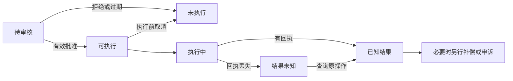

# 高风险 AI 自动化与人工控制知识点讲义

## AIPROD-02 高风险自动化分级、失败 UX 与 Human-in-the-loop

审核者看过“把旧资料移动到归档区”的预览，点击批准。几秒后，系统执行的却是“删除整个共享目录”，因为模型重新生成了参数，而页面仍显示刚才的批准状态。问题不在于少了一个确认按钮，而在于批准没有绑定执行的对象与版本。

本讲从后果判断自动化程度，再沿“建议、审核、执行、未知结果、纠正”建立控制。读完后，你应能说明人在哪一步仍能改变结果，哪些条件会让旧审批失效，以及失败后怎样继续任务。示例只操作内存里的资料变更，不接触真实账号、付款或正式业务记录。

### 学习前先确认

- 直接前置：[AIPROD-01 AI 任务定义、模型选择与价值验证](../chinese-guides/aiprod-01-ai-task-model-selection-value-validation.md#aiprod-01)。先有任务价值与失败证据，再决定自动化程度。
- 直接前置：[UX-01 交互状态、信息架构与可用性验证](../chinese-guides/ux-01-interaction-states-usability-validation.md#ux-01)。审核、拒绝与恢复必须是用户能完成的流程。
- 直接前置：[BIZ-07 异常边界、幂等与一致性](../chinese-guides/biz-07-errors-idempotency-eventual-consistency.md#biz-07)。需要区分未执行、已失败与结果未知。

### 一、按后果和影响范围决定自动化程度

同样是 1% 的错误，把内部草稿标题写错，与向外部收件人发出整份客户记录，不能用同一控制策略。风险判断至少需要知道错误的严重程度、发生可能性、涉及多少人、数据敏感度、能否发现，以及发现时还来不来得及恢复。

下面是资料平台的示意政策。分级与阈值由这个教学项目决定，不是模型能力等级，也不是某项法规的通用分类：

| 动作 | 后果与可发现性 | 本例自动化范围 |
| --- | --- | --- |
| 草拟内部交接摘要 | 可编辑，有原文供核对 | 生成草稿，用户保存 |
| 修改一条可恢复的资料标签 | 影响小，有历史版本 | 在明确授权范围内执行并提供撤销 |
| 移动共享资料目录 | 影响多人，可能打断链接 | 预览差异，具备权限的人确认 |
| 大批量修改共享访问范围 | 敏感且影响面大 | 两名独立角色审核，执行前再检查 |
| 把私有资料发往未知外部地址 | 不能充分验证目的与恢复 | 阻止执行，转人工处理需求 |

模型置信度不在表格第一列，因为它不能独自决定允许动作。模型很有把握但来源冲突、用户身份异常或影响范围突然扩大，都应升级检查。批量风险按总效果判断：每次只改一条记录的工具，也可能在循环中改掉一万条。

工程上的“不允许自动化”应体现为执行器没有这条授权路径，不能只在提示词里写“请不要”。是否还需要专业判断或法律审查取决于真实领域；本讲的资料平台政策不推导医疗、信贷等领域的许可结论。更早的价值决策见 [AIPROD-01 的候选比较](../chinese-guides/aiprod-01-ai-task-model-selection-value-validation.md#二先比较规则搜索和人工再比较模型)。

### 二、可逆要看外部影响能否真的恢复

**可逆性（Reversibility）**是能否在可接受时间和代价内恢复相关状态与影响。把标签从 A 改到 B，再改回 A，通常比较容易；已经被下载的敏感文档，即使撤回链接也无法保证副本消失。数据库回滚与现实后果恢复并不等价。

因此要区分三种操作：执行前取消是让待办不再开始；执行中停止是尽量中断剩余工作；执行后补偿是一个新的业务动作。补偿也可能失败，并且不能假装历史从未发生。相应机制详见 [BIZ-07 的补偿](../chinese-guides/biz-07-errors-idempotency-eventual-consistency.md#九补偿是一个新的业务动作有自己的结果)。

例如批量移动十个资料夹，已经移动六个时取消：界面应显示六个已完成、四个未执行。用户可以另行申请移回六个，但要检查期间是否有人修改内容。“取消成功”如果只指取消了本地请求，就不能显示“所有资料均未变化”。

撤销窗口也要有服务器时间、适用状态和到期后的下一步。已发送邮件不能靠前端十秒倒计时保证收回；真正的延迟发送需要在服务端等待窗口结束再派发。未演练过恢复，就不要用“可回滚”降低风险。

### 三、人在回路需要信息、时间与否决权

**人在回路（Human in the Loop）**表示人在流程中有机会理解建议并影响结果。有效审核需要看到原始证据、具体变更、受影响对象、冲突与缺失，能够修改、拒绝、升级，并拥有足够时间。把人放在执行完成后的“确认已阅”位置，不能阻止已发生的损害。

审核页面可以分成事实、建议与后果三块：左边是资料当前版本和来源，中间是本次差异，右边说明谁会失去访问、哪些链接会变化。模型生成的长篇推理不能替代原始依据；“系统评估风险很低”也不能取代对象列表。

**人工接管（Human Override）**是授权人员接过决定权或中止自动流程。接管后旧模型任务不能继续后台执行；晚到建议可以作为记录，但不能覆盖人工修改或重新激活旧动作。缺少证据、规则冲突、超范围、用户申诉和随机抽检都可触发接管，不能只依赖模型自报低置信。

审核者连续点击“同意”不一定说明质量高，也可能是任务太多、默认选项诱导或无法看懂差异。应抽样独立复核错误，观察推翻原因和处理时间。不要把“越快点完越优秀”作为唯一绩效；这样会把人工步骤变成装饰。NIST 的[生成式 AI 风险资料](https://nvlpubs.nist.gov/nistpubs/ai/NIST.AI.600-1.pdf)讨论了人与 AI 配置中的依赖、过度信任等风险。

### 四、确认必须绑定即将执行的具体版本

确认要回答“谁批准了谁对哪些对象做什么”。最低限度包括发起者、执行主体、动作类型、目标集合、关键参数、事实版本、策略版本、有效期与执行限制。用户说“好的”只有在上下文具体明确时才能表达相应意图，不能被泛化为以后所有相似操作的无限许可。

对资料变更而言，审核的是 `目录 D，版本 7，将 A/B 移至归档，影响两条链接`。若目录变成版本 8，或目标变成 A/B/C，原审核依据已变。服务端应拒绝旧审批，返回新差异要求重新查看。前端把按钮变灰能改善体验，但真正的检查必须发生在执行入口。

审批可以保存为受控数据库记录，并给执行器一个不可伪造或可验证的引用。签名令牌只是可能的实现之一：签名证明内容未被篡改，不自动发现审批者刚刚离职、对象已变化或许可已撤回。执行时仍需要检查当前事实及撤销状态，不能只检查令牌能否验签。

### 五、双人审批必须是两个独立决定

**双人审批（Four Eyes Principle）**要求两名符合资格的人依据同一版本独立判断。本例由资料负责人和安全审核者共同批准，发起者不能批准自己的请求，同一人重复点击也不能增加人数。所需角色、顺序、有效期和利益冲突约束由业务政策规定，并非所有系统统一要求两人。

可以让第二人查看第一人的依据，也可以先独立判断以减少跟随偏差；选择应符合具体风险。无论界面如何，服务端必须按可信身份去重，检查角色仍有效。共享账号点击两次不构成职责分离；代理审批也不能绕过资格要求。

参数、对象版本或策略变更后，已有审批应按规定失效；某位审核者资格撤回时，执行器要重新评估当前审批集合。紧急接管不能成为长期后门：需要独立授权、限定范围、时效和事后复核，模型不能自行宣布“紧急情况”并越权。

### 六、用内存实验观察旧审批为什么被拒绝

下面是完整的同步状态模拟，保存为 `approval-lab.mjs`，用 Node.js 22 运行，也可整体放入现代浏览器控制台。模拟两种角色、虚拟时钟、版本变化和执行回执丢失；没有真实登录、网络、数据库、签名或并发事务。身份是实验直接提供的字符串，所以它只能解释规则，不能证明真实权限隔离。

```js example=aiprod02-approval-lab
function createLab() {
  const people = new Map([
    ['owner', { role: 'owner', active: true }],
    ['reviewer', { role: 'reviewer', active: true }],
    ['maker', { role: 'owner', active: true }]
  ]);
  let now = 0, objectVersion = 7, writes = 0;
  let action = { target: 'D', destination: 'archive', version: 7, revision: 1 };
  let state = 'awaiting_review';
  const approvals = new Set(), grants = new Map(), receipts = new Map();
  const key = () => JSON.stringify([action.target, action.destination, action.version, action.revision]);
  const requireRule = (condition, reason) => { if (!condition) throw new Error(reason); };
  const reviewersValid = () => approvals.size === 2
    && [...approvals].every((id) => people.get(id)?.active)
    && new Set([...approvals].map((id) => people.get(id)?.role)).size === 2;
  return {
    approve(id) {
      requireRule(state === 'awaiting_review', '当前不能审批');
      requireRule(id !== 'maker' && people.get(id)?.active, '审批身份不合格');
      requireRule(!approvals.has(id), '同人不能双批');
      approvals.add(id);
    },
    issue() {
      requireRule(state === 'awaiting_review' && reviewersValid(), '缺少有效双人审批');
      const token = `grant-${grants.size + 1}`;
      grants.set(token, { key: key(), expires: now + 10, operationId: `op-${action.revision}` });
      state = 'approved'; return token;
    },
    edit() {
      requireRule(['awaiting_review', 'approved'].includes(state), '已开始的动作不能改参数');
      action = { ...action, destination: 'review', revision: action.revision + 1 };
      approvals.clear(); state = 'awaiting_review';
    },
    revoke(id) { people.get(id).active = false; },
    advance() { now += 11; },
    changeObject() { objectVersion += 1; },
    cancel() {
      requireRule(['awaiting_review', 'approved'].includes(state), '结果未知时须先查询');
      state = 'cancelled';
    },
    execute(token, loseReceipt = false) {
      const grant = grants.get(token);
      requireRule(grant && grant.key === key(), '审批快照已失效');
      // 返回已执行回执不产生新副作用；真实查询仍须验证访问主体。
      if (receipts.has(grant.operationId)) return receipts.get(grant.operationId);
      requireRule(state === 'approved', '当前不能执行');
      requireRule(now < grant.expires, '审批已过期');
      requireRule(reviewersValid(), '审批资格已撤回');
      requireRule(action.version === objectVersion, '对象版本已变化');
      state = 'executing';
      writes += 1;
      const receipt = { operationId: grant.operationId, status: 'succeeded' };
      receipts.set(grant.operationId, receipt);
      state = loseReceipt ? 'unknown' : 'succeeded';
      return loseReceipt ? { status: 'unknown' } : receipt;
    },
    reconcile(token) {
      const receipt = receipts.get(grants.get(token)?.operationId);
      if (receipt) state = receipt.status;
      return receipt?.status ?? 'unknown';
    },
    status() { return state; },
    writes() { return writes; }
  };
}
const attempt = (fn) => { try { fn(); return '通过'; } catch (error) { return error.message; } };
function ready() {
  const lab = createLab(); lab.approve('owner'); lab.approve('reviewer');
  return { lab, token: lab.issue() };
}
const one = createLab();
console.log(attempt(() => one.approve('maker'))); // => 审批身份不合格
one.approve('owner');
console.log(attempt(() => one.approve('owner'))); // => 同人不能双批
console.log(attempt(() => one.issue())); // => 缺少有效双人审批
for (const change of ['edit', 'revoke', 'advance', 'changeObject', 'cancel']) {
  const { lab, token } = ready();
  if (change === 'revoke') lab.revoke('owner'); else lab[change]();
  console.log(`${attempt(() => lab.execute(token))}；写入 ${lab.writes()}`);
}
// => 审批快照已失效；写入 0
// => 审批资格已撤回；写入 0
// => 审批已过期；写入 0
// => 对象版本已变化；写入 0
// => 当前不能执行；写入 0
const { lab, token } = ready();
console.log(lab.execute(token, true).status); // => unknown
console.log(attempt(() => lab.cancel())); // => 结果未知时须先查询
console.log(lab.reconcile(token)); // => succeeded
console.log(lab.execute(token).status); // => succeeded
console.log(lab.writes()); // => 1
```

五种变化发生在审批完成之后、实际写入之前，所以都阻断了效果。回执丢失则不同：内存“执行方”已经保存成功，调用方暂时只知道 unknown；查询回执后恢复 succeeded，重复同一意图仍只有一次写入。修改参数会清空审批，真实页面应保留用户的新草稿并呈现新差异，而不是把它悄悄改回旧值。

模拟令牌只是 Map 中的索引，容易猜到；这里没有用它充当真正的安全凭据。真实系统需要认证、对象授权、持久审批记录，以及把“校验版本、占用执行资格、记录业务效果”放到可保证一致性的提交边界。两个并发进程都先检查再写入，会绕过这个单线程实验里的顺序。外部系统还要配合幂等键、回执查询或对账，本例不证明跨服务恰好执行一次。

### 七、把失败状态翻译成用户下一步

最常见的误导是所有异常都显示“失败，请重试”。在高风险动作中，重试可能多执行一次。先表达目前知道什么，再给可用动作，通用原则见 [UX-01 的状态区分](../chinese-guides/ux-01-interaction-states-usability-validation.md#三先区分事实再决定显示哪些状态)。

| 当前事实 | 合适的说明 | 下一步 |
| --- | --- | --- |
| 证据不齐 | 尚不能判断这次变更是否合适 | 补来源或转人工，保留草稿 |
| 审核拒绝 | 未获批准，未执行 | 查看理由、修改或提出申诉 |
| 审批过期或对象变化 | 原预览已失效 | 展示新差异并重新审核 |
| 确认执行方未开始 | 本次未执行 | 满足当前权限和策略后再申请 |
| 调用超时且无确切结果 | 执行结果尚未确认 | 查询原操作，暂不创建新操作 |
| 部分完成 | 列出已完成、未完成与未知对象 | 处理剩余项或另行补偿 |

模型拒答、权限拒绝、格式错误和上游不可用也应分开：前者可能需要调整任务，权限不足不能靠重试绕过，错误格式需要系统修复，上游不可用可以保留草稿转人工。界面展示责任人和预计处理方式，避免只有无限转圈。



图中的取消只发生在尚能确定没有效果的阶段。结果未知时也可以提出停止剩余工作的请求，但界面不能声称已撤回全部效果。用任务 ID 关联建议、批准、执行与对账，不要因为换了聊天会话就丢掉业务状态。

### 八、审核队列不是无限容量的兜底

模型将所有不确定任务“转人工”听起来安全，但如果一天推来五千条、团队只能认真处理五百条，等待与草率点击会形成新风险。要把到达速度、平均处理时间、角色要求、班次和峰值写进容量计划。

下面是教学算术，不是排队模型或真实人员效率测量。三位审核者每小时工作，单条平均四分钟，预留 20% 时间处理沟通和例外：

```js example=aiprod02-review-capacity
const reviewers = 3, minutesPerCase = 4, availableRatio = 0.8;
const capacity = reviewers * 60 / minutesPerCase * availableRatio;
const arrivalsPerHour = 40;
console.log(capacity); // => 36
console.log(Math.max(0, arrivalsPerHour - capacity) * 6); // => 24
```

即使平均到达仅比容量多四条，六小时也积压二十四条。实际任务耗时有差异、审核者角色可能不可互换、突发到达也会延长等待，因此这个数字只能说明持续超载的方向，不能预测等待 P95。

达到积压或等待上限时，可以限流、停止新增自动建议、缩小适用范围或增加合格人员。不能因队列满了就自动批准。双人审核需要两种角色都可用；某角色缺席时应暂停或按既定替代政策处理，不能用两个同角色账号凑数。

### 九、审计与申诉让错误还能被纠正

审计需要重建“当时看到了什么、谁依据哪版规则作出决定、实际做了什么”。至少关联任务与对象版本、来源摘要、模型及提示配置、规则检查、审核者与角色、审批快照、执行回执和后续纠正。敏感正文按需要受控保存；日志无限记录全部输入，不是越详细越可信。

历史记录的纠正应追加说明，保留原决定和新证据。高风险动作要求完整留痕时，审计系统故障应阻断或进入事先设计的可靠待写机制，不能静默绕过。审批记录本身也要有访问控制与保留期限。

用户申诉应能提交补充事实，进入有权改变结果的独立复核路径。它不应再次交给同一自动判断无限循环。资料被错误移走，可以恢复并修复链接；错误外发则需要处理接收方、范围和无法收回部分，不能只改本地状态为“已撤销”。

NIST 的 [Manage 指南](https://airc.nist.gov/airmf-resources/playbook/manage/)将响应、恢复和退出纳入持续风险处理。这里的审批状态机是项目实现选择，不能拿“符合这张图”代替真实责任制度、专业审查或安全评估。

### 十、验证控制时，主动改变批准之后的条件

最有价值的检查不是反复点一次成功流程，而是改动一个会使批准失效的条件：换参数、对象被他人修改、审核者离职、时钟越过期限、取消后旧任务继续返回。先证明写入没有发生，再检查界面是否保留草稿和解释原因。

另一组检查针对已经发生的效果：回执丢失、部分成功、重复点击和补偿失败。观察同一业务键有没有重复效果、unknown 能否对账、用户是否知道仍在处理。批准工具时还要防止不可信内容伪装成用户指令；相关协议与权限区别见 [MCP-01 的信任边界](../chinese-guides/mcp-01-server-tools-resources-prompts-schema.md#八声明只读和得到批准都不是安全边界)。

本讲实验可以验证规则推演和状态结果，真实系统仍需检查身份来源、并发事务、持久化、权限撤回传播、服务宕机与人员可用性。审核、拒绝、撤销和申诉的可用性也需要真实参与者完成任务；不要用模拟按钮的成功代替这些证据。

### 带着问题回看

- 两位审核者都批准了，执行前目录版本改变，为什么仍必须停止？
- “取消请求已发送”与“动作未发生”之间缺少什么证据？
- 模拟中同一 token 重复执行只写一次，为什么不能据此宣称生产安全或跨服务恰好一次？
- 审核队列超载时，哪些措施保持原控制要求，哪些会绕开它？

### 参考与延伸阅读

核对日期：2026-09-26。风险等级、双人角色、虚拟时钟与容量参数是本讲自编政策和模拟数据。

- [NIST AI RMF](https://www.nist.gov/itl/ai-risk-management-framework)：了解风险管理、参与者与责任的整体框架。
- [NIST Playbook：Map](https://airc.nist.gov/airmf-resources/playbook/map/)：查使用情境、影响与人的角色如何参与风险判断。
- [NIST Playbook：Measure](https://airc.nist.gov/airmf-resources/playbook/measure/)：查评价条件与人与 AI 交互的验证依据。
- [NIST Playbook：Manage](https://airc.nist.gov/airmf-resources/playbook/manage/)：查响应、恢复、控制调整与退出。
- [NIST AI 600-1](https://nvlpubs.nist.gov/nistpubs/ai/NIST.AI.600-1.pdf)：查生成式 AI 的人机配置、过度依赖和风险管理建议；不将其误读为所有领域统一的审批要求。
