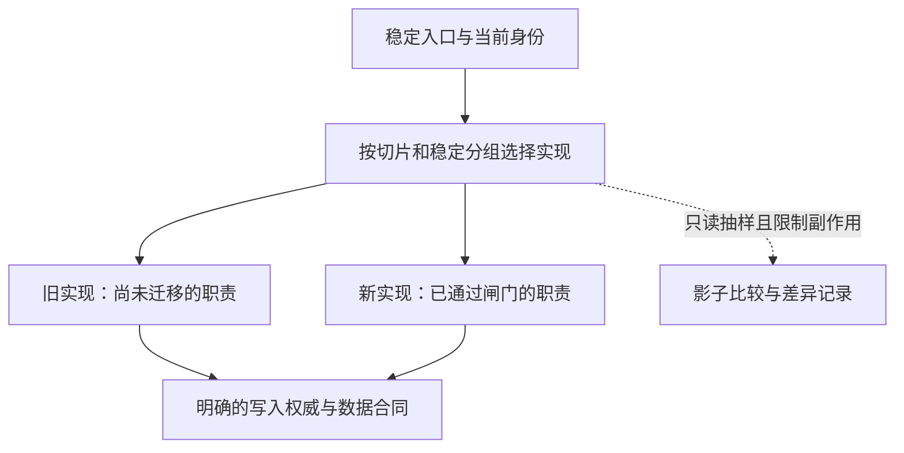

# 新系统上线以后，旧系统怎样真正退出

## ARCH-03 渐进迁移、Strangler 与兼容层

订单页换成新实现以后，小流量用户看起来一切正常。扩大流量时，某笔订单在新旧页面金额不同；回退路由后，页面仍命中新缓存。团队发现“旧代码还在”并不等于随时能安全回去。

迁移要管理的是长期共存的中间状态。本篇从一个订单详情切片开始，依次解释稳定入口、语义转换、影子比较、写入权威、阶段闸门和退役。你将用离线实验观察同一笔更新怎样重复、迟到和发生差异；这些模拟帮助推理，不冒充生产数据库、网络或真实回滚演练。

### 学习前先确认

- 直接前置：[ARCH-02 技术方案、ADR 与架构评审](../chinese-guides/arch-02-technical-proposal-adr-review.md#arch-02)。迁移之前明确目的、真实候选、责任、证据与退出条件。

### 一、先找一个能够独立完成的用户任务

“先改完所有组件，再换所有接口”会让项目很久没有可验证的结果。**垂直切片（Vertical Slice）**围绕一个用户任务贯穿入口、界面、接口、权限、数据和观测。例如先迁移只读订单详情，它足以暴露身份和数据问题，又比支付执行容易限定风险。

切片边界要来自现状地图。除了静态 import，还要找路由、共享状态、缓存、定时任务、事件订阅、后台导出和人工流程。某旧接口没有页面调用，不代表夜间对账程序没有使用。无人负责或无法观察的依赖，应先调查，不能当成可以删除的空白。

先列迁移不变量：租户隔离不变、已确认订单不丢、同一业务操作不重复执行、用户能知道失败结果、旧客户端仍按合同工作。不变量要在每个阶段成立；“最后统一修复”不能补回已经丢失的数据。

迁移理由也需验证。如果问题只是组件边界，可以局部治理；若系统很小、可以停机，且新旧状态能一次转换，整体替换可能更经济。必须快速退役、无法拦截入口或难以长期双运行时，也不能机械套渐进模式。选择依据与停止条件由 ADR 保存，而不是用模式名称代替可行性判断。

### 二、稳定入口决定哪一次请求交给谁

**绞杀者模式（Strangler Fig）**通过入口适配或路由边界，逐步把功能交给新实现。用户继续使用稳定入口，旧系统的责任随切片转移而减少，最后才有条件退出。入口层也常被叫 façade；它应主要处理转发与必要适配，避免吸收越来越多业务逻辑。



分组可以基于租户、账号或功能，但同一操作不能因每次掷随机数而在两套执行者之间漂移。路由决定应可关联到配置版本和业务操作身份。切换读取与切换写入权威也是两个决定，不能由一个前端开关暗中同时完成。

入口可能变成瓶颈或单点，所以它自身也需要性能、故障与观测条件。新实现仍依赖旧服务时，要把依赖画出来；流量图上新页面占比上升，不代表旧系统已可删除。如果入口最终保留为长期网关，应承认其长期责任，而不是继续把它叫“临时层”。

客户端看到的开关不是授权来源。服务端仍校验当前主体、租户与对象权限；旧页面、缓存脚本或自行修改参数不能取得更宽能力。功能分组与权限判断分开，才能避免把灰度入口变成安全绕过。

### 三、先转换语义，再比较新旧结果

**防腐层（Anti-Corruption Layer）**隔离旧模型的含义，例如把旧系统的元字符串、状态码与错误，转换成新系统明确的整数分、枚举和错误类别。它的价值是阻止旧语义继续扩散，不是给所有函数再包一层同名调用。

假设旧结果为金额 `12.30` 元、状态 P，新结果为 1230 分、状态 confirmed。字节不同并不表示业务不同；但把未知状态默认成 confirmed 就可能显示未支付订单已完成。转换应明确单位、时区、空值、枚举、ID 与版本，不能靠隐式默认猜测。

保存下面完整代码为 `order-compare.mjs`，用 Node.js 22 执行 `node order-compare.mjs`。全部订单为合成数据，只演示一个订单的人民币两位小数合同，不是通用货币库。

```js example=arch03-semantic-compare
function legacyOrder(row) {
  const parts = /^(0|[1-9]\d*)\.(\d{2})$/.exec(row.totalYuan);
  const states = { P: 'confirmed', N: 'pending' };
  if (!parts || !Object.hasOwn(states, row.state)) throw new Error('无法转换');
  const cents = Number(parts[1]) * 100 + Number(parts[2]);
  if (!Number.isSafeInteger(cents)) throw new Error('金额越界');
  return { id: row.id, version: row.version, cents, state: states[row.state] };
}
function compare(oldRow, newRow) {
  let normalized;
  try { normalized = legacyOrder(oldRow); } catch { return '隔离：旧语义未知'; }
  if (!newRow) return '差异：新结果缺失';
  if (normalized.id !== newRow.id) return '差异：订单身份';
  if (normalized.version !== newRow.version) return '待对齐：数据版本';
  return normalized.cents === newRow.cents && normalized.state === newRow.state
    ? '业务一致' : '差异：金额或状态';
}
const oldRow = { id: 'o-demo', version: 4, totalYuan: '12.30', state: 'P' };
const newRow = { id: 'o-demo', version: 4, cents: 1230, state: 'confirmed' };
console.log(compare(oldRow, newRow)); // => 业务一致
console.log(compare(oldRow, { ...newRow, cents: 123 })); // => 差异：金额或状态
console.log(compare(oldRow, { ...newRow, version: 3 })); // => 待对齐：数据版本
console.log(compare({ ...oldRow, state: 'X' }, newRow)); // => 隔离：旧语义未知
```

乘错十倍可以被识别；不同版本先进入待对齐，避免把正常同步延迟立即判成实现错误。待对齐仍然是需要解决的项，不能从分母中悄悄删除，使差异率变漂亮。若是列表，还要按稳定 ID 对齐，检查重复、缺项和权限过滤；只有字段顺序是合同允许的差异时，才可以忽略。

代码假设新结果已经通过输入合同校验，实际边界仍需检查类型、范围与完整性。转换也不一定可逆，例如旧状态合并成一个新状态后信息已经丢失。不要据此进行无条件反向覆盖，尤其不能把新系统写出的新含义硬塞给不理解它的旧消费者。

### 四、影子读取提供差异线索，不直接扩大生产能力

影子读将规范化后的同一读取请求送到新实现做比较，用户仍使用原来的结果。先限制抽样比例、并发、超时和数据保留，确保调查本身不会压垮下游。影子路径也要遵守租户、地区和目的边界，不能因为“不展示给用户”就复制全部敏感正文。

“只读接口”还需要核查实际效果。它可能更新访问时间、消耗配额、触发懒初始化或发送通知；若会产生不能重复的外部动作，应使用受控录制件或其他验证方式，而不是直接复制请求。比较记录优先保存版本、结果摘要和差异类别，敏感明细进入受限证据位置。

**迁移闸门（Migration Gate）**是扩大范围之前必须满足的条件。下面把本篇教学政策写成可运行函数：至少 1000 个配对样本；差异率达到或超过 1% 即暂停；任何隔离失败或未对齐都暂停；回滚演练必须通过。保存为 `migration-gate.mjs`，用 Node.js 22 运行。

```js example=arch03-migration-gate
function gate({ pairs, diffs, unresolved, isolationFailures, rollbackPassed }) {
  if (isolationFailures > 0) return '停止：权限不变量失败';
  if (pairs < 1000 || unresolved > 0 || rollbackPassed !== true) return '暂停：证据未齐';
  if (diffs / pairs >= 0.01) return '暂停：差异达到阈值';
  return '允许进入下一小批';
}
const sample = { pairs: 1000, diffs: 0, unresolved: 0, isolationFailures: 0, rollbackPassed: true };
console.log(gate(sample)); // => 允许进入下一小批
console.log(gate({ ...sample, diffs: 10 })); // => 暂停：差异达到阈值
console.log(gate({ ...sample, unresolved: 1 })); // => 暂停：证据未齐
console.log(gate({ ...sample, isolationFailures: 1 })); // => 停止：权限不变量失败
```

这个阈值是项目约定，1000 个样本不代表统计上已经证明安全；十个差异正好是 1%，按本例的包含边界暂停。实际门槛应按用户损失和样本覆盖制定，并按租户、错误类型与任务分层：总体 0.5% 可能隐藏一个小租户全部失败。功能、延迟、回滚与身份条件也不能只剩一个总差异数字。

函数只接收已经核验的非负整数计数，且差异数不得超过配对数；生产边界还须校验这些输入。缺字段、无效值或数据检查服务故障，应显示证据缺失，不应填零后默认通过。调整阈值属于新的风险决定，需要理由与责任人；为了截止日期把 1% 调成 5%，不会改变用户已经遇到的问题。

### 五、写迁移先确定谁有权确认结果

同一请求依次写旧库和新库，第一边成功、第二边超时，会留下两个不同事实。网络无法保证两个独立写入一起成功。先确定唯一权威写入者，由它确认业务结果，另一边作为可以重建的派生副本；切换权威需要单独的排空、同步与对账计划。

事务外盒将业务更新与待发送事件写入同一个数据库事务，后台再投递事件。它解决的是本地提交与事件记录的一致性，不保证消费者只收到一次。消费者仍需幂等、顺序或版本处理。也不要把单纯 push 到内存数组称为持久化事务外盒。

下面仅模拟完整快照事件的重复和乱序。保存为 `replication.mjs`，用 Node.js 22 运行。没有数据库、事务、并发或崩溃恢复；权威端给每笔订单分配单调递增版本是实验前提。

```js example=arch03-replication
const authority = new Map();
const operations = new Map();
const events = [];
const replica = new Map();
function write(operationId, id, note) {
  const signature = JSON.stringify([id, note]);
  const previous = operations.get(operationId);
  if (previous) {
    if (previous.signature !== signature) throw new Error('操作标识复用冲突');
    return previous.value;
  }
  const value = { id, note, version: (authority.get(id)?.version ?? 0) + 1 };
  authority.set(id, value);
  operations.set(operationId, { signature, value });
  events.push({ ...value }); // 教学队列；生产中需要与业务写入同事务持久化
  return value;
}
function apply(snapshot) {
  const previous = replica.get(snapshot.id);
  if (previous && previous.version >= snapshot.version) return '忽略重复或旧快照';
  replica.set(snapshot.id, { ...snapshot });
  return '应用新快照';
}
write('op-1', 'o-demo', '第一次修改');
write('op-1', 'o-demo', '第一次修改');
write('op-2', 'o-demo', '第二次修改');
console.log(events.length); // => 2
console.log(apply(events[1])); // => 应用新快照
console.log(apply(events[0])); // => 忽略重复或旧快照
console.log(apply(events[1])); // => 忽略重复或旧快照
console.log(replica.get('o-demo').note); // => 第二次修改
try { write('op-1', 'o-demo', '不同参数'); } catch (error) {
  console.log(error.message); // => 操作标识复用冲突
}
```

重复业务操作不会产生新事件；较新的完整快照先到时，旧快照不能把它覆盖。若事件改为“余额加十”，就不能照搬丢弃旧版本的办法，否则会漏算增量。若同一版本出现不同内容，也需要隔离调查而不是当作正常重复；这里依赖权威端同版本内容一致的前提。

真实实现还需原子去重与写入、租户作用域、持久化重试、积压告警和对账。内存 Map 的成功只证明这组顺序输入的规则。支付、邮件和短信等外部动作应由唯一执行者发送，另一边消费事实或录制结果；结果未知时先查询，不向新旧执行者各发送一次“试试看”。

### 六、数据回填、合同和缓存要按同一阶段推进

回填历史订单时，作业读取的旧版本可能晚于在线新写入到达目标。应保存源版本、游标、分片和处理结果，目标按约定处理版本冲突，避免旧回填覆盖新值。游标表示扫描进度，不代表此前所有差异已经解决；失败与隔离记录还需要 owner 处理。

校验不只数行数。检查稳定身份、金额与租户不变量，再核对必要字段与抽样内容。源端正在变化时，要说明比较快照或水位；否则总数不同可能是时点差，而总数相同也可能是互相抵消的错项。暂停与重试后仍能解释已处理范围，才算可恢复作业。

合同演进可采用扩展、迁移、收缩：先增加双方能理解的新字段或接口，再迁消费者，观察旧用量，最后删除。字段含义变化不能靠“不改名字”伪装兼容；新状态也可能让旧客户端进入错误默认分支。生产者与消费者的新旧组合应按实际存在的版本核对。

缓存键至少区分会改变结果的租户、合同与数据语义。路由已回退却仍读新缓存，是因为实现切换没有切换状态解释。恢复时要明确清除、旁路或版本化缓存，以及浏览器内存、Service Worker、CDN 与服务端各自的责任。会话、Cookie、CSRF 与授权不能为临时兼容而放宽。

### 七、回滚窗口由数据和在途动作决定

路由回退改变接下来请求去哪里，代码回滚恢复旧制品，数据恢复处理已经确认的更新，外部副作用则可能只能补偿或对账。四者不能合成一句“切回旧版”。例如旧实现不认识新状态时，恢复旧代码反而会破坏有效订单。

给每个切片写恢复表：读请求能否切回，谁仍负责新写结果，哪些队列需要停止接收并排空，缓存如何处理，超过窗口后怎样修复。停止新流量不等于正在执行的写入停止；一个迟到响应也不应让前端把新草稿替换为旧值。

声明“30 分钟可回滚”时，需要说明从什么时刻计时、允许多少数据变化、依赖哪些旧制品和兼容能力。删除旧列或不可逆压缩会改变窗口，不能在同一发布里先删再说可以回滚。发布与数据迁移的基础解释见 [ENG-06](../chinese-guides/eng-06-ci-cd-artifact-promotion-release-rollback.md#九数据迁移决定旧版本能否回来)。

在隔离环境注入新实现超时、同步积压、旧缓存、重复事件和迟到写入，观察恢复后的真实任务结果。没有目标服务时可先推演和运行离线规则，但要保留“真实网络与数据恢复未验证”。演练无法恢复是停止扩大流量的证据，不是补一张截图就能关闭的问题。

### 八、前端切换时，草稿与资源需要自己的归属

更换页面实现不能自动决定草稿属于谁。若新旧组件都把本地状态当权威，同一笔输入可能在切换时丢失或互相覆盖。更清楚的边界是：宿主或业务状态层保存草稿，适配器接收快照并提交明确动作；当前挂载者拥有自己的 DOM 与监听，离开时释放。

也不要让两个框架同时管理同一子树。路由、消息或独立挂载容器可以成为边界；共享全局可变 store 需要明确订阅与更新合同。全局 CSS、设计 token、Portal/Teleport、焦点与错误边界都可能跨越看似独立的容器，需要按真实组件核对。

双运行还会增加下载、解析、内存、测试和维护成本。按路由或局部按需加载可以减少当前任务负担，但不能把延后下载称为总体积消失。一次本地渲染成功也不证明 SSR、身份或跨框架可访问性已解决。状态切换与取消的可运行实验见 [ARCH-05](../chinese-guides/arch-05-framework-selection-lifecycle-migration.md#五切换实现时保留草稿并拒绝过期结果)。

组织责任同样要切换。新旧 on-call、发布批准、故障指挥和数据 owner 应能回答“现在谁处理这笔异常”。若两个团队互相转交，技术上稳定入口也无法带来稳定恢复。

### 九、以责任减少和旧路径退役判断完成

迁移开始前就定义完成条件：目标任务由新路径承担，历史与在线数据已对账，消费者完成升级，旧队列排空，临时账号和配置清理，兼容层达到可删除条件。只看新页面覆盖率，容易奖励新增而永远不删除旧责任。

退役证据应覆盖流量、定时任务、批处理、脚本和人工流程。观察期要包含有代表性的业务周期；工作日零流量不能证明月底结算不使用。对保留的审计与备份说明读取、保留和删除策略，不必为了保留历史证据继续运行整套旧服务。

删除按明确依赖顺序进行：先迁消费者与合同，再停止入口和作业，撤销权限，删除旧代码、制品和在线基础设施，更新运行手册。监测意外调用并保留有限恢复办法。若兼容层变成正式长期服务，应重新登记 owner 与支持承诺。

最后比较迁移目的是否实现：发布等待、返工、故障、支持成本是否改善。若收益不足，可以停在一个有明确 owner 的稳定边界，再作新决定。停止并不可耻；真正需要避免的是无人能解释、无人敢退出的永久半迁移。

### 带着问题回看

1. 两份结果字节不同却业务一致，需要满足哪些转换与版本条件？
2. 影子差异正好 1%，本例为什么暂停？总体低差异还可能隐藏什么？
3. 为什么较新完整快照可以替代旧快照，而增量事件未必可以？
4. 关闭新路由后，还要处理哪些数据、缓存、在途请求与外部效果？

### 参考与延伸阅读

核验日期：2026-10-08。程序、阈值与订单均为合成离线实验，未进行真实双写、支付或生产回滚。

- [Azure Strangler Fig](https://learn.microsoft.com/en-us/azure/architecture/patterns/strangler-fig)：核对渐进替换入口、适用条件及临时架构成本。
- [Azure 防腐层](https://learn.microsoft.com/en-us/azure/architecture/patterns/anti-corruption-layer)：进一步理解模型转换与边界代价。
- [AWS 事务外盒](https://docs.aws.amazon.com/prescriptive-guidance/latest/cloud-design-patterns/transactional-outbox.html)：查本地事务、事件投递和消费者幂等之间的职责；不能从模式名称推导端到端恰好一次。
- [React 渐进接入](https://react.dev/learn/add-react-to-an-existing-project)：查看子路由和局部界面的实际接入方式，业务数据迁移仍需独立设计。
