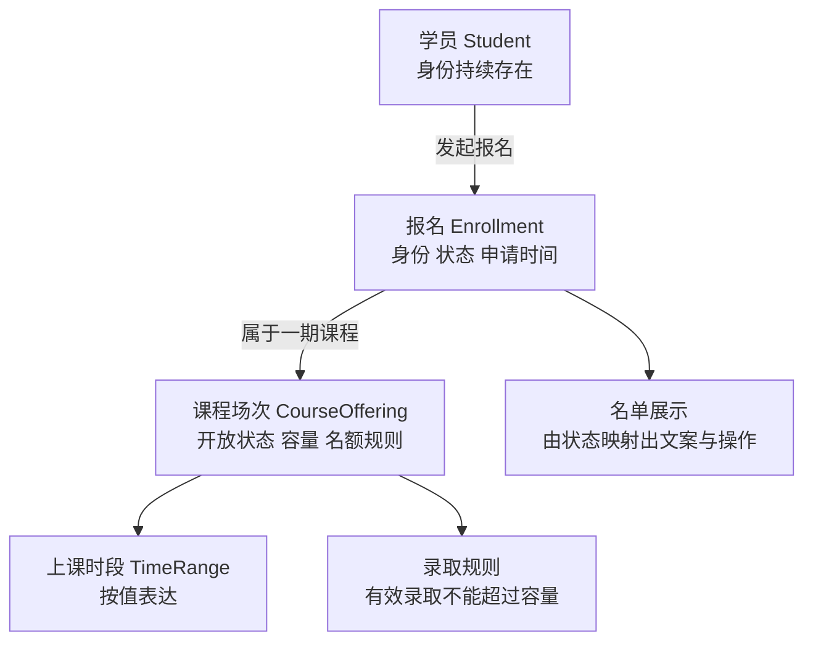

# 从业务里的话，走到代码里的模型

## BIZ-01 业务对象、关系与统一语言

用户看到“报名成功”，以为已经拿到名额；客服看到 WAITLISTED，知道他还在候补；报表又把这条记录算进了录取人数。三个地方的代码都能运行，业务却没有在表达同一件事。

领域建模从这些分歧开始。先把谁参与、发生了什么、哪些事实必须保持正确说清楚，再决定类型、函数、接口和存储怎样组织。**Domain Model** 是为业务判断服务的模型，不是把现实中的每个名词都变成一个类。

本讲用一门“夜间摄影课”贯穿例子：学员提交报名，有名额则录取，满额则进入候补；候补不占名额，也不计入已录取名单。它只是明确给出的教学规则，真实业务的付款、排序、取消和转正政策需要另行定义。

### 学习前先确认

- 无直接前置。本讲先用中文场景解释概念，再用少量 JavaScript 与 TypeScript 表达。即使暂时不熟悉代码，也可以先看输入、输出和图中的关系。

### 一、先问业务要做什么决定，再找需要哪些对象

假设你一上来就建了 User、Course 两张表，并给课程加上 `userIds`。简单列表能显示了，但产品随后问：“这个人是录取了、候补了，还是取消过又重新报名？”只保存用户 ID 已经无法回答。

可以换一个起点：学员提出报名请求，系统需要判断课程是否开放、是否已有有效报名、是否还有名额，并返回明确结果。每个判断需要什么事实，事实由谁维护，决定了模型里应该有哪些东西。

| 业务问题 | 需要保留的事实 | 初步概念 |
| --- | --- | --- |
| 谁参加这门课 | 可持续识别的学员身份 | Student |
| 哪一期、多少名额 | 课程场次、容量、开放状态 | CourseOffering |
| 这次报名后来怎样 | 学员、场次、状态、申请时间 | Enrollment |
| 课程什么时候上 | 时间段及其合法范围 | TimeRange |
| 能否让下一人录取 | 当前有效录取与容量规则 | 名额分配行为 |

“课程模板”和“一期课程”也应分开：同一摄影主题可以开十期，每期有自己的容量和名单。如果把容量放在全局课程模板上，两期活动可能错误地争抢同一批名额。

模型可以从一张表格和几个纯函数开始。复杂度来自业务规则，而不是是否使用类、ORM 或微服务。只做简单资料增删改查时，清晰的数据结构和校验可能已经足够。

### 二、实体靠身份延续，属性可以随时间变化

**Entity** 通常译为实体。判断对象是不是同一个，关键看业务身份是否延续，而不是姓名、地址或状态是否一样。

```js example=biz01-entity-identity
const before = { studentId: 'student-lin', name: '小林' };
const renamed = { studentId: 'student-lin', name: '林同学' };
const namesake = { studentId: 'student-zhao', name: '小林' };
console.log(before.studentId === renamed.studentId);
console.log(before.studentId === namesake.studentId);
console.log(before === renamed);
// => true
// => false
// => false
```

前两行讨论业务身份，第三行讨论 JavaScript 对象引用。两份分别加载的记录可以代表同一位学员，不必是同一个内存对象；两位同名学员也不能因为名字相同而被合并。

身份的有效范围必须说清楚。某个机构内的 `42` 与另一个机构内的 `42` 可能不是同一个人；跨系统传递时要带上来源或使用明确的稳定标识。邮箱、手机号和昵称会变，除非业务明确接受相应限制，否则不宜随意当永久身份。

前端草稿 ID、服务端报名 ID 和第三方记录 ID 也可能同时存在。提交后应明确建立对应关系，而不是在列表里靠姓名猜测哪条草稿变成了正式记录。

### 三、值对象让几个值共同表达一个完整概念

**Value Object** 按完整值表达含义。例如“晚上 19:00 至 20:30”是一个时间段，仅有开始或结束都不完整。两个时间段的起止值相同，在这个模型里就可以互换；我们不需要追踪“原来那一个时间段对象”的身份。

下面用同一天内的分钟数表示时段，范围是 0 到 1440。它不处理日期、时区和跨日，这些属于另一份更完整的时间合同。

```ts example=biz01-time-range
type TimeRange = Readonly<{ startMinute: number; endMinute: number }>;
function timeRange(startMinute: number, endMinute: number): TimeRange {
  if (!Number.isInteger(startMinute) || !Number.isInteger(endMinute)
    || startMinute < 0 || endMinute > 1440 || startMinute >= endMinute) {
    throw new RangeError('时段需要在同一天内，且开始早于结束');
  }
  return Object.freeze({ startMinute, endMinute });
}
const same = (a: TimeRange, b: TimeRange) =>
  a.startMinute === b.startMinute && a.endMinute === b.endMinute;
const evening = timeRange(19 * 60, 20 * 60 + 30);
console.log(same(evening, timeRange(1140, 1230)));
console.log(evening.endMinute - evening.startMinute);
try { timeRange(1200, 1140); }
catch (error) { console.log(error instanceof RangeError); }
// => true
// => 90
// => true
```

构造入口把规则放在一起，调用方得到的不是两个随意组合的数字。需要换时段时创建新值，而不是原地改一半后留下暂时非法的组合。

`Readonly` 提供编译期约束，`Object.freeze` 在这里保护浅层运行时属性；二者都不能让未经检查的外部输入自动可信。TypeScript 结构类型仍允许其他地方直接构造相同形状，所以项目还需收束创建入口。包含嵌套对象时也不能误把浅冻结当深度不可变。

某个概念是实体还是值对象，取决于业务。普通联系地址可以按值替换；若要追踪一条地址的审核过程和历史责任，那条审核记录就需要身份。不要只凭“有没有数据库 ID”作决定。

### 四、关系本身有生命周期，就值得单独建模

CourseOffering 与 Student 是多对多关系，但“多对多”只描述数量。Enrollment 还要回答申请时间、候补顺序、录取、取消以及重新报名，因此它有自己的业务含义。



图上的线需要进一步解释：一条报名只能属于一个课程场次；一个学员可以报名多期；同一学员在一期里能否有多条历史记录，取决于取消后重新报名的政策。可以规定最多一条有效报名，同时保留多条历史记录，二者并不矛盾。

“取消课程”也不等于物理删除所有报名。运营可能需要通知学员，客服需要查历史，报表需要解释曾经的录取变化。ORM 的级联删除选项不能替业务决定这些事情。

页面为了展示可以把学员名、课程名、状态放成一行；写入时仍应通过明确命令维护原始事实。读出来方便，不意味着这一行里的每个字段都归同一个业务对象随意修改。

### 五、聚合围绕必须一起成立的规则划边界

**Aggregate** 通常译为聚合。它把需要一起维护的不变量收在一个修改边界里，外部通过聚合根提出动作。这里最关键的规则是：有效录取数不能超过课程容量，同一学员不能重复获得同一期名额。

下面把“某一期课程及当前报名”作为小型教学聚合。输入快照假设已合法且报名 ID 由调用方提供唯一值；示例没有数据库或真实并发。

```js example=biz01-enrollment-aggregate
function enroll(offering, studentId, enrollmentId) {
  if (offering.enrollments.some(row => row.studentId === studentId)) {
    return { code: 'ALREADY_APPLIED', offering };
  }
  if (!offering.open) return { code: 'COURSE_CLOSED', offering };
  const occupied = offering.enrollments.filter(row => row.status === 'ENROLLED').length;
  const status = occupied < offering.capacity ? 'ENROLLED' : 'WAITLISTED';
  const next = { ...offering, enrollments: [...offering.enrollments,
    { id: enrollmentId, studentId, status }] };
  return { code: status, offering: next };
}
const initial = { id: 'evening-photo', open: true, capacity: 1, enrollments: [] };
const first = enroll(initial, 'lin', 'apply-lin');
const second = enroll(first.offering, 'zhao', 'apply-zhao');
const repeat = enroll(second.offering, 'lin', 'another-intent');
console.log(first.code, second.code, repeat.code);
console.log(second.offering.enrollments.filter(row => row.status === 'ENROLLED').length);
console.log(initial.enrollments.length, repeat.offering === second.offering);
// => ENROLLED WAITLISTED ALREADY_APPLIED
// => 1
// => 0 true
```

候补是被接受的报名结果，但不是获得名额；重复申请不会偷偷增加一条记录。函数返回新快照，初始快照仍为空。这段函数集中的是规则判断，不是用内存对象实现事务。

两个请求若同时拿到初始快照，仍会各自决定 ENROLLED。真正提交时需要事务、锁或条件更新，让这项规则覆盖所有写入入口；否则“用了聚合”也挡不住超额。下一篇 [BIZ-02 的版本冲突](../chinese-guides/biz-02-state-machines-business-invariants.md#六两个合法决定可能争抢同一个旧版本)会具体展示。

聚合也不意味着每次报名都要从数据库加载所有历史记录。生产实现可以围绕容量计数、有效报名唯一约束和必要记录设计事务。数据规模变大时，可以拆出名额分配边界；但必须重新说明谁负责防止超额，不能只把对象拆小就宣布一致性解决。

### 六、让候补在对话、接口和页面里表示同一件事

**Ubiquitous Language** 常译为统一语言，意思是在同一个业务范围内，大家用词时指向相同规则。它不是要求全公司所有系统共享一份巨大的词典。

| 用词 | 本例明确含义 | 不能混用的表达 |
| --- | --- | --- |
| 报名已受理 | 系统记录了这次申请 | 不必然等于已录取 |
| 已录取 ENROLLED | 已占用一期课程的名额 | 不能只凭 HTTP 200 判断 |
| 候补 WAITLISTED | 已进入等待，暂未获得名额 | 不显示“已获得名额” |
| 取消报名 | 结束这次有效申请，按规则处理名额 | 不默认等于删除历史 |
| 录取人数 | 当前有效 ENROLLED 的人数 | 不直接用报名记录总数 |

这张表需要走进代码。命令名使用 `requestEnrollment`，结果明确返回 ENROLLED 或 WAITLISTED；页面文案和报表引用同一语义。HTTP 200 表示这次请求按合同成功处理，不替每一种业务结果命名。

有的历史接口使用 WAITLIST，本讲使用 WAITLISTED。若实际项目兼有两种值，应在一个显式兼容映射中统一，而不是让每个组件各猜一次。名字相似也不能直接认定语义相同，要确认是否还包括“待资格审核”等不同阶段。

发现歧义时用具体例子提问：“课程已满，第二位学员点击报名后，是否能上课、是否收费、是否出现在录取人数里？”通常比争论“报名成功到底是什么意思”更快让规则清楚。

### 七、限界上下文让同一个词拥有适用范围

**Bounded Context** 通常译为限界上下文，划定一套模型和语言在哪里成立。招生关心某人能否占名额；学习平台关心他是否已开通学习权限；结算系统关心付款和退款。它们可能提到同一个人，却不需要一个塞满全部字段的全局 User。

招生里的“课程”可以是一期开班；内容平台里的“课程”可能是一套可长期更新的视频资料。两个概念有关联，但不能因为中文名字相同，就共用一个 `Course.status` 枚举。

边界之间需要翻译。例如外部平台返回 `status=1`，适配层先按它的版本解释，再转换成本地 `accessGranted` 等明确概念。这层隔离常称为 **Anti-corruption Layer**，用于避免供应商字段和含糊代码值渗透整个模型。

限界上下文不等于必须独立部署。模块化单体也可以把招生与学习权限放在清晰的模块里，通过接口协作。只有独立扩缩容、组织协作或运行隔离等需求足够明确时，再讨论服务拆分。Microsoft 的领域分析提供了按业务范围分解模型的参考，但不要求把每个概念立刻变成微服务。

### 八、传输模型、领域事实和展示模型各有任务

接口返回什么结构，页面需要什么结构，内部怎样维护规则，可以分别设计。**DTO** 负责传递约定的数据；领域模型表达业务事实与行为；展示模型决定这张卡片显示什么、给用户什么下一步。

```ts example=biz01-view-mapping
type Status = 'ENROLLED' | 'WAITLISTED' | 'CANCELLED';
type View = Readonly<{ label: string; canEnter: boolean }>;
function normalizeStatus(value: unknown): Status | 'UNKNOWN' {
  if (value === 'WAITLIST') return 'WAITLISTED'; // 本例明确支持的旧协议别名
  if (value === 'ENROLLED' || value === 'WAITLISTED' || value === 'CANCELLED') return value;
  return 'UNKNOWN';
}
function toView(value: unknown): View {
  switch (normalizeStatus(value)) {
    case 'ENROLLED': return { label: '已录取', canEnter: true };
    case 'WAITLISTED': return { label: '候补中', canEnter: false };
    case 'CANCELLED': return { label: '已取消', canEnter: false };
    case 'UNKNOWN': return { label: '状态待确认', canEnter: false };
  }
}
console.log(toView('WAITLIST').label, toView('WAITLIST').canEnter);
console.log(toView('REVIEWING').label, toView('REVIEWING').canEnter);
// => 候补中 false
// => 状态待确认 false
```

这只演示状态映射，没有解析完整 DTO。新状态不会落进默认成功分支；旧别名只在一个入口处理。对完整输入的类型、大小和错误形式，见 [TS-07 的运行时解析](../chinese-guides/ts-07-runtime-contracts-validation-error-models.md#一类型描述预期解析器检查实际输入)。

`canEnter` 是这个简化场景下的界面提示，不是服务端授权凭据。真实进入课程时，服务端仍要确认当前身份和学习权限。前端本地草稿也应与服务端事实分开：用户点击报名后可以显示“提交中”，但不能据此把权威状态写成 ENROLLED。

### 九、规则归领域，协调工作归应用层

一次报名通常还要解析请求、确认身份、加载课程、调用规则、提交状态、返回结果。把所有动作塞进领域对象，会让一个小规则依赖网络和框架；全部塞在页面里，则会让同一规则在多个入口漂移。

可以让领域函数根据已加载的事实做决定，应用层负责准备事实与持久化。接口层再把领域原因转成合适的响应，展示层映射成用户语言。它们可以放在同一个项目，不必为了分层制造大量文件。

例如 ALREADY_APPLIED 是业务原因；HTTP 状态码是传输约定；“你已提交过这期报名，可以查看当前状态”是用户指引。这三层含义有关联，但领域函数不需要知道按钮颜色或 toast 组件。

若规则确实横跨多个对象，例如判断课程时间冲突，可以使用领域服务或纯函数表达。所谓“服务”在这里是承载规则的职责，不一定是独立运行的网络服务。单纯读取数据库、发邮件则更接近应用协调或基础设施工作。

### 十、命令提出意图，事件记录已经发生的事实

`RequestEnrollment` 表示希望报名，可能被拒绝；`StudentWaitlisted` 表示候补已经成为事实。命令与事件不能因为都装在 JSON 里，就混为同一种输入。

事件保存稳定对象 ID、事件 ID、时间、版本与必要事实，帮助其他流程理解变化。通常不需要把学员完整资料复制进去；公开给其他系统的事件还要考虑兼容和信息范围。

写入成功后再单独发通知，会遇到“状态已提交但进程在发信前退出”。把状态和待发送事项一起提交到本地事务，再由 worker 发送，是 outbox 思路；消费者仍需应对重复。通知失败不应该凭空把已录取改成未报名，这两个事实有不同生命周期。

领域事件也不强制采用事件溯源。当前状态加必要审计记录，已经能满足很多系统的需求。只有确实需要按历史重建、回放和审计时，才进一步评估保存完整事件历史的成本。

### 十一、模型变化会影响接口、历史数据和指标

把候补拆为“等待资格审核”和“等待名额”，不会只影响一个枚举。旧客户端如何显示，报表是否把两者合并，存量 WAITLISTED 记录能否直接区分，都需要决定。

一种常见顺序是先扩展读取能力，让消费者认识新旧表达，再切换写入并迁移可确定的历史数据，最后移除旧兼容。不能从缺少事实的旧记录里凭空推断新状态；必要时保留“待确认”或旧版本语义。

指标同样是模型的一部分。“录取率”的分母是提交申请数、有效申请人数还是通过资格的人数？是否去重，按哪个时间窗口统计，取消和迟到事件如何处理？定义不同，数值不同，不应只共用一个漂亮名称。

读模型可以为页面或报表扁平化，写模型继续保护规则。这个区别能避免为了“某页少查一次”就把所有学员详情塞进一个巨大聚合，并使不相关修改争抢同一把锁。

### 十二、用正例、反例和未决问题一起验证模型

模型评审不必从复杂图开始。拿一条规则，请产品、开发和测试分别描述正常情形、边界反例与还没有答案的部分。

| 规则 | 正例 | 反例或待决问题 |
| --- | --- | --- |
| 候补不占名额 | 满额后新增候补，录取数不变 | 转正前是否还要重新确认资格 |
| 不重复获得名额 | 重试返回同一结果或明确重复原因 | 取消后重新报名是否创建新记录 |
| 录取数不超过容量 | 最后一个名额只提交给一人 | 是否允许运营降低到低于已录取人数 |
| 状态具有统一含义 | 页面、接口、报表都区分候补 | 旧协议 WAITLIST 是否完全等价 |

其中有答案的规则可以变成可执行例子，未决问题先保留，不能由开发者在不同页面各自决定。模型文档应记录决定的背景、适用范围和影响，避免后来的人把临时折中当永久规律。

前面的 [AIDEV-03](../chinese-guides/aidev-03-ai-generated-code-verification.md#aidev-03)说明了怎样独立验证这些规则；下一篇 [BIZ-02](../chinese-guides/biz-02-state-machines-business-invariants.md#biz-02)继续处理合法路径、并发、重复和超时。这里先把最基础的事做好：每个重要词都能找到含义，每条重要规则都能找到负责维护它的地方。

### 动手想一想

“用户取消课程”可能表示学员撤回报名，也可能表示运营取消整期开班。先写出两个不同的命令名，再分别说明谁有权发起、影响哪些报名、是否保留历史。若两个动作的责任和后果明显不同，就不宜共用一个含糊的 `cancel()`。

### 参考与延伸阅读

- [Microsoft：使用领域分析建立模型](https://learn.microsoft.com/en-us/azure/architecture/microservices/model/domain-analysis)：核对业务范围与限界上下文的分解思路。
- [Microsoft：战术 DDD 模型](https://learn.microsoft.com/zh-cn/azure/architecture/microservices/model/tactical-domain-driven-design)：查询实体、值对象、聚合和服务的概念。其微服务背景不代表本文示例需要拆服务。
- [TS-08：领域状态与权限建模](../chinese-guides/ts-08-domain-state-permission-modeling.md#ts-08)：已经熟悉 TypeScript 时，可进一步观察类型、状态转换和权限边界怎样配合。
