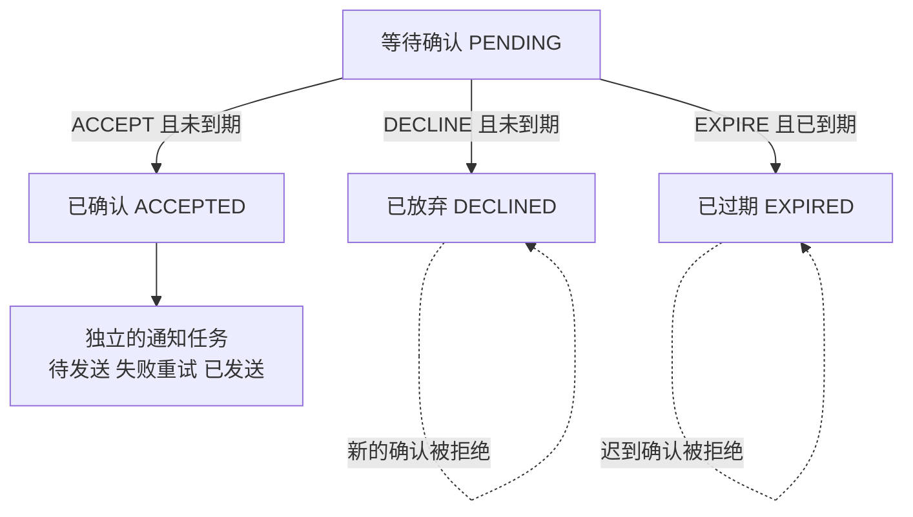

# 让业务沿着允许的路径变化

## BIZ-02 状态机与业务不变量

一份课程邀请已经过期，迟到的“确认成功”回调却把它改回了有效；另一份邀请被两个页面同时操作，后提交的放弃覆盖了先提交的确认。问题并不在于按钮少禁用了一次，而在于系统没有把合法路径、当前版本和重复意图一起管住。

**State Machine** 用当前状态、输入和条件决定下一步。它把“此刻能做什么”写成清楚的规则，也让失败有可解释的原因。本讲围绕一份课程邀请展开：等待确认、已确认、已放弃、已过期。它只处理邀请自身的生命周期；名额是否已预留、学员是否具备资格，仍由相应业务边界负责。

我们会先推演纯规则，再在一个本地观察页里手动安排并发顺序、截止时间和通知失败。例子全部使用合成数据，不发送真实邀请或通知。

### 学习前先确认

- 直接前置：[BIZ-01 业务对象、关系与统一语言](../chinese-guides/biz-01-domain-objects-relations-ubiquitous-language.md#biz-01)。先明确邀请、报名、名额及事件的含义和责任边界。
- 直接前置：[TS-02 联合类型、收窄、never 与穷尽检查](../chinese-guides/ts-02-unions-narrowing-never-exhaustiveness.md#ts-02)。本讲用判别联合表达不同状态所需的数据。

### 一、状态保留会影响下一步的历史

`isAccepted`、`isExpired`、`isDeclined` 三个布尔值可以组成八种情况，但“同时确认、过期又放弃”在本例里没有业务含义。改成一个明确状态，可以让互斥关系进入模型。

状态不是历史的完整副本，而是对后续行为有用的概括。一份 PENDING 邀请可以确认或放弃；一份 EXPIRED 邀请不接受迟到确认。至于用户曾打开页面几次，如果不影响规则，就不必变成新的业务状态。

状态机适合阶段明确、允许动作随阶段变化的流程。颜色、连续温度和简单开关未必需要完整建模。先问“知道当前状态，是否足以判断下一步”，再决定需要哪些额外上下文，例如截止时间、申请人或规则版本。

### 二、转移表先写允许的路，再写拒绝后的结果

本例把时间表示为统一来源的分钟刻度，截止时间为 10，确认窗口是 `now < 10`。这是教学时钟，不是用户设备时间。ACCEPT、DECLINE、EXPIRE 在表中都是输入事件名，其中前两种表示用户意图，最后一种表示系统要求检查到期。

| 当前状态 | 输入 | 必须满足 | 下一状态 | 随后要做的事 |
| --- | --- | --- | --- | --- |
| PENDING | ACCEPT | 当前时间早于截止时间 | ACCEPTED | 记录待发送确认通知 |
| PENDING | DECLINE | 当前时间早于截止时间 | DECLINED | 本例无外部操作 |
| PENDING | EXPIRE | 当前时间达到或超过截止时间 | EXPIRED | 本例无外部操作 |
| 任意终态 | 任意新输入 | 不允许普通转移 | 保持原状态 | 不新增副作用 |

表外输入默认拒绝，不能落进一个“总能更新状态”的分支。拒绝时状态、版本和已提交的副作用不变。到期后收到 ACCEPT 会返回 DUE，邀请可以暂时仍存为 PENDING，随后由到期命令把它收敛为 EXPIRED；关键是已经不能再接受确认。



本例的已确认是终态，所以在截止前提交成功的确认，不会在截止时再变成过期。另一种业务可能允许已确认后撤销，那就要加明确路径和规则。不能把某张图的终态语义推广到所有订单或审批流程。

### 三、状态专属数据跟着状态走

等待确认需要截止时间；已确认需要确认发生的时间。如果把全部字段设为可选，就可能构造出“已确认但没有确认时间”的记录。

```ts example=biz02-state-data
type Invitation =
  | { kind: 'PENDING'; deadline: number }
  | { kind: 'ACCEPTED'; acceptedAt: number }
  | { kind: 'DECLINED'; declinedAt: number }
  | { kind: 'EXPIRED'; expiredAt: number };
function describe(value: Invitation): string {
  switch (value.kind) {
    case 'PENDING': return `等待确认，截止 ${value.deadline}`;
    case 'ACCEPTED': return `已确认，发生于 ${value.acceptedAt}`;
    case 'DECLINED': return `已放弃，发生于 ${value.declinedAt}`;
    case 'EXPIRED': return `已过期，确认于 ${value.expiredAt}`;
    default: { const unreachable: never = value; return unreachable; }
  }
}
console.log(describe({ kind: 'ACCEPTED', acceptedAt: 9 }));
// @ts-expect-error 已确认状态必须提供 acceptedAt
const incomplete: Invitation = { kind: 'ACCEPTED' };
console.log('缺少状态专属数据会被类型检查发现');
// => 已确认，发生于 9
// => 缺少状态专属数据会被类型检查发现
```

预期类型错误用注释标出，帮助核对类型是否真的在保护这个约束。新增状态而没有补充 `switch` 时，`never` 也会提醒遗漏。

类型并不验证网络或历史数据库中的实际数据。外部 JSON 仍需运行时解析，旧记录也可能缺字段。不要用一次类型断言把未经验证的输入变成“合法状态”，参见 [TS-07 运行时合同](../chinese-guides/ts-07-runtime-contracts-validation-error-models.md#ts-07)。

### 四、守卫判断条件，不顺手执行动作

**Guard** 是允许转移必须满足的条件。本例的时间守卫可以完全由当前状态、输入时间与截止时间决定。

```ts example=biz02-deadline-guard
function mayAccept(now: number, deadline: number): boolean {
  return Number.isFinite(now) && Number.isFinite(deadline) && now < deadline;
}
console.log(mayAccept(9, 10), mayAccept(10, 10), mayAccept(11, 10));
console.log(mayAccept(Number.NaN, 10));
// => true false false
// => false
```

9 可以确认，恰好 10 已不可确认。把边界写进代码，比“差不多到期就拒绝”清楚得多。这里检查有限数值只是一项最低限制；完整合同还可以要求整数、可信时钟和合理范围。

守卫应尽量是纯、同步判断：不发邮件、不写数据库，也不在条件表达式里偷偷请求第三方。否则“检查一下能不能转移”本身就改变了世界，重试和回放都难解释。Stately 对 guard 也采用纯同步条件函数的描述。[Guards 官方说明](https://stately.ai/docs/guards)

需要外部资格信息时，应用层先取得有来源的事实，或把流程进入 WAITING_FOR_CHECK，再由结果驱动下一步。若该事实可能在提交前变化，还要用版本、预留或事务保证有效性；单纯把网络请求移到函数外面，并没有解决竞态。

### 五、不变量约束整体事实，副作用另有执行边界

**Business Invariant** 是合法操作完成后必须保持的事实。转移表回答能走哪条边；不变量还约束相关数据，例如确认状态必须有时间、同一个确认意图不能生成两条通知任务。

更广的“录取数不超过课程容量”跨越多份报名，不能只靠每份邀请各自的状态机保护。需要维护名额的聚合掌握必要事实，并在提交时保证一致。回看 [BIZ-01 的聚合边界](../chinese-guides/biz-01-domain-objects-relations-ubiquitous-language.md#五聚合围绕必须一起成立的规则划边界)，就能看出单个对象合法与整体合法的区别。

可以把一次处理拆为：加载事实、判断转移、构造候选结果、核对不变量、原子提交状态及待执行事项，然后执行外部动作。发送通知放在提交前，可能出现“用户收到确认通知，但状态回滚”；放在提交后单独执行，又可能遇到进程退出而漏发。

**Outbox** 把“应该发送什么”与状态一起落在本地事务中，再由独立执行者处理。它关闭状态与待发送记录之间的缺口，却不自动保证外部服务只收到一次。重复投递、消费幂等和结果核对仍需要合同。

### 六、两个合法决定可能争抢同一个旧版本

页面 A 和 B 同时读到 PENDING v0。A 判断可以确认，B 判断可以放弃，各自在旧快照上都合法。若最后一次写入直接覆盖前一次，先完成的确认就会消失。

可以要求请求带期望版本，用类似 `UPDATE ... WHERE id = ? AND version = ?` 的条件写入。A 从 v0 提交到 v1 后，B 的 v0 写入影响零行，得到 VERSION_CONFLICT；B 应读取当前事实，再判断原意图是否仍适用。

比较版本和写入必须是一个受存储保证的原子动作。先查询版本、离开事务、再无条件更新，并没有提供这种保护。多条相关写入还需明确事务范围；如果一个不变量涉及多行，不是每行分别带版本就自然安全。

本讲观察页用同一 JavaScript 调用里的同步检查与替换模拟提交点，帮助看清交错顺序。它不创建并行数据库事务，也不能作为某种数据库隔离级别已正确配置的证据。

### 七、幂等识别同一意图，状态机判断新意图是否合法

**Idempotency** 处理重复送来的同一请求。A 确认已成功，只是响应丢了；原请求再次送来，可以返回已有结果，不能再生成一条通知。用一个全新的 key 再确认，则是新意图，仍应接受当前状态检查。

幂等记录需要绑定当前有权访问的主体、业务对象、动作和规范化载荷。身份和权限必须先校验，不能凭一个猜中的 key 读取他人结果。同 key 改成不同动作，应明确拒绝 KEY_REUSED，而不是返回不相关的旧成功。

对于同一条已完成请求，可以先查其已保存结果，再处理旧期望版本；否则网络重试总会因为自己第一次写入增加了版本而失败。已有结果记录的是原操作事实，未必等于对象此刻的最新状态，页面需要时还应重新查询。

下面的教学页只保存成功结果，拒绝不占用 key；生产系统要明确哪些确定性失败也保存、处理中如何查询，以及记录保留期。并发首次到达还需要原子占位或唯一约束，普通 Map 不能跨进程提供保证。

### 八、截止时间是一条规则，计时器只是提醒

用户在 9 点击确认，请求在 10 才到达服务器，按本讲“处理命令时判断”的规则应拒绝。如果业务承诺按提交时刻或支付发生时刻判断，需要可信的时间来源及相应证据，不能直接相信客户端传来的 `clickedAt`。

到期任务可能迟到或重复。即使 EXPIRE 在 12 才运行，10 之后的新确认也不能成功；因此守卫检查时间，不能仅依赖计时器先把字段改成 EXPIRED。

记录时间时可区分到期阈值、外部事件实际发生时间和本系统处理时间。例如阈值是 10，处理到期的时间是 12，这两者都可保留，不能把延迟执行伪装成准点完成。

“24 小时后”与“次日 18:00”也不完全一样。后者涉及当地日期、时区及可能的夏令时；应先把业务含义说清楚，再选时间库。验证边界时注入时间值，不需要真的等待一整天。

### 九、亲手安排确认、过期与旧版本冲突

把下面完整内容保存为 `invitation-lab.html`，直接用桌面浏览器打开。它不依赖网络或额外包，刷新页面会重置全部数据。A、B 两张卡模拟两份旧页面快照，顶部显示当前权威记录；所有“发送”都只修改本页内存。

先按这三组路径观察，避免一次点击太多而分不清原因：

1. A 确认 → 重放 A 请求 → B 放弃。第一步只创建一条通知；重放返回旧结果；B 因 v0 过期发生冲突。刷新快照后再放弃，会被终态规则拒绝。
2. 重置 → 时钟到截止 → A 确认 → 处理到期。先得到 DUE 且状态仍为等待，随后变成已过期；刷新快照后确认仍被终态规则拒绝。
3. 重置 → A 确认 → 通知失败 → 重试通知。邀请始终已确认，通知从待处理到待重试再到已发送。失败不把报名历史倒回去。

```html example=biz02-invitation-lab runtime=project file=invitation-lab.html
<!doctype html>
<html lang="zh-CN">
<meta charset="utf-8">
<meta name="viewport" content="width=device-width,initial-scale=1">
<title>邀请状态观察室</title>
<style>
:root{font-family:system-ui,"Microsoft YaHei",sans-serif;color:#183735;background:#eef3ef;font-size:16px}
*{box-sizing:border-box}body{margin:0;padding:36px}main{max-width:1180px;margin:auto}
header{display:flex;align-items:center;justify-content:space-between;gap:24px;margin-bottom:24px}
h1{font-size:32px;margin:6px 0}h2{font-size:19px;margin:0 0 16px}p{line-height:1.7;margin:8px 0}
.kicker{color:#51716c;letter-spacing:.12em;font-size:13px}.muted{color:#536b66;font-size:14px}
.panel{background:#fff;border:1px solid #d1dfd9;border-radius:16px;padding:24px;margin-bottom:20px}
.grid{display:grid;grid-template-columns:1fr 1fr;gap:20px}.grid>.panel{min-width:0}
button{font:inherit;padding:10px 14px;border-radius:9px;border:1px solid #9fb8ae;background:#f4f8f5;color:#183735;cursor:pointer;margin:4px 6px 4px 0}
button.primary{background:#176358;color:white;border-color:#176358}button:hover{filter:brightness(.96)}button:focus-visible{outline:3px solid #bf751e;outline-offset:3px}
#state{font-size:27px;font-weight:700}#message{min-height:32px;color:#64461e;font-weight:600}
.states{display:flex;gap:10px;margin-top:16px}.states span{border:1px solid #d1dfd9;padding:8px 12px;border-radius:8px;color:#536b66}
.states .active{background:#d7ede3;border-color:#176358;color:#174c41;font-weight:700}
pre{font:14px/1.8 ui-monospace,Consolas,monospace;white-space:pre-wrap;overflow-wrap:anywhere;max-height:230px;overflow:auto;margin:12px 0 0;color:#324f47}
#effect{min-height:32px}#clock{font-weight:700}
</style>
<main>
<header><div><div class="kicker">B19 · 状态与意图</div><h1>邀请状态观察室</h1><p class="muted">合成邀请 invite-photo · 仅本页内存 · 截止时刻 10</p></div><button id="reset">重置实验</button></header>
<section class="panel" aria-label="当前记录">
<div id="state"></div><p id="clock"></p>
<div class="states"><span data-state="PENDING">等待确认</span><span data-state="ACCEPTED">已确认</span><span data-state="DECLINED">已放弃</span><span data-state="EXPIRED">已过期</span></div>
<p class="muted">时间达到 10 后不能确认；处理到期会把等待中的邀请变为已过期。</p>
<button id="due">时钟到截止</button><button id="expire">处理到期</button><button id="refresh">刷新两份快照</button>
<p id="message" role="status" aria-live="polite"></p>
</section>
<div class="grid">
<section class="panel"><h2>页面 A · 确认邀请</h2><p id="snapshot-a"></p><button class="primary" id="accept">A 确认</button><button id="replay">重放 A 请求</button><button id="reuse">同键改成放弃</button><p class="muted">重放保留同一意图与旧版本；更换动作则不是同一个请求。</p></section>
<section class="panel"><h2>页面 B · 放弃邀请</h2><p id="snapshot-b"></p><button id="decline">B 放弃</button><p class="muted">先让 A 提交，再从 B 操作，观察旧版本冲突与终态拒绝的区别。</p></section>
</div>
<section class="panel"><h2>确认通知 · 独立处理</h2><p id="effect"></p><button id="fail">模拟通知失败</button><button id="deliver">重试通知</button><p class="muted">这里只模拟投递结果，没有发送请求。通知失败不会撤销已提交的确认。</p></section>
<section class="panel"><h2>事件轨迹</h2><pre id="trace" aria-label="事件轨迹"></pre></section>
</main>
<script>
const labels={PENDING:'等待确认',ACCEPTED:'已确认',DECLINED:'已放弃',EXPIRED:'已过期'};
const el=id=>document.getElementById(id);
let store,now,snapshots,lastA,serial,lines;
function decide(record,event,time){
  if(record.kind!=='PENDING')return {ok:false,code:'FINAL'};
  if(event==='EXPIRE')return time>=record.deadline
    ?{ok:true,kind:'EXPIRED'}:{ok:false,code:'TOO_EARLY'};
  if(event!=='ACCEPT'&&event!=='DECLINE')return {ok:false,code:'UNKNOWN_EVENT'};
  if(time>=record.deadline)return {ok:false,code:'DUE'};
  return {ok:true,kind:event==='ACCEPT'?'ACCEPTED':'DECLINED'};
}
function submit(command){
  // 演示前提：主体和对象已由可信入口确定；这里不实现身份认证。
  const key=JSON.stringify(['student-lin','invite-photo',command.key]);
  const payload=JSON.stringify([command.event]);
  const saved=store.intents.get(key);
  if(saved)return saved.payload===payload
    ?{...saved.result,replayed:true}:{ok:false,code:'KEY_REUSED'};
  if(command.expectedVersion!==store.record.version)return {ok:false,code:'VERSION_CONFLICT'};
  const decision=decide(store.record,command.event,now);
  if(!decision.ok)return decision;
  const record={...store.record,kind:decision.kind,changedAt:now,version:store.record.version+1};
  const result={ok:true,code:decision.kind,version:record.version};
  const intents=new Map(store.intents);intents.set(key,{payload,result});
  const effects=command.event==='ACCEPT'
    ?[...store.effects,{id:'notice-'+record.version,status:'PENDING',attempts:0}]:store.effects;
  // 同一调用内替换整个存储，模拟原子提交；不代表真实数据库事务。
  store={record,intents,effects};return result;
}
function show(message){
  el('message').textContent=message;
  lines.push(message);lines=lines.slice(-40);render();
}
function send(command,label){
  const before=store.record.kind+' v'+store.record.version;
  const result=submit(command);
  const outcome=result.replayed?'REPLAY '+result.code:result.code;
  show(label+' → '+outcome+' | '+before+' → '+store.record.kind+' v'+store.record.version);
}
function render(){
  el('state').textContent=labels[store.record.kind]+' · v'+store.record.version;
  el('clock').textContent='当前时刻 '+now+' / 截止时刻 '+store.record.deadline;
  for(const node of document.querySelectorAll('[data-state]'))node.classList.toggle('active',node.dataset.state===store.record.kind);
  el('snapshot-a').textContent='A 持有版本 v'+snapshots.a;
  el('snapshot-b').textContent='B 持有版本 v'+snapshots.b;
  el('effect').textContent=store.effects.length?store.effects.map(effect=>effect.id+' · '+({PENDING:'待处理',RETRY:'待重试',SENT:'已发送'}[effect.status])+' · 尝试 '+effect.attempts+' 次').join('\n'):'尚无通知任务';
  el('trace').textContent=lines.join('\n');
}
function deliver(fail){
  if(!store.effects.some(effect=>effect.status!=='SENT'))return show('没有待处理的通知；不会重复发送');
  store={...store,effects:store.effects.map(effect=>effect.status==='SENT'?effect:
    {...effect,status:fail?'RETRY':'SENT',attempts:effect.attempts+1})};
  show(fail?'通知失败；邀请状态保持不变':'通知发送成功；邀请状态保持不变');
}
function reset(){
  store={record:{kind:'PENDING',deadline:10,version:0},intents:new Map(),effects:[]};
  now=9;snapshots={a:0,b:0};lastA=null;serial=0;lines=[];show('已重置：两个页面都持有 PENDING v0');
}
el('accept').onclick=()=>{lastA={key:'intent-'+(++serial),event:'ACCEPT',expectedVersion:snapshots.a};send(lastA,'A 确认');};
el('decline').onclick=()=>send({key:'intent-'+(++serial),event:'DECLINE',expectedVersion:snapshots.b},'B 放弃');
el('replay').onclick=()=>lastA?send(lastA,'重放 A'):show('请先从 A 发起一次确认');
el('reuse').onclick=()=>lastA?send({...lastA,event:'DECLINE'},'同键改动作'):show('请先从 A 发起一次确认');
el('due').onclick=()=>{now=10;show('时钟已到截止时刻 10；尚未执行到期命令');};
el('expire').onclick=()=>send({key:'expiry-10',event:'EXPIRE',expectedVersion:store.record.version},'到期检查');
el('refresh').onclick=()=>{snapshots={a:store.record.version,b:store.record.version};show('A、B 已读取当前版本');};
el('fail').onclick=()=>deliver(true);el('deliver').onclick=()=>deliver(false);el('reset').onclick=reset;
reset();
</script>
</html>
```

还有两个值得试的反例。确认成功后点“同键改成放弃”，得到 KEY_REUSED，已确认事实不变。还没到期就点“处理到期”，得到 TOO_EARLY；到期提醒不能绕过时间守卫。

观察页并未实现身份认证、网络超时、数据库、通知供应商或名额扣减。这里的“提交”和“重试”帮助解释状态关系；把它用于生产时，必须把对应保证接到真正拥有事实和副作用的边界。

### 十、结果未知时先查询，补偿也要成为新事实

请求超时，只说明调用方没拿到结果。确认可能已经提交，也可能尚未执行。界面应显示“正在确认结果”，保留意图 ID 查询；不能立即显示“报名失败”再用新 key 重做一次。

外部操作也可能处于这个状态：供应商实际完成了操作，但响应丢失。可以用原意图查询或重试有幂等保证的接口；若接口没有这种能力，就需要对账或人工恢复，不能承诺自动重试绝对安全。

**Compensation** 是补偿动作，例如撤销已创建的权益，或对已完成的收费发起退款。它是新的业务事实，有自己的权限、状态和失败路径，不是删除旧事件或把一个状态字段随手改回去。

通知失败通常只需要重试，不一定要求取消整笔业务；哪一步失败需要补偿，是业务规则。补偿本身也可能失败，此时应明确呈现待处理或人工介入，保留已完成与未完成的事实。

### 十一、分清并行维度，避免状态名称无限增长

把邀请与通知揉在一起，很快会出现“已确认且通知待发”“已确认且通知失败”“已确认且通知成功”等组合。如果还有学习权限开通，组合数量继续增长。

可以让邀请状态和通知任务各自演进：邀请确认后产生通知任务，通知失败只影响通知流程。需要协调的条件仍应明确，例如只有确认已提交才能创建确认通知。两个维度分开，不代表任意组合都合法。

**Statechart** 可以用层级和并行区域组织复杂状态。父状态适合收拢共同处理；并行区域表示多个维度同时处于活动状态，不等于启动了多个 CPU 线程。Stately 的并行语义会把收到的事件交给各区域处理，跨区域影响仍需审阅。[Parallel states 官方说明](https://stately.ai/docs/parallel-states)

若两个维度总是一起变化，分成并行区域反而可能藏住规则。先判断它们能否分别演进，再选图形结构。恢复历史子状态时也要重新检查过期时间和外部事实，不能把“恢复到上次页面”当成业务仍然有效。

### 十二、状态演进和验证都从可重放路径开始

新增“请求延期”不是只给枚举加一个值。还要决定哪些状态能申请、由谁批准、是否改变截止时间、旧客户端怎样显示、已有流程用旧规则还是迁移到新规则。未知状态应保守显示“状态待确认”，避免默认为完成。

对本讲模型，少量路径就能覆盖关键区别：截止前成功、恰好到期拒绝、重复成功不新增通知、同 key 改载荷拒绝、旧版本冲突、刷新后终态拒绝、通知失败不改邀请。这些观察比十条重复的正常确认更有价值。

轨迹至少保留旧状态、输入、判断结果、新状态、对象版本、意图 ID 和副作用引用。真实日志还要考虑敏感信息和高基数，不必记录整份用户载荷。通过等待时间和失败积压，也能发现长期停在中间状态的流程。

存储层仍需单独验证真正的原子性，外部集成需要核对重复与未知结果；不要让本地状态图替它们作保证。用 [AIDEV-03 的风险分层](../chinese-guides/aidev-03-ai-generated-code-verification.md#八验证金字塔按风险分工每层都回答具体问题)选择证据，让每一项检查都对应一个会改变业务结论的问题。

### 动手想一想

A 在时刻 9 确认成功并提交 v1，响应丢失；时刻 10 重放同一意图，此时是否应该返回“过期”？先区分原意图的历史结果与新意图。前者应返回原确认结果；如果换一个新 key，就要依据当前终态拒绝。幂等和时间守卫回答的是不同问题。

### 参考与延伸阅读

- [Stately：Guards](https://stately.ai/docs/guards)：核对条件判断的纯函数与同步语义。
- [Stately：Parallel states](https://stately.ai/docs/parallel-states)：了解并行区域和事件处理。审校时文档入口已出现 v6 alpha 标识；本文使用自编原生代码，不依赖 XState 版本 API。
- [TS-08：领域状态、权限和意图](../chinese-guides/ts-08-domain-state-permission-modeling.md#ts-08)：补充 TypeScript 中的权限边界与可运行模型。
- [NODE-04：HTTP 与 BFF 的生产边界](../chinese-guides/node-04-http-bff-production-engineering.md#node-04)：进一步区分客户端取消、服务端提交与幂等结果。
