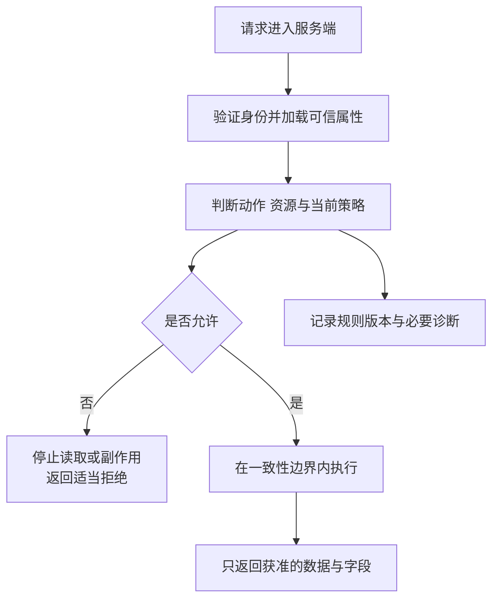

# 谁可以对哪一份资料做什么

## BIZ-03 RBAC、ABAC 与数据权限

课程编辑小林能在页面上修改摄影课资料，但把请求里的资料 ID 换成另一个机构的 ID，接口居然也返回了内容。按钮和菜单都没有显示错误，真正缺失的是服务端对“这次访问”的判断。

授权从具体动作开始：谁想读取哪份资料，谁想发布，谁能导出整个目录。登录、拥有某个角色、看到一个按钮，都只提供部分信息。本讲用“课程资料管理”说明如何组合角色、资源关系和时间条件，并让拒绝真正发生在数据或副作用离开服务端之前。

### 学习前先确认

- 直接前置：[BIZ-01 业务对象、关系与统一语言](../chinese-guides/biz-01-domain-objects-relations-ubiquitous-language.md#biz-01)。先明确资料、目录、机构、负责人和发布动作的业务含义。

### 一、先把一次授权决定说成完整句子

“编辑可以修改资料”还不完整。编辑属于哪个机构？能改所有目录还是自己负责的目录？已发布资料是否还能直接修改？缺少这些条件，开发者很容易在不同接口补出不同答案。

可以把决定写成四部分：主体 subject、动作 action、资源 resource、环境 context。小林是主体，`material.publish` 是动作，摄影课草稿是资源，当前时间、委托期限和策略版本属于环境或相关事实。

| 判断 | 回答的问题 | 例子 |
| --- | --- | --- |
| 认证 | 请求代表谁 | 服务端验证会话后确认是小林 |
| 授权 | 他能对这份资料做什么 | 可修改本机构负责目录的草稿 |
| 业务规则 | 这次动作现在是否成立 | 资料校验通过后才可发布 |
| 界面投影 | 怎样让用户理解可用操作 | 显示“保存”，发布入口说明所缺条件 |

前三者会配合，但不能相互替代。即使有发布权限，草稿也可能缺少必填内容；即使草稿完整，另一个机构的编辑也不能发布它。身份相关背景可回到 [IDENTITY-01](../chinese-guides/identity-01-session-cookie-token-browser-boundaries.md#identity-01)。

### 二、角色压缩稳定职责，不负责列出所有数据范围

**RBAC** 把权限授予角色，再把角色授予主体。编辑通常能读取和修改，复核人可以读取和发布。这样调整职责时，不必逐个修改员工的全部权限。

角色最好对应相对稳定、业务人员能解释的职责。`editor` 比 `canOpenMaterialPage` 更接近业务，因为同一个修改动作可能来自页面、批量入口或 API。把页面名当权限，新增入口时容易忘记沿用原来的保护。

如果每个目录、地区、时段都组合成一个新角色，角色表很快会膨胀成“东区摄影夜班临时编辑”。可以让角色回答具备哪类能力，再用属性与关系限定作用范围。

职责分离也不一定能靠角色继承表达。一个人同时拥有编辑和复核角色，仍可能不能复核自己创建的资料。这里需要“创建者与发布者不能相同”的独立规则，不能简单认为角色越多就能绕过所有约束。

### 三、属性把能力收窄到当前对象与条件

**ABAC** 根据主体、资源和环境属性判断。比如主体和资料属于同一机构、主体负责该目录、临时委托仍在有效期。属性让一条规则适用于许多对象，而不必为每个对象新建角色。

先给教学策略一份明确合同：编辑可 read/edit，复核人可 read/publish；所有动作要求同机构；普通访问要求负责该目录；临时委托只增加到期前的 read 范围；复核人不能发布自己创建的资料。下面只执行这份规则，假设输入已校验，身份、成员关系、资源属性和时间均由服务端可信来源提供。

```ts example=biz03-policy-decision
type Subject = {
  id: string; tenant: string; roles: ('editor' | 'reviewer')[];
  folders: string[]; delegation: { folder: string; until: number } | null;
};
type Resource = { tenant: string; folder: string; creatorId: string };
function decide(subject: Subject, action: string, resource: Resource, now: number): string {
  if (!Number.isFinite(now)) return 'INVALID_TIME';
  if (subject.tenant !== resource.tenant) return 'TENANT_DENY';
  const grants: Record<'editor' | 'reviewer', readonly string[]> = {
    editor: ['read', 'edit'], reviewer: ['read', 'publish'],
  };
  if (!subject.roles.some(role => grants[role].includes(action))) return 'ACTION_DENY';
  const delegatedRead = action === 'read' && subject.delegation !== null
    && subject.delegation.folder === resource.folder && now < subject.delegation.until;
  if (!subject.folders.includes(resource.folder) && !delegatedRead) return 'SCOPE_DENY';
  if (action === 'publish' && subject.id === resource.creatorId) return 'SELF_REVIEW_DENY';
  return 'ALLOW';
}
const editor: Subject = { id: 'lin', tenant: 'east', roles: ['editor'],
  folders: ['photo'], delegation: { folder: 'design', until: 30 } };
const photo: Resource = { tenant: 'east', folder: 'photo', creatorId: 'lin' };
console.log(decide(editor, 'edit', photo, 20));
console.log(decide(editor, 'read', { ...photo, tenant: 'west' }, 20));
console.log(decide(editor, 'publish', photo, 20));
console.log(decide({ ...editor, roles: ['reviewer'] }, 'publish', photo, 20));
console.log(decide(editor, 'read', { ...photo, folder: 'design' }, 29));
console.log(decide(editor, 'read', { ...photo, folder: 'design' }, 30));
console.log(decide(editor, 'delete', photo, 20));
// => ALLOW
// => TENANT_DENY
// => ACTION_DENY
// => SELF_REVIEW_DENY
// => ALLOW
// => SCOPE_DENY
// => ACTION_DENY
```

读代码时先看反例：同角色不能跨机构，委托恰好到期就不再有效，未知动作不会自动放行。这里的拒绝码用于内部解释；对外是否显示具体原因，还要避免泄露不可见对象的信息。

策略函数相信了输入前提，所以它本身不是认证系统。若把 `tenant`、`roles` 或当前时间直接从客户端请求体拿来，调用者就能自己填写许可条件。类型写得再严格，也无法修复事实来源不可信的问题。

### 四、读取、导出、字段查看和批量操作分别命名

能看一条资料，不一定能下载整个机构的清单；能看课程介绍，也不一定能看作者的联系方式。动作粒度需要与暴露范围对应。

| 入口 | 额外需要确认的范围 |
| --- | --- |
| 详情读取 | 当前主体是否可访问这个对象 |
| 列表与搜索 | 哪些对象可见，总数和建议是否同样受限 |
| 导出 | 可导出的集合、字段、快照和领取期限 |
| 字段修改 | 哪些字段可写，是否允许修改所有者或机构 |
| 批量发布 | 每个目标的权限与状态，是否允许部分成功 |

把接口收到的对象整体写回数据库，会让隐藏字段也变成可修改字段。例如编辑名称时顺带提交 `tenant=west`，不能因为名称可编辑就接受整个载荷。输入合同应明确允许字段，授权再判断这些字段与动作的业务含义。

批量请求也要明确“整体拒绝”还是“逐项结果”。混入一个无权 ID 时，不能静默跳过后仍宣称全部成功；同时也不能通过详细错误泄露原本不可见的对象。结果粒度与公开理由需要一起设计。

### 五、策略决定之后，还要有人真正执行拒绝

**Policy Decision Point** 负责算出允许还是拒绝；**Policy Enforcement Point** 负责在实际入口执行这个结果。前者可以是刚才的纯函数，后者通常位于 API、业务服务、查询边界和下载入口。



调用策略后忽略返回值，或者先发送文件再记录“无权”，都没有完成授权。网关可以做粗粒度拦截，拥有资源关系的服务仍需处理对象级规则；列表、后台任务、文件下载等旁路也要纳入。

检查与执行之间，所有者或状态还可能改变。高风险写入需要在事务或条件提交中确认所依赖的版本。权限查询成功发生在 10:00，并不自然授权 10:05 的另一笔操作。

OWASP 建议明确默认拒绝，并在每次请求上执行适用的授权检查。这里强调的是所有真实入口的覆盖，不要求每个入口都复制一份策略代码。[OWASP Authorization Cheat Sheet](https://cheatsheetseries.owasp.org/cheatsheets/Authorization_Cheat_Sheet.html)

### 六、先限定可见集合，再排序、分页和计数

“先取数据库前 20 条，再在浏览器删掉无权内容”有两个问题：无权数据已经离开了服务端，分页总数也可能暴露其他机构的数据。即使过滤发生在服务端，先分页后过滤仍可能得到空页和错误的页数。

下面只用合成数组观察处理顺序。生产环境应把等价条件放进可信查询或访问层，避免先读取全部私有数据。

```js example=biz03-scoped-list
const rows = [
  { id: 'w1', tenant: 'west' },
  { id: 'e1', tenant: 'east' },
  { id: 'e2', tenant: 'east' },
];
const visible = rows.filter(row => row.tenant === 'east');
const page = visible.slice(0, 1);
console.log(page.map(row => row.id).join(','), visible.length);
console.log(rows.slice(0, 1).filter(row => row.tenant === 'east').length);
// => e1 2
// => 0
```

第一个结果是一条可见记录与可见总数 2。第二个结果展示错误顺序产生的空页。真实查询还需稳定排序、目录范围与字段裁剪；这个小例子没有实现完整授权。

搜索建议、统计面板和“是否存在同名资料”也属于查询。它们即使不返回正文，也可能泄露存在性或数量。设计数据范围时应一起考虑，而不只保护详情接口。

### 七、允许看字段，不等于允许修改字段

一个复核人可能需要查看作者姓名，但不能修改作者归属；编辑可以改标题，却不能把自己加成机构管理员。读权限、写权限与输出脱敏是三份相关但不同的规则。

在可信边界按允许字段构造响应，避免先发出完整对象再用 CSS 隐藏。日志、导出文件、缓存和错误详情也必须沿用相应信息范围。默认序列化数据库实体尤其容易把内部字段一起带出去。

集合级“全选”还需要一份明确选择合同：显式 ID，或某筛选快照内全选加排除项。执行时重新授权，不能把“用户曾经选中过”当长期许可。任务开始、执行关键步骤和领取结果各自依赖哪些权限，见 [BIZ-06 的结果领取](../chinese-guides/biz-06-async-jobs-import-export-progress.md#十任务完成下载凭据和文件留存有三个期限)。

### 八、权限缓存必须跟着关系、策略和时间一起变化

只按 `role=editor` 缓存允许结果，会把不同机构、目录和委托期限混在一起。缓存键需要覆盖真正影响决定的输入，读取时还要确认当前主体与属性版本。

```js example=biz03-decision-cache
const key = facts => JSON.stringify([
  facts.subject, facts.tenant, facts.action, facts.resource,
  facts.membershipVersion, facts.resourceVersion, facts.policyVersion,
]);
const facts = { subject: 'lin', tenant: 'east', action: 'read', resource: 'material-7',
  membershipVersion: 2, resourceVersion: 8, policyVersion: 'p3' };
const cache = new Map([[key(facts), { result: 'ALLOW', expiresAt: 30 }]]);
function read(current, now) {
  const value = cache.get(key(current));
  return value && now < value.expiresAt ? value.result : '重新判断';
}
console.log(read(facts, 29));
console.log(read(facts, 30));
console.log(read({ ...facts, membershipVersion: 3 }, 29));
console.log(read({ ...facts, tenant: 'west' }, 29));
// => ALLOW
// => 重新判断
// => 重新判断
// => 重新判断
```

`expiresAt=30` 表示这项许可不能活过委托到期时刻。生产系统还要限制缓存自身 TTL，并处理撤权、资源转移和策略发布引发的失效。版本字段必须来自及时更新的权威信息；把陈旧版本一直放进键里，键再长也不会自动发现撤权。

如果撤权必须立即生效，就要设计能满足这个要求的执行协议，不能只声称“TTL 很短”。权限服务不可用时应拒绝或返回暂不可用，不能为了可用性把未知结果变成允许。

### 九、界面消费能力快照，也准备好被服务端纠正

前端可以消费 `canEdit`、`canPublish` 和适当的拒绝原因，统一控制菜单、详情按钮与批量工具。隐藏完全不相关的能力；对可通过补充条件获得的能力，可以禁用并说明原因。

能力是某个时刻的快照。页面打开后角色被撤回，服务端仍应拒绝实际写入。界面收到拒绝时刷新能力，清理不再允许持有的数据，并保留符合当前安全规则的用户输入，不能把权限丢失误作普通网络失败反复重试。

账号或机构切换尤其容易留下旧内容：取消在途请求、清理私有缓存，并在响应提交前核对会话归属。只调用 AbortController 不一定足够，已经排队的回调仍需归属判断，可参考 [IDENTITY-01 的迟到响应](../chinese-guides/identity-01-session-cookie-token-browser-boundaries.md#八退出之后迟到响应不能让页面重新登录)。

### 十、关系继承与临时委托必须有方向和边界

“目录成员能读取该目录资料”是一条关系规则；“机构管理员能管理成员”是另一条。后者不会自动推出管理员能读所有私密资料，除非业务明确授权这条路径。

目录移动、所有者转移和共享链接都可能改变关系。移动资料后是否继承目标目录的许可、原共享对象是否仍能访问、子项能否断开继承，需要明确定义并触发相应缓存失效。

委托也不仅是一个结束时间。实际记录还需主体、受托人、动作、资源范围、开始时间、撤回状态和是否允许继续转委托。前面代码只展示一个经过预处理的只读委托，不能代替完整委托管理。

共享链接若相当于持有即授权的凭据，应按敏感程度限制范围、期限与撤销方式。链接难猜可以降低枚举风险，却不能代替可撤销、可审计的授权规则。

### 十一、用反例验证规则，再确认入口确实拦得住

先用业务矩阵核对策略函数：同机构负责目录允许，跨机构拒绝，委托到期拒绝，自审发布拒绝，新动作默认拒绝。然后选少量关键入口验证实际执行：直接请求隐藏接口、批量混入无权对象、过期能力访问下载。

策略函数返回 DENY 是第一份证据；接口确实没有返回敏感字段、没有产生副作用，是另一份。两者不能都由同一 mock 假装成功。验证投入可以参考 [AIDEV-03 的风险分层](../chinese-guides/aidev-03-ai-generated-code-verification.md#八验证金字塔按风险分工每层都回答具体问题)。

日志保留规则 ID、策略版本、必要的主体与资源引用、决定和关联编号，避免记录完整敏感载荷。能解释“为什么允许”同样重要；大量许可叠加后，仅看拒绝日志很难发现过度授权。

### 十二、策略变化也要有迁移、失效和回退

新增目录、调整角色或把读取改成受审批的导出，都会影响现有用户。发布前比较新旧策略在代表性请求上的差异，特别关注新增允许和关键业务被误拒绝的情况。

影子判断可以只计算新策略结果，不实际改变旧策略的执行。确认影响后再发布，同时更新策略版本与缓存。回退时也要确认活跃实例和缓存跟着回退，而不是只恢复一份配置文件。

临时例外应有到期与撤回机制。应急访问的身份强度、审批和记录按具体风险设计，不能沉淀成长期隐藏的超级角色。评审既要发现权限过多，也要发现规则过严导致用户共享账号等绕行行为。

简单系统未必需要购买完整策略平台，但仍需要清楚的主体、动作、数据范围和实际执行点。这些边界先明确，后续换框架或服务部署方式时，业务含义才不会跟着漂移。

### 动手想一想

一个编辑能读取摄影目录，现在获得到 30 分钟结束的设计目录只读委托。缓存里 29 分钟的允许结果能否在 31 分钟继续用于编辑？分别检查动作、范围和有效期，会发现“能读过一次”没有授权后面的编辑。

### 参考与延伸阅读

- [OWASP：Authorization Cheat Sheet](https://cheatsheetseries.owasp.org/cheatsheets/Authorization_Cheat_Sheet.html)：核对默认拒绝、逐请求检查和可信执行位置；正文用自编规则说明这些原则。
- [NIST：RBAC 项目资料](https://csrc.nist.gov/Projects/Role-Based-Access-Control)：进一步了解角色授权的基础模型。
- [BIZ-04：接口与模型边界](../chinese-guides/biz-04-api-contract-dto-frontend-model.md#biz-04)：继续处理获准数据以什么合同到达页面。
