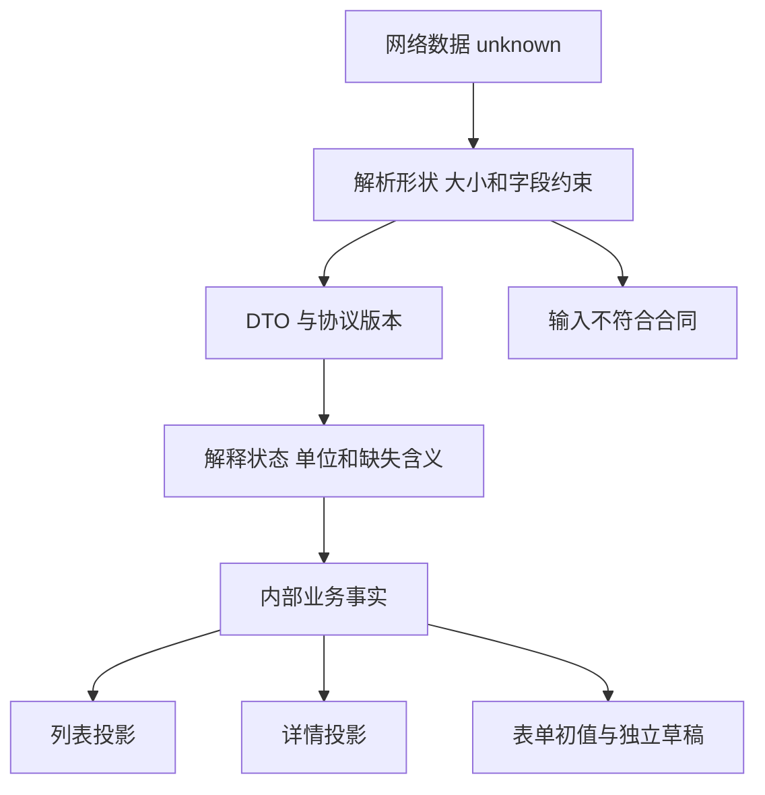

# 接口传来的字段，怎样成为页面上的事实

## BIZ-04 API 契约、DTO 与前端模型

资料导入接口返回 `progress: 0`，页面却显示“没有进度”；另一次服务升级增加了 REVIEWING 状态，旧客户端把它显示成“已完成”。这些问题的代码往往很短：一个 `||`，一个默认成功的 `switch` 分支。真正缺少的是字段和结果的共同含义。

**API Contract** 不只描述报文长什么样，还说明调用后能确认什么、哪些信息仍未知、失败后如何继续。本讲以课程资料的修改和导入查询为例，把业务意图、传输数据、内部解释与页面表达接起来。

### 学习前先确认

- 直接前置：[BIZ-01 业务对象、关系与统一语言](../chinese-guides/biz-01-domain-objects-relations-ubiquitous-language.md#biz-01)。接口需要沿用已经明确的对象和动作。
- 直接前置：[TS-07 运行时契约、Schema 与错误建模](../chinese-guides/ts-07-runtime-contracts-validation-error-models.md#ts-07)。外部数据进入 TypeScript 之前，仍需运行时校验。

### 一、先写调用者能得到什么承诺

“保存资料，返回 JSON”无法指导调用方处理重试和冲突。可以先写一张简短操作卡，明确成功之后的业务事实。

| 项目 | 修改资料标题的示例合同 |
| --- | --- |
| 意图 | 修改指定资料的标题，不改变归属机构 |
| 前提 | 当前主体有修改权限，读取版本仍有效 |
| 输入 | 资料 ID、期望版本、明确的可修改字段 |
| 成功 | 返回服务端确认后的对象及新版本 |
| 冲突 | 不执行覆盖，返回可解释的冲突结果 |
| 响应丢失 | 不能推断是否提交，按操作记录或幂等协议恢复 |
| 缓存影响 | 详情、相应列表和表单基线需要更新 |

合同中的“成功”决定页面能说什么。创建后台任务的 202 表示已经接受处理，不是导入成功；204 没有响应正文，不能一律调用 `response.json()`；读取任务得到 200，只说明这次查询成功，任务状态仍可能是 FAILED。

这些语义与传输状态需要配合。避免把所有错误都装进 200 后再让客户端猜；已有协议若这样设计，适配层必须明确识别业务拒绝。HTTP 通用语义可在 [RFC 9110](https://www.rfc-editor.org/rfc/rfc9110.html) 查证，具体操作成功后的承诺仍由双方约定。

### 二、DTO、领域模型和展示模型分别解决一个问题

**DTO** 是跨边界传输的数据结构。它可能使用字符串时间、协议状态和分页包装，不必与数据库实体或页面组件的结构相同。

领域模型解释业务事实，例如某份资料是否处于待复核；展示模型把事实映射成当前页面的文案、操作和格式。列表需要短标题，详情需要完整内容，表单需要允许暂时为空的输入，这三者可以不同。



不是每个简单应用都需要三套几乎相同的文件。真正需要分开的是责任：谁验证实际输入，谁解释未知值，谁维护业务规则，谁决定展示。边界变化频率不同、来源不可信或有多个消费者时，显式适配通常更容易维护。

数据库新增内部备注，不意味着响应自动多一个字段；页面增加展开状态，也不应该改变服务端领域对象。按用途构造对象，可以避免把一处结构变化扩散到所有层。

### 三、缺失、null、零值和空集合要分别解释

在本讲的导入查询合同里，progress 缺失表示该版本未提供，null 表示当前阶段无法计算百分比，0 表示已经知道总工作量但尚未处理。空数组 `errors: []` 表示本次返回的错误集合为空，和没有请求错误详情不是一回事。

| 值 | 可能的合同含义 | 页面不该擅自做什么 |
| --- | --- | --- |
| 字段缺失 | 未提供、未选择或旧协议不支持 | 不自动猜成零 |
| null | 明确没有值或目前未知 | 不自动猜成成功 |
| 0 | 一个有效数值 | 不被 `value || fallback` 吞掉 |
| false | 明确关闭或否定 | 不替换成默认 true |
| 空字符串 | 允许的空文本，或应被校验拒绝 | 不按所有字段通用处理 |
| 空数组 | 已返回一个空集合 | 不等于还没加载 |

`??` 只会为 null 和 undefined 使用后备值，能保护 0 和 false，却仍会合并 null 与缺失。如果业务需要区分两者，必须保留字段存在性，不能仅把 `||` 全替换成 `??` 就结束。

```js example=biz04-presence-values
const samples = [{}, { progress: null }, { progress: 0 }];
for (const dto of samples) {
  const source = !Object.hasOwn(dto, 'progress') ? 'missing'
    : dto.progress === null ? 'null' : 'number';
  console.log(source, dto.progress ?? '无法计算');
}
// => missing 无法计算
// => null 无法计算
// => number 0
```

两行都显示“无法计算”，内部却保留了不同原因，方便决定是否请求新版本或等待下一阶段。展示可以简化，事实不必因此丢失。

### 四、完整转换器先解析，再处理未知状态

网络世界可能比当前客户端的联合类型更大。新增状态不应该落进默认完成分支。下面给出可以独立运行的完整例子：解析最低必要形状，再生成进度展示结果。百分比只代表进度，不单独证明任务成功。

```ts example=biz04-progress-mapper
type ProgressDto = { status: string; progress?: number | null };
type ProgressView =
  | { kind: 'known'; percent: number }
  | { kind: 'unknown'; source: 'missing' | 'null' }
  | { kind: 'unsupported'; rawStatus: string };
function parseProgress(input: unknown): ProgressDto | null {
  if (typeof input !== 'object' || input === null || Array.isArray(input)) return null;
  const record = input as Record<string, unknown>;
  if (typeof record.status !== 'string' || !record.status || record.status.length > 80) return null;
  if (!Object.hasOwn(record, 'progress')) return { status: record.status };
  const value = record.progress;
  if (value !== null && (typeof value !== 'number' || !Number.isFinite(value)
    || value < 0 || value > 100)) return null;
  return { status: record.status, progress: value };
}
function mapProgress(dto: ProgressDto): ProgressView {
  if (!['QUEUED', 'RUNNING', 'SUCCEEDED', 'FAILED'].includes(dto.status)) {
    return { kind: 'unsupported', rawStatus: dto.status };
  }
  if (dto.progress === undefined) return { kind: 'unknown', source: 'missing' };
  if (dto.progress === null) return { kind: 'unknown', source: 'null' };
  return { kind: 'known', percent: dto.progress };
}
for (const input of [
  { status: 'RUNNING', progress: 0 }, { status: 'RUNNING', progress: null },
  { status: 'RUNNING' }, { status: 'REVIEWING', progress: 100 },
  { status: 'RUNNING', progress: '80' },
]) {
  const dto = parseProgress(input);
  console.log(JSON.stringify(dto === null ? { kind: 'invalid' } : mapProgress(dto)));
}
// => {"kind":"known","percent":0}
// => {"kind":"unknown","source":"null"}
// => {"kind":"unknown","source":"missing"}
// => {"kind":"unsupported","rawStatus":"REVIEWING"}
// => {"kind":"invalid"}
```

REVIEWING 即使携带 100，也仍是客户端不理解的状态。解析失败与未知状态不同：前者违背形状合同，后者形状合法但缺少业务解释。可以分别呈现“数据暂不可用”和“状态待确认”，限制高风险操作并留下必要诊断。

转换器常被放在 **Anti-corruption Layer** 中，集中吸收外部协议变化。它应有清晰职责，不能变成任意吞错、随意补默认值的地方。更多校验边界见 [TS-07](../chinese-guides/ts-07-runtime-contracts-validation-error-models.md#三用完整解析器把-unknown-变成可用结果)。

### 五、局部修改必须说明省略和清空分别代表什么

读取时的缺失含义，不能直接套到更新请求上。本例给编辑请求定义：省略 description 表示保持原值；传 null 表示清空；传字符串表示替换；其他类型拒绝。

```js example=biz04-explicit-patch
function applyEdit(current, patch) {
  if (!Object.hasOwn(patch, 'description')) return { ...current };
  if (patch.description !== null && typeof patch.description !== 'string') {
    throw new TypeError('description 必须是字符串或 null');
  }
  return { ...current, description: patch.description };
}
const before = { title: '摄影入门', description: '需准备相机' };
console.log(JSON.stringify(applyEdit(before, {})));
console.log(JSON.stringify(applyEdit(before, { description: null })));
console.log(JSON.stringify(applyEdit(before, { description: '' })));
// => {"title":"摄影入门","description":"需准备相机"}
// => {"title":"摄影入门","description":null}
// => {"title":"摄影入门","description":""}
```

这是自定义单字段更新规则，没有实现完整 PATCH 协议，也没有做授权。它故意只处理 description，不将整个请求对象展开到实体上。

如果选择 `application/merge-patch+json`，就必须遵循 JSON Merge Patch：对象成员中的 null 表示删除该成员，省略表示不修改；这与上面“保留字段且值为 null”的规则不同。数组通常作为整体替换，也不是逐项追加。[RFC 7396](https://www.rfc-editor.org/rfc/rfc7396.html)

因此接口不能只写“支持 PATCH”，还要说明媒体类型、字段语义、校验和并发前提。前端保存时应构造明确的修改载荷，不能把校验信息、UI 开关和只读字段一起发送。

### 六、错误结构应该告诉调用方下一步做什么

程序依据稳定 code 或 problem type 分类，用户阅读可改进的说明文字。别让客户端依赖“该资料已被他人修改”这句文案做逻辑判断，也别把内部 SQL、堆栈和凭据放进响应。

可以使用 **Problem Details** 的通用结构，并按项目合同增加业务字段。下面是一个示意报文，实际 HTTP 响应状态也应为 412。

```json
{
  "type": "https://example.test/problems/stale-material",
  "title": "资料已更新",
  "status": 412,
  "code": "STALE_MATERIAL",
  "detail": "请保留当前输入，读取最新版本后再决定如何合并。",
  "requestId": "request-demo-18"
}
```

`example.test` 只是教学域名。RFC 9457 的 status 是对实际 HTTP 状态的补充，不应拿正文里的状态偷偷替换传输层语义。扩展字段、字段错误路径和可重试条件仍要形成自己的稳定合同。[RFC 9457](https://www.rfc-editor.org/rfc/rfc9457.html)

输入错误可以引导修正字段；权限拒绝需要重新判断能力；冲突保留草稿；未知结果先查询。错误边界和恢复的完整过程放在 [BIZ-07](../chinese-guides/biz-07-errors-idempotency-eventual-consistency.md#biz-07)，这里先让报文承载足够信息。

### 七、版本、时间、单位和分页都属于合同

`duration: 90` 是秒还是分钟？`updatedAt` 是 UTC 时间点还是没有时区的本地文字？`total: 0` 是已知为空还是没有统计？这些细节足以改变用户判断，不能由组件自己猜。

对象版本用于并发前提，协议版本用于解释报文，二者不是一个概念。资料 v18 可能仍使用接口合同 v2；Schema 没变，不代表资料内容没有被别人修改。

分页也要约定排序和快照。按更新时间排序时，多个对象可能同一时间，需要稳定的次级键；游标绑定当前筛选与权限范围，不应从“全部资料”页面直接复用于另一个机构。游标能改善定位，不能凭空制造整个查询期间不变的快照。

列表响应可能只有标题与状态，详情还包含正文。把列表摘要替换整个详情缓存，会把“未返回”误解成“已删除”。可以分开模型，或使用明确的字段掩码与版本合并，具体编辑过程见 [BIZ-05](../chinese-guides/biz-05-form-table-detail-state-consistency.md#biz-05)。

### 八、缓存验证与写入前提解决不同问题

ETag 是服务端给响应表示的验证器，客户端按原样使用，不解析其中数字来推断全局顺序。`If-None-Match` 常用于检查是否可以继续使用已有响应；`If-Match` 常用于写入前确认原前提仍成立。

```http
GET /materials/photo-intro

HTTP/1.1 200 OK
ETag: "material-18"
Cache-Control: private, no-cache

PATCH /materials/photo-intro
If-Match: "material-18"
Content-Type: application/json

{"title":"摄影入门新版"}
```

这是报文示意，省略了正文长度等实际报文细节。`private` 约束共享缓存，`no-cache` 表示复用前验证，不是禁止保存；敏感内容需要禁止存储时，应考虑 `no-store`。缓存策略与业务需求一起决定。

If-Match 使用强比较，弱 ETag 不能作为等价的写入前提。前提不成立通常返回 412；业务层自行定义的版本冲突也常使用 409，双方必须约定清楚。授权不能因为缓存验证命中而跳过，详见 [BIZ-03](../chinese-guides/biz-03-rbac-abac-data-permissions.md#biz-03)。

### 九、换成 Protobuf，也不能省掉字段含义

HTTP+JSON 适合常见浏览器接口，便于观察和调试；Protobuf 可以配合生成代码与 RPC 体系管理结构，但“能解码”不代表“懂业务”。gRPC-Web 还要核对所用实现、代理和流模式的支持，不能直接照搬原生 gRPC 的全部能力。

字段存在性尤其值得留意。采用隐式 presence 的标量字段时，默认零值可能无法区分“未设置”与“明确设置为零”；显式 presence 或 FieldMask 可以表达不同需求，具体行为取决于语法、edition 和生成器。[Protobuf Field Presence](https://protobuf.dev/programming-guides/field_presence/)

```text
业务含义                  JSON 合同                  Protobuf 设计需明确
未提供百分比              省略 progress              是否跟踪字段存在性
明确为 0                  progress: 0                不能因默认值丢失意图
将字段清空                约定 null 或专门操作        FieldMask / presence / 专门命令
未知业务状态              保留 rawStatus 并降级       解码保留能力与业务未知分支分别设计
```

不要为了选择协议而先引入不需要的代理和生成链。比较调用方向、消息大小、流式需求、调试与兼容成本，选择团队能维护的方案；让接口适配器把协议错误映射为稳定业务结果。

### 十、通知事件不替代状态查询，Webhook 也需要合同

资料导入完成后，服务端可能推送事件或发送 Webhook。事件需要稳定 ID、类型、对象标识、版本和必要事实，帮助接收方识别重复及关联原任务。

Webhook 到达时先按协议验证真实性、时间窗口和原始报文，再可靠接收。若签名基于原始字节，不能先重新序列化 JSON 再用另一份字节验签。固定时间窗口限制重放范围，事件去重还需独立处理。

接收方返回 2xx 的含义要约定：通常只是成功接受本次投递，不自动证明后续业务全部完成。提供方仍可能因响应丢失重发。未知事件类型可以进入明确的兼容分支，但不能吞掉已知关键事件的处理失败。

推送可能中断，查询仍要能恢复事实。具体任务的版本、进度和取消协议，继续看 [BIZ-06](../chinese-guides/biz-06-async-jobs-import-export-progress.md#biz-06)。

### 十一、兼容看消费者实际依赖了什么

新增可选字段往往较容易兼容，但旧客户端若严格拒绝未知字段，仍会失败；新增枚举若旧客户端默认成功，则更危险。兼容性需要看真实消费者行为，不能仅凭“JSON 能多放字段”判断。

常用迁移顺序是先扩展读取能力，再切换写入并迁移消费者，最后收缩旧支持。路径 `/v2` 能提供隔离入口，却不能自动清除旧数据、缓存和事件，也不能替你决定旧版本何时退役。

一张小矩阵可以覆盖关键组合：旧客户端读新服务，新客户端读旧服务，滚动发布中两种服务同时运行。标注哪些字段可缺省、哪些状态不理解、哪些操作应暂停，再决定需要哪些有针对性的例子。

协议结构生成由专门工具处理；这篇的重点是语义边界。关于生成与消费者门禁，可分别继续到 API 和 TEST 相关知识点，不必为了一个简单字段变化搭建整套新平台。

### 十二、把合同落实到例子和运行观察

先用少量有区分力的输入核对 mapper：0、null、缺失、未知枚举和错误类型；再确认真实服务返回的状态与字段是否一致。对于写入，还要观察版本冲突后是否真的没有覆盖，以及响应丢失后能否恢复原意图。

生成类型检查的是调用代码，运行时解析检查的是实际数据，真实接口观察检查的是部署实现。三者各有责任，不能用其中一个替另两个作保证。

保留可定位的合同版本、示例和兼容决定。运行时记录解析失败、未知状态和弃用字段的必要计数，避免复制敏感正文。发现异常后能回答“哪种客户端、哪份合同、哪个字段被误解”，就能把修复限制在正确边界。

### 动手想一想

服务端返回新状态 REVIEWING，且 progress 为 100。旧页面应该显示完成、失败，还是待确认？先分别判断结构是否合法、状态是否认识、百分比能证明什么，再决定文案与可用操作。

### 参考与延伸阅读

- [RFC 9110：HTTP 语义](https://www.rfc-editor.org/rfc/rfc9110.html)：查询成功状态、条件请求和缓存验证器的规范边界。
- [RFC 7396：JSON Merge Patch](https://www.rfc-editor.org/rfc/rfc7396.html)：核对省略、null 与数组替换的特定协议语义。
- [RFC 9457：Problem Details](https://www.rfc-editor.org/rfc/rfc9457.html)：查询通用错误结构及扩展规则。
- [Protobuf：Field Presence](https://protobuf.dev/programming-guides/field_presence/)与 [gRPC-Web 官方项目](https://github.com/grpc/grpc-web)：按实际协议版本核对字段存在性和浏览器能力。
