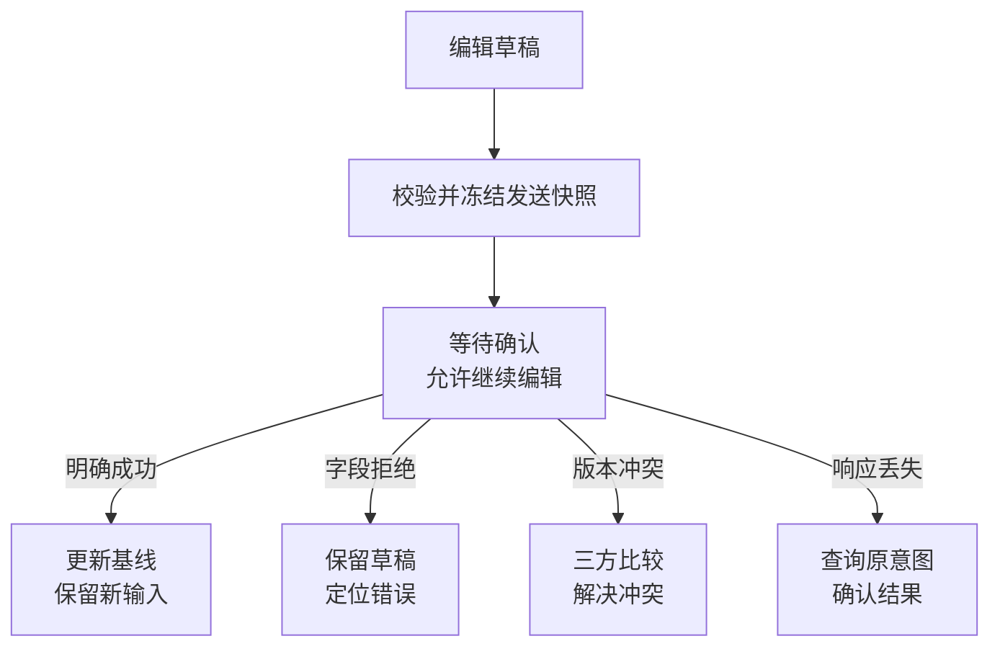

# 保存过程中，怎样保住用户正在输入的内容

## BIZ-05 表单、表格、详情的状态一致性

你把标题从“摄影入门”改成“摄影基础”，点击保存，又继续输入“摄影基础·新版”。几秒后，第一次保存的响应回来了，页面把标题改回了“摄影基础”，还提示“全部已保存”。用户刚写的内容就这样被一个成功响应覆盖了。

多视图一致性要回答的，不只是数据放在哪个 store，而是每个值属于哪一层、哪个版本、哪次提交。本讲沿一次资料编辑，分清已确认事实、编辑基线、当前草稿和发送快照，再处理后台刷新、冲突、自动保存和跨页缓存。

### 学习前先确认

- 直接前置：[BIZ-02 状态机与业务不变量](../chinese-guides/biz-02-state-machines-business-invariants.md#biz-02)。保存、冲突与未知结果有不同的恢复路径。
- 直接前置：[BIZ-04 API 契约、DTO 与前端模型](../chinese-guides/biz-04-api-contract-dto-frontend-model.md#biz-04)。先理解服务端字段、内部事实和展示投影的边界。

### 一、同一份资料，至少有四种不同的值

服务端记录是已提交事实；客户端查询保存某次读取的快照；表单基线是本轮编辑的起点；草稿是用户还在修改的内容。保存发出后，还会多出一份被冻结的发送快照。

| 名称 | 保存等待期间的示例 | 谁可以改变它 |
| --- | --- | --- |
| 服务端事实 | v7：摄影入门 | 有权提交的业务操作 |
| 编辑基线 Baseline | v7：摄影入门 | 读取、接受新版本或保存确认 |
| 发送快照 Submitted | 请求 s1：摄影基础 | 发出后保持不变 |
| 当前草稿 Draft | 摄影基础·新版 | 用户继续输入 |
| 列表投影 | 仍显示已确认的摄影入门 | 已确认结果或明确的乐观覆盖层 |

直接把表单绑定到查询缓存对象，会让“未保存”内容先出现在列表里。让基线与草稿持有独立值，才能说明哪部分已经确认、哪部分仍需提交。对象身份使用稳定业务 ID，不使用排序位置或显示名称。

### 二、草稿允许不完整，提交时再形成合法业务值

用户删除数字准备重新输入时，输入框暂时是空字符串；这不代表服务端时长已经变成 0。草稿需要保存输入过程，不能每按一次键就强行转换成完整领域对象。

本例约定标题提交时去除首尾空格，时长是 0 至 600 的整数分钟；0 是允许值。规范化只针对这份合同，不是对所有文本和数字的通用规则。

```ts example=biz05-draft-normalization
type Draft = { title: string; minutes: string };
type Value = { title: string; minutes: number };
function normalize(draft: Draft): Value | null {
  const title = draft.title.trim();
  if (!title || !/^\d+$/.test(draft.minutes)) return null;
  const minutes = Number(draft.minutes);
  if (!Number.isSafeInteger(minutes) || minutes > 600) return null;
  return { title, minutes };
}
console.log(JSON.stringify(normalize({ title: ' 摄影入门 ', minutes: '0' })));
console.log(normalize({ title: '摄影入门', minutes: '' }));
console.log(JSON.stringify(normalize({ title: '摄影入门', minutes: '090' })));
// => {"title":"摄影入门","minutes":0}
// => null
// => {"title":"摄影入门","minutes":90}
```

不要把所有值都先 `Number()`：空字符串会得到 0，恰好抹掉用户尚未填写的事实。显示格式也不应进入业务比较；换语言后数字的显示可能变化，业务值和未保存状态不该因此变化。

### 三、Dirty 比较业务差异，Touched 记录交互历史

**Dirty State** 表示当前可提交字段与基线有差异；Touched 表示用户曾操作过这个字段，两者不同。用户把标题改了又改回，仍然 touched，但可能已经不 dirty。

比较需要遵守字段语义。本例 `090` 与 `90` 可表示同一时长；标签若按集合比较，顺序可能不重要；正文里的空格是否有意义，则不能照搬标题的 trim 规则。对象引用相同不证明内容没变，任意 JSON 序列化也不是普遍适用的等价判断。

草稿尚不能规范化时，应把它视为需要处理的未完成输入，不显示“已与服务器同步”。离开保护只在确有丢失风险时出现；若有本地草稿恢复能力，还应说清“已保存到本机”和“服务端已确认”的区别。

### 四、发送快照冻结以后，新输入属于下一次提交

保存开始时记录对象 ID、会话归属、基线版本、本次发送值和字段修订号。响应成功后，基线更新为服务端确认值；草稿只有在某字段自发送以来没有再编辑时，才能采用对应的确认值。

```js example=biz05-preserve-new-input
const sent = { title: '摄影基础', minutes: '090' };
const sentRevision = { title: 1, minutes: 1 };
const draft = { title: '摄影基础·新版', minutes: '090' };
const revision = { title: 2, minutes: 1 };
const confirmed = { title: '摄影基础', minutes: '90' };
const next = Object.fromEntries(Object.keys(sent).map(field => [field,
  revision[field] === sentRevision[field] ? confirmed[field] : draft[field],
]));
console.log(next.title, next.minutes);
console.log(next.title !== confirmed.title);
// => 摄影基础·新版 90
// => true
```

标题在发送后又改过，所以保留新版；时长没有再改，采用服务端确认的规范格式。当前草稿仍有未提交修改，不能显示“全部已保存”。

字段修订号用于判断编辑归属，服务端版本用于并发控制，请求 ID 用于关联响应，三者各有用途。只记录一个 `loading` 布尔值，无法表达这些区别。

### 五、后台刷新与冲突都要保留比较起点

未编辑时，后台新快照可以直接更新页面；存在草稿时，应保留旧基线、当前草稿和新远端值，判断变化是否冲突。这就是三方比较。

```ts example=biz05-three-way-merge
function mergeField<T>(base: T, local: T, remote: T):
  { kind: 'merged'; value: T } | { kind: 'conflict'; local: T; remote: T } {
  if (Object.is(local, base)) return { kind: 'merged', value: remote };
  if (Object.is(remote, base) || Object.is(local, remote)) return { kind: 'merged', value: local };
  return { kind: 'conflict', local, remote };
}
console.log(JSON.stringify(mergeField('原题', '我的题', '原题')));
console.log(JSON.stringify(mergeField(90, 90, 120)));
console.log(JSON.stringify(mergeField('原题', '我的题', '远端题')));
// => {"kind":"merged","value":"我的题"}
// => {"kind":"merged","value":120}
// => {"kind":"conflict","local":"我的题","remote":"远端题"}
```

这段比较适用于已经规范化、可以按值比较的单字段。复杂集合或富文本需要自己的合并规则，不能直接用 Object.is 替代业务语义。

自动合并字段也不一定代表整体合法。例如开始时间只在本地改变、结束时间只在远端改变，两字段分别不冲突，组合后却可能结束早于开始。因此合并后还要重新检查跨字段约束，并在最新版本上提交。

### 六、保存状态说明当前知道什么，以及用户能做什么



错误不要只表现成一个 toast。字段拒绝应保留草稿，把焦点引导到错误摘要或字段；版本冲突需要显示远端事实及选择；未知结果则进入确认中，不能把它当作明确失败而新建意图。

HTTP 写入可以使用强 ETag 与 If-Match，或者明确的版本字段。前提不成立时，实际条件请求通常返回 412，业务合同也可能用 409 表达自身冲突。版本判断与写入必须由服务端原子执行，不能用前端“先查一下还没变”代替。[MDN If-Match](https://developer.mozilla.org/en-US/docs/Web/HTTP/Reference/Headers/If-Match)

### 七、用观察页亲手交付慢响应和冲突

将完整代码保存为 `editing-lab.html`，用桌面浏览器直接打开。右侧的服务端记录、网络等待和远端修改都在本页内存模拟；它没有真实请求，不会修改学习系统的数据。

先把标题改为“摄影基础”，点发送保存，再继续输入“摄影基础·新版”，最后交付成功响应。已确认记录应为“摄影基础”，草稿仍保留“摄影基础·新版”。再尝试发送后修改远端标题，观察冲突与显式选择。

```html example=biz05-editing-lab runtime=project file=editing-lab.html
<!doctype html>
<html lang="zh-CN">
<meta charset="utf-8"><meta name="viewport" content="width=device-width,initial-scale=1">
<title>编辑状态观察室</title>
<style>
:root{font:16px/1.65 system-ui,"Microsoft YaHei",sans-serif;color:#183b36;background:#eef3ef}*{box-sizing:border-box}
body{margin:0;padding:34px}main{max-width:1200px;margin:auto}h1{font-size:32px;margin:4px 0}h2{font-size:20px;margin:0 0 14px}
header{display:flex;justify-content:space-between;align-items:center;margin-bottom:22px}.tag{font-size:13px;letter-spacing:.1em;color:#526f64}
.panel{background:white;border:1px solid #ceded4;border-radius:16px;padding:24px;margin-bottom:20px}.grid{display:grid;grid-template-columns:1.15fr 1fr;gap:20px}.grid>*{min-width:0}
label{display:block;font-weight:650;margin:12px 0 5px}input{font:inherit;border:1px solid #9bb5a9;border-radius:8px;padding:10px;width:100%;color:inherit;background:white}
button{font:inherit;color:inherit;background:#f4f8f5;border:1px solid #9bb5a9;border-radius:8px;padding:9px 13px;cursor:pointer;margin:5px 6px 5px 0}button.primary{background:#1b6858;color:white}button:disabled{opacity:.5;cursor:default}
button:focus-visible,input:focus-visible{outline:3px solid #ba791f;outline-offset:3px}.muted{font-size:14px;color:#526f64}p{margin:8px 0}
#message{min-height:30px;font-weight:650;color:#775019}#dirty{font-weight:650}pre{white-space:pre-wrap;overflow-wrap:anywhere;font:14px/1.8 ui-monospace,Consolas,monospace;margin:8px 0}
#conflict{background:#fff6e8;border-color:#dbb780}[hidden]{display:none!important}
</style>
<main>
<header><div><div class="tag">B20 · 基线 / 草稿 / 发送快照</div><h1>编辑状态观察室</h1><p class="muted">手动控制响应顺序，观察成功以后还剩哪些输入。</p></div><button id="reset">重置实验</button></header>
<section class="panel"><p id="identity"></p><p id="message" role="status" tabindex="-1"></p><button id="switch">打开另一份资料</button></section>
<div class="grid">
<section class="panel"><h2>当前草稿</h2><label for="title">标题</label><input id="title"><label for="minutes">时长（分钟，0 至 600）</label><input id="minutes" inputmode="numeric"><p id="dirty"></p><button class="primary" id="send">发送保存</button><button id="undo">恢复当前基线</button><p class="muted">发送后仍可输入。恢复基线只改变当前草稿，不会取消已发出的保存。</p></section>
<section class="panel"><h2>已确认事实</h2><p class="muted">本页模拟的服务端记录</p><pre id="server"></pre><p class="muted">表单当前基线</p><pre id="baseline"></pre><button id="remote">远端修改标题</button><p class="muted">远端变化不会静默覆盖草稿；下一次提交必须面对版本变化。</p></section>
</div>
<section class="panel"><h2>等待交付的请求</h2><pre id="pending"></pre><button id="success">交付保存响应</button><button id="reject">交付业务拒绝</button></section>
<section class="panel" id="conflict" hidden><h2>当前版本已变化</h2><p>右上方显示最新远端内容。保留整份草稿表示下一次保存要提交当前两项输入；此刻不会直接覆盖远端。</p><button id="keep">保留整份草稿，使用新基线</button><button id="adopt">采用远端内容</button></section>
</main>
<script>
const el=id=>document.getElementById(id),fields=['title','minutes'];
let records,id,epoch,base,draft,revisions,pending,conflict;
const editable=value=>({title:value.title,minutes:String(value.minutes)});
function valueOf(input){
 const title=input.title.trim(),minutes=Number(input.minutes);
 return title&&/^\d+$/.test(input.minutes)&&Number.isSafeInteger(minutes)&&minutes<=600?{title,minutes}:null;
}
function message(text){el('message').textContent=text;}
function render(sync=false){
 const current=records.get(id),value=valueOf(draft);
 el('identity').textContent='当前资料 '+id+' · 页面归属 '+epoch;
 el('server').textContent=JSON.stringify(current,null,2);el('baseline').textContent=JSON.stringify(base,null,2);
 el('pending').textContent=pending?JSON.stringify({id:pending.id,version:pending.version,sent:pending.value},null,2):'没有等待中的请求';
 el('dirty').textContent=!value?'有未完成或无效输入':value.title===base.title&&value.minutes===base.minutes?'草稿与基线一致':'仍有未提交修改';
 el('send').disabled=Boolean(pending)||conflict;el('success').disabled=!pending;el('reject').disabled=!pending;
 el('conflict').hidden=!conflict;
 if(sync)for(const field of fields)el(field).value=draft[field];
}
function open(nextId){id=nextId;epoch+=1;base={...records.get(id)};draft=editable(base);revisions={title:0,minutes:0};conflict=false;render(true);}
function reset(){records=new Map([['photo',{title:'摄影入门',minutes:90,version:1}],['design',{title:'设计入门',minutes:60,version:1}]]);epoch=0;pending=null;open('photo');message('可以开始编辑，服务端和草稿都来自 v1。');}
for(const field of fields)el(field).oninput=()=>{draft[field]=el(field).value;revisions[field]+=1;render();};
el('send').onclick=()=>{
 const value=valueOf(draft);if(!value){message('请填写标题和 0 至 600 的整数分钟。');el('message').focus();return;}
 pending={id,epoch,version:base.version,value,revision:{...revisions}};message('已冻结发送快照；你可以继续输入。');render();
};
el('success').onclick=()=>{
 if(!pending)return;const request=pending;pending=null;const current=records.get(request.id);
 const ok=current.version===request.version;
 if(ok)records.set(request.id,{...request.value,version:current.version+1});
 if(request.id!==id||request.epoch!==epoch){message('旧响应已忽略；原资料的提交结果独立存在。');render();return;}
 if(!ok){conflict=true;message('版本冲突：本次没有写入，草稿已保留。');render();return;}
 base={...records.get(id)};const confirmed=editable(base);
 for(const field of fields)if(revisions[field]===request.revision[field])draft[field]=confirmed[field];
 message('本次快照已确认；发送以后改过的字段继续保留。');render(true);
};
el('reject').onclick=()=>{
 if(!pending)return;const request=pending;pending=null;
 if(request.id!==id||request.epoch!==epoch){message('旧页面的拒绝响应已忽略。');render();return;}
 message('模拟业务拒绝：未写入，当前草稿已保留。');render();el('message').focus();
};
el('remote').onclick=()=>{const current=records.get(id);records.set(id,{...current,title:current.title+'·远端',version:current.version+1});message('远端已修改；当前草稿与基线未被替换。');render();};
el('keep').onclick=()=>{base={...records.get(id)};conflict=false;message('已选择保留整份草稿；可基于新版本再次保存。');render();};
el('adopt').onclick=()=>{base={...records.get(id)};draft=editable(base);for(const field of fields)revisions[field]+=1;conflict=false;message('已采用远端内容。');render(true);};
el('undo').onclick=()=>{draft=editable(base);for(const field of fields)revisions[field]+=1;message('草稿恢复为当前基线；在途请求仍可能完成。');render(true);};
el('switch').onclick=()=>{open(id==='photo'?'design':'photo');message('已打开另一份资料；旧请求仍可能完成，但不能改写当前草稿。');};
el('reset').onclick=reset;reset();
</script>
</html>
```

观察页为便于看清决定，冲突时让用户选择整份草稿或远端内容；它没有自动实现前一节的多字段合并。保留草稿只更新比较基线，必须再发起保存，服务端还会再次核对版本。

也可试试：发送后打开另一份资料，再交付旧响应。原资料可能已提交，但新页面不应被旧内容污染。这个区别说明取消观察与取消业务执行不是同一件事。

### 八、列表、详情和统计更新同一事实，各自维护投影

保存确认后，详情可以采用返回的完整对象；列表行根据当前筛选与排序调整；统计和关联列表可能需要失效重查。并非每次保存都要清空整个应用缓存，也不能只改当前表单就结束。

如果资料从草稿变成已发布，它可能不再属于“待发布”列表。只把行里的状态文字改掉，却继续把它留在筛选结果里，同样是不一致。分页总数和后续页位置也要根据合同处理。

摘要响应不能覆盖完整详情，局部 PATCH 结果不能冒充完整对象。共享的是状态、单位和空值的解释，不是强迫所有页面持有同一个可变展示对象。打印与导出通常读取已确认事实；若支持草稿预览，应明确标注。

### 九、乐观更新需要明确谁拥有这次临时变化

收藏、标签等可逆操作可以先显示预期结果，再等待服务端确认。但应保留临时覆盖层或属于本次操作的可逆补丁，失败时只撤销它拥有的变化。

假设 A 把标题改成 X，B 随后改成 Y 并成功；A 最后失败。如果 A 直接恢复整份旧对象，就会连 B 的成功一起抹掉。可以序列化同一对象的写入，或按操作顺序重建覆盖层，并用新服务端版本收敛。

高风险发布、名额和权限修改通常更适合等待确认。无论是否乐观，都要让用户知道哪些只是待确认效果；新请求成功不能赋予旧响应再次覆盖的权利。

### 十、自动保存控制请求数量，也控制提交顺序

debounce 只减少短时间输入产生的发送次数，不能解决已经在途的请求。一个可理解的起点是同一对象最多一笔保存执行：发送期间继续积累新草稿，成功更新基线后，再决定是否发送下一份快照。

失败分支与 finally 也要校验当前请求归属，否则旧请求的 finally 可能把新请求的“保存中”关掉。服务端版本仍不可省，序列化一个标签页的请求不会阻止另一个标签页或其他用户修改。

离线时，本地草稿与服务器确认是两种状态。关键草稿要按适当信息范围保存和恢复；页面关闭时不能依赖一个异步请求必然完成。重开先核对身份、权限与版本，再继续同步，不能把昨天的草稿无条件写回今天的对象。

### 十一、批量保存和导航恢复也要保留结果归属

批量编辑如果允许部分成功，应逐项说明成功、冲突、无权和未处理，重试只包含仍未确认的意图。若合同是整批原子提交，则任何失败都不应呈现部分已保存。两种语义不能混在同一个“保存失败”提示中。

跨页选择使用稳定 ID，或明确的筛选全选合同；排序、翻页和同名对象都不能改变选择归属。后台任务还要重新授权，不能仅依赖用户曾在某一页看见这些条目。

账号切换、机构切换和路由离开时，取消观察只是第一步。晚到的成功、失败和清理回调都要检查归属，私有缓存与草稿按安全规则清理。BroadcastChannel 可以通知另一个标签页失效，但最终事实仍来自服务端。

### 十二、挑能发现丢输入的路径来核对

最有价值的观察通常很具体：发送后继续输入、成功前远端修改、明确拒绝后草稿仍在、切换对象后旧响应到达、把值改回基线、时长为 0、后台刷新与本地编辑同时存在。

每次记录基线、发送快照、当前草稿、响应版本及最后页面，而不只看成功提示是否出现。草稿内容未必适合进入日志，可以保存安全的修订号、操作类型和版本，必要时用合成数据重放。

运行示例证明的是本地模型。真实 API 的条件写入、会话边界与持久化仍要在对应层验证；未知结果的处理继续读 [BIZ-07](../chinese-guides/biz-07-errors-idempotency-eventual-consistency.md#三结果未知时查询原意图不要先换一个新键)。

### 动手想一想

保存发出后用户点击“恢复当前基线”，原请求随后成功。能否直接把成功值重新填满草稿？先想清楚“恢复”本身也是新的本地编辑，以及它有没有取消服务器上的旧请求。

### 参考与延伸阅读

- [MDN：If-Match](https://developer.mozilla.org/en-US/docs/Web/HTTP/Reference/Headers/If-Match)：核对强验证器与写入前提。
- [RFC 9110：条件请求](https://www.rfc-editor.org/rfc/rfc9110.html#name-conditional-requests)：进一步查询前提失败的 HTTP 语义。
- [BIZ-04：接口模型](../chinese-guides/biz-04-api-contract-dto-frontend-model.md#biz-04)：复习局部响应、缺失字段和版本的合同。
