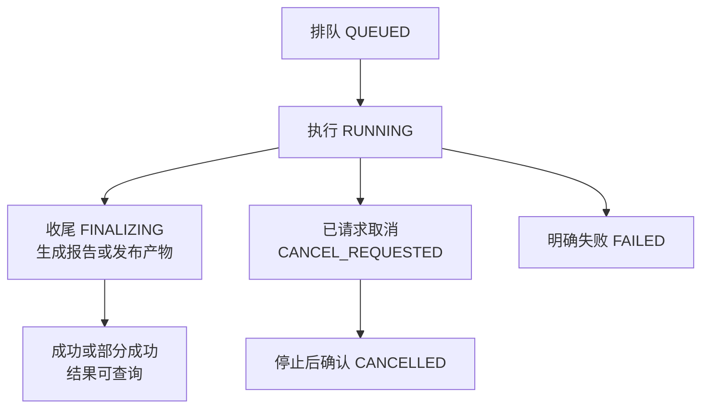

# 后台任务怎样在刷新、断线和取消后继续说清结果

## BIZ-06 异步任务、导入导出与进度

把几万条课程资料导入系统时，页面转圈很久，最后请求超时。用户不知道后台是否还在导入，于是又点了一次，系统出现了两份任务。另一次进度显示 100%，结果文件却还没有生成。

这两种困惑来自不同生命周期被混在一起：创建任务的请求、任务本身的执行、浏览器的观察，以及结果文件的领取。本讲把它们拆开，用明确身份、真实进度和恢复路径连接起来。

### 学习前先确认

- 直接前置：[BIZ-02 状态机与业务不变量](../chinese-guides/biz-02-state-machines-business-invariants.md#biz-02)。任务状态、取消和完成必须遵守允许路径。
- 直接前置：[JS-05 Promise 错误、Async/Await 与异步控制流](../chinese-guides/js-05-promise-errors-async-control-flow.md#js-05)。理解异步失败、协作取消和受控并发。

### 一、创建请求结束以后，任务仍然有自己的生命

**Long-running Operation** 是可在原请求结束后继续存在的操作。用户提交导入请求，服务端完成必要输入检查并可靠记录任务，再返回 taskId 和查询方式；worker 随后执行任务。

```http
POST /imports
Content-Type: application/json
Idempotency-Key: import-intent-demo

{"inputId":"upload-photo-18","inputVersion":"sha-demo","mode":"partial"}

HTTP/1.1 202 Accepted
Location: /tasks/import-photo-18
Retry-After: 2
Content-Type: application/json

{"taskId":"import-photo-18","status":"QUEUED","version":1}
```

这是协议示意，省略实际报文长度等细节。`Idempotency-Key` 在这里是双方约定的请求头；写上这个头不会自动获得去重能力。202 只表示已接受处理，任务可能尚未开始，也可能以后失败。[RFC 9110：202 Accepted](https://www.rfc-editor.org/rfc/rfc9110.html#name-202-accepted)

任务记录至少要能关联主体、机构、输入版本、意图、执行状态、对象版本、进度和结果。只把 taskId 存在浏览器里，服务端却只把任务放在进程内存中，重启后仍无法恢复。

对于几十毫秒完成、无需独立恢复的操作，普通请求通常更简单。任务化的价值在于跨请求调度与恢复，也会引入队列、留存和清理成本。

### 二、意图 ID、任务 ID 和执行尝试不是同一个身份

一次用户意图可能因网络问题重复提交，但应指向同一任务。一个任务又可能因为 worker 崩溃而产生多次执行尝试。结果文件也有自己的对象标识。

| 标识 | 表达什么 | 何时变化 |
| --- | --- | --- |
| intentId / 幂等键 | 用户希望做的这一次操作 | 明确发起新业务意图时 |
| taskId | 可查询的后台任务 | 创建新的任务资源时 |
| attemptId | 某一次执行尝试 | 重领或重新执行时 |
| resultId | 具体产物 | 生成新产物时 |

创建响应丢失后，沿原意图查询或按合同同键重放；不能为了“再试一次网络”就换新 key。去重还要绑定主体、任务类型和规范化输入，输入文件最好关联不可变版本，避免同一个 inputId 的内容后来改变。

刷新页面应恢复观察现有 taskId，不再发送创建命令。一个可靠任务中心可以让用户离开页面后再回来，而不是把任务生命周期绑在弹窗是否打开上。

### 三、任务状态与页面连接状态分别保存

本讲采用 QUEUED、RUNNING、FINALIZING、SUCCEEDED、PARTIALLY_SUCCEEDED、FAILED、CANCEL_REQUESTED、CANCELLED。不是每个项目都需要全部状态，只有有实际行为差异时才增加。



图中省略了排队取消及收尾失败等具体分支，完整实现需要明确它们的合同。FINALIZING 表示行处理已结束，但结果还未准备好，因此进度 100% 不等于任务成功。

浏览器离线是观察状态，不应该把服务端 RUNNING 改成 FAILED。查询接口本身成功返回 200 时，正文任务可以是 FAILED；查询得到 403 则是观察者没有权限，不能据此判断任务执行失败。

网络、业务执行和产物状态分别表达，用户才能知道现在该等待、重新连接、修正输入还是重新生成结果。

### 四、进度需要明确分子、分母和所属阶段

对于总共 1000 行的导入，“已检查 400 行”可以给出检查阶段 40%；调用不确定耗时的外部服务时，没有可靠分母，应显示阶段和已用时间。不要让动画每秒增加一点，把不知道伪装成确定百分比。

```ts example=biz06-progress-meaning
function progress(done: number, total: number | null, phase: string): string {
  if (!Number.isSafeInteger(done) || done < 0) throw new RangeError('非法完成数');
  if (total === null) return `${phase}：已处理 ${done}，总量待确认`;
  if (!Number.isSafeInteger(total) || total < 0 || done > total) throw new RangeError('非法总量');
  if (total === 0) return `${phase}：没有待处理项`;
  return `${phase}：${Math.floor(done / total * 100)}%（${done}/${total}）`;
}
console.log(progress(4, 10, '检查记录'));
console.log(progress(4, null, '扫描输入'));
console.log(progress(0, 0, '检查记录'));
console.log(progress(10, 10, '生成结果前的行处理'));
// => 检查记录：40%（4/10）
// => 扫描输入：已处理 4，总量待确认
// => 检查记录：没有待处理项
// => 生成结果前的行处理：100%（10/10）
```

完成行数、成功行数和写入行数也可能不同。检查完 100 行，其中 8 行无效，不能显示“成功导入 100 行”。每个数字先命名，再画进度条。

多阶段总进度可以使用经过测量的权重，也可以直接显示各阶段。总量变化或从检查转到写入时，应说明重新估算的原因；不要为了永远不倒退而冻结一个已经失真的百分比。

### 五、轮询一次等一次，异常后有上限地退避

**Polling** 是周期查询快照。最直接的控制方式是等待这一轮结束，再安排下一轮；固定 `setInterval` 若不处理重叠，慢请求会堆积，旧响应还可能覆盖新状态。

下面注入读取、等待和显示函数，使用合成返回值观察：临时失败会延后，旧版本不回退页面，终态停止，达到观察预算也停止。预算耗尽只停止本次观察，不把任务改成失败。

```js example=biz06-bounded-polling
async function observe({ read, wait, render, active, random, maxReads = 6 }) {
  let latest = -1, failures = 0;
  const known = new Set(['QUEUED', 'RUNNING', 'FINALIZING', 'CANCEL_REQUESTED',
    'SUCCEEDED', 'PARTIALLY_SUCCEEDED', 'FAILED', 'CANCELLED']);
  const terminal = new Set(['SUCCEEDED', 'PARTIALLY_SUCCEEDED', 'FAILED', 'CANCELLED']);
  for (let count = 0; count < maxReads; count += 1) {
    if (!active()) return 'STOPPED';
    const reply = await read(); // 已解析、已确认属于当前 taskId 的返回值
    if (!active()) return 'STOPPED';
    if (reply.kind === 'denied') return 'ACCESS_CHANGED';
    let delay = 1000;
    if (reply.kind === 'temporary') {
      failures += 1;
      const cap = Math.min(8000, 1000 * 2 ** (failures - 1));
      delay = Math.max(reply.retryAfterMs ?? 0, Math.floor(random() * cap));
    } else {
      failures = 0;
      if (!known.has(reply.status)) return 'UNSUPPORTED';
      if (reply.version > latest) {
        latest = reply.version; render(reply);
        if (terminal.has(reply.status)) return 'TERMINAL';
      }
    }
    if (count + 1 === maxReads) return 'BUDGET';
    await wait(delay);
  }
  return 'BUDGET';
}
const replies = [
  { kind: 'snapshot', status: 'RUNNING', version: 2 },
  { kind: 'temporary', retryAfterMs: 2500 },
  { kind: 'snapshot', status: 'RUNNING', version: 1 },
  { kind: 'snapshot', status: 'SUCCEEDED', version: 3 },
];
const shown = [], waits = [];let reads = 0;
const outcome = await observe({
  read: async () => replies[reads++], wait: async ms => { waits.push(ms); },
  render: value => shown.push(`${value.status}@${value.version}`),
  active: () => true, random: () => 0.5,
});
console.log(outcome, reads);
console.log(shown.join(' → '));
console.log(waits.join(','));
// => TERMINAL 4
// => RUNNING@2 → SUCCEEDED@3
// => 1000,2500,1000
```

这里的 `retryAfterMs` 是解析后的毫秒值；真实 Retry-After 可以是秒数或 HTTP 日期，不能直接当毫秒。若服务端要求的等待超出总观察预算，应暂停并提供继续查询入口，不要偷偷提前重试。

真实读取适配器需处理网络异常、HTTP 状态和 Schema 校验，将可暂时重试的情况转换成 temporary；其余错误应明确结束或提示。页面隐藏、身份切换和取消观察还需连接 AbortSignal，使真实请求和等待能尽快停止，`active()` 则防止已返回的旧结果继续提交。

### 六、推送负责及时提醒，查询负责断线后的恢复

任务进度通常是服务端单向通知，SSE 或轮询就能满足很多场景，未必需要双向 WebSocket。选择时考虑连接数量、代理、认证方式与恢复协议，而不是只比较延迟。

推送携带 taskId、事件 ID 和对象版本。重复完整快照可以按版本忽略；如果消息是“增加 1”这样的增量，发现版本缺口不能直接跳过，必须补事件或读取权威快照。

初次查询与订阅之间也可能发生变化。可先建立能缓冲的订阅再读快照，或者订阅后再次查询，按明确的游标或版本合并。仅写“先查再订阅”，却没有处理这个空隙，仍会漏更新。

断线后恢复的是观察，不是重新创建任务。任务的持久状态才是浏览器刷新、进程重连和支持人员排查时共同查询的事实。

### 七、取消观察、请求取消与实际停止分三步

浏览器 AbortController 能取消 fetch 或响应流消费，但不会自动撤回已接受的任务。业务取消需要显式命令；服务端接受意图后，worker 在安全检查点停止，再确认 CANCELLED。[MDN AbortController](https://developer.mozilla.org/zh-CN/docs/Web/API/AbortController)

下面演示一个允许保留部分成功的行处理模型。取消后已写入行保留，未开始行不再执行；它不是整批回滚模型。

```js example=biz06-cancel-checkpoint
function step(job) {
  if (job.status === 'CANCEL_REQUESTED') return { ...job, status: 'CANCELLED' };
  if (job.status !== 'RUNNING') return job;
  const row = job.rows[job.next];
  if (row === undefined) return { ...job, status: 'FINALIZING' };
  return { ...job, next: job.next + 1, written: [...job.written, row] };
}
function cancel(job) {
  return ['QUEUED', 'RUNNING'].includes(job.status)
    ? { ...job, status: 'CANCEL_REQUESTED' } : job;
}
let job = { status: 'RUNNING', rows: ['r1', 'r2', 'r3'], next: 0, written: [] };
job = step(job);
job = cancel(job);
console.log(job.status, job.written.join(','));
job = step(job);
job = step(job);
console.log(job.status, job.written.join(','), job.rows.length - job.next);
const finished = { ...job, status: 'SUCCEEDED' };
console.log(cancel(finished).status);
// => CANCEL_REQUESTED r1
// => CANCELLED r1 2
// => SUCCEEDED
```

在这份简化合同里，进入收尾或成功后取消不再改变状态；真实接口应返回“已过可取消点”或当前事实，而不是无条件回复“已取消”。最后一个不可逆提交与取消请求谁先成立，需要持久化状态和原子条件决定。

外部步骤若无法取消，系统可能必须等待结果，再决定是否补偿。界面应说明“已请求取消”与“已确认停止”的差别，不要先把任务卡删除，让用户失去查询入口。

### 八、租约和检查点帮助恢复，但不能允许旧 worker 继续写

队列不能创造处理能力。提交长期快于消费时，等待和存储都会增长，需要入口配额、最大队列、租户公平性、有限并发和明确过载结果。

worker 领取任务后可持有租约，定期续租；崩溃后其他 worker 重领。但旧 worker 可能只是暂时卡顿，稍后又恢复。仅检测“租约过期了”还不够，提交方应验证领取代次或 fencing token，阻止旧所有者覆盖新进度。

检查点保存已经确认完成的范围，以及用于恢复的输入版本和步骤结果。写入行成功、检查点未保存就崩溃时，重启可能重复执行，因此步骤还需幂等或由同一事务提交业务效果与完成标记。

不能理解的任务 Schema 版本应明确暂停或拒领，不能靠猜默认值继续产生副作用。滚动发布时同时考虑旧 worker 读取新任务、新 worker 恢复旧检查点，以及队列里尚未执行的存量。

### 九、导入报告区分成功、失败和根本没处理

导入先经过文件边界、结构解析、行校验和业务写入。文件扩展名不证明内容可信；大小、编码、压缩展开量和单条长度应在昂贵处理前限制。具体字节与流处理可回到 [NODE-02](../chinese-guides/node-02-files-streams-buffers-errors.md#node-02)。

| 结果 | 说明 | 后续动作 |
| --- | --- | --- |
| 成功 | 该行的业务效果已确认 | 不因整批重试再次处理 |
| 校验失败 | 该行未按合同写入，错误可定位 | 修正字段后提交新意图 |
| 未处理 | 取消或前序故障使其没有开始 | 从明确范围继续 |
| 结果未知 | 可能已写入但确认缺失 | 先查询该行或步骤的意图 |

允许部分成功时，报告保留行号、字段、错误码和必要说明；整批原子模式则应先明确事务或暂存发布的边界，不能用“失败后删掉已写行”冒充回滚。

预览通过也不保证正式写入一定成功。并发数据可能已改变，唯一约束、权限和业务不变量仍要在实际提交时检查。

### 十、任务完成、下载凭据和文件留存有三个期限

导出应从服务端的获准集合生成，保存筛选、字段、排序和快照语义，而不是只取前端当前页。数据持续变化时，要说明它代表某个一致快照，还是一段读取区间内的结果。

任务 SUCCEEDED、下载凭据仍有效、文件仍存在，是三个不同事实。短期 URL 过期但文件还在时，可以重新鉴权后签发新链接；文件已按留存规则删除时，才需要重新生成。不能遇到一个 410 就一律重新跑整项导出。

签名 URL 往往是持有即可使用的能力凭据。应用层撤权未必能立即让已签发链接失效，是否需要代理下载、短有效期或可撤销 token，应根据具体要求设计；不能只说“领取时查过权限”就承诺之后立即撤销。

创建、执行和领取分别检查当前适用范围，特别是角色撤回或机构切换。权限模型参见 [BIZ-03](../chinese-guides/biz-03-rbac-abac-data-permissions.md#七允许看字段不等于允许修改字段)。结果、临时文件和错误报告都应有独立清理责任。

### 十一、失败重试与人工恢复都沿同一条任务时间线

输入格式错误通常需要修正，权限拒绝需要重新授权，临时依赖故障可以有预算地重试，结果未知则先查询已发生的效果。不要让所有失败都回到“从头再跑一次”。

超过预算后进入明确失败、暂停或待人工处理，并保留 taskId、attemptId、检查点和安全的错误摘要。确定性毒消息不应无限重试而堵住整个队列；修复后重放仍需去重。

关键观测包括排队时长、最老任务、执行阶段、取消等待、重领次数、未完成产物和每租户在途量。高百分比停滞可能是收尾故障，而不是“还剩一点点”；要能沿 taskId 找到具体阻塞位置。

### 十二、让用户随时知道现在该等、该查还是该修

任务中心应保留当前状态、阶段、可信进度、最近更新时间和允许动作。离线时说明暂时无法观察，部分成功时提供错误行和已成功范围，取消后保留最终结果，产物过期时给出正确的重新领取或生成入口。

状态变化用文本说明，重要完成或失败可以通过适度的 live region 通知，不要每个百分点都弹 toast。页面关闭不是取消；想停止任务时必须有明确操作和反馈。

验证可以集中在少量关键路径：创建响应丢失不重复创建、终态停止观察、旧进度不回退、断网后查询同一任务、取消后保留已确认行、文件和凭据过期分别恢复。真实队列、持久化与权限保证需要在对应系统验证，本讲合成例子只解释各项机制。

### 动手想一想

任务成功了，下载地址十分钟后失效，但文件会保留一天。用户回来下载时应该重新导出，还是重新领取地址？再加入“用户权限已被撤回”，说明为什么任务曾成功不代表现在仍有领取资格。

### 参考与延伸阅读

- [Microsoft：Asynchronous Request-Reply](https://learn.microsoft.com/en-us/azure/architecture/patterns/asynchronous-request-reply)：核对任务资源、状态查询和响应解耦的设计。
- [RFC 9110：202 Accepted](https://www.rfc-editor.org/rfc/rfc9110.html#name-202-accepted)：查证接受处理与完成之间的差别。
- [MDN：AbortController](https://developer.mozilla.org/zh-CN/docs/Web/API/AbortController)：查询浏览器取消信号的能力边界。
- [BIZ-07：幂等与一致性](../chinese-guides/biz-07-errors-idempotency-eventual-consistency.md#biz-07)：进一步处理跨系统未知结果、消息重复和恢复。
