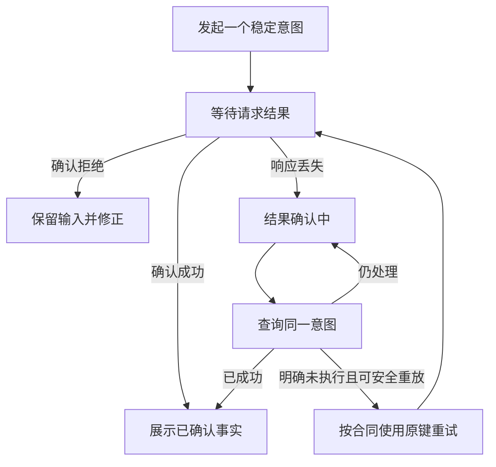

# 请求没回音时，怎样恢复一个可确认的业务结果

## BIZ-07 异常边界、幂等与一致性

你发布了一份课程资料，服务端已经提交成功，但响应在返回途中丢失。页面显示“失败，请重试”，第二次点击又发出了新的发布意图。与此同时，搜索列表还没更新，看起来仿佛第一次根本没有发生。

这里有三件不同的事：一次请求没有完成观察，一次业务操作可能已经提交，一份读模型暂时落后。只有把它们分开，才能决定该查询、重放、解决冲突还是补偿。本讲沿“发布资料并更新检索目录”建立一条可恢复的结果链。

### 学习前先确认

- 直接前置：[BIZ-02 状态机与业务不变量](../chinese-guides/biz-02-state-machines-business-invariants.md#biz-02)。恢复依赖明确状态和提交边界。
- 直接前置：[BIZ-04 API 契约、DTO 与前端模型](../chinese-guides/biz-04-api-contract-dto-frontend-model.md#biz-04)。先区分传输结果、业务结果和稳定错误合同。

### 一、先判断知道多少，再决定让用户做什么

输入校验拒绝、版本冲突和请求超时，并不是同一种“失败”。尤其是超时、连接中断或代理返回 504，通常不能单独证明服务端没有执行写入。

| 观察到的情况 | 已知事实 | 合适的下一步 |
| --- | --- | --- |
| 合同明确的输入拒绝 | 此次操作未按合同提交 | 保留输入并修正 |
| 条件版本不成立 | 没有按旧版本覆盖当前记录 | 读取新事实并解决冲突 |
| 已确认业务成功 | 操作效果已经提交 | 展示成功并更新相关视图 |
| 响应丢失 | 不知道操作是否提交 | 查询原意图的结果 |
| 可重试的暂时故障 | 仍需结合是否有副作用判断 | 在安全协议和预算内重试 |

“明确拒绝且未提交”必须来自操作合同。一个批量接口可能有部分成功；一个 500 也可能发生在提交后生成响应的阶段。不能只按 HTTP 状态码，把所有非 2xx 都归为“没有发生”。

```ts example=biz07-outcome-actions
type Outcome =
  | { kind: 'rejected'; code: string }
  | { kind: 'conflict'; currentVersion: number }
  | { kind: 'unknown'; intentId: string }
  | { kind: 'succeeded'; version: number };
function nextAction(result: Outcome): string {
  switch (result.kind) {
    case 'rejected': return '修正输入，保留草稿';
    case 'conflict': return `读取 v${result.currentVersion} 并解决冲突`;
    case 'unknown': return `查询原意图 ${result.intentId}`;
    case 'succeeded': return `采用已确认版本 v${result.version}`;
  }
}
console.log(nextAction({ kind: 'unknown', intentId: 'publish-18' }));
console.log(nextAction({ kind: 'conflict', currentVersion: 8 }));
// => 查询原意图 publish-18
// => 读取 v8 并解决冲突
```

这些类别经过解释后才能进入 UI。一个“结果确认中”的状态，比虚假的成功或失败更诚实，也能避免用户无意中制造重复业务动作。

### 二、幂等键标识同一意图，不是每次请求的新编号

**Idempotency Key** 表达“一次业务意图的稳定身份”。同一意图因响应丢失而重试，应沿用原 key；用户明确发起新的业务操作，才创建新 key。requestId 则通常用于关联一次网络尝试，两者不应混用。

服务端把 key 与当前已验证主体、机构、动作、对象和规范化载荷绑定。同 key 同载荷可以返回已有状态或结果，同 key 换内容应拒绝。首次处理还要原子占位，防止两个实例同时认为自己是第一份请求。

下面用同步内存替换展示提交关系。主体与权限视为已在外层确认；此代码没有真实认证、数据库事务或进程恢复。它只缓存成功结果，生产协议还需定义处理中与确定性拒绝的记录方式。

```js example=biz07-intent-and-version
let store = {
  material: { id: 'photo', title: '摄影入门', state: 'DRAFT', version: 7 },
  intents: new Map(), outbox: [],
};
function publish(command) {
  const key = JSON.stringify(['verified-lin', 'east', 'publish', 'photo', command.key]);
  const fingerprint = JSON.stringify([command.title, command.expectedVersion]);
  const previous = store.intents.get(key);
  if (previous) return previous.fingerprint === fingerprint
    ? { ...previous.result, replayed: true } : { code: 'KEY_REUSED' };
  if (command.expectedVersion !== store.material.version) return { code: 'VERSION_CONFLICT' };
  if (store.material.state !== 'DRAFT') return { code: 'STATE_DENY' };
  const material = { ...store.material, title: command.title, state: 'PUBLISHED',
    version: store.material.version + 1 };
  const result = { code: 'PUBLISHED', version: material.version };
  const intents = new Map(store.intents);intents.set(key, { fingerprint, result });
  const event = { id: 'published-photo-8', objectId: material.id, version: material.version };
  store = { material, intents, outbox: [...store.outbox, event] };
  return result;
}
const request = { key: 'publish-18', title: '摄影基础', expectedVersion: 7 };
publish(request); // 假设成功响应没有被客户端收到
console.log(publish(request).replayed, store.material.version, store.outbox.length);
console.log(publish({ ...request, title: '另一个标题' }).code);
console.log(publish({ ...request, key: 'new-intent' }).code);
// => true 8 1
// => KEY_REUSED
// => VERSION_CONFLICT
```

同键重放没有新增事件，改载荷被拒绝，新 key 也无法绕过旧版本。首次成功和重复成功的响应可以有不同 requestId 或查询时间；幂等保护的是约定的业务效果，不要求每个响应字节完全相同。

输入格式、授权与规范化应在合适的入口完成。读取旧幂等结果之前也要重新确认当前调用者有权访问它，不能把 key 当作可直接兑换任意历史结果的秘密口令。

### 三、结果未知时查询原意图，不要先换一个新键

一次发布可以建立可查询的操作记录：RECEIVED、PROCESSING、SUCCEEDED、REJECTED，以及必要的结果引用。客户端刷新后仍能沿同一 intentId 找到这条记录，而不依赖某次页面内存。



查询“没找到”也要解释：这是权威存储中没有，还是副本暂时落后、记录过期或当前主体无权查看？如果记录因 TTL 删除，盲目重放可能把旧意图当成新意图。

保留期应覆盖任务恢复、网络重试和业务查询窗口；超出窗口后，可以依靠业务唯一键、长久效果记录或人工核对，而不是无限承诺旧 key 永远安全。长期任务的身份和结果留存，参见 [BIZ-06](../chinese-guides/biz-06-async-jobs-import-export-progress.md#二意图-id任务-id-和执行尝试不是同一个身份)。

不要仅凭本地“已经发送”作成功证据，也不要为了让 loading 消失直接宣判失败。设定确认预算、继续查询入口和支持编号，才能在暂时无法确认时给用户实际下一步。

### 四、版本前提保护不同意图之间的并发

幂等阻止同一意图重复产生效果，条件写入防止不同意图覆盖彼此。两位编辑基于 v7 分别修改标题和简介，即使用不同 key，也不能都无条件把完整对象写回。

读取得到强 ETag 后，写入携带原样的 `If-Match: "material-7"`；前提失效时返回 412。若项目使用显式 version 与 409 表达业务冲突，也要明确定义。ETag 是不透明验证器，不是让客户端解析和自增的版本号。[MDN 条件请求](https://developer.mozilla.org/zh-CN/docs/Web/HTTP/Guides/Conditional_requests#使用乐观锁避免更新丢失问题)

重放已成功意图时，可以先返回经过授权的历史结果，再检查旧写入前提，否则第一次提交自己增加的版本会让每次安全重试都失败。新意图则必须重新走当前版本和状态规则。

字段编辑可以使用三方比较，发布、取消等状态命令通常应重新判断当前规则，不能机械合并。界面如何保留草稿，见 [BIZ-05 的冲突处理](../chinese-guides/biz-05-form-table-detail-state-consistency.md#五后台刷新与冲突都要保留比较起点)。

### 五、原子提交要把业务效果与识别重复的证据一起保存

进程内 Map 只解释本机顺序；多实例真实系统需要存储层的唯一约束、事务或条件写入。典型事务包含业务变更、成功意图结果和必要待发布事件，使它们一起成立或一起不成立。

“先查 key 不存在，再插入”的两个独立步骤会有竞态。应由原子插入或唯一约束裁决，冲突的一方读取已有记录并比较载荷。若已有记录还在 PROCESSING，返回可查询状态或按合同等待，不能把占位直接当成功。

事务提交前失败，与提交后响应失败需要区分。前者可以确定本事务未生效；后者可能只是调用者缺少证据。提交结果本身不明时，同样要通过操作记录恢复，而不是只根据异常类名推断。

跨外部服务的副作用不属于本地数据库事务。调用外部接口后回滚本地事务，无法自动撤回对方已经执行的动作，需要独立意图、查询和恢复协议。

### 六、Outbox 让待发送事实随业务一起提交

资料已发布但搜索事件没发出，列表可能永远停在旧状态。反过来，先发事件再提交资料，消费者又可能看到从未真正成立的发布事实。

**Transactional Outbox** 把业务状态和待发送事件放进同一个本地事务，发布器随后投递。发布器在“已经发出、尚未标记完成”之间崩溃，仍可能造成重复，所以消费者还要识别事件身份。

```js example=biz07-duplicate-delivery
const event = { id: 'published-photo-8', materialId: 'photo', title: '摄影基础' };
const deliveries = [event, event]; // 投递成功后确认丢失，随后再次投递
let consumer = { seen: new Set(), catalog: new Map(), applied: 0 };
function consume(message) {
  if (consumer.seen.has(message.id)) return 'DUPLICATE';
  const seen = new Set(consumer.seen);seen.add(message.id);
  const catalog = new Map(consumer.catalog);catalog.set(message.materialId, message.title);
  consumer = { seen, catalog, applied: consumer.applied + 1 };
  return 'APPLIED';
}
console.log(deliveries.map(consume).join(','));
console.log(consumer.applied, consumer.catalog.get('photo'));
// => APPLIED,DUPLICATE
// => 1 摄影基础
```

教学函数把消费者效果和 seen 一起替换。真实实现需要让去重记录与对应业务变更原子提交，否则可能先写 seen 后崩溃导致丢效果，或先执行效果后崩溃导致重复效果。

Outbox 本身不承诺消息一定在某个时刻到达，也不天然提供全局 exactly-once。可靠存储、持续重试、消费者去重和积压监控共同决定恢复能力。未发送事件最老年龄与失败原因，比单纯的消息总量更能揭示故障。[Transactional Outbox 模式](https://microservices.io/patterns/data/transactional-outbox)

### 七、旧快照可以忽略，增量缺口不能随手跳过

“版本小于当前就丢弃”适合某些完整读模型快照，却不能套到所有事件。完整快照 v8 已包含此前事实，晚来的 v7 通常不应覆盖它；但事件若表示“增加一条”，跳过中间步骤会丢失业务效果。

```js example=biz07-delta-gap
let projection = { sequence: 0, count: 0 };
function apply(event) {
  if (event.sequence <= projection.sequence) return 'DUPLICATE_OR_OLD';
  if (event.sequence !== projection.sequence + 1) return 'GAP';
  projection = { sequence: event.sequence, count: projection.count + event.delta };
  return 'APPLIED';
}
const first = { sequence: 1, delta: 1 };
const second = { sequence: 2, delta: 2 };
console.log(apply(second), projection.count);
console.log(apply(first), apply(second), apply(second));
console.log(projection.sequence, projection.count);
// => GAP 0
// => APPLIED APPLIED DUPLICATE_OR_OLD
// => 2 3
```

这里假定一个可信、连续且序号唯一的对象事件流。不同对象的事件不能共用这一个 sequence，真实消费还要原子保护当前序号与结果。发现缺口可以补读缺失事件，或加载能完整替代投影的权威快照；不能只把序号直接推进到 2。

向外部发送邮件、发放权益等副作用，也不能因为“新快照已经到了”就随意略过其事件。要先说清这条消息更新的是投影还是必须独立执行的业务步骤，再选择去重和排序策略。

### 八、最终一致需要明确哪些事实暂时落后

**Eventual Consistency** 描述在适当条件下、没有新更新时副本能够收敛；它本身不提供具体的延迟上限。产品还需要额外的延迟目标、超时检测、恢复入口和责任人。

例如资料发布已在主存储完成，搜索目录仍显示草稿。详情可以读取最新事实，列表说明“正在同步”；查询可以带最低对象版本要求，由服务端等待、转向更新的来源或明确返回尚未追上，不能伪称已读到最新。

高风险写入不能随意依赖陈旧投影决定权限或容量。读自己刚写入的结果、跨页面显示一致、所有副本瞬时一致，是不同保证；应根据实际需求选择，而不是一律贴“最终一致”标签。

若超出约定时间仍未更新，应检查 Outbox、消费缺口和投影，而不是让用户不断刷新。暂时差异必须可解释，持续偏差必须有人处理。

### 九、补偿是一个新的业务动作，有自己的结果

**Compensation** 在原动作已经发生后执行修正，例如撤销一项已开通权益、下架已发布资料或释放预留。它不是删除历史，也不保证世界回到从未发生的状态：通知可能已被读过，内容可能已被下载。

原发布意图与撤回意图应有各自稳定身份。补偿记录关联原意图，但不应误读成“用同一个幂等记录把发布变成撤回”。如果协议复用原始关联号，也必须通过动作命名空间区分记录。

补偿请求超时同样可能已执行，先查询补偿意图，再按安全协议重试；不要因为撤回失败就重复原发布。**Saga** 可以组织跨系统步骤与补偿，关键仍是持久化当前步骤、尝试、截止与人工处理状态。

不是所有错误都要求补偿。搜索投影延迟通常应该补发或重建投影；把已发布资料直接撤回，反而改变了用户成功完成的业务意图。

### 十、重试有预算，且只能发生在知道语义的一层

“网络错误就重试三次”忽略了是否已经产生副作用。先确认操作可重复、同键去重受支持，或已确定未执行，再考虑退避、抖动、最大次数和总时间预算。

SDK、网关、服务和队列都重试时，次数会相乘，甚至让一个临时故障变成持续过载。选择能理解业务语义的一层主导重试，记录 attempt，并让其他层遵守明确预算。轮询读取的有界退避示例见 [BIZ-06](../chinese-guides/biz-06-async-jobs-import-export-progress.md#五轮询一次等一次异常后有上限地退避)。

Retry-After 提供等待要求，超时限制本次等待，限流限制容量，熔断减少对已故障依赖的调用；这些措施都不证明写入没有发生。计时器用适合测量时长的时钟，跨进程保留时间用可信服务端时间，事件排序尽量依赖版本或序列。

确定性的坏消息或永远不满足的业务前提，不应靠无限重试处理。进入明确失败、死信或人工路径，并保留能重新定位问题的必要信息。

### 十一、对账把漏掉的差异变成可追踪的修复

再可靠的在线流程，也可能因人工操作、旧缺陷或外部系统故障留下偏差。对账按稳定业务标识比较权威状态、意图记录、待发事件与下游结果，区分缺失、重复、版本落后和真正语义冲突。

修复也要有意图、权限、限速和审计。例如补建搜索投影可以使用“资料 ID + 目标版本”作为去重依据；修复后再读一次确认已经收敛，而不是只更新一张表就关闭问题。

监控 unknown 停留时长、幂等命中与同键冲突、条件写入失败、Outbox 最老年龄、消费缺口、补偿失败及对账差异。指标应能连接具体对象和恢复步骤，公开日志避免暴露敏感载荷或下载凭据。

自动修复适合规则明确、风险可控的偏差；无法确认实际外部效果时，保留待处理状态并交给有足够上下文的人判断，不把猜测伪装成成功。

### 十二、用故障发生的位置判断证据是否充分

同样一次“断线”，发生在请求到达前、事务提交前、提交后响应前，结论完全不同。少量精准故障比大量正常请求更能解释恢复机制。

| 故障位置 | 应重点观察 |
| --- | --- |
| 提交前失败 | 业务效果和成功结果都未成立 |
| 提交后响应丢失 | 原意图可查询，同键重放不重复效果 |
| 消息发出但确认丢失 | 重复投递不会重复消费者效果 |
| 新旧事件乱序 | 完整快照不回退，增量缺口不被跳过 |
| 补偿响应丢失 | 原动作和补偿分别可查询，不重复原动作 |

示例里的内存替换只帮助理解关系，不证明数据库隔离或真实进程崩溃恢复。实际验证应记录请求、业务存储和用户界面三方面证据，并选择本次风险涉及的边界，避免重复搭建无关测试。

用户最终看到的应是可确认事实与明确下一步：处理中、待确认、冲突、部分完成或已完成。把这些状态组织好，页面才不会在异常出现时靠一个“重试”按钮把恢复责任全部推给用户。

### 动手想一想

资料发布成功，搜索目录没更新。应该重发发布命令、撤销资料，还是修复目录投影？先找到已经成立的业务事实，再选择不会改变原意图的恢复动作。

### 参考与延伸阅读

- [RFC 9110：幂等方法](https://www.rfc-editor.org/rfc/rfc9110.html#name-idempotent-methods)：核对 HTTP 方法语义；业务去重仍需具体实现。
- [MDN：条件请求](https://developer.mozilla.org/zh-CN/docs/Web/HTTP/Guides/Conditional_requests)：查询验证器与并发写入前提。
- [AWS Builders' Library：让重试安全的幂等 API](https://aws.amazon.com/builders-library/making-retries-safe-with-idempotent-APIs/)：进一步思考稳定意图、晚到请求和参数变化。
- [Transactional Outbox](https://microservices.io/patterns/data/transactional-outbox)：查询本地提交与消息发送之间的恢复模式。
