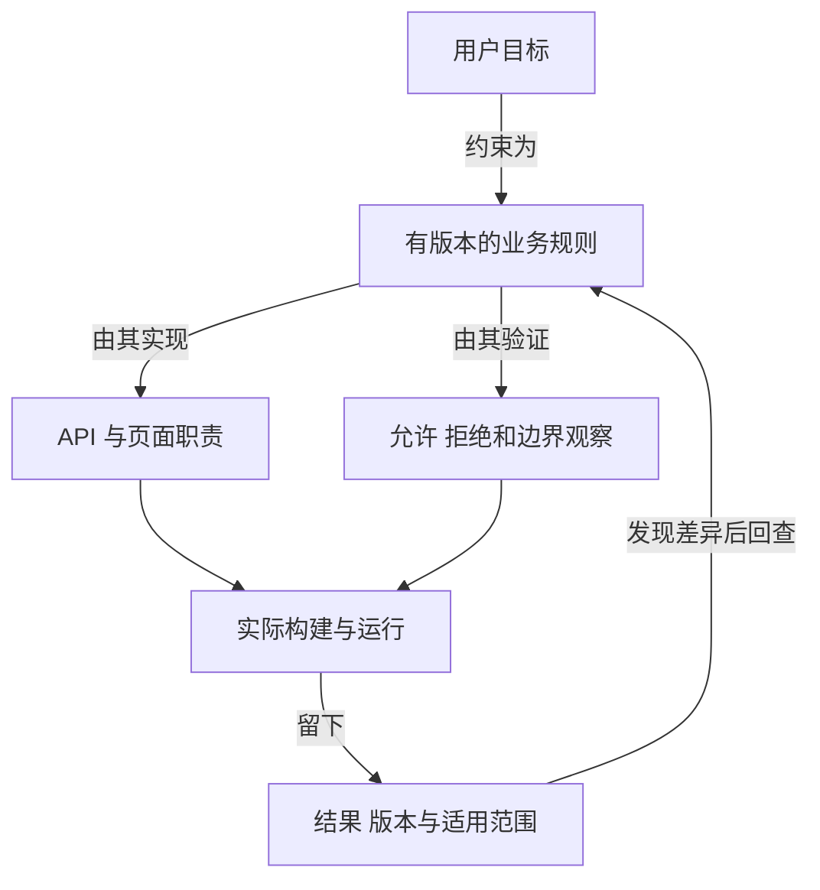

# 一条需求改了，怎样知道哪些地方也要改

## BIZ-08 需求到验收的可追踪性

课程资料现在允许临时代班复核。页面上的“发布”按钮会在代班到期后禁用，直接调用接口却仍能发布。开发说按钮已经改了，测试说页面通过了，需求单也已关闭；这些记录都是真的，却没有保护同一条规则。

**Traceability** 让我们从一句业务承诺找到实际执行和验证它的位置，也能从一个分支或失败结果找回它存在的理由。本讲围绕“代班复核课程资料”拆解这条联系。例子中的角色、期限和路径都是教学用的自编约定，不是本系统的真实权限配置。

### 学习前先确认

- 直接前置：[BIZ-01 业务对象、关系与统一语言](../chinese-guides/biz-01-domain-objects-relations-ubiquitous-language.md#biz-01)。先把资料、复核人、代班关系和发布说成含义一致的业务事实。
- 直接前置：[ENG-05 质量门禁](../chinese-guides/eng-05-quality-gates-lint-types-tests-ci.md#eng-05)。检查要回答具体风险，并留下可判断的运行结果。

### 一、把目标、规则和实现决定分开

“让复核人请假时仍能发布资料”是目标。“代班只在有效期内允许复核”是规则。“用一个定时器禁用按钮”是实现决定。三者相关，却不能互相替代。

如果定时器晚执行一分钟，业务规则并没有跟着延长一分钟。后端仍要用可信时间检查有效期；前端只是帮助用户提前理解。权限执行的进一步解释见 [BIZ-03](../chinese-guides/biz-03-rbac-abac-data-permissions.md#五策略决定之后还要有人真正执行拒绝)。

| 层次 | 本例的记录 | 它回答什么 |
| --- | --- | --- |
| 目标 | 原复核人不在时，资料仍能按时复核 | 为什么做 |
| 规则 | 指定代班人只能在有效期内处理指定目录 | 什么必须成立 |
| 验收条件 | 恰好到期的直接请求被拒绝，资料版本不变 | 怎样观察结果 |
| 设计决定 | API 查询代班关系，页面显示剩余时间 | 准备怎样实现 |
| 运行证据 | 当前构建下，请求、响应和资料版本的记录 | 实际发生了什么 |

记录需求时先保留来源、负责人和未决问题。例如“48 小时”究竟是经过的时长，还是两个工作日？“处理”包含发布、驳回还是仅查看？这些问题没决定之前，不应该悄悄固化进代码。

### 二、稳定编号保留规则身份，版本说明规则变化

标题会改，页面会迁移，文件会重命名。规则 ID 应表示一项长期可识别的约束，例如 `REVIEW-DELEGATION-WINDOW`；不要用 `button-3` 把业务身份绑在今天的布局上。

规则身份稳定不代表内容不变。有效期由 24 小时改成 48 小时，可以保留同一 ID，递增版本并说明生效范围。若旧规则被另一套业务关系替代，记录替代关系和迁移条件，别覆盖到看不出过去的行为。

一张够用的规则卡可以包含以下信息：

```text
ID：REVIEW-DELEGATION-WINDOW
版本：2
来源：复核流程决定 DR-12
负责人：资料流程负责人
状态：已采用
规则：主体、目录均匹配，且开始时间 <= 当前时间 < 结束时间
失败事实：不发布，不改变资料版本；返回可解释的拒绝
未决事项：无；跨时区按 UTC 时间点比较
替代：版本 1 的 24 小时期限制，仅新建代班采用版本 2
```

这里的“仅新建代班”很重要：修改默认时长，不必然修改已存在的授权。规则版本、关系数据版本和代码版本分别保存，才能解释历史资料为何按旧条件处理。

### 三、验收条件写输入、观察和不能发生的事

**Acceptance Criteria** 描述给定前提下的可观察结果。只写“代班功能正常”或“测试全绿”，无法告诉别人该看什么。

本例把时间区间约定为左闭右开：开始那一刻有效，结束那一刻无效。这是业务选择，不是时间库自动决定的默认。

```ts example=biz08-window-cases
type Delegation = { actor: string; folder: string; start: number; end: number };
function allowed(d: Delegation, actor: string, folder: string, now: number): boolean {
  return actor === d.actor && folder === d.folder && d.start <= now && now < d.end;
}
const d = { actor: 'lin', folder: 'photo', start: 100, end: 148 };
const cases = [
  { name: '尚未开始', actor: 'lin', folder: 'photo', now: 99, expected: false },
  { name: '恰好开始', actor: 'lin', folder: 'photo', now: 100, expected: true },
  { name: '结束之前', actor: 'lin', folder: 'photo', now: 147, expected: true },
  { name: '恰好结束', actor: 'lin', folder: 'photo', now: 148, expected: false },
  { name: '另一个目录', actor: 'lin', folder: 'design', now: 120, expected: false },
];
for (const item of cases) {
  const actual = allowed(d, item.actor, item.folder, item.now);
  console.log(`${item.name}：${actual}，符合约定 ${actual === item.expected}`);
}
// => 尚未开始：false，符合约定 true
// => 恰好开始：true，符合约定 true
// => 结束之前：true，符合约定 true
// => 恰好结束：false，符合约定 true
// => 另一个目录：false，符合约定 true
```

数字是可控时间刻度，只演示区间与输入组合；生产入口还需要身份验证、关系撤回、当前策略和原子提交。这个函数返回 false，不能证明接口真的拒绝了写入。

因此 API 验收还要观察“拒绝后资料仍为原版本”，页面验收观察“用户理解拒绝原因，符合权限的输入仍保留”。同一规则可以需要几份不同层次的证据；不要把它们混成一个“页面按钮变灰”。

### 四、正向追踪找到每条承诺的执行位置

从规则往下找，依次说明设计怎样承担它、代码在哪里执行、什么观察能够验证。关系要带动词，避免把所有相关网址堆在一起。



“页面显示剩余时间”实现可理解性，“API 检查有效期”实现执行边界，两条关系都要存在。定时任务、导出、管理脚本若也能发布，就要确认它们是否经过同一业务入口，不能只查 Web 路由。

正向追踪容易发现未分配的承诺。例如规则卡有“授权被撤回后立即停止”，矩阵只有到期时间，没有撤回的执行点和反例，这就是实际缺口。补上一条链接只有在它对应真实实现时才有价值。

### 五、反向追踪解释分支为何存在

看到一个 `DELEGATION_EXPIRED` 错误分支，应能回到有效期规则、拒绝后的事实和界面恢复方式。看到一条失败用例，应能判断它是保护现行要求，还是仍在验证废止行为。

正文规则尽量保留一个权威位置；代码和测试用 ID 引用，不把整段说明复制到多个注释里。否则规则卡改为 48 小时，注释和验收表仍写 24 小时，链接都没坏，内容却已经分叉。

反查不到来源时，先调查原因。它可能是遗漏记录，也可能是事故修复形成的必要保护，不应自动当成多余代码删除。变更记录需要说明是补追踪、澄清规则、修实现，还是正式退役。

### 六、矩阵只放能帮助判断的关系

**Traceability Matrix** 可以很小。对当前能力，先保留规则、执行点、观察和证据，再按风险增加负责人、设计记录与运行指标。

| 规则 | 执行位置 | 关键观察 | 本次证据 |
| --- | --- | --- | --- |
| 代班有效期 | API 授权判断；页面时间提示 | 恰好到期，直接调用也拒绝 | 当前 API 运行与页面观察 |
| 不可自审 | 发布动作守卫 | 作者兼代班人仍不能自审 | 明确身份的拒绝用例 |
| 冲突不覆盖 | 版本条件写入 | 旧版本发布不修改新资料 | 存储边界记录 |

这些是教学中的位置描述，不是假装仓库里已经存在相应 API。落到真实项目时，要替换为确实可访问的路径、运行 ID 或报告。

低风险文案调整可以只留下需求、改动和人工核对。关键授权规则需要实际入口的证据。无需给每个变量、每条 CSS 建业务编号；矩阵是为了降低下一次判断成本，而不是把所有维护工作加倍。

### 七、规则变化先推导候选影响，再逐项确认

假设驳回理由由“始终必填”改为“只有命中特定复核条件时必填”。状态守卫、输入校验、表单提示、旧草稿、报表和消费者可能受影响；代班有效期本身没有改变。

下面用带类型的关系找候选范围。边的方向约定为“左边改变，右边值得重新检查”。它不是通用知识图谱，也不能证明没有遗漏。

```js example=biz08-impact-graph
const edges = [
  ['rule:reason', 'api:reject', 'implemented-by'],
  ['rule:reason', 'ui:reason-field', 'implemented-by'],
  ['api:reject', 'contract:review-client', 'consumed-by'],
  ['ui:reason-field', 'evidence:keyboard-path', 'verified-by'],
  ['rule:window', 'api:authorize', 'implemented-by'],
];
function candidates(start) {
  const seen = new Set([start]), queue = [start];
  for (let i = 0; i < queue.length; i += 1) {
    for (const [from, to] of edges) {
      if (from === queue[i] && !seen.has(to)) { seen.add(to); queue.push(to); }
    }
  }
  return queue.slice(1);
}
console.log(candidates('rule:reason').join(' → '));
console.log(candidates('rule:window').join(' → '));
// => api:reject → ui:reason-field → contract:review-client → evidence:keyboard-path
// => api:authorize
```

拿到候选清单后，每项标为“需要修改”“已核对仍适用”或“不相关，并说明原因”。检查调用者、历史数据和运行配置，补上图中没有记录的依赖。图的完整性决定搜索范围，遍历算法不会自动发现现实中的漏边。

接口消费者的变更证据继续读 [TEST-04](../chinese-guides/test-04-api-contract-consumer-driven-testing.md#test-04)。一种常见遗漏是旧浏览器标签页仍在调用旧合同；无需有移动端，也会存在多个消费者版本。

### 八、证据要对应这次规则和这次构建

昨天的成功截图不能自动证明今天的代码。**Evidence** 至少说明规则版本、构建或提交、环境、输入、运行结果与采集时间；截图只是其中一种观察载体。

```js example=biz08-evidence-baseline
function usable(evidence, target) {
  if (evidence.result !== 'passed') return '结果未通过';
  if (evidence.ruleVersion !== target.ruleVersion) return '规则版本已变化';
  if (evidence.build !== target.build) return '需要确认当前构建';
  if (evidence.environment !== target.environment) return '环境不一致';
  return '基线相符，继续审查证据内容';
}
const target = { ruleVersion: 2, build: 'build-b', environment: 'isolated-api' };
const e = { ...target, result: 'passed' };
console.log(usable(e, target));
console.log(usable({ ...e, build: 'build-a' }, target));
console.log(usable({ ...e, ruleVersion: 1 }, target));
// => 基线相符，继续审查证据内容
// => 需要确认当前构建
// => 规则版本已变化
```

这是保守的基线筛选，不是完整验收器。同一提交也可能使用不同构建配置或依赖，因此发布时通常还要记录制品摘要。反过来，完全不相关的改动不一定要求重跑全部检查；若复用旧证据，必须说明相关代码、规则和环境为何仍等价。

输入里若包含真实客户资料，保存必要的合成重放样本、脱敏摘要或受控查询，不因“可追踪”无限保留敏感内容。

### 九、验收标准、完成定义和设计决定各有职责

验收标准属于某项需求，说明行为是否满足约定；**Definition of Done** 是团队对交付完整度的共同要求，例如有恢复路径、有可复核证据。它们不能用“PR 已合并”代替业务结果。

**ADR** 记录重要设计选择的原因、备选和代价。例如采用短期能力缓存以降低授权延迟，同时明确撤回必须触发失效。若只记录“用了缓存”，后人可能把期限随意延长，破坏原来的撤权承诺。

验收人按事先约定判断结果，不必逐行审查实现。未满足项要指明规则、实际观察和下一步；若接受某项限制，也要写明范围、负责人及到期复核条件。不能为了让当前实现通过，悄悄降低原规则。

### 十、把性能和易用性也写成可观察承诺

“资料打开要快”还缺少起点、终点、环境和数据规模。可以先约定：在指定桌面环境和合成资料集下，完整刷新进入公开正文，测量正文可读时间；同时检查目录跳转和首个输入能否响应。具体预算来自产品目标与基线，不从文章中随便摘一个数字。

缓存命中和未命中要分组，单次最好成绩不能代表稳定结果。“支持键盘”要能完成选择、提交、拒绝后的焦点恢复，而不是只证明 Tab 能聚焦按钮。

追踪表中把“初始正文”“可交互”“更新可见”分别关联到实现和观察。它们可能由不同渲染策略决定，继续读 [RENDER-01](../chinese-guides/render-01-spa-ssr-ssg-isr-hybrid-decisions.md#render-01)。

### 十一、AI 和自动检查帮助找缺口，不能制造依据

AI 可以提取候选规则、查找引用、生成边界输入和整理影响范围。它提出的新规则应标为待确认假设，不能被当成已有产品决定。现有授权内的整理和检查可以继续，真正未决定的业务语义则保持可见。

自动检查适合发现重复 ID、失效链接、缺少负责人、没有当前证据的高风险规则。它无法只看元数据判断一条测试是否真的覆盖了权限执行。链接数量、代码覆盖率和报告数量都不能替代对预期结果的审查。

若测试预期也从同一错误实现生成，再多关系仍会一起错；见 [AIDEV-03 的独立依据](../chinese-guides/aidev-03-ai-generated-code-verification.md#一预期结果必须有独立于生成代码的依据)。先明确反例能否暴露错误，再决定要不要增加检查。

### 十二、运行中的差异应回到原规则

发布后发现“代班到期仍能发布”，调查应回到规则版本、实际执行路径、当时关系与时间、运行制品和原验收观察。不能只在页面加第二个禁用条件，就把服务端漏洞宣告修复。

运行记录可保存稳定规则 ID、策略版本、错误类别与必要关联号；不要把每个请求 ID 放进指标标签制造无限基数。故障修复后补足原来遗漏的反例，重新记录适用证据，再同步相关说明。

持续维护可以从三件事开始：改规则时查看影响关系，改关键分支时回查业务来源，发布时确认当前证据。没有活跃目标的旧记录可以归档，但应保留替代指向和需要的历史解释。工具换了，规则身份与关系仍应能导出。

### 动手想一想

规则、测试和截图都引用了同一个 ID，但测试只检查按钮禁用。这条追踪链缺的是链接，还是能证明服务端拒绝写入的观察？把“恰好到期”那一例的前提、动作、最终资料版本写出来，再回答。

### 参考与延伸阅读

- [NASA：Requirements Management](https://www.nasa.gov/reference/6-2-requirements-management/)：核对需求基线、双向追踪和变化管理；不要求普通 Web 项目照搬航天项目的流程规模。
- [BIZ-01：统一语言](../chinese-guides/biz-01-domain-objects-relations-ubiquitous-language.md#biz-01)：用同一含义串起目标、规则和模型。
- [TEST-01：从规则到测试证据](../chinese-guides/test-01-test-design-oracles-properties-mutation.md#test-01)：进一步理解预期依据、边界与反例。
