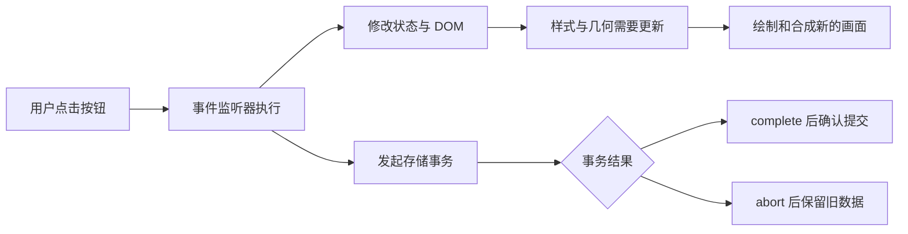

# 浏览器运行时学习资料

## BROWSER-01 从一次点击看懂渲染、事件与存储

点击“展开资料”后，卡片变高了，列表监听器收到了事件，草稿又写入了数据库。这三件事发生在同一个页面，却由不同机制负责。把它们都叫“页面更新”，排错时很容易找错方向。

本篇沿着“画面如何改变—点击如何到达代码—数据何时真正提交”展开。你会运行一个事件观察页和一个事务回滚例子，用输出区分看起来相似、实际含义不同的结果。

### 学习前先确认

- 直接前置：[WEB-01 HTML 语义、表单与可访问性基础](../chinese-guides/web-01-html-semantics-forms-accessibility.md#web-01)。需要认识 DOM 元素、按钮和表单的默认行为。
- 直接前置：[JS-04 异步、Promise 与浏览器事件循环](../chinese-guides/js-04-async-promise-browser-event-loop.md#js-04)。任务、微任务和 Promise 的基本顺序在该篇解释。

### 一、先区分画面、行为和数据

同一次操作可以留下三种互不替代的证据：Performance 录制说明主线程做了什么；事件日志说明哪个监听器处理了什么；事务结果说明哪些记录一起提交或回滚。

例如按钮文字变成“已保存”，只证明 DOM 被更新。它不能证明数据库事务已经完成，更不能证明远端服务收到了数据。反过来，存储已经成功而按钮迟迟不变，可能是长任务挡住了下一次绘制。



图中的两条支路强调职责，不承诺每次绘制与存储回调的精确先后。具体时序取决于任务、资源和浏览器调度。

### 二、渲染阶段各自在算什么

HTML 解析形成 DOM，CSS 解析形成 CSSOM。浏览器结合元素和样式，计算当前需要显示的内容。页面出现后，字体加载、窗口调整、图片尺寸、脚本修改仍会让这些输入变化。

| 阶段 | 回答的问题 | 资料卡片中的例子 |
| --- | --- | --- |
| 样式计算（Style Calculation） | 哪些声明最终生效 | 加上 expanded 类后匹配哪些规则 |
| 布局（Layout） | 大小和位置是多少 | 摘要展开后，后面的卡片下移多少 |
| 绘制（Paint） | 文字、背景和边框如何画 | 高亮边框和新出现的文字 |
| 合成（Composite） | 如何组合各绘制结果 | 把可独立处理的图层组合到屏幕上 |

这是便于推理的模型，不是“每改一次 DOM 必须完整跑四遍”的规定。浏览器会延迟、合并、跳过不必要工作；不同引擎的实现细节也不同。讨论一次性能问题时，优先说“录制里出现了 Layout”，再追查触发源。

把颜色改成蓝色，通常不改变几何；把宽度改窄则可能让文字重新换行，影响后面整段布局。`transform` 和 `opacity` 常适合动画，但是否能只走合成取决于实际条件。不能给所有节点加 `will-change` 就宣布优化完成，图层也有内存和栅格化成本。

### 三、为什么读一个宽度会让页面停一下

**强制同步布局（Forced Synchronous Layout）**常发生在浏览器尚未处理样式变化时，脚本又要求立即得到最新几何。读取本身不是错误；问题在于让浏览器反复提前结算。

下面是说明片段，需要把 `cards` 和 `container` 换成当前页面的真实元素。第一种写法每改一张卡片，就重新读可能受影响的容器宽度；第二种先读取一次，再统一写入。

```js example=browser-layout-order runtime=project
// 已有 const cards = [...document.querySelectorAll('.card')];
// 已有 const container = document.querySelector('.cards');
function interleaved(cards, container) {
  for (const card of cards) {
    card.style.width = `${container.clientWidth / 2}px`;
  }
}
function batched(cards, container) {
  const width = container.clientWidth / 2;
  for (const card of cards) card.style.width = `${width}px`;
}
```

这个对照成立的前提是：业务允许整批使用同一个测量值。如果容器宽度本来就应随每一步变化重新计算，两段代码的语义并不相同，不能为减少读取而改变结果。

“读一次”也不保证零次 Layout：第一次读取仍可能需要更新布局。改动前后要用相同 DOM、相同数据和相同操作录制，观察同步布局次数与耗时。尺寸为什么向外传播，可接回 [WEB-02 的布局与最小尺寸](../chinese-guides/web-02-layout-cascade-responsive-logical-properties.md#web-02)。

### 四、首次出现与下一次响应是不同问题

首屏依赖资源发现、HTML 解析、样式和脚本等环节。普通同步脚本可能暂停解析；defer 脚本与模块脚本通常在文档解析后执行，但 async、动态导入和依赖图会改变具体顺序。preload 是提前发现资源的提示，不是越多越快。

**关键渲染路径（Critical Rendering Path）**帮助我们追踪首次可见内容的依赖。一个页面 HTML 很小，若必须等大包运行后才创建主要内容，仍可能晚出现；已有服务端 HTML，若主线程持续忙于脚本，按钮也可能晚响应。

FCP、LCP、CLS、INP 分别关注不同现象，不能用包体积下降直接代替实际体验改善。先写具体问题：“打开资料后，标题出现晚”还是“点击折叠后迟迟不动”。前者查看资源与首屏，后者查看输入附近的任务和绘制。录制方法可回看 [DEBUG-01](../chinese-guides/debug-01-systematic-debugging-evidence-causality.md#debug-01)。

### 五、运行一个能看见事件路径的页面

把以下完整内容保存为 `event-path.html` 打开。点击按钮里的文字，日志会同时显示触发位置和监听位置。再点“重新绑定”两次，重复点击：处理次数仍应每次只增加一。最后点“停止监听”，卡片按钮不再追加日志。

```html example=browser-event-path runtime=project file=event-path.html
<!doctype html>
<html lang="zh-CN">
<meta charset="utf-8">
<title>一次点击经过哪里</title>
<style>
  body { max-width: 56rem; margin: 3rem auto; padding: 0 2rem;
    color: #172d3c; background: #f6f8fa; font: 18px/1.7 system-ui; }
  button { font: inherit; padding: .6rem 1rem; margin: .4rem;
    border: 1px solid #6e8190; border-radius: .4rem; background: white; }
  :focus-visible { outline: 3px solid #005fcc; outline-offset: 3px; }
  #cards { border: 2px solid #73899b; border-radius: .8rem; padding: 1rem; }
  pre { background: #172d3c; color: #eaf4ff; padding: 1rem; overflow: auto; }
</style>
<main>
  <h1>一次点击经过哪里</h1>
  <button id="bind">重新绑定</button><button id="stop">停止监听</button>
  <p id="binding" role="status">监听已开启</p>
  <section id="cards" aria-label="资料列表">
    <button id="open" data-action="open"><span id="label">展开资料</span></button>
  </section>
  <pre id="log" aria-label="事件日志"></pre>
</main>
<script>
  const cards = document.getElementById('cards');
  const action = document.getElementById('open');
  const log = document.getElementById('log');
  const binding = document.getElementById('binding');
  let controller;
  let handled = 0;
  const write = (line) => { log.textContent += line + '\n'; };
  const describe = (e) => `target=${e.target.id}, current=${e.currentTarget.id}`;
  function mount() {
    controller?.abort();
    controller = new AbortController();
    const signal = controller.signal;
    cards.addEventListener('click', (e) => write('capture: ' + describe(e)),
      { capture: true, signal });
    action.addEventListener('click', (e) => write('button: ' + describe(e)), { signal });
    cards.addEventListener('click', (e) => {
      if (!(e.target instanceof Element)) return;
      const button = e.target.closest('button[data-action]');
      if (!button || !cards.contains(button)) return;
      write('delegate: ' + describe(e));
      write(`handled=${++handled}`);
    }, { signal });
    binding.textContent = '监听已开启';
  }
  document.getElementById('bind').addEventListener('click', mount);
  document.getElementById('stop').addEventListener('click', () => {
    controller?.abort();
    binding.textContent = '监听已停止';
  });
  mount();
</script>
</html>
```

第一次点 span 文字，应按顺序得到 `capture: target=label, current=cards`、`button: target=label, current=open`、`delegate: target=label, current=cards` 和 `handled=1`。点按钮边缘时 target 可能是 open；用键盘激活按钮时也不应要求 target 一定是内部 span。

日志区没有设置成实时播报。逐条事件适合开发者阅读，没必要让每次点击给读屏用户连续念四条技术日志。状态区只表达监听是否开启。

### 六、传播、默认行为和委托不是一回事

捕获阶段从外向内，随后到达目标，可冒泡的事件再向外传播。`target` 表示这次派发中暴露给监听器的目标，`currentTarget` 是当前运行监听器所注册的节点。示例点击 span 时，按钮的监听器运行在冒泡路径上，并非因为监听器写在按钮上就自动变成“目标阶段”。

**事件委托（Event Delegation）**是在合适的稳定祖先监听，再从目标向上找到动作节点。`closest()` 解决“点中文字而不是按钮壳”的问题，容器检查避免匹配越界。若允许嵌套资料列表，还要确认按钮属于最近的那个列表，不能仅凭一个共享的 data-action 就处理子组件的动作。

`preventDefault()` 请求取消可取消的默认行为，例如表单导航；`stopPropagation()` 阻止继续传播，但不等于取消链接跳转。`stopImmediatePropagation()` 还影响同一节点上后续监听器。不要用阻止传播修复重复绑定：被重复注册的处理函数仍然可能执行，祖先的合理操作却先被破坏了。

不是所有事件都冒泡。普通 focus/blur 不冒泡，委托焦点时可以选择捕获，或适用的 focusin/focusout。Shadow DOM 还可能重定向 target，需要用 `composedPath()` 理解暴露的路径；封闭树内部也不会被任意外部监听器完整看见。

### 七、监听器也需要清理和数据边界

示例的 `mount()` 先 abort 上一组监听器，再安装新的一组，因此可以重复调用。相同类型、回调引用、capture 组合的重复注册有去重行为；每次重新创建的箭头函数却是新引用，不应依赖这个规则解决生命周期问题。

事件回调里的 `currentTarget` 只在处理期间有意义。需要异步使用当前节点或字段时，先复制所需值，再等待请求；不要在 await 之后假设整个事件对象仍提供同样的上下文。

passive listener 表达“不会在此取消默认行为”，有助于浏览器安排某些滚动路径，但不会把昂贵回调移到其他线程。`isTrusted` 也不是业务授权。dataset、输入值和拖入的内容仍需校验，浏览器派发过一次点击不能证明用户有权执行某项操作。

组件卸载、路由离开、热更新都可能触发重新挂载。监听器、观察器和频道可以由同一资源所有者统一清理，相关例子接到 [BROWSER-02](../chinese-guides/browser-02-observers-scheduling-lifecycle-coordination.md#browser-02)。

### 八、存储先看语义，再看容量

| 机制 | 适合保存什么 | 最重要的边界 |
| --- | --- | --- |
| Cookie | 小型会话或请求相关状态 | 符合条件时随请求发送，属性决定暴露与发送范围 |
| localStorage | 少量字符串偏好 | 同步 API，没有跨多个键的事务 |
| sessionStorage | 页面会话内的小状态 | 按源与顶层浏览上下文划分，刷新通常保留 |
| IndexedDB | 结构化记录、索引、原子更新 | 异步请求，提交要看事务 |
| Cache API | 请求与响应副本 | 应用管理响应缓存，不是结构化记录数据库 |
| 内存对象 | 当前页面临时结果 | 刷新或进程结束后不能当作持久状态 |

localStorage 的读改写并不是一个原子事务：A、B 都读到 4，各自写回 5，结果少了一次递增。单次 setItem 成功不能补上整个操作的并发语义。

sessionStorage 并不意味着每个新窗口一律空白：带 opener 打开的页面在特定条件下会得到初始副本，此后各自独立。存储的来源、分区和隐私策略也会影响可用范围。不要把“同源”理解成不受顶层站点分区影响的全球共享空间。

容量、驱逐和隐私模式因环境而异。配额耗尽或禁用存储时，应保留草稿、提示失败或提供导出，而不是弹一句错误后丢掉输入。HttpOnly Cookie 可阻止脚本直接读取该 Cookie，却不意味着页面遭到 XSS 后就无法借用户身份发请求；本篇只讨论机制，不在这里给出认证存储方案。

### 九、亲眼看一次请求成功后的回滚

**事务（Transaction）**把一组操作组合为一起提交或一起回滚的单位。IndexedDB 的 request success 与 transaction complete 是两个信号。下面故意在写入请求成功后 abort，让区别变得可见。

在允许 IndexedDB 的普通网页开发者控制台中运行整段代码，或在同源页面的 module script 中运行。浏览器内部页不适合这个例子。它创建随机命名的教学数据库，结束后只删除自己创建的这一份，不读取已有业务库。

```js example=browser-idb-rollback runtime=browser
const databaseName = `b13-transaction-${crypto.randomUUID()}`;
const db = await new Promise((resolve, reject) => {
  const request = indexedDB.open(databaseName, 1);
  request.onupgradeneeded = () => request.result.createObjectStore('drafts', { keyPath: 'id' });
  request.onerror = () => reject(request.error);
  request.onsuccess = () => resolve(request.result);
});
db.onversionchange = () => db.close();
try {
  await new Promise((resolve, reject) => {
    const tx = db.transaction('drafts', 'readwrite');
    tx.oncomplete = resolve;
    tx.onabort = () => reject(tx.error ?? new Error('初始化被中止'));
    tx.objectStore('drafts').put({ id: 'note', step: 1 });
  });
  console.log('初始事务已提交');
  // => 初始事务已提交
  await new Promise((resolve, reject) => {
    const tx = db.transaction('drafts', 'readwrite');
    tx.onabort = resolve;
    tx.oncomplete = () => reject(new Error('本例应当回滚'));
    const request = tx.objectStore('drafts').put({ id: 'note', step: 2 });
    request.onsuccess = () => {
      console.log('写入请求成功，随后中止事务');
      tx.abort();
    };
  });
  // => 写入请求成功，随后中止事务
  const record = await new Promise((resolve, reject) => {
    const tx = db.transaction('drafts', 'readonly');
    let value;
    tx.oncomplete = () => resolve(value);
    tx.onabort = () => reject(tx.error ?? new Error('读取被中止'));
    tx.objectStore('drafts').get('note').onsuccess = (e) => { value = e.target.result; };
  });
  console.log(`重新读取 step=${record.step}`);
  // => 重新读取 step=1
} finally {
  db.close();
  await new Promise((resolve, reject) => {
    const request = indexedDB.deleteDatabase(databaseName);
    request.onsuccess = resolve;
    request.onerror = () => reject(request.error);
    request.onblocked = () => reject(new Error('教学数据库清理被其他连接阻塞'));
  });
}
```

预期最后仍读到 step=1。第二条日志证明请求已执行成功，但后来的事务中止撤销了这次修改。界面若在 request success 时就宣布“草稿已保存”，会比真正的提交结论走得更早。

这也不表示 `complete` 能承诺面对所有硬件故障绝不丢失；落盘耐久性还有实现与 durability 选项的边界。这里证明的是事务提交与回滚的区别，不是断电恢复测试。

### 十、事务范围与时间都要短而明确

需要一起修改草稿和索引记录，就把相关 object store 放入同一个 readwrite transaction 的 scope；分别开两个事务，即使都使用 Promise.all，也不会自动变成共同回滚的一组。

事务可接受新请求的时机受事件循环约束。一个典型反例是先打开事务，再 await 一个网络请求，回来后继续 put：原事务可能已经 inactive 或自动提交。正确方向通常是先准备网络数据，再开启短事务完成本地读改写。不要把所有 await 一概视为错误，也不要假设任意异步封装都能维持事务活跃。

读取当前版本、核对预期版本、写入新版本，应在同一适当范围的读写事务中衔接。请求回调是理解原生 API 的直接方式；采用封装库时仍需知道它如何管理提交时机与异常。

某个请求失败通常会导致事务中止。主动取消错误的默认处理可能让事务继续，这只有在你明确能恢复该局部错误时才合理；不能为“消除红色日志”吞掉真正的数据失败。

### 十一、升级数据库时要想到另一张标签页

**模式升级（Schema Migration）**改变数据库的 store 或 index。创建和删除这些结构应在 `upgradeneeded` 对应的版本变更事务中完成，按 oldVersion 顺序补齐缺失步骤，允许用户从多个旧版本直接升级。

假设 A 打开版本 1，B 请求版本 2。A 的旧连接会收到 versionchange；若仍不关闭，B 的升级会被阻塞。A 应停止继续使用旧连接并关闭，B 应显示“等待其他页面释放连接”的状态，而不是无限加载。关闭后，原来想继续写入的操作也要有刷新或重新打开的路径。

升级事务失败会回滚本次升级。大规模数据转换则不宜全部塞进一次漫长升级：可以先新增兼容结构，再用记录版本分批迁移。需要考虑旧程序遇到新结构、新程序遇到未迁移记录，以及账号切换后的隔离。

清空数据库不应成为默认升级策略。用户的离线草稿可能正是唯一副本；可读恢复、导出和迁移日志比“删库重来”更能保护真实任务。

### 十二、多标签通知与持久真源分开

storage 事件会通知符合条件的其他文档，本次执行 setItem 的页面不会因为自己的这次写入收到同一个 storage 事件。localStorage 的通知范围与 sessionStorage 不同，后者不会把独立标签页变成一个共同会话。

BroadcastChannel 同样没有历史存档，也不提供互斥。把广播设计成“资料可能变化，请重新读取”更容易恢复：接收者重新查数据库，刚打开的标签也先主动读取，不依赖过去一定收齐了多少消息。

对同一记录的竞争可以由数据库事务与版本协议处理；需要让多个页面轮流执行一段更长任务时，再考虑 Web Locks。锁不应代替数据库提交，也不覆盖其他设备。具体的持锁与释放例子见 [BROWSER-02](../chinese-guides/browser-02-observers-scheduling-lifecycle-coordination.md#browser-02)。

HTTP 缓存、Cache API、IndexedDB 与内存还可能存着不同版本的副本。记录哪份是真源、谁负责失效、刷新后从哪里读，才能解释“看见旧资料”究竟发生在哪一层。涉及发布版本时可继续看 [ENG-05](../chinese-guides/eng-05-quality-gates-lint-types-tests-ci.md#eng-05)。

### 十三、把现象转成可证伪的问题

遇到“点击后卡住”，先记录操作与时间，再区分：监听器没收到事件、处理函数太长、同步布局太多、还是存储等待没有结束。每个候选都应有能反驳它的观察。

| 现象 | 先核对 | 修复后应该看到 |
| --- | --- | --- |
| 一次点击更新两次 | 挂载次数、回调引用与传播日志 | 重复挂载后每次仍只处理一次 |
| 改宽度时明显卡顿 | 录制中的读写位置与 Layout | 同输入下减少不必要的同步计算 |
| 显示保存成功却读到旧数据 | request 与 transaction 结束事件 | 仅提交后确认成功，中止后保留旧记录 |
| 新标签停在数据库加载中 | blocked 与旧连接 versionchange | 旧连接释放，或显示明确恢复入口 |

不要用一次肉眼“更快了”得出稳定性能结论，也不必为讲清机制先建立庞大平台矩阵。本篇两段完整例子先提供最小可观察事实；需要做产品优化时，再针对具体设备和真实数据规模补测。

最后尝试解释：为什么三个监听器都执行，不一定是重复绑定；为什么 Promise.all 不能合并两个事务；为什么广播“保存完成”仍不能充当持久记录。能分清每个信号负责什么，就能沿着一次点击准确排查。

### 参考与延伸阅读

审校日期：2026-09-14。渲染模型用于帮助观察，不把属性性能表当作跨引擎保证。

- [MDN：Critical rendering path](https://developer.mozilla.org/en-US/docs/Web/Performance/Guides/Critical_rendering_path)：资源发现到首次渲染的依赖。
- [MDN：Event bubbling](https://developer.mozilla.org/en-US/docs/Learn_web_development/Core/Scripting/Event_bubbling)：传播、目标与委托。
- [MDN：IDBTransaction](https://developer.mozilla.org/en-US/docs/Web/API/IDBTransaction)：活跃期、提交、回滚和耐久性。
- [MDN：versionchange 事件](https://developer.mozilla.org/en-US/docs/Web/API/IDBDatabase/versionchange_event)：多连接升级时的协作。
- [MDN：Web Storage API](https://developer.mozilla.org/en-US/docs/Web/API/Web_Storage_API)：同步访问与两种存储范围。
- [MDN：sessionStorage](https://developer.mozilla.org/en-US/docs/Web/API/Window/sessionStorage)：页面会话、刷新与 opener 初始副本。
