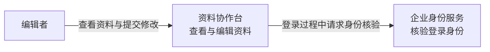
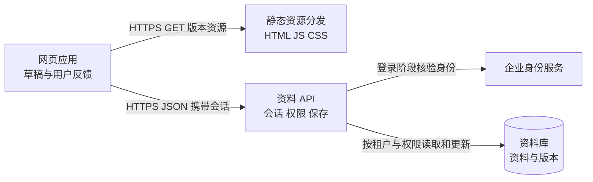
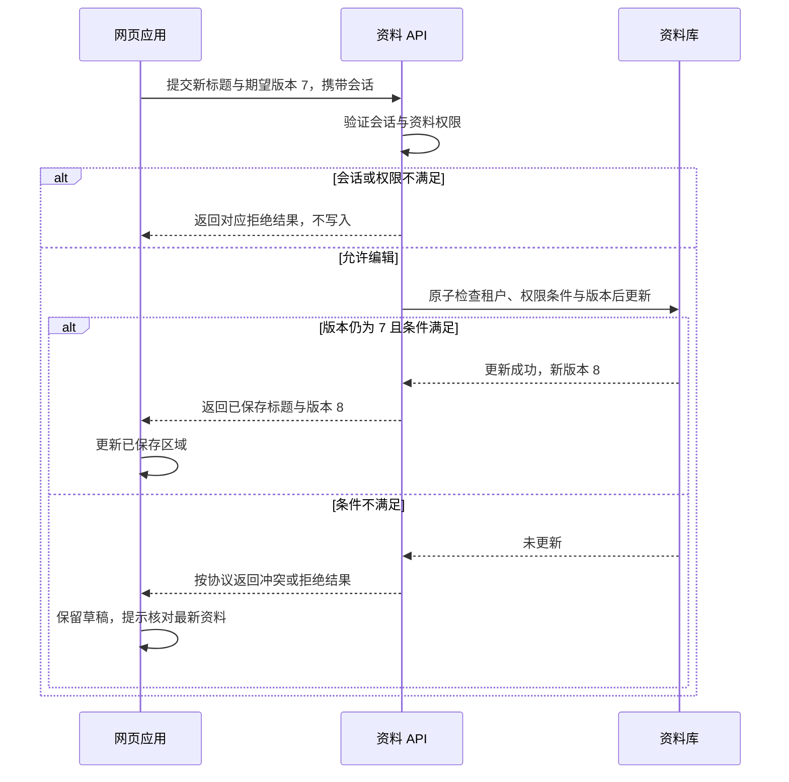

# 职业表达知识点讲义

## CAREER-02 画清系统边界与设计取舍

同事问“保存资料为什么失败”，你给他看一棵 components、hooks、utils 目录树。目录确实存在，却回答不了请求到了哪一层、谁检查权限、哪里真正写入，以及失败后该找谁。

架构表达要把这些关系变得可讨论。这篇围绕一个小型资料协作台，分别画出系统、运行单元和一次保存过程，再用一份 ADR 说明为什么选择当前方案。图可以简洁，但图中的事实要能对上。

### 学习前先确认

本讲没有硬性前置。能区分网页、服务与存储即可开始；C4、信任边界、部署视图和 ADR 都在正文解释。

**以下“资料协作台”、人员职责、版本与方案均为教学设定，不是当前项目的部署现状。** 图使用 Mermaid，可以直接在本站查看，也可复制到支持 Mermaid 的编辑器中。它们借鉴 C4 的分层方法，用普通图形表达，不要求记住某套绘图语法。

### 先确定读者需要作出什么判断

画图前先写一句问题。给新人解释系统，和讨论一次数据库迁移，需要的细节不一样。

| 当前问题 | 首选视角 | 暂时省略什么 |
| --- | --- | --- |
| 谁使用这个系统，它负责什么 | 系统上下文 | 内部路由、类和表结构 |
| 网页、服务与存储怎样协作 | 容器视图 | 每个进程的实例数量 |
| 一次保存会经过哪些检查 | 动态或时序视图 | 不参与这次任务的模块 |
| 某台机器故障会影响哪些功能 | 部署视图 | 与故障域无关的代码组织 |
| 为什么接受这项复杂度 | ADR | 无关的历史争论 |

**模型（model）**是为了回答问题而作的简化，不是把现实全部缩进一张图。省略无关内容可以提高可读性；省略决定结论的边界则会误导。例如讨论授权时不能省掉服务端检查，讨论冗余时不能省掉共同数据库。

同一个系统不必凑齐所有图。先画能支持当前判断的视角；读者确实需要深入时，再增加下一层。

### 用同一份事实清单约束所有图

先给本例建立事实源。后面的图、时序和决定都只能使用这些设定；未知部分不能靠箭头补出来。

| 编号 | 教学设定 | 图上应如何体现 |
| --- | --- | --- |
| A1 | 编辑者在桌面浏览器中查看、修改资料 | 用户与网页应用是不同元素 |
| A2 | 企业身份服务完成登录身份核验；应用服务建立自己的会话 | 外部身份服务与应用职责分开 |
| A3 | CDN 分发带版本标识的 HTML、JS 和 CSS，不处理资料写入 | 静态资源路径与保存路径分开 |
| A4 | 资料 API 验证会话，再按服务端确认的租户和资料权限处理操作 | 浏览器输入不能直接决定授权 |
| A5 | 资料 API 是资料库的唯一写入者 | 不出现浏览器直连数据库的箭头 |
| A6 | 保存携带已读取的资料版本；更新时原子检查版本和权限条件 | 版本冲突不会被静默覆盖 |
| A7 | 前端负责草稿、等待与失败反馈；服务端负责持久化结果 | “页面显示成功”与“数据写入”分开 |
| A8 | 示例部署只有一个资料库故障域；备份、复制与恢复能力尚未给出 | 不宣称已经具备高可用 |

这份清单描述逻辑职责，不是完整的认证协议设计。登录重定向、Cookie 属性和 CSRF 防护需要专门设计；下面的图不把这些尚未展开的细节宣称为已验证。

清单也可以关联真实项目的配置、接口说明、代码位置和负责人。来源失效时，先标出待核对项，再调整图；不要因为一张图已经排得很漂亮，就让实现迁就过期描述。

### 系统上下文先交代人与外部关系

**系统上下文（system context）**把目标系统作为整体，说明谁使用它，以及与哪些外部系统协作。

这里没有画数据库，因为当前问题是系统职责，不是内部存储。企业身份服务确认“登录者是谁”，资料协作台还要决定“这个人能不能修改这条资料”。把后一句省掉，很容易误以为登录成功就拥有所有数据权限。

浏览器是本例使用系统的载体，在这个层次不单独展开。下一张图才进入系统内部。若读者问“浏览器请求到底先经过谁”，就应切换视角，而不是把全部细节挤进上下文图。

### 容器视图展示应用和存储单元

C4 中的 **container** 指应用或数据存储单元，不专指 Docker 容器。一个浏览器应用、一个 API 应用和一个数据库都可以出现在这一层；它们不必分别对应不同仓库。

从图上能问出几个具体问题：CDN 没有写库职责；客户端隐藏保存按钮不会阻止别人直接发请求；API 出现故障时，即使静态页面还能打开，编辑任务仍会失败。

如果需要深入资料 API，可以再用一张小表表达其组件职责：会话解析取得可信身份，权限策略判断资料范围，保存用例协调业务规则，存储适配器执行条件更新。这是 **组件视图（component view）**的入口，不必把每个函数或 React Button 都画成方框。

目录通常按开发便利组织，运行单元按职责和部署组织。自动导出的 import 图适合追踪代码依赖，却不能自动证明服务之间的权限、通信协议或故障隔离。

### 箭头需要说明目的和数据方向

箭头上的“调用”不够支持判断。关系至少要让读者知道谁发起、用什么机制、想完成什么；关键操作还要说明身份与失败结果。

| 模糊关系 | 本例中更具体的关系 |
| --- | --- |
| 前端 → 后端 | 网页以 HTTPS 提交标题和读取时版本，携带应用会话 |
| 后端 → 数据库 | 按服务端确认的租户、资料权限与期望版本执行条件更新 |
| 系统 → 身份服务 | 登录阶段请求身份核验，随后建立应用会话 |
| 保存 → 成功 | 写入确认后返回新标题和版本，网页才更新已保存区域 |

静态图中的单条箭头表示有这种通信关系，不表示只发生一个数据包，也不代表响应方向消失。时序需要精确时，另外画返回箭头。同步等待和异步消息也要区分：把任务放进队列，只说明已经接收，不等于工作完成。

稳定名称能减少误解。静态图写“资料 API”，时序里也用这个名字；不要忽然多出一个没有解释的“Core Service”。图例应说明实线、虚线或颜色的意义，不能让读者猜颜色代表网络还是团队。

### 时序把一次保存的成功与冲突展开

下面从“用户已经登录并读到版本 7”开始。具体认证与读取流程不在这张图中。

关键是把“检查”和“更新”放在有一致性保证的操作中。如果先读版本 7，过一会儿无条件写入，中间仍可能有人已保存版本 8。图不能代替数据库事务设计，但可以把必须保证的条件说清楚。

超时还会产生另一种状态：客户端没收到结果，不代表服务端没写入。客户端不能把所有写操作都无条件重试；需要结合幂等设计或重新读取确认。成功、明确拒绝、结果未知，应当有不同的解释与恢复路径。

### 把信任数据与故障边界逐项说清

**信任边界（trust boundary）**是输入或控制权需要重新判断的地方。最直观的一条就是浏览器到 API：浏览器能显示租户名称，却不能因此成为租户授权的事实源。

例如客户端传来 `tenantId=t2`，服务端必须从可信身份与授权规则判断它能否访问 t2。数据库、缓存 key、后台任务和日志若使用不同租户口径，页面看起来分开，数据仍可能串用。不能只给数据库外框标一句“多租户安全”。

数据边界还包括谁拥有 schema、谁写入、谁读取、缓存何时失效、删除如何传到副本与备份。两个 API 直接修改同一张表，会共享变更风险；画成两个服务并不会消除这种耦合。

故障边界则问：下游失败以后，上游给用户什么结果。身份服务不可用是否影响已建立的会话，要看会话设计；资料 API 不可用时，网页可保留草稿，但不能假装保存成功。重试、限流和降级都有负责作决定的一层。

涉及地域限制时，把主数据、日志、备份、分析数据的流向分别列清，再由实际配置与约束确认。本例没有给出这些部署事实，因此不推断数据驻留或灾难恢复能力。

### 部署视图区分逻辑单元与实际实例

容器图里的一个“资料 API”，可能部署成两个进程；两个进程也可能共用同一台宿主机。这两句话不能互相替代。

| 本例部署记录 | 可以据此判断 | 不能据此判断 |
| --- | --- | --- |
| 同一版本网页文件由 CDN 分发 | 静态资源有独立分发路径 | API 或数据库也有冗余 |
| API 有两个实例，但位于同一节点 | 单进程退出可能由另一个接替，仍须配置验证 | 节点故障后仍可提供服务 |
| 两个 API 连接同一个资料库故障域 | 数据库是共享依赖 | 已具备跨区域恢复 |
| 备份能力未说明 | 需要补充恢复资料 | 数据一定可恢复 |

部署图可把这张表变成节点嵌套，并标注入口、网络、TLS 终止与实例版本。先有可核对的环境清单，再画节点；不要用目标拓扑冒充今天的生产环境。

前端也有运行边界。SSR 或 Nuxt 需要说明哪段代码在服务器运行、哪段在浏览器接管；微前端需要说明谁独立发布、哪些依赖在运行时共享。相关背景可分别连接 [VUE-11](../chinese-guides/vue-11-nuxt-rendering-data-performance.md#vue-11) 与 [ENG-02](../chinese-guides/eng-02-dev-production-environments-assets-cache.md#eng-02)。

### ADR 保存当时的选择和接受的代价

**架构决策记录（architecture decision record，ADR）**解释为什么作出选择。它与图配合：图说明结构，ADR 保存背景、候选、决定及后果。

以下是本例的一份完整简版，所有状态与条件仍属于教学设定。

| 字段 | ADR-01：资料编辑暂不拆成独立微服务 |
| --- | --- |
| 状态 | 已采纳，用于示例版本 v1 |
| 背景 | 一个小团队负责编辑；保存与资料权限需要共同更新；当前没有独立扩缩容证据 |
| 候选 | 资料 API 内按组件隔离；立即拆独立服务；只拆前端目录 |
| 决定 | 在资料 API 内分清权限、保存与存储职责，先保持同一事务边界 |
| 理由 | 减少分布式一致性与部署协调工作；前端目录拆分不解决服务端责任 |
| 接受的代价 | 仍然共同发布，局部负载不能完全独立扩容 |
| 重新讨论的条件 | 出现有测量依据的独立容量需求，或不同团队确需独立发布，并能承担运行责任 |
| 核对方式 | 评审模块边界与条件更新；观察请求、资源和发布耦合，不预先编写收益数字 |

这里没有声称“单体永远更好”。若条件变化，新增 ADR 说明何时替代 ADR-01，旧记录保留。决定状态可以经历提议、采纳、弃用或被替代；不能把早期争议全部改写为今天看起来理所当然的选择。

### 迁移过程也需要可阅读的中间态

假设以后确需独立编辑服务，不能只画最终的两个方框。至少要解释消费者、写入权和回退如何逐步变化。

一种可讨论的顺序是：先把所有写操作集中到原 API 的明确边界；新服务以只读或影子校验方式观察；验证接口与权限一致后，在受控范围切换写入；最后移除旧写入口。这里的顺序是方案示意，实际切换还需解决事务、数据迁移和身份传播。

“旧服务、新服务都可写，之后再对账”不是免费的过渡。双写可能部分成功；切回旧代码也不自动撤销新格式的数据。ADR 要写明进入下一阶段的证据、停止条件、临时组件负责人和移除条件。

事故需要引用当时的架构版本。不能用后来修好的图解释过去的故障，否则旧的共同依赖可能从记录中消失。可继续读 [CAREER-04](../chinese-guides/career-04-incident-response-postmortem-learning.md#career-04)。

### 用运行约束校准图的可信度

部分架构约束可以自动检查，例如浏览器包不得导入服务端配置、模块不得成环、只有指定边界可以调用写入适配器。这类 **fitness function** 把一个明确约束变成可重复观察，不能自动判断整个设计是否合理。

容量数字同样需要依据。假设某串行链有两次各 80 ms 的调用，忽略其他开销时就是约 160 ms；把它们画成并行箭头只会改变图，不会改变实际调用。并行是否安全，还要看输入依赖、资源限制和失败语义。测量应注明样本、环境和版本，项目指标的表达方法见 [CAREER-01](../chinese-guides/career-01-project-evidence-causal-storytelling.md#数字先写口径再计算比例)。

每个运行单元应有人维护接口、发布、告警与恢复，而不只有一个代码 owner。跨团队关系还要有联系入口与变更协商方式；队列、缓存或共享库无人负责时，架构并没有因图画完而完整。

最后让读者拿着图走一次保存与一次失败：能否找到请求、代码、负责人和证据。若需要口头补充关键事实，就将补充写回；若只是无关细节太多，就缩小视角。评审图的方法可以延伸到 [CAREER-05](../chinese-guides/career-05-code-review-risk-communication.md#career-05)。AI 可以整理清单、生成图形初稿，但每个新增服务和箭头仍要核对来源。

### 参考与延伸阅读

核对日期：2026-09-12。本文图形与案例为原创教学设定；不是对当前系统的审计报告。

- [C4：图与层次](https://c4model.com/diagrams)：根据问题选择视角，不必凑齐全部层次。
- [C4：容器](https://c4model.com/abstractions/container)：理解 container 在架构模型中的含义。
- [C4：图形记法](https://c4model.com/diagrams/notation)：检查名称、职责、技术和关系标签。
- [Michael Nygard：记录架构决定](https://cognitect.com/blog/2011/11/15/documenting-architecture-decisions)：理解短小 ADR 的背景、决定、状态与后果。
