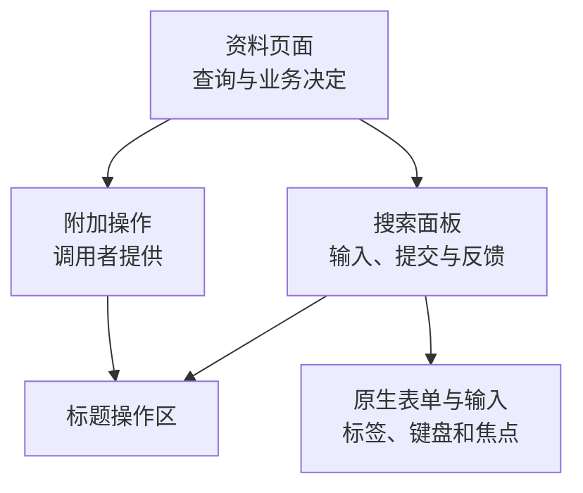

# 一个组件，怎样让调用者少猜一点

## COMP-01 组件职责、API 设计、组合与扩展边界

资料页有一个搜索框，收藏页也有一个。把两段模板搬进同一个文件，很快就能“复用”。但接着问题来了：收藏页只展示别人保存的查询条件，资料页允许重新搜索；有的地方要导出入口，有的地方不要；请求失败时，输入框里的新文字竟然被清空了。

这些问题不主要出在模板长短，而是大家对组件的承诺理解不同。调用者以为它只发出搜索意图，组件却偷偷请求了固定接口；调用者以为只读还能复制，组件却把整个区域禁用了。本讲用资料搜索面板说明：怎样划职责，怎样写清输入、事件与组合点，再怎样让实现兑现这些承诺。React 的 props、Vue 的 props / emits / slots 都可以承载它们；具体语法不会替我们作出设计决定。

### 学习前先确认

- 直接前置：[A11Y-01 WCAG、可访问性测试与治理](../chinese-guides/a11y-01-wcag-testing-governance.md#a11y-01)。本讲会直接使用标签关联、原生键盘操作、只读与禁用、焦点保持和状态播报，不重复建立这些基础。

### 一、用一句用户任务描述组件职责

“用户输入资料关键词，提交查询，并理解当前结果”比“左边带按钮的白盒子”更能帮助划分边界。前一句能说明需要哪些输入与反馈，后一句只描述截图。

先列出会变化的事情：搜索输入的键盘操作、结果为空的提示、服务器地址、登录账号、页面是否显示导出入口。其中，输入与提交反馈适合由面板维持一致；具体数据来源由调用页面协调；导出是调用页面提供的可选动作。若服务器换了地址就得修改公共搜索框，说明边界可能包含了不该包含的依赖。

这不是要求所有组件都“纯展示”。路由页面、领域组件可以取数，也可以依赖明确声明的业务上下文。关键是给职责一个诚实的名字：`MaterialSearchPage` 可以协调资料查询，通用 `SearchPanel` 不应暗中读取某个全局资料仓库。独立展示另一个人的保存条件时，这个隐藏依赖就会暴露。

拆分也有成本。只有三个静态标签的标题区不一定值得独立发布；当它出现稳定的操作、布局和名称责任时，再形成子组件。判断依据是变化和协作关系，不能只数代码行、复用次数或 props 数量。可对照 [React 的组件边界与组合](../chinese-guides/react-02-component-boundaries-data-flow-composition.md#react-02)，把框架中的表达方式接回这些判断。

### 二、把公共契约写成调用者能回答的问题

**组件契约（Component Contract）**是调用者能够依赖的承诺，包含类型，也包含用户实际经历的行为。一个搜索面板的最小契约可以这样写：

| 接口 | 含义 | 必须说清的边界 |
| --- | --- | --- |
| `label` | 输入框的可访问名称 | 必填，真正关联输入，不能只当占位文字 |
| `mode` | 可提交或只读展示 | 只读仍可聚焦、选择与复制；不发搜索意图 |
| `onQuery` | 用户请求按某条件查询 | 不是查询已成功；提交和重试各有来源 |
| `setResult` | 展示调用者交来的结果状态 | 不改写正在输入的文字，不负责请求排序 |
| `actions` | 调用者提供的附加操作 | 放在标题区域，按钮语义与自身行为由提供者负责 |

还要写出没有传值时的行为。空列表表示已查询但没有匹配；未开始查询用单独状态表示。空字符串允许查询全部资料，还是要报输入错误，需要产品规则决定。本讲选择允许查询全部，不能把这个选择说成搜索组件的通用标准。

“输入值”也有多种含义：初始值、持续传入的当前值、最后提交值不是同一个东西。公共 API 必须标明哪个含义；受控、非受控和命令式接口的详细所有权放在 [COMP-02 状态与命令接口](../chinese-guides/comp-02-controlled-uncontrolled-state-imperative.md#comp-02)。本讲先保证调用者不用阅读内部实现，就能知道一次调用会发生什么。

### 三、用明确状态替代相互打架的开关

`isLoading=true`、`hasError=true`、`isEmpty=true` 同时出现时，到底应该显示什么？若三个状态在这个面板中互斥，用三个布尔值就多制造了需要猜测的组合。

下面的 **判别联合（Discriminated Union）**把首次结果展示分成四种状态。它刻意没有表示“旧数据仍在、后台正在刷新”，需要这种能力时，应扩展模型，不能把旧数据偷偷塞进错误字段。

```ts example=comp01-result-state
type SearchResult =
  | { kind: 'idle' }
  | { kind: 'loading'; query: string }
  | { kind: 'ready'; query: string; items: readonly string[] }
  | { kind: 'error'; query: string; message: string };

function describe(result: SearchResult): string {
  switch (result.kind) {
    case 'idle': return '输入关键词后提交查询';
    case 'loading': return `正在查找：${result.query || '全部资料'}`;
    case 'ready': return result.items.length === 0
      ? '本次查询没有匹配资料'
      : `找到 ${result.items.length} 份资料`;
    case 'error': return `查询失败：${result.message}`;
  }
}
console.log(describe({ kind: 'idle' }));
console.log(describe({ kind: 'ready', query: '闭包', items: [] }));
console.log(describe({ kind: 'error', query: '闭包', message: '暂时无法连接' }));
// => 输入关键词后提交查询
// => 本次查询没有匹配资料
// => 查询失败：暂时无法连接
```

输出依次是“输入关键词后提交查询”“本次查询没有匹配资料”“查询失败：暂时无法连接”。空结果不是错误，也不应该显示成尚未开始。

若页面要保留上一轮结果并显示刷新进度，参考 [DATA-01 查询视图状态](../chinese-guides/data-01-server-state-cache-keys-invalidation-deduplication.md#二有旧数据和正在请求可以同时成立)，把数据可用性与请求进度分开。类型帮助约束内部调用，不能替代外部 JSON 校验，更不能证明焦点、键盘或服务端授权正确。

### 四、事件先说清意图，再说清载荷

`onQuery` 表示“用户希望查询”，`onLoaded` 才可能表示“某次加载已经完成”。把它们都命名成 `onChange`，调用者很难判断应该发请求、写地址栏，还是仅记录展示结果。

输出载荷应提供稳定的业务信息，而不是要求调用者从内部 DOM 结构中寻找输入值。浏览器事件可以作为补充上下文，但不要成为唯一取值方式。下面先把输入转换成一个可独立阅读的意图：

```js example=comp01-query-intent
function queryIntent(raw, source) {
  if (typeof raw !== 'string' || !['submit', 'retry'].includes(source)) {
    throw new TypeError('需要字符串关键词和明确的提交来源');
  }
  return Object.freeze({ query: raw.trim(), source });
}
const input = { value: '  闭包  ' };
const intent = queryIntent(input.value, 'submit');
input.value = '缓存';
console.log(intent.query, intent.source);
console.log(queryIntent('', 'retry').query === '');
// => 闭包 submit
// => true
```

输出为 `闭包 submit` 和 `true`。意图保留当时提交的关键词，之后继续打字不会让已经发出的请求变成另一个查询。这里仅按本产品规则去掉首尾空白，没有擅自合并中间空格、改大小写或替换语言。

文档还要说明事件次数和时机。本讲示例一次表单提交发出一次意图；点击附加说明按钮不发意图；重试使用上次提交值，而不是用户正在编辑的新文字。调用者负责决定请求是否去重，以及迟到结果是否仍属于当前查询。表单保存中的同类问题可接着看 [BIZ-05 提交快照](../chinese-guides/biz-05-form-table-detail-state-consistency.md#四发送快照冻结以后新输入属于下一次提交)。

### 五、组合点承载差异，也分配责任

**组合（Composition）**让调用者把一段内容放在明确位置。例如标题区域接受一个“查看导出说明”按钮，公共搜索面板无需理解导出任务、文件下载和权限申请。



有三个条件开关不一定就是坏设计。如果它们确实是独立、合法的能力，布尔值可以非常清楚。问题出在 `isAdmin`、`showExport`、`disableExport` 等参数重复表达同一决定，或者组合后出现谁也解释不了的状态。可以将业务决定留在页面，再用一个明确操作区表达差异。

组合点也需要合同：允许放按钮还是任意内容，何处换行，谁提供可访问名称，是否进入复合控件的键盘导航。React children / render prop 与 Vue slot 都只是表达手段。菜单项、选项卡面板等结构有额外语义约束，不能因为有 slot 就允许任意替换角色。

组件没有能力阻止恶意调用者通过自定义内容发请求。隐藏入口、只读模式和 slots 都不是授权边界，真正的执行许可仍由服务端检查。沿 [BIZ-03 服务端权限执行](../chinese-guides/biz-03-rbac-abac-data-permissions.md#五策略决定之后还要有人真正执行拒绝) 继续理解这个区别。

### 六、默认值和语义变体会影响真实操作

**语义变体（Semantic Variant）**描述使用意图，例如强调操作、次要操作、危险操作。它可以约束颜色、文字层次和交互反馈，但不能代替业务流程。一个删除操作是否需要二次确认、撤销窗口或立即执行，要看误操作代价与恢复能力，不能只由按钮是红色决定。

导航到另一页使用链接，执行当前操作使用按钮。它们可以共享视觉 token，但应保留各自的键盘、打开方式和名称语义。不要看到传了 `onClick` 就偷偷把链接变成按钮，也不要让用户只能从颜色猜出操作后果。

原生按钮在表单中的默认行为尤其容易造成事故。公共非提交按钮宜显式使用 `type="button"`；真正的提交按钮明确使用 `type="submit"`。在表单内放一个“帮助”按钮时，点击帮助不应该顺便触发保存。

只读与禁用也不同：文本输入的 `readonly` 通常仍可获得焦点、选择和复制；`disabled` 控件通常不能聚焦，并且不参加表单提交。`aria-disabled` 只表达状态，不会自动拦截点击、键盘或请求。本讲示例既给输入设置 `readOnly`，也在提交路径检查模式，才兑现“只读面板不发查询意图”。这些都是 UI 行为，服务端仍须独立授权。

### 七、更新结果时，把输入和焦点留给用户

查询完成后整个面板重新创建，视觉上也许没有区别，正在输入的人却会失去焦点、光标或未提交文字。组件应尽量更新需要变化的区域，稳定保留输入节点；框架中同样要避免不必要地改变组件身份或 key。

结果提示应能被程序识别。本讲使用预先存在的 `role="status"` 区域公布结果数量和错误提示，输入通过 label 获得名称。不要把整张结果列表塞进强制播报区，也不要每次一个字的变化都通知读屏用户。自动检查能够确认角色和关联存在，实际播报是否清楚仍需相应辅助技术验证。

焦点移动要跟着任务走。普通查询完成不必强行聚焦结果标题；用户原本在输入框时保持当前位置更自然。若用户点击重试，而重试按钮随后消失，就需要给焦点安排稳定去处。本讲示例在这种情况下回到输入框，避免焦点掉到页面根部。浮层、菜单和对话框有更完整的焦点规则，不能直接复制搜索面板的策略。

错误也不能抹掉上下文。用户提交“闭包”后继续输入“缓存”，上一次查询失败时，错误属于“闭包”，新文字仍应是“缓存”。重试旧查询和提交新查询是两个明确动作，恢复机制不能悄悄替用户选一个。

### 八、把后端形状转换成组件需要的模型

假设接口返回 `material_id`、`display_title`、`permission_codes` 与分页 token，列表只需要稳定 ID 和可阅读标题。页面适配层先校验必要字段，再交给视图模型。这样接口把标题字段迁移时，不必让所有公共卡片同步理解迁移规则。

组件模型也不应只是另一份含糊 DTO。需要稳定 ID 的可选择列表，应明确项身份；纯文本演示可以只接收字符串，但不能据此声称支持跨页选中、拖动排序和实体更新。一个列表索引不自动等于业务对象身份。

取数、权限与视图适配可以相邻协作，但责任不同：接口确认数据，策略决定可见能力，组件正确展示已给定的能力与反馈。查询状态可来自查询库，公共组件不必把具体库的整个对象当唯一 props。相应模型边界见 [BIZ-04 API 与前端模型](../chinese-guides/biz-04-api-contract-dto-frontend-model.md#biz-04)。

结果先来后到的正确性也要指定负责人。本讲 `setResult` 信任调用者已确认结果归属；换成异步请求时，页面需要按查询键或代次丢弃陈旧结果。组件只保证更新结果时不清空输入，不因此获得网络竞态保护。失败回滚与未确认写入另见 [DATA-02 恢复中的用户反馈](../chinese-guides/data-02-optimistic-updates-conflicts-offline-mutations.md#十一失败恢复首先保护用户理解)。

### 九、样式开放到哪里，就要维护到哪里

公共组件并不需要禁止 `className`、根节点样式或 CSS 变量。父页面需要决定区域宽度、外边距与栅格位置，这是合理的布局协作。组件负责内部间距、控件对齐和内容收缩，避免要求页面去定位第三个子节点。

风险来自没有声明的结构依赖：调用者写下 `.panel > div:nth-child(2) button` 后，内部多加一个说明区域就可能改变布局。若确实需要稳定定制，应公开根节点类、有限 token 或具名 part，并说明兼容范围。公开 part 以后改名，也是 API 变更。

一个搜索面板可以允许 `--panel-accent` 调整强调色，但调用者仍需维持文字对比和可见焦点。样式 API 不是绕过可访问性责任的免责条款。本项目主要面向桌面，优先检查常见桌面宽度、页面放大、长中文标题、键盘焦点与多个实例并列；无需为此扩展一整套移动端适配。

**逃生口（Escape Hatch）**用于少数确有需要的扩展。先考虑组合与具名样式入口，再考虑暴露命令或渲染细节。若多个调用者都要钻进内部改同一个节点，应调查公共 API 是否缺能力；一个非常特殊的页面，也可以在基础控件上做专用组合。已经公开的逃生口同样需要迁移承诺，不能因为名字叫“高级”就随时删除。

### 十、用两个实例观察同一份契约

保存为 `component-lab.html`，用桌面浏览器直接打开，不需要安装依赖。左侧可搜索，右侧只读；附加按钮由页面提供。输入 `闭包` 后按 Enter，再试 `不存在`、模拟失败与重试，观察事件记录和焦点。此页使用固定内存数据，没有网络请求、持久化或真实授权。

```html example=comp01-component-lab runtime=project file=component-lab.html
<!doctype html>
<html lang="zh-CN">
<head><meta charset="utf-8"><meta name="viewport" content="width=device-width, initial-scale=1">
<title>组件契约观察页</title>
<style>
:root{font-family:system-ui,sans-serif;color:#193c30;background:#f1f5f2;line-height:1.65}*{box-sizing:border-box}
body{margin:0}main{max-width:1180px;margin:44px auto;padding:0 28px}h1{font-size:32px;margin:8px 0}h2{font-size:19px;margin:0}
.kicker{color:#507566;letter-spacing:.14em;font-size:13px}.muted{color:#526b61}.grid{display:grid;grid-template-columns:1fr 1fr;gap:22px;margin:28px 0}
.panel,.evidence{min-width:0;border:1px solid #ceddd4;border-radius:18px;background:white;padding:24px}.panel header{display:flex;gap:12px;justify-content:space-between;align-items:start}
form{margin-top:22px}label{display:block;font-weight:650;margin-bottom:8px}.field{display:flex;gap:10px}input{min-width:0;flex:1;width:100%;font:inherit;padding:10px 12px;border:1px solid #8ca89a;border-radius:9px;color:inherit}input[readonly]{background:#f0f3f1}
button{font:inherit;cursor:pointer;border:1px solid #92ac9e;border-radius:9px;background:white;color:#214d3b;padding:9px 14px}.primary{background:#205d46;color:white;border-color:#205d46}button:hover{filter:brightness(.95)}:focus-visible{outline:3px solid #c16b18;outline-offset:3px}
.status{min-height:3.4em;margin:18px 0 10px}.results{padding-left:22px;min-height:90px}.results li{padding:5px;overflow-wrap:anywhere}[hidden]{display:none!important}.tools{display:flex;gap:12px;flex-wrap:wrap}.evidence ol{font-family:ui-monospace,monospace;padding-left:26px;overflow-wrap:anywhere}
</style></head>
<body><main><div class="kicker">COMPONENT CONTRACT / 桌面观察</div><h1>同一组件，两个明确的用途</h1>
<p class="muted">左侧提交查询；右侧保留可选择的只读条件。更新结果时，输入节点和未提交文字保持原样。</p>
<div class="grid"><div id="editable"></div><div id="readonly"></div></div>
<section class="evidence"><h2>调用页面的观察记录</h2><p class="muted">先提交一次查询，再模拟失败；修改输入后点击重试，可以核对重试的是哪一次条件。</p>
<div class="tools"><button id="fail" type="button">模拟上次查询失败</button><button id="refresh" type="button">重新展示结果</button></div>
<ol id="events" aria-label="查询意图记录"></ol><p id="action-note" role="status"></p></section></main>
<script>
function createSearchPanel({id, label, mode = 'editable', initialQuery = '', onQuery, actions}) {
  if (!/^[a-z][a-z0-9-]*$/.test(id) || !label?.trim() || !['editable', 'readonly'].includes(mode)) throw new TypeError('需要稳定 ID、名称与合法模式');
  if (mode === 'editable' && typeof onQuery !== 'function') throw new TypeError('可提交模式需要 onQuery');
  const root = document.createElement('section'); root.className = 'panel';
  const header = document.createElement('header'); const heading = document.createElement('h2');
  heading.id = id + '-heading'; heading.textContent = mode === 'editable' ? '资料查询' : '保存的查询条件';
  root.setAttribute('aria-labelledby', heading.id); header.append(heading); if (actions) header.append(actions);
  const form = document.createElement('form'); const labelNode = document.createElement('label');
  const input = document.createElement('input'); input.id = id + '-query'; input.type = 'search'; input.value = initialQuery; input.readOnly = mode === 'readonly'; labelNode.htmlFor = input.id; labelNode.textContent = label;
  const field = document.createElement('div'); field.className = 'field'; field.append(input);
  if (mode === 'editable') { const submit = document.createElement('button'); submit.type = 'submit'; submit.className = 'primary'; submit.textContent = '查询'; field.append(submit); }
  const help = document.createElement('p'); help.id = id + '-help'; help.className = 'muted'; help.textContent = mode === 'readonly' ? '可以选择与复制，不能在此修改或提交。' : 'Enter 提交；空关键词查询全部资料。'; input.setAttribute('aria-describedby', help.id);
  const status = document.createElement('p'); status.className = 'status'; status.setAttribute('role', 'status');
  const list = document.createElement('ul'); list.className = 'results'; list.setAttribute('aria-label', '查询结果');
  const retry = document.createElement('button'); retry.type = 'button'; retry.textContent = '重试上次查询'; retry.hidden = true;
  form.append(labelNode, field, help); root.append(header, form, status, list, retry);
  let lastSubmitted = null;
  function emit(query, source) {
    if (mode === 'readonly') return;
    lastSubmitted = query; onQuery(Object.freeze({query, source}));
  }
  form.addEventListener('submit', event => { event.preventDefault(); emit(input.value.trim(), 'submit'); });
  retry.addEventListener('click', () => { if (lastSubmitted !== null) emit(lastSubmitted, 'retry'); });
  function setResult(result) {
    if (!['idle', 'loading', 'ready', 'error'].includes(result.kind)) throw new TypeError('未知结果状态');
    const retryHadFocus = document.activeElement === retry;
    const rows = result.kind === 'ready' ? result.items : [];
    list.replaceChildren(...rows.map(title => { const item = document.createElement('li'); item.textContent = title; return item; }));
    const queryName = result.query || '全部资料';
    status.textContent = result.kind === 'idle' ? '输入关键词后提交查询' : result.kind === 'loading' ? '正在查询：' + queryName : result.kind === 'error' ? '“' + queryName + '”查询失败：' + result.message : rows.length ? '“' + queryName + '”找到 ' + rows.length + ' 份资料' : '“' + queryName + '”没有匹配资料';
    retry.hidden = !(mode === 'editable' && result.kind === 'error' && lastSubmitted !== null);
    if (retryHadFocus && retry.hidden) input.focus();
  }
  setResult({kind:'idle'});
  return {element:root, setResult};
}
const materials = ['闭包与作用域', '查询缓存的身份', '组件公共契约'];
const eventList = document.querySelector('#events'); let current = '';
function record(text) { const row = document.createElement('li'); row.textContent = text; eventList.append(row); while(eventList.children.length > 10) eventList.firstElementChild.remove(); }
function show(query) { editable.setResult({kind:'ready', query, items:materials.filter(title => title.includes(query))}); }
const action = document.createElement('button'); action.type = 'button'; action.textContent = '查看导出说明';
action.addEventListener('click', () => { document.querySelector('#action-note').textContent = '导出由调用页面负责；这里仅展示组合入口。'; });
const editable = createSearchPanel({id:'material', label:'资料关键词', actions:action, onQuery:intent => { current = intent.query; record(JSON.stringify(intent)); show(current); }});
const readonly = createSearchPanel({id:'saved', label:'已保存的关键词', mode:'readonly', initialQuery:'闭包'});
document.querySelector('#editable').append(editable.element); document.querySelector('#readonly').append(readonly.element);
show(''); readonly.setResult({kind:'ready', query:'闭包', items:['闭包与作用域']});
document.querySelector('#fail').addEventListener('click', () => editable.setResult({kind:'error', query:current, message:'暂时无法连接，请保留输入后重试'}));
document.querySelector('#refresh').addEventListener('click', () => show(current));
</script></body></html>
```

先用键盘把焦点移到“资料关键词”，输入 `  闭包  ` 并按 Enter。记录里应出现 `{"query":"闭包","source":"submit"}`，输入框里的原文字仍保留。点击“查看导出说明”不增加查询记录，右侧只读输入能够被聚焦并选择，但按 Enter 不产生查询意图。

接着模拟失败，把输入改成 `缓存`，点击“重试上次查询”。记录中的 query 仍为“闭包”、source 为 `retry`；新输入仍是“缓存”。重试按钮消失后焦点回到稳定输入。只有再次提交，才查询“缓存”。如果尚未提交就模拟失败，示例没有“上次提交”，因此不展示重试入口。

这是一个用原生 DOM 解释契约的完整例子，不是 React / Vue 组件库实现。调用者必须提供不同实例的唯一 ID，每个实例独立创建附加节点；复用同一个 DOM 节点会把它从原位置移走。`setResult` 的输入在本例中由可信的本地调用者构造，不能直接把未经校验的服务器响应传进来。异步竞态、数据缓存、取消和组件销毁后的资源释放，需要在引入实际请求时补上对应边界。

### 十一、验证用户承诺，不把内部结构写成合同

挑少量能揭示错误的场景，就能检验本讲的主要承诺：Enter 是否只发一次含正确条件的意图；只读能否复制且不提交；附加动作是否独立；空与失败是否不同；更新结果是否保留输入；两实例的 label 是否各自指向自己的 input。

优先按角色、名称和可观察事件检查。内部包裹元素多一层，行为相同，通常不应该使测试失败。相反，截图看起来一样但把 label 改成普通 span、按钮少了 type、重试读取了新输入，都应当被这些场景发现。更多组件验证方法可接 [TEST-02 组件交互测试](../chinese-guides/test-02-component-testing-user-behavior-accessibility.md#test-02)。

不用为所有样式参数做组合穷举。风险较高的公共基础行为值得稳定检查；局部文案和可逆排版变化可以通过重点阅读确认。浏览器能确认焦点、DOM 关联与实际事件，不能凭这些自动宣称所有辅助技术和所有浏览器都已兼容。

### 十二、让文档和迁移跟上真实用法

一份可用的组件文档应让读者从最小正确示例出发，看到合法状态、错误恢复、只读、组合、样式入口和多实例，再找到高级选择。只列 props 类型表，会遗漏“失败后保留什么”“事件代表意图还是结果”这些最影响使用的问题。

新增可选参数可能兼容，改变默认提交行为、事件触发次数、只读焦点规则或公开 part 名称则可能破坏调用者。版本号只是通知；迁移说明还应列出受影响行为、替代用法和支持期限。先盘点实际调用点，验证代表性页面，再移除旧入口；不要无限期保留两套含义冲突的 API。

如果许多页面都包了一层才能使用，先了解包装层解决的任务。反复补同一条语义可进入公共契约；少数领域特有流程则可以留在领域组件。组件数量和采用率都不能单独证明设计质量，应该结合调用时的歧义、恢复是否丢输入、键盘是否可用、升级是否可预测来判断。

跨框架真正适合共用的是这些职责、状态说明、设计 token 和行为约定。是否共享运行时代码、采用 Web Components 或分别维护 React / Vue 版本，是另一个工程决定。先让两个实现兑现同一份用户承诺，再讨论形式上的统一。

### 动手想一想

1. 页面想在搜索框旁放“下载报表”，应该增加 `isAdmin` 参数，还是组合一个由页面决定是否提供的动作？谁最终检查下载权限？
2. 用户提交“闭包”后继续输入“缓存”，旧查询失败。错误文案、输入值和重试条件各是什么？把三者分别写出来。
3. 组件原来用 button，重构后改成能点击的 div。截图不变，哪些承诺需要重新验证？
4. 调用页面需要调整根节点宽度，与依赖内部第三个 div 的选择器有什么区别？准备公开哪个稳定入口？

第一题不是要求永远使用 slot，而是把页面能力判断、组合责任和服务端执行分开。第二题的答案分别是“闭包查询失败”“缓存”“闭包”。第三题应想到原生语义、焦点、Enter / Space 与可访问名称，不能只补一个点击回调。第四题应区分外部布局协作与对未公开内部结构的依赖。

### 参考与延伸阅读

- [React：Thinking in React](https://zh-hans.react.dev/learn/thinking-in-react)：从可见任务、组件层级与数据关系思考边界。
- [React：Passing Props to a Component](https://react.dev/learn/passing-props-to-a-component)：输入与嵌套内容在 React 中的表达方式。
- [Vue：Slots](https://vuejs.org/guide/components/slots.html)：在 Vue 中声明组合位置和上下文。
- [WAI-ARIA APG：Button Pattern](https://www.w3.org/WAI/ARIA/apg/patterns/button/)：按钮的角色、名称和键盘约定；优先使用原生元素。
- [MDN：readonly](https://developer.mozilla.org/en-US/docs/Web/HTML/Reference/Attributes/readonly)：确认只读适用控件、焦点与禁用之间的区别。
