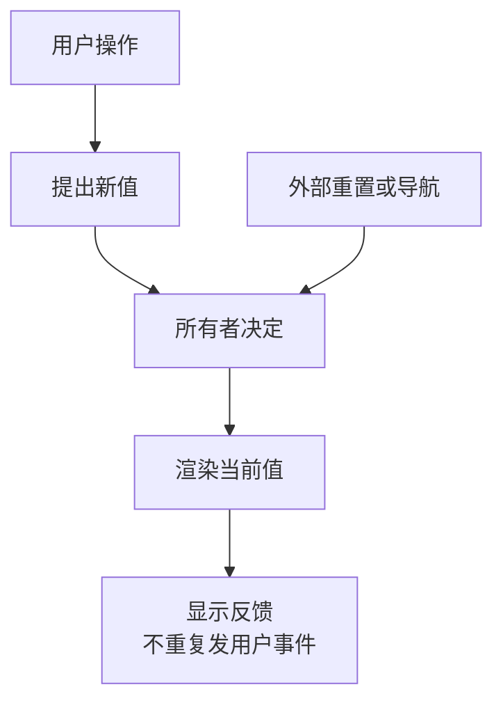

# 输入明明改了，为什么又跳回原来的值

## COMP-02 受控、非受控、状态同步与命令式能力

标签编辑器最初显示“基础”。用户改成“进阶”，页面闪了一下，又变回“基础”；点清空后，旧默认值再次出现；保存请求晚到，还把刚输入的“实践”覆盖了。这几种问题常有同一个起点：没有分清谁决定当前值，谁只是提出改变，谁保存的是过去的快照。

本讲接着组件公共契约，讨论值如何在父组件、子组件、表单、URL 和异步结果之间流动。先建立所有权，再看 React 与 Vue 的实现映射，最后用可直接打开的观察页亲手重现接受、拒绝、重置和迟到响应。

### 学习前先确认

- 直接前置：[COMP-01 组件职责与公共契约](../chinese-guides/comp-01-component-responsibility-api-composition.md#comp-01)。本讲沿用输入、事件、组合、键盘语义和焦点责任，深入其中的状态所有权。

### 一、先列出有哪些值，再分别指定所有者

**Single Source of Truth** 指同一份事实在当前时刻有一个明确的决定者，不是把整个页面的所有状态都塞进同一个 store。一个组件可以同时拥有好几种不同状态，各有自己的职责。

| 搜索选择器中的状态 | 可能的所有者 | 原因 |
| --- | --- | --- |
| 已选资料 ID | 父表单 | 需要与其他字段一起提交、撤销 |
| 搜索框里尚未提交的文字 | 组件或页面草稿 | 服务于当前输入过程 |
| 键盘高亮的候选项 | 组件 | 需要协调方向键与焦点 |
| 服务端确认的选择 | 远端结果及其缓存 | 与未提交选择有不同生命周期 |
| 已选数量 | 从已选 ID 计算 | 无需另存一份可写数字 |

两个面板必须同步选中项时，把选择交给最近的共同所有者；它们的焦点仍可以独立。组件拆分以后，并不意味着每个子组件都应复制一份选择数组，再互相监听。

这里的“一个决定者”针对的是某份值。草稿与确认值是两份不同事实，可以分别拥有；把它们都叫 `value` 才容易误以为存在一个神奇的最后写入者。可回看 [DATA-01 状态归属](../chinese-guides/data-01-server-state-cache-keys-invalidation-deduplication.md#一先问谁拥有事实再决定状态放在哪里)，区分远端副本与用户工作。

### 二、受控表示持续提供当前值

**受控组件（Controlled Component）**从调用者接收当前值，用户操作时发出改变意图，调用者决定下一次传入什么。发出事件与接受变化是两步。

```js example=comp02-owner-decision
let value = ['基础'];
const requests = [];
function request(next, allowed) {
  requests.push([...next]);
  if (allowed) value = [...next];
}
request(['进阶'], false);
console.log(value.join('、'), requests.length);
request(['实践'], true);
console.log(value.join('、'), requests.length);
value = []; // 外部重置是所有者的更新，不是新的用户请求。
console.log(value.length, requests.length);
// => 基础 1
// => 实践 2
// => 0 2
```

拒绝第一条请求时，确认值仍是“基础”；接受第二条后才变为“实践”；外部重置没有凭空制造第三条用户事件。这个同步模型解释所有权，不模拟某个框架的 DOM 提交时机。

连续文本输入要特别小心。React 原生受控 input 的 `onChange` 应同步更新其背后的输入值；把这次本地更新推迟到服务器验证后，会使输入回退或光标异常。需要异步确认时，可以让父级及时拥有输入草稿，另存验证状态或已提交值。父级“拥有草稿”并不要求服务器批准每个字符。[React input](https://react.dev/reference/react-dom/components/input)

### 三、非受控表示初值之后由实例管理

**非受控组件（Uncontrolled Component）**从初始参数建立自己的值，后续编辑由实例管理。对本文的自定义标签 API，`defaultTags` 只在创建实例时读取；后来收到不同默认值不会自动覆盖已经输入的标签。

例如初值是 `['基础']`，用户改成 `['进阶']`，后台又交来初值 `['实践']`。按这个合同，当前编辑仍是“进阶”。如果调用者真正想让当前值变成“实践”，应走明确的重置或换对象流程，而不是把默认值假装成持续同步值。

这条规则需要针对 API 说明，不能推导成“所有平台上的 default 属性以后绝对不起作用”。原生输入有当前 value、默认 value 与表单 reset 的关系；改变 DOM `defaultValue` 还可能改变之后的重置基准。React 的默认输入参数与自定义组件的重置合同也不是同一层。

非受控适合独立局部编辑、父级仅在提交时读取的场景。它同样可以通知外部观察变化，也需要标签、错误关联和表单适配。区别在谁决定下一次显示值，不在有没有回调。

### 四、把模式写进类型，也写进生命周期

组件同时收到 `value` 和 `defaultValue` 时，不应让调用者猜哪个优先。下面用判别联合表达两种互斥配置：

```ts example=comp02-mode-contract
type Options =
  | { mode: 'controlled'; value: readonly string[]; onChange: (next: readonly string[]) => void; defaultValue?: never }
  | { mode: 'uncontrolled'; defaultValue?: readonly string[]; value?: never; onChange?: (next: readonly string[]) => void };
function initial(options: Options): string[] {
  return [...(options.mode === 'controlled' ? options.value : options.defaultValue ?? [])];
}
console.log(initial({ mode: 'controlled', value: ['基础'], onChange() {} }).join('、'));
console.log(initial({ mode: 'uncontrolled' }).length);
// @ts-expect-error 两种值来源不能同时提供。
const invalid: Options = { mode: 'uncontrolled', value: ['冲突'] };
void invalid;
// => 基础
// => 0
```

此函数只负责读取初始配置；不能拿返回的数组长期替代受控模式下的最新 value。类型也无法阻止运行时外部数据和后续 prop 变化，实际组件应校验首次模式并拒绝未定义的切换。

同一实例从非受控切到受控，相当于换决定者。最容易维护的公共合同是生命周期内不切换；确有需要时，明确保留哪份值、何时结束旧编辑、如何恢复焦点。通过新 key 重建可以重置实例，也会丢失原有局部状态，不能当没有代价的修复按钮。

空数组不是缺省，空字符串也不是没有传值。用 `value || defaultValue` 判断会错误地复活默认值；业务允许 `undefined` 时，更应通过明确 mode 或合同约定的属性存在性区分模式。

### 五、外部更新进入组件，不应自动变成回声

用户点选会产生意图；父级传来新值则是这个意图的结果或其他外部决定。子组件不应在接收新 prop 后再次发出同名用户 change，否则一次修改可能引发重复请求，甚至无限来回。



有些组件需要通知“程序设置完成”，可以设计另一种来源明确的事件；不能让它与用户提交共用含糊的回调，再让父级猜是否应该保存。

也要区分输入、提交、失焦与校验。中文输入法组合过程中不宜每个临时片段都执行破坏性格式化；需要等待组合完成或提交再规范化。光标、选区和输入草稿都是交互责任，不能靠偷偷忽略外部值维持表面顺滑。

### 六、草稿可以与来源不同，但必须知道为什么

如果用户正在编辑资料 A，服务器推送了 A 的新版本，不能只写一个“props 改了就覆盖 state”的监听。先看当前草稿是否有未保存变化，再决定直接采用、展示冲突还是允许用户放弃草稿。

可以把状态命名为 `source`、`sourceVersion`、`draft` 和 `editRevision`。前两项描述编辑依据，draft 是当前输入，最后一项描述本地编辑代次。它们不是重复存储同一事实，而是记录不同时间的事实。

纯派生值则不需要独立可写状态：已选数量、筛选结果、同步格式规则可从现有值计算。计算缓存属于性能手段，丢弃后应能重新算出同样结果。异步业务验证不同，需要记录验证的输入快照及待确认状态。

复杂表单的基线与提交快照见 [BIZ-05](../chinese-guides/biz-05-form-table-detail-state-consistency.md#四发送快照冻结以后新输入属于下一次提交)。这里关心组件如何表达归属，不能仅因文案显示“已保存”就清空用户后来的输入。

### 七、重置和迟到响应都要验证归属

“重置”可能是回到初次打开的值、清空、采用服务端最新值或切换另一条资料。把具体动作写出来，调用者才知道会丢掉什么。本讲观察页的“清空当前值”由父级执行，并使旧保存观察失效。

```js example=comp02-save-snapshot
let state = { entity: 'm1', epoch: 1, revision: 0, draft: '基础', confirmed: '基础', phase: 'idle' };
let active = null;
function begin(id) {
  active = { id, entity: state.entity, epoch: state.epoch, revision: state.revision, draft: state.draft };
  state.phase = 'pending'; return active;
}
function finish(request, ok) {
  if (active?.id !== request.id || request.entity !== state.entity || request.epoch !== state.epoch) return '忽略旧观察';
  active = null; state.phase = ok ? 'saved' : 'error';
  if (ok) state.confirmed = request.draft;
  return state.revision === request.revision ? '本次输入已有结果' : '已有新输入，继续保留';
}
const first = begin('save-1');
state.draft = '进阶'; state.revision += 1;
console.log(finish(first, true), state.draft, state.confirmed);
const second = begin('save-2');
state.epoch += 1; state.draft = ''; state.revision += 1; state.phase = 'idle'; active = null;
console.log(finish(second, false), state.draft === '', state.phase);
// => 已有新输入，继续保留 进阶 基础
// => 忽略旧观察 true idle
```

第一笔成功确认的是“基础”，不能证明后来输入的“进阶”已经保存。第二笔在重置之后失败，也不能把错误重新挂到新的编辑会话上。模型只有一笔当前观察，不实现服务端并发合并；忽略回调也不撤销已经发生的远端写入。

真实异步流程应对成功、失败和 finally 都检查归属。取消用于减少资源浪费，代次检查保护仍可能到达的回调。具体写入结果未知时的恢复见 [DATA-02](../chinese-guides/data-02-optimistic-updates-conflicts-offline-mutations.md#四没有收到成功不等于操作已经失败)。

### 八、句柄暴露能力，不把内部都交出去

**命令式句柄（Imperative Handle）**用于 focus、滚动到某处等瞬时操作。调用者需要把焦点移到标签输入，可以公开 `focus()`；通常无需同时获得内部 input、可写数组和验证器实例。

值仍通过声明式输入和事件流动。若父级按顺序调用 `setInternalValue()`、`clearError()`、`rerender()` 才能使用组件，接口已经迫使外部协调实现细节。先考虑一个明确的状态更新能否表达任务。

句柄也要说明尚未挂载、已经卸载、disabled、重复调用时会怎样。返回 `false` 表示当前不能聚焦，比假装一定成功更可解释；多实例各自保留句柄，避免模块变量永远指向最后一个组件。

React 可以通过 `useImperativeHandle` 限定暴露内容；React 19 可将 ref 作为 prop，旧版本常用 forwardRef。Vue 可通过模板 ref 和 `defineExpose` 公开必要能力。版本语法要核对项目实际依赖，不能把一种写法冒充跨版本通用实现。[React 句柄文档](https://react.dev/reference/react/useImperativeHandle)

### 九、用观察页区分当前值与保存快照

将完整代码保存为 `ownership-lab.html`，用桌面浏览器打开。左侧由父级决定值，右侧由局部实例管理。保存结果使用手动交付按钮，便于稳定观察顺序；页面没有网络请求，也不写真实学习记录。

```html example=comp02-ownership-lab runtime=project file=ownership-lab.html
<!doctype html><html lang="zh-CN"><meta charset="utf-8"><title>状态所有权观察页</title>
<style>
:root{font:16px/1.7 system-ui,sans-serif;color:#213e39;background:#edf3ef}*{box-sizing:border-box}main{max-width:1120px;margin:40px auto;padding:0 24px}h1{font-size:32px}.grid{display:grid;grid-template-columns:1fr 1fr;gap:20px}section{background:white;border:1px solid #cfddd5;border-radius:16px;padding:24px;margin:18px 0;min-width:0}h2{font-size:20px;margin-top:0}label{display:block}input,button{font:inherit;border:1px solid #91a99e;border-radius:8px;padding:9px 12px}input[type=text]{width:100%;margin:8px 0}button{background:#f6faf7;color:#234e40;cursor:pointer;margin:8px 6px 4px 0}:focus-visible{outline:3px solid #b66f1b;outline-offset:3px}.muted{color:#597066}output{font-weight:650;overflow-wrap:anywhere}#status{min-height:3em}li{overflow-wrap:anywhere}
</style><main><p class="muted">B23 / 当前值 · 编辑代次 · 保存快照</p><h1>这一次变化，谁来决定</h1>
<div class="grid"><section><h2>父级持续提供值</h2><label for="owned">资料标签</label><input id="owned" type="text" value="基础"><label><input id="accept" type="checkbox" checked> 父级接受用户修改</label><p>父级当前值：<output id="owner-value"></output></p><button id="reset" type="button">清空当前值</button><button id="focus" type="button">聚焦标签输入</button></section>
<section><h2>局部实例管理值</h2><label for="local">局部标签</label><input id="local" type="text"><p>下一次初始化参数：<output id="initial"></output></p><button id="change-default" type="button">将初始参数改为进阶</button><button id="recreate" type="button">按当前参数重新初始化</button><p class="muted">改变初始参数不会覆盖当前编辑；重新初始化会明确放弃当前值。</p></section></div>
<section><h2>观察保存结果</h2><button id="save" type="button">提交当前快照</button><button id="success" type="button">交付成功结果</button><button id="failure" type="button">交付失败结果</button><p id="status" role="status"></p><p>最近确认内容：<output id="confirmed"></output></p><ol id="events" aria-label="状态变化记录"></ol></section></main>
<script>
const el = id => document.getElementById(id);
let owner='基础', confirmed='基础', revision=0, epoch=0, serial=0, pending=null, initial='基础';
el('local').value=initial;el('initial').textContent=initial;
function log(text){const li=document.createElement('li');li.textContent=text;el('events').append(li);while(el('events').children.length>8)el('events').firstElementChild.remove();}
function render(){if(el('owned').value!==owner)el('owned').value=owner;el('owner-value').textContent=owner||'（空）';el('confirmed').textContent=confirmed||'（空）';}
function receive(next){owner=next;revision++;render();}
el('owned').addEventListener('input',()=>{const next=el('owned').value;log('用户提出：'+next);if(el('accept').checked)receive(next);else{render();el('status').textContent='父级拒绝本次变化，当前值保持。';}});
el('reset').onclick=()=>{epoch++;receive('');el('status').textContent='当前编辑已清空；旧请求只保留用于演示迟到结果。';log('外部清空，没有再次发用户事件');};
const handle=Object.freeze({focus(){if(!el('owned').isConnected)return false;el('owned').focus();return true;}});
el('focus').onclick=()=>handle.focus();
el('change-default').onclick=()=>{initial='进阶';el('initial').textContent=initial;};
el('recreate').onclick=()=>{el('local').value=initial;log('局部值按新参数重新初始化');};
el('save').onclick=()=>{if(pending){el('status').textContent='先交付现有结果，再提交下一笔。';return;}pending={id:++serial,value:owner,revision,epoch};el('status').textContent='等待结果：'+(pending.value||'（空）');log('提交快照 '+pending.id);};
function finish(ok){if(!pending){el('status').textContent='当前没有待交付的结果。';return;}const request=pending;pending=null;if(request.epoch!==epoch){el('status').textContent='旧结果已忽略，清空后的值保持。';return;}if(ok)confirmed=request.value;render();el('status').textContent=ok?(revision===request.revision?'当前输入已确认。':'旧快照已确认；新输入尚未提交，继续保留。'):'本次保存失败；当前输入继续保留。';log((ok?'成功':'失败')+' '+request.id);}
el('success').onclick=()=>finish(true);el('failure').onclick=()=>finish(false);render();el('status').textContent='可以提交一次快照，再继续修改输入。';
</script></html>
```

依次尝试：取消“父级接受”后修改左侧，值应回到父级当前值；编辑右侧后改变初始参数，当前文字保持；点击重新初始化后，右侧才采用“进阶”。提交左侧快照后继续输入新文字，再交付成功，应只更新“最近确认内容”。再提交、清空、交付失败，新会话不应被旧错误覆盖。

观察页使用原生 DOM 显式模拟协议，不代表 React 或 Vue 的内部实现。这里的重新初始化只重置一个局部字段，并未模拟整棵组件树卸载；真实重新挂载还涉及子状态与资源清理。拒绝输入用于展示协议，正式文本编辑优先接受本地草稿并单独校验，避免打断中文输入法。

### 十、在 React 与 Vue 中保留同一份含义

React 的自定义 `value + onChange` 和 Vue 组件的 `modelValue + update:modelValue` 都可表达持续输入与改变事件。Vue 的 `defineModel` 简化了这个协议，并不意味着父子拥有两份可任意互写的事实。

父级没有提供模型值，子级却用 `defineModel` 的默认值显示内容时，父子可能出现不同初值；初始化最好由约定的所有者完成。多个 model 可以控制不同轴，例如 selected 与 open，但每开放一项就增加协调责任。组件内部高亮项不必因为“灵活”也全部变成公开受控参数。[Vue v-model](https://vuejs.org/guide/components/v-model.html)

React 的事件闭包读取对应渲染快照，Vue 的 DOM 更新也存在批处理时机。两者都不能用“等一下变量自然就最新了”代替请求快照和归属。渲染阶段保持纯，不在计算 props 时发请求、修改父状态或登记不可清理的资源。

性能优化放在明确所有权之后。去抖可以推迟查询，不能推迟必须即时保留的输入草稿；延迟的列表显示也不能反向覆盖当前输入。更完整的框架行为沿 [REACT-03](../chinese-guides/react-03-state-model-derived-controlled.md#react-03) 与 [VUE-03](../chinese-guides/vue-03-template-directives-events-forms.md#vue-03) 查阅。

### 十一、表单、URL 和持久化需要一个入口

字段被表单库控制时，组件应消费字段控制器的值与事件，不再另建一套长期副本。非受控注册则需要稳定的读取、事件和 ref 合同。原生 name、disabled、readonly、required、提交和 reset 的含义也必须有明确映射。

URL 驱动筛选时，导航变化可以成为权威入口；输入框中尚未提交的文字仍可独立作为草稿。localStorage 仅用于初始化恢复时，就不应持续覆盖当前输入。若 URL、store 和本地值相互监听再互写，回声循环只是换了三个地方发生。

恢复还要核对账号、对象、Schema 和基版本。切换资料后旧输入不能误装入新实体；重置时使旧请求上下文失效；卸载时释放监听和定时器。恢复失败可以保留允许的草稿并说明原因，不能宣称已同步。

### 十二、用少量顺序验证所有权

优先选能区分模型的操作顺序：初值改变但用户已编辑、父级拒绝、外部清空、保存期间继续输入、重置后旧失败、两个实例分别聚焦。这些比重复点击十次成功更容易暴露双写。

核对显示值、事件次数、结果对应的输入和焦点，不依赖内部 state 名称。类型检查能拒绝非法配置，浏览器能观察键盘与节点行为，真实输入法和辅助技术仍需对应环境；代码模型不能替代这些平台验证。公共行为方法见 [TEST-02](../chinese-guides/test-02-component-testing-user-behavior-accessibility.md#test-02)。

最后让另一位调用者只读文档回答：当前值在哪里、默认值何时生效、清空由谁执行、旧结果怎样处置、句柄包含什么。如果仍需要翻内部代码才能回答，先补契约，再增加新参数。

### 动手想一想

初始标签是“基础”，提交后又输入“进阶”，随后收到成功。请分别写出确认值、当前草稿和“是否还有未提交变化”。再把最后一步换成“先清空，后收到失败”，判断是否应该显示旧错误。

前一种情况确认“基础”、保留“进阶”，仍有未提交变化；后一种情况取决于清空是否开启新编辑会话。本讲选择开启新会话，旧结果不更新其状态，但远端操作是否已发生仍需单独确认。

### 参考与延伸阅读

- [React input](https://react.dev/reference/react-dom/components/input)：核对受控输入、默认值与同步更新要求。
- [React useImperativeHandle](https://react.dev/reference/react/useImperativeHandle)：限制 ref 公开能力，注意版本差异。
- [Vue Component v-model](https://vuejs.org/guide/components/v-model.html)：核对 prop、事件、多个模型与默认值不一致问题。
- [COMP-01 公共契约](../chinese-guides/comp-01-component-responsibility-api-composition.md#comp-01)：回到职责、语义和组合责任。
