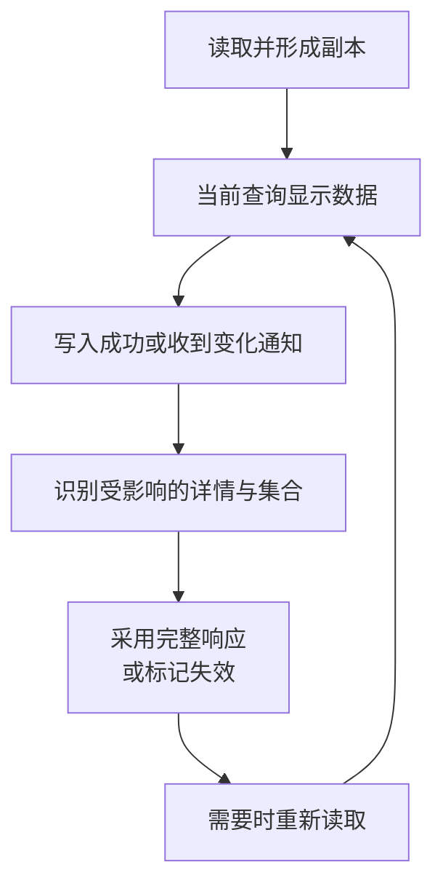

# 同一份资料，为什么两个页面会显示不同结果

## DATA-01 Server State、缓存键、失效与请求去重

目录里显示“摄影入门”，详情已经改成“摄影基础”；切到另一个机构后，上一家机构的列表又闪了一下；两个面板同时打开同一份资料，接口却请求了两次。这些问题不只是少写了一次刷新，而是浏览器没有明确管理“这是谁的哪一份副本”。

**Server State** 是远端拥有、客户端暂存的事实。我们可以控制如何读取、共享和显示副本，却不能因为它还在内存里就认定永远有效。本讲以课程资料列表和详情为例，把查询身份、刷新、去重、失效和会话边界连起来。示例是独立机制模型，不替换项目现有数据层。

### 学习前先确认

- 直接前置：[NET-01 浏览器网络协议、Fetch 与请求可靠性](../chinese-guides/net-01-browser-network-fetch-reliability.md#net-01)。本讲使用请求结果、取消、缓存和身份归属，不重复 HTTP 基础。

### 一、先问谁拥有事实，再决定状态放在哪里

资料标题可能被另一个编辑者修改，所以详情缓存只是一次读取的结果。输入框中还未提交的标题由当前用户编辑，拥有另一套生命周期；弹窗开关则不需要与服务器同步。

| 例子 | 主要所有者 | 恢复与同步方式 |
| --- | --- | --- |
| 已确认资料标题、权限快照 | 远端服务 | 重新读取，处理权限与版本 |
| 未提交标题 | 当前编辑任务 | 保留草稿，决定提交或放弃 |
| 当前筛选、页码 | 可分享时由 URL 表达 | 从 URL 恢复，并重新查询 |
| 面板是否展开 | 当前界面 | 本地状态或适当偏好记录 |

分类依据不是是否放进 store。一个 store 可以装几类数据，但不能让它们共享同一套“刷新就覆盖”的规则。服务器刷新不应抹掉用户草稿，编辑成功也不能只改当前输入框；见 [BIZ-05](../chinese-guides/biz-05-form-table-detail-state-consistency.md#一同一份资料至少有四种不同的值)。

### 二、有旧数据和正在请求，可以同时成立

首次加载没有数据，需要解释等待；后台刷新时已有可用正文，通常可以继续阅读。刷新失败也不一定需要把整页替换成错误页，但必须区分普通暂时故障与失去查看权限。

```ts example=data01-query-view
type View = {
  data: string | undefined;
  fetching: boolean;
  problem: 'none' | 'temporary' | 'forbidden';
};
function describe(s: View): string {
  if (s.problem === 'forbidden') return '清除不可见内容，说明权限变化';
  if (s.data === undefined) return s.fetching ? '首次读取中' : '暂无可用内容，可重试';
  if (s.fetching) return `${s.data}；正在刷新`;
  return s.problem === 'temporary' ? `${s.data}；刷新失败，当前是旧副本` : s.data;
}
console.log(describe({ data: undefined, fetching: true, problem: 'none' }));
console.log(describe({ data: '摄影入门', fetching: true, problem: 'none' }));
console.log(describe({ data: '摄影入门', fetching: false, problem: 'temporary' }));
console.log(describe({ data: '摄影入门', fetching: false, problem: 'forbidden' }));
// => 首次读取中
// => 摄影入门；正在刷新
// => 摄影入门；刷新失败，当前是旧副本
// => 清除不可见内容，说明权限变化
```

这里是页面决策，不是完整缓存实现；“清除”分支返回的是应采取的动作，实际数据与 DOM 仍需由调用层清理。例子用 `undefined` 表示从未有数据，没有把空数组、0 或空字符串误当成未加载。

查询库通常分别表达数据状态和请求状态，具体字段名随库而异。一个 `loading` 布尔值无法同时解释首次等待、后台刷新和离线暂停，组件输入也应保留这些区别。

### 三、查询键描述可以共享的响应身份

**Query Key** 应包含会改变结果的输入：当前数据范围、资源、筛选、排序以及分页参数。只用 `['materials']`，机构 A 的草稿第一页就可能和机构 B 的已发布第二页混在一起。

```js example=data01-query-key
function listKey({ scope, tenant, status = 'all', tags = [], cursor = null }) {
  // 本例约定标签顺序无关；若顺序有业务含义，就不能排序。
  const normalizedTags = [...new Set(tags)].sort();
  return JSON.stringify(['materials', 'list', scope, tenant, status, normalizedTags, cursor]);
}
const a = { scope: 'session-1', tenant: 'east', tags: ['photo', 'basic'] };
console.log(listKey(a) === listKey({ ...a, tags: ['basic', 'photo', 'photo'] }));
console.log(listKey(a) === listKey({ ...a, tenant: 'west' }));
console.log(listKey(a) === listKey({ ...a, cursor: 'page-2' }));
console.log(listKey(a) === listKey({ ...a, scope: 'session-2' }));
// => true
// => false
// => false
// => false
```

例子通过固定结构自行序列化。TanStack Query v5 接受数组键，并对键中的对象做确定性哈希；不能据此说普通 `JSON.stringify` 对任意对象字段顺序也有同样保证。[Query Keys](https://tanstack.com/query/latest/docs/framework/react/guides/query-keys)

不要把访问令牌放进键、日志或开发工具。范围可以用不含凭据的会话命名空间，或用严格隔离的缓存实例。语言、权限视图和协议版本只有在影响结果或兼容时才需要加入，不是把所有输入一股脑塞进键。

### 四、新鲜时间、保留时间和刷新频率分别设置

**staleTime** 描述读取结果在多久内可被视为新鲜；变陈旧通常意味着允许按策略重新获取，不等于立即删除。**gcTime** 关注无人观察的缓存多久可被回收；**refetchInterval** 则是主动轮询的节奏。

假设新鲜期 30 秒、无人观察后保留 5 分钟：第 40 秒返回页面，旧结果可能还在，可以先展示再刷新；它没有因为过了 30 秒就必然被清空。实际何时刷新，还取决于挂载、焦点、联网与库配置。

TanStack Query 当前 v5 文档还区分 `Infinity` 与更严格的 `'static'`。不要把它们理解成完全相同的“永不过期”，也不要把适合不可变引用表的策略照搬给可撤销权限。本文例子不依赖库的默认值。[Important Defaults](https://tanstack.com/query/latest/docs/framework/react/guides/important-defaults)

新鲜时间是客户端减少读取的策略，不是远端事实在这段时间内不会变化的保证。撤权、删除和明确写入结果可以要求立即处理；把缓存“还新鲜”当授权依据，会越过真正的服务端边界。

### 五、去重共享的是同一笔在途读取

**In-flight Deduplication** 让同一键的观察者复用尚未完成的工作。它与“完成后继续保留数据”不同，也不保证写入幂等。

```js example=data01-inflight
const pending = new Map();
function sharedRead(key, load) {
  if (pending.has(key)) return pending.get(key);
  const promise = Promise.resolve().then(load).finally(() => {
    if (pending.get(key) === promise) pending.delete(key);
  });
  pending.set(key, promise);
  return promise;
}
let calls = 0;
const load = async () => { calls += 1; return '摄影基础'; };
const first = sharedRead('east:m1', load);
const second = sharedRead('east:m1', load);
console.log(first === second);
console.log((await Promise.all([first, second])).join(' / '));
console.log(calls);
await sharedRead('east:m1', load);
console.log(calls);
// => true
// => 摄影基础 / 摄影基础
// => 1
// => 2
```

第四个输出是 2，因为前一笔读取已经完成并移出在途表。模型没有实现结果缓存、观察者计数或取消；同一键必须对应同一读取语义，不能让两个调用者用同一键塞入不同函数。

多个组件共享请求时，一个组件离开不一定应该中止别人仍需要的工作。成熟查询库会按其观察者和取消约定处理，是否把 AbortSignal 交给真实 fetch 也会影响结果。不要机械套用“组件卸载就取消所有请求”。[Query Cancellation](https://tanstack.com/query/latest/docs/framework/react/guides/query-cancellation)

### 六、迟到响应先确认属于哪个查询和会话

从筛选 A 切到 B，A 的响应晚到，并不必然是错误：若分别存入各自键，当前视图只观察 B，它可以成为 A 的有效缓存。错误通常是把 A 的结果写进当前 B 的唯一 `data` 变量。

会话切换更严格。即使又打开同一对象，旧会话也不应重新填充新会话的私有缓存。

```js example=data01-scope-generation
let generation = 1;
const cache = new Map();
function begin(key) { return { key, generation }; }
function accept(request, data) {
  if (request.generation !== generation) return '丢弃旧会话结果';
  cache.set(request.key, data); return '写入所属查询';
}
const old = begin('materials:m1');
generation += 1; cache.clear(); // 本例模拟整个私有缓存所属会话已切换。
console.log(accept(old, '上一会话的标题'));
console.log(cache.size);
console.log(accept(begin('materials:m1'), '当前会话的标题'));
// => 丢弃旧会话结果
// => 0
// => 写入所属查询
```

这里清空的是会话整体结束后的私有缓存，不是每次普通写入都清空全站。真实实现还要停止旧订阅与重放、清理允许清理的持久化副本，并在成功、失败、finally 分支都验证归属。身份切换的迟到回调见 [IDENTITY-01](../chinese-guides/identity-01-session-cookie-token-browser-boundaries.md#八退出之后迟到响应不能让页面重新登录)。

### 七、失效描述副本可能过时，重取才获得新事实

**Cache Invalidation** 与删除缓存不是同义词。失效可以保留可显示的旧值，标记需要刷新，再按活跃观察者和策略重取；没有正在显示的查询，也可能等下次访问再读取。



发布资料可能同时影响详情、待发布列表、已发布列表和统计。若响应包含完整新对象，可先更新详情；若只返回 `{id, version}`，就不能用它覆盖完整详情，导致标题等字段消失。

失效过宽会制造请求风暴，过窄则留下互相矛盾的页面。把“哪个写入影响哪些查询”集中记录，比让每个按钮各写一套刷新字符串更容易维护。乐观写入如何覆盖副本，见 [DATA-02](../chinese-guides/data-02-optimistic-updates-conflicts-offline-mutations.md#data-02)。

### 八、列表身份、页身份与对象身份不能混用

详情按稳定对象 ID 查找；列表还依赖筛选、排序和分页。标题改名后排序位置可能变化，发布后资料可能离开“草稿”列表，不能只替换原数组中的文字。

普通分页可以把游标放入页键；无限查询库也可能在一个查询下统一维护 `pages` 与 `pageParams`。两种模型都需要保持分页参数归属，不能声称任何库都必须把每个游标拼成独立 query key。

游标来自服务端，不能按数组长度猜。跨页插入、删除与排序需要稳定顺序和相应快照约定；客户端简单拼接不能弥补服务端分页语义不清。未知是否影响某集合时，可以有针对性地失效重查。

删除以后，旧详情请求可能再次回来。取消旧读取、保存版本或删除标记，并按对象生命周期决定是否接受，避免已删除条目“复活”。若 ID 会复用，还需要区别不同对象世代，不能只比一个永远增长的本地数字。

### 九、刷新失败要保留可用信息，也限制重试

暂时网络故障可以有限退避；限流要尊重 Retry-After。输入错误、身份过期、权限拒绝和真实不存在，需要各自处理，不宜无脑使用相同重试次数。

有旧数据时，普通刷新失败可以保留并标明时间；失去访问权时则需要移除不再允许持有的内容。第一次读取就失败，页面应给明确错误和重试入口。不同失败类型不能只映射成一个红色遮罩。

重试按钮应重取当前查询，不重置全部页面。应用、请求封装与网关若都各自重试，会放大故障；记录实际尝试次数和预算。离线事件只是提示，恢复后目标 API 仍可能不可达。

### 十、预取与实时通知都只是刷新策略的一部分

预取使用正式查询相同的键与解析器，才能在进入页面时复用。提前下载需要成本和权限：鼠标经过几十条资料，不代表应该拉取几十份敏感详情。限制并发、大小和低概率预取，取消已无意义的工作。

实时事件可以通知某个对象或集合已变化，再定向失效。如果事件只写“m1 已变更”，就不应假装它包含完整新对象。断线或历史窗口失效后，仍要用权威查询校正，不能只相信连接重新打开。

推送与查询之间的游标、缺口和重复处理见 [REALTIME-01](../chinese-guides/realtime-01-sse-websocket-webtransport-reliability.md#realtime-01)。不需要极低延迟的页面，有限轮询或重新聚焦时刷新往往已经足够。

### 十一、SSR 恢复和持久化要保留来源边界

服务器为一次请求预取私有数据时，查询缓存需要正确的请求隔离。客户端键分租户，无法修复服务器已经把 A 的 HTML 共享给 B 的问题。

序列化必要字段、查询身份、版本与适当时间信息，客户端复用同一初始快照。缓存恢复和框架 DOM Hydration 是相关但不同的过程；前者恢复数据，后者接管页面。初始一致性见 [RENDER-02](../chinese-guides/render-02-streaming-ssr-hydration-islands.md#五首次渲染使用同一快照再考虑刷新)。

持久缓存还要考虑身份命名空间、Schema 版本、最长年龄、配额和清理。损坏内容可以丢弃后重取；它不同于不能随便丢弃的待提交操作。离线时无法重新验证权限，就应遵守事先允许的离线范围，不能因磁盘里有副本就自动放行。

### 十二、用请求时间线判断问题，而不只看命中率

查错时同时记录用户动作、查询键的安全摘要、会话世代、请求开始与结束、失效来源和最终显示。重复请求可能来自有意刷新，也可能是键不一致；先确认事实，再决定是否优化。

同键并发、切筛选后的旧响应、切会话后的旧响应、保存后列表移位、刷新失败和撤权，通常比大量相似成功例子更能暴露问题。命中率高也可能是在反复显示错误机构的数据，请求少也可能是漏失效。

正文中的去重和世代例子只验证机制，不证明真实 HTTP、权限或缓存库配置。项目需要时再选择少量真实入口核对；一次性读取也可以直接 fetch，无需为了名词引入缓存框架。

### 动手想一想

详情已经返回新标题，列表还显示旧标题。先列出详情键、列表筛选和排序，再判断应该直接补丁、定向失效还是重新分页。为什么“把整个缓存清空”能暂时掩盖问题，却没有解释这次变化真正影响了什么？

### 参考与延伸阅读

- [TanStack Query：Query Keys](https://tanstack.com/query/latest/docs/framework/react/guides/query-keys)：核对 v5 键结构与确定性哈希。
- [TanStack Query：Important Defaults](https://tanstack.com/query/latest/docs/framework/react/guides/important-defaults)：区分新鲜、回收、自动刷新与具体配置。
- [TanStack Query：Query Cancellation](https://tanstack.com/query/latest/docs/framework/react/guides/query-cancellation)：查证观察者、信号与取消的实现约定。
- [BIZ-04：接口模型](../chinese-guides/biz-04-api-contract-dto-frontend-model.md#biz-04)：回看完整对象、局部响应和错误语义。
