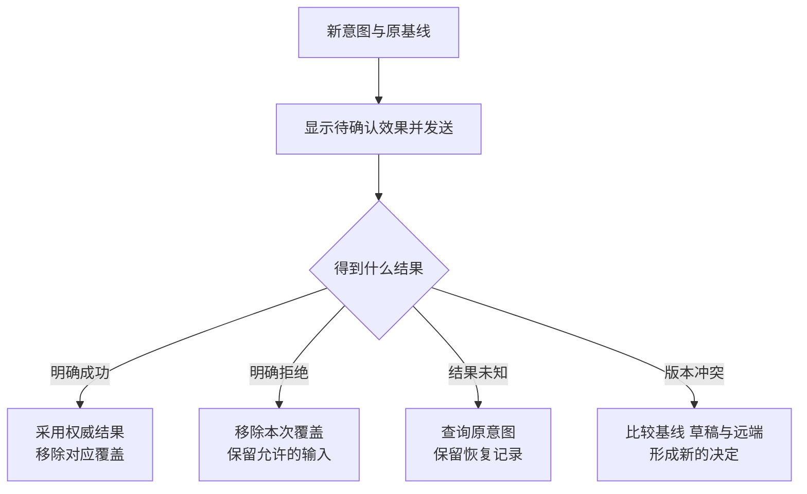

# 页面先改了，失败之后怎样保住正确的内容

## DATA-02 乐观更新、并发冲突与离线写入

把资料标题从“摄影入门”改成“摄影基础”，页面立即显示了新标题。用户又改成“摄影实践”，第一笔请求却在此时失败。如果失败处理直接恢复最早的整份快照，第二次输入也会被抹掉。

乐观更新（**Optimistic Update**）指的是在服务端确认之前，先按预期结果更新界面，同时保留待确认状态与恢复所需的信息。本讲围绕标题编辑、收藏和待同步操作，拆开确认基线、临时覆盖、操作身份与恢复记录。例子只处理合成状态；离线持久化和服务端幂等的实际保证需要各自的存储边界。

### 学习前先确认

- 直接前置：[DATA-01 Server State、缓存键、失效与请求去重](../chinese-guides/data-01-server-state-cache-keys-invalidation-deduplication.md#data-01)。先明确远端副本、查询身份和写后失效。
- 直接前置：[BIZ-07 异常边界、幂等与一致性](../chinese-guides/biz-07-errors-idempotency-eventual-consistency.md#biz-07)。本讲沿用意图幂等、未知结果、版本前提与补偿的区分。

### 一、先判断操作适不适合提前显示

收藏、轻量标签和可解释的标题编辑，结果通常可预测，失败也容易说明。发布审批、权限授予、名额扣减或不可逆删除，往往更适合等待明确确认，或只显示“正在处理”。

| 判断 | 值得问的具体问题 |
| --- | --- |
| 可预测 | 服务端是否会改写标题、计算状态或拒绝组合？ |
| 可恢复 | 失败后能否撤回本次临时变化，同时保住新输入？ |
| 可解释 | 用户能否分清待确认、明确失败和结果未知？ |
| 可识别 | 是否有稳定意图 ID、版本和查询结果的路径？ |

乐观与悲观可以混用：标题显示待同步，最终发布等待确认。等待确认也不等于空白，用户仍应看见进度、草稿和恢复方式。不要让设计中的绿色“已完成”与代码里的 pending 同时出现。

### 二、基线、覆盖层和草稿分别承担责任

服务端确认的对象是基线；尚未确认的操作可以形成临时覆盖层；用户仍在输入但尚未发送的值又是草稿。三个值有时相同，有时不同，不能为了省一个变量合并成永久可写的缓存对象。

最容易理解的一种模型是：页面展示由确认基线和有效的待确认操作计算得出。拒绝 A 时移除 A 的覆盖，再重新计算；不用拿 A 之前的全量快照去覆盖整个世界。

```js example=data02-owned-overlay
let base = { title: '摄影入门', version: 3 };
let pending = [
  { id: 'A', title: '摄影基础' },
  { id: 'B', title: '摄影实践' },
];
const visible = () => pending.reduce((value, op) => ({ ...value, title: op.title }), base);
console.log(visible().title);
pending = pending.filter(op => op.id !== 'A'); // 明确拒绝 A，只撤掉 A。
console.log(visible().title);
base = { title: '摄影实践', version: 4 }; // B 的权威确认。
pending = pending.filter(op => op.id !== 'B');
console.log(visible().title, visible().version);
const delayedRead = { title: '摄影入门', version: 3 };
if (delayedRead.version > base.version) base = delayedRead;
console.log(visible().title, visible().version);
// => 摄影实践
// => 摄影实践
// => 摄影实践 4
// => 摄影实践 4
```

例子只演示“A 已拒绝，再确认 B”这一顺序，以及忽略同一对象的旧版本读取。它不是任意并发下的通用合并算法。若 B 先确认，A 还未有结果，必须判断 A 是否仍有覆盖资格、是否被包含在新基线中；不能一直机械叠加。

对简单编辑，一个可靠起点是同一对象串行提交，发送期间保留新的草稿，成功后再发送下一笔。跨标签页和其他用户仍可能并发，因此服务端版本前提依然必要。发送快照与新输入的关系见 [BIZ-05](../chinese-guides/biz-05-form-table-detail-state-consistency.md#四发送快照冻结以后新输入属于下一次提交)。

### 三、一次业务意图需要跨重试不变的身份

`operationId` 识别一次用户意图，`attempt` 记录为了确认它进行了第几次尝试；对象 ID 识别被修改的资料，查询键识别缓存副本。它们不是可互换的编号。

第一次发送前冻结该意图的规范化参数、身份范围和基版本。网络超时后沿用同一幂等键，不能因为点了“重试”就自动产生第二个意图；同一键也不能换标题或版本后继续发送。

确认冲突以后，用户基于新事实作出的新决定，通常需要新意图和新键。原冲突记录可以保留为结果。幂等协议必须由服务端将识别重复的记录与业务效果正确提交，客户端按钮禁用或 Promise 去重都做不到这一点。

### 四、没有收到成功，不等于操作已经失败

```ts example=data02-recovery-action
type Result =
  | { kind: 'confirmed'; version: number }
  | { kind: 'rejected'; reason: string }
  | { kind: 'unknown'; operationId: string }
  | { kind: 'conflict'; latestVersion: number };
function next(result: Result): string {
  switch (result.kind) {
    case 'confirmed': return `采用确认版本 v${result.version}`;
    case 'rejected': return `撤销本操作的临时效果，保留可修改输入：${result.reason}`;
    case 'unknown': return `查询原意图 ${result.operationId}，暂不宣布失败`;
    case 'conflict': return `保留双方内容，与 v${result.latestVersion} 比较`;
  }
}
console.log(next({ kind: 'unknown', operationId: 'rename-8' }));
console.log(next({ kind: 'conflict', latestVersion: 5 }));
console.log(next({ kind: 'rejected', reason: '标题重复' }));
// => 查询原意图 rename-8，暂不宣布失败
// => 保留双方内容，与 v5 比较
// => 撤销本操作的临时效果，保留可修改输入：标题重复
```

只有合同明确保证未提交的拒绝，才可以据此撤销临时效果。请求中断、网关 504 或提交后响应丢失，通常进入结果未知。此时可以显示待确认标记，避免误导用户新建相同操作。

查询原意图也可能暂时失败，继续按预算恢复并保留记录。若服务端幂等记录已过保留期，不能无条件再发旧写入；需要对象状态、业务对账或其他人工恢复路径。

### 五、版本冲突需要保留比较起点

冲突恢复至少需要原基线、当前草稿和最新远端内容。只拿“本地”和“远端”两份值，有时无法判断哪个字段是谁改的。

原来标题 A、本地改为 B、远端仍是 A，可以考虑采用 B；原来 A、本地仍 A、远端改 C，可以采用 C；双方分别改成 B 和 C，则需要业务决定。独立字段合并之后，也要检查整体不变量，不能只因为每个字段分别合法就直接提交。

409 与 412 的意义要按具体接口合同理解，不能把所有同码结果都套成相同版本冲突。重新提交仍由服务端检查当前版本与权限；前端展示三方比较不意味着获得了覆盖权限。



### 六、列表中的临时变化要跟着稳定对象走

创建可以先显示临时条目，但要标记待确认，确认后用实际 ID 替换，并处理详情键、路由和后续依赖。重复确认不能多插一条；失败可以移除临时投影，同时保留创建表单。

修改状态后，条目可能离开当前筛选；标题变化后，排序和分页可能重排。只改当前数组的一个字段，不一定修复所有相关视图。明确哪些列表可以安全补丁，哪些需要定向失效重查。

删除后的撤销还要区分时刻：尚未发送时撤销本地意图；已经发出但未知时，先确认结果；已经删除后恢复，则可能是一个新的业务动作。隐藏一行和实际删除资料是两件事。

### 七、离线 outbox 是持久记录，不是一串 Promise

客户端 **Outbox** 保存将来仍需处理的意图。最小记录通常包括版本、身份范围、操作 ID、类型、对象、规范化参数、基版本、依赖与处理状态。只把 Promise 放在数组里，刷新后就失去恢复能力。

一种可解释的状态路径是 queued → sending → confirmed、rejected、conflict 或 unknown。应用崩溃后发现记录仍是 sending，不能猜测服务端没执行；通常应按 unknown 恢复。

```js example=data02-restore-envelope
function restore(raw, currentScope) {
  let saved;
  try { saved = JSON.parse(raw); } catch { return { kind: 'blocked', reason: '记录无法解析' }; }
  if (!saved || saved.schema !== 1) return { kind: 'blocked', reason: '需要迁移，保留原记录' };
  if (saved.scope !== currentScope) return { kind: 'blocked', reason: '身份范围不匹配' };
  if (!Array.isArray(saved.operations) || saved.operations.some(op => !op || typeof op.id !== 'string' || !['queued', 'sending', 'unknown'].includes(op.state))) {
    return { kind: 'blocked', reason: '操作记录不完整' };
  }
  return { kind: 'ready', operations: saved.operations.map(op => ({ id: op.id, state: op.state === 'sending' ? 'unknown' : op.state })) };
}
const raw = JSON.stringify({ schema: 1, scope: 'east:lin', operations: [{ id: 'rename-8', state: 'sending' }] });
console.log(restore(raw, 'east:lin').operations[0].state);
console.log(restore(raw, 'east:mei').reason);
console.log(restore(JSON.stringify({ schema: 2 }), 'east:lin').reason);
// => unknown
// => 身份范围不匹配
// => 需要迁移，保留原记录
```

例子只检查恢复信封并生成诊断，不访问浏览器存储，也不保存或重放业务参数。生产恢复还要验证完整载荷、唯一 ID、依赖与时限；非法或旧版本记录应隔离并提供迁移/处理路径，不应静默丢掉未确认意图。

若 outbox 和本地投影放在同一 IndexedDB 事务中，可以避免一边写成、一边没写成的部分状态。页面应等事务完成，再宣称已排队；单个 request 成功不等于整个事务成功。浏览器持久存储仍有配额、驱逐和设备故障等边界，不能宣称绝不丢失。[MDN IndexedDB](https://developer.mozilla.org/en-US/docs/Web/API/IndexedDB_API/Using_IndexedDB)

### 八、依赖与并发决定哪些操作可以重放

“创建资料”未确认前，“给这份资料加标签”需要等待真实 ID。可以用显式依赖和临时 ID 映射表达，不应把所有 queued 记录一起并发发送。

同一对象可以串行，无关对象可以有限并行。一个被拒绝的创建会阻止其依赖，但不应无限阻塞整个站点其他对象的同步。依赖失败、循环和长期停滞都需要可解释处理。

只有尚未发送、业务明确允许合并的意图，才适合压缩，例如把多次拖拽合成最后位置。已发送操作的参数已冻结，不能改写旧幂等键载荷。两标签页同时恢复可用本地协调减少重复，但最后的重复效果保护仍在服务端。

### 九、账号切换后，旧操作不能替新账号发送

队列与查询缓存都绑定身份和机构。退出时先使旧执行上下文失效，再停止发送和订阅；清理或保留旧队列由产品的数据策略决定。无论选择哪种策略，新账号都不能读取或发送旧账号的内容。

保留同一身份的离线草稿，也需要明确留存范围、期限与重新认证要求。把 localStorage 的键改成用户名只是命名空间，不是抵御同源恶意脚本的安全隔离；令牌和敏感载荷应尽量减少持久化。

重放时用当前认证主体重新授权。不能因为操作是昨天有权限时排队的，就跳过今天的撤权。服务端查询幂等结果同样要验证归属，知道一个 operationId 不应成为读取他人结果的凭据。

### 十、联网提示只负责触发尝试，确认仍来自服务端

`navigator.onLine` 只提供网络连接提示，不证明目标 API、DNS 或代理已经恢复。恢复后先确认会话、操作版本与必要业务前提，再按依赖和预算发送。

不要先重取对象后，悄悄把旧意图的基版本改成新版本继续重放；那是在改变用户原本的写入前提。可以查新事实供冲突判断，真正改变载荷需要一个新的、明确的决定。

退避、随机抖动、Retry-After 和并发上限可以限制恢复风暴。未知结果先查询，明确可安全重放时才重放；每层都独立重试会倍增请求。后台同步能力受环境限制，不能承诺关闭浏览器以后一定完成。

### 十一、失败恢复首先保护用户理解

页面应能表达“只保存在本地”“正在发送”“结果待确认”“发生冲突”和“已由服务器确认”。这些是事实差异，不应只换一个 spinner 颜色。

明确字段拒绝时定位错误并保留输入；权限拒绝时清除不应继续持有的数据，只保留策略允许的草稿；结果未知时提供查询入口；冲突时展示安全范围内的差异与选择。一个统一的 `onError = restoreSnapshot` 无法正确完成这些动作。

部分成功按对象或合同单位记录，已经确认的部分不能为了整批显示失败而回滚。补偿也是新业务动作，不一定能完全恢复原状态。对结果与恢复的共同解释见 [BIZ-07](../chinese-guides/biz-07-errors-idempotency-eventual-consistency.md#九补偿是一个新的业务动作有自己的结果)。

### 十二、选能揭示丢输入和重复效果的观察

从几条具体顺序开始：A 失败时 B 仍在；服务端已提交但响应丢失；发送期间刷新；另一个客户端改了版本；同一意图重复出现；账号切换后旧回调到达。分别记录基线、覆盖层、草稿、意图与确认结果。

正文模型能说明状态推导，无法证明持久化事务或服务端唯一约束。实际项目选必要的存储与接口边界验证，不必为了乐观功能扩成完整离线平台。高回滚率、高冲突率或长期 unknown，可能提示这项操作不适合提前显示成功，而不只是重试次数不够。

查询副本与写入影响图见 [DATA-01](../chinese-guides/data-01-server-state-cache-keys-invalidation-deduplication.md#七失效描述副本可能过时重取才获得新事实)；收到实时通知后也要按版本校正，不让旧事件覆盖已确认新事实。

### 动手想一想

队列恢复时，有一条 sending 记录，服务端其实已经处理，只是响应没到。为什么不能改成 queued 后换新键再发？分别写出“查询成功”“查不到但记录仍在处理中”“幂等记录已过期”三种结果的恢复方向。

### 参考与延伸阅读

- [TanStack Query：Optimistic Updates](https://tanstack.com/query/latest/docs/framework/react/guides/optimistic-updates)：查看界面覆盖和缓存更新两种实现入口；例子应结合实际并发条件使用。
- [MDN：Using IndexedDB](https://developer.mozilla.org/en-US/docs/Web/API/IndexedDB_API/Using_IndexedDB)：核对事务完成、版本和存储生命周期。
- [BIZ-05：编辑草稿与确认结果](../chinese-guides/biz-05-form-table-detail-state-consistency.md#biz-05)：进一步观察慢响应与新输入。
- [BIZ-07：幂等与未知结果](../chinese-guides/biz-07-errors-idempotency-eventual-consistency.md#biz-07)：回到服务端效果和结果恢复边界。
