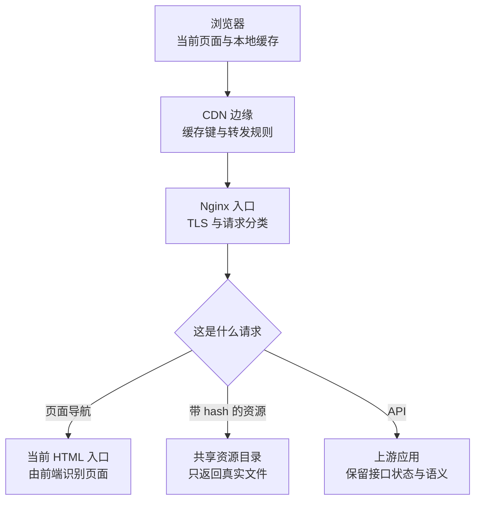

# 让每一种请求得到正确的响应

## DEPLOY-01 Nginx、静态资源、反向代理、HTTPS 与 CDN

把构建目录交给 Nginx 后，首页能打开，事情却未必结束：刷新 `/courses/42` 得到 404，丢失的 JS 文件返回一整页 HTML，接口超时后重试又保存了两次。接入 CDN 后，源站已更新，有人仍看到旧入口。

这些现象可以沿同一条请求路径解释。本篇用一个桌面资料站作为例子：页面由前端路由处理，资源统一放在 `/assets/`，API 统一放在 `/api/`。先分清请求归属，再连接代理、TLS、缓存与发布顺序，避免把所有问题归给一句“Nginx 配置错了”。

### 学习前先确认

- 直接前置：[LINUX-02 进程、端口、日志与网络诊断](../chinese-guides/linux-02-process-port-log-network-diagnostics.md#linux-02)。能够区分浏览器、代理和上游应用的位置，理解监听、连接与 HTTP 响应分别提供什么证据。

### 一、先画清谁向谁请求

**反向代理（Reverse Proxy）**代表一组服务接收外部请求，再按规则转交上游；浏览器访问的是代理入口，通常不需要知道后面应用的端口。**CDN**则把可复用的内容放到分布式边缘节点，也可能执行转发、安全和缓存策略。两者职责可以重叠，但不能仅凭产品名称判断某个响应究竟来自哪里。



查问题时，应记录域名、完整路径、方法、状态码、内容类型、响应头和时间。浏览器拿到 200 不代表请求正确：模块请求若拿到 `text/html`，仍会加载失败。也不能由一个 `Server` 头断定所有内容来源，头部可能被中间层改写。

若浏览器失败而源站请求成功，差异可能位于 DNS、TLS、CDN、缓存或浏览器策略；它只缩小了范围，不证明具体一层必然出错。排障方法可回看 [LINUX-02 的逐段观察](../chinese-guides/linux-02-process-port-log-network-diagnostics.md#二一次网页请求可能包含两次连接)。

### 二、页面、资源和 API 需要三份不同的约定

对于这份示例站点，先约定以下行为：

| 请求 | 正常响应 | 不存在或失败时 |
| --- | --- | --- |
| `GET /courses/42` | HTML 入口，前端决定展示课程或站内 404 | 不能因为没有同名磁盘文件就直接拒绝合法页面 |
| `GET /assets/app.a1b2.js` | 真实 JS，正确内容类型 | 返回真实 404，不能回退 HTML |
| `GET /api/progress` | 上游 API 响应 | 保留 API 的 4xx、5xx，不能包装成页面 |
| `POST /api/progress` | 按接口约定完成写入 | 超时不证明写入没有发生 |
| `GET /runtime-config.json` | 公开运行配置 | 配置缺失应失败，不能拿 HTML 冒充 JSON |

**SPA fallback**指在前端页面路径没有对应文件时返回应用入口，让浏览器里的路由继续处理。它是一种页面分发策略，不是“所有 404 都返回 index.html”。如果站点还提供下载文件、robots 或站点地图，也要为它们明确真实文件规则，不能混进导航兜底。

页面兜底可能让不存在的页面先收到 200，再由前端展示“未找到”。这与服务端直接返回真实 404 不同；有搜索索引需求时，需结合 SSR、预渲染或独立路由处理。具体渲染选择见 [RENDER-01](../chinese-guides/render-01-spa-ssr-ssg-isr-hybrid-decisions.md#render-01)。

### 三、读懂 location、root 和 try_files 的组合

`location` 决定哪段配置处理 URI。精确匹配 `=` 优先；普通前缀匹配会选最长前缀，正则匹配还可能介入；`^~` 可以让选中的前缀避免再被正则 location 抢走。不要凭文件中“写在前面”判断所有 location 的优先级。

`root` 把请求 URI 接到目录后。例如 `root /srv/site/shared;` 对 `/assets/a.js` 查找的是 `/srv/site/shared/assets/a.js`。`alias` 则替换匹配到的路径部分，常用于 URL 与磁盘结构不同的情况。两者不能只改指令名字而不重新推导最终文件路径。

`try_files` 按给定路径检查文件，最后一项可以触发内部跳转或返回状态。下面的导航规则表示：有真实文件就用它，否则内部转到 `/index.html`；转过去后会重新匹配对应 location。

```nginx
location / {
    try_files $uri /index.html;
}
```

内部跳转不是给浏览器一个 302，地址栏仍是原页面路径。也正因为会重新匹配，HTML 的缓存规则最好放在精确的 `/index.html` location 中，让直访和导航兜底使用同一策略。

若 `/index.html` 自己也不存在，不能让它再次兜底到自己形成循环；应有独立精确规则和明确失败响应。资源目录也不应使用导航的兜底逻辑。

### 四、一个完整的本地 HTTP 配置

以下配置是隔离练习用的 `nginx.conf`，不是生产配置补丁。它仅监听本机 `127.0.0.1:18082`，不包含公网 TLS。假设 Linux 上已有 Nginx，并事先准备了这个目录；`current` 可以是一个指向当前版本目录的链接，`shared/assets` 保留多个版本的资源。

```text
/tmp/b25-site/
  current/
    index.html
    runtime-config.json
  shared/
    assets/
      app.a1b2.js
      app.c3d4.js
```

可在 HTML 中写一个标题并引用存在的资源；运行配置只放公开字段。不要为了试验改动正在使用的服务器目录。以下配置自己定义了所需 MIME 类型，避免依赖示例外的 `mime.types` 文件。

```nginx example=edge-local-config runtime=project file=nginx.conf
worker_processes 1;
pid /tmp/b25-nginx.pid;
error_log /tmp/b25-nginx-error.log;
events { worker_connections 128; }
http {
    types {
        text/html html;
        text/css css;
        application/javascript js;
        application/json json;
        image/svg+xml svg;
    }
    default_type application/octet-stream;
    access_log /tmp/b25-nginx-access.log;
    server {
        listen 127.0.0.1:18082;
        server_name localhost;
        root /tmp/b25-site/current;
        add_header X-Content-Type-Options nosniff always;

        location ^~ /assets/ {
            root /tmp/b25-site/shared;
            try_files $uri @missing;
            add_header Cache-Control "public, max-age=31536000, immutable";
            add_header X-Content-Type-Options nosniff always;
        }
        location = /index.html {
            try_files $uri @missing;
            add_header Cache-Control "no-cache" always;
            add_header X-Content-Type-Options nosniff always;
        }
        location = /runtime-config.json {
            try_files $uri @missing;
            add_header Cache-Control "no-store" always;
            add_header X-Content-Type-Options nosniff always;
        }
        location = /api { return 404; }
        location ^~ /api/ {
            proxy_pass http://127.0.0.1:18083;
            proxy_http_version 1.1;
            proxy_set_header Host $host;
            proxy_set_header X-Forwarded-Proto $scheme;
            proxy_set_header X-Forwarded-For $remote_addr;
            proxy_connect_timeout 2s;
            proxy_read_timeout 10s;
            proxy_cache off;
        }
        location @missing {
            add_header Cache-Control "no-store" always;
            add_header X-Content-Type-Options nosniff always;
            return 404;
        }
        location / {
            try_files $uri /index.html;
        }
    }
}
```

几处细节值得逐个读：`/assets/` 使用独立共享目录，切换 `current` 不会立刻删除旧文件；缺失资源进入 `@missing`，404 带 `no-store`，避免错误响应被长期保存；`immutable` 没有加 `always`，不把成功资源策略直接套给任意错误码。

这里多次写 `nosniff` 是有原因的。Nginx 传统 `add_header` 继承规则是：当前层只要声明了自己的 `add_header`，就不会自动继承上一层的那组声明。新版本支持调整继承策略，但示例不依赖它。扩展 CSP、HSTS 等头部时，也要核对最终命中的 location，而不只看 server 顶层写过没有。

### 五、用一个上游看清 proxy_pass 的路径语义

下面保存为 `api.mjs`，使用 Node.js 执行 `node api.mjs`，即可为本地配置提供上游。它只识别健康接口，其他 API 返回 JSON 404；没有身份认证和业务写入，不作为生产 API 模板。

```js example=edge-upstream runtime=project file=api.mjs
import { createServer } from 'node:http';
const server = createServer((req, res) => {
  const path = new URL(req.url, 'http://localhost').pathname;
  const ok = req.method === 'GET' && path === '/api/health';
  res.writeHead(ok ? 200 : 404, {
    'Content-Type': 'application/json; charset=utf-8',
    'Cache-Control': 'no-store'
  });
  res.end(JSON.stringify({ ok, path, method: req.method }));
});
server.listen(18083, '127.0.0.1', () => console.log('API ready: 18083'));
```

在普通前缀 location 中，`proxy_pass http://127.0.0.1:18083;` 没有附带 URI，示例的 `/api/health` 会原样到达上游。若改成 `proxy_pass http://127.0.0.1:18083/;`，附带的 `/` 会替换匹配的 `/api/` 前缀，上游收到 `/health`，这个示例便返回 404。

这不是“末尾斜杠有没有都差不多”的格式问题，而是上游路由约定。正则 location、变量和 rewrite 还会改变适用规则，应按实际配置查官方文档，不能把这条普通前缀规则机械套用到所有情况。

本地配置把 `X-Forwarded-For` 设为直接连接方地址，适用于入口直接面对客户端的简化场景。若前面还有 CDN，应只信任受控代理来源，正确恢复原始客户端地址；不能把任何客户端传来的同名头当作可信身份。代理头描述连接上下文，不是用户权限凭据。

### 六、超时、缓冲和重试各自影响什么

`proxy_connect_timeout` 限制建立上游连接的等待；`proxy_read_timeout` 限制两次读取上游数据之间的间隔，并不是整个请求的总截止时间。持续有数据到达的长响应，可能远远超过十秒仍未触发读取超时。

普通 JSON 可以使用默认缓冲方式；**SSE** 希望事件及时到达客户端，常需要针对专门端点关闭代理缓冲、核对 CDN 行为、安排合理心跳与超时。仅调整一个 Nginx 参数，不能证明所有中间层都会实时转发。WebSocket 还涉及 Upgrade 转发，应为它单独设计 location 和头部约定。

代理重试也需要按方法和业务语义区分。读取失败后的重试往往较容易处理；写入在响应丢失后，服务端可能已经完成。把超时一律转成重发，可能造成重复订单或重复进度事件。详见 [BIZ-07 的结果未知与幂等](../chinese-guides/biz-07-errors-idempotency-eventual-consistency.md#biz-07)。

还应设置请求体大小、连接与资源限制，并处理客户端断开。拒绝超大上传与“上传过程中连接断开”需要不同错误提示。长任务应返回可查询的任务身份，由独立状态表达结果，不要只靠不断放大代理超时掩盖任务设计问题。

### 七、HTTPS 验证的是连接到谁，以及内容如何传输

**TLS**为连接提供身份验证、机密性和完整性保护。浏览器验证的关键包括证书是否覆盖访问域名、证书链能否连到受信任根、是否处于有效期，以及握手参数是否兼容。IP 能连上不等于域名证书正确；访问 IP 再手动加 Host，也不必然复现相同的 SNI 与证书选择。

公网入口通常让 HTTP 跳转到 HTTPS，再由 HTTPS server 处理内容。证书文件应包含适当的链，私钥只允许必要身份读取；自动续期还需要验证续期成功、服务已加载新证书，并提前观察到期风险。单看磁盘上文件日期，不证明外部连接拿到了新证书。

CDN 终止 TLS 后，边缘到源站是另一条连接。浏览器看到安全锁，只证明浏览器这一段满足其检查，不能证明源站段也加密并验证了身份。需要明确每一段的 TLS 与访问控制。

**HSTS**告诉浏览器后续强制使用 HTTPS。它具有持续效果，包含子域的策略可能影响尚未准备好的服务。应在所有目标域名的证书、续期和恢复路径可靠后逐步启用，不能把超长有效期和 preload 当成无条件默认项。排障时保留真实域名的方法见 [LINUX-02 的 TLS 验证](../chinese-guides/linux-02-process-port-log-network-diagnostics.md#七保留域名才能正确验证-tls)。

### 八、缓存指令分别回答能不能存与何时能复用

浏览器缓存属于单个客户端；CDN、共享代理可能为多个人复用响应。制定策略时，先判断内容是否个性化，再判断更新方式。

| 指令 | 应怎样理解 | 常见误解 |
| --- | --- | --- |
| `no-store` | 不应存储该响应 | 不会自动清除先前已经保存的旧响应 |
| `no-cache` | 可以存，但复用前要重新验证 | 不是“禁止缓存” |
| `private` | 不允许共享缓存保存，私有缓存可以 | 不是加密或身份认证 |
| `max-age=60` | 在规定新鲜期内可按规则复用 | 不是每个缓存收到后都重新开始完整 60 秒 |
| `s-maxage=300` | 为共享缓存设新鲜期，覆盖其 `max-age` | 不直接设置浏览器私有缓存期限 |
| `immutable` | 在新鲜期内内容不变，减少不必要的重新验证 | 仍需新鲜期，也不能修正被复用的旧 URL |

`ETag` 是响应表示的验证器。客户端带 `If-None-Match` 请求，服务器确认表示未变化时可返回 304，客户端使用已有正文。304 不是“没有内容所以页面空白”；前提是客户端本来持有可复用的那份内容。它也不等于永远不再回源。

本篇给 HTML 使用 `no-cache`，给 hash 资源使用长期缓存，给运行配置使用 `no-store`。API 示例由上游明确返回 `no-store`；Nginx 的 `proxy_cache off` 只关闭该代理缓存，不能约束 CDN 和浏览器替你不存。真实 API 应按认证、个性化和业务新鲜度逐端点设计。

### 九、CDN 缓存键决定谁会拿到同一份响应

**缓存键（Cache Key）**决定哪些请求共享一个缓存条目。通常需要考虑域名、路径、查询参数及会改变表示的请求信息，实际规则以 CDN 配置为准。忽略了会改变结果的维度，会把错误内容分给用户；把随机追踪参数全纳入，又可能导致几乎没有命中。

例如 `/search?q=vue` 与 `/search?q=react` 不能在查询词会改变正文时共享同一结果。语言通过请求头改变时，需要让缓存策略正确区分语言；HTTP 的 `Vary` 用于声明请求头维度，但 CDN 是否支持某一组合、是否有显式覆盖规则，还要确认。

登录后的账户页面和用户进度尤其不能只按 URL 共享缓存。不要寄希望于“响应有 Set-Cookie，平台大概不会存”，应明确禁止共享缓存，并验证实际命中行为。带 Authorization 的请求也要防止被错误的强制缓存规则覆盖。

压缩同样涉及表示：服务端提供 gzip、Brotli 或未压缩版本，要正确处理 `Accept-Encoding` 和缓存变体。文件传输更小，不等于解析、执行或渲染也更快；性能成本的分解留到 [PERF-01 的预算](../chinese-guides/perf-01-core-web-vitals-performance-budgets.md#五性能预算要对应用户路径与实际成本)。

### 十、清理缓存不等于所有用户立即看到新版本

CDN purge 通常是有传播过程的操作。控制台显示任务已提交，不等于每个边缘节点、浏览器缓存和 Service Worker 都已更新。排查时可以比对响应体中的公开版本标识、ETag、Age 和平台提供的命中头；`Age` 缺失本身不能证明没有缓存。

用随机查询参数绕缓存，只能说明“另一个缓存键下”的结果。它不能证明原 URL 已恢复，更不能作为长久修复。强制刷新也可能掩盖日常访问才会遇到的问题。

处理旧内容时要先辨认是哪一层保留了什么：HTML 入口旧、资源旧、运行配置旧，还是页面本身已经运行数小时。缓存指令影响后续响应的存储与复用，不会把已执行的 JavaScript 自动换掉。

如果产品允许暂时返回旧内容，应明确可接受的新鲜度与错误状态。公共帮助页和账户余额对“旧”的容忍度完全不同，不能因为 `stale-while-revalidate` 让体验流畅，就把它不加区分地用到所有数据。

### 十一、让新旧页面都能找到自己的资源

一次前端发布至少有两个时序要求：新入口被访问时，新资源已经就绪；旧入口仍在使用时，旧资源依然可取。因此，先把新 hash 资源放进共享资源目录，再切换 HTML 和兼容的运行配置。不要先更新 HTML、等用户请求时才慢慢上传资源。

假设 v1 入口引用 `app.a1b2.js`，v2 引用 `app.c3d4.js`。共享目录同时保存它们，即使当前入口已切到 v2，旧标签页仍能拉取 v1 的懒加载模块。若静态资源放在 `current/assets`，而 `current` 只指向最新版目录，保留旧版本目录本身仍不够：公开 URL 是否还能到达它才是关键。

同一 hash URL 不应覆盖成另一份内容。回滚通常切回兼容的 HTML、配置或服务，让原资源继续存在；不能靠清空 CDN 强迫所有用户与服务同时倒退。**原子替换**可以避免读取到写了一半的入口，但不会自动解决跨机器、CDN 和数据库的同时切换，详见 [LINUX-01](../chinese-guides/linux-01-filesystem-permissions-safe-commands.md#十原子替换解决可见性不自动解决持久性)。

资源清理应依据支持窗口、引用关系、回滚版本和存储策略进行。长会话支持一天就不能上线十分钟后删掉唯一旧资源。恢复策略与放量过程可以接着看 [ENG-06](../chinese-guides/eng-06-ci-cd-artifact-promotion-release-rollback.md#十前端发布必须照顾已经打开的旧页面)。

### 十二、检查实际响应，而不是只检查配置文本

在准备好的隔离 Linux 环境中，可先用 `nginx -t -c /绝对路径/nginx.conf` 检查，再以该配置启动；已有实例的 reload 必须对准对应配置与 PID，避免操作到别的服务。检查通过说明语法及部分引用条件可用，不说明 API 路由、权限、CDN 或用户任务已经正确。

用浏览器 Network 或 HTTP 客户端核对这个小矩阵就能发现许多配置错误：

| 请求或操作 | 本例应看到什么 | 它排除哪种误判 |
| --- | --- | --- |
| 刷新 `/courses/42` | HTML，入口要求重新验证 | 页面路由被当成磁盘路径 |
| 读取存在的 `/assets/app.a1b2.js` | JS 类型与长期缓存 | 文件存在但类型或策略错误 |
| 读取缺失的 `/assets/missing.js` | 404、`no-store` | HTML 兜底伪装成模块 |
| 请求 `/api/health` | JSON，`path` 为 `/api/health` | 代理路径被意外裁掉 |
| 请求 `/api/missing` | JSON 404 | API 错误被吞成页面 |
| 关闭练习上游后请求 API | 代理错误，结合代理日志定位 | 把进程监听等同于全链路可用 |
| 切换入口后请求旧 hash | 旧资源仍能返回 | 只验证新首页 |

本地上游可以独立运行，用来验证路径和 JSON 约定；这不能代替 Nginx 实机验证。没有 Nginx、TLS 或 CDN 环境时，应保留这部分待验证状态，不把 Node 示例运行成功说成完整部署成功。

对于公网问题，还要沿真实域名和边缘入口复查。最终证据应是读者原本失败的路径已恢复，以及错误没有被另一种“200 页面”掩盖。

### 带着问题回看

- 一个 JS 请求状态为 200、内容类型却是 HTML，应先查哪条兜底规则？
- 只给代理关闭缓存，为什么登录接口仍需要响应缓存策略？
- `current` 已切换、旧版本目录还在，为什么旧资源 URL 仍可能 404？
- CDN 清理完成后，什么证据能说明原请求路径已恢复？

### 参考与延伸阅读

- [Nginx：HTTP 核心模块](https://nginx.org/en/docs/http/ngx_http_core_module.html)：核对 location、root、alias、try_files 的完整规则。
- [Nginx：代理模块](https://nginx.org/en/docs/http/ngx_http_proxy_module.html)：查询 URI 转发、超时、缓冲和请求头。
- [Nginx：响应头模块](https://nginx.org/en/docs/http/ngx_http_headers_module.html)：核对状态码适用范围、继承规则与版本差异。
- [Nginx：HTTPS 配置](https://nginx.org/en/docs/http/configuring_https_servers.html)：理解证书链、虚拟主机与 TLS 配置。
- [MDN：Cache-Control](https://developer.mozilla.org/en-US/docs/Web/HTTP/Reference/Headers/Cache-Control)：查询各指令的精确定义。
- [MDN：HTTP 缓存](https://developer.mozilla.org/en-US/docs/Web/HTTP/Guides/Caching)：结合验证器和共享缓存理解完整机制。
