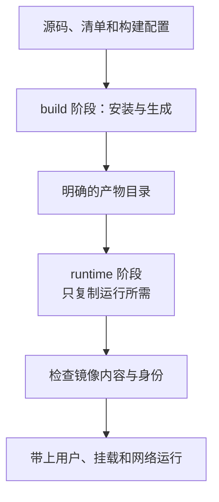

# 镜像已经构建成功，为什么还不能放心运行

## DOCKER-01 镜像、容器、Dockerfile 与构建缓存

同一个项目，在开发机能启动，换一台机器却缺文件；重新构建后版本号没变，页面内容却变了；容器被删除，手动修好的配置也消失了。要解释这些现象，需要先区分构建输入、镜像内容和一次容器运行，而不是把它们统称为“Docker 环境”。

本讲从一个没有第三方依赖的资料页开始，给出可保存成文件的构建与运行例子，再将规律推广到真实前端项目的依赖安装、缓存和发布。示例服务只供本机学习，生产的 TLS、鉴权、日志与部署策略另行设计。

### 学习前先确认

- 直接前置：[LINUX-01 文件系统、权限与安全命令](../chinese-guides/linux-01-filesystem-permissions-safe-commands.md#linux-01)。需要理解路径、进程身份、文件权限与持久化对象。

### 一、镜像定义内容，容器带上一次运行条件

**镜像（Image）**包含文件系统层与运行配置，是可以分发的制品。**容器（Container）**则是在这些内容之上，加入一次运行的进程、可写层、环境、挂载和网络。镜像里写着什么，与进程此刻实际看到什么，不一定相同。

同一镜像启动 A、B 两个容器，A 在可写层改了文件，不会自动改原镜像或 B 的文件。重启同一个容器通常保留其可写层；删除并创建新容器则不能依赖旧可写层。卷和 bind mount 还有独立生命周期，下一篇会展开。

Linux 容器共享宿主内核，命名空间和 cgroup 让它拥有受约束的视图与资源，并不是每个容器里都启动一套完整虚拟机。Docker Desktop 的 Linux 容器一般运行在其 Linux 虚拟环境里，因此宿主路径与 Linux 容器路径也不能直接等同。

排查“同一镜像表现不同”，需要同时比较镜像身份、平台架构、环境、用户、挂载、端口和资源限制。仅截图一个 tag 无法证明运行条件相同。

### 二、tag 是名字，digest 才对准具体内容

`atlas-web:demo` 是便于人使用的 tag，它可以被重新指向另一份镜像。digest 是对相应内容对象的摘要；部署要核对的是你实际拉取和运行的那一个对象。多平台镜像的索引摘要与某个平台镜像摘要不是同一个层级，记录时说明对象类型和架构。

固定基础镜像 digest 可以让更新变成显式选择，但不能保证构建自动字节一致。时间戳、工具版本、下载结果、安装脚本和构建器也可能改变输出。`npm ci` 固定依赖解析的一部分，并不冻结任意安装脚本访问的全部外部世界。

本讲例子使用 `node:22-bookworm-slim` 作为可理解的教学默认，它是会移动的标签。实际发布应选取受支持且经过核对的基础镜像 digest，记录平台与更新流程；不要抄写一个未经查询的假摘要，也不要把固定版本理解成永远不打补丁。

制品来源、SBOM、签名和扫描必须对准同一对象，见 [ENG-08](../chinese-guides/eng-08-software-supply-chain-sbom-provenance.md#四不同证据必须对上同一个对象)。构建成功只回答“某次过程产生了结果”，还没回答结果是否适合运行。

### 三、构建上下文是可供构建器读取的输入范围

**构建上下文（Build Context）**由 build 命令指定。例如 `docker build -f deploy/Dockerfile .` 的上下文是当前目录，不是自动变成 deploy 目录。COPY 的源路径从上下文解析，不能借 `../` 任意读取上下文之外的文件。

BuildKit 会优化实际传输与使用的输入，因此不宜简单说每次必然上传所有字节；但你仍必须把上下文当作构建器可能接触的范围，尤其使用远程构建器时。`.env`、私钥、源码仓库元数据和本地 node_modules 都不应因为一个 `COPY . .` 顺手进入发布层。

`.dockerignore` 用于排除输入。它与 Dockerfile 所在位置、Dockerfile 专属 ignore 文件和规则顺序有关，要按实际构建入口验证。运行阶段删除秘密不能抹掉较早层中已经保存的秘密；应阻止它进入不该进入的输入和层。

monorepo 的上下文可以是仓库根，但 COPY 应明确覆盖目标包与解析依赖所需的 workspace 清单。只复制一个 package.json 却漏掉工作区依赖，会造成“缓存很快但构建不完整”。

### 四、缓存复用的是已有结果，不是重新判断业务正确

**层缓存（Layer Cache）**根据指令及其相关输入决定能否复用。对典型的依赖安装流水线，先复制依赖清单与锁文件，再安装，最后复制源码，能把“改文案”与“重新解析依赖”分开。

```dockerfile
# 说明片段：要求项目已有匹配的 package-lock.json。
COPY package.json package-lock.json ./
RUN npm ci
COPY src/ ./src/
```

真实项目还需要相应构建配置与其他源码，不能把这三行当完整 Dockerfile。若先 COPY 全部文件再 npm ci，一个无关源码变化也会改变安装步骤的前置内容。反过来，漏复制影响安装的 workspace 清单，会让缓存依据不完整。

| 改动 | 应重点观察的现象 |
| --- | --- |
| 只改源码 | 合理分层下，依赖安装结果可复用 |
| 改锁文件或依赖清单 | 安装步骤及受影响的后续步骤需要重新计算 |
| 只改复制文件的 mtime | Docker 的相关校验不把 mtime 单独计入缓存依据 |
| 远端包源改变、本地输入未变 | 已缓存的 RUN 不会为了你自动重新查询远端 |

cache mount 缓存下载数据，与直接复用整条 RUN 结果不同。远程缓存还涉及写入权限，低信任任务不应覆盖发布流程依赖的缓存。命中缓存不能替代验证，空缓存可构建也不能独自证明字节级可重现。[Docker 缓存规则](https://docs.docker.com/build/cache/invalidation/)

### 五、多阶段让构建工具不必跟着应用一起交付



**多阶段构建（Multi-stage Build）**在一个 Dockerfile 中建立多个阶段。构建阶段可有编译器、devDependencies 和源码；运行阶段只拿需要的产物与运行依赖。如果跨阶段复制整个工作目录，依然可能把缓存、源码和秘密带过去。

前端静态输出通常可以交给 Web 服务器，不必把开发服务器和编译工具带进生产。Node 服务如果没有被打包成独立文件，仍需要运行依赖；不能因为“用了多阶段”就把 node_modules 全删了再期待启动成功。

下面用原生 Node 生成一个静态页面，目的在于让输入、产物和阶段关系都能看见。它没有包安装步骤，因此不能用它的构建时间证明真实项目的依赖缓存收益。

### 六、一个能从五个文件读懂的镜像实验

在新目录中保存下列文件。`lesson.json` 是构建输入：

```json example=docker01-lesson runtime=project file=lesson.json
{"title":"理解镜像与容器","summary":"页面在构建时生成，运行时只读取产物。"}
```

`build.mjs` 生成页面，并只将服务文件与页面放入 out。文本先转义再进入 HTML：

```js example=docker01-build runtime=project file=build.mjs
import { readFile, writeFile, mkdir, copyFile } from 'node:fs/promises';
const lesson = JSON.parse(await readFile(new URL('./lesson.json', import.meta.url), 'utf8'));
if (typeof lesson.title !== 'string' || typeof lesson.summary !== 'string') throw new Error('资料字段必须为文本');
const escape = value => value.replace(/[&<>"']/g, char => ({ '&':'&amp;', '<':'&lt;', '>':'&gt;', '"':'&quot;', "'":'&#39;' })[char]);
const out = new URL('./out/', import.meta.url);
await mkdir(out, { recursive: true });
const html = `<!doctype html><html lang="zh-CN"><meta charset="utf-8"><title>${escape(lesson.title)}</title>
<style>body{max-width:760px;margin:72px auto;padding:0 32px;font:18px/1.8 system-ui;color:#183047;background:#f4f7fa}article{padding:40px;background:white;border:1px solid #dce5ed;border-radius:20px}small{color:#526777}h1{line-height:1.3}</style>
<article><small>镜像内容实验</small><h1>${escape(lesson.title)}</h1><p>${escape(lesson.summary)}</p><p>修改源资料后，需要重新构建才能生成新页面。</p></article></html>`;
await writeFile(new URL('index.html', out), html);
await copyFile(new URL('./server.mjs', import.meta.url), new URL('server.mjs', out));
console.log('生成 out/index.html 与 out/server.mjs');
```

`server.mjs` 只提供首页与健康入口，不接受任意文件路径，也不需要写工作目录：

```js example=docker01-server runtime=project file=server.mjs
import http from 'node:http';
import { readFile } from 'node:fs/promises';
const html = await readFile(new URL('./index.html', import.meta.url));
const port = Number(process.env.PORT ?? 8080);
if (!Number.isInteger(port) || port < 0 || port > 65535) throw new Error('PORT 无效');
const server = http.createServer((request, response) => {
  if (request.method !== 'GET') { response.writeHead(405); response.end(); return; }
  if (request.url === '/healthz') { response.writeHead(200); response.end('ok'); return; }
  if (request.url !== '/') { response.writeHead(404); response.end('not found'); return; }
  response.writeHead(200, { 'content-type':'text/html; charset=utf-8', 'cache-control':'no-store' });
  response.end(html);
});
server.listen(port, process.env.HOST ?? '0.0.0.0', () => {
  console.log(JSON.stringify({ event:'listening', port:server.address().port }));
});
let stopping = false;
const stop = () => {
  if (stopping) return;
  stopping = true;
  const deadline = setTimeout(() => { server.closeAllConnections(); process.exit(1); }, 5000);
  deadline.unref();
  server.close(error => {
    clearTimeout(deadline);
    process.exitCode = error ? 1 : 0;
  });
};
process.on('SIGTERM', stop);
process.on('SIGINT', stop);
```

`Dockerfile` 的运行文件归 root 所有且普通用户可读，应用使用 Node 官方镜像中的 node 用户：

```dockerfile example=docker01-image runtime=project file=Dockerfile
# syntax=docker/dockerfile:1
ARG NODE_IMAGE=node:22-bookworm-slim
FROM ${NODE_IMAGE} AS build
WORKDIR /work
COPY lesson.json build.mjs server.mjs ./
RUN node build.mjs

FROM ${NODE_IMAGE} AS runtime
ENV NODE_ENV=production PORT=8080 HOST=0.0.0.0
WORKDIR /app
COPY --from=build --chown=0:0 /work/out/ ./
USER node
EXPOSE 8080
HEALTHCHECK --interval=10s --timeout=3s --start-period=5s --retries=3 \
  CMD ["node", "-e", "fetch('http://127.0.0.1:'+process.env.PORT+'/healthz',{signal:AbortSignal.timeout(2000)}).then(r=>process.exit(r.ok?0:1)).catch(()=>process.exit(1))"]
CMD ["node", "server.mjs"]
```

第五个文件 `.dockerignore` 使用允许列表，只给构建器这次真正需要的输入：

```text
*
!Dockerfile
!.dockerignore
!lesson.json
!build.mjs
!server.mjs
```

先可用 `node build.mjs`、`node out/server.mjs` 单独观察应用。Docker 环境中再执行下一节。原生运行只验证 Node 程序，不证明镜像层、运行用户或容器隔离已经正确。

### 七、按现象核对构建与运行

在上述新目录中执行，命令针对这个专用实验镜像与容器：

```bash
docker build --progress=plain -t atlas-image-lab:v1 .
docker image inspect atlas-image-lab:v1 --format '{{.Id}} {{.Config.User}} {{json .Config.Cmd}}'
docker run --rm --name atlas-image-lab --read-only --cap-drop ALL \
  --security-opt no-new-privileges=true -p 127.0.0.1:18080:8080 atlas-image-lab:v1
```

在另一个终端请求 `http://127.0.0.1:18080/` 和 `/healthz`。首页应包含 lesson.json 中的中文标题，健康入口返回 ok。`docker exec atlas-image-lab id` 应显示非 root 身份；`docker inspect atlas-image-lab` 查看实际用户、只读设置、发布地址和健康结果，而不是只看 Dockerfile 意图。

使用 `docker stop -t 8 atlas-image-lab` 结束这一实验容器，观察应用是否在宽限期内正常退出。`--rm` 会在退出后删除这个容器，实验数据不应放在它的可写层。固定名称如果已存在，应先确认归属，不能为了运行例子去删除其他容器。

第二次不改输入构建，观察可复用步骤；修改 lesson.json 再构建，生成步骤应重新执行。最终阶段应含 index.html 与 server.mjs，不需 lesson.json 或 build.mjs。没有读取 BuildKit 日志、最终文件和运行身份，就不要把预期写成已验证事实。

### 八、非 root 与只读文件系统解决不同问题

USER 限定进程身份；只读根文件系统限制写入；capabilities、no-new-privileges 和系统调用策略进一步约束能力。它们解决不同问题，也都不是“完全隔离”的保证。挂载 Docker socket 或宿主敏感目录会显著扩大能力。

应用若需要写缓存，应提供明确的临时目录或受限卷，不要把整个根文件系统改回可写来绕开一个报错。bind mount 与卷可能遮住镜像里原有路径，文件 owner 也以实际挂载为准；镜像中 COPY 的 owner 不能自动修复任意宿主挂载权限。

构建阶段以 root 创建运行文件，再用非 root 读取，是一种合理安排；不必为了“全部文件归应用用户”让可执行代码也变得可写。需要运行时写入的目录应另外分配。权限链路见 [LINUX-04](../chinese-guides/linux-04-server-security-ssh-users-firewall.md#二最小权限要沿着可写关系检查)。

### 九、入口必须让信号到达真正的应用

CMD 的 exec form，例如 `["node", "server.mjs"]`，避免额外 Shell 横在信号路径中。ENTRYPOINT 常指定固定可执行程序，CMD 提供默认参数；运行时覆盖的含义要与两者组合一起理解。

若使用启动脚本做少量初始化，最后用 `exec` 启动主程序，让它接管进程位置。Shell form 或未转发信号的脚本可能让停止请求停在 Shell，直到宽限期结束才被强杀。需要回收大量子进程时，可以配置适当的 init，而非默认所有应用都自动具备 PID 1 行为。

前面的服务处理 SIGTERM/SIGINT、停止接收连接并设置截止时间。它的短请求实验不能证明真实流式请求、数据库事务和多进程应用都能排空；应按 [LINUX-02](../chinese-guides/linux-02-process-port-log-network-diagnostics.md#十一停止服务是一段有期限的协作)和业务合同验证。

### 十、端口、健康状态和重启不是一个开关

EXPOSE 是镜像元数据，不自动发布宿主端口。`-p 127.0.0.1:18080:8080` 才规定从宿主回环 18080 转到容器 8080；应用仍需在容器内对相应接口监听。容器内仅监听 127.0.0.1，通常无法从外部桥接网络访问。

HEALTHCHECK 运行检查并产生状态。Docker Engine 的普通 restart policy 主要响应容器退出，不会仅因 health 变成 unhealthy 就自动替你重启进程。Compose 的依赖健康条件也只是协作条件，不是完整自愈系统。

前面的 `/healthz` 证明服务事件循环能处理该请求；它没有数据库，因此不承担数据库就绪证明。真实服务可以分别定义存活与就绪，避免把一次依赖暂时失败变成整组应用同时重启。下一篇的 [启动与恢复](../chinese-guides/docker-02-compose-network-volumes-environments.md#五启动依赖只约束一次启动过程)继续讨论这个区别。

### 十一、构建参数与秘密要分开传递

ARG 用于构建，ENV 可写进镜像配置并成为容器默认环境。二者都不适合传递秘密。即使 ARG 没有成为最终 ENV，仍可能经命令、历史、日志或证明材料泄露；前端构建时读取的变量更可能被编译进公开 JavaScript。

需要私有依赖时，BuildKit 的 secret mount 可在单个构建步骤提供临时文件或环境，SSH mount 则提供受控认证通道。挂载机制不保证你执行的命令不会把内容打印或复制到产物；安装脚本本身仍是受信代码。

secret 内容变化不自动使构建缓存失效。若秘密变更对应的操作必须重新执行，可以显式更新非敏感的缓存版本输入，但不要把秘密本身改成普通 ARG 来“解决缓存”。运行时秘密应由部署层提供，不能为了开发方便永久写入镜像。

### 十二、发布的是镜像和运行合同的组合

发布记录保存基础与目标摘要、平台、构建来源、产物范围和运行配置。amd64 与 arm64 的原生依赖不同，不能把本机 node_modules 复制进另一架构容器。glibc 与 musl 的差异也可能决定依赖能否启动，不能只比较镜像大小。

开发 target 可有源码挂载、热更新和调试工具；发布 target 应有明确允许的文件与能力。不同目标不要共用含糊 tag，让开发镜像意外覆盖生产。重新拉取旧镜像也不自动回滚已变化的数据库或安全策略。

镜像扫描、SBOM 与签名属于制品治理；资源限制、端口、卷和秘密属于运行安排。两部分连起来，才能说明一份镜像为什么能在指定环境中按预期提供服务。多服务的运行安排见 [DOCKER-02](../chinese-guides/docker-02-compose-network-volumes-environments.md#一先画出服务和数据各自属于谁)。

### 动手想一想

把 lesson.json 改了，但只重启旧容器，页面应该变吗？把新的 index.html 挂载到 `/app/index.html` 后，进程在启动时已读入的页面又会不会立刻改变？分别指出构建、挂载和应用读取发生的时刻。

再考虑一个 unhealthy 但没有退出的容器：是谁负责判断是否撤流、重试或重启？不要把这项责任藏在“Docker 会处理”的一句话里。

### 参考与延伸阅读

- [Dockerfile reference](https://docs.docker.com/reference/dockerfile/)：指令、入口、用户、端口和健康检查。
- [Build context](https://docs.docker.com/build/concepts/context/)：输入范围与 ignore 规则。
- [Build cache invalidation](https://docs.docker.com/build/cache/invalidation/)：文件、RUN 与 secret 的失效条件。
- [Multi-stage builds](https://docs.docker.com/build/building/multi-stage/)：阶段与精确产物复制。
- [Build secrets](https://docs.docker.com/build/building/secrets/)：临时凭据的传入方式与责任边界。
- [Node 官方 Docker 镜像](https://github.com/nodejs/docker-node)：镜像变体、运行身份与平台说明。
- [Docker restart policy](https://docs.docker.com/engine/containers/start-containers-automatically/)：进程退出后的重启规则。
