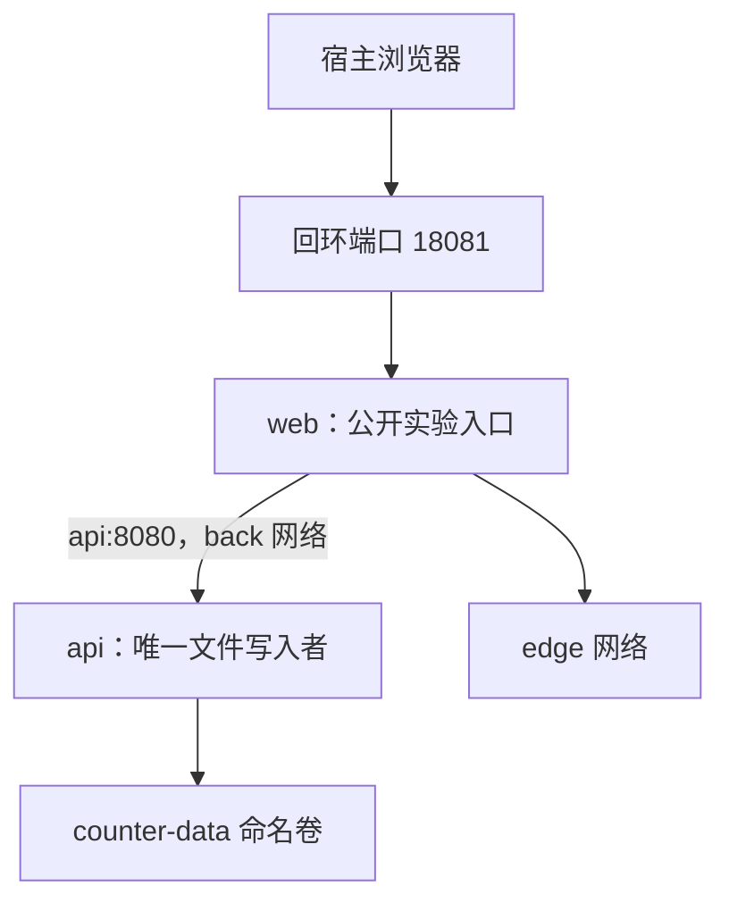

# 服务都启动了，为什么它们还是连不上

## DOCKER-02 Compose、网络、卷与环境隔离

Web、API、数据库各自都能运行，放进 Compose 后 API 却一直报连接失败。把地址从 localhost 改成服务名后恢复了，重建容器又发现数据不见了。这里有两个不同问题：请求从哪个网络空间发出，以及数据属于哪一个生命周期。

本讲先画通信与数据关系，再阅读 Compose 配置。完整例子使用 Web 网关和一个文件计数服务，帮助观察服务名、就绪条件与命名卷；数据库迁移与一致性备份另外解释，不把简单文件当成数据库替身。

### 学习前先确认

- 直接前置：[DOCKER-01 镜像、容器、Dockerfile 与构建缓存](../chinese-guides/docker-01-images-containers-dockerfile-cache.md#docker-01)。需要分清镜像、实例、入口与运行条件。
- 直接前置：[LINUX-02 进程、端口、日志与网络诊断](../chinese-guides/linux-02-process-port-log-network-diagnostics.md#linux-02)。需要按观察位置解释 DNS、监听和连接结果。

### 一、先画出服务和数据各自属于谁

**Docker Compose** 是定义和运行多容器应用的工具，将一组服务、网络、卷和运行配置组织在一起。其中 service 表示配置中的角色，container 是该角色的一次运行实例。一个 API 可以重建多次，但它管理的数据不应该因此自动获得一个全新的身份。



先明确谁需要访问谁。真实数据库场景可以是 web → api → db，只有 api 和 db 加入 data 网络，web 不加入；数据库无需发布宿主端口。网络分组限制通信范围，但不能替代数据库认证或应用授权。

Compose 适合清晰的本地、测试和单机拓扑。它本身不提供跨主机调度、主机故障自动接管或数据库高可用。资源都在同一台机器时，卷仍与主机共处一个故障域。

### 二、项目名决定哪些资源属于同一套环境

默认情况下，Compose 用 project name 给容器、网络和命名卷组织身份。测试分支若用了同一个项目名，可能操作同一批资源；项目名不同也不能避免两个项目争用同一个宿主端口。

示例统一使用 `-p atlas-b24-lab`，这样查看、停止和重建都指向同一实验。不要今天省略 -p、明天换目录后再 down，并假设仍在操作原项目。实际项目名的来源也可能是环境、配置或目录，关键是检查最终选择。

显式的资源 `name:`、external 网络/卷、固定 bind mount 路径及宿主端口可能跨项目共享；项目名前缀不是完整隔离证明。通常无需配置 `container_name`，服务发现用 service 名称，固定容器名反而会限制扩缩和并行环境。

清理先列资源与归属，保留回滚所需的卷和镜像。全局 prune 不是一个项目的退出步骤。

### 三、localhost 要连同观察位置一起读

| 发请求的位置 | 要访问的目标 | 本例地址 |
| --- | --- | --- |
| 宿主浏览器 | 发布出来的 Web | `http://127.0.0.1:18081` |
| web 容器 | 同一 back 网络中的 api | `http://api:8080` |
| api 容器自己 | 自己的健康端点 | `http://127.0.0.1:8080/healthz` |

web 中的 localhost 指向 web 自己，不是 api，也不是宿主。**服务发现（Service Discovery）**让同网络中的服务名解析到当前实例地址；实例重建后 IP 可以变化，所以不要把查到的 IP 永久写进配置。

**端口发布（Port Publishing）**将宿主地址端口连接到容器端口。容器间使用容器端口，通常不需要 ports。expose 是元数据，不是网络访问控制；同一网络的服务能否访问仍由监听与实际网络规则决定。

不写宿主绑定地址的 ports 可能对所有接口开放。本例仅绑定回环供学习，但真实边界仍要结合 Docker 版本、网络模式和宿主规则验证。Docker 与 UFW 的路径差异见 [LINUX-04](../chinese-guides/linux-04-server-security-ssh-users-firewall.md#七端口规则要同时说明来源与观察方向)。

### 四、同一个变量名可能在两个阶段生效

先有 Compose 读取 YAML 并插值，再有容器启动时获得 environment 或 env_file。用于插值的 `.env` 不会仅凭存在就把所有变量自动注入每个容器。

```yaml
# 说明片段，不是完整服务。
services:
  api:
    image: "${API_IMAGE:?请提供经过核对的镜像引用}"
    environment:
      LOG_LEVEL: "${LOG_LEVEL:-info}"
```

这里 API_IMAGE 参与选择镜像，LOG_LEVEL 被明确写入容器环境。`:-` 对未设置和空值使用默认；必须存在的生产值可以用 `:?` 拒绝缺失。shell、--env-file、多文件配置和容器 env_file 各有作用位置，先分阶段再查优先级。

Compose 中 `$$` 可保留一个 `$` 给后续命令，例如 CMD-SHELL 中让变量在容器 Shell 展开；exec 数组不自动经过 Shell，也就不会自行展开 `$NAME`。用 `docker compose config` 看合并与插值结果，必要时使用 `--environment` 查插值来源，但输出可能含敏感值，不能无差别上传。

secrets 可以按服务授权为文件提供内容，应用仍需主动读相应路径；本地 Compose secrets 不等于外部加密密钥库，宿主源文件和访问权限仍需管理。`_FILE` 形式的变量只在支持它的镜像或应用中有效。

### 五、启动依赖只约束一次启动过程

`depends_on` 的简单形式建立启动顺序，不保证被依赖服务已经能处理业务。`condition: service_healthy` 等待该服务定义的健康检查；`service_completed_successfully` 可表达一次性任务已成功完成。检查内容决定它证明到哪里。

数据库进程启动、数据库接受连接、应用账号可查询、迁移完成，是不同阶段。只运行端口探测不能证明表结构已准备。迁移可以是受协调的一次性任务，但多副本不能各自无锁执行同一危险变更。

运行中依赖仍可能退出、重建或超时，消费者需要自己的连接恢复和有限重试。`depends_on` 下的 `restart: true` 与服务顶层的 restart policy 不同，前者涉及显式 Compose 操作导致的依赖更新，不意味着任何依赖崩溃都会自动级联重启。

unhealthy 也不同于进程退出。不要把健康状态标签、进程重启和流量就绪当成同一个保证。相关生命周期见 [DOCKER-01](../chinese-guides/docker-01-images-containers-dockerfile-cache.md#十端口健康状态和重启不是一个开关)。

### 六、完整实验先给服务一个明确的数据合同

在新目录保存本节的 service.mjs 和下一节的 Dockerfile、compose.yaml。需要 Node.js 22 与支持所用字段的现代 Compose v2。API 只管理一个非敏感计数，只有一个进程写它；没有认证、事务数据库或多副本协调，端口只用于本机实验。

```js example=docker02-service runtime=project file=service.mjs
import http from 'node:http';
import { readFile, writeFile, rename, mkdir } from 'node:fs/promises';
import { join } from 'node:path';
const role = process.env.ROLE ?? 'api';
if (!['api','web'].includes(role)) throw new Error('ROLE 无效');
const port = Number(process.env.PORT ?? 8080);
if (!Number.isInteger(port) || port < 0 || port > 65535) throw new Error('PORT 无效');
const dataDir = process.env.DATA_DIR ?? './counter-data';
const file = join(dataDir, 'counter.txt');
let count = 0;
let queue = Promise.resolve();
if (role === 'api') {
  await mkdir(dataDir, { recursive:true });
  let raw;
  try { raw = await readFile(file, 'utf8'); }
  catch (error) {
    if (error.code !== 'ENOENT') throw error;
    await writeFile(file, '0\n', { flag:'wx' });
    raw = '0';
  }
  if (!/^\d+\s*$/.test(raw) || !Number.isSafeInteger(Number(raw))) throw new Error('计数文件无效，拒绝覆盖');
  count = Number(raw);
}
const upstream = role === 'web' ? new URL(process.env.UPSTREAM ?? 'http://api:8080') : null;
const send = (response, status, body) => {
  response.writeHead(status, { 'content-type':'application/json; charset=utf-8', 'cache-control':'no-store' });
  response.end(JSON.stringify(body));
};
const server = http.createServer((request, response) => {
  if (request.method === 'GET' && request.url === '/healthz') { send(response, 200, { ready:true, role }); return; }
  const read = request.method === 'GET' && request.url === '/counter';
  const increment = request.method === 'POST' && request.url === '/increment';
  if (!read && !increment) { send(response, 404, { error:'未知操作' }); return; }
  if (role === 'web') {
    void (async () => {
      try {
        const result = await fetch(new URL(request.url, upstream), { method:request.method, signal:AbortSignal.timeout(2000) });
        const body = await result.json();
        send(response, result.status, body);
      } catch { send(response, 502, { error:'未取得 API 结果；写入结果可能未知' }); }
    })();
    return;
  }
  if (read) { send(response, 200, { count }); return; }
  queue = queue.then(async () => {
    if (!Number.isSafeInteger(count + 1)) throw new Error('计数超出范围');
    const next = count + 1;
    await writeFile(join(dataDir, 'counter.next'), `${next}\n`);
    await rename(join(dataDir, 'counter.next'), file);
    count = next;
    send(response, 200, { count });
  }).catch(() => send(response, 500, { error:'计数未确认，请查询当前值' }));
});
server.listen(port, process.env.HOST ?? '0.0.0.0', () => {
  console.log(JSON.stringify({ event:'listening', role, port:server.address().port }));
});
let stopping = false;
const stop = () => {
  if (stopping) return;
  stopping = true;
  const deadline = setTimeout(() => { server.closeAllConnections(); process.exit(1); }, 5000);
  deadline.unref();
  server.close(() => {
    void queue.finally(() => { clearTimeout(deadline); process.exitCode = 0; });
  });
};
process.on('SIGTERM', stop);
process.on('SIGINT', stop);
```

API 在读取并验证文件之后才监听，因此本例健康检查至少表明初始化完成。计数增加在本进程内串行处理，临时文件替换避免读到半个文本；它没有 fsync 持久性协议，也不支持多个写入者，不能当成生产计数器或交易存储。

网关不会自动重试 POST。超时后 API 可能已完成写入，只是结果没到达网关；再次增加会产生新效果。查询当前计数只能帮助观察，不能在并发环境中证明某个特定意图是否完成，生产需要 [BIZ-07 的操作身份与恢复](../chinese-guides/biz-07-errors-idempotency-eventual-consistency.md#biz-07)。

### 七、再用 Compose 连接网络、用户与存储

`Dockerfile` 创建由 node 用户拥有的数据目录，程序文件仍由 root 管理：

```dockerfile example=docker02-image runtime=project file=Dockerfile
# syntax=docker/dockerfile:1
FROM node:22-bookworm-slim
WORKDIR /app
COPY --chown=0:0 service.mjs ./
RUN mkdir /data && chown node:node /data
USER node
ENV PORT=8080 HOST=0.0.0.0
CMD ["node", "service.mjs"]
```

同样，基础 tag 是教学默认，发布时应替换成已经验证的平台与 digest。compose.yaml 如下：

```yaml example=docker02-topology runtime=project file=compose.yaml
x-runtime: &runtime
  build: .
  init: true
  read_only: true
  cap_drop: [ALL]
  security_opt: [no-new-privileges:true]
  restart: "no"
  stop_grace_period: 8s
  mem_limit: 128m
  cpus: 0.5
  pids_limit: 64
  logging:
    driver: local
    options:
      max-size: "10m"
      max-file: "3"

services:
  web:
    <<: *runtime
    environment:
      ROLE: web
      UPSTREAM: http://api:8080
    ports:
      - "127.0.0.1:18081:8080"
    networks: [edge, back]
    depends_on:
      api:
        condition: service_healthy
    healthcheck:
      test: [CMD, node, -e, "fetch('http://127.0.0.1:8080/healthz',{signal:AbortSignal.timeout(1500)}).then(r=>process.exit(r.ok?0:1)).catch(()=>process.exit(1))"]
      interval: 5s
      timeout: 2s
      retries: 3
  api:
    <<: *runtime
    environment:
      ROLE: api
      DATA_DIR: /data
    volumes:
      - counter-data:/data
    networks: [back]
    healthcheck:
      test: [CMD, node, -e, "fetch('http://127.0.0.1:8080/healthz',{signal:AbortSignal.timeout(1500)}).then(r=>process.exit(r.ok?0:1)).catch(()=>process.exit(1))"]
      interval: 5s
      timeout: 2s
      retries: 3
      start_period: 5s

networks:
  edge: {}
  back:
    internal: true
volumes:
  counter-data: {}
```

API 没有 ports，web 通过 back 网络的服务名访问它。back 的 internal 属性限制该网络的外部连接，但 web 同时加入 edge，仍可能具备外部通信能力；双网服务不是“整个系统无出站”的证明。

首次使用空命名卷时，Docker 的初始化行为与挂载点元数据影响目录权限。已存在的卷不会因为重建镜像就自动重置 owner；若无法写入，检查实际卷、UID/GID 和挂载，不要用全局 777 掩盖问题。

为这个新目录添加 `.dockerignore`，内容为 `*`，以及分别一行 `!Dockerfile`、`!.dockerignore`、`!service.mjs`。本机实验产生的 counter-data 或备份就不会被构建上下文顺手带走。

### 八、从浏览器入口验证重建后的数据

```bash
docker compose version
docker compose -p atlas-b24-lab config --quiet
docker compose -p atlas-b24-lab up -d --build --wait
docker compose -p atlas-b24-lab ps
curl --noproxy '*' --connect-timeout 2 --max-time 5 http://127.0.0.1:18081/counter
curl --noproxy '*' --connect-timeout 2 --max-time 5 -X POST http://127.0.0.1:18081/increment
```

全新卷的计数从 0 开始，POST 后变成 1。已有实验卷可能保留旧计数，不要因此自动清空。然后只重建 API：

```bash
docker compose -p atlas-b24-lab up -d --no-deps --force-recreate api
curl --noproxy '*' --connect-timeout 2 --max-time 5 http://127.0.0.1:18081/counter
docker compose -p atlas-b24-lab logs --since 5m --tail 80 api web
```

等待 API 重新就绪后，原计数应保留。这里 `--no-deps` 不保证网关永远无中断，短暂 502 需要结合日志解释；可重复读取，不能为了“直到成功”盲目重放写入。

再把 web 的 UPSTREAM 在一份实验覆盖配置里改成 `http://127.0.0.1:9999`，重建 web 并只请求 GET /counter。web 会尝试连接自己容器里的 9999，若那里没有服务，就应返回 502。API 仍然健康，说明依赖本身正常与消费者地址正确需要分别验证。恢复原配置并重建 web 后，再读取原计数。

这些是目标环境中的预期观察；在没有 Docker Engine 的机器上运行 Node，只能验证应用逻辑，不能据此证明服务 DNS、internal 网络、卷、限制或启动条件生效。

### 九、卷保留数据，备份提供另一条恢复路径

**命名卷（Named Volume）**独立于单个容器的可写层。重建容器并重新挂载同一个卷，可以继续读取数据；应用误删也会真实地改这个卷，所以“有卷”不等于“有备份”。

| 操作 | 一般用途与数据影响 |
| --- | --- |
| stop / start | 停止和重新启动已有容器 |
| up 触发重建 | 更换容器，命名卷可继续挂载 |
| down | 移除该项目容器和相应网络；默认保留命名卷 |
| down -v | 还会删除相应命名卷及匿名卷；external 卷另有生命周期 |

匿名卷虽然可能在容器删除后留下，但缺少稳定引用，后续 up 不一定重新挂载它。数据库或重要文件应明确命名与归属，而不是靠残留卷碰运气。

这个单写入者计数实验可先停止 API，再导出 counter.txt，恢复到**另一个新卷**后启动并比较计数；保留原卷直到恢复验证完成。真实数据库要使用数据库支持的一致性备份或受控快照，运行中随手 tar 数据目录可能得到不一致副本。

备份需有独立故障域、访问控制、保留与恢复演练。恢复旧数据可能丢失备份之后的写入，RPO/RTO 应从业务目标倒推，不能只看文件校验相同就宣称所有用户操作都已恢复。

### 十、挂载与覆盖文件会改变你以为的镜像

**Bind Mount** 把宿主路径提供给容器，可覆盖同一路径原先的镜像内容；并不是把目录自动合并成一个更完整的目录。开发时把源码挂到 `/app`，可能把镜像里安装好的文件一起遮住，导致“镜像中明明有，容器里却没有”。

只读挂载能限制这个挂载点的写入，但不能限制进程通过其他路径操作。宿主路径还受平台、文件共享与权限影响，Docker Desktop 的行为不能直接替代原生 Linux 主机结论。不要把 Docker socket 当成普通开发配置文件挂给应用。

多份 Compose 文件合并也不是简单“最后一份全部替换”。某些映射会合并，ports、volumes 等还有特定规则；基础文件的公开端口可能继续存在。相对路径通常以第一份配置文件为基准，阅读最终 config 才能确认实际对象。[Compose 合并规则](https://docs.docker.com/compose/how-tos/multiple-compose-files/merge/)

开发与生产可使用不同覆盖，但最终生产配置要确认没有源码写挂载、调试端口和示例凭据。修改 environment 后只 restart 不会重新创建容器以应用新配置，应按所需变更执行 up 并检查实际结果。

### 十一、服务失效以后，由应用决定怎样继续

服务 DNS 给出地址，不保证已有长连接自动迁移。API 重建后，消费者需要识别断开、重新解析与建连；依赖恢复时要限制重试预算，避免所有实例一起冲击服务。协议层的恢复见 [LINUX-02](../chinese-guides/linux-02-process-port-log-network-diagnostics.md#十二用最小修复回答完整问题)。

内存、CPU、PID、文件描述符和磁盘限制要查看实际容器状态，不能只看 YAML 中有几个字段。本例限制用于小实验，不是生产容量建议。宿主空闲也不证明容器没达到自己的限制；日志与数据卷同样消耗宿主资源。

日志应包含 service、实例、时间和请求上下文，并设置轮转。检查之前先限定时间与行数，避免输出秘密或海量正文。重启策略能恢复部分退出故障，也可能反复触发错误配置；记录最早错误，而不是只看最后一个“starting”。

### 十二、升级与回滚要带着数据版本一起考虑

生产运行应优先使用已验证的制品摘要，避免在目标机临时重新构建不同字节。变更记录包括镜像、Compose 输入、非敏感环境、卷与 schema 版本。回滚旧应用前，先问旧代码能否读取当前数据结构。

一次性迁移任务可以阻止未准备的 API 开始服务，但“迁移命令成功”不等于任意旧版本仍兼容。需要约定前后兼容窗口、幂等策略、并发控制和恢复方式。测试 seed 与生产初始化分别管理，不把示例账号作为默认生产事实。

结束这个实验可执行 `docker compose -p atlas-b24-lab down`，保留数据以便下次继续。若确实需要删除卷，先确认最终项目与卷名、数据归属和恢复需求，再单独执行明确的清理；不要把 `down -v` 藏在通用启动脚本里。

### 动手想一想

API 容器删除后计数仍在，宿主磁盘损坏后却无法恢复，这与“卷能持久化”矛盾吗？两个不同 project name 使用同一个显式 external 卷，又是否真正实现了环境隔离？

最后读一遍配置：谁有 ports、谁加入 back、谁能写 /data、healthcheck 证明了什么。能用实际地址与路径回答这些问题，Compose 才不再是一份需要背诵的 YAML。

### 参考与延伸阅读

- [Compose networking](https://docs.docker.com/compose/how-tos/networking/)：项目网络、服务名和实例替换。
- [Startup order](https://docs.docker.com/compose/how-tos/startup-order/)：依赖、健康和一次性完成条件。
- [Variable interpolation](https://docs.docker.com/compose/how-tos/environment-variables/variable-interpolation/)：插值来源与默认值。
- [Compose secrets](https://docs.docker.com/compose/how-tos/use-secrets/)：按服务授予文件访问。
- [Docker volumes](https://docs.docker.com/engine/storage/volumes/)：初始化、挂载、生命周期和备份。
- [Merge Compose files](https://docs.docker.com/compose/how-tos/multiple-compose-files/merge/)：合并规则与相对路径。
- [Compose services reference](https://docs.docker.com/reference/compose-file/services/)：端口、健康、重启与运行约束。
