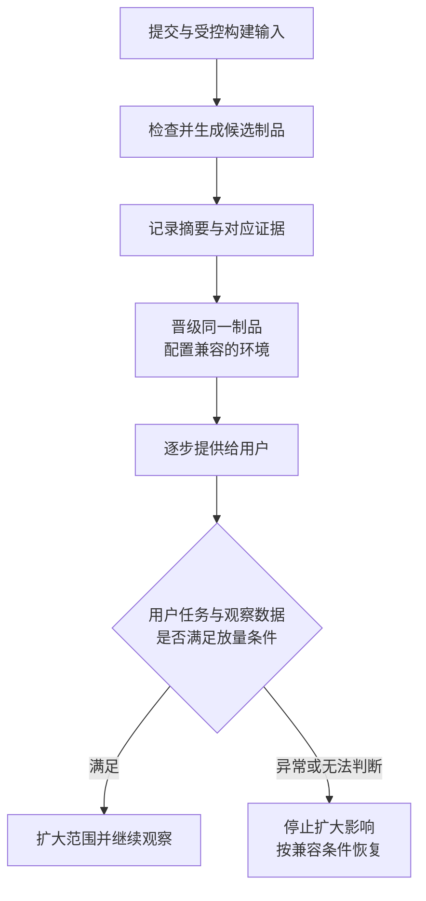

# 从候选版本到用户恢复

## ENG-06 CI/CD、制品晋级、发布与回滚

周一，资料站上线了新的学习进度面板。流水线全绿，首页也能打开。十分钟后，却有人反馈：昨天一直没关闭的页面，点击“查看统计”就白屏。另一位同事决定回滚，结果旧服务读不懂新版本写入的数据。

这两个问题有共同点：发布涉及同时存在的新旧页面、服务、配置和数据，远比“把代码复制过去”复杂。本篇沿着一份候选版本走一遍交付过程，解释怎样确定上线对象、限制影响范围，以及出现异常后怎样恢复用户任务。

### 学习前先确认

- 直接前置：[GIT-03 提交、远端、PR 与 worktree 协作](../chinese-guides/git-03-commits-remotes-pr-worktrees-collaboration.md#git-03)。能区分提交身份、分支名称与一次合入。
- 直接前置：[TEST-03 E2E、视觉回归、隔离与不稳定性治理](../chinese-guides/test-03-e2e-visual-regression-isolation-flakiness.md#test-03)。能判断关键路径检查究竟验证了什么。
- 直接前置：[TEST-04 API 契约兼容与消费者驱动契约测试](../chinese-guides/test-04-api-contract-consumer-driven-testing.md#test-04)。理解独立发布的消费者与提供者为什么要保留兼容窗口。

### 一、CI、持续交付和持续部署各管哪一段

**持续集成（Continuous Integration，CI）**是频繁合入小变更，并及时检查这些变更能否一起工作。假设两个人分别调整进度接口和页面，自己的分支都能构建，合到一起却把 `completed` 和 `finished` 两个字段名对错了。CI 的价值是尽早暴露组合问题，而不只是远程执行一次本地命令。

**持续交付（Continuous Delivery）**进一步把通过检查的版本准备成可部署的候选制品，使生产发布成为一个有明确输入和步骤的决定。**持续部署（Continuous Deployment）**则允许满足既定策略的变更自动进入生产。二者并不由“用了哪种平台”决定；持续交付可以保留人工发布决定，自动部署也必须有停止与恢复办法。

先分清三个结果：“检查通过”说明预先设计的判断成立；“部署完成”说明目标环境接受了变更；“发布有效”还要看用户能否完成任务。一个接口始终返回 200，却把进度保存到了错误课程，前两个结果仍可能成立。



图中的观察是发布的一部分。不能把它当作部署结束后可有可无的附加工作。

### 二、提交、构建运行和制品不是同一个身份

提交 SHA 标识仓库中的提交；运行 ID 标识一次构建尝试；制品摘要标识实际产物的字节内容。版本号和 tag 方便人阅读，但它们是否可被重新指向，要看存储系统与权限规则。

同一提交可能构建两次：第一次依赖镜像 A，第二次拉到了同名 tag 的镜像 B；也可能在产物中嵌入了当前时间。此时提交相同，产物却不同。反过来，不影响构建结果的文档修改也可能产生相同的应用文件。不能仅用提交号代替制品身份。

一份发布记录至少需要把以下对象连起来：

| 记录 | 回答的问题 | 示例中的含义 |
| --- | --- | --- |
| 源码提交、工作流版本 | 从哪里、按什么流程构建 | 已合入的主线提交与构建逻辑 |
| 运行 ID、工具与依赖输入 | 哪一次执行得到它 | 第 208 次构建，固定锁文件与运行时 |
| 制品摘要、存储位置 | 实际使用哪份内容 | 对归档文件计算的 SHA-256 |
| 检查报告 | 对什么对象得出什么结论 | 契约报告对应同一候选版本 |
| 环境、配置版本、时间、操作者 | 在哪里改变了什么 | 生产配置第 12 版，灰度 5% |

摘要只回答“内容有没有变”。如果有人同时替换了制品和你用来比较的摘要，它本身无法证明来源可信。来源与构建身份要结合 [ENG-08 的证据对象与信任关系](../chinese-guides/eng-08-software-supply-chain-sbom-provenance.md#四不同证据必须对上同一个对象)理解。

### 三、用一个小实验看懂“构建一次，逐级晋级”

**制品（Artifact）**是构建后准备交付的结果，例如静态文件归档或容器镜像。晋级的含义是让已经验证的同一份内容进入下一个环境，不是在每个环境重新构建一份“应该差不多”的结果。

下面是完整 Node.js 示例。保存为 `artifact-identity.mjs`，执行 `node artifact-identity.mjs`。它只在内存中复制字节，不写文件，也不连接发布平台。

```js example=release-artifact-identity runtime=project file=artifact-identity.mjs
import { createHash } from 'node:crypto';

const digest = (bytes) => createHash('sha256').update(bytes).digest('hex');
const candidate = Buffer.from('export const release = "lesson-v2";\n');
const reviewedDigest = digest(candidate);
const staging = Buffer.from(candidate);
const production = Buffer.from(staging);

console.log('晋级副本一致：', digest(production) === reviewedDigest);
const rebuilt = Buffer.from(candidate.toString() + '// rebuilt later\n');
console.log('重新构建仍一致：', digest(rebuilt) === reviewedDigest);
console.log('只读入原字节：', production.equals(candidate));
```

输出依次为 `true`、`false`、`true`。多了一个注释，语义可能没变，字节身份已经改变。真实流水线应从受保护的报告或可信制品记录取预期摘要，下载后核对；该内存实验只演示内容身份，不提供签名验证和仓库访问控制。

环境差异如何处理？可以把公开运行配置作为独立、可追踪的输入，例如 API 基地址和功能开关版本。它仍需和应用一起验证。前端代码最终会交给浏览器，构建变量、运行配置都不能藏住服务器秘密。如果环境值已编译进 JS，就应承认不同环境产生了不同制品，分别记录与验证，不能声称原样晋级。

“可重现构建”强调在约定输入和环境下重新得到相同产物，常见目标是逐字节一致。锁文件、固定工具、受控时间与依赖来源都影响它；命中构建缓存不能证明可重现。镜像层面的区别见 [DOCKER-01 的 tag 与 digest](../chinese-guides/docker-01-images-containers-dockerfile-cache.md#二tag-是名字digest-才对准具体内容)。

### 四、门禁要区分通过、失败和没有证据

**门禁（Gate）**是决定某一步是否可以继续的条件。它应对应具体风险：接口变更看兼容证据，静态资料更新看内容结构和实际产物，涉及迁移时看新旧版本与数据的组合。重复执行很多相同检查，不会自动填补缺失的兼容验证。

最容易漏掉的状态是“未完成”：检查被取消、超时，或者报告没有生成。另一个状态是“不适用”，例如纯文案更新确实不涉及数据库。这两者必须分开。不适用需要事先定义的适用规则和原因，不能把一切没运行都当成通过。

下面的纯函数把未知状态显式留下。数组内数值与阈值是教学设定。

```js example=release-gate-states
function decide(gates) {
  if (gates.some((gate) => gate.state === 'fail')) return 'block';
  const cleared = gates.length > 0 && gates.every((gate) =>
    gate.state === 'pass' ||
    (gate.state === 'not-applicable' && gate.approvedScope === true));
  return cleared ? 'ready' : 'unknown';
}
console.log(decide([{ state: 'pass' }, { state: 'unknown' }])); // => unknown
console.log(decide([{ state: 'pass' }, { state: 'fail' }])); // => block
console.log(decide([{ state: 'not-applicable', approvedScope: true }])); // => ready
console.log(decide([])); // => unknown
```

`ready` 只是这组门禁允许进入下一阶段，不等于系统永远安全。函数也没有验证报告是否对应当前制品、是否过期；真实系统还要检查报告主体与有效期。部署审批后如果候选版本或环境状态变了，原审批不能被悄悄套到新对象上。

### 五、构建权限与部署权限要分开

PR 中的脚本、依赖安装钩子和构建插件都能执行代码。给它们生产凭据，等于让尚未获得信任的代码触及生产环境。高权限流程即使由可信仓库定义，只要签出并运行不可信 PR 内容，仍可能跨越这个边界。

可以把验证任务放在低权限环境中，把部署任务限制在受保护分支和明确的部署环境。GitHub Actions 的 environment 可以关联审批、分支限制和环境秘密，但具体保护规则需要配置，功能可用性也要按仓库与套餐核对；单写一个 `environment: production` 不会自动完成全部保护。

**短期凭据（Short-lived Credentials）**减少长期秘密的暴露窗口，但只有身份条件和权限范围正确才有意义。若使用 OIDC 交换云端身份，应限制仓库、工作流、分支或环境、受众和可执行操作。它不意味着任意工作流都应获得云账号权限。

第三方 action、构建器镜像和下载脚本也是执行链的一部分。固定可信版本、审核权限变化，并避免把令牌打印进日志或打包进制品。source map 可以用于诊断，但应关联版本并受控存储；“前端没有业务秘密”不等于可以公开所有内部路径与源码注释。

### 六、并发取消和生产互斥解决不同问题

分支上连续推送三次，通常只需要最新提交的验证结果，取消旧检查可以节省时间。但“停止旧任务”不是“撤销它已经做的事情”。旧任务若刚执行完迁移、正在切换流量，取消后可能留下中间状态。

因此，验证任务可以采用淘汰旧运行的策略；生产变更通常需要按目标环境串行执行或使用有明确所有者的锁。GitHub Actions 的 concurrency 用于限制同组并行；默认的待运行任务可能被更新的任务替换。当前平台也提供显式启用排队的方式，是否启用、队列边界和取消规则都应核对实际配置。限制并发本身不等于获得了可靠的业务发布队列，更不能依赖任务取消自动恢复业务。

还有一种更隐蔽的竞争：A 预览时看到生产是 v1；B 先发布到 v2；A 随后按旧计划发布 v3，覆盖了 B 的变更。提交时需要重新检查预期的当前版本，或者比较部署状态的 revision。发现已变化，就重新准备计划。

```js example=release-expected-revision
function switchVersion(current, expectedRevision, next) {
  if (current.revision !== expectedRevision) {
    return { state: 'stale-plan', current };
  }
  return { state: 'applied', current: {
    revision: current.revision + 1, release: next
  } };
}
const current = { revision: 8, release: 'v2' };
console.log(switchVersion(current, 7, 'v3').state); // => stale-plan
console.log(switchVersion(current, 8, 'v3').current.release); // => v3
```

这是比较预期版本的单进程模型。多实例发布控制器需要由持久存储提供原子的比较与更新，不能把两次普通读写拼起来宣称实现了并发保护。

### 七、灰度发布要定义“谁看到哪个版本”

**灰度发布（Canary Release）**先让一部分流量使用新版本，观察后再扩大范围。它的价值来自限制早期影响，而不只是把流量比例写成 5%。

一次请求随机命中新版、下一次又命中旧版，可能使同一用户经历不一致的协议和界面。需要先确定分组单位：账号、租户、会话还是请求。资料站的新交互通常更适合稳定会话分组；租户数据模型变化可能需要整个租户一起切换。分组也不是授权，新版本入口仍须经过原有权限检查。

**蓝绿发布（Blue-green Deployment）**准备两套环境，切换入口；滚动发布则逐步替换实例。蓝绿便于切流量，却不自动复制或倒退共享数据库。滚动发布要求新旧实例同时兼容请求与数据。哪种方法合适，取决于状态在哪里，以及切换期间允许哪些组合存在。

**功能开关（Feature Flag）**可以把代码部署和功能开放分开：代码已上线，但仅内部会话开启新统计。它仍需定义默认值、失败时行为、负责人和删除时间。开关关闭后如果后台迁移已发生，数据不会跟着倒退；长期保留大量开关还会增加需要理解的状态组合。

### 八、先写停止条件，再等待曲线变好

放量前要知道观察哪些信号、看多久、样本不足怎么办。以保存进度为例，可以看持久化成功率、延迟、重复写入和旧页面资源错误，并与同期旧版分组比较。只看 CPU 或首页 200，无法覆盖这些问题。

假设教学策略要求灰度组至少有 200 次有效任务、连续观察十分钟，错误率不高于设定上限。这些数值不是行业通用标准；低流量站点可能一天都凑不够样本。此时结论是证据不足，可以保持小范围、补充合成关键路径或由负责人明确决定下一步，不能把零样本算成零错误率。

遥测停止上报也应阻止继续放量：曲线归零可能代表没有错误，也可能代表采集器坏了。先检查事件新鲜度、有效分母与采样规则，再解释健康信号。具体统计口径见 [OBS-01 的 SLI 与错误预算](../chinese-guides/obs-01-frontend-observability-slo-alerting-privacy.md#八先写清分母再计算-slo-与错误预算)。

记录放量时刻、制品摘要、配置和分组规则，让异常能回到具体变更。总量没变不代表所有人都正常：新版本占比低时，一个严重灰度故障可能被大量旧版成功请求稀释。

### 九、数据迁移决定旧版本能否回来

假设旧版读取 `progress`，新版想改为 `progress_percent`。直接改列名后，即使把应用切回旧镜像，旧程序仍然读不到原列。回滚失败的根源是数据约定发生了不可兼容变化。

**扩展后收缩（Expand-contract）**把一次破坏性变更拆成有兼容窗口的步骤。先增加新字段，使仍在运行的旧版能够继续工作；再发布能处理过渡数据的程序，完成回填和读写校验；确认旧消费者退出后，才移除旧字段或旧语义。具体双写、回填和切读方案取决于数据库与一致性要求，双写本身也可能失败，不能只画两个箭头就假设完成。

| 阶段 | 应用组合 | 数据形态 | 恢复时需要确认 |
| --- | --- | --- | --- |
| 扩展 | 旧版与过渡版共存 | 旧字段保留，新字段可空 | 旧版仍可读写 |
| 切换 | 过渡版与新版共存 | 回填已核对，读写规则明确 | 回退版本理解现有数据 |
| 收缩 | 仅剩新版 | 旧约定被移除 | 早期旧版可能已不可用 |

备份是恢复手段，但恢复备份会涉及时间窗口内的新写入、关联服务和业务补偿。应先判断数据修复的损失与影响，不能把“有备份”写成无成本撤销。容器层的例子可接着看 [DOCKER-02 的升级与数据版本](../chinese-guides/docker-02-compose-network-volumes-environments.md#十二升级与回滚要带着数据版本一起考虑)。

### 十、前端发布必须照顾已经打开的旧页面

用户在 09:00 打开 v1 页面，页面保存着 v1 的模块地址；09:10 部署 v2；09:15 用户首次打开一个懒加载面板，浏览器才请求 `stats.v1hash.js`。若部署时清空了旧资源目录，这个请求会 404，即使 v2 首页完全正常。

带内容 hash 的资源适合长期缓存，前提是同一 URL 的内容保持不变，并且服务端在兼容期继续保留旧 URL。先上传新资源，再发布引用它们的新 HTML；保留旧资源，直到回滚与长会话的支持窗口结束。窗口需要结合会话时长、缓存、资源成本制定，而不是默认“留一个版本就够”。

HTML 入口、运行配置、带 hash 的 JS/CSS 应采用不同缓存策略。CDN 清理成功也不会主动替换所有已经运行的页面。若使用 Service Worker，还多了一层缓存和激活生命周期，需要一并考虑。

捕获动态导入失败后可以提示发现新版本，但不应无限刷新。用户可能有未保存内容，也可能只是网络暂时断开；先提供保存、重试或确认更新的路径。请求分类与资源保留见 [DEPLOY-01 的发布顺序](../chinese-guides/deploy-01-nginx-static-assets-reverse-proxy-https-cdn.md#十一让新旧页面都能找到自己的资源)。

### 十一、回滚是恢复方案中的一种动作

**回滚（Rollback）**通常指把代码、配置或流量切回已知版本。它不保证删除新数据、取消已发送的邮件，或撤销第三方扣款。判断是否恢复，要重新观察用户任务，而不能只读取部署命令的退出码。

遇到故障时，先停止继续放量，保留请求与版本证据，再选影响较小的措施：关闭新功能、切回兼容版本、修正配置，或者发布前向修复。若旧版无法处理当前数据，强行回滚可能比修复新版本更危险。

对于“保存已执行但响应丢失”，不要借回滚盲目重放写入。先按业务操作身份查询状态，再决定重试或补偿；这与 [BIZ-07 的结果未知问题](../chinese-guides/biz-07-errors-idempotency-eventual-consistency.md#biz-07)是一件事在发布场景中的延伸。

恢复后仍要观察一个足够覆盖原故障的窗口：旧页面再次打开统计是否成功，未完成任务是否可以继续，新写入是否仍然正确。服务活着、流量恢复、业务恢复应分开记录。

### 十二、把一次发布留下的信息变成下一次的帮助

一条有用的发布记录可以写成：“候选制品 X，在配置 C 下先向会话组 G 开放；10:20 发现旧资源错误增加，10:22 停止放量，10:25 恢复旧资源；新旧页面的统计任务恢复，数据没有迁移。”这比“v2 发布失败，已处理”更容易用于后续定位。

定期回看失败变更、恢复用时、交付等待和重复人工步骤，是为了发现系统瓶颈。若把“部署次数越多”变成单独目标，就可能鼓励把一次合理变更拆成无意义的小发布；若只追求零失败，又可能让重要更新一直滞留。

真正值得减少的是无价值等待和不可解释的状态。例如自动记录制品与配置，能降低现场找版本的时间；针对曾发生的旧资源 404 增加一个小检查，往往比再复制一整套通用测试更有帮助。检查成本应服务于风险，而不是为了让流水线看起来复杂。

读完后，可以回到开头的两次故障：旧页面白屏需要资源兼容窗口，旧服务读不懂数据需要迁移兼容窗口。两者都不能靠一次“构建成功”提前证明。

### 带着问题回看

- 测试与生产的提交号相同，产物摘要不同，能否说晋级了同一制品？还应查哪些输入？
- 取消发布任务后，迁移已经完成、流量尚未切换，下一次执行应从什么状态开始判断？
- 灰度组没有错误事件，也没有成功事件，为什么不能继续放量？
- 新版只改变前端，为什么仍要保留旧静态资源和后端兼容窗口？

### 参考与延伸阅读

- [GitHub Actions：部署环境](https://docs.github.com/en/actions/concepts/workflows-and-actions/deployment-environments)：查环境保护规则、部署记录和秘密可用阶段。
- [GitHub Actions：并发](https://docs.github.com/en/actions/concepts/workflows-and-actions/concurrency)：查并发组与运行限制；不要据此假设数据库回滚或持久队列。
- [GitHub Actions：制品证明](https://docs.github.com/en/actions/concepts/security/artifact-attestations)：理解内容身份之外的来源证明。
- [MDN：HTTP 缓存](https://developer.mozilla.org/en-US/docs/Web/HTTP/Guides/Caching)：补充入口更新与不可变资源的缓存机制。
- [Google SRE：基于 SLO 的告警](https://sre.google/workbook/alerting-on-slos/)：进一步设计放量观察与停止信号。
