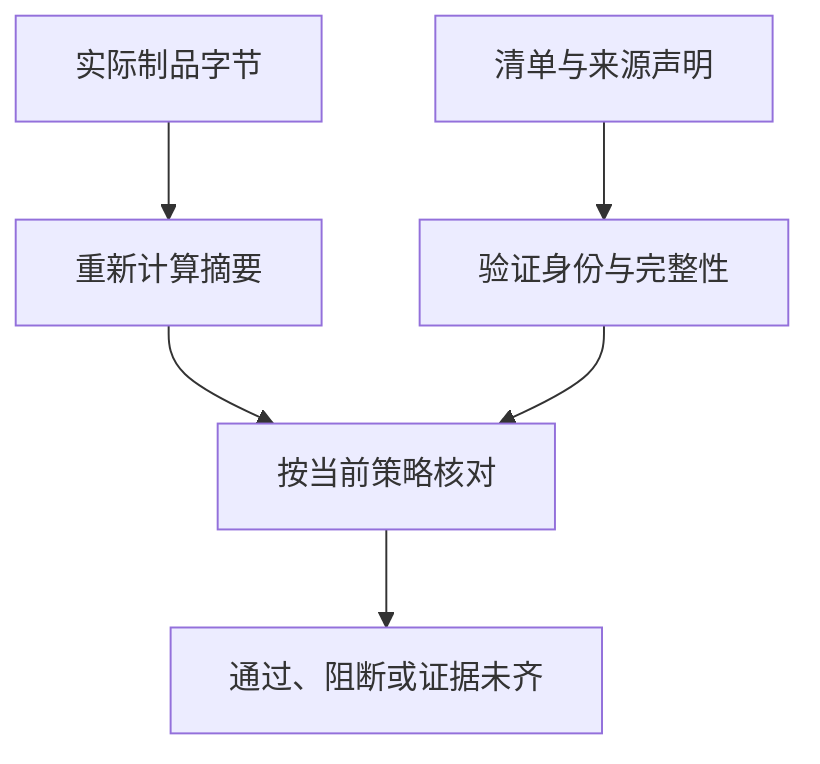

# 扫描通过了，为什么还不能发布这份文件

## ENG-08 软件供应链、SBOM 与制品可信

流水线显示“没有高危漏洞”，发布目录也有一个叫 `app.zip` 的文件。但这份文件是不是刚才扫描的那份？里面用了哪些直接和间接依赖？谁生成了它？一周后某个依赖被发现有问题，能否找到仍在使用它的历史版本？

这些问题没有一个总分能够一起回答。软件供应链关注从源码、依赖、构建到分发的整条路径。本讲用一份前端制品串起身份、清单、来源和消费端判断，配合小模型与真正的本地签名实验，说明每种证据能证明什么。

### 学习前先确认

- 直接前置：[ENG-03 依赖与 lockfile](../chinese-guides/eng-03-dependencies-lockfile-workspaces-peer.md#eng-03)。本讲直接使用依赖图、注册表、生命周期脚本、固定解析与版本管理。

### 一、先确定要交付的是哪一份字节

**制品摘要（Artifact Digest）**是对具体制品字节计算的摘要。文件名、版本号、下载路径和可移动标签是查找入口，不足以单独证明内容身份。两个文件都叫 `app.zip`，其中一个可能已经重建或被替换。

例如测试环境扫描了制品 A，生产阶段重新执行安装与构建，得到 B。即使源提交相同，时间戳、远程下载、工具版本或构建参数变化，也可能让字节不同。不能直接把 A 的扫描结论贴在 B 上。

先画实际链路：源码与锁文件进入构建，构建读取工具和材料，产出制品，制品进入存储并被部署。每一段确认谁能改变输入、用什么身份执行、生成什么不可变标识。远程脚本、字体、图片、基础镜像和 CI 插件也可能进入交付范围，不只有 npm 包。

如果环境配置在构建时改变字节，就将它视作构建输入，为每个结果生成各自摘要；如果配置在运行时独立提供，则分别管理代码制品和配置版本。关键是测试对象与消费对象的对应关系能解释清楚。

### 二、锁住解析结果，还要审查来源和执行能力

lockfile 固定实际解析的版本和完整性信息，冻结安装可发现清单与锁记录不一致。它不能证明锁进去的版本无恶意逻辑，也不能保证整个构建没有读取未记录的远程输入。

新增包先确认是否确实需要，再核对官方来源、命名空间、维护状态、安装脚本、传递依赖和替代方案。内部包应明确 registry 和 scope，避免把私有名称错误地解析到同名公网包。来源发生变化，即使版本号没变，也值得解释。

生命周期脚本有执行代码的能力。按项目所用包管理器版本限制或审批脚本，记录必要的例外；不要复制一个过时开关就宣称所有安装脚本都已关闭。构建时的秘密与网络权限也需要收敛。

可复现安装、可复现构建与可信构建是不同概念。锁文件一致不等于最终字节必然相同；字节可复现也不代表源码本身安全。每种控制应对应明确风险，而不是互相替代。

### 三、SBOM 先说明自己统计的范围

**SBOM（Software Bill of Materials）**是描述软件组成的机器可读清单。它可以表达组件、版本、标识和依赖关系，帮助回答某个组件在哪些制品中出现。只列 package.json 顶层依赖，通常不足以覆盖间接依赖。

| 清单范围 | 常见内容 | 不能直接推断 |
| --- | --- | --- |
| 源码或依赖解析 | 项目声明和解析图 | 全部都进入了浏览器包 |
| 构建过程 | 编译器、插件、下载材料 | 全部都是运行时依赖 |
| 实际交付物 | 打包内容、运行组件或镜像层 | 工具天然识别了所有内联代码 |

一份前端包经过 tree shaking、内联和代码复制后，扫描方法会影响识别结果。生成工具、版本、范围、时间和已知遗漏应随清单保存。采用 CycloneDX 或 SPDX 等格式时，验证相应 schema 和关系引用，而不是只把文件改名为 `sbom.json`。

清单并不一定在根字段直接写最终制品 digest。可以通过受验证的声明或关联记录，将清单文件的摘要和制品摘要绑定起来，避免产物内嵌自己的最终摘要造成循环。核心是关联可验证，且范围说得清楚。[CycloneDX SBOM](https://cyclonedx.org/capabilities/sbom/)

### 四、不同证据必须对上同一个对象

SBOM 回答组成，漏洞报告回答某个时间的已知问题，许可证清单回答识别到的声明，provenance 回答构建过程。证据全都存在，却属于不同制品，仍不能形成可用结论。

```js example=eng08-evidence-subject
// d-a、d-b 是教学用不透明标识，不是实际 SHA-256。
const artifact = 'd-a';
const evidence = [
  { kind: 'sbom-link', subject: 'd-a' },
  { kind: 'scan', subject: 'd-b' },
  { kind: 'provenance', subject: 'd-a' },
];
const mismatched = evidence.filter(item => item.subject !== artifact);
console.log(mismatched.map(item => item.kind).join(','));
console.log(mismatched.length === 0 ? '可继续核对内容' : '先修复证据归属');
// => scan
// => 先修复证据归属
```

比较字段只是一道完整性检查。攻击者也能修改未签名 JSON，因此生产中还要确认是谁声明关联、怎样保护声明、工具覆盖了哪些范围。缺失证据应记为未知或未验证，不当成“没有发现问题”。

同一证据还要对应策略版本。测试时允许的条件，今天可能已经变化；结果可以保留为历史记录，但消费端需要按当前策略作出自己的决定。

### 五、漏洞和许可证分别作结论

漏洞扫描依赖组件匹配、数据库、时间和扫描范围。报告没有高危项，只说明在该次检查中没有匹配到相应已知问题，不能证明没有未知漏洞、恶意功能或遗漏组件。保留数据库版本、扫描时间和匹配依据，持续重评仍在使用的历史制品。

处置同时考虑执行环境、可达性、权限和已有缓解。构建依赖即使不随前端代码分发，仍可能读取构建秘密或改变输出，不能一律当低风险。例外需要理由、负责人、适用摘要与到期，升级后重新判断。

许可证识别是另一条流程。SPDX 标识和表达式帮助记录许可信息，不能仅凭某个字符串自动决定组织的分发义务。复制代码、字体、图片、直接与间接依赖都应进入适当审查；自定义条款、识别不清和双重许可交给明确的复核负责人。[SPDX Licensing](https://spdx.dev/learn/areas-of-interest/licensing/)

NOTICE、版权归属或源码相关材料是否需要、怎样随交付提供，取决于适用许可、使用和分发情境。这里建立证据与复核流程，不对具体许可作法律判断。不要把缺失信息改成空字段来获得绿灯，也不要让一次漏洞扫描顺便代替许可证结论。

### 六、provenance 说明如何产生，信任取决于谁出具

**Provenance** 记录制品的构建来源，例如构建者、来源提交、构建类型、参数和可识别材料，并将结果与 subject 摘要关联。具体字段以采用的规范为准；不能把自己定义的 JSON 宣称为完整标准实现。

同样写着“来自受保护主分支”，由开发者事后手写，和由隔离构建平台根据执行过程生成，可信程度不同。如果构建脚本能随意改写证据或拿走签发密钥，证据就不能支持超出该边界的保证。

**SLSA** 提供来源与构建防篡改等要求的分级语言。采用时记录规范版本、track、目标要求与实际证据；本讲参考 v1.2 的 build track，不把旧版本等级表照搬到所有场景。存在 provenance、可验证的来源以及更强的构建隔离，是不同能力，不应只贴一个等级图标。[SLSA v1.2](https://slsa.dev/spec/v1.2/)

它也不证明业务代码正确。可信过程仍然可能忠实地构建有漏洞的源码。代码审查、测试与消费端政策继续承担各自责任。

### 七、签名正确以后，还要检查是谁签的什么

**Attestation** 是围绕对象作出的声明；用于供应链验证时，通常通过签名及相应信任机制保护来源与内容。验证不能停在“数学上签名正确”。还要检查受信身份、声明类型、制品摘要、仓库和工作流条件，以及相关时间与发布政策。

一把攻击者自己的密钥也能生成数学上正确的签名。如果验证时直接相信随文件送来的公钥，却没有可信的身份关联，就只是证明这两个文件互相配对。证据里自称 `builder: trusted` 也不能自动建立信任。

签名不必绑定可移动 tag；消费时应解析到不可变内容并核对摘要。若重建改变字节，需要对应的新证明。使用 keyless 签名时，还要遵循证书身份、签发者、透明日志和签署时证据的具体规则，不能仅按当前证书过期时间自行判断历史签名。

禁用制品和撤销密钥也不是同一动作。策略可以按 digest 停止晋级，即使历史签名数学上仍成立；实际撤销与验证更新方式依信任方案而定。恢复前要明确受影响窗口和哪些消费者仍可能接受旧证据。

### 八、用真实摘要与签名观察四种失败

保存为 `artifact-lab.mjs`，用 Node.js 22 执行 `node artifact-lab.mjs`。它只在内存里生成教学密钥，对合成制品计算真实 SHA-256 并签署声明，不安装包、不上传制品，也不接触现有密钥。

```js example=eng08-artifact-lab runtime=project file=artifact-lab.mjs
import {createHash, generateKeyPairSync, sign, verify} from 'node:crypto';
const digest = bytes => createHash('sha256').update(bytes).digest('hex');
const trusted = generateKeyPairSync('ed25519');
const stranger = generateKeyPairSync('ed25519');
const bytes = Buffer.from('console.log("lesson");\n');
const claim = {schema:1, kind:'lab-build', subject:digest(bytes), builder:'lesson-ci', source:'revision-7'};
const payload = Buffer.from(JSON.stringify(claim));
const signature = sign(null,payload,trusted.privateKey);
function check(artifact, body, sig) {
  // 公钥来自本实验预先信任的配置，不来自待验证声明。
  if (!verify(null,body,trusted.publicKey,sig)) return '签名验证失败';
  let value;try {value=JSON.parse(body.toString('utf8'));} catch{return '声明无法解析';}
  if(!value || value.schema!==1 || value.kind!=='lab-build') return '声明类型不符';
  if(value.subject!==digest(artifact)) return '制品摘要不符';
  if(value.builder!=='lesson-ci' || value.source!=='revision-7') return '构建来源不符合策略';
  return '本实验的身份与内容检查通过';
}
console.log(check(bytes,payload,signature));
console.log(check(Buffer.from('changed'),payload,signature));
console.log(check(bytes,Buffer.from(JSON.stringify({...claim,source:'revision-8'})),signature));
console.log(check(bytes,payload,sign(null,payload,stranger.privateKey)));
const other = Buffer.from(JSON.stringify({...claim,builder:'personal-laptop'}));
console.log(check(bytes,other,sign(null,other,trusted.privateKey)));
```

五行依次为：本实验检查通过、制品摘要不符、签名验证失败、签名验证失败、构建来源不符合策略。改制品、改声明、换未受信密钥、用受信密钥声明不允许的来源，是四种不同问题。

示例签署的是原始 JSON 字节，验证同一份字节，没有实现 DSSE、Sigstore、证书、透明日志或标准 provenance。`builder` 和 `source` 在本例中仍是签署者提供的声明，不能凭本地实验证明真实 CI 的隔离能力。实际项目使用成熟验证器，并给出期望身份与工作流约束；可查 [GitHub CLI attestation verify](https://cli.github.com/manual/gh_attestation_verify)。

### 九、把构建环境也当作依赖管理

CI action、runner 镜像、编译器、安装器和远程脚本都会影响产物。固定可固定的版本或不可变引用，记录无法固定的服务及信任假设。固定版本减少输入漂移，但不能证明该版本无害。

不受信 PR 代码不应获得生产凭据或高信任缓存写入能力。自托管 runner 如果跨任务残留工作区和权限，上一任务可能影响下一任务；短生命周期隔离与最小权限比单纯清空某个目录更接近问题本身。

秘密不应写进可公开的前端构建变量、日志、镜像层或持久缓存。发现泄露后，删除最新文件不足以恢复，应按暴露处理，撤销或轮换并定位历史产物。过程日志记录身份、摘要与策略结论，避免记录秘密本身。

AI 建议的新包和生成的代码仍需来源检查。模型自称“原创”或“安全”都不是来源证明；优先确认仓库已有能力，再核对官方包与许可信息。更细的 AI 依赖审查保留给 AIDEV-07，不在本篇扩成工具治理全集。

### 十、消费端把通过、失败和未知分开

```ts example=eng08-policy-result
type Evidence = {name:string; result:'pass'|'fail'|'unknown'};
function decide(items:readonly Evidence[]):string {
  if(items.some(item=>item.result==='fail')) return '阻断：已有失败证据';
  if(items.length===0 || items.some(item=>item.result==='unknown')) return '暂不晋级：证据未齐';
  return '该组已要求的检查通过';
}
console.log(decide([{name:'digest',result:'pass'},{name:'provenance',result:'unknown'}]));
console.log(decide([{name:'digest',result:'fail'}]));
console.log(decide([{name:'digest',result:'pass'}]));
// => 暂不晋级：证据未齐
// => 阻断：已有失败证据
// => 该组已要求的检查通过
```

最后一行只评价传入的检查组，不能证明所需证据种类完整。真实政策要先声明必须有哪些证据、允许的来源、范围和时效，再逐项收集结果。文件下载失败或验证服务不可达属于未知，不是“验证器没有报错”。

构建端生成了证明，消费端没有检查，仍然没有形成门禁。部署、包代理或其他准入点需要验证实际拿到的制品，并按版本化策略决定是否使用。紧急例外也应限定对象、理由、批准、期限与后续处理，不能永久关闭验证。



### 十一、晋级同一制品，保留可查询的使用记录

测试、预生产和生产尽量晋级已验证的同一摘要，环境差异由明确的配置机制管理。重新安装再构建是一份新交付，需要重新建立证据对应关系。旧制品回滚时，也要检查当前撤回与安全政策。

```js example=eng08-consumer-impact
const releases = [
  {digest:'d-a',components:['ui@1','parser@2']},
  {digest:'d-b',components:['ui@2','parser@3']},
];
const consumers = [{environment:'production',digest:'d-a'},{environment:'preview',digest:'d-b'},{environment:'rollback',digest:'d-a'}];
const affected = new Set(releases.filter(r=>r.components.includes('parser@2')).map(r=>r.digest));
console.log(consumers.filter(c=>affected.has(c.digest)).map(c=>c.environment).join('、'));
// => production、rollback
```

这张合成索引表连回滚候选也查询到了。真实组件标识还需生态、版本、命名空间等准确范围，不能只比一个模糊名称。清单漏项或使用记录缺失会造成假阴性，查不到不能轻易宣布无人受影响。

证据保留覆盖仍在分发、部署、运行和作为回滚候选的制品。调查包被接管、构建平台受损或签发身份滥用时，要能从组件或构建者找到摘要，再找到环境、客户与缓存。只搜索当前 main 不足以回答历史暴露。

### 十二、升级和响应都围绕同一条证据链

依赖升级观察新增和移除节点、来源、integrity、脚本及许可变化；包管理器升级导致的大规模锁文件重写需要解释。机器人可以建立候选变更，是否自动合入仍依风险、门禁和支持范围决定。

发现风险后先界定对象与影响窗口，再停止必要的分发、禁用相应身份或摘要、定位消费者、替换或回滚，并在恢复后验证实际可取得的字节与证据。不同事件需要不同动作：清单归属错应重建关联，身份被滥用不能只重签同一包。

少量反例足以验证关键规则：把扫描报告关联到另一个 digest、替换制品字节、用不允许的工作流声明、删去必需证据。记录失败原因与处置，不必为了证明“重视安全”不断增加无关扫描。

审计观察未知组件、验证覆盖、例外年龄和消费者定位能力，比一个综合绿灯更有用。与质量门禁的关系见 [ENG-05](../chinese-guides/eng-05-quality-gates-lint-types-tests-ci.md#eng-05)；发布证据如何对应当前版本见 [BIZ-08](../chinese-guides/biz-08-requirement-acceptance-traceability.md#biz-08)。

### 动手想一想

一个制品签名正确，但 SBOM 对应另一份 digest，漏洞报告来自上个月，签署工作流又不在允许范围内。能否说“签名通过，所以可以发”？请分别指出对象归属、时效和身份政策问题。

它们需要独立结论。修好 SBOM 关联不会自动解决工作流身份，重新扫描也不能证明构建来源。先确认同一制品与完整所需证据，再决定是否符合当前政策。

### 参考与延伸阅读

- [CycloneDX：SBOM](https://cyclonedx.org/capabilities/sbom/)：清单组成、关系与范围。
- [SLSA v1.2](https://slsa.dev/spec/v1.2/)：按版本与 track 阅读要求，不套用历史等级表。
- [GitHub Artifact attestations](https://docs.github.com/en/actions/concepts/security/artifact-attestations)：构建声明与身份机制的实际入口。
- [GitHub CLI 验证命令](https://cli.github.com/manual/gh_attestation_verify)：查阅消费端可设置的身份与来源约束。
- [SPDX Licensing](https://spdx.dev/learn/areas-of-interest/licensing/)：许可标识与表达方式，具体义务仍需按情境复核。
