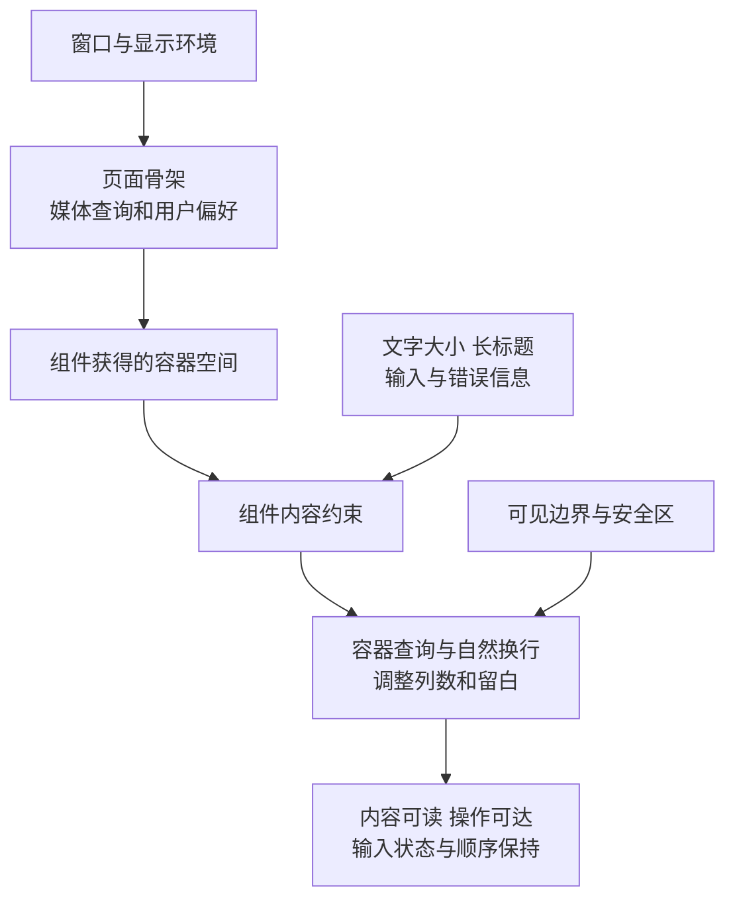

# 视口与响应式布局知识点讲义

## H5-01 viewport、响应式、安全区与横竖屏

桌面页面在大窗口里很宽松，放进右侧面板却出现横向滚动；把文字放大后，保存按钮又挤出了卡片。这两种问题都与“设备是不是手机”无关：组件拿到的空间变了，内容需要的空间也变了。

本讲从 CSS 像素和视口出发，解释容器宽度、文字放大、动态高度与可见边界。涉及移动浏览器时会说明机制和适用条件；当前系统的练习与验证以桌面窗口、分栏容器和文字变化为主。

读完后，你应该能说明：内容按什么尺寸排版，用户实际看到了哪里，布局为什么溢出，以及空间变化时怎样保留正在进行的输入。

### 学习前先确认

- 直接前置：[WEB-02 布局、层叠、响应式与逻辑属性](../chinese-guides/web-02-layout-cascade-responsive-logical-properties.md#web-02)。需要理解正常流、Flex/Grid、最小尺寸与查询条件；先检查布局约束，再增加断点。
- 直接前置：[A11Y-01 WCAG、测试与治理](../chinese-guides/a11y-01-wcag-testing-governance.md#a11y-01)。文字放大、重排、键盘顺序和焦点可见是内容能否使用的一部分。
- 建议先记录一个真实现象，例如“侧栏收窄后，长标题把输入框推出边界”。后面的尺寸都围绕这个现象解释，避免一开始就堆查询规则。

### 一、CSS 像素描述布局，DPR 描述映射

**CSS 像素（CSS pixel）**是浏览器排版使用的单位。样式中的 `width: 400px` 表达布局宽度，不保证截图里恰好占 400 个物理像素。**设备像素比（Device Pixel Ratio，DPR）**描述 CSS 像素与显示像素之间的比例；页面缩放、系统显示设置或显示器变化都可能影响它。

假设图表的 CSS 尺寸为 800 × 400。在 DPR 为 2 的环境里，为了让 Canvas 更清楚，可以把绘图缓冲设为 1600 × 800，再用样式保持 800 × 400 的显示大小。随后还要调整绘图坐标系，否则原来的坐标只覆盖缓冲的一部分。

宽和高都乘 2，像素数就乘 4。下面只计算一份 RGBA 缓冲每像素 4 字节的理想大小，没有包括副本、图层和其他浏览器开销。

```js example=viewport-pixel-budget
const width = 800;
const height = 400;
const rgbaBytes = (dpr) => width * dpr * height * dpr * 4;

console.log(rgbaBytes(1)); // => 1280000
console.log(rgbaBytes(2)); // => 5120000
console.log(rgbaBytes(3)); // => 11520000
```

高清显示不是把所有资源无条件放大。Canvas 可以按实际需求设置像素预算；修改 `canvas.width` 或 `height` 会重置上下文状态，需要重新设置绘图状态。图片则优先提供合适的候选尺寸，让浏览器结合布局宽度选择，见 [PERF-02 的图片与字体](../chinese-guides/perf-02-network-resource-loading-cache-optimization.md#五图片与字体要同时解决发现和呈现)。

DPR 不能告诉你用户拿着哪款设备，也不能代替容器宽度。高 DPR 的桌面显示器，完全可能承载一个只有 360 CSS 像素宽的侧栏。

### 二、布局视口与 meta viewport 解决排版基准

**布局视口（Layout Viewport）**是页面排版使用的视口。旧式桌面网页在移动浏览器里可能先按较宽的虚拟视口排版，再缩小到屏幕中，媒体查询也可能按那个较宽的基准判断。

常见的文档设置如下：

```html
<meta name="viewport" content="width=device-width, initial-scale=1">
```

它让支持该设置的浏览器使用与设备 CSS 宽度匹配的初始布局基准。它不会自动修复内部固定宽度，也不会让 900px 的表格突然具备合理的收缩方式。页面有没有溢出，仍要回到内容和容器约束。

不要用 `user-scalable=no` 或很小的 `maximum-scale` 掩盖问题。用户放大是为了看清内容，限制缩放会把布局缺陷转嫁给用户。

`viewport-fit=cover` 允许内容延伸到屏幕边缘，适合确实需要这种呈现的页面。它不是必加的“适配开关”：使用后还需考虑屏幕遮挡区域，重要操作不能直接贴到不可安全使用的位置。普通桌面阅读页不需要为了这个知识点增加一套移动外观。

### 三、视觉视口解释当前真正可见的区域

**视觉视口（Visual Viewport）**表示用户当前可见的页面区域。它可能小于布局视口，并且存在偏移。例如在支持独立视觉视口的环境中进行 pinch zoom 后，页面仍按原宽度排版，但用户只能看见其中一部分。

软键盘也可能压缩视觉视口，而不改变布局视口；具体行为取决于浏览器、宿主和配置。不能把“某次 `innerHeight` 变小”直接定义为键盘弹出，更不能把两次高度之差统一当成键盘高度。

| 观察值 | 主要用途 | 容易误读的地方 |
| --- | --- | --- |
| `document.documentElement.clientWidth` | 根视口可用宽度 | 与包含滚动条的窗口尺寸可能不同 |
| `window.innerHeight` | 窗口内部高度 | 不保证等于所有环境中的实际可见高度 |
| `visualViewport.width / height` | 视觉视口尺寸 | 不等于组件获得的容器宽度 |
| `visualViewport.offsetTop / offsetLeft` | 视觉视口相对布局视口的位置 | 不能忽略偏移后直接套用定位公式 |
| `devicePixelRatio` | CSS 像素与显示像素的映射 | 不是断点宽度，也不是设备身份 |

VisualViewport API 适合依赖可见边界的浮动提示、诊断或定位逻辑。普通正文和表单优先使用正常流，让浏览器完成排版与滚动。

监听其 `resize` 和 `scroll` 时，应判断 API 是否存在，合并连续更新，并在组件退出时移除监听。不要每次事件都重写整个页面的高度，这可能制造抖动并增加主线程工作。布局读写代价见 [PERF-03](../chinese-guides/perf-03-main-thread-rendering-long-tasks-inp.md#六布局读写交错为什么会放大成本)。

### 四、响应式先说明哪些内容可以换行

**响应式布局**是内容在空间和使用条件变化时仍保持可读、可操作的一组规则，断点只是其中一种表达方式。

以“知识卡片 + 学习备注”为例，先写下约束：标题允许换行，长标识符必要时可以断开；输入区不能被标题撑出容器，已有文字要保留；宽时两列，窄时按阅读顺序上下排列；按钮允许换行，标签变长后不裁切文字。

这里 `min-inline-size: 0` 很重要。Flex 或 Grid 子项的自动最小尺寸可能受内容影响，一段不可断字符串会要求很大宽度。允许子项收缩后，还需要文本换行策略，例如在长 URL 上使用 `overflow-wrap: anywhere`。

图片通常需要 `max-inline-size: 100%` 配合合适的高度规则，避免天然尺寸撑开布局。正文可以设置最大行长，但 `70ch` 是基于字体中“0”字符宽度的近似长度，不意味着中文恰好每行 70 个汉字。

把整个页面设为 `overflow-x: hidden` 可能只是藏起问题。被截掉的按钮仍然不可用，键盘焦点也可能进入看不见的位置。应先找到拒绝收缩的子项，再决定它该换行、缩小，还是在自身内部滚动。

### 五、媒体查询看窗口，容器查询看组件所在空间

**媒体查询（Media Query）**适合根据视口、显示或用户偏好选择页面规则。**容器查询（Container Query）**让组件根据所在容器的尺寸调整内部布局。

浏览器窗口宽 1600px，但资料面板只有 360px。只用 `@media (min-width: 1200px)` 会认为它能排两列；容器查询依据面板实际宽度，让卡片保持单列。

尺寸查询需要明确查询容器。常见做法是在外层设置 `container-type: inline-size`，由内部后代根据容器宽度调整布局，不是让一个元素依赖自己的尺寸反复切换自身宽度。尺寸包含约束也可能改变布局行为，不能只增加查询声明就假定其他条件都不变。



如果只是“宽时两列、窄时一列”，CSS 已经能表达，不必在每次 `resize` 中读取宽度再更新 JavaScript 状态。只有图表重算等真正依赖尺寸的工作，才考虑 ResizeObserver，并避免“观察尺寸 → 修改尺寸 → 再触发观察”的循环。

断点来自内容何时拥挤。例如两列在 680px 以下容不下标签和输入，就在附近调整结构。这个数字描述当前组件的内容约束，不代表某一类设备。

### 六、svh、lvh 和 dvh 不等于三种键盘检测器

**视口单位**让尺寸与视口建立关系。对于会显示、隐藏浏览器工具栏的环境，需要区分高度基准：

| 单位 | 基准 | 典型取舍 |
| --- | --- | --- |
| `svh` | 小视口高度 | 工具栏展开时容易完整容纳，收起后可能留空 |
| `lvh` | 大视口高度 | 利用较大空间，工具栏展开时内容可能被遮住 |
| `dvh` | 动态视口高度 | 随相关浏览器界面变化，尺寸改变也可能引起重排 |

目前 CSS 中默认的 `vh` 对应大视口高度。阅读页通常更适合最小高度，而不是固定高度：

```css
.reading-page {
  min-block-size: 100vh;
  min-block-size: 100dvh;
}
```

前一行提供基础回退，后一行在支持时覆盖。`min-block-size` 允许内容继续增长；改成固定高度又没有安排内部滚动，长内容仍可能被遮挡。

`dvh` 不保证跟随界面动画的每一帧更新，也不是统一的软键盘高度 API。键盘调整布局视口、视觉视口还是仅覆盖页面，受浏览器行为、`interactive-widget` 等配置及其支持情况影响。没有目标环境证据时，不能用一个单位宣称键盘遮挡问题已全部解决。

当前桌面资料页先处理容器收缩、正文增长和滚动边界。确实交付移动输入流程时，再结合后续 H5 输入专题验证实际宿主，不能把本篇桌面实验当作真机证据。

### 七、安全区告诉你留白多少，不替你决定怎么留

**安全区（Safe Area）**表示为了避开屏幕遮挡或特殊边缘区域，内容可能需要保留的空间。CSS 可通过 `env(safe-area-inset-bottom, 0px)` 等环境变量读取相关值。

零是正常结果，例如桌面窗口没有底部遮挡。`env()` 的回退值只在相应环境变量不可用时使用，不会因为实际值为零就替换成回退值。`CSS.supports()` 可以帮助判断语法支持，也不能证明当前屏幕存在非零安全区。

数值与设计留白的关系仍需要明确：

```css
/* 基础留白与安全区都需要保留。 */
.actions-add {
  padding-block-end: calc(16px + env(safe-area-inset-bottom, 0px));
}

/* 最终留白不小于两者中的较大值。 */
.actions-max {
  padding-block-end: max(16px, env(safe-area-inset-bottom, 0px));
}
```

用假设值观察两种意图，数字不是设备测得的安全区：

```js example=viewport-inset-intent
const designSpacing = 16;
const hypotheticalInset = 34;

console.log(designSpacing + hypotheticalInset); // => 50
console.log(Math.max(designSpacing, hypotheticalInset)); // => 34
```

没有一种写法能脱离设计目的统一套用。外壳已保护底部时，内部卡片再重复增加同一份安全区，会出现过大空白。应确定谁负责边界，避免每层自行补偿。

安全区不等于键盘高度。下方实验的“额外底部留白”只是可调 CSS 值，帮助观察留白如何影响内容；它没有模拟屏幕遮挡，也没有修改浏览器的 `env()` 值。

### 八、用同一个表单观察空间与文字变化

把完整文件保存为 `layout-constraints.html`，在桌面浏览器打开。页面不请求外部资源，输入只停留在本页内存中。

先输入学习备注，再将卡片宽度调到 320px、文字调到 200%。观察标题、输入和按钮是否还在边界内，以及输入是否保留。随后恢复宽度，注意变成两列后使用的仍是同一个表单。

```html example=viewport-layout-page runtime=project file=layout-constraints.html
<!doctype html>
<html lang="zh-CN">
<head>
  <meta charset="UTF-8">
  <meta name="viewport" content="width=device-width, initial-scale=1">
  <title>观察空间、文字与输入状态</title>
  <style>
    * { box-sizing: border-box; }
    body {
      max-width: 1240px; margin: 36px auto; padding: 24px;
      font: 16px/1.7 system-ui, sans-serif;
      color: #24463e; background: #f4f8f6;
    }
    h1 { font-size: 28px; }
    .controls {
      display: flex; flex-wrap: wrap; gap: 20px;
      padding: 20px; background: white; border: 1px solid #ceded6;
      border-radius: 12px;
    }
    .controls label { display: grid; gap: 6px; }
    #preview {
      container: lesson / inline-size;
      inline-size: min(100%, var(--width, 900px));
      margin-block: 24px; font-size: var(--text-size, 16px);
    }
    .card {
      display: grid; grid-template-columns: minmax(0, 1fr);
      gap: 1em; padding: 1.25em; background: white;
      border: 1px solid #bed4c8; border-radius: 16px;
    }
    .card > * { min-inline-size: 0; }
    .card h2 { font-size: 1.35em; margin-block: 0 .5em; }
    .card h2, .card p { overflow-wrap: anywhere; }
    .card textarea {
      display: block; inline-size: 100%; min-block-size: 5em;
      font: inherit; resize: vertical; padding: .65em;
      border: 1px solid #77978a; border-radius: 8px;
    }
    .actions {
      display: flex; flex-wrap: wrap; gap: .7em;
      padding-block-end: var(--extra, 0px);
    }
    button {
      font: inherit; max-inline-size: 100%; padding: .6em 1em;
      color: #24463e; background: #e4f1e9;
      border: 1px solid #8caa9a; border-radius: 8px;
      overflow-wrap: anywhere; cursor: pointer;
    }
    :focus-visible { outline: 3px solid #277e65; outline-offset: 3px; }
    #metrics {
      white-space: pre-wrap; overflow-wrap: anywhere;
      padding: 16px; background: #e7efe9; border-radius: 10px;
    }
    @container lesson (min-width: 680px) {
      .card { grid-template-columns: minmax(0, 1fr) minmax(0, 1fr); }
      .actions { grid-column: 1 / -1; }
    }
  </style>
</head>
<body>
  <h1>空间会变，正在输入的内容要留下</h1>
  <p>改变同一个卡片的宽度、文字和留白，不会重新创建表单。</p>
  <section class="controls" aria-label="布局实验条件">
    <label>卡片宽度 <output id="widthValue"></output>
      <input id="width" type="range" min="320" max="1100" step="20" value="900">
    </label>
    <label>卡片文字 <output id="textValue"></output>
      <input id="text" type="range" min="100" max="200" step="25" value="100">
    </label>
    <label>额外底部留白 <output id="extraValue"></output>
      <input id="extra" type="range" min="0" max="60" step="10" value="0">
    </label>
  </section>
  <div id="preview">
    <form id="card" class="card">
      <div>
        <h2>从容器宽度理解知识卡片的布局变化</h2>
        <p>career-atlas-responsive-layout-with-a-very-long-identifier</p>
        <p>标题、说明、输入、操作保持原有阅读顺序。空间变窄时，内容自然向下排列。</p>
      </div>
      <label>学习备注
        <textarea id="note" placeholder="先写一句话，再调整布局"></textarea>
      </label>
      <div class="actions">
        <button type="submit">保存本页草稿</button>
        <button id="clear" type="button">清空备注</button>
      </div>
    </form>
  </div>
  <p id="status" role="status">草稿只在本页内存中展示，不上传也不持久保存。</p>
  <pre id="metrics" aria-label="当前尺寸"></pre>
  <script>
    const byId = (id) => document.getElementById(id);
    const preview = byId('preview');
    let frame = 0;
    function measure() {
      frame = 0;
      const visual = window.visualViewport;
      byId('metrics').textContent = JSON.stringify({
        layoutWidth: document.documentElement.clientWidth,
        innerHeight: window.innerHeight,
        visualWidth: visual ? Math.round(visual.width) : null,
        visualHeight: visual ? Math.round(visual.height) : null,
        visualOffsetTop: visual ? Math.round(visual.offsetTop) : null,
        dpr: window.devicePixelRatio,
        cardWidth: Math.round(preview.getBoundingClientRect().width)
      }, null, 2);
    }
    function scheduleMeasure() {
      if (!frame) frame = requestAnimationFrame(measure);
    }
    function update() {
      const width = Number(byId('width').value);
      const percent = Number(byId('text').value);
      const extra = Number(byId('extra').value);
      preview.style.setProperty('--width', width + 'px');
      preview.style.setProperty('--text-size', 16 * percent / 100 + 'px');
      preview.style.setProperty('--extra', extra + 'px');
      byId('widthValue').value = width + 'px';
      byId('textValue').value = percent + '%';
      byId('extraValue').value = extra + 'px（演示值）';
      scheduleMeasure();
    }
    for (const id of ['width', 'text', 'extra']) {
      byId(id).addEventListener('input', update);
    }
    byId('card').addEventListener('submit', (event) => {
      event.preventDefault();
      byId('status').textContent =
        '本页草稿已确认，共 ' + byId('note').value.length + ' 个字符；刷新后不会保留。';
    });
    byId('clear').addEventListener('click', () => {
      byId('note').value = '';
      byId('status').textContent = '本页草稿已清空。';
    });
    window.addEventListener('resize', scheduleMeasure);
    window.visualViewport?.addEventListener('resize', scheduleMeasure);
    window.visualViewport?.addEventListener('scroll', scheduleMeasure);
    update();
  </script>
</body>
</html>
```

实验把三种变化分开：窗口尺寸由浏览器决定，卡片宽度由容器样式决定，卡片文字由控件决定。窗口保持很宽时，卡片仍可触发单列布局，这就是容器查询的价值。

文字控件只改变卡片字体，没有模拟浏览器页面缩放，也没有替代辅助技术。它能快速暴露固定高度、按钮不换行等问题，但不能据此声称通过完整的可访问性评估。

尺寸输出放在卡片外，避免输出文本反过来改变被测卡片。当前只有窗口和控件改变需要测量的尺寸，所以没有额外使用 ResizeObserver；嵌入真实分栏系统后，如果容器会独立变化，再按需求增加观察。

独立文档的监听与文档同寿命。提取成反复挂载的组件时，要移除窗口、VisualViewport 监听并取消尚未执行的动画帧，参照 [PERF-04 的调度资源清理](../chinese-guides/perf-04-memory-listeners-resource-leaks.md#八定时器和观察器不要在清理后复活)。“保存本页草稿”只确认当前文本，刷新后不保留；实验没有实现持久保存。

### 九、固定与粘性工具区要给内容留下位置

**固定定位（fixed）**通常脱离正常流。底部操作条覆盖正文时，正文不会自动为它留空间，最后一段内容和正在编辑的输入框都可能被挡住。

只写固定的 `padding-bottom: 60px` 也不可靠：文字放大、按钮换行、错误提示出现后，工具条会变高。优先让操作区留在正常流；确需固定时，再由稳定布局结构或测量结果提供相应空间。

**粘性定位（sticky）**仍占据正常流的位置，但受滚动祖先和可滚动范围影响。祖先的 `overflow` 设置可能改变它相对谁粘住。先检查滚动容器和高度约束，再调整 `top` 或 `z-index`。

顶部工具栏遮挡锚点或焦点时，可在正确滚动容器上设置 `scroll-padding`，或给目标设置 `scroll-margin`。它们调整滚动后的间距，不会自动解决工具栏覆盖、焦点顺序或祖先裁切。

带 `transform` 等属性的祖先还可能改变固定定位元素的包含块。“fixed 没有贴着窗口”时，应检查包含块，而不是持续增加层级。布局位置与堆叠顺序是两类问题。

### 十、方向变化和窗口变化不应该重置业务任务

CSS 的 `orientation: landscape` 描述视口宽高关系，不是可靠的物理旋转检测。桌面窗口拉得更宽也可能满足条件，软键盘等变化还可能影响部分环境的视口比例。

多数表单只需根据空间改变布局，不需知道设备是否旋转。任务确实依赖物理方向、全屏或方向锁定时，再单独考虑相关 API、权限和宿主限制，不能由媒体查询结果推断。

更值得关注的是状态连续性。用户写了三行备注，把窗口拖到另一个显示器后，合理结果是空间重新分配，文字和编辑位置尽量保留。通过“窄版组件”和“宽版组件”切换来重建表单，则可能丢失未提交输入、选区、上传状态和异步任务身份。

先让同一份 DOM 通过 CSS 改变列数；确实必须切换组件时，再把需要延续的业务状态放在稳定所有者中。不要为了布局调整，把整个页面当作新任务开始。

视觉顺序应与阅读、键盘顺序一致。用 `order` 将提交按钮移到合适位置，未必改变 Tab 顺序，焦点可能在页面上下跳跃。示例保留标题、备注、操作的 DOM 顺序，就是为了减少这种分离。

### 十一、文字放大与重排是两个相关但不同的检查

**文字调整（Resize Text）**关注文字放大到 200% 等条件下，内容与功能是否仍可使用。**重排（Reflow）**关注内容在较窄等效视口中能否重新组织，减少用户同时向两个方向滚动的负担。

两者不能合并成“把 font-size 乘 2”。页面缩放通常改变可用 CSS 视口；只增大文字会改变内容需求，但可能保留原视口宽度。不同缺陷会在不同条件下出现。

WCAG 的相关重排要求使用 320 CSS 像素宽等条件解释纵向阅读内容；常见检验方式是在起始宽度为 1280 CSS 像素的环境中放大到 400%。这帮助理解等效宽度，不意味着任何窗口在 400% 下都恰好等于 320px，应观察实际尺寸和内容表现。

数据表、地图等真正依赖二维布局的内容可能有例外，但不能把所有表格、代码和操作统一排除。可以让特定区域内部滚动，同时保持周围的标题、说明、表单和操作能够重排。例外是否适用要结合任务判断。

示例只提供快速观察入口。至少检查标题完整、输入可编辑、按钮可达、焦点清楚，并确认变窄前后文本一致。如果未来承诺某一级可访问性符合性，还需按标准与实际页面范围完整评估，不能由一张卡片替整个系统背书。

### 十二、把支持范围与未验证的环境写清

当前系统面向桌面，优先处理窗口调整、分栏、显示缩放、文字放大和较矮窗口中的内容可达性。不必为了学完本讲，就额外建设移动导航和整套移动页面。

记录改动时可以依次说明：

1. **现象**：900px 卡片正常，320px 卡片的长标识符撑开布局。
2. **原因**：子项最小尺寸与不可断字符串共同阻止收缩。
3. **修改**：允许子项收缩，增加长字符串换行，由容器决定列数。
4. **证据**：在指定桌面浏览器中改变容器和文字，内容不横向溢出，输入保持一致。
5. **边界**：不据此推断真实手机键盘、安全区或各类 WebView 已验证。

以后支持 WebView、虚拟键盘或折叠屏时，再加入对应环境。不要仅凭 User-Agent 推断可见区域、键盘高度或屏幕分段；能力检测只证明接口存在，行为仍需在目标宿主观察。

嵌入 iframe 时，应区分子文档视口与外层容器。跨源页面不能随意读取父页面尺寸；确有协作需求时，通过明确的消息结构、来源校验和发送目标完成通信，而不是尝试绕过边界。

布局稳定也影响体验。例如异步内容撑高卡片，让正文突然移动。但“切成单列”本身不直接等于一次需要计入的 CLS，应结合时机、用户输入与指标规则分析，再回到 [PERF-01](../chinese-guides/perf-01-core-web-vitals-performance-budgets.md#perf-01)判断。

### 带着问题回看

1. 360px 的侧栏位于 1600px 的窗口中，根据哪个尺寸决定两列布局？为什么不能用 DPR 代替？
2. Canvas 的 DPR 从 1 变成 3，理想 RGBA 缓冲为什么变为九倍？还漏算了什么？
3. `env(safe-area-inset-bottom, 16px)` 返回零时，为什么不用 16px？加法与最大值分别表达什么意图？
4. 卡片文字调到 200% 后，视口一定缩小吗？它与页面缩放有什么区别？
5. 窗口变窄后表单重新挂载、输入消失，怎样区分布局变化与业务状态生命周期？

### 参考与延伸阅读

- [MDN：Viewport meta tag](https://developer.mozilla.org/en-US/docs/Web/HTML/Reference/Elements/meta/name/viewport)：初始视口设置与缩放。
- [MDN：VisualViewport](https://developer.mozilla.org/en-US/docs/Web/API/VisualViewport)：视觉视口尺寸、偏移与事件。
- [MDN：CSS length](https://developer.mozilla.org/en-US/docs/Web/CSS/Reference/Values/length)：CSS 长度与视口单位。
- [MDN：Container queries](https://developer.mozilla.org/en-US/docs/Web/CSS/Guides/Containment/Container_queries)：查询容器与尺寸条件。
- [MDN：env()](https://developer.mozilla.org/en-US/docs/Web/CSS/Reference/Values/env)：环境变量与回退值。
- [W3C：Understanding Resize Text](https://www.w3.org/WAI/WCAG22/Understanding/resize-text.html) 与 [Understanding Reflow](https://www.w3.org/WAI/WCAG22/Understanding/reflow.html)：文字调整、重排和适用例外。
