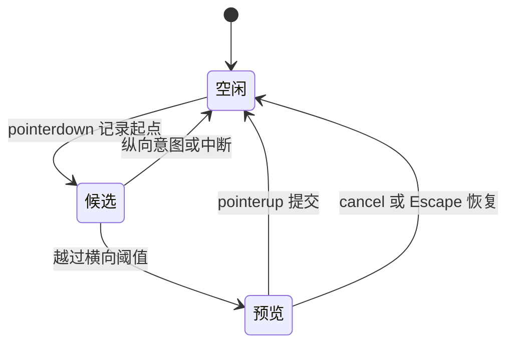

# 移动滚动与手势协调知识点讲义

## H5-02 滚动、软键盘、触控与手势冲突

在备注弹窗里向下翻列表，滚到末尾后，背后的页面也跟着动了；横向拖动一个预览把手，浏览器却开始滚页面；松开鼠标以后，把手还停在“拖动中”。这些现象都在问同一件事：这次输入由谁处理，处理到什么时候，途中被打断又该留下什么状态？

本讲先解释原生滚动与自定义手势的分工，再把指针、焦点和可见区域连接起来。读完后，你应能定位真正的滚动容器，设计有取消出口的拖动，并在空间变化后保留输入。完整实验面向桌面；软键盘、触控和 WebView 的机制仍会讲清，但不把桌面模拟当作实机证据。

### 学习前先确认

- 直接前置：[H5-01 viewport、响应式、安全区与横竖屏](../chinese-guides/h5-01-viewport-responsive-safe-area-orientation.md#h5-01)。需要区分页面排版的空间与用户当前可见的空间。
- 直接前置：[BROWSER-01 DOM 渲染、事件与存储](../chinese-guides/browser-01-render-events-storage.md#browser-01)。需要理解事件传播、默认行为与焦点。

### 一、先找到真正发生滚动的盒子

滚动容器是能容纳溢出内容并改变滚动位置的盒子。给列表设置 `overflow: auto` 只是允许它在需要时滚动；如果高度仍随内容增长，内容可能把整个弹窗撑长，真正滚动的仍是页面。Flex 子项默认最小尺寸也可能阻止收缩，因此常见结构是：弹窗限制高度，内容区设 `min-height: 0; overflow: auto`，标题和操作区保留在正常布局中。

先在开发者工具比较目标元素的 `scrollHeight`、`clientHeight` 和滚动时的 `scrollTop`。例如内容高 900、可见高 300，常规从上往下排布时最大滚动位置约为 600；内容高 240 时则没有纵向溢出。`overflow: hidden` 仍可能被程序滚动，`overflow: clip` 不建立同样的滚动容器，不能仅凭有没有滚动条作判断。

下面的计算可以单独保存为 `scroll-boundary.mjs`，用 Node.js 22 运行，或在现代浏览器控制台执行。数据是合成的常规纵向布局，不涉及反向 Flex、RTL 或弹性过滚。

```js example=h502-scroll-boundary
const atEnd = ({ scrollTop, scrollHeight, clientHeight }) =>
  Math.abs(scrollHeight - clientHeight - scrollTop) <= 1;
console.log(atEnd({ scrollTop: 599.6, scrollHeight: 900, clientHeight: 300 })); // => true
console.log(atEnd({ scrollTop: 500, scrollHeight: 900, clientHeight: 300 })); // => false
```

第一项留下 0.4 CSS 像素，不应因为严格相等失败就判定“永远没到底”。这个容差适合“显示回到最新按钮”等观察逻辑，不应用来重写所有浏览器滚动规则。反向布局的 `scrollTop` 可以为负，部分环境过滚还会越出通常范围，需要另建对应模型。

### 二、滚动链与事件冒泡是两件事

**滚动链（Scroll Chaining）**是内层到达边界后，浏览器把滚动继续交给祖先容器的行为。事件冒泡则是监听器收到事件的传播过程。`stopPropagation()` 阻止传播，不等于阻止浏览器把滚动交给背景页面。

在弹窗内容区设 `overscroll-behavior-y: contain`，可限制纵向滚动链；`none` 还会限制该轴的过度滚动效果。应作用在真正的滚动容器上。没有滚动容器，或背景因焦点、脚本而移动，添加这个属性未必解决问题。它也不是完整的模态背景锁：页面其他区域的滚轮、程序滚动和宿主行为需要分别判断。参见 [MDN 的属性说明](https://developer.mozilla.org/en-US/docs/Web/CSS/overscroll-behavior)。

模态弹窗打开时，可以临时锁住页面根滚动，并在关闭时恢复之前的样式和位置。多层弹窗必须由一个所有者管理锁的数量；各组件都在关闭时无条件把 `overflow` 清空，会提前解锁别人的弹窗。移动 Safari 的固定页面锁等兼容方案应有实机依据，不能把某段固定定位技巧作为所有浏览器的保证。

列表位置也是阅读状态。插入新记录后，保存“正在读第 42 条及其偏移”通常比只保存 `scrollTop=800` 更稳。聊天或日志只在用户原本接近底部时自动跟随；用户正在读旧内容时，显示“回到最新”，不要每来一条消息都抢走位置。

### 三、让浏览器在手势开始前知道分工

`touch-action` 声明触摸操作中哪些平移和缩放由浏览器处理。横向调整把手可以用 `pan-y pinch-zoom`，把纵向滚动和捏合缩放留给浏览器；画布确实需要接管全部触摸时才局部使用 `none`，并提供缩放和键盘替代。

浏览器会结合触点元素与相关祖先的声明决定手势处理。它一旦接管滚动，应用可能收到 `pointercancel`。在 `pointermove` 中发现方向后再把 `touch-action` 改成 `none`，不能改变已经开始的这一次手势。这也是“先什么都允许，拖到一半再抢回滚动”不可靠的原因。[MDN touch-action](https://developer.mozilla.org/en-US/docs/Web/CSS/touch-action) 明确说明了开始时的判断与中途修改的限制。

**被动监听器（Passive Listener）**是回调“不调用 `preventDefault()`”的承诺。浏览器因此不用等待该回调决定是否阻止可取消的默认行为。若确需拦截 `wheel` 或 `touchmove`，显式声明 `passive: false`，检查 `event.cancelable`，且把范围缩到必要元素。被动回调中的阻止会被忽略；`scroll` 事件本身通常不可取消，给它设 passive 也不会自动降低你的计算成本。

原生按钮继续使用 `click`，让鼠标、键盘和辅助技术共享激活路径；不要在 `pointerdown` 就发送请求。滚动、缩放和文字选择不应为了一个局部手势在整个文档上被禁用。

### 四、一次拖动必须有提交和取消两个出口

**指针事件（Pointer Events）**用 `pointerId` 区分指针，用 `pointerType` 描述鼠标、触摸或笔。它统一了事件入口，不代表三种设备的阈值、按钮或默认行为完全相同。只调整一个值的组件应跟踪一个选定 ID，并忽略其他指针；多点画布才需要逐指针状态表。

**指针捕获（Pointer Capture）**把一个活动指针的后续事件送给捕获元素，即使坐标已经移出它的边界。捕获解决事件归属，不保证阻止滚动或系统手势。`pointerup`、`pointercancel` 之后通常会隐式释放捕获；主动结束时也可释放，并处理 `lostpointercapture`。



例如从 40 开始向右拖到 65，预览可以显示 65，但已提交值仍是 40。松手才提交；失焦、取消或组件卸载则回到 40。若用同一个变量同时表示预览和提交值，取消时已经不知道恢复到哪里。阈值只是减少点击抖动的产品选择，下面实验的 6 CSS 像素不是平台标准。

窗口失焦不保证恰好产生你期待的 `pointercancel`，应用可额外处理 `blur`、页面隐藏和卸载。取消后先清空当前手势，再释放捕获，避免释放触发的 `lostpointercapture` 再次提交。

### 五、运行一个能中断、关闭和重新打开的调整页

保存下面完整内容为 `input-lab.html`，用现代桌面浏览器打开，无需依赖或网络。打开面板，在把手上横向拖动；按住时按 Escape 会放弃预览，普通状态下 Escape 关闭面板。也可用增减按钮完成同样的调整。备注不随关闭、窗口调整或重新打开而丢失。

```html example=h502-input-lab runtime=project file=input-lab.html
<!doctype html>
<html lang="zh-CN">
<meta charset="utf-8">
<meta name="viewport" content="width=device-width, initial-scale=1">
<title>输入与中断观察页</title>
<style>
  body { font: 18px/1.6 system-ui; margin: 32px; }
  button, input, textarea { font: inherit; }
  button { margin: 4px; padding: 6px 12px; }
  .spacer { height: 80vh; background: #eef2f5; }
  dialog { width: 620px; max-width: 80vw; padding: 0; }
  dialog::backdrop { background: #14203388; }
  .panel { display: flex; flex-direction: column; height: 70vh; }
  header, footer { padding: 12px 20px; }
  .content { min-height: 0; overflow: auto; overscroll-behavior-y: contain;
    scroll-padding: 16px; padding: 0 20px 20px; }
  #pad { border: 2px solid #2d6170; padding: 18px; cursor: ew-resize;
    touch-action: pan-y pinch-zoom; user-select: none; }
  #fill { height: 14px; background: #2d6170; width: 40%; }
  textarea { display: block; width: 95%; scroll-margin: 16px; }
  :focus-visible { outline: 3px solid #a45315; outline-offset: 3px; }
</style>
<h1>输入与中断观察页</h1>
<p>先滚动页面，再打开面板。这里的指针与数值只影响本地预览。</p>
<button id="open">打开面板</button>
<div class="spacer">背景页面</div>
<dialog id="dialog" aria-labelledby="title">
  <div class="panel">
    <header><h2 id="title">调整预览宽度</h2></header>
    <div class="content" id="content">
      <p id="help">横向拖动；Escape 放弃拖动。也可直接使用下方按钮。</p>
      <div id="pad" aria-describedby="help">拖动区域<div id="fill"></div></div>
      <button id="less">减少 5</button><button id="more">增加 5</button>
      <p id="state" role="status"></p>
      <p id="viewport"></p>
      <div style="height: 320px">向下滚动到备注；背景应该保持原位置。</div>
      <label for="note">未提交备注</label><textarea id="note" rows="3"></textarea>
      <button id="reveal">让备注进入可见区域</button>
    </div>
    <footer><button id="close">关闭并保留备注</button></footer>
  </div>
</dialog>
<script type="module">
  const $ = (id) => document.getElementById(id);
  const dialog = $('dialog'), pad = $('pad');
  let value = 40, gesture = null, scope = null, frame = 0;
  let saved = null, opener = null;
  const clamp = (v) => Math.max(0, Math.min(100, Math.round(v)));
  function render(message = '就绪') {
    $('fill').style.width = `${gesture?.preview ?? value}%`;
    $('state').textContent = `${message}；已提交 ${value}；预览 ${gesture?.preview ?? value}`;
  }
  function finish(commit, message) {
    const old = gesture;
    if (!old) return;
    gesture = null;
    if (commit && old.dragging) value = old.preview;
    if (pad.hasPointerCapture(old.id)) pad.releasePointerCapture(old.id);
    render(message);
  }
  function scheduleViewport() {
    if (frame) return;
    frame = requestAnimationFrame(() => {
      frame = 0;
      const vv = window.visualViewport;
      $('viewport').textContent = vv
        ? `视觉视口高 ${Math.round(vv.height)}；偏移 ${Math.round(vv.offsetTop)}`
        : '本环境没有 VisualViewport，保留原生滚动';
    });
  }
  function open() {
    if (dialog.open) return;
    opener = document.activeElement;
    saved = { x: scrollX, y: scrollY, overflow: document.documentElement.style.overflow };
    document.documentElement.style.overflow = 'hidden';
    dialog.showModal();
    scope = new AbortController();
    const listen = (target, name, fn) => target.addEventListener(name, fn, { signal: scope.signal });
    listen(pad, 'pointerdown', (e) => {
      if (gesture || e.button !== 0 || !e.isPrimary) return;
      gesture = { id: e.pointerId, x: e.clientX, y: e.clientY, start: value,
        preview: value, dragging: false };
      pad.setPointerCapture(e.pointerId);
      render('候选');
    });
    listen(pad, 'pointermove', (e) => {
      if (gesture?.id !== e.pointerId) return;
      const dx = e.clientX - gesture.x, dy = e.clientY - gesture.y;
      if (!gesture.dragging) {
        if (Math.abs(dy) > 6 && Math.abs(dy) > Math.abs(dx)) {
          finish(false, '交还纵向操作'); return;
        }
        if (Math.abs(dx) < 6) return;
        gesture.dragging = true;
      }
      gesture.preview = clamp(gesture.start + dx / 4);
      render('拖动中');
    });
    listen(pad, 'pointerup', (e) => {
      if (gesture?.id !== e.pointerId) return;
      if (gesture.dragging) gesture.preview = clamp(gesture.start + (e.clientX - gesture.x) / 4);
      finish(true, '已结束');
    });
    for (const type of ['pointercancel', 'lostpointercapture']) {
      listen(pad, type, (e) => {
        if (gesture?.id === e.pointerId) finish(false, '已取消');
      });
    }
    listen(dialog, 'cancel', (e) => {
      if (gesture) { e.preventDefault(); finish(false, 'Escape 已取消预览'); }
    });
    listen(window, 'blur', () => finish(false, '失焦已取消'));
    listen(document, 'visibilitychange', () => {
      if (document.hidden) finish(false, '页面隐藏已取消');
    });
    if (window.visualViewport) {
      listen(window.visualViewport, 'resize', scheduleViewport);
      listen(window.visualViewport, 'scroll', scheduleViewport);
    }
    render(); scheduleViewport(); $('less').focus();
  }
  function cleanup() {
    finish(false, '关闭已取消');
    scope?.abort(); scope = null;
    cancelAnimationFrame(frame); frame = 0;
    if (saved) {
      const previous = saved; saved = null;
      document.documentElement.style.overflow = previous.overflow;
      opener?.focus({ preventScroll: true });
      window.scrollTo({ left: previous.x, top: previous.y, behavior: 'instant' });
    }
  }
  $('open').addEventListener('click', open);
  $('close').addEventListener('click', () => dialog.close());
  dialog.addEventListener('close', cleanup);
  window.addEventListener('pagehide', () => { if (dialog.open) dialog.close(); cleanup(); });
  for (const [id, step] of [['less', -5], ['more', 5]]) {
    $(id).addEventListener('click', () => {
      finish(false, '切换为按钮操作'); value = clamp(value + step); render('按钮已提交');
    });
  }
  $('reveal').addEventListener('click', () => {
    $('note').focus({ preventScroll: true });
    $('note').scrollIntoView({ block: 'nearest', behavior: 'instant' });
  });
</script>
</html>
```

观察三个分开的事实：预览会变化，提交值只在松手或按钮操作后变化，备注仍属于原来的 textarea。一次打开创建一组临时监听，关闭用 `AbortController` 撤销它们，并取消待执行的帧回调。页面级按钮监听随整个文档存在；把它包装成可卸载组件时，这些监听也应交给组件的销毁流程。释放责任可继续读 [PERF-04 的监听身份](../chinese-guides/perf-04-memory-listeners-resource-leaks.md#五移除监听需要同一个回调身份)。

这里刻意没有拖动关闭弹窗：横向调整和纵向列表的分工更容易观察。若改为向下拖动关闭的 Bottom Sheet，应把拖动把手与可滚动内容分开。不要假设列表到顶后，已经开始的原生滚动一定能无缝交给自定义拖动。

实验只处理单个模态框，没有网络保存、惯性算法或嵌套锁管理。`pointercancel` 可以用合成事件检查退出分支，但合成事件不会触发浏览器真实滚动、捕获或系统手势；那些行为仍需真实输入验证。

### 六、软键盘改变什么，先测可见边界

键盘弹出后可能缩小视觉视口、改变布局视口，或直接覆盖内容。`dvh`、`innerHeight` 和“前后差了 300px”都不是通用键盘检测器。先理解 [H5-01 的视觉视口](../chinese-guides/h5-01-viewport-responsive-safe-area-orientation.md#三视觉视口解释当前真正可见的区域)，再决定是否需要补偿。支持 VisualViewport 的顶层页面可用 `offsetTop + height` 表示其可见底边在布局视口中的位置；比较元素矩形前要确保采用相同坐标系。[MDN VisualViewport](https://developer.mozilla.org/en-US/docs/Web/API/VisualViewport) 提供了尺寸、偏移及事件的定义。

下面仍是合成几何，不是键盘测量。假定输入框底边与视口数据都已转换到同一坐标系；希望底部留出 12px：

```js example=h502-visible-gap
function missingSpace(fieldBottom, viewportTop, viewportHeight) {
  return Math.max(0, fieldBottom + 12 - (viewportTop + viewportHeight));
}
console.log(missingSpace(520, 80, 460)); // => 0
console.log(missingSpace(560, 80, 460)); // => 32
```

第二项缺 32px，说明输入及留白没有全部可见，不说明应直接把整个页面上移 32px。它可能被弹窗内容区、粘性栏或键盘分别遮住，要把容器可见区和视觉视口取交集，再滚动正确的所有者。浏览器已自动滚入焦点时，额外补偿还可能造成两次跳动。

优先让输入留在正常流中，等焦点和布局更新后检查一次，再做最小修正。`resize` 也会因窗口调整、缩放和浏览器界面变化发生，不能每次都清空字段、重建表单或 `blur()`。VisualViewport 的 `resize/scroll` 可合并到一个待处理帧中；这减少重复工作，不是“键盘动画已结束”的保证。

### 七、错误提示、焦点和自动滚动要指向同一任务

验证失败后，错误摘要应能把键盘用户带到具体字段；字段用标签和错误关联说明发生了什么。`scroll-margin`、滚动容器的 `scroll-padding` 可以为粘性栏留空间。`scrollIntoView()` 可能影响多层祖先，因此不能只看输入框动了，还要看背景位置有没有被改变。

如果用户正在拖动或读另一段内容，后台校验不应反复抢焦点。把强制定位留给提交失败、打开面板或用户主动点击错误等明确操作。减少动态偏好开启时，避免用长平滑动画完成必须的定位；应允许用户中断自动滚动。

原生 `dialog.showModal()` 帮助处理模态语义和焦点行为，但不替你解决全部布局、滚动锁与宿主差异。关闭时返回原触发者；若触发者已被删除，选择业务上合理的下一控件。更完整的错误恢复阅读 [UX-01 的焦点与状态文字](../chinese-guides/ux-01-interaction-states-usability-validation.md#六焦点和状态文字一起设计)。

### 八、高频事件只做这次交互需要的工作

指针移动通常只需记录最新坐标并更新预览。复杂排序、网络写入与埋点可以在提交后处理；视图更新很重时用一个待处理的 `requestAnimationFrame` 合并，但松手时必须使用最终坐标并取消旧回调，不能让迟到的预览覆盖提交值。

不要在每次 `scroll` 中交替读取布局和写尺寸，或把大列表整体重排。原生 sticky、滚动容器与观察器能解决的事优先交给平台。帧回调仍在主线程上运行，它不自动消除长任务，原因见 [PERF-03 的布局读写](../chinese-guides/perf-03-main-thread-rendering-long-tasks-inp.md#六布局读写交错为什么会放大成本)。本实验的少量文字更新用于暴露状态，不代表复杂产品在每个 pointermove 播报都合适；生产中应只播报开始、提交与取消等有意义变化。

### 九、把桌面证据与移动宿主证据分开

桌面可以确认拖出边界仍连续、Escape 恢复、关闭清理、反复打开备注仍在、键盘按钮等价、背景位置恢复。检查时记录浏览器版本、输入设备和最后状态。监听没有再触发只能证明这条路径，没有堆快照就不声称完成内存审计。

软键盘与系统边缘手势还需目标设备：记录系统、浏览器或 WebView 内核、宿主配置、键盘类型，以及前后视口尺寸与焦点矩形。桌面开发者工具切换手机外形不能覆盖输入法、惯性、原生返回手势或宿主的 resize/pan 配置。能力不足时退回普通滚动、可见关闭按钮和表单页面，避免用 UA 字符串推断全部能力。

### 带着问题回看

- 为什么 `stopPropagation()` 后背景仍可能滚动？先确认哪两个机制？
- 指针捕获后收到 `pointercancel`，预览与已提交值各应如何处理？
- 把实验的纵向滚动意图改成横向，哪个条件改变了结果？
- 输入框底部被遮挡时，为什么不能仅用窗口高度差修正？

### 参考与延伸阅读

资料核对日期：2026-09-26。兼容性以目标环境和官方兼容表为准。

- [MDN Pointer Events](https://developer.mozilla.org/en-US/docs/Web/API/Pointer_events)：查 pointerId、取消、捕获与多输入语义。
- [MDN touch-action](https://developer.mozilla.org/en-US/docs/Web/CSS/touch-action)：查开始时的手势分工和缩放限制。
- [MDN overscroll-behavior](https://developer.mozilla.org/en-US/docs/Web/CSS/overscroll-behavior)：查滚动链、过度滚动及属性作用范围。
- [MDN addEventListener](https://developer.mozilla.org/en-US/docs/Web/API/EventTarget/addEventListener)：查 passive、signal 与监听生命周期。
- [MDN VisualViewport](https://developer.mozilla.org/en-US/docs/Web/API/VisualViewport)：查视觉视口尺寸、偏移和事件；不能据此推定某个 WebView 的键盘策略。
