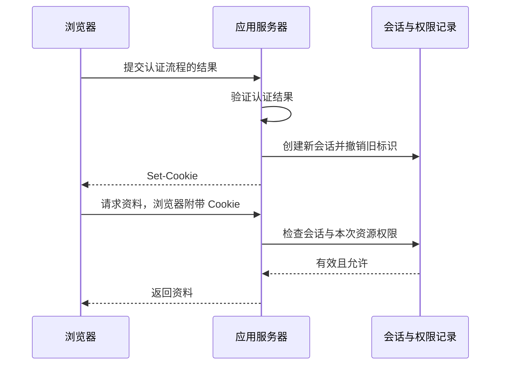

# Web 身份与会话知识点讲义

## IDENTITY-01 Cookie、Session、Token 与浏览器身份边界

林在一个资料站登录，刷新页面后还能看到自己的收藏；在另一个标签页退出，原页面却仍显示头像。哪个画面才代表登录状态？答案要沿请求找到服务器，不能只看页面保存了什么。

本讲把浏览器凭证、服务器会话和页面显示拆开，再通过本地实验观察 Cookie 自动携带、登录轮换与退出撤销。所有账号和资料均为教学数据。浏览器能力资料核验于 2026-09-19；实现是否支持仍以目标环境和能力检测为准。

### 学习前先确认

- 直接前置：[SEC-01 XSS、CSRF 与前端信任边界](../chinese-guides/sec-01-xss-csrf-trust-boundaries.md#sec-01)。需要知道脚本注入、自动携带 Cookie 和服务端授权各自涉及什么边界。

读完应能解释一次请求凭什么被接受，指出登录、续期、退出各自改变了哪份状态，并为嵌入页面保留清楚的登录退路。

### 一、认证、会话与授权回答三个问题

**认证（Authentication）**确认本次登录是谁完成的。**会话（Session）**把后续请求关联到一个登录上下文。**授权（Authorization）**判断这个上下文能否操作当前资源。

例如林通过 Passkey 认证，服务器创建会话；浏览器随后带着会话标识请求资料 7，服务器还要确认资料是否属于林。通过认证不会自动获得所有资料的访问权。



浏览器返回 credential 还不是登录完成；服务器验证成功并建立会话，才可显示已登录。[Passkey 的完整阶段](../chinese-guides/sec-03-webauthn-passkeys-authentication.md#五运行一个逐步推进的认证状态页)解释了为什么要把认证器返回与会话建立分开。

### 二、Cookie 负责携带，服务器负责解释

**Cookie** 是浏览器保存并按规则附带的小段状态。它可以装偏好，也可以装随机 session ID；名字叫 sid 并不会让它自动拥有安全属性。

典型生产响应可以这样表达：

```http
Set-Cookie: __Host-sid=<随机不透明值>; Path=/; Secure; HttpOnly; SameSite=Lax; Max-Age=1800
Cache-Control: no-store
```

| 属性 | 它限制什么 | 它不保证什么 |
| --- | --- | --- |
| Secure | 通常只经 HTTPS 发送；本地开发有浏览器特殊处理 | 不让已取得凭证的人重放 |
| HttpOnly | 普通页面脚本不能通过 document.cookie 读取 | 恶意脚本不能借会话发请求 |
| SameSite | 在不同站点上下文下是否自动携带 | 所有 CSRF 都已阻止 |
| 不写 Domain | 默认限制在设置它的主机 | 同主机不同端口隔离 |
| Path | 哪些路径接收 Cookie | 页面之间的安全隔离 |
| Max-Age / Expires | 浏览器保留期限 | 服务器会话一定同时失效 |

支持前缀约束的浏览器要求 **__Host-** Cookie 带 Secure、Path=/ 且不带 Domain。身份 Cookie 仍要配 HttpOnly。Cookie 不按端口隔离，实验因此使用专用名字，避免与正在运行的应用混用。

同源比较 scheme、host、port；SameSite 使用的是站点关系，不能把两个概念换着说。子域可能同站而不同源，不能因为 SameSite 请求被放行就省掉来源和权限检查。

### 三、会话应有轮换、两种期限和撤销入口

会话记录通常保存主体、创建时间、最近活动、绝对到期时间和撤销状态。浏览器只拿随机标识，不能自行改过期时间续命。

**会话固定（Session Fixation）**发生在认证后仍沿用登录前标识：若别人提前掌握这个标识，就可能共享认证后的身份。应在匿名升级、账号切换或关键权限提升时生成新标识，并让旧标识失效。

```ts example=identity01-session-lifecycle
type Session = { user: string; createdAt: number; lastSeen: number };
const sessions = new Map<string, Session>();
function rotate(oldId: string | null, user: string, now: number): string {
  const nextId = crypto.randomUUID();
  if (oldId) sessions.delete(oldId);
  sessions.set(nextId, { user, createdAt: now, lastSeen: now });
  return nextId;
}
function read(id: string, now: number): string | null {
  const value = sessions.get(id);
  if (!value) return null;
  if (now - value.lastSeen >= 30 || now - value.createdAt >= 120) {
    sessions.delete(id);
    return null;
  }
  value.lastSeen = now;
  return value.user;
}
const old = rotate(null, '匿名教学用户', 0);
const current = rotate(old, '林', 1);
console.log(old !== current, read(old, 2), read(current, 2)); // => true null 林
console.log(read(current, 33)); // => null
const another = rotate(null, '林', 40);
sessions.delete(another);
console.log(read(another, 41)); // => null
```

例子把时间当作秒数传入，便于观察空闲 30 秒和绝对 120 秒；这些是实验参数，不是通用推荐值。生产用服务端时钟和可靠会话存储，跨进程轮换需要原子操作。会话记录被缓存淘汰、存储不可用或跨区复制延迟，也都要有明确结果。

### 四、运行一个能看见 HttpOnly 效果的本地实验

下面两个文件放在同一个独立目录，使用 Node 22 启动 server.mjs，再打开 http://127.0.0.1:43917。按 Ctrl+C 关闭后，内存会话全部消失。

“模拟认证成功”按钮替代真实密码或 Passkey 验证，只用于观察认证之后的会话动作，不能直接用作实际登录接口。实验限定回环地址和 HTTP，故意使用普通 b17_demo_sid，未加生产必需的 Secure；它不能证明 HTTPS 或跨站 Cookie 策略已经验证。

```js example=identity01-server runtime=project file=server.mjs
import { createServer } from 'node:http';
import { randomBytes, timingSafeEqual } from 'node:crypto';
import { readFile } from 'node:fs/promises';

const port = Number(process.env.B17_DEMO_PORT ?? 43917);
const sessions = new Map();
const fresh = () => randomBytes(32).toString('base64url');
const cookie = value => 'b17_demo_sid=' + value + '; Path=/; HttpOnly; SameSite=Strict; Max-Age=300';
const equal = (left, right) => {
  if (typeof left !== 'string' || typeof right !== 'string') return false;
  const a = Buffer.from(left), b = Buffer.from(right);
  return a.length === b.length && timingSafeEqual(a, b);
};
const server = createServer(async (req, res) => {
  const origin = 'http://127.0.0.1:' + server.address().port;
  res.setHeader('Cache-Control', 'no-store');
  res.setHeader('X-Content-Type-Options', 'nosniff');
  const send = (status, data) => {
    res.writeHead(status, { 'Content-Type': 'application/json; charset=utf-8' });
    res.end(JSON.stringify(data));
  };
  if (req.headers.host !== new URL(origin).host) return send(403, { code: 'HOST' });
  if (req.method === 'GET' && req.url === '/') {
    res.writeHead(200, { 'Content-Type': 'text/html; charset=utf-8' });
    res.end(await readFile(new URL('./index.html', import.meta.url)));
    return;
  }
  const parts = (req.headers.cookie ?? '').split(';').map(part => part.trim());
  const id = parts.find(part => part.startsWith('b17_demo_sid='))?.slice(13);
  let session = sessions.get(id);
  if (session && Date.now() >= session.expiresAt) {
    sessions.delete(id);
    session = undefined;
  }
  if (req.method === 'GET' && req.url === '/session') {
    if (!session) {
      const next = fresh();
      session = { user: null, csrf: fresh(), expiresAt: Date.now() + 300000 };
      sessions.set(next, session);
      res.setHeader('Set-Cookie', cookie(next));
    }
    return send(200, { user: session.user, csrf: session.csrf });
  }
  if (req.method === 'GET' && req.url === '/private') {
    return session?.user
      ? send(200, { title: '林的教学收藏' })
      : send(401, { code: 'NO_SESSION' });
  }
  if (req.method !== 'POST' || !['/login', '/logout'].includes(req.url)) {
    return send(404, { code: 'NOT_FOUND' });
  }
  req.resume(); // 本实验 POST 不读取业务载荷。
  if (req.headers.origin !== origin
      || req.headers['content-type'] !== 'application/json'
      || !session || !equal(req.headers['x-csrf-token'], session.csrf)) {
    return send(403, { code: 'REQUEST_REJECTED' });
  }
  if (req.url === '/login') {
    // 仅教学：假设上游认证已成功，轮换会话与 CSRF token。
    const next = fresh();
    sessions.delete(id);
    sessions.set(next, { user: '林', csrf: fresh(), expiresAt: Date.now() + 300000 });
    res.setHeader('Set-Cookie', cookie(next));
    return send(200, { status: 'session-created' });
  }
  sessions.delete(id);
  res.setHeader('Set-Cookie', 'b17_demo_sid=; Path=/; HttpOnly; SameSite=Strict; Max-Age=0');
  send(200, { status: 'revoked' });
});
server.listen(port, '127.0.0.1', () => {
  console.log('教学会话页：http://127.0.0.1:' + server.address().port);
});
```

```html example=identity01-page runtime=project file=index.html
<!doctype html>
<html lang="zh-CN">
<meta charset="utf-8">
<title>会话与页面不是同一份状态</title>
<style>
  body { margin: 48px auto; max-width: 960px; padding: 0 28px; background: #f4f7fa; color: #203647; font: 16px/1.8 "Segoe UI","Microsoft YaHei",sans-serif; }
  main { background: white; padding: 30px; border-radius: 18px; }
  h1 { margin-top: 0; } .controls { display: flex; gap: 12px; flex-wrap: wrap; }
  button { padding: 10px 16px; font: inherit; border: 1px solid #b7c8cd; border-radius: 8px; background: #eff7f4; cursor: pointer; }
  button:focus-visible { outline: 3px solid #29756d; outline-offset: 3px; }
  #state { font-size: 20px; font-weight: 600; } #result { min-height: 36px; }
  .note { color: #526575; } #log { max-height: 240px; overflow: auto; }
</style>
<main>
  <p class="note">IDENTITY-01 · 本地 HTTP 教学实验</p>
  <h1>脚本读不到 Cookie，请求仍会带上它</h1>
  <p id="state">正在读取会话</p>
  <p id="visible"></p>
  <div class="controls">
    <button id="login">模拟认证成功</button>
    <button id="read">请求教学收藏</button>
    <button id="logout">退出并撤销</button>
    <button id="refresh">重新读取会话</button>
  </div>
  <p id="result" role="status" aria-live="polite"></p>
  <ol id="log"></ol>
  <p class="note">仅使用虚构账号。请在开发者工具中观察请求与 Cookie，勿把该登录接口用于真实认证。</p>
</main>
<script type="module">
const $ = id => document.getElementById(id);
let csrf = '';
const log = message => {
  $('result').textContent = message;
  const item = document.createElement('li'); item.textContent = message; $('log').prepend(item);
};
async function session() {
  const response = await fetch('/session', { cache: 'no-store' });
  if (!response.ok) throw new Error('会话读取失败');
  const value = await response.json();
  csrf = value.csrf;
  $('state').textContent = value.user ? '服务器确认：' + value.user + ' 已登录' : '服务器确认：匿名';
  $('visible').textContent = '页面脚本能读到会话 Cookie：' + document.cookie.split(';').some(v => v.trim().startsWith('b17_demo_sid='));
}
async function post(path) {
  const response = await fetch(path, {
    method: 'POST', headers: { 'Content-Type': 'application/json', 'X-CSRF-Token': csrf }, body: '{}',
  });
  if (!response.ok) throw new Error('服务器未确认操作，请重新读取会话');
  log(path === '/login' ? '认证后已换发会话' : '服务器已撤销本次会话');
  await session();
}
for (const [id, action] of [
  ['login', () => post('/login')],
  ['logout', () => post('/logout')],
  ['refresh', session],
  ['read', async () => {
    const response = await fetch('/private', { cache: 'no-store' });
    log(response.ok ? (await response.json()).title
      : response.status === 401 ? '401：当前会话不能读取收藏' : '读取失败，请稍后重试');
  }],
]) {
  $(id).addEventListener('click', async () => {
    for (const button of document.querySelectorAll('button')) button.disabled = true;
    try { await action(); } catch (error) { log(error.message); }
    finally { for (const button of document.querySelectorAll('button')) button.disabled = false; }
  });
}
for (const button of document.querySelectorAll('button')) button.disabled = true;
session().catch(() => log('读取失败，请重试')).finally(() => {
  for (const button of document.querySelectorAll('button')) button.disabled = false;
});
</script>
</html>
```

观察顺序：匿名时读取得到 401；模拟登录后读取成功，但脚本可见性仍是 false；退出后重新读取又是 401。Network 中登录响应的 Set-Cookie 应改变标识；仅在本地测试中保存旧标识并重发，也应被拒绝。不要把真实会话值贴到日志或截图中分享。

实验把 CSRF token 返回给同源页面，这是有意设计：它供页面证明请求与本次会话关联。它不是会话凭证，也不能阻止已经在同源运行的恶意脚本。

### 五、HttpOnly、SameSite 与 CSRF 要一起理解

HttpOnly 降低脚本直接窃取会话值的机会，但注入脚本仍可调用 fetch，让浏览器代带 Cookie。上节“脚本看不到、请求成功”的现象，恰好说明为什么防 XSS 仍然必要。

SameSite=Lax 对部分顶层安全方法导航允许携带 Cookie；Strict 更严，可能影响从外站返回后的体验；None 适合确需跨站的场景，并要求 Secure。不能为了“登录偶尔失效”就无条件切换为 None。

写请求应按架构核对来源、会话绑定的 CSRF token、方法和载荷格式。GET 不承担修改状态的业务动作。本地实验的 Origin、JSON 和随机 token 是组合规则；真实应用的代理、多个合法来源、登录与退出都要采用一致策略。完整防护关系见[SEC-01 的写入边界](../chinese-guides/sec-01-xss-csrf-trust-boundaries.md#sec-01)。

### 六、Token 的用途比字符串外形重要

| 名称 | 谁使用它 | 主要用途 |
| --- | --- | --- |
| session ID | 应用服务器 | 找到自己的会话记录 |
| access token | 指定资源服务器 | 访问被授予范围内的 API |
| ID token | OIDC 客户端 | 验证一次身份认证声明 |
| refresh token | 授权服务器 | 换取新的访问令牌 |

**Bearer Token** 的关键是持有者能使用它。字符串长、带签名、像 JWT，都不会自动阻止复制重放。

**JWT** 是一种令牌表示；常见签名 JWT 的载荷可读，签名保证的是受约束的完整性验证，不是内容保密。只做 Base64 解码既没验证签名，也没核对 issuer、audience、期限和用途。验证规则交给合适库，并固定可信发行方与算法，避免“读出了头像，所以登录成功”。令牌角色在[IDENTITY-02](../chinese-guides/identity-02-oauth-oidc-pkce-security.md#identity-02)继续展开。

### 七、续期需要上限，刷新需要处理重复使用

空闲超时限制长时间无人使用的会话，绝对超时限制持续活动的最长周期。页面计时只用于提前提醒，服务器时钟才决定请求是否有效。敏感操作还可以要求近期重新认证。

**刷新令牌轮换（Refresh Token Rotation）**在成功刷新后废弃旧令牌、签发新令牌，并维护所属家族。再次出现旧令牌可能意味着泄漏，不能再无条件换发。公共客户端的刷新保护应遵循 RFC 9700 的发送方约束或轮换要求。

两个标签页同时刷新也可能使用同一旧值。浏览器协调或 BFF 串行处理可以减少正常竞态；授权服务器的容错窗口必须受限，不能让旧值长期可用。本节不把内存标记当作已经实现跨进程原子消费。

### 八、退出之后，迟到响应不能让页面重新登录

退出包括撤销服务端会话及相关刷新能力，再删除浏览器 Cookie。只清 localStorage 或隐藏头像，不能让被复制的旧凭证失效。

页面还要拒绝旧请求的迟到结果。下面把“当前身份版本”作为一次加载的有效条件：

```js example=identity01-late-response
let identityVersion = 1;
let screen = '已登录';
let finish;
const reply = new Promise(resolve => { finish = resolve; });
const startedAt = identityVersion;
const pending = reply.then(value => {
  if (startedAt === identityVersion) screen = value;
});
identityVersion += 1;
screen = '已退出';
finish('旧请求返回的用户资料');
await pending;
console.log(screen); // => 已退出
```

这个版本号只防止旧响应污染 UI，不能代替服务器撤销。BroadcastChannel 可通知同源标签页更新显示；账号缓存、Service Worker 与离线资料要按主体隔离或清理。401/403 在接口契约中区分会话问题与权限问题，不应全部触发无限刷新。

退出确认失败时可以清理本地敏感显示，但应说明服务器未确认，提供重试。重复退出的业务结果应稳定；防 CSRF 失败的请求仍可以拒绝，不能把幂等理解为任何来源都能无条件调用。

### 九、BFF 把令牌留在服务端，也保留服务端责任

**BFF（Backend for Frontend）**让浏览器只持会话 Cookie，由后端交换授权码、保存 access/refresh token，再调用资源 API。它减少了页面脚本直接接触高价值令牌的机会。

代价是增加服务端请求、会话存储、刷新协调和故障处理。BFF 仍要防 CSRF、XSS 代用、越权和任意代理请求；浏览器提交一个 URL，后端不能不加限制地带令牌访问它。

纯 SPA 无法保守 client_secret。若必须直接访问 API，应采用授权码与 PKCE，并根据威胁模型决定令牌存放、期限与刷新方式。内存可减少长期落盘，但同源恶意脚本仍可能读取或代用；不存在只改存储位置就解决全部问题的答案。

### 十、分区 Cookie 不提供跨站共享登录

**CHIPS** 让第三方 Cookie 按顶层站点分区。假设同一个 widget.test 被嵌入 publisher-a.test 和 publisher-b.test：

| 顶层站点 | 嵌入来源 | 嵌入会话 |
| --- | --- | --- |
| publisher-a.test | widget.test | 分区 A 中的状态 |
| publisher-b.test | widget.test | 分区 B 中的状态 |

在 A 建立状态，不代表 B 能读取同一个分区。Cookie 使用 Partitioned 时需要 Secure；要在跨站嵌入请求中携带，通常还配 SameSite=None。具体分区规则按浏览器实现核验。

第三方 Cookie 的限制随浏览器和用户设置不同，不宜宣称已经在所有浏览器统一消失。不能用指纹、隐蔽重定向或复制标识绕过用户选择。若嵌入身份无法工作，应提供顶层登录或独立打开的入口。

### 十一、Storage Access、FedCM 与新身份 UI 各做一件事

| 能力 | 它解决的问题 | 失败后的用户路径 |
| --- | --- | --- |
| Storage Access API | 嵌入页按浏览器规则申请访问未分区存储 | 在顶层打开或重新登录 |
| FedCM | 浏览器介入联合身份交互 | 显式联合登录或其他登录方式 |
| Immediate UI | 在登录动作时提供本地可用凭证 | 保留普通登录入口 |
| Digital Credentials | 从钱包取得所需的数字声明 | 使用业务已批准的替代证明流程 |

**FedCM** 不替站点验证身份响应、建立本地会话或授权。Storage Access 的函数存在也不代表用户一定批准；沙箱、Permissions Policy、用户激活和浏览器策略都可能影响结果。

2026-09-19 核验的 Chrome 文档将 Immediate UI 描述为 Chrome 149 引入的能力，使用 uiMode: 'immediate'；旧试验的 mediation: 'immediate' 不能继续照抄。能力检查使用 getClientCapabilities 返回的 immediateGet，并要求用户手势；可在点击前预先探测支持情况，点击后在激活仍有效时调用。无凭证、用户关闭或限制可能表现为 NotAllowedError，不能据此显示“账号不存在”。

Digital Credentials 面向钱包声明，例如业务只需年龄资格时尽量请求必要声明，而不是整份证件。协议、钱包信任、选择性披露与服务端验证都需要单独接入。本讲不创建真实凭证，也不把试验性能力作为会话基础。截至 2026-09-19，W3C 对应文档为 9 月 4 日的 Working Draft，不能当作已完成的 Recommendation。其数据选择可接着读[PRIVACY-01](../chinese-guides/privacy-01-data-minimization-consent-retention-rights.md#privacy-01)。

### 十二、沿旧凭证和失败路径检查边界

可用少量关键观察判断系统是否符合自己的承诺：认证前后标识是否不同；旧标识是否立即失效；脚本是否读不到 HttpOnly 值；缺 CSRF token 的写入是否拒绝；退出后旧请求和迟到响应是否都停止生效。

这些结果分别证明一部分。上节本地实验验证了 Cookie、轮换和撤销，不验证真实认证、TLS、跨站分区或生产多节点一致性。跨站嵌入与新 API 必须在目标浏览器中另行验证，不用本地不同端口冒充不同站点。

会话标识、Cookie、Authorization 和认证回调不要进入 URL 分析、错误采集或客服录屏。记录事件类别、追踪号与必要审计信息，避免为了证明退出而保存原始凭证。读取日志本身也需要授权和留存期限。

### 参考与延伸阅读

- [MDN：HTTP Cookie](https://developer.mozilla.org/zh-CN/docs/Web/HTTP/Guides/Cookies)、[CHIPS](https://developer.mozilla.org/zh-CN/docs/Web/Privacy/Guides/Third-party_cookies/Partitioned_cookies)：浏览器携带与分区规则。
- [OWASP：会话管理](https://cheatsheetseries.owasp.org/cheatsheets/Session_Management_Cheat_Sheet.html)：生命周期与会话固定。
- [MDN：Storage Access](https://developer.mozilla.org/en-US/docs/Web/API/Storage_Access_API)、[FedCM](https://developer.mozilla.org/en-US/docs/Web/API/FedCM_API)：嵌入与联合身份。
- [W3C：Digital Credentials](https://www.w3.org/TR/digital-credentials/)：钱包声明 API 的草案状态与完整边界。
- [Chrome：Immediate UI](https://developer.chrome.com/docs/identity/immediate-ui-mode)：当前参数、能力检测与用户手势要求。
- [RFC 9700](https://www.rfc-editor.org/rfc/rfc9700.html)：刷新令牌与浏览器客户端的安全边界。
