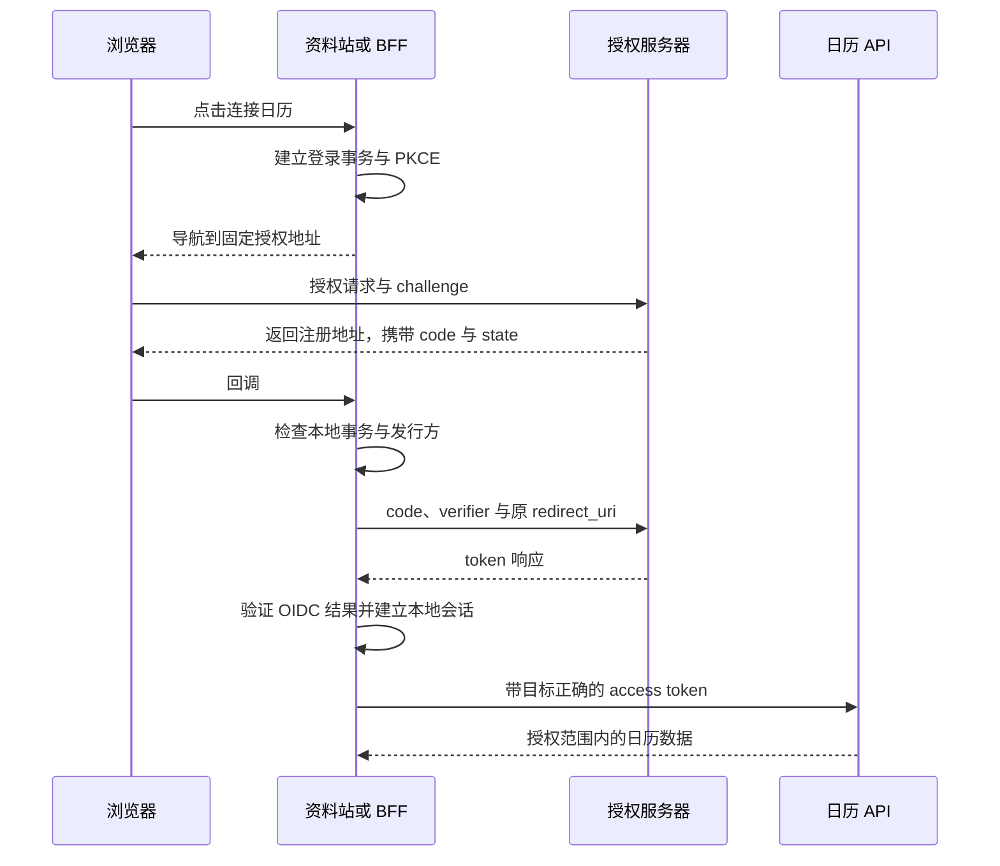

# OAuth 与 OIDC 知识点讲义

## IDENTITY-02 OAuth 安全最佳实践、OIDC 与 PKCE

资料站想让林导入自己的日历。它不应该索要日历账号密码，而应让林在日历服务那里授予有限的读取权限。另一个问题是“用日历账号登录资料站”，这需要明确验证身份。两件事可以共用部分流程，但结论不同。

本讲先沿一次授权码流程走完角色与通道，再把 PKCE、state、nonce、issuer、audience 放回它们真正检查的位置。示例使用合成数据和保留域名，不连接真实身份提供方；展示的局部检查不能代替完整 OIDC 客户端。

### 学习前先确认

- 直接前置：[IDENTITY-01 Cookie、Session、Token 与浏览器身份边界](../chinese-guides/identity-01-session-cookie-token-browser-boundaries.md#identity-01)。需要先分清本地会话与 OAuth 各类令牌，也需要理解浏览器里的代码无法保守 client_secret。

读完应能说明每个值由谁产生、在哪里检查、失败后为何不能建立会话。规范状态核验于 2026-09-19。

### 一、先把角色与两种业务目的分开

**OAuth** 允许客户端获得受限制的资源访问能力。**OIDC（OpenID Connect）**在 OAuth 上增加身份语义，让客户端验证认证结果。

| 角色 | 日历导入中的例子 | 责任 |
| --- | --- | --- |
| 资源所有者 | 林 | 决定是否授予访问 |
| 客户端 | 资料站 | 发起授权并使用结果 |
| 授权服务器 | 日历服务的授权系统 | 认证用户、发放受限令牌 |
| 资源服务器 | 日历 API | 验证凭证与资源权限 |

OIDC 中客户端也称 Relying Party，提供认证结果的一方称 OpenID Provider。真实部署里授权系统与日历 API 可能属于同一家公司，逻辑责任仍然不同。

“拿到了访问日历的 access token”不能直接推出“已验证资料站登录身份”。令牌也可能没有可供客户端解释的身份字段。需要登录时使用 OIDC，并以受信 issuer 下的 subject 绑定本地账号。

### 二、授权码经过浏览器，令牌通过交换取得

**授权码（Authorization Code）**是短期、一次性授权结果，不能拿它直接请求日历 API。



这是带服务端客户端的路线。纯 SPA 也能执行授权码与 PKCE，但交换请求由浏览器发起，令牌会进入浏览器环境；称它为“后通道”不能自动赋予服务端保密能力。

前通道经过导航、URL 和回调，可能被历史、扩展、日志或错误重定向观察。授权码必须绑定客户端、回调地址和 PKCE，短期有效且成功消费后不可重放。失败交换后的重试行为由协议实现和错误语义决定，不能假定任何失败都能无限重试。

### 三、PKCE 把授权请求与兑换者连起来

**PKCE** 的 verifier 是每次事务新生成的随机值。客户端先发送其 SHA-256 摘要的 Base64url 编码作为 challenge，兑换授权码时再提交 verifier；授权服务器核对二者关系。

下面使用 RFC 7636 的公开测试向量，验证编码步骤。这段固定 verifier 只供计算演示，真实登录绝不能重复使用它。

```js example=identity02-pkce-vector
function base64url(bytes) {
  return btoa(String.fromCharCode(...bytes))
    .replaceAll('+', '-').replaceAll('/', '_').replace(/=+$/, '');
}
async function challenge(verifier) {
  const hash = await crypto.subtle.digest('SHA-256', new TextEncoder().encode(verifier));
  return base64url(new Uint8Array(hash));
}
const verifier = 'dBjftJeZ4CVP-mB92K27uhbUJU1p1r_wW1gFWFOEjXk';
const value = await challenge(verifier);
console.log(value); // => E9Melhoa2OwvFrEMTJguCHaoeK1t8URWbuGJSstw-cM
console.log(value.length, value.includes('=')); // => 43 false
console.log(await challenge(verifier + 'x') === value); // => false
```

实际 verifier 可由 32 字节密码学随机数再做 Base64url 编码得到，符合常用长度与字符范围。每次授权独立生成，不能使用时间戳、账号 ID 或前端配置常量。选择 S256，不在支持 SHA-256 的环境中退回 plain。

PKCE 主要阻止只拿到 code 却没有 verifier 的兑换者。它不是客户端秘密，不会阻止控制了原页面的恶意脚本，也不能替代 issuer、回调事务和身份令牌检查。公共客户端按 RFC 9700 使用 PKCE，机密客户端也应将其作为保护的一部分。

### 四、state、nonce 与 PKCE 分别记住哪件事

| 值 | 事务开始时放哪里 | 回来后检查什么 |
| --- | --- | --- |
| state | 受保护的事务记录与授权请求 | 回调属于哪个本地浏览器事务 |
| nonce | 事务记录与 OIDC 请求 | 验证后的 ID token 是否对应本次认证请求 |
| verifier | 事务记录；授权端只收到 challenge | code 的兑换者是否持有本次证明 |
| expected issuer | 可信配置与事务记录 | 响应、令牌与端点是否属于预期提供方 |

本讲选用三个独立随机值，便于清楚表达各自职责。OIDC 请求发送 nonce 后，返回令牌中的对应值必须验证；不能只检查字段存在。

事务还保存 client_id、精确 redirect_uri、开始时间、允许的内部返回路径和消费状态。BFF 把这些留在服务端，并将事务绑定到发起浏览器。纯 SPA 的事务存储暴露面不同，需要按威胁模型选择，不能把整个对象塞进 URL。

state 防护与 PKCE 在规范规定的条件下有部分重叠；不能据此把自己的 state 检查删掉，却没有证明替代方案满足条件。用成熟客户端落实选定流程，比自己拼几个随机字符串更可靠。

### 五、构造请求时固定端点和返回地址

下面只构造地址并检查参数，不执行导航。端点、client_id 和 redirect_uri 来自受审配置，而不是用户输入。

```js example=identity02-request
const bytes = size => crypto.getRandomValues(new Uint8Array(size));
const encode = value => btoa(String.fromCharCode(...value))
  .replaceAll('+', '-').replaceAll('/', '_').replace(/=+$/, '');
const verifier = encode(bytes(32));
const digest = await crypto.subtle.digest('SHA-256', new TextEncoder().encode(verifier));
const transaction = {
  state: encode(bytes(32)),
  nonce: encode(bytes(32)),
  verifier,
  issuer: 'https://id.example',
  redirectUri: 'https://app.example/callback',
};
const url = new URL('https://id.example/authorize');
url.search = new URLSearchParams({
  response_type: 'code',
  client_id: 'notes-client',
  redirect_uri: transaction.redirectUri,
  scope: 'openid calendar.read',
  state: transaction.state,
  nonce: transaction.nonce,
  code_challenge: encode(new Uint8Array(digest)),
  code_challenge_method: 'S256',
}).toString();
console.log(url.origin, url.searchParams.get('response_type')); // => https://id.example code
console.log(url.searchParams.get('code_challenge_method'), url.searchParams.has('client_secret')); // => S256 false
console.log(url.searchParams.has('code_verifier'), verifier.length); // => false 43
```

网页不能保守 client_secret；构建环境变量和混淆都不能改变这一点。服务端机密客户端的客户端认证也与用户认证不同。

回调 URI 按所选协议精确注册，不允许随意通配域名或路径前缀。原生应用的 loopback 端口等特殊规则有各自规范，本讲网页回调不使用这些例外。登录完成后的 returnTo 也要单独限制：

```js example=identity02-return-path
const allowed = new Set(['/notes', '/settings/connections']);
function returnPath(input) {
  return typeof input === 'string' && allowed.has(input) ? input : '/notes';
}
console.log(returnPath('/settings/connections')); // => /settings/connections
console.log(returnPath('https://evil.example/collect')); // => /notes
console.log(returnPath('//evil.example')); // => /notes
```

这是有限页面的允许列表。复杂路由可以采用严格解析后的内部路由模型，不能仅检查字符串是否以斜杠开头。

### 六、回调先认事务，再交换一次授权码

一个回调处理器的顺序可以明确写成：恢复绑定当前浏览器的事务 → 检查是否过期或已消费 → 检查 state、预期 issuer 和响应参数 → 原子领取事务 → 使用固定端点交换 code。

下面只演示本地事务的领取，不发送 token 请求，也不建立会话。合成输入假定已经通过 URL 参数解析；真实入口还应拒绝重复安全参数、同时出现 code 与 error 等歧义。

```ts example=identity02-transaction
type Transaction = {
  state: string; issuer: string; redirectUri: string;
  expiresAt: number; phase: 'pending' | 'claimed';
};
type Callback = { state: string; issuer: string; arrivedAt: string };
function claim(tx: Transaction, response: Callback, now: number): string {
  if (tx.phase !== 'pending') return 'USED';
  if (now >= tx.expiresAt) return 'EXPIRED';
  if (response.state !== tx.state) return 'STATE';
  if (response.issuer !== tx.issuer) return 'ISSUER';
  if (response.arrivedAt !== tx.redirectUri) return 'REDIRECT';
  tx.phase = 'claimed';
  return 'EXCHANGE_ONCE';
}
const tx: Transaction = {
  state: '教学状态', issuer: 'https://id.example',
  redirectUri: 'https://app.example/callback', expiresAt: 60, phase: 'pending',
};
const good: Callback = {
  state: '教学状态', issuer: 'https://id.example', arrivedAt: 'https://app.example/callback',
};
console.log(claim(tx, { ...good, state: '' }, 1)); // => STATE
console.log(claim(tx, { ...good, issuer: 'https://other.example' }, 1)); // => ISSUER
console.log(claim(tx, { ...good, arrivedAt: 'https://app.example/other' }, 1)); // => REDIRECT
console.log(claim(tx, good, 1), claim(tx, good, 2)); // => EXCHANGE_ONCE USED
```

这里的 arrivedAt 表示服务器可信路由识别出的回调地址，不是客户端上报一个字段便算匹配。issuer 响应参数需要提供方支持相应机制；也可按规范使用能区分提供方的回调地址。本节展示的是已配置发行方响应标识的情况。

单进程赋值不是分布式原子领取，生产需使用事务或等价机制。领取后交换失败要进入明确失败或恢复状态；超时可能意味着远端已经消费授权码，不能盲目再次兑换。

### 七、签名验证与 claims 关系检查缺一不可

OIDC 库先根据可信配置验证令牌格式、允许算法、签名和标准声明，再核对当前事务关系。不要让令牌里的任意 jku/x5u 指挥服务器抓密钥；kid 只是受信密钥集合中的选择线索。

**issuer** 标识谁签发，**audience** 指定谁应接收。ID token 的 aud 面向当前客户端，access token 的 aud 面向资源服务器，两者不可交换。

下面只观察“已由验证器输出的声明”与当前事务的关系。对象均为教学数据，没有签名；函数返回 OK 只表示这几项关系相符，绝不能把解码出的任意 JSON 直接传入后当作已完成认证。

```ts example=identity02-claim-relations
type Claims = { iss: string; sub: string; aud: string[]; exp: number; nonce: string; azp?: string };
function relations(value: Claims, now: number): string {
  if (value.iss !== 'https://id.example') return 'ISSUER';
  if (!value.sub) return 'SUBJECT';
  if (!value.aud.includes('notes-client')) return 'AUDIENCE';
  if (value.aud.length > 1 && value.azp !== 'notes-client') return 'AUTHORIZED_PARTY';
  if (value.azp !== undefined && value.azp !== 'notes-client') return 'AUTHORIZED_PARTY';
  if (!Number.isFinite(value.exp) || now >= value.exp) return 'EXPIRED';
  if (value.nonce !== '本次教学随机值') return 'NONCE';
  return 'OK';
}
const good: Claims = {
  iss: 'https://id.example', sub: 'subject-7', aud: ['notes-client'], exp: 100,
  nonce: '本次教学随机值',
};
console.log(relations(good, 1)); // => OK
console.log(relations({ ...good, aud: ['calendar-api'] }, 1)); // => AUDIENCE
console.log(relations({ ...good, nonce: '旧事务的值' }, 1)); // => NONCE
console.log(relations({ ...good, iss: 'https://other.example' }, 1)); // => ISSUER
console.log(relations(good, 100)); // => EXPIRED
```

此处对多个 aud 要求 azp 明确匹配，是本例采用的严格策略。真实客户端还要落实适用流程中的 iat、nbf、auth_time、认证强度与其他相关检查，使用小而明确的时钟容忍范围。nonce 绑定加事务一次性消费共同阻止重复建立会话，不能只验证一次字符串相等就永远接受。

### 八、Discovery 与密钥轮换只能从可信发行方开始

**Discovery** 提供授权、token、UserInfo 与 JWKS 等端点元数据。客户端先固定受信 issuer，再验证元数据中的 issuer 一致性；不能让回调参数换掉预期 token endpoint。

**JWKS** 是验证密钥集合。正常轮换可能短期保留新旧密钥；未知 kid 可以触发受限刷新，但必须有缓存、频率和大小限制，避免每个恶意令牌都发起下载。刷新后仍找不到合适密钥就拒绝。

多提供方的 mix-up 攻击利用“这次授权到底属于谁”的混淆。事务要同时绑定提供方、回调机制与端点，不把 A 的 code 发到 B 的 token endpoint。服务器访问元数据还要限制协议、网络目标和重定向，避免变成任意 URL 代理。

配置变化是安全变更，记录版本与来源，不能把某次 SDK 成功当成所有提供方都已验证。

### 九、账号绑定使用发行方与主体，不靠邮箱碰巧相同

两个身份提供方都声称邮箱是 lin@example.test，不足以证明它们是同一个可自动合并的账号。邮箱会变化或被回收，不同提供方的验证规则也不一样。

```js example=identity02-subject-key
const identityKey = (issuer, subject) => JSON.stringify([issuer, subject]);
console.log(identityKey('https://a.example', '7') === identityKey('https://b.example', '7')); // => false
console.log(identityKey('https://a.example', '7') === identityKey('https://a.example', '7')); // => true
```

客户端在自己配置的发行方与 subject 范围内建立外部身份绑定。已有账号新增身份来源时，应要求合适的近期认证与明确确认；解除最后一种登录方式前应有恢复路径。

UserInfo 的 subject 也应与已验证身份相符。头像、邮箱或昵称只用于相应资料用途，不应自行提升为账号合并证据。收集哪些资料字段还要遵守[PRIVACY-01 的目的与最小化](../chinese-guides/privacy-01-data-minimization-consent-retention-rights.md#privacy-01)。

### 十、scope 限制访问范围，业务授权决定具体动作

calendar.read 表达读取日历的授权范围，却不说明可以读取谁的哪个日历，也不说明某个已归档对象是否允许修改。

资源服务器需要验证 access token 的有效性和目标，再结合主体、资源归属、租户及最新状态授权。不能把面向 API-A 的 token 发给 API-B，也不能把 ID token 当作通用 API 凭证。更细业务约束可对照[TS-08 状态与权限](../chinese-guides/ts-08-domain-state-permission-modeling.md#五角色资源关系与环境条件共同决定授权)。

刷新后 scope 可能缩小，客户端应尊重结果。刷新轮换的重放检测与退出需要协同；如果退出后迟到刷新又写回凭证，就会出现会话复活。[IDENTITY-01 的迟到响应例子](../chinese-guides/identity-01-session-cookie-token-browser-boundaries.md#八退出之后迟到响应不能让页面重新登录)解释了前端应该拒绝哪份结果。

**DPoP** 与 mTLS 可以将令牌绑定到发送方密钥，减少单独窃取令牌后的重放，但仍需要端到端证明验证与重放处理；原客户端被恶意脚本代用的风险并不会因此消失。

### 十一、稳定安全基线与 OAuth 2.1 草案分开记录

截至 2026-09-19，IETF Datatracker 显示 **OAuth 2.1** 为 draft-ietf-oauth-v2-1-16，状态是 Active Internet-Draft，仍不是已发布 RFC。页面的工作组时间计划也不是正式发布承诺。

已发布的 RFC 9700 是 OAuth 2.0 Security Best Current Practice；OIDC Core 1.0 incorporating errata set 2 是本讲身份层的重要依据。正式文档应写清所采用的协议、流程和检查，而不是只贴“OAuth 2.1”标签。

新系统通常选择授权码与 PKCE，避免把 access token 放进隐式流程的前通道；Resource Owner Password Credentials 不作为新系统基线。Client Credentials 表示客户端以自身身份访问服务，不代表某位用户；设备授权等特殊流程也需要各自的规范和交互边界。

迁移旧流程时，客户端注册、回调白名单、scope、刷新与撤销都应一起检查，不能只改授权地址名称。

### 十二、以失败发生在哪一步来组织验证和用户体验

| 失败 | 应停止在哪里 | 页面怎样继续 |
| --- | --- | --- |
| state 缺失、事务不匹配 | 交换 code 之前 | 提示重新发起登录 |
| issuer 或 redirect URI 不符 | 按事务验证处拒绝 | 使用中性错误并记录原因类别 |
| PKCE 不匹配、code 已消费 | token endpoint | 不无限重试旧 code |
| 签名、audience、nonce 不符 | 建立本地会话之前 | 不显示已登录 |
| 用户取消 | 本次流程结束 | 保留普通登录入口 |
| 退出后迟到刷新 | 当前会话版本检查 | 保持已退出 |

真实集成需要使用受控提供方验证完整链路，包括错误签名、密钥轮换、并发事务、重复 code 和撤销。本文例子验证计算和局部关系，未签发真实 ID token，未连接真实 IdP，也不宣称已经完成 OAuth 登录系统。

回调页应尽早清理临时查询参数，避免带进分析、错误采集和外链 Referer；配置恰当的缓存与 Referrer Policy，减少第三方脚本。内部日志保存受限追踪信息和拒绝原因，不保存完整 code、state、verifier 或 token。用户只需要知道如何重新开始，不需要看到敏感协议值。

### 参考与延伸阅读

- [RFC 9700：OAuth 安全最佳实践](https://www.rfc-editor.org/rfc/rfc9700.html)：已发布安全基线。
- [RFC 7636：PKCE](https://www.rfc-editor.org/rfc/rfc7636.html)：证明关系与公开计算向量。
- [OpenID Connect Core 1.0，Errata 2](https://openid.net/specs/openid-connect-core-1_0.html)：身份声明与验证要求。
- [IETF：OAuth 2.1 文档状态](https://datatracker.ietf.org/doc/draft-ietf-oauth-v2-1/)：2026-09-19 核验为第 16 版活跃草案。
