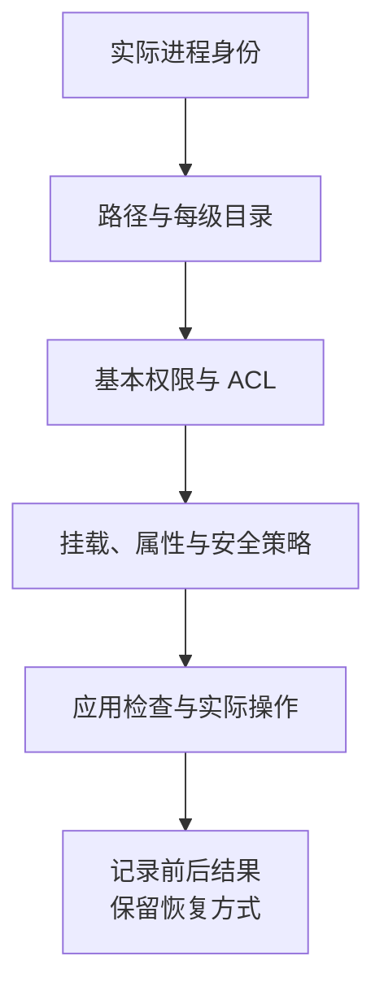

# 文件是只读的，为什么仍然能被删掉

## LINUX-01 文件系统、权限与安全命令

发布目录里的文件已经设成 `444`，却仍被删掉；`current` 明明写着 `releases/42`，从另一个位置检查却得到不同理解；磁盘显示快满了，当前目录的文件加起来又没有那么大。这些现象不是命令随机失效，而是路径、目录项、文件对象和进程身份共同决定的结果。

本讲先建立这些对象之间的关系，再阅读命令，最后用一个只在新临时目录工作的 Bash 实验串起来。示例以 Linux、Bash 和 GNU 工具为前提；Windows PowerShell、Git Bash、BusyBox 与 BSD 工具不能直接当成同一环境。

### 学习前先确认

本讲没有站内直接前置。命令实验需要普通 Linux 用户和独立临时目录；不需要 sudo，不修改系统配置，也不示范对真实项目递归删除。先读清作用对象，再执行对应小节。

### 一、路径是寻找对象的路线

绝对路径从进程看到的 `/` 开始，相对路径从当前工作目录开始。例如当前在 `/srv/atlas`，`releases/42/index.html` 才指向该目录下的版本；换到 `/tmp` 后，同一串文字寻找的是另一条路线。

`pwd` 帮助确认当前位置，但符号链接使逻辑路径与物理路径可能不同；需要物理位置时核对 `pwd -P`。脚本被 CI、定时任务或服务启动后，工作目录也可能与交互终端不同，不能只凭屏幕里看起来熟悉的文件名行动。

**挂载点（Mount Point）**把某个文件系统接入目录树。路径相邻不代表同一磁盘；`/srv`、`/var`、容器挂载目录可以分别拥有容量、选项和故障范围。`findmnt` 查看挂载，`df` 看对应文件系统，必要时再用 `lsblk` 了解块设备，不从目录名称直接推断。

常见目录用途可以帮助定位：`/etc` 多为配置，`/var` 多为变化数据，`/usr` 多为系统程序与共享内容，`/tmp` 是临时数据，`/srv` 可放服务数据。这些是惯例，不替代发行版、挂载和组织实际约定。[Linux 路径解析](https://man7.org/linux/man-pages/man7/path_resolution.7.html)

### 二、文件名、目录项和 inode 分开理解

**inode** 保存文件对象的类型、权限、所有者、大小等元数据；目录项把名称关联到文件对象。精确识别 inode 时还要考虑所属文件系统，不能拿不同设备上相同的 inode 数字认作同一文件。

同一文件可以有两个硬链接名称。下面用内存对象模拟这种关系，不访问真实磁盘：

```js example=linux01-name-object
const object = {content:'版本一'};
const names = new Map([['original',object],['alias',object]]);
names.get('alias').content='版本二';
console.log(names.get('original').content);
names.delete('original');
console.log(names.has('original'),names.get('alias').content,names.size);
// => 版本二
// => false 版本二 1
```

两个名称看到同一内容；删去一个名称，不等于另一个名称也消失。真正的磁盘对象还涉及链接计数、打开引用和文件系统规则，例子只展示名称与对象分离。

普通文件、目录、符号链接、设备、FIFO 和 socket 有不同用途。`ls -l` 首字符提供类型线索，`stat` 查看更完整的模式、设备和 inode。复制、查找与归档前先确认类型，避免把 socket、链接或挂载点当普通文本处理。

### 三、目录的执行位表示能沿路径继续寻找

**权限位（Permission Bits）**中的 r、w、x 要结合对象类型解释。

| 位 | 普通文件 | 目录 |
| --- | --- | --- |
| r | 读取内容 | 读取目录中的名称列表 |
| w | 修改内容 | 修改目录项；实际增删通常还需要 x |
| x | 在满足其他条件时作为程序执行 | 搜索或穿越目录，访问已知名称 |

一个目录有 x 没有 r，可能无法列出所有名称，却能访问已知名称；有 r 没有 x，可能能读名称列表，却不能正常取得其中对象的信息。沿 `/a/b/c` 查找 c，需要前面各级目录允许搜索。只检查 c 的模式不足以解释 Permission denied。

删除文件主要检查其父目录的写入与搜索权限，还受 sticky、只读挂载、不可变属性等条件限制。文件自身没有 w，表示不能按该权限修改内容，不表示名称不可删除。因此 `444` 文件也可能被拥有父目录 w+x 的用户删除。

常用 `namei -l` 逐级观察路径，配合实际身份与末端对象。文件执行位也不是“任何人任何时候都能运行”，挂载选项、解释器、格式与其他安全策略仍可能拒绝。

### 四、先选匹配的权限组，再看是否允许

基本模式分 owner、group、other 三组。对没有扩展 ACL 和额外特权的普通检查，先匹配文件所有者；不是所有者，再匹配文件组与进程所属组；都不匹配才用 other。不能把三组里对自己有利的位拼起来。

```js example=linux01-permission-class
function selectedBits(mode, isOwner, inGroup) {
  return isOwner ? (mode >> 6) & 7 : inGroup ? (mode >> 3) & 7 : mode & 7;
}
const owner = selectedBits(0o460,true,true);
const member = selectedBits(0o460,false,true);
console.log(Boolean(owner & 4),Boolean(owner & 2));
console.log(Boolean(member & 4),Boolean(member & 2));
// => true false
// => true true
```

虽然 owner 也在该组里，他仍先匹配 owner 的 `4`，没有从 group 的 `6` 借来写入权限。这个模型刻意不模拟 ACL、Linux capabilities、fsuid 等完整内核规则，真实判断仍要回到进程和文件系统。

用 `id` 看实际 UID、主组与补充组，用 `stat` 看数字 UID/GID。用户名只是身份映射，跨机器同名不保证同一数字，同一数字也未必对应同一人。协作目录可以使用专门的组与合理 group 权限；目录 setgid 通常帮助新对象继承组，但不会自动保证组可写。

sticky 常用于共享临时目录，限制其中条目的删除与重命名；它不是只读开关。setuid/setgid 可执行文件涉及执行身份变化，与目录 setgid 的用途不同。排错时不应靠 `chmod -R 777` 绕过未知问题，也不应用 root 成功代替服务用户的实际读写结果。

### 五、umask 是按位去掉权限

**umask** 从程序请求的创建模式中屏蔽权限。没有默认 ACL 等额外因素时，可以按 `requested & ~mask` 理解，而不是把两个八进制数字作算术相减。

```js example=linux01-umask-bits
const mode = (requested,mask) => (requested & ~mask & 0o777).toString(8).padStart(3,'0');
console.log(mode(0o666,0o027));
console.log(mode(0o777,0o027));
console.log(mode(0o666,0o003));
// => 640
// => 750
// => 664
```

常见普通文件请求 `666`，目录请求 `777`，因此同一个 `027` 会得到 `640` 和 `750`。第三行说明为何不能机械相减。程序请求的本来就没有执行位，umask 不会凭空添加。

umask 影响之后创建的对象，不回溯改变旧文件。服务、交互 shell 和构建任务可以有不同设置；程序也可能随后 chmod。存在目录默认 ACL 时，创建权限采用的规则还会变化，需要结合 `getfacl` 与实际结果分析。[Linux umask](https://man7.org/linux/man-pages/man2/umask.2.html)

选择值要回到谁需要访问：私密临时目录、只读制品和多人协作上传区有不同需求。不要记住一个数值就用于所有对象，也不要把“创建结果正确”推广成之后所有操作都满足最小权限。

### 六、相对符号链接从链接所在目录解释

**符号链接（Symbolic Link）**保存的是目标路径。`/srv/atlas/current -> releases/42` 的目标按 `/srv/atlas` 解释，不按你运行 readlink 时所在的目录解释。链接可以悬空，也可以跨文件系统；读取目标字符串不证明目标实际存在。

硬链接则是同一文件对象的另一个名称，通常不能跨文件系统，也不能由普通用户任意链接目录。它不是备份副本，修改一处内容会影响所有名称。最后一个硬链接消失后，仍被进程打开的文件也可能继续占用空间，直到相应引用释放。

`readlink` 观察链接文字，路径解析工具观察最终对象，两者用途不同。`stat`、`find`、`cp`、`tar` 等工具是否跟随链接还要看具体选项；不能把一个工具的规则套给其他工具。

发布时不要先删除 current，再创建新链接，否则中间有不存在的窗口。可以先在同一目录建立新的临时链接，再通过 rename 替换 current。实际原子性还受文件系统和工具行为约束，后面给出限定 GNU 环境的演示。

### 七、诊断从身份和对象开始，再查容量与内容

一个实用顺序是：当前主机与身份 → 工作目录与挂载 → 路径每一级 → 对象类型和权限 → 目标内容与预期行为。它比看到拒绝就直接改权限更容易定位原因。

| 想知道什么 | 典型工具 | 结果的边界 |
| --- | --- | --- |
| 当前用户与组 | `id` | 不代表另一个服务进程的全部上下文 |
| 路径每级权限 | `namei -l`、`stat` | 还要结合 ACL、挂载和安全模块 |
| 文件系统空间 | `df -h`、`df -i` | 字节与 inode 是不同资源 |
| 目录实际占用 | `du` | 权限、链接、稀疏文件与挂载影响口径 |
| 类型与文本线索 | `file`、`head`、`tail`、`less` | 文本预览不是完整性证明 |
| 条件定位 | `find`、`rg` | 条件、忽略规则与读取权限影响覆盖 |

`df` 看文件系统使用情况，`du` 遍历可见文件计算使用量。已删除但仍打开的日志、权限无法读取的目录、不同挂载和保留空间等，都可能让结果不同。inode 耗尽也会阻止新建文件，即使字节还有余量。

容量问题先定位增长来源，再决定日志轮转、应用重开文件或受控重启。不要为了演示在真实机器灌满磁盘，也不要把直接改 `/proc` 文件描述符当日常清理方案。结果记录时间、身份、路径和工具版本，并避免输出不必要的敏感内容。

### 八、引号和参数边界决定命令到底收到什么

Bash 在程序启动前处理变量、通配和重定向。`"$path"` 保留一个参数；不加引号可能发生拆词和路径展开。`--` 常用于结束选项，但需确认对应工具支持；给前导短横线文件名加 `./` 也可避免被误认为选项。

文件名可以包含空格、换行和 `*`。用换行分隔的展示文本不能可靠代表任意文件列表；`find -print0` 配合 NUL 消费者，或 `find -exec ... {} +`，才能保持边界。不要用 `for f in $(ls)` 遍历。

通配符 `*` 在 Bash 的通常设置下不包含点文件，无匹配时的行为也受 shell 选项影响。删除与归档范围不能建立在“我觉得星号就是全部”上。找到候选项后先显示准确的对象和类型，再按同一条件执行。

重定向同样由 shell 处理，`sudo command > file` 不会让当前 shell 的打开动作自动提权。`> file` 还可能在 command 失败前截断原文件。重要内容先写新文件、检查结果，再进行受控替换；退出码和实际结果分别观察。

### 九、在新临时目录串起名称、权限与链接

下面是完整 Linux 实验，保存为 `filesystem-lab.sh`，在普通用户的 Linux Bash 中执行 `bash filesystem-lab.sh`。需要 GNU coreutils、findutils、tar 与 util-linux 的 namei。它只删除新目录内一个自己创建的名称，保留整棵实验目录供观察，不自动递归清理。

```bash example=linux01-filesystem-lab runtime=project file=filesystem-lab.sh
#!/usr/bin/env bash
set -euo pipefail
[[ $(uname -s) == Linux ]] || { printf '%s\n' '请在 Linux 中运行。' >&2; exit 1; }
[[ $(id -u) != 0 ]] || { printf '%s\n' '请使用普通用户，不需要 sudo。' >&2; exit 1; }
for tool in mktemp stat namei find tar readlink unlink; do command -v "$tool" >/dev/null; done
umask 027
lab=$(mktemp -d /tmp/career-atlas-files.XXXXXX)
[[ -d "$lab" && ! -L "$lab" ]] || exit 1
case "$lab" in /tmp/career-atlas-files.*) ;; *) exit 1 ;; esac
printf '实验目录：%s\n' "$lab"
mkdir -- "$lab/names" "$lab/releases" "$lab/releases/41" "$lab/releases/42" "$lab/restored"
printf 'lesson 41\n' > "$lab/releases/41/index.txt"
printf 'lesson 42\n' > "$lab/releases/42/index.txt"
printf 'shared object\n' > "$lab/names/original"
ln -- "$lab/names/original" "$lab/names/alias"
chmod 444 -- "$lab/names/original"
stat -c '名称=%n inode=%i 链接数=%h 模式=%a' -- "$lab/names/original" "$lab/names/alias"
# 两个名称是本次新建对象，父目录由当前用户拥有并可写。
unlink -- "$lab/names/original"
cat -- "$lab/names/alias"
stat -c '删除一个名称后：链接数=%h 模式=%a' -- "$lab/names/alias"
touch -- "$lab/names/带 空格.txt" "$lab/names/-option" "$lab/names/.hidden" "$lab/names/"$'两行\n名字.txt'
while IFS= read -r -d '' item; do printf '文件参数：%q\n' "$item"; done < <(find "$lab/names" -maxdepth 1 -type f -print0)
ln -s -- releases/41 "$lab/current"
ln -s -- releases/42 "$lab/current.next"
mv -Tf -- "$lab/current.next" "$lab/current"
readlink -- "$lab/current"
namei -l -- "$lab/current/index.txt"
cat -- "$lab/current/index.txt"
tar -cf "$lab/releases.tar" -C "$lab" releases
tar -tf "$lab/releases.tar"
tar -xf "$lab/releases.tar" -C "$lab/restored"
cmp -- "$lab/releases/42/index.txt" "$lab/restored/releases/42/index.txt"
printf '已保留实验目录，确认内容后自行清理：%s\n' "$lab"
```

观察原文件和 alias 的 inode 相同、链接数最初为 2；原名称删除后 alias 仍可读、链接数为 1。即使模式是 `444`，父目录的控制仍允许删除该名称。不要依赖某个固定 inode 数字，也不要把输出顺序当 find 的稳定排序承诺。

current 应保存相对目标 `releases/42`，读取内容为 `lesson 42`。归档列表只有以 releases 开头的相对成员，不包含 names 和实验目录之外的内容；cmp 成功说明这里比较的文件字节相同。默认 ACL、工具版本和文件系统可能影响创建模式等细节，应保存实际观察。

这不是生产发布脚本，也不建立共享目录组、恶意归档隔离或掉电持久性。没有可用 Linux 环境时，可以先理解前三个可运行的 JavaScript 模型，但不能把它们的结果当作 Bash 与内核权限的实机证据。

### 十、原子替换解决可见性，不自动解决持久性

在同一文件系统内，rename 可使查找者看到旧名称对应的对象或新对象，而不需要经历“文件只写了一半”的状态。跨文件系统的 mv 可能采用复制和删除，不能据命令名字推断原子性。

GNU `mv -T` 将目标作为普通目标处理，避免把临时链接误移到 current 指向的目录内；本实验还保证临时链接由自己在独立目录创建。生产目录若可被其他身份修改，检查后到执行前仍可能发生竞争，不能只复制这几行就宣称路径安全。

原子可见与掉电持久是两个问题。需要持久保证时，还要依据文件系统、存储和应用协议处理文件及目录同步、错误与恢复。已经打开旧文件的进程也可能继续持有旧对象；切换链接不自动重启服务或刷新应用缓存。

制品目录与 uploads、logs 等可变数据分开，有助于限制替换和回滚范围。发布到哪一份字节，应接上 [ENG-08 制品身份](../chinese-guides/eng-08-software-supply-chain-sbom-provenance.md#一先确定要交付的是哪一份字节)，而不是只检查 current 的字符串看起来正确。

### 十一、归档和清理都先确认范围

自己创建归档时，从明确目录使用相对成员名，决定是否跟随链接、是否跨文件系统、怎样保存属性，再列出成员并恢复到新目录比较。活跃数据库不能用普通文件复制自动获得一致备份；那是另一套数据协议。

未知归档还可能通过路径、链接、属性、设备或资源消耗带来风险。仅检查没有绝对路径和 `..` 不能证明安全；需要工具的安全行为、受控身份、独立环境与资源限制。不要以 root 将未知内容覆盖系统，也不要无依据启用 `--absolute-names` 或 `--dereference`。[GNU tar 安全说明](https://www.gnu.org/software/tar/manual/html_section/Security.html)

清理前显示目标、数量、类型和容量，关键内容有恢复方案。`find -xdev` 约束跨设备遍历，但不等于识别所有同设备 bind mount；链接策略和挂载情况仍需确认。递归 chmod/chown 与删除一样会扩大影响，不应为了快捷同时改整棵目录。

`realpath` 与目录边界检查能发现很多输入错误，但在可被攻击者同时修改的目录中，检查和使用之间有竞争窗口。高权限程序需要更强的基于目录描述符和受控解析的做法；本讲不把字符串前缀判断包装成安全沙箱。尤其 `/srv/app-old` 并不是 `/srv/app` 的子目录。

### 十二、权限故障按层查，结果在实际身份下确认

若基本模式看起来允许，还应查看 ACL 及其 mask、默认 ACL、挂载 `ro`/`noexec`/`nosuid`、不可变属性，以及 SELinux/AppArmor 等约束。工具显示的 `+` 是继续查看 ACL 的线索，不是某个权限自动失效的解释。



定位具体拒绝层后做最小修改。共享组缺写权限与 SELinux 上下文不对，需要不同处理；关闭整个安全模块或开放 777，既扩大权限又可能掩盖真正原因。修改前保留原模式、所有者和 ACL，之后在目标服务身份下确认需要的能力以及不应拥有的能力。

命令无输出不等于任务成功。管道状态、权限警告、部分结果和实际消费行为都可能影响结论。Bash 的 `set -e` 与 pipefail 也有上下文边界，不能代替对关键步骤的明确判断。保存运行环境、工具版本、范围和结果，才有条件把本机实验用于后续工程决定。

### 动手想一想

文件模式是 `444`，父目录对你是 `rwx`，为什么可能仍能删除？current 的内容是 `releases/42`，为什么不能把它直接拼到当前终端目录？把相对链接改成绝对链接，又改变了哪种可迁移性？

分别回到目录项的修改权限、链接所在目录和部署根路径。再问一句：还存不存在 sticky、挂载、ACL 或其他策略限制？基本模型帮助提出判断，实际环境决定最终结果。

### 参考与延伸阅读

- [Linux path_resolution](https://man7.org/linux/man-pages/man7/path_resolution.7.html)：路径、目录搜索权限、链接与挂载解析。
- [Linux umask](https://man7.org/linux/man-pages/man2/umask.2.html)：创建模式和默认 ACL 的关系。
- [GNU Coreutils：File permissions](https://www.gnu.org/software/coreutils/manual/html_node/File-permissions.html)：基本模式及工具规则，核对实际 GNU 版本。
- [GNU tar：Security](https://www.gnu.org/software/tar/manual/html_section/Security.html)：归档创建与解压的范围和信任边界。
