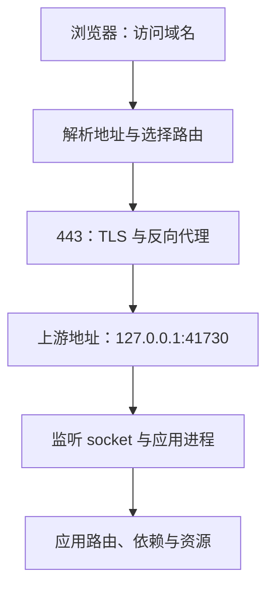

# 浏览器报错时，先找出请求停在了哪里

## LINUX-02 进程、端口、日志与网络诊断

资料站首页能打开，点击“课程列表”却得到 502。有人建议重启 Node，有人建议清 DNS，还有人觉得证书过期了。这些猜测听起来都可能，但解决的是不同位置的问题。第一件事应是把这次请求画出来：浏览器找到了谁，谁接受了连接，又是谁向上游发起了下一次连接。

本讲围绕同一条 Web 请求建立排障方法。Linux 命令用于读取实际状态，示意输出用于练习推理；最后的小实验可以在 Node.js 22 中观察正常响应、应用失败和代理连接失败。示意输出不代表你的机器必然长得一样。

### 学习前先确认

- 直接前置：[NET-01 浏览器网络协议、Fetch 与请求可靠性](../chinese-guides/net-01-browser-network-fetch-reliability.md#net-01)。需要能区分 DNS、连接、TLS 和 HTTP。
- 直接前置：[LINUX-01 文件系统、权限与安全命令](../chinese-guides/linux-01-filesystem-permissions-safe-commands.md#linux-01)。需要理解运行身份、路径和文件读取权限。

### 一、把报错写成能够复现的观察

“打不开”还不足以选择命令。把它改写成：“09:10 UTC，办公网络中的浏览器访问 `https://demo.example.test/api/lessons`，在约 0.2 秒后收到 502；同一浏览器访问首页返回 200。”这句话已经限定了时间、观察位置、协议、路径、结果和对照。

进一步确认影响范围：另一位用户是否相同、只影响一个接口还是全站、IPv4 和 IPv6 是否不同、是否每次都失败。对多实例系统记录请求 ID 和命中的后端实例；一次成功只能证明那一次经过的路径正常。

先保存小范围证据，再变更状态。重启可能清掉短暂连接、内存队列和上一进程的信息。若业务必须立即止血，记录重启发生的时间和对象，承认哪些原始现场已经丢失。恢复与解释根因是两个需要分别完成的目标。

下面的地址和 unit 名均为示例。执行时替换成自己有权诊断的目标，不要把含 Cookie、Authorization 或私人查询参数的完整请求贴进共享记录。

### 二、一次网页请求可能包含两次连接



浏览器到代理是一条连接，代理到 API 是另一条连接。浏览器能收到代理生成的 502，通常说明前一条路径至少已完成了本次 HTTP 交换；这不能证明代理访问上游成功，也不能证明上游使用的 DNS 正常。

因此不要把所有 502 都归结为“服务器没启动”。上游端口错误、连接被拒绝、协议不符、响应中途断开，都可能由代理转换成错误响应；具体映射取决于代理实现。需要先找到**产生这个响应的那一层**，再查它的上游记录。

如果请求根本没有建立 TCP 连接，就还没走到 HTTP 状态码。浏览器显示 DNS 错误、连接超时、证书错误、HTTP 500，代表的是不同观察，不能套同一条“清缓存”处理。

### 三、进程存在、服务运行和业务健康是三件事

**进程（Process）**是正在运行的程序实例，包含 PID、父进程、身份、工作目录、打开的文件和资源。磁盘上有 `server.mjs` 不表示它已运行；看到 Node 的 PID，也不表示它是这一套服务。

```bash
ps -eo pid,ppid,user,stat,lstart,args
systemctl status demo-api.service --no-pager
systemctl show demo-api.service -p MainPID -p ActiveState -p SubState -p ExecMainStatus -p NRestarts
systemctl cat demo-api.service
```

假设 `MainPID=0`、`ActiveState=failed`，应用已不在正常运行。接着查启动日志，而不是继续猜浏览器缓存。若 `MainPID=2184`，还要把这个 PID 与监听关联起来。进程的命令行也可能包含秘密，保存时只保留必要字段。

`STAT` 中 `Z` 表示进程已经结束、父进程尚未回收退出信息；继续给它发 KILL 不能让父进程完成回收。`D` 通常表示不可中断等待，要结合具体 I/O 调查。load average 包含可运行任务和不可中断等待任务，不是 CPU 使用率的另一种写法。

**systemd** 的 unit 说明服务如何启动；drop-in、运行用户、目录与环境都可能改变结果。修改 unit 后的 `daemon-reload` 是让管理器重新读取定义；服务自己的 `reload` 是否支持、会重读什么，由应用和 unit 决定；`restart` 则会更换进程。三者不能互相代替。

### 四、监听地址比端口号多回答一个问题

**套接字（Socket）**是通信端点。读 `ss -ltnp` 时，先看协议和本地地址，再看端口和进程。以下是简化示意：

```text
LISTEN 0 511 127.0.0.1:41730 0.0.0.0:* users:(("node",pid=2184,fd=18))
LISTEN 0 511   0.0.0.0:443   0.0.0.0:* users:(("proxy",pid=902,fd=6))
```

第一行只在**当前网络命名空间**的 IPv4 回环地址监听，适合由同一主机网络空间中的代理访问；另一台机器不能把这个 `127.0.0.1` 当成服务器地址。`0.0.0.0` 表示所有本地 IPv4 地址，不是客户端应填写的目标地址，也不直接证明公网可达。

`[::]:443` 的 IPv4 接受行为还取决于 socket 设置和系统配置。不要看到这一行就断言双栈均正常。查不到进程名也未必没有进程，普通用户可能无权查看其他用户的 socket 信息。

端口已占用时，先确认占用者、启动时间和所属服务。一个“看起来多余”的进程可能仍在承接流量。PID 会复用，几分钟前抄下的数字不能无限期当成同一个实例。容器中的 `localhost` 变化见 [DOCKER-02 的通信方向](../chinese-guides/docker-02-compose-network-volumes-environments.md#三localhost-要连同观察位置一起读)。

### 五、先比较同一主机上的两条请求

若代理与 API 都在同一主机网络空间，先在该主机读取：

```bash
ss -ltnp
curl --noproxy '*' --connect-timeout 2 --max-time 5 -sS -i http://127.0.0.1:41730/healthz
curl --noproxy '*' --connect-timeout 2 --max-time 5 -sS -i http://127.0.0.1:41730/api/lessons
```

`--noproxy '*'` 明确绕过环境代理，让这个实验确实访问本机目标。第一条 HTTP 请求成功、第二条返回 500，说明“端口不可达”已经不足以解释问题；应该查路由和依赖。两条都连接拒绝，则优先看监听地址和服务状态。

curl 默认可以在收到 HTTP 500 后仍以退出码 0 结束，因为传输本身完成了。需要把 HTTP 错误作为命令失败时，可选 `--fail-with-body`，并核对本机 curl 是否支持；不要把进程退出码和响应状态码混成一个值。

直接访问上游可能绕过 Host 路由、TLS、鉴权和路径重写。这是为了隔离一段路径，不是最终验收。若应用按 Host 区分站点，测试请求也要提供匹配的 Host；最后必须回到原域名和原客户端复验。

### 六、DNS、地址族和路由分别查

```bash
getent ahosts demo.example.test
dig A demo.example.test
dig AAAA demo.example.test
ip route get 192.0.2.20
```

`getent` 走系统的名称服务配置，可能包含 `/etc/hosts`；`dig` 查询 DNS。二者不一致时，不要立即断定某个工具出错。浏览器启用的加密 DNS、VPN、分流解析和代理又可能使用另一条路径。记录“由谁向哪个解析器查到了什么”。

A 指向 IPv4，AAAA 指向 IPv6。A 正确不证明 AAAA 正确。用 `curl -4` 与 `curl -6` 分别访问同一域名，可以收窄问题，但某个结果仍只适用于当前网络。权威记录更新后，递归缓存、负缓存和应用缓存可能继续影响实际查询。

`ip route get` 给出本机选用的接口、源地址和下一跳线索，不是端到端连通证明。ping 使用的 ICMP 与目标 TCP 端口不同；ping 不通而 HTTPS 正常完全可能。云安全组、主机防火墙、容器规则及上游网络要按方向、地址族和协议分别看。

### 七、保留域名，才能正确验证 TLS

为了区分 DNS 和目标服务器，可以让 curl 固定连接某个 IP，同时保留 URL 中的主机身份：

```bash
curl --noproxy '*' --resolve demo.example.test:443:192.0.2.20 \
  --connect-timeout 3 --max-time 8 -v https://demo.example.test/api/lessons
```

这里的文档保留地址 `192.0.2.20` 不提供真实服务。`--resolve` 匹配域名与端口，将连接导向指定地址，同时让 HTTPS 仍按域名进行 SNI 和证书校验。仅请求 `https://192.0.2.20` 再加 Host 头，并不等价：HTTP 头在 TLS 握手之后才发送。

检查证书的域名、有效期、链和信任库，也检查客户端时间。浏览器、系统 curl 和应用运行时可能使用不同的信任来源。企业代理或双向 TLS 会增加身份条件，需记录实际路径。

`-k` 会跳过证书校验，因此“加了 -k 能通”只是定位线索，不能成为 HTTPS 恢复的验收。修好后移除绕过，再用正常信任路径验证。详细日志可能带请求头和响应信息，使用专门的无敏感数据请求。

### 八、把耗时拆到阶段，但不要凭一个数字定罪

curl 的时间变量是从请求开始累计的。对一次简单、未重定向、未复用的 HTTPS 请求，假设观察到以下数据：

```js example=linux02-timing-deltas
const time = { dns: 0.010, connect: 0.040, tls: 0.100, firstByte: 0.250, total: 0.300 };
console.log(Math.round((time.connect - time.dns) * 1000)); // => 30
console.log(Math.round((time.tls - time.connect) * 1000)); // => 60
console.log(Math.round((time.firstByte - time.tls) * 1000)); // => 150
```

150 ms 是从 TLS 完成到首字节的这段观察时间，里面还可能有请求发送、网络往返、代理等待和服务端处理，不能直接命名为“数据库耗时”。重定向、连接复用、代理及不同 HTTP 版本又会改变解释前提。

```bash
curl --noproxy '*' --connect-timeout 3 --max-time 8 -sS -o /dev/null \
  -w 'ip=%{remote_ip} code=%{http_code} dns=%{time_namelookup} connect=%{time_connect} tls=%{time_appconnect} first=%{time_starttransfer} total=%{time_total}\n' \
  https://demo.example.test/api/lessons
```

连接拒绝常表示连接尝试被主动拒绝，例如没有监听或规则 reject；超时可能发生在连接前、握手中或等待响应时。先结合错误信息区分阶段，再收集下一条证据。不要因为总耗时恰好 5 秒就断言应用执行了 5 秒。

### 九、日志要接成时间线，资源要看实际限制

```bash
journalctl -u demo-api.service --since '2026-09-22 09:05:00 UTC' \
  --until '2026-09-22 09:15:00 UTC' --no-pager -o short-iso
journalctl -k --since '2026-09-22 09:05:00 UTC' --no-pager
```

**Journal** 汇集带时间、unit 和进程等字段的日志。先限制时间范围，寻找最早的相关错误。十条“连接失败”可能都来自同一次启动失败，而最后一条不一定最接近根因。跨机器先对齐时间与时区；有权限和保留期限制时，“没读到日志”不等于“没发生错误”。

将请求 ID、实例身份和发布时间串起来，避免把昨天进程的错误套在今天。若服务在重启，查上一个实例的退出原因。内存不足、文件描述符耗尽、磁盘容量或 inode 用完，都可能表现为网络失败。

宿主还有空闲内存，不表示 cgroup 内的服务没有触及限额。退出码 137 只提示常见的 SIGKILL 编码，不单独证明 OOM；需要内核记录、cgroup 事件或容器状态等证据。CPU 不高也不能排除锁等待、连接池排队或 I/O 阻塞。

### 十、用一个本地实验看懂 500 与 502

保存为 `diagnostic-lab.mjs`，用 Node.js 22 执行。两个服务都绑定本机回环和系统分配的空闲端口，不调用外部服务。代理的错误映射是本实验自行定义的合同。

```js example=linux02-diagnostic-lab runtime=project file=diagnostic-lab.mjs
import http from 'node:http';
import { once } from 'node:events';
const listen = async server => {
  server.listen(0, '127.0.0.1');
  await once(server, 'listening');
  return `http://127.0.0.1:${server.address().port}`;
};
const close = server => new Promise((resolve, reject) => {
  server.close(error => error ? reject(error) : resolve());
  server.closeAllConnections();
});
let failApplication = false;
const api = http.createServer((request, response) => {
  response.writeHead(failApplication ? 500 : 200, { 'content-type': 'text/plain; charset=utf-8' });
  response.end(failApplication ? '应用内部失败' : '课程列表正常');
});
let apiOpen = false;
let proxyOpen = false;
const proxy = http.createServer();
try {
  const upstream = await listen(api);
  apiOpen = true;
  proxy.on('request', async (request, response) => {
    try {
      const result = await fetch(upstream, { signal: AbortSignal.timeout(1500) });
      const body = await result.text();
      response.writeHead(result.status, { 'content-type': 'text/plain; charset=utf-8' });
      response.end(body);
    } catch {
      response.writeHead(502, { 'content-type': 'text/plain; charset=utf-8' });
      response.end('代理未取得上游响应');
    }
  });
  const entry = await listen(proxy);
  proxyOpen = true;
  const observe = async () => {
    const response = await fetch(entry, { signal: AbortSignal.timeout(3000) });
    console.log(response.status, await response.text());
  };
  await observe();
  failApplication = true;
  await observe();
  await close(api);
  apiOpen = false;
  await observe();
} finally {
  if (proxyOpen) await close(proxy);
  if (apiOpen) await close(api);
}
```

预期依次输出 `200 课程列表正常`、`500 应用内部失败`、`502 代理未取得上游响应`。第二次仍能连到 API，只是应用明确失败；第三次 API 已关闭，而代理仍活着并生成响应。这解释了为什么一个状态码必须结合产生者阅读。

实验没有 DNS、TLS、systemd、网络丢包或实际资源耗尽，不能据此宣称这些 Linux 场景已经验证。真实代理也可能把不同失败转换成其他状态，应查看它自己的日志与文档。

### 十一、停止服务是一段有期限的协作

**信号（Signal）**通知进程处理事件。SIGTERM 常用于请求退出，但是否排空请求由应用实现；SIGHUP 是否重载也由程序约定。SIGKILL 无法捕获，不能执行应用清理。

先确认服务归属，再通过管理它的 unit 或容器进行受控停止。随意 kill 子进程可能马上被重启，甚至杀到已经复用的 PID。停止期限要覆盖应用关闭过程；同时要有上限，防止一个永远不返回的请求阻止发布。

优雅退出通常先停止接新请求，再处理在途工作与资源，超过期限再强制结束。容器的 PID 1、入口脚本和信号转发会影响效果，见 [DOCKER-01 的入口与退出](../chinese-guides/docker-01-images-containers-dockerfile-cache.md#九入口必须让信号到达真正的应用)。Node 的关闭实现可继续查阅 [NODE-04](../chinese-guides/node-04-http-bff-production-engineering.md#十一停止接新任务再有上限地排空)。

### 十二、用最小修复回答完整问题

假设证据为：代理返回 502、上游连接被拒绝、41730 无监听、unit 日志出现工作目录不存在。最小修复应先纠正服务实际需要的目录或配置。修改 DNS 无法解释这个已经确定的上游启动错误；开放公网 41730 还会扩大无关暴露。

修复后依次确认服务启动、正确地址监听、上游关键路径响应，再回原客户端验证域名、TLS 和业务请求。只测 `/healthz` 不足以证明课程接口恢复。若原故障只影响 IPv6，复验也必须包含那条路径。

排障记录保留“观察 → 假设 → 反证 → 修改 → 同路径复验”。仍有差异就明确留下，例如另一区域未验证，不把一台机器的成功推广到所有用户。网络入口的权限设计见 [LINUX-04](../chinese-guides/linux-04-server-security-ssh-users-firewall.md#七端口规则要同时说明来源与观察方向)。

### 动手想一想

代理返回 502，API 的 `/healthz` 在宿主成功，但代理在容器里运行并配置了 `127.0.0.1:41730`。这两个 127.0.0.1 指的是谁？应先增加重试，还是先核对代理实际连接的地址？

再把现象改成“只有 AAAA 路径失败”。这次你会保存哪两组地址、监听和请求结果？尝试解释每条结果能证明什么，以及还不能证明什么。

### 参考与延伸阅读

- [curl 手册](https://curl.se/docs/manpage.html)：resolve、超时、代理、证书验证与时间变量。
- [systemctl 手册](https://man7.org/linux/man-pages/man1/systemctl.1.html)：服务状态、reload 与 daemon-reload。
- [journalctl 手册](https://man7.org/linux/man-pages/man1/journalctl.1.html)：时间窗口、启动批次和字段查询。
- [Linux ss 手册](https://man7.org/linux/man-pages/man8/ss.8.html)：监听、连接与进程信息。
- [Node.js HTTP](https://nodejs.org/docs/latest-v22.x/api/http.html)：实验服务器的监听和关闭能力。
