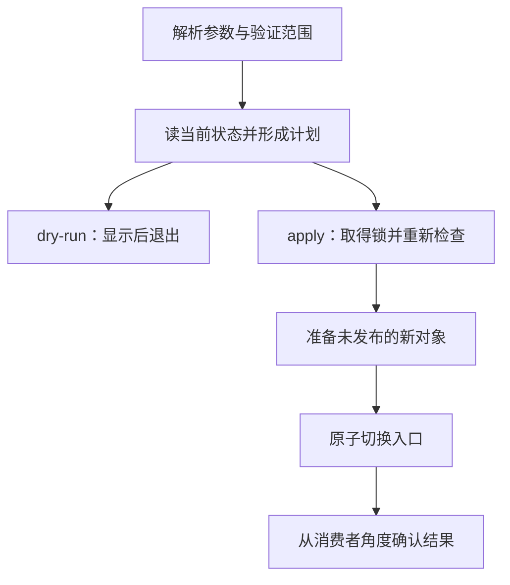

# 同一段命令，为什么手动成功、定时执行却失败

## LINUX-03 Shell 脚本、环境变量与自动化任务

你在终端里发布课程资料，一切正常。把命令放进定时任务后，却写到了错误目录；修好路径以后，第二次执行又重复添加配置；一次下载失败，日志竟然仍显示“完成”。这些问题通常不是再加一个 sleep 就能解决的，而是脚本没有把参数、环境、失败和提交时刻说清楚。

本讲以 Bash 为解释器，把“执行一串命令”变成有明确输入与结果的小工具。前面的短例子只观察 Shell 语义；后面的 Linux 发布实验仅切换自己创建的临时目录里的链接，不修改系统服务。

### 学习前先确认

- 直接前置：[LINUX-01 文件系统、权限与安全命令](../chinese-guides/linux-01-filesystem-permissions-safe-commands.md#linux-01)。需要理解路径、目录权限、符号链接与原子替换。

### 一、先说明脚本接受什么，再写第一条命令

一个发布工具至少要回答：谁来运行、从哪个目录运行、接受哪些选项、读取哪些环境变量、改变什么、失败如何表达。示例合同可以是“接受 release 编号和实验根目录；dry-run 只显示计划；apply 切换 current；重复选择同一 release 不产生新发布”。

解释器也是合同。写了 Bash 数组和 `[[ ]]`，就使用 `#!/usr/bin/env bash`，并检查目标环境中的 Bash；`sh script.sh` 会直接选择 sh，绕过文件头的解释器选择。文件应使用 LF 换行，避免 Windows 的 CR 混入解释器路径或参数。

脚本不应依赖你当前碰巧打开的目录。来自配置的相对路径要有明确基准；运行账号也决定了文件权限和工具可见性。服务或 cron 不必加载你的 `.bashrc`，交互终端中的 alias、版本管理器和自定义 PATH 不能自动算作部署依赖。

### 二、命令收到的是参数数组，不是一句自然语言

**引用（Quoting）**决定变量展开后是否继续拆词和匹配文件。路径 `lesson drafts` 应是一个参数，而不是 `lesson` 与 `drafts` 两个词。保存以下代码为 `argv-lab.sh`，用 Bash 运行：

```bash example=linux03-argv-lab runtime=project file=argv-lab.sh
#!/usr/bin/env bash
set -u
show() {
  printf 'argc=%s\n' "$#"
  printf '<%s>\n' "$@"
}
name='lesson drafts'
show "$name"
set -f
# 这里故意不引用，专门观察拆词；禁用 glob 避免受目录文件影响。
show $name
set +f
args=(--title "$name" --literal '*.md')
show "${args[@]}"
```

前三组结果分别为一个路径参数、两个被拆开的词、四个明确参数。最后的 `*.md` 保持字面值。数组的 `"${args[@]}"` 能保留每项边界，而把所有内容塞进一个字符串再执行，既容易错分参数，也容易引入额外解释。

不要用 `eval` 把外部数据再当 Shell 程序读一遍。双引号保护的是这一层 Shell 展开；目标程序仍可能把 `-rf` 当选项，支持 `--` 的工具要用它结束选项。引用不能代替参数白名单、路径范围和工具自身的安全规则。

单引号保留字面内容；双引号内仍会展开变量和命令替换。远程 SSH 命令还会经过远端 Shell，增加一层解释。复杂 JSON、SQL 或配置优先作为文件、标准输入或结构化参数传入，避免靠多层反斜线猜结果。

### 三、管道传送数据，也隐藏了一串退出状态

默认情况下，管道的状态通常取最后一个命令。前面已经失败，后面成功读到 EOF，并不矛盾。**Pipefail** 让管道返回最右侧非零状态；所有命令成功才返回 0。

```bash example=linux03-pipeline-lab runtime=project file=pipeline-lab.sh
#!/usr/bin/env bash
set +e
set +o pipefail
(exit 7) | cat
printf 'default=%s\n' "$?"
set -o pipefail
(exit 7) | cat
printf 'pipefail=%s\n' "$?"
(exit 7) | (exit 3)
statuses=("${PIPESTATUS[@]}")
printf 'stages=%s,%s\n' "${statuses[0]}" "${statuses[1]}"
```

预期为 `default=0`、`pipefail=7`、`stages=7,3`。`PIPESTATUS` 必须立即保存，下一个简单命令就可能覆盖它。`$?` 也一样，先 printf 一句说明再读状态，读到的可能已经是 printf 的成功。

`if command; then ...; else status=$?; ...; fi` 适合明确处理预期失败。若写 `if ! command`，进入分支后 `$?` 已是逻辑取反后的状态，不能拿它当原命令退出码。stdout 放机器要读的结果，stderr 放诊断信息，避免进度文字混进 JSON。

### 四、严格模式不能替你定义失败后的动作

`set -euo pipefail` 很有用，但不是 try/catch。`-u` 检查未设置的变量，不会判断空字符串是否是合法目录；`-e` 在条件判断、逻辑列表和函数调用上下文中有例外；pipefail 也不会回滚已经写出去的内容。

```bash example=linux03-errexit-lab runtime=project file=errexit-lab.sh
#!/usr/bin/env bash
set -e
step() {
  false
  printf '%s\n' '函数继续运行'
}
if step; then
  printf '%s\n' '分支认为成功'
fi
```

两行都会输出。函数在 if 条件上下文中调用，内部不能指望 `-e` 在 false 处替你退出；最后的 printf 又使函数返回成功。因此关键操作应明确检查，比如 `copy_step || return $?`，而不是让上层某个调用方式决定能否继续发布。

命令替换还有子 Shell 和选项继承差异；后台命令启动成功也不等于任务完成，必须保存 PID 并 wait。ERR trap 可辅助诊断，不能成为涵盖所有失败的万能处理器。**退出码（Exit Status）**应由 CLI 合同说明，让调度器区分参数错误、前置失败和可重试争用。

### 五、环境是输入，秘密不是调试材料

普通 Shell 变量默认不进入子进程环境；`export` 让后续子进程继承，子进程修改不会自动改回父进程。`NAME=value command` 可以只给这次命令提供值，但也要看 command 是否真的读取它。

`${NAME-default}` 在未设置时使用默认值；`${NAME:-default}` 对空字符串也使用默认值。生产目标、数据目录或发布身份不宜悄悄退回开发默认。`${DEPLOY_TARGET:?请设置发布目标}` 能阻止未设置或空值，但仍需验证格式和允许范围。

`.env` 文件不是统一的可执行格式；用 `source .env` 会把其中内容当 Shell 代码执行。只读取受信任的脚本，普通配置应由相应解析器处理。Compose 的插值输入与容器环境也不是一回事，见 [DOCKER-02](../chinese-guides/docker-02-compose-network-volumes-environments.md#四同一个变量名可能在两个阶段生效)。

环境变量、参数、`set -x`、错误追踪都可能暴露秘密。不要打印整份 env，不要把 token 拼进可复制命令。必要时由受控文件或凭据服务提供短期权限；脚本日志记录请求 ID、步骤和错误码，而非凭据内容。

### 六、计划、准备和提交分别承担什么责任



dry-run 不能创建最终配置、锁文件或远端记录；它展示的是当时观察到的计划，不是预订未来状态。apply 取得锁后要重新检查，因为两次调用之间事实可能已变化。两个模式可以共享解析与计划逻辑，但不能为了复用就让预览悄悄写文件。

准备阶段写新对象，验证后再切换入口，可以避免重要文件先被 `>` 截断。单文件 rename 的原子可见性不等于落盘持久性，多文件也不会自动同时切换。基础规则见 [LINUX-01 的原子切换](../chinese-guides/linux-01-filesystem-permissions-safe-commands.md#十原子替换解决可见性不自动解决持久性)。

清理暂存对象与回滚已发布版本不同。提交前失败可以删自己的临时文件；提交后消费者可能已经读取新版本，不能在 EXIT trap 中不分原因地改回去。真正回滚应是另一项有明确目标的操作。

### 七、一个只切换实验链接的完整脚本

保存为 `publish.sh`。需要 Linux、Bash、GNU coreutils 和 util-linux 的 flock；在普通用户自己控制的目录使用。它不是给恶意共享目录或高权限发布系统设计的路径沙箱，也不执行网络下载、数据库迁移或服务重启。

```bash example=linux03-publish-lab runtime=project file=publish.sh
#!/usr/bin/env bash
set -euo pipefail
usage() { printf '%s\n' 'publish.sh --root DIR --release NUMBER --dry-run|--apply'; }
fail() { printf '%s\n' "$2" >&2; exit "$1"; }
root=''; release=''; mode=''; stage=''
while (($#)); do
  case "$1" in
    --help) usage; exit 0 ;;
    --root|--release)
      (($# >= 2)) || fail 2 '选项缺少值'
      if [[ "$1" == --root ]]; then
        [[ -z "$root" ]] || fail 2 'root 重复'
        root=$2
      else
        [[ -z "$release" ]] || fail 2 'release 重复'
        release=$2
      fi
      shift 2 ;;
    --dry-run|--apply)
      [[ -z "$mode" ]] || fail 2 '执行模式重复'
      mode=$1; shift ;;
    *) fail 2 '未知参数' ;;
  esac
done
[[ -n "$root" && -n "$mode" && "$release" =~ ^[0-9]{1,8}$ ]] || { usage >&2; exit 2; }
[[ $(uname -s) == Linux && $(id -u) != 0 ]] || fail 3 '需要普通用户的 Linux 环境'
for tool in flock mktemp readlink mv ln rmdir; do command -v "$tool" >/dev/null || fail 3 '缺少工具'; done
[[ -d "$root" && ! -L "$root" && -O "$root" ]] || fail 3 '实验根目录必须由当前用户拥有'
root=$(cd -- "$root" && pwd -P)
[[ -f "$root/.atlas-lab" && ! -L "$root/.atlas-lab" ]] || fail 3 '缺少实验标记'
[[ -d "$root/releases" && ! -L "$root/releases" ]] || fail 3 'releases 必须为真实目录'
[[ -d "$root/releases/$release" && ! -L "$root/releases/$release" ]] || fail 3 '目标版本不存在'
next="releases/$release"
observe() {
  if [[ -L "$root/current" ]]; then
    current=$(readlink -- "$root/current") || fail 3 '无法读取 current'
  elif [[ -e "$root/current" ]]; then
    fail 3 'current 已存在且不是链接'
  else
    current='(尚未发布)'
  fi
}
observe
if [[ "$mode" == --dry-run ]]; then
  printf 'plan current=%s next=%s\n' "$current" "$next"
  exit 0
fi
umask 077
[[ ! -L "$root/.publish.lock" ]] || fail 3 '锁文件不能为链接'
exec 9>"$root/.publish.lock"
flock -n 9 || fail 75 '另一次发布仍在执行'
observe
if [[ "$current" == "$next" ]]; then
  printf 'unchanged release=%s\n' "$release"
  exit 0
fi
cleanup() {
  local status=$?
  trap - EXIT
  if [[ -n "$stage" ]]; then
    rm -f -- "$stage/current" || printf '%s\n' '暂存链接清理失败' >&2
    rmdir -- "$stage" || printf '%s\n' '暂存目录清理失败' >&2
  fi
  exit "$status"
}
trap cleanup EXIT
trap 'exit 130' INT
trap 'exit 143' TERM
stage=$(mktemp -d "$root/.publish.XXXXXX") || fail 1 '无法准备暂存目录'
ln -s -- "$next" "$stage/current" || fail 1 '无法创建暂存链接'
mv -Tf -- "$stage/current" "$root/current" || fail 1 '入口切换失败'
[[ $(readlink -- "$root/current") == "$next" ]] || fail 1 '入口核对失败'
printf 'published release=%s\n' "$release"
```

同一根目录中的进程约定使用同一把锁；锁是协作机制，不会阻止不守约定的其他工具修改 current。脚本不删除锁文件，避免后来进程锁到另一个新建 inode。锁的语义依赖文件系统，不能把本机 flock 当跨主机分布式锁。

`stage/current` 的相对链接在暂存位置尚不指向目标，这是刻意的：脚本不在暂存处跟随它，先验证目标真实目录，再把链接本身移动到根目录，此时 `releases/42` 才按根目录解析。rename 后旧的已打开文件仍可能被进程使用，切换入口不等于运行中服务已经换版本。

### 八、从空目录观察预览、提交和重复执行

在同一 Linux Bash 会话中创建完全独立的实验目录，`publish.sh` 位于当前目录：

```bash
lab=$(mktemp -d /tmp/atlas-publish.XXXXXX)
printf '%s\n' 'local learning lab' > "$lab/.atlas-lab"
mkdir -- "$lab/releases" "$lab/releases/41" "$lab/releases/42"
printf '%s\n' 'version 41' > "$lab/releases/41/index.txt"
printf '%s\n' 'version 42' > "$lab/releases/42/index.txt"
ln -s -- releases/41 "$lab/current"
bash ./publish.sh --root "$lab" --release 42 --dry-run
readlink -- "$lab/current"
bash ./publish.sh --root "$lab" --release 42 --apply
cat -- "$lab/current/index.txt"
bash ./publish.sh --root "$lab" --release 42 --apply
```

预览后 current 仍为 `releases/41`；apply 后读取到 `version 42`；第二次 apply 输出 `unchanged release=42`。把 release 改为不存在的 99，应在切换前拒绝，current 仍保持 42。回滚实验可显式发布 41，再读同一个入口确认。

可以在另一终端用 flock 持有这个根目录的同名锁，再调用 apply，观察退出码 75；不要以两个命令恰巧错开就声称并发保护生效。SIGKILL、掉电与恶意同用户修改不在这个小实验的恢复保证内。

保留实验目录检查前后对象。清理时先显示并确认这一个由 mktemp 创建的绝对路径；本讲不提供会套用到任意变量上的递归清理快捷命令。

### 九、幂等、锁和远端重试解决不同问题

**幂等性（Idempotency）**关心同一意图重复执行后的效果，锁关心同一时刻是否允许多个执行者，原子替换关心其他观察者是否看到半成品。三个机制不能互相代替。当前脚本对同一 release 的重复切换无变化，不代表随便夹进一条“发送通知”也会自动幂等。

网络请求要有连接和总时间预算。读取失败可能适合有限重试；创建订单或发布通知超时，结果可能已经成功，只是响应未回来。先查原操作或使用服务端支持的幂等键，见 [BIZ-07](../chinese-guides/biz-07-errors-idempotency-eventual-consistency.md#biz-07)。

下载应先落到受控暂存对象，验证来源、格式与内容，再发布；摘要来自不受信任的同一下载渠道时，不能独自证明来源可信。不要用 `curl | sh` 把取得内容与执行内容合成不可审查的一步。

### 十、trap 是清理钩子，不是永不失败的恢复系统

正常退出与可捕获信号可以触发 trap，SIGKILL 和掉电不可以。启动时应能识别上次未完成状态，不能假设退出清理一定执行。清理要只处理自己拥有的对象，尽量幂等，并保留原始失败码。

前面的脚本只运行短小文件命令，不是通用后台任务管理器。如果脚本启动长时间运行的子进程，就必须记录 PID、传递停止信号、wait 并设置期限；仅给父 Shell 写一个 trap 不保证所有后代都已退出。

若入口脚本最终只负责启动一个长期服务，可以用 `exec` 将自己替换成服务，让管理器直接观察它的退出状态。需要同时管理多个子进程时，考虑正式的进程管理器。生命周期的基础见 [LINUX-02](../chinese-guides/linux-02-process-port-log-network-diagnostics.md#十一停止服务是一段有期限的协作)。

### 十一、定时触发只决定何时开始

cron 和 systemd timer 不会自动修复相对路径、重复执行或不完整提交。任务要独立声明用户、目录、可用工具、时区和日志出口；调度记录至少包含最后成功时间、这次结果和下一次触发。

下面是系统级任务的配置示意，路径和账号需要按实际安装调整，不用于自动安装。脚本必须先能在同一服务身份下手动成功。

```ini
# atlas-refresh.service
[Service]
Type=oneshot
User=atlas
WorkingDirectory=/srv/atlas
ExecStart=/usr/local/libexec/atlas-refresh
TimeoutStartSec=2min
```

```ini
# atlas-refresh.timer
[Timer]
OnCalendar=*-*-* 03:00:00 UTC
Persistent=true
RandomizedDelaySec=5min

[Install]
WantedBy=timers.target
```

Persistent 针对 OnCalendar 定时器补偿停机期间错过的触发，不意味着错过七天就逐条重放七次。被触发的 service 已处于活动状态时，不会因此再启动一个同 unit 的并行实例；人工调用脚本或另一个 unit 仍可能并发，因此业务防重不能只交给调度器。

验证时间表达式和实际下一次触发，检查 service 结果与 journal。任务“运行过”不等于成功；成功但处理数量异常为 0 也值得关注。无需把所有失败都立即重试，先区分配置错误与短暂依赖问题。

### 十二、让后来的人能理解、暂停和恢复

脚本审查沿三条路径进行：外部输入最终变成哪些参数，失败最终返回哪个状态，写操作何时变得可见。ShellCheck 能发现许多引用与可移植性问题，但不会替你判断“这是错误生产目录”或“备份其实无法恢复”。

为重要脚本保留帮助、少量代表性失败例子、明确副作用和恢复入口。记录 owner、调用它的 timer/CI、凭据来源与停用方式。参数、退出码与机器输出也是接口，修改时要检查调用方。

复杂 JSON、多个并发任务、事务性恢复或跨平台支持不断增多时，可以把核心逻辑迁移到 Node 等更合适的语言，让 Shell 保留少量命令编排。语言改变后仍要验证参数边界、权限和失败结果，不能把问题寄托在“换个语言就安全”。

### 动手想一想

一个脚本先原子切换 current，再发送通知，通知超时后整个任务被重新执行。文件切换可以无变化，通知是否也一定只有一次？如果收到 SIGKILL，哪一部分证据还留在文件系统中？

再检查自己的 dry-run：它会不会提前建立锁文件、创建目录、读取后又写回配置？哪些动作只是观察，哪些已经改变了世界？

### 参考与延伸阅读

- [GNU Bash Reference Manual](https://www.gnu.org/s/bash/manual/bash.html)：引用、展开、数组、退出状态与 trap。
- [Bash set](https://www.gnu.org/s/bash/manual/html_node/The-Set-Builtin.html)：errexit、nounset 与 pipefail 的条件。
- [flock 手册](https://man7.org/linux/man-pages/man1/flock.1.html)：锁、文件描述符和文件系统限制。
- [systemd timer](https://man7.org/linux/man-pages/man5/systemd.timer.5.html)：日历触发、Persistent 与服务活动状态。
- [ShellCheck](https://www.shellcheck.net/)：静态检查与诊断说明。
