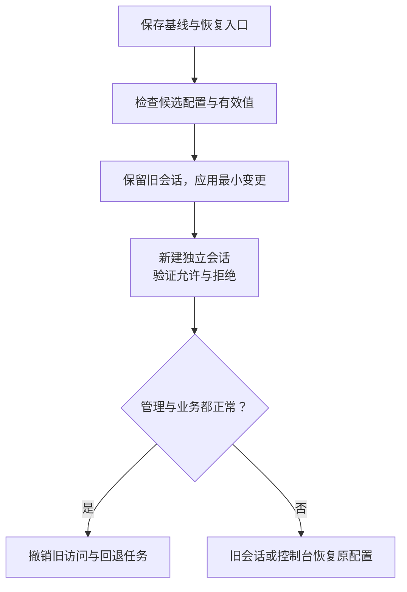

# 服务器能登录之后，谁还能做什么

## LINUX-04 服务器安全、SSH、用户与基础防护

新服务器可以用密钥登录，HTTPS 也正常，于是被标记为“安全配置完成”。后来却发现：部署账号能改 root 执行的脚本，数据库端口也通过 Docker 发布到了公网。登录成功验证了一条允许路径，并没有验证其他路径都被限制住。

本讲以一台运行资料站的 Linux 主机为例，依次回答谁能到达、谁能登录、登录后能做什么、凭据如何撤销，以及配置出错时怎样恢复。配置片段用于理解与隔离环境审查，不应直接覆盖正在使用的 SSH 或防火墙配置。

### 学习前先确认

- 直接前置：[LINUX-01 文件系统、权限与安全命令](../chinese-guides/linux-01-filesystem-permissions-safe-commands.md#linux-01)。需要理解身份、组、目录和可写路径。
- 直接前置：[SEC-01 XSS、CSRF 与信任边界](../chinese-guides/sec-01-xss-csrf-trust-boundaries.md#sec-01)。沿用信任边界与服务端执行约束的思路。

### 一、先画允许关系，再选择配置选项

把服务器想成几条彼此独立的路径，而不是一个“安全/不安全”开关。用户从公网访问 443；维护者经管理网访问 SSH；代理访问本机 API；API 读取自己的数据目录。每一条都应说明来源、目标、身份和目的。

| 主体或来源 | 需要的能力 | 不应顺手获得的能力 |
| --- | --- | --- |
| 普通访客 | 访问公开 HTTPS | SSH、数据库、Node inspector |
| deploy | 发布已核对的应用版本 | 修改 sshd、sudo 策略和其他服务秘密 |
| atlas 应用用户 | 读取制品、写自己的数据 | 修改执行文件、管理 Docker daemon |
| ops-breakglass | 故障期间受控恢复 | 长期共享、无人审计的万能后门 |

这个表是目标，不是机器当前状态。还要读取监听、规则、账号和有效配置，确认事实。控制台、云 IAM、镜像仓库、备份和实例元数据也是入口；关闭 SSH 密码无法限制一个仍有云控制台管理权限的账号。

### 二、最小权限要沿着可写关系检查

**最小权限（Least Privilege）**不是“都不用 root”这么简单。一个普通账号如果能改 root 下次执行的文件，仍可能间接获得 root 能力。要追踪“谁可以写什么、谁会以什么身份执行或读取它”。

例如 `/usr/local/libexec/restart-atlas` 是 root 执行的发布工具。文件本身不可写还不够：父目录若可替换文件、它加载的配置若能指定任意命令、它调用的程序若从可写 PATH 查找，授权链仍可能被改变。

部署者能替换应用代码，就拥有应用运行身份所能行使的能力。若应用能读取数据库凭据，不能仅凭“deploy 无权直接 cat 凭据文件”就宣称部署者完全接触不到这些能力。隔离高敏数据需要进一步的发布审批、执行身份和外部权限设计。

应用账号、备份账号与部署账号按职责分开；无交互需求的服务账号不提供通用登录。容器 daemon、宿主挂载和特权能力同样要沿这条关系检查，不把组名看起来普通当作低权限证据。

### 三、SSH 同时验证两种不同身份

**SSH** 首先让客户端确认正在连接哪台服务器，再让服务器确认用户。服务器的 **Host Key** 与用户私钥承担不同角色：前者防止你把秘密交给错误主机，后者证明你有权以某用户认证。

首次连接显示指纹时，应通过已信任的控制台、资产记录或管理员渠道核对。`ssh-keyscan` 能收集当前网络返回的公钥，却不能自行证明返回者就是目标服务器。未知网络给你的指纹再与同一网络扫描结果比较，只是在重复同一个信任假设。

host key 变化可能来自重装、合法轮换、地址复用，也可能是错误路径或攻击。先核对变化原因，再更新 known_hosts；直接关闭 StrictHostKeyChecking 会抹掉需要调查的信号。克隆机器镜像时，也要避免多台主机无意共用同一套私钥。

个人密钥各自归属，自动化密钥绑定具体用途。agent forwarding 会让远端在会话期间借用认证能力，并不是只“传了个方便的配置”；跳板可优先考虑 ProxyJump，并审查每一跳的身份与权限。

### 四、读有效配置，不能只读你刚改的文件

sshd 的 Include、Match、启动参数和发行版默认配置共同决定结果。很多选项采用第一个取得的值，不能照搬“最后一行覆盖前面”的直觉；Match 条件下也要按该选项实际语义验证。

下面是仅用公钥认证的教学策略片段。它不是完整 sshd 配置；尤其已有 PAM/MFA 的环境，关闭 keyboard-interactive 可能破坏所需认证链，不能直接套用。

```text
PermitRootLogin no
PubkeyAuthentication yes
PasswordAuthentication no
KbdInteractiveAuthentication no
AuthenticationMethods publickey
AllowUsers deploy ops-breakglass
AllowAgentForwarding no
AllowTcpForwarding no
X11Forwarding no
PermitTunnel no
```

先对准备好的**完整候选配置**进行检查，路径仅为示意：

```bash
sudo /usr/sbin/sshd -t -f /srv/ssh-review/sshd_config
sudo /usr/sbin/sshd -T -f /srv/ssh-review/sshd_config \
  -C user=deploy,addr=192.0.2.10,host=admin.example.test,laddr=192.0.2.20,lport=22
```

`-t` 检查配置及相关密钥条件，`-T -C` 展示给定连接条件下的有效结果。应分别检查 deploy、应急账号与不允许账号；语法通过不证明网络可达，更不证明真实密钥能完成认证。

候选配置中的 Include 仍可能指向系统其他文件，因此“我只检查了暂存文件”不代表检查是完全自包含的。安装后还要核对实际启动命令和真实有效配置。服务名在不同发行版可能是 ssh 或 sshd，先查实际 unit。

### 五、公钥登记、轮换与撤销是一段生命周期

用户公钥常放在 `authorized_keys`；其 owner、权限以及父目录路径都影响读取。通常为用户自己的 `.ssh` 设置 700、公钥列表 600，但这些数字不是所有 ACL、挂载和服务设置下的完整证明。拒绝登录时先结合认证日志和 [路径权限解释](../chinese-guides/linux-01-filesystem-permissions-safe-commands.md#linux-01)，不要把目录改成 777。

公钥注释中写 `expires=tomorrow` 只是一段注释，不会自动到期。到期要由支持的 key 选项、短期 SSH 证书或外部身份系统实际执行，并核对目标 OpenSSH 版本。来源限制与固定命令也需要真实拒绝结果，不能只看文件里出现几个关键词。

自动化 key 可按需求限制来源、PTY、端口和 agent 转发，并绑定经过审查的固定命令；这些选项不替代命令自身的输入检查。固定命令若继续把 `SSH_ORIGINAL_COMMAND` 交给 eval，边界又被打开了。

轮换顺序是增加新访问、验证新访问、撤销旧访问，再验证旧访问确实拒绝。撤销认证材料通常影响后续认证，不会自动结束已有 SSH 会话；还要处理跳板、CI、云凭据和长期连接。不要在日志中记录私钥。

### 六、sudo 的允许命令必须追到执行内容

**Sudoers** 控制某用户能以另一身份执行哪些命令。绝对命令路径、参数、目标用户和环境都重要。假设只允许 deploy 重启一个已审查的服务，策略片段可能类似：

```text
deploy ALL=(root) /usr/bin/systemctl restart atlas-api.service
```

这不是授权所有 systemctl 操作，也不是允许 deploy 编辑 unit。路径应按主机核对；使用 visudo 检查候选文件，再检查整套实际策略。需要无人值守的 NOPASSWD 时，也只对必要命令设置，而不是复制 `ALL=(ALL) NOPASSWD: ALL`。

```bash
sudo visudo -cf /srv/ssh-review/deploy.sudoers
sudo -l -U deploy
```

即使这一行很窄，也要检查 unit、drop-in、EnvironmentFile、ExecStart 和实际代码是否能被 deploy 改成以 root 执行。编辑器、解释器、包管理器及可执行插件的工具经常拥有超出表面命令名的能力。

命令参数没有被约束时，含义可能比“只许运行这一个程序”宽得多；不要把 sudoers 当普通 shell glob 理解。若使用包装工具，工具和加载链应由可信身份管理，输入范围固定，拒绝任意路径或任意命令。

### 七、端口规则要同时说明来源与观察方向

“只开放 443”如果没有说明管理路径，会让维护者在下一次连接时被锁住。更准确的目标是：访客公网仅可达 443，管理网可达 SSH，API 仅对同主机代理开放，数据库仅对应用网络开放。

**纵深防御（Defense in Depth）**让云安全组、主机防火墙、监听地址和应用权限相互补充。规则要覆盖 IPv4 与 IPv6、TCP 与 UDP，并区分进入本机和转发到其他网络的流量。只列出 IPv4 的规则不能证明 IPv6 没有入口。

Docker 在 Linux 上会维护自己的网络规则。发布端口的流量可能绕过你以为能保护它的 UFW 路径；Docker 官方专门说明了二者的不兼容点。因此“UFW 显示拒绝”不能单独证明某个容器端口不对外开放。减少不必要的发布，并从实际外部来源核对。

监听 `0.0.0.0`、公网地址、云规则和 NAT 共同影响可达性。宿主回环可访问只能证明本机路径，外部连接超时也不能单独证明防火墙拒绝。按 [LINUX-02 的观察链](../chinese-guides/linux-02-process-port-log-network-diagnostics.md#四监听地址比端口号多回答一个问题)保存监听、规则与连接结果。

### 八、先证明新路径可用，再撤旧路径



验证新配置的第二会话必须在配置生效后**重新建立连接**。已有会话继续可用不能证明新登录成功；复用已有 SSH ControlMaster 连接也可能绕过你本来想验证的完整认证过程。使用独立会话，必要时明确禁用连接复用。

配置生效前，可以先确认备用账号和控制台当前可用；生效后，再验证新的登录规则。不要把“变更前测试成功”记录成“变更后的访问验证”。保持旧会话只是恢复条件之一，不能保证防火墙、路由或主机故障后它永远不断。

自动回退也要在变更前准备并确认能运行。回退任务应不依赖即将被修改的 SSH 路径；通过新的正常会话确认管理与业务访问后，再取消它。把 SSH、用户组、防火墙和网络路由一次全改掉，会让失败很难定位。

### 九、服务硬化要保留必要写入能力

资料站的可执行文件和静态制品应由发布流程管理，应用只读；上传、缓存和运行状态放在专门路径。这样即使应用被攻陷，也较难直接覆盖下次启动的程序。TLS 私钥只提供给真正终止 TLS 的组件，不因“同一台主机”就给全部服务读取。

以下是服务 unit 的硬化思路片段，需要逐项与实际应用核对：

```ini
[Service]
User=atlas
Group=atlas
NoNewPrivileges=yes
PrivateTmp=yes
ProtectSystem=strict
ProtectHome=yes
ReadWritePaths=/var/lib/atlas
```

这些选项既有平台条件，也有行为边界。ReadWritePaths 不会替应用创建目录或授予基础文件权限；PrivateTmp 可能改变原来通过 `/tmp` 交换文件的方式；已有打开的描述符及其他隔离设置也影响最终能力。硬化评分高不能代替业务验证。

API 不应对公网暴露 Node inspector、管理面或开发服务器。容器的只读根文件系统、能力限制和数据挂载继续在 [DOCKER-01](../chinese-guides/docker-01-images-containers-dockerfile-cache.md#八非-root-与只读文件系统解决不同问题)中展开；它们也不替代应用自身的鉴权。

### 十、更新、日志和备份需要持续有人负责

记录 OS、内核、OpenSSH、运行时和服务的支持状态与更新来源。安装了新库以后，正在运行的进程仍可能使用旧版本；是否需要重启、怎样分批恢复，应由维护流程确认。固定版本用于可追溯，不是永久停止更新。

收集认证成功与失败、sudo、账号变化、关键配置变化和服务退出，统一时间与保留策略。日志过量会填满磁盘，日志中断也可能是故障。获得 root 的攻击者可能修改本机记录，因此重要审计需要独立保存与访问控制。

备份应跨出生产故障域，并限制生产凭据直接删除备份的能力。恢复演练读取真实业务结果和权限，不能只检查归档文件存在。备份本身也包含敏感数据与密钥恢复材料，要有加密、保留和撤销安排。

### 十一、用允许与拒绝的对照识别配置漂移

建立小型验证矩阵，比“全部符合基线”更有用：

| 验证对象 | 应允许 | 应拒绝或不存在 |
| --- | --- | --- |
| SSH | 管理路径中的新 deploy 密钥 | 已撤销密钥、无关用户 |
| sudo | 明确授权的服务动作 | 编辑 sudoers、运行任意解释器 |
| 网络 | 公网业务 HTTPS | 公网 API 内部端口和 inspector |
| 文件 | atlas 写自己的数据目录 | atlas 修改发布工具或其他服务秘密 |

从对应身份和来源实际观察，保留时间与目标版本。拒绝可能来自网络、认证或文件权限中的不同层，不能只记“失败”而不记原因。有效 SSH 策略、组成员、容器发布与云安全组一起比较，才能发现单一配置文件看不出的漂移。

临时例外写明负责人、原因和到期方式。到期必须有人或系统执行撤销；表格中的日期不是权限控制。限速和自动封禁可减少暴力尝试，但共享 NAT 和维护者误操作也可能触发，要保留受控恢复通道。

### 十二、可疑登录之后先限制影响，再重新建立信任

遇到异常登录，先保存必要时间线、限制影响范围，撤销相关身份与会话，再判断主机是否仍可信。仅改一个密码不能消除已落地的持久化程序，也不能撤销已经获取的其他秘密。

若攻击者获得高权限，通常需要从可信制品和配置重建，轮换可达凭据，并检查云、仓库、CI、备份等相邻系统。重建后核对机器身份、应用摘要、权限和监控，而不是只看旧告警消失。

发布回滚不能顺手恢复已撤销的密钥或已废止的安全基线。应用版本、数据版本和安全策略有不同生命周期；制品证据的归属见 [ENG-08](../chinese-guides/eng-08-software-supply-chain-sbom-provenance.md#十二升级和响应都围绕同一条证据链)。

### 动手想一想

deploy 不能编辑 sudoers，却能改一个由 root 执行的发布脚本。这个账号到底拥有什么能力？如果 API 容器发布了 41730，而 UFW 拒绝该端口，你需要从哪里观察才能判断公网是否真正被限制？

再考虑轮换：新 key 登录成功、旧 key 从文件删除、旧 SSH 会话仍然可用，这三件事是否互相矛盾？分别说明认证与现有连接的生命周期。

### 参考与延伸阅读

- [OpenSSH sshd_config](https://man.openbsd.org/sshd_config)：认证、Include、Match 与转发限制；对照实际安装版本。
- [OpenSSH sshd](https://man.openbsd.org/sshd)：有效配置检查、公钥选项与登录过程。
- [sudoers 手册](https://www.sudo.ws/docs/man/sudoers.man/)：目标身份、命令与参数约束。
- [systemd.exec](https://man7.org/linux/man-pages/man5/systemd.exec.5.html)：服务身份和文件系统隔离。
- [Docker 网络规则与防火墙](https://docs.docker.com/engine/network/packet-filtering-firewalls/)：端口发布、转发规则与 UFW。
