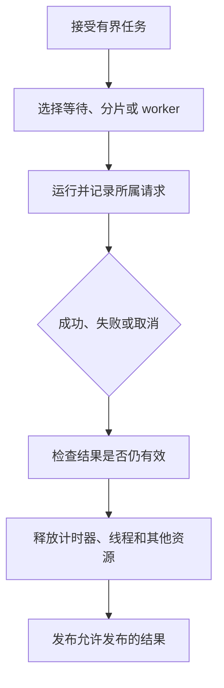

# Node.js 运行模型知识点讲义

## NODE-01 Node 运行时、事件循环与非阻塞 I/O

一个资料导入接口用了 await readFile，为什么导入时连“服务正常吗”都迟迟不回复？因为等待文件和解析文件是两段不同的工作：读取可以异步等待，JSON.parse 仍可能长时间占着 JavaScript 主线程。

本讲先认清工作在哪里执行，再看回调何时获得机会，最后用分片、worker 和测量解释怎样减少相互拖累。示例使用 Node.js 22，保存为标注的文件后执行 node 文件名；.cjs 与 .mjs 的区别是实验输入的一部分，不要把代码直接贴进浏览器控制台。

### 学习前先确认

- 直接前置：[JS-04 异步、Promise 与事件循环](../chinese-guides/js-04-async-promise-browser-event-loop.md#js-04)。本讲沿用调用栈、任务与微任务，再补充 Node 宿主的差别。

### 一、一个 Node 进程不止一种执行路径

**运行时（Runtime）**提供 JavaScript 与外部世界交互的能力。V8 执行代码，Node 提供文件、网络等 API，libuv 与操作系统协作安排等待和就绪通知。

| 工作 | 通常由谁推进 | 回到 JavaScript 后的成本 |
| --- | --- | --- |
| 普通函数、JSON.parse、复杂循环 | 当前 JavaScript 线程 | 会占用该线程，其他回调等待 |
| 网络连接等待 | 操作系统的网络机制与事件通知 | 读取结果、解析与业务回调仍需执行 |
| 异步文件操作、部分 DNS、加密和压缩 | libuv 工作线程池等实现路径 | 完成回调仍需获得机会 |
| 显式创建的 worker_threads 任务 | 独立 JavaScript 线程 | 通信、复制与主线程处理仍有成本 |

不要把“默认一个 JavaScript 主线程”理解为整个进程只有一个线程。也不要把所有异步操作都画进线程池：网络等待与文件操作的实现路径通常不同。

把餐厅比喻用到这里就足够了：接待员可以在厨房备餐时接待下一位，但如果接待员自己连续计算三分钟账单，已经做好的菜也得等。接下来要靠实际 API 和测量判断，不能用比喻替代运行机制。

### 二、异步等待结束后，回调仍可能阻塞

给一个函数加 async，不会让函数内部的计算自动离开当前线程。await 让出的是等待结果期间的执行机会，不会把前后的同步工作搬到别处。

```js example=node01-async-cost
const steps = [];
async function parseNow() {
  steps.push('开始解析');
  const value = JSON.parse('{"count":3}');
  steps.push('解析结束');
  return value.count;
}
const pending = parseNow();
steps.push('调用者继续');
console.log(steps.join(' → ')); // => 开始解析 → 解析结束 → 调用者继续
console.log(await pending); // => 3
```

先看到解析结束，才看到调用者继续，原因是 parseNow 在返回 Promise 前已完成同步解析。把输入换成巨大 JSON，基本关系不变，耗时却可能显著增长。

完整导入还有多份内存：文件字节、解码后的字符串、解析后的对象、生成的新结果。只看文件体积容易低估峰值。应先限制输入，再决定整块处理、逐条处理还是卸载计算。[NODE-02](../chinese-guides/node-02-files-streams-buffers-errors.md#node-02)会把这个问题接到字节和记录边界。

### 三、先比较模块入口，再讨论微任务顺序

**事件循环（Event Loop）**安排就绪的回调。process.nextTick 有独立队列，Promise reaction 与 queueMicrotask 使用微任务队列；“nextTick 总在 Promise 前”却不是脱离调用位置的通用结论。

先保存为 order.cjs：

```js example=node01-order-cjs runtime=project file=order.cjs
console.log('同步');
process.nextTick(() => console.log('nextTick'));
Promise.resolve().then(() => console.log('Promise'));
queueMicrotask(() => console.log('microtask'));
console.log('结束');
// => 同步
// => 结束
// => nextTick
// => Promise
// => microtask
```

再把同样的四类动作放到 order.mjs：

```js example=node01-order-esm runtime=project file=order.mjs
console.log('同步');
process.nextTick(() => console.log('nextTick'));
Promise.resolve().then(() => console.log('Promise'));
queueMicrotask(() => console.log('microtask'));
console.log('结束');
// => 同步
// => 结束
// => Promise
// => microtask
// => nextTick
```

这里差异来自 ESM 模块求值的异步上下文：顶层代码已经处在相应微任务执行过程中。本例 Promise 和 queueMicrotask 的相对顺序来自入队顺序。两段输出用于解释这两个明确入口，不能外推为每个回调、每个嵌套任务都相同。

真正依赖先后的业务应显式 await 或使用有顺序的队列，不应借一个“通常先执行”的 API 偷渡因果关系。

### 四、在 I/O 回调里看 poll、check 与计时器

阶段图适合定位 API 的机会，不适合当作精确时钟。poll 处理 I/O 就绪，check 运行 setImmediate，timer 达到阈值后才有资格执行。pending callbacks 和 close callbacks 还处理各自的待办。

```js example=node01-io-order runtime=project file=io-order.mjs
import { readFile } from 'node:fs';
readFile(new URL(import.meta.url), error => {
  if (error) throw error;
  console.log('I/O 回调');
  process.nextTick(() => console.log('nextTick'));
  Promise.resolve().then(() => console.log('Promise'));
  setImmediate(() => console.log('immediate'));
  setTimeout(() => console.log('timer'), 0);
});
// => I/O 回调
// => nextTick
// => Promise
// => immediate
// => timer
```

本例把两个调度操作放进同一次文件读取回调，在这个 I/O 上下文里 immediate 先于 timer。移到主模块入口，二者不应被当成稳定的业务排序机制。虽然文件是 .mjs，这里的回调顺序也不等于上一节的顶层求值顺序。

Node 官方文档特别说明 libuv 1.45、Node 20 起的计时器阶段变化。记录实际 Node、libuv、操作系统与调用位置，比背“零毫秒就是立即执行”更有用。setTimeout(0) 还有最小延迟处理，也会受已有工作和系统调度影响。

### 五、让出微任务不等于让出 I/O 机会

不断 await Promise.resolve()，仍可能让微任务一直排下去。有限演示足以观察这种效果，不必运行会卡死进程的无限 nextTick 递归。

```js example=node01-yield runtime=project file=yield.mjs
import { setImmediate as yieldToLoop } from 'node:timers/promises';

let observer = false;
setImmediate(() => { observer = true; });
for (let i = 0; i < 100; i++) await Promise.resolve();
console.log('微任务循环后', observer); // => 微任务循环后 false

await yieldToLoop();
console.log('让出循环后', observer); // => 让出循环后 true

let sum = 0;
for (let start = 0; start < 1000; start += 100) {
  for (let i = start; i < start + 100; i++) sum += i;
  await yieldToLoop();
}
console.log(sum); // => 499500
```

**饥饿（Starvation）**描述某类工作一直得不到机会。分片让计算在有界批次之间暂停，让其他回调可以运行；总计算量并没有减少，也没有因此使用更多核心。

“每 100 条让一次”只适合成本接近且有上限的条目。如果某一条就可能做巨大的 JSON.parse，再小的批次也救不了这一条。可以结合时间预算分片，但一次不可中断操作仍是最小边界；输入限额和算法选择必须先做。

### 六、worker 的价值是隔开 CPU 执行位置

**工作线程（Worker Thread）**适合独立且较重的 CPU 工作。它拥有自己的 JavaScript 执行环境，不是给每个网络请求都开一个新线程的理由。

下面两份文件一起保存。work.mjs 接收一个只含数字的教学任务，在自己的线程中累计结果；故障参数只用于演示错误传播。

```js example=node01-worker-body runtime=project file=work.mjs
import { parentPort, workerData } from 'node:worker_threads';
if (workerData.fail) throw new Error('教学任务失败');
let sum = 0;
for (let i = 0; i < workerData.count; i++) sum += i;
parentPort.postMessage({ sum });
```

worker.mjs 为任务设置上限，接住 message、error 和没有结果的 exit，并在退出后才把结果交给调用者：

```js example=node01-worker-owner runtime=project file=worker.mjs
import { Worker } from 'node:worker_threads';

export function runTask({ count, fail = false }, { signal } = {}) {
  if (!Number.isSafeInteger(count) || count < 0 || count > 10_000_000) {
    return Promise.reject(new RangeError('任务规模越界'));
  }
  if (signal?.aborted) return Promise.reject(signal.reason);
  return new Promise((resolve, reject) => {
    const worker = new Worker(new URL('./work.mjs', import.meta.url), {
      workerData: { count, fail },
    });
    let result, failure, received = false;
    const stop = reason => {
      failure ??= reason;
      void worker.terminate().catch(error => { failure ??= error; });
    };
    const onAbort = () => stop(signal.reason);
    const timer = setTimeout(() => stop(new Error('任务超时')), 5000);
    signal?.addEventListener('abort', onAbort, { once: true });
    worker.on('message', value => {
      if (received || !value || !Number.isSafeInteger(value.sum)) {
        stop(new Error('无效任务结果'));
      } else {
        received = true; result = value.sum;
      }
    });
    worker.on('error', error => { failure ??= error; });
    worker.once('exit', code => {
      clearTimeout(timer);
      signal?.removeEventListener('abort', onAbort);
      if (signal?.aborted) failure ??= signal.reason;
      if (failure) reject(failure);
      else if (code !== 0 || !received) reject(new Error('任务退出但没有完整结果'));
      else resolve(result);
    });
  });
}
console.log(await runTask({ count: 1000 })); // => 499500
try { await runTask({ count: 10, fail: true }); }
catch (error) { console.log(error.message); } // => 教学任务失败
const controller = new AbortController();
controller.abort(new Error('已取消'));
try { await runTask({ count: 10 }, { signal: controller.signal }); }
catch (error) { console.log(error.message); } // => 已取消
```

这个顺序实验一次只跑一个任务，尚未实现生产 worker 池。实际池需要限定线程数、队列长度、每租户份额和任务期限；排队时间也算等待，不应在拿到线程之后才开始计时。

terminate 是强制停止，适合这里没有外部写入的纯计算。需要提交文件或数据库的任务，应定义协作取消点与事务边界，不能假设强杀线程等于撤销副作用。

### 七、通信要同时考虑复制、所有权与迟到结果

普通对象传给 worker 通常经过结构化克隆。把很大的解析对象发过去，可能先在主线程付出复制成本；更合理的边界有时是把受控字节交给 worker 解析，再返回小结果。

可转移的 ArrayBuffer 会移动所有权，发送方对应缓冲区会失效；SharedArrayBuffer 则是共享，必须设计同步。Node 的 Buffer 可能使用内存池，不能见到 buffer 属性就假设能安全转移；应根据 API 和分配方式核对所有权。

结果也有“属于哪次请求”的问题。任务结束时，页面可能已经退出或请求已经超时。先确认任务编号、当前版本与取消状态，再发布结果。这个关系可对照[B17 的迟到响应](../chinese-guides/identity-01-session-cookie-token-browser-boundaries.md#八退出之后迟到响应不能让页面重新登录)：停止等待与不让旧结果生效是两件事。

### 八、测量要包含真实的观察窗口

**事件循环利用率（Event Loop Utilization）**衡量观察窗口内循环活跃与空闲的比例；monitorEventLoopDelay 记录调度延迟，单位是纳秒。一个指标不能包办“用户为什么慢”。

把下面保存为 measure.mjs。示例用受控忙循环制造短暂阻塞，只在本地实验中运行：

```js example=node01-measure runtime=project file=measure.mjs
import { monitorEventLoopDelay, performance } from 'node:perf_hooks';
import { setTimeout as sleep } from 'node:timers/promises';

async function measure(label, action) {
  const histogram = monitorEventLoopDelay({ resolution: 10 });
  const before = performance.eventLoopUtilization();
  const started = performance.now();
  histogram.enable();
  await sleep(30); // 先让采样器进入事件循环。
  await action();
  await sleep(30); // 让延迟样本有机会被记录。
  const utilization = performance.eventLoopUtilization(before);
  histogram.disable();
  console.log(JSON.stringify({
    label, windowMs: Math.round(performance.now() - started),
    maxDelayMs: Math.round(histogram.max / 1e6),
    p99DelayMs: Math.round(histogram.percentile(99) / 1e6),
    utilization: Number(utilization.utilization.toFixed(3)),
  }));
}
console.log(JSON.stringify({ node: process.version, uv: process.versions.uv, platform: process.platform }));
await measure('异步等待', () => sleep(120));
await measure('同步占用', () => {
  const end = performance.now() + 120;
  while (performance.now() < end) { /* 受控教学负载 */ }
});
```

采样窗口包含前后各 30 ms 的等待。数值随机器和负载变化，不应把 120 ms 写成所有平台都必须得到的 p99。先看同步占用是否明显抬高最大延迟和利用率，再重复观察。样本很少时分位数容易失真；不要在样本尚不充分时频繁重置直方图再据此下结论。本例只用来认清指标，不是容量测试。

真正的服务实验还要同时记录轻请求延迟、吞吐、CPU、RSS、输入规模和下游耗时；先保持输入不变，再切换主线程、分片与 worker。监测到高延迟只是线索，CPU profile、排队记录和调用路径才帮助定位原因。

### 九、工作池拥堵与主线程拥堵需要分别处理

libuv 的工作线程池与 worker_threads 不是同一个池。异步文件读取、部分密码学操作等会竞争有限资源；主线程很空闲，也可能有任务排队很久。

例如，批量哈希把池占满，同时到来的文件操作会变慢。此时把 JSON 解析移入 worker 未必解决问题。反过来，JSON.parse 卡住主线程时，只增加 UV_THREADPOOL_SIZE 也不会让解析自动并行。

先记录任务提交、开始和结束时间，限制并发，再针对已证实的瓶颈调整。线程更多可能增加内存和上下文切换，存储也可能成为新的瓶颈。密码计算应隔离容量，不应为了延迟好看而随意降低安全成本。

### 十、让请求上下文沿异步链走，别把它当权限证明

**异步上下文（Async Context）**帮助日志回答“这个回调属于哪次请求”。AsyncLocalStorage 能保存受控的请求信息，不必依赖会被其他请求覆盖的全局 currentRequest。

```js example=node01-context runtime=project file=context.mjs
import { AsyncLocalStorage } from 'node:async_hooks';
import { setTimeout as sleep } from 'node:timers/promises';
const context = new AsyncLocalStorage();
function work(id, delay) {
  return context.run({ id }, async () => {
    await sleep(delay);
    return context.getStore().id;
  });
}
console.log((await Promise.all([work('A', 15), work('B', 1)])).join(',')); // => A,B
console.log(context.getStore() === undefined); // => true
```

Promise.all 保留输入顺序，所以输出 A,B 不代表 A 先完成。这个小差别也说明日志要记录阶段和时间，不能仅凭结果数组推断时间线。

上下文里的租户、身份必须在入口确认；存入一个字符串不会让它自动可信。定时后台任务、队列消费和跨进程消息要明确建立新的上下文。需要更底层追踪时可研究 async_hooks 或 AsyncResource，但先证明现有传播在哪里断了，避免为每个函数增加复杂钩子。

### 十一、进程能否退出取决于还活着的资源

活跃 timer、socket、worker 和 I/O 请求可能让进程继续运行；单独一个永不兑现的普通 Promise 并不保证进程一直活着。unref 可以让某些句柄不再阻止退出，却不会替你完成重要写入。

资源应有所有者和释放时机：请求结束清理计时器；任务结束回收 worker；服务退出停止新任务并排空现有任务。不要用 process.exit() 掩盖句柄泄漏，它可能截断输出和文件操作。



这张图强调所有路径都要回收资源。正式 HTTP 服务怎样停止接流量，可继续看[NODE-04](../chinese-guides/node-04-http-bff-production-engineering.md#node-04)。

### 十二、容量与版本都是结论的一部分

“同时请求 20 个都成功”只能说明这组输入在这次环境下成功。它不说明队列有没有上限、流量峰值能否恢复、慢下游会不会拖垮服务。

在容量接近上限前拒绝或降级，通常比让所有请求一起超时更好。限制在途数、队列、输入体积和单任务成本；每租户配额防止一个来源挤占全部机会。测试从低负载逐步升高再回落，看积压是否消退。

运行记录至少写 Node、V8、libuv、操作系统、CPU/内存限制、输入规模、调度模式与观察窗口。版本升级后对照同一负载，不把一次模块输出测试通过当作性能没有变化。数据和图表应能支持“改善了什么、代价是什么、仍未验证什么”的具体结论。

### 参考与延伸阅读

- [Node.js：事件循环](https://nodejs.org/en/learn/asynchronous-work/event-loop-timers-and-nexttick)：阶段、I/O 内的调度与计时器变化。
- [Node.js：不要阻塞事件循环与工作池](https://nodejs.org/en/learn/asynchronous-work/dont-block-the-event-loop)：公平性、输入成本与分片思路。
- [Node.js：process.nextTick](https://nodejs.org/api/process.html#processnexttickcallback-args)：队列与 ESM 上下文；使用时核对实际运行版本。
- [Node.js：worker_threads](https://nodejs.org/api/worker_threads.html)、[性能测量](https://nodejs.org/api/perf_hooks.html)、[AsyncLocalStorage](https://nodejs.org/api/async_context.html)：按本讲涉及的 API 查询所有权、测量和上下文。
