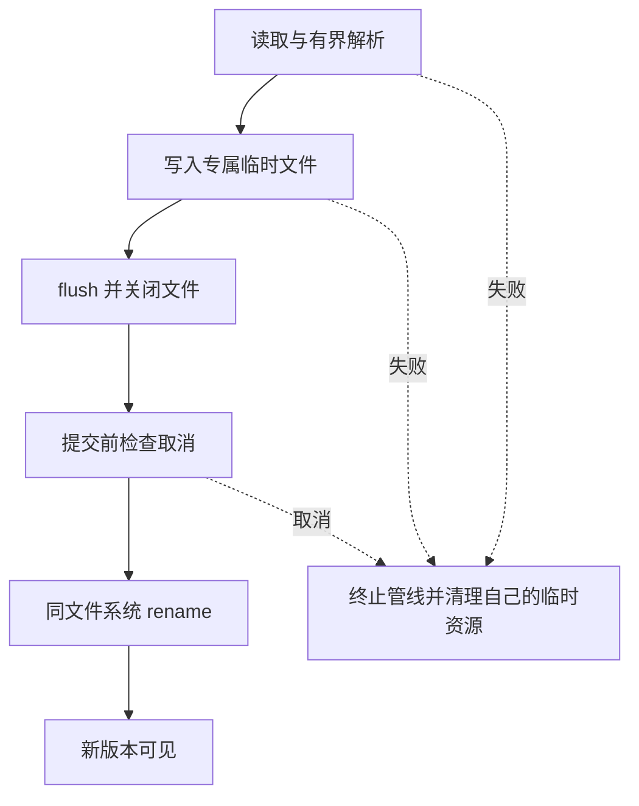

# Node.js 数据与文件管线知识点讲义

## NODE-02 文件、Stream、Buffer 与错误处理

导入一份笔记文件时，读取成功并不是终点。一个汉字可能被拆在两块数据里，最后一行可能只传来一半，磁盘也可能在写到中途时失败。用户关心的是“原文件还在吗，新内容完整吗，失败后能否重来”。

本讲用一条 NDJSON 导入链把字节、记录、背压和提交连起来。代码基线为 Node.js 22；带文件名的例子分别保存运行，不依赖额外包。演示写入只发生在自行创建的临时目录，正式文件应有另外确认的权限和持久性要求。

### 学习前先确认

- 直接前置：[NODE-01 Node 运行时、事件循环与非阻塞 I/O](../chinese-guides/node-01-runtime-event-loop-nonblocking-io.md#node-01)。用于区分等待、解析和线程池成本。
- 直接前置：[JS-05 Promise 错误、取消与异步控制流](../chinese-guides/js-05-promise-errors-async-control-flow.md#js-05)。用于理解错误原因、取消与资源清理。

### 一、路径是名字，句柄是已经打开的资源

路径回答“现在去哪里找”，FileHandle 或文件描述符表示“已经打开了哪份资源”。文件重命名后，原有句柄不一定跟着改指向新文件；同一路径下一次打开，也可能指向不同内容。

每段代码应明确谁打开、谁关闭。自己打开的句柄通常由自己在 finally 中关闭；传进来的共享资源则先看所有权合同，不能顺手把别人的流关闭。

readFile 和 writeFile 适合尺寸有上限的小文件，不因为 Stream 存在就必须淘汰它们。但上传大小不受控时，先读完整文件再检查大小已经太晚。异步读取只改变等待方式，无法限制聚合后的内存，这与[NODE-01 的同步解析成本](../chinese-guides/node-01-runtime-event-loop-nonblocking-io.md#二异步等待结束后回调仍可能阻塞)相连。

### 二、Buffer 表示字节，字符边界需要解码器保存

**缓冲区（Buffer）**保存字节，不保证一个 chunk 就包含完整字符。下面把“中文”的 UTF-8 编码故意切在一个汉字中间：

```js example=node02-buffer runtime=project file=buffer.mjs
import { StringDecoder } from 'node:string_decoder';
const bytes = Buffer.from('中文');
const left = bytes.subarray(0, 2), right = bytes.subarray(2);
console.log(left.toString('utf8') + right.toString('utf8') === '中文'); // => false
const decoder = new StringDecoder('utf8');
console.log(decoder.write(left) + decoder.end(right)); // => 中文

const original = Buffer.from([1, 2, 3]);
const shared = original.subarray(0, 2);
const copied = Buffer.from(shared);
shared[0] = 9;
console.log(original[0], copied[0]); // => 9 1
```

StringDecoder 会保留尚未凑齐的多字节字符；逐块直接 toString 则可能已经产生替换字符。若合同要求拒绝非法 UTF-8，而不是替换，可用 fatal 模式的 TextDecoder，并正确处理最后一块。

后半段说明 subarray 共享存储，Buffer.from 可以复制数据。长期保存一个很小的视图，可能把巨大的原缓冲区一并留住。涉及密钥时还要减少副本，不能承诺 JavaScript 能把所有历史副本立即清零。

### 三、chunk、字符、记录是三个不同的边界

NDJSON 约定每行一个 JSON 值。一次 chunk 可能包含三行，也可能只含一行的前半段；网络分包和磁盘读取不会替业务守住行边界。

| 边界 | 负责什么 | 例子 |
| --- | --- | --- |
| chunk | 一次交付多少字节 | 读取到 4096 字节 |
| 编码 | 字节怎样还原字符 | 一个汉字跨两个 chunk |
| 记录 | 一条业务输入在哪里结束 | 换行符前是一条笔记 |
| 批次 | 什么时候允许发布结果 | 全部记录成功后替换目标 |

本讲导入合同是：UTF-8，每行一个对象，允许 CRLF；每行最多 1024 字节，总输入最多 1 MiB；每条笔记只有 id 和 title 两个输出字段；最后一条也必须有换行。这个小上限方便本地观察，不是通用生产默认值。

最后一个“必须换行”是本例的明确选择。有的 NDJSON 消费者允许末行无换行，但不能遇到半行时临时改变规则。允许坏记录跳过，还是要求整批失败，也应在开始前约定。

### 四、write 返回 false 时，数据已经被接受

**背压（Backpressure）**表示慢消费者要求上游先停一下。write 返回 false 通常表示内部缓冲达到阈值，不是写入被拒绝，更不能立即重写同一个 chunk。

```js example=node02-pressure runtime=project file=pressure.mjs
import { Writable } from 'node:stream';
import { once } from 'node:events';
import { finished } from 'node:stream/promises';
let consumed = 0;
const sink = new Writable({
  highWaterMark: 4,
  write(chunk, encoding, done) {
    setTimeout(() => { consumed += chunk.length; done(); }, 5);
  },
});
const completion = finished(sink, { cleanup: true });
completion.catch(() => {}); // 从创建起就有拒绝处理；最终仍 await 它。
try {
  const accepted = sink.write(Buffer.alloc(4));
  console.log(accepted); // => false
  if (!accepted) await once(sink, 'drain');
  sink.end();
  await completion;
  console.log(consumed); // => 4
} catch (error) {
  sink.destroy();
  await completion.catch(() => {});
  throw error;
}
```

本例消费者行为完全受控，用来看到“返回 false，但四个字节仍消费一次”。复杂来源还会有提前 close、取消和多个错误事件，组合标准流时优先使用 pipeline，避免反复手写监听器协议。

highWaterMark 是反馈阈值，不是整个进程的内存硬上限。还要算进当前 chunk、解析器剩余片段、转换缓冲、输出缓冲和应用队列。对象模式按对象计量，一个对象仍可能很大。

### 五、先做有上限的记录解析，再把它接进管线

保存为 import.mjs。以下代码包含解析与提交两个部分。解析按换行字节组装一条记录，再严格解码和校验，避免对每个任意 chunk 单独解释 JSON。

```js example=node02-import runtime=project file=import.mjs
import { createReadStream, createWriteStream } from 'node:fs';
import { mkdtemp, rename, unlink, rmdir } from 'node:fs/promises';
import { dirname, join } from 'node:path';
import { pipeline } from 'node:stream/promises';

function parseLine(bytes, lineNumber) {
  const text = new TextDecoder('utf-8', { fatal: true }).decode(bytes);
  let value;
  try { value = JSON.parse(text); }
  catch (cause) { throw new Error('第 ' + lineNumber + ' 行不是完整 JSON', { cause }); }
  if (!value || typeof value !== 'object' || Array.isArray(value)
      || typeof value.id !== 'string' || !/^[a-z0-9-]{1,40}$/.test(value.id)
      || typeof value.title !== 'string'
      || value.title.trim().length < 1 || value.title.length > 100) {
    throw new Error('第 ' + lineNumber + ' 行字段不符合要求');
  }
  return JSON.stringify({ id: value.id, title: value.title.trim() }) + '\n';
}
export async function* records(source, { signal } = {}) {
  let pending = Buffer.alloc(0), total = 0, lineNumber = 0;
  for await (const chunk of source) {
    signal?.throwIfAborted();
    total += chunk.length;
    if (total > 1024 * 1024) throw new Error('输入超过 1 MiB');
    let start = 0;
    while (start < chunk.length) {
      const newline = chunk.indexOf(10, start);
      const end = newline < 0 ? chunk.length : newline;
      const part = chunk.subarray(start, end);
      if (pending.length + part.length > 1024) throw new Error('单行超过 1024 字节');
      pending = Buffer.concat([pending, part]);
      if (newline < 0) break;
      lineNumber += 1;
      if (pending.at(-1) === 13) pending = pending.subarray(0, -1);
      const output = parseLine(pending, lineNumber);
      pending = Buffer.alloc(0);
      yield output;
      start = newline + 1;
    }
  }
  signal?.throwIfAborted();
  if (pending.length) throw new Error('末行缺少换行，整批不提交');
}

export async function importNotes(sourcePath, targetPath, { signal } = {}) {
  signal?.throwIfAborted();
  // 调用方提供可信、受控的目标目录；本函数不是不可信路径的安全解析器。
  const staging = await mkdtemp(join(dirname(targetPath), '.import-'));
  const temporary = join(staging, 'output.tmp');
  let failure, committed = false, cleanupFailure;
  try {
    await pipeline(
      createReadStream(sourcePath, { highWaterMark: 64 }),
      records,
      createWriteStream(temporary, { flags: 'wx', mode: 0o600, flush: true }),
      { signal },
    );
    signal?.throwIfAborted(); // 提交前的最后一个取消检查点。
    await rename(temporary, targetPath);
    committed = true;
  } catch (error) { failure = error; }
  try {
    await unlink(temporary).catch(error => { if (error.code !== 'ENOENT') throw error; });
    await rmdir(staging);
  } catch (error) { cleanupFailure = error; }
  if (failure) {
    const cause = cleanupFailure
      ? new AggregateError([failure, cleanupFailure], '执行与清理都失败')
      : failure;
    throw new Error('导入未提交', { cause });
  }
  return { committed, cleanup: cleanupFailure ? 'pending' : 'done' };
}
```

records 是 async generator，pipeline 按消费速度向它要结果。本例保留的 pending 有上限，输出只包含批准字段，不会把输入对象的其他属性顺便写出去。字段校验与类型声明的区别可回看[TS-07](../chinese-guides/ts-07-runtime-contracts-validation-error-models.md#ts-07)。

为了让长行和截断更容易观察，读取块刻意设为 64 字节。调大块大小不会改变记录规则；调小也不会自动提高安全性，可能只增加复制和调用成本。

### 六、亲手观察失败后旧目标是否仍在

把 demo.mjs 放在 import.mjs 旁边，运行 node demo.mjs。它创建自己的临时目录并打印路径，方便查看结果；不接收已有用户文件作为目标。

```js example=node02-import-demo runtime=project file=demo.mjs
import { mkdtemp, writeFile, readFile, readdir } from 'node:fs/promises';
import { join } from 'node:path';
import { fileURLToPath } from 'node:url';
import { importNotes } from './import.mjs';

const root = await mkdtemp(join(fileURLToPath(new URL('.', import.meta.url)), 'b18-files-'));
const source = join(root, 'input.ndjson'), target = join(root, 'notes.ndjson');
await writeFile(target, '旧内容\n');
await writeFile(source, '{"id":"n-1","title":" 新笔记 "}\n');
console.log((await importNotes(source, target)).committed); // => true
const saved = await readFile(target, 'utf8');
console.log(saved.trim()); // => {"id":"n-1","title":"新笔记"}

await writeFile(source, '{"id":"n-2","title":"半行');
try { await importNotes(source, target); }
catch (error) { console.log(error.message, error.cause.message); }
// => 导入未提交 末行缺少换行，整批不提交
console.log(await readFile(target, 'utf8') === saved); // => true

const controller = new AbortController();
controller.abort();
try { await importNotes(source, target, { signal: controller.signal }); }
catch (error) { console.log(error.name); } // => AbortError
console.log((await readdir(root)).some(name => name.startsWith('.import-'))); // => false
console.log('实验目录：' + root);
```

观察的是三件不同的事：成功后读取新目标确实完整；解析失败后旧目标内容不变；被取消的任务没有变成一次成功提交。示例保留输入与结果供你检查，实际应用还需要按保留规则清理自己的临时数据。

这并不证明磁盘满、权限失败、断电或所有操作系统的行为都已验证。针对目标平台，还要注入源读取失败、ENOSPC、EACCES、消费者提前关闭和 rename 失败，检查 cause、句柄与残留。不要在真实生产盘上制造磁盘满来学习。

### 七、pipeline 完成与业务提交是两条边界

**流管线（Pipeline）**把读取、转换和写入的生命周期连接起来。失败或 Abort 会让管线终止；传给生成器的 signal 也应被检查，不能在自定义 await 中永远忽略取消。

| 信号或状态 | 表示什么 | 不表示什么 |
| --- | --- | --- |
| Readable end | 没有更多可读数据 | 目标已完整发布 |
| Writable finish | 写入已交给底层实现 | 所有介质都已持久化 |
| close | 资源已关闭 | 之前没有发生错误 |
| destroy | 主动终止流 | 已有外部副作用自动撤销 |
| pipeline resolve | 这条管线成功完成 | 后续 rename、数据库提交也已完成 |



解析器里为每一行直接启动数据库 Promise，会绕过流自身的速度反馈。需要异步写数据库时，让下游真正等待消费，或使用有界并发队列；同时定义乱序、失败与整批结果的关系。

### 八、原子可见、持久性与并发正确是三件事

**原子替换（Atomic Replacement）**解决读者不应看到“半个新文件”。同一文件系统内 rename 是常见提交基础，但具体支持与失败条件仍应在目标系统验证，尤其是 Windows 上目标占用、权限和安全软件介入的情况。

示例在目标的同一受控父目录下创建暂存目录，避免无意跨文件系统。flush: true 请求在关闭前刷新文件描述符；这不等于完成所有平台的断电持久协议。关键状态可能还要处理目录元数据持久化、设备缓存和恢复，需按文件系统要求设计。

两个调用者同时“读旧文件 → 修改 → rename”，即使每次替换都完整，也可能丢掉其中一次更新。单写者队列、条件版本或数据库事务解决的是另一层问题。不要把一个原子 rename 扩大解释成完整事务。

### 九、取消有提交点，结果未知时不能随口说回滚

示例在 rename 前检查 signal。一旦 rename 已经提交，之后才到来的取消不能把新文件说成“从未发生”。即使清理空暂存目录失败，结果仍返回 committed: true，同时标记 cleanup: pending。

检查与 rename 之间也有竞争窗口。对“取消必须阻止提交”有严格要求的系统，需要在同一个协调机制内决定提交资格，或返回可查询的任务状态。AbortController 只是通知机制，不是文件系统事务锁。

恢复时先检查目标版本、内容散列、任务记录与临时资源，再选择清理或重试。网络写入超时更可能已经在远端生效，可衔接[NODE-04 的幂等与结果查询](../chinese-guides/node-04-http-bff-production-engineering.md#node-04)。

### 十、错误分类决定下一步，cause 保留证据

不要用 error.message 里有没有“permission”来判断权限问题。Node 系统错误通常用 code 表示类别；业务层再把它映射成适合用户的说明。

| 失败 | 常见动作 | 避免 |
| --- | --- | --- |
| 输入 JSON 或字段无效 | 返回记录位置与修正提示 | 无限重试同一内容 |
| ENOSPC | 停止写入，通知容量负责人 | 一边失败一边继续制造临时文件 |
| EACCES | 检查目标与实际权限 | 自动扩大到管理员权限 |
| AbortError | 报告取消及已知提交状态 | 当作成功，或当成用户内容错误 |
| 清理失败 | 保留任务与残留位置的受限记录 | 覆盖掉原始执行错误 |

cause 让外层说明“导入失败”时仍能追到具体原因。日志只记录必要的逻辑资源标识，不把真实本机路径、用户正文和凭证直接返回浏览器。原始错误与清理错误都发生时，应把两者保留，不让最后一次错误抹掉第一条线索。

### 十一、路径验证与流转换都要说清所有权

不要把用户上传的文件名直接拼到保存目录。使用服务器生成的文件名或批准映射，检查绝对路径、目录逃逸、设备名、链接与检查后替换的竞争。字符串 startsWith(root) 不能可靠证明归属，相似目录前缀就能误导它。

access 成功不保证下一刻 open 仍有权限。直接执行预期操作并处理错误；创建临时文件采用排他创建，清理只作用于本任务实际拥有的资源。示例的受控目录前提不能省略后拿去当公共上传服务。

Node Stream、Web Stream 与 async iterable 可以互转，但要选一处明确转换。Fetch Response.body 通常是 Web Stream，转换后谁负责读取、取消和关闭必须唯一。别同时用 data 事件、async iterator 与 pipe 消费同一来源，也不要用 text() 先聚合全文来“简化”一个本应流式的大输入。

### 十二、完整导入需要记录级结果和批次结果

本例选择任一记录错误就整批不提交。若产品允许部分成功，需要另外记录稳定行号、记录标识、拒绝原因和重复导入的语义，不能只是 catch 后继续，把失败的行悄悄吞掉。

恢复检查点要关联输入内容散列、处理器版本和已经确认的提交位置。只有“日志最后显示第 500 行”不足以证明前 500 行已经可靠保存。并发解析、写库与输出都应有界，恢复后也不能重复产生副作用。

验证时先用小输入观察跨块字符、跨块行、慢消费、错误和取消，再按容量目标扩大负载。内存曲线、drain 次数、目标散列和句柄状态各回答一个问题；最终要从用户入口确认拿到的是完整且属于本次任务的结果。

### 参考与延伸阅读

- [Node.js：Stream API](https://nodejs.org/docs/latest-v22.x/api/stream.html)：pipeline、finished、背压与终止语义。
- [Node.js：File system API](https://nodejs.org/docs/latest-v22.x/api/fs.html)：文件句柄、flush、rename 与错误边界。
- [Node.js：Buffer](https://nodejs.org/api/buffer.html)、[StringDecoder](https://nodejs.org/api/string_decoder.html)：字节视图、复制与跨块解码。
- [Node.js：流中的背压](https://nodejs.org/en/learn/modules/backpressuring-in-streams)：慢消费者与内存的关系。
