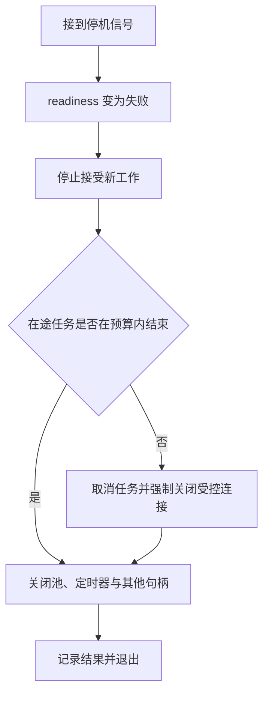

# Node.js HTTP 与 BFF 生产工程知识点讲义

## NODE-04 Node.js HTTP 服务与 BFF 生产工程

页面同时需要用户资料和学习建议。把两个接口搬到服务器里 Promise.all 一下，就算完成 BFF 了吗？还没有：建议服务可能变慢，用户可能关闭页面，第二个请求可能挤满容量，服务也可能在途中准备退出。

本讲把这些情况放进一次“学习概览”请求。先确定输入、身份与返回合同，再分清总时间预算、取消、降级与停机。中间提供一个可运行的本地 HTTP 观察页；它使用虚构用户与模拟下游，不接真实账号、外部服务或生产数据。

### 学习前先确认

- 直接前置：[NODE-02 文件、Stream、Buffer 与错误处理](../chinese-guides/node-02-files-streams-buffers-errors.md#node-02)。本讲使用背压、pipeline、取消和资源所有权。
- 直接前置：[NET-01 浏览器网络协议、Fetch 与请求可靠性](../chinese-guides/net-01-browser-network-fetch-reliability.md#net-01)。用于理解 HTTP、缓存、重试和结果未知。
- 直接前置：[TS-07 接口契约、运行时校验与错误模型](../chinese-guides/ts-07-runtime-contracts-validation-error-models.md#ts-07)。用于把外部输入变成可信内部数据。

### 一、BFF 聚合的是页面需要的合同

**面向前端的后端（Backend for Frontend）**针对某类客户端整理后端能力。学习概览可以把账号服务与建议服务组合成一个明确的视图，但核心业务授权仍要由可信领域边界执行。

把“账号”和“建议”分别标成必需与可选，会立刻改变错误处理：

| 部分 | 正常结果 | 失败后 |
| --- | --- | --- |
| 当前用户资料 | 当前主体能查看的基础资料 | 整个视图不能成立，返回错误 |
| 学习建议 | 可用建议列表 | 可降级，但明确 unavailable 或 stale |
| 最近学习记录 | 在确认的范围内查询 | 按产品合同决定能否省略，不能临时猜 |

空数组可能表示“确实没有建议”，也可能是“服务失败”。两种情况应分开表达。BFF 负责减少客户端重复编排，不应绕过租户授权，也不应变成可向任意 URL 转发用户凭证的代理。

### 二、在做昂贵工作前建立可信边界

方法、路由、查询、请求头和正文都是外部输入。先限制大小和复杂度，再解析为内部命令。用户声明的 tenant、role、region 都不能直接变成授权事实。

```ts example=node04-query
type QueryResult = { ok: true; limit: number } | { ok: false; code: 'BAD_LIMIT' };
function readLimit(search: URLSearchParams): QueryResult {
  const values = search.getAll('limit');
  if (values.length === 0) return { ok: true, limit: 20 };
  const raw = values[0];
  if (values.length !== 1 || raw === undefined || !/^[1-9][0-9]?$/.test(raw)) {
    return { ok: false, code: 'BAD_LIMIT' };
  }
  const limit = Number(raw);
  return limit <= 50 ? { ok: true, limit } : { ok: false, code: 'BAD_LIMIT' };
}
console.log(JSON.stringify(readLimit(new URLSearchParams('limit=12')))); // => {"ok":true,"limit":12}
console.log(JSON.stringify(readLimit(new URLSearchParams('limit=12&limit=40')))); // => {"ok":false,"code":"BAD_LIMIT"}
console.log(JSON.stringify(readLimit(new URLSearchParams('limit=1e3')))); // => {"ok":false,"code":"BAD_LIMIT"}
```

例子故意拒绝重复安全参数和非约定数字写法，避免网关取第一个值、框架取最后一个值造成解释差异。完整正文还需要实际读取字节上限，不能只信 Content-Length。

通过[B17 的身份验证](../chinese-guides/identity-01-session-cookie-token-browser-boundaries.md#identity-01)建立主体后，再检查资源归属与动作权限。传往下游的身份和追踪信息用白名单构造，服务间凭据不应照搬浏览器 Cookie 或全部入站头。

### 三、一个请求共享一份剩余时间

**截止时间（Deadline）**表示本次请求到什么时候不再值得继续。排队、下游调用、退避、解析和组合结果都占用同一份预算，不能每走一层就重新领一秒。

```js example=node04-budget
const deadline = 1000;
const remaining = now => Math.max(0, deadline - now);
console.log(remaining(200)); // => 800
console.log(remaining(850)); // => 150
console.log(remaining(1100)); // => 0
```

真实进程内测时通常使用单调时钟，避免系统校时影响间隔。跨服务传播时不要直接发送 performance.now()，它的起点属于本进程；可以传播受限剩余预算，或在明确时钟误差边界下使用协议约定的截止时间。

计时器是尽力调度，不是硬实时保证。主线程如果被同步计算卡住，到期回调也会推迟。因此返回结果前还应复查截止时间，并结合[NODE-01 的事件循环测量](../chinese-guides/node-01-runtime-event-loop-nonblocking-io.md#八测量要包含真实的观察窗口)理解为什么“设置了 timeout”仍可能晚返回。

### 四、取消要观察响应是否提前关闭

一个常见陷阱是 req.on('close', abort)：现代 Node 中 IncomingMessage 的 close 可以表示请求消息已经完成，不能直接等同于客户端在等待响应时离开。

接收正文时应结合 req.complete 等状态判断输入是否完整；等待下游并写响应时，可观察 res 的 close，并用 writableFinished 区分正常写完与提前关闭。响应 finish 表示数据已交给底层，不表示浏览器已经读完或用户已经看见。

取消还要传到底层：fetch、可取消等待、流管线和工作队列都需要接收 signal。仅让外层 Promise 提前 reject，后台任务可能仍继续耗费资源。

### 五、运行一个有总预算和容量上限的服务

把 server.mjs 与下一节 index.html 放在同一目录，使用 Node.js 22 执行 node server.mjs，再打开终端打印的本地地址。本例仅监听回环地址，所有下游都是可取消的本地计时任务；真实认证、网络连接池、幂等存储与代理部署留在后文说明。

```js example=node04-server runtime=project file=server.mjs
import { createServer } from 'node:http';
import { readFile } from 'node:fs/promises';
import { randomUUID } from 'node:crypto';
import { performance } from 'node:perf_hooks';
import { setTimeout as sleep } from 'node:timers/promises';

const active = new Set();
let ready = true, closing;
const reason = code => Object.assign(new Error(code), { code });
const send = (res, status, body) => {
  if (res.destroyed || res.writableEnded) return;
  res.writeHead(status, { 'Content-Type': 'application/json; charset=utf-8', 'Cache-Control': 'no-store' });
  res.end(JSON.stringify(body));
};
async function downstream(name, ms, fail, signal) {
  await sleep(ms, undefined, { signal });
  if (fail) throw reason('UPSTREAM');
  return name === 'profile' ? { name: '教学用户 林' } : ['继续学习 Stream'];
}
const server = createServer((req, res) => { void handle(req, res).catch(() => res.destroy()); });
server.headersTimeout = 5000;
server.requestTimeout = 5000;
server.keepAliveTimeout = 1000;

async function handle(req, res) {
  const origin = 'http://127.0.0.1:' + server.address().port;
  if (req.headers.host !== new URL(origin).host) return send(res, 403, { code: 'HOST' });
  if (req.method !== 'GET') return send(res, 405, { code: 'METHOD' });
  if ((req.url?.length ?? 0) > 1024) return send(res, 414, { code: 'URL_TOO_LONG' });
  const url = new URL(req.url, origin);
  if (url.pathname === '/') {
    res.writeHead(200, { 'Content-Type': 'text/html; charset=utf-8', 'Cache-Control': 'no-store' });
    res.end(await readFile(new URL('./index.html', import.meta.url))); return;
  }
  if (url.pathname === '/health/live') return send(res, 200, { live: true });
  if (url.pathname === '/health/ready') return send(res, ready ? 200 : 503, { ready });
  if (url.pathname !== '/demo') return send(res, 404, { code: 'NOT_FOUND' });
  const modes = url.searchParams.getAll('mode');
  const mode = modes[0] ?? 'normal';
  if (modes.length > 1 || [...url.searchParams.keys()].some(key => key !== 'mode')
      || !['normal', 'optional', 'slow', 'required'].includes(mode)) {
    return send(res, 400, { code: 'BAD_MODE' });
  }
  if (!ready) return send(res, 503, { code: 'DRAINING' });
  if (active.size >= 2) return send(res, 503, { code: 'OVERLOADED' });

  const requestId = randomUUID(), controller = new AbortController();
  const deadline = performance.now() + 350;
  active.add(controller);
  let outcome = 'unknown';
  const timer = setTimeout(() => controller.abort(reason('DEADLINE')), 350);
  const onClose = () => {
    if (!res.writableFinished) controller.abort(reason('CLIENT_CLOSED'));
  };
  res.once('close', onClose);
  const profile = downstream('profile', 60, mode === 'required', controller.signal);
  const advice = downstream('advice', mode === 'slow' ? 900 : 100, mode === 'optional', controller.signal)
    .then(items => ({ status: 'available', items }))
    .catch(() => {
      controller.signal.throwIfAborted();
      return { status: 'unavailable', items: [] };
    });
  try {
    const [person, suggestions] = await Promise.all([profile, advice]);
    if (performance.now() >= deadline) controller.abort(reason('DEADLINE'));
    controller.signal.throwIfAborted();
    outcome = suggestions.status === 'available' ? 'complete' : 'degraded';
    send(res, 200, { requestId, profile: person, advice: suggestions });
  } catch {
    const code = controller.signal.aborted ? controller.signal.reason.code : 'UPSTREAM';
    outcome = code;
    controller.abort(reason(code)); // 必需项失败时，也停止仍在运行的兄弟任务。
    await Promise.allSettled([profile, advice]);
    if (code !== 'CLIENT_CLOSED') send(res, code === 'DEADLINE' ? 504 : code === 'SHUTDOWN' ? 503 : 502, { code, requestId });
  } finally {
    clearTimeout(timer);
    res.removeListener('close', onClose);
    active.delete(controller);
    console.log(JSON.stringify({ event: 'request-done', requestId, outcome, active: active.size }));
  }
}

function shutdown() {
  if (closing) return closing;
  ready = false;
  closing = new Promise(resolve => {
    const force = setTimeout(() => {
      for (const controller of active) controller.abort(reason('SHUTDOWN'));
      server.closeAllConnections();
    }, 1000);
    server.close(() => {
      clearTimeout(force); process.stdin.pause(); process.stdin.unref?.(); resolve();
    });
  });
  return closing;
}
process.on('SIGINT', () => { void shutdown(); });
process.on('SIGTERM', () => { void shutdown(); });
// 本地演练也可从控制台按回车停止；不通过公共 HTTP 暴露停机命令。
process.stdin.on('data', () => {
  void shutdown().then(() => { process.stdin.pause(); process.stdin.unref?.(); });
});
server.listen(Number(process.env.B18_DEMO_PORT ?? 43918), '127.0.0.1', () => {
  console.log('BFF 观察页：http://127.0.0.1:' + server.address().port);
});
```

这里全局在途上限是 2，超过立即返回 503，没有隐藏排队。真实服务还需每租户配额、下游连接与队列上限。请求处理中的 finally 要覆盖成功、失败和取消；否则一次异常就可能永久占住容量。

### 六、在桌面观察成功、降级、超时和取消

保存为 index.html。页面只发到同源实验服务，不收集真实账号信息。先点正常，再分别点可选失败、总超时和取消，最后用三请求观察容量拒绝。

```html example=node04-page runtime=project file=index.html
<!doctype html>
<html lang="zh-CN">
<meta charset="utf-8">
<title>BFF 请求观察页</title>
<style>
  body { max-width: 1080px; margin: 48px auto; padding: 0 24px; background: #f4f7fa; color: #233b46; font: 16px/1.8 "Segoe UI","Microsoft YaHei",sans-serif; }
  main { padding: 32px; background: white; border-radius: 18px; }
  h1 { margin: 0; } .hint { color: #577080; }
  .controls { display: flex; flex-wrap: wrap; gap: 10px; margin: 24px 0; }
  button { padding: 10px 14px; border: 1px solid #9fbfbe; border-radius: 8px; background: #edf7f4; font: inherit; cursor: pointer; }
  button:focus-visible { outline: 3px solid #29746c; outline-offset: 3px; }
  pre { white-space: pre-wrap; overflow-wrap: anywhere; background: #f1f5f8; padding: 20px; border-radius: 10px; min-height: 190px; }
</style>
<main>
  <p class="hint">NODE-04 · 本地 HTTP 与模拟下游</p>
  <h1>一次请求如何结束</h1>
  <p>总预算 350 ms，同时最多接收 2 个聚合请求。建议服务失败可降级；用户资料失败则整体失败。</p>
  <div class="controls">
    <button data-mode="normal">正常返回</button>
    <button data-mode="optional">可选项失败</button>
    <button data-mode="required">必需项失败</button>
    <button data-mode="slow">超过总预算</button>
    <button id="cancel">发出后取消</button>
    <button id="burst">同时发出三请求</button>
  </div>
  <pre id="result" role="status" aria-live="polite">选择一种情况，观察 HTTP 状态与结果。</pre>
  <p class="hint">取消只表示此页面停止等待。服务端终端另记取消原因；本例没有真实写入，因此不演示业务回滚。</p>
</main>
<script type="module">
const result = document.getElementById('result');
async function request(mode, signal) {
  const response = await fetch('/demo?mode=' + mode, { signal, cache: 'no-store' });
  return { status: response.status, body: await response.json() };
}
async function show(action) {
  const buttons = [...document.querySelectorAll('button')];
  buttons.forEach(button => { button.disabled = true; });
  result.textContent = '等待本次结果…';
  try { result.textContent = JSON.stringify(await action(), null, 2); }
  catch (error) {
    result.textContent = error.name === 'AbortError'
      ? '页面已取消等待，请在服务端终端核对 CLIENT_CLOSED。'
      : '请求未得到完整结果，请检查本地服务。';
  } finally { buttons.forEach(button => { button.disabled = false; }); }
}
for (const button of document.querySelectorAll('[data-mode]')) {
  button.onclick = () => show(() => request(button.dataset.mode));
}
document.getElementById('cancel').onclick = () => show(async () => {
  const controller = new AbortController();
  const timer = setTimeout(() => controller.abort(), 80);
  try { return await request('slow', controller.signal); }
  finally { clearTimeout(timer); }
});
document.getElementById('burst').onclick = () => show(() =>
  Promise.all([request('slow'), request('slow'), request('slow')]));
</script>
</html>
```

正常请求应得到 200 与 available；可选项失败得到 200 与 unavailable；必需项失败是 502；慢建议超过总预算得到 504；三请求通常可看到一条 OVERLOADED 与两条到期结果，具体显示顺序不代表服务端到达顺序。

取消是否真的传播，要结合终端 CLIENT_CLOSED 与 active 回落观察。页面只显示 AbortError 不能证明下游已经停止。本例停止的是可取消计时等待；接真实 fetch 或数据库时应验证对应驱动的取消行为。

### 七、重试资格与幂等结果分开设计

**幂等键（Idempotency Key）**代表一次业务意图。相同主体、操作、键和相同规范化输入应复用同一结果；相同键换了内容则应冲突。不能每次重试都生成新键。

```js example=node04-idempotency
const receipts = new Map();
function save(subject, key, command) {
  const scope = JSON.stringify([subject, 'save-note', key]);
  const fingerprint = JSON.stringify([command.id, command.title]);
  const previous = receipts.get(scope);
  if (previous) return previous.fingerprint === fingerprint ? 'REPLAY' : 'CONFLICT';
  receipts.set(scope, { fingerprint });
  return 'CREATED';
}
console.log(save('lin', 'k1', { id: 'n1', title: 'A' })); // => CREATED
console.log(save('lin', 'k1', { id: 'n1', title: 'A' })); // => REPLAY
console.log(save('lin', 'k1', { id: 'n1', title: 'B' })); // => CONFLICT
console.log(save('zhou', 'k1', { id: 'n1', title: 'A' })); // => CREATED
```

这是单进程、同步的关系模型，没有实现业务写入或持久收据。生产需要把并发占位、业务副作用、结果与保留策略在可靠存储中协调；进程重启后不能忘记已经执行的命令。

重试还要满足错误可恢复、操作可安全重复、次数与剩余预算允许。认证失败、校验失败和确定的业务拒绝不该反复请求。超时后的写入结果可能未知，先查询或复用同一意图再继续，不能简单显示“没有成功，请再提交一次”。

### 八、缓存和降级也有身份边界

缓存键应包含实际影响结果的维度，例如租户、主体或权限投影、资源、区域和接口版本。是否需要语言维度取决于结果是否随语言变化，不能机械堆字段，也不能漏掉会改变可见内容的字段。

```js example=node04-cache-key
const key = ({ tenant, subject, resource, version }) =>
  JSON.stringify([tenant, subject, resource, version]);
const a = { tenant: 'school-a', subject: 'lin', resource: 'overview', version: 1 };
console.log(key(a) === key({ ...a, tenant: 'school-b' })); // => false
console.log(key(a) === key({ ...a, subject: 'zhou' })); // => false
```

命中缓存也不免除当前授权检查。用户退出、角色撤销或资源归属改变后，旧视图不能继续当作当前许可。私有响应应使用合适的 Cache-Control；进程缓存、CDN 与浏览器缓存各自需要规则。

降级后的 stale 数据要说明版本和年龄。建议列表暂时旧一点可能可接受，余额或权限决定则不能因为“缓存里有”就继续放行。

### 九、流式响应一旦开始，错误表达就变了

响应头还没发出时，可以选择一份完整 JSON 错误；已经开始输出之后，再写第二份状态码和 JSON 会损坏协议。此时需要约定流内错误消息，或终止连接，让客户端把结果标记为不完整。

res.write 返回 false 后，应暂停生成并等待可继续的信号，同时处理提前 close 和 error。用 pipeline 将来源直接连到响应时，失败可能销毁 socket；不能在 catch 里假设连接仍可用于发送一个漂亮错误页面。

事件流或 NDJSON 的业务边界不等于 TCP chunk。代理缓冲与压缩还会改变客户端何时看到数据。背压、最大输出量、取消和代理行为都要一起核对，可回看[NODE-02 的背压](../chinese-guides/node-02-files-streams-buffers-errors.md#四write-返回-false-时数据已经被接受)。

### 十、日志要能解释结果，同时保持克制

记录请求编号、路由模板、阶段耗时、下游结果、取消原因和在途数。不要把整份 req.headers、带签名的 URL、Cookie、Token 或正文直接记录下来。上游传来的 request id 也需要长度与格式限制，或者由自己生成。

请求总耗时包含排队与处理；下游慢、主线程阻塞、连接池耗尽和客户端离开不应都归成同一个 TIMEOUT。指标标签采用有限类别，避免用户 ID 等高基数字段让监控自身失控。

headersTimeout、requestTimeout、keepAliveTimeout 与应用 Deadline 分别约束不同阶段；本例设置前两者只是减少无限等待，不能据此声称端到端时间已经严格受控。正式部署需要画出网关、框架、应用与下游谁先终止，并保留可重放的时间线。

### 十一、停止接新任务，再有上限地排空

**优雅停机（Graceful Shutdown）**从“不再就绪”开始。停止接受新连接或任务，让已接收的工作在预算内完成；超出上限时取消并关闭资源，最后由进程自然退出或返回明确失败状态。



本例的 SIGINT、SIGTERM 和控制台回车复用同一个 shutdown；Windows 本地可用回车演练，不把进程强制终止当成优雅信号。server.close 停止接收新连接，在支持的 Node 版本中也处理空闲连接；closeAllConnections 会关闭活动 HTTP 连接，应在停止接收之后谨慎使用。WebSocket、HTTP/2、数据库池和 worker 需分别管理。

liveness 回答进程是否仍能工作，readiness 回答是否接新流量。一个可选建议服务失败不一定应该触发全进程重启；依赖探测本身也应有上限。本例只展示最小状态，真实调度平台还需验证摘流量和排空的先后。

### 十二、部署与恢复都围绕同一份运行合同

反向代理提供的 X-Forwarded-For、Host 和协议信息，只有来自受信拓扑时才能使用。生成公开跳转使用批准的 origin，不能照搬客户端传来的 Host。CORS 也不等于认证或授权。

滚动发布期间，新旧实例可能同时处理同一个幂等键、缓存和数据版本。先扩展后收缩，保留兼容读取，再逐步迁移写入；回滚代码不一定能撤销已写数据，需要事先设计修复或前滚路径。

从正常请求扩展到慢下游、可选失败、断开、重复写入、队列满和停机，每种情况都要说清“完成、取消、未开始、结果未知”中的哪一种。这里的本地实验验证有限运行机制，生产接入还需真实网络、认证授权、存储并发、流式出口和目标平台演练。

### 参考与延伸阅读

- [Node.js：HTTP API](https://nodejs.org/api/http.html)：IncomingMessage、ServerResponse、超时与关闭方法；查询时注意页面版本。
- [Node.js：Stream API](https://nodejs.org/docs/latest-v22.x/api/stream.html)：响应背压、pipeline 与销毁。
- [MDN：AbortController](https://developer.mozilla.org/zh-CN/docs/Web/API/AbortController)：取消通知及其适用边界。
- [Node.js：HTTP 请求剖析](https://nodejs.org/en/learn/modules/anatomy-of-an-http-transaction)：请求和响应的基础生命周期。
