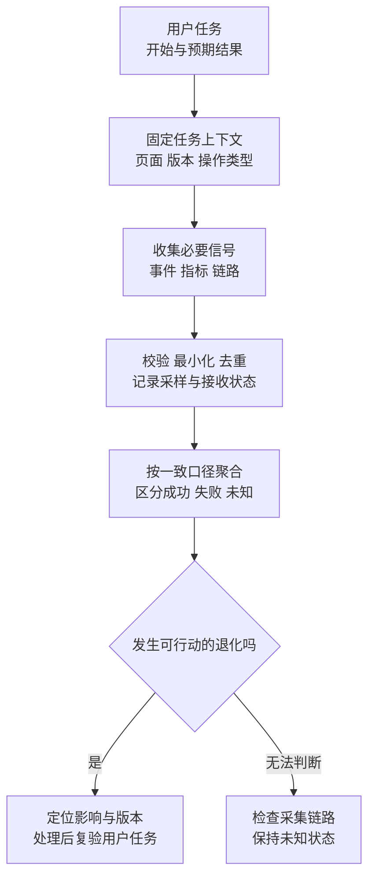

# 从用户遇到的问题找到可用的证据

## OBS-01 前端可观测性、SLI/SLO、告警与隐私边界

用户说“进度没有保存”，接口监控却全是 200。另一张图显示错误率突然变成零，原因竟是监控脚本本身没加载成功。还有一个错误明明发生在课程页，记录里却被归到了用户后来打开的设置页。

**可观测性（Observability）**关注的是：能否根据系统留下的信号，判断用户经历了什么，并缩小原因范围。它不等于收集尽可能多的日志。本篇从“保存学习进度”这个任务出发，连接事件归属、指标、链路、采样、告警和数据最小化。

### 学习前先确认

- 直接前置：[DEBUG-01 系统化调试、证据与因果推断](../chinese-guides/debug-01-systematic-debugging-evidence-causality.md#debug-01)。能把观察与猜测分开，沿证据逐步缩小范围。
- 直接前置：[ENG-06 CI/CD、制品晋级、发布与回滚](../chinese-guides/eng-06-ci-cd-artifact-promotion-release-rollback.md#eng-06)。理解版本、配置、灰度和恢复需要连接到同一次变更。

### 一、先定义用户完成了什么

“保存成功”可能指按钮回调结束、HTTP 返回 200、服务端写入完成，或者用户再次进入页面时仍能读到保存结果。这些节点代表不同事实。如果产品承诺持久保存，单独统计请求状态就不够。

可以先把任务写清：用户提交有效的进度修改后，在约定时间内得到明确结果，成功时服务端确认持久化，重新读取能得到一致值；失败或结果未知时，界面保留输入并允许查询、恢复。后面的监控应围绕这个约定建立，而不是先挑一个 SDK 再接受它默认提供的全部字段。

技术信号和用户结果应能互相解释。资源 404 可以说明某个面板打不开；长任务可以解释点击后没有反馈；HTTP 200 配合业务失败码，可以解释“请求成功但任务失败”。一个信号不必承担所有问题。



### 二、真实访问数据与实验室数据回答不同问题

**RUM（Real User Monitoring）**来自用户的真实访问。它包含实际设备、浏览器、网络、缓存、会话长度和操作组合，适合判断影响范围。中文里直接说“真实访问数据”更清楚，不必把 field data 生硬翻成“字段数据”。

实验室数据来自受控环境：同一设备、同一路径、相近条件，便于重现和比较原因。合成监控则可以定时执行关键任务，即使暂时没有用户，也能发现入口或依赖不可用。合成访问应单独标识，不能混入真实用户成功率把故障稀释。

假设真实访问显示课程列表在旧版桌面浏览器上经常卡顿，可以在实验室复现这个浏览器和操作，找到主线程耗时。相反，在开发机一次测得很快，不能推出所有用户都很快。先看影响，再选择可重现的条件，通常比盲目优化每个数字更有效。

内部桌面系统可能没有足够的公开 CrUX 数据，甚至不在其采集范围内。没有公开报告不意味着性能优秀或糟糕；应使用适合自身访问范围的观测和实验数据，并说明样本与覆盖范围。

### 三、文档访问、页面切换和业务任务分别编号

浏览器加载一个 HTML 文档后，SPA 可以在不重新加载文档的情况下切换许多页面；同一页面内又可能同时运行多个保存、导出和查询。给它们都叫“会话”，很容易把事件混在一起。

可以按职责区分：文档访问 ID 关联这一轮页面生命周期；页面访问 ID 区分每次前端路由进入；任务 ID 关联一项具体操作的开始、重试和结果。业务幂等键与遥测事件 ID 也不同：前者防止重复业务效果，后者帮助接收端避免重复计数，不能随意混用。

最重要的是在操作开始时捕获必要上下文。请求在课程页发起，响应晚到时用户已经切到设置页，仍应归属原任务。不要在回调里再读一个可变化的全局 `currentRoute`。

```js example=observe-origin-context
let currentRoute = '/courses/:id';
const task = Object.freeze({ route: currentRoute, release: 'lesson-v2' });
currentRoute = '/settings';
const event = { taskRoute: task.route, visibleRoute: currentRoute };
console.log(event.taskRoute); // => /courses/:id
console.log(event.visibleRoute); // => /settings
```

这段代码固定的是结构化、无用户标识的值。真实对象若包含嵌套可变状态，只冻结外层并不能深度冻结；更稳妥的是只复制当前用途需要的标量字段。路由应取模板，而不是完整 URL，例如保留 `/courses/:id`，不收集课程 ID、查询词和令牌。

### 四、错误需要按产生渠道与业务语义分类

运行时未捕获异常可以通过全局错误监听收集；资源加载失败也可能触发 error，但它的事件形态和传播方式与脚本异常不同，捕获阶段监听常用于区分资源失败。Promise 的未处理拒绝是另一条渠道；框架错误边界、路由加载失败和业务返回错误又有各自的上下文。

不能把所有对象都直接序列化上传。错误消息、堆栈、资源 URL、接口响应可能夹带搜索词、用户输入、文件路径或凭据。采集前应归类并提取必要字段，例如受控错误码、资源类型、版本和路由模板；需要堆栈时，还要配合裁剪、脱敏与访问控制。

网络错误也要细分：HTTP 500、请求取消、离线、CORS 阻止读取、业务校验失败并不是同一件事。浏览器有时只提供有限信息，不能把一个泛化的 `TypeError` 自动解释成“服务器宕机”。应保留 `unknown` 分类，再用允许关联的请求信息缩小范围。

重复上报常来自多个渠道同时捕获同一异常。按稳定事件身份和错误指纹组织数据，可以减少重复；但不要把同一错误指纹一天内全部压成一次，否则无法估计影响次数。指纹用于分组，事件 ID 用于同一事件的去重，职责不同。

### 五、日志、指标和链路各自适合看什么

**日志（Logs）**适合查看一次事件的具体上下文；**指标（Metrics）**适合按固定维度聚合数量、比例与分布；**链路（Traces）**把同一次工作中的步骤串起来。一个 trace 由多个 span 表示不同操作及其父子关系。

例如“保存进度慢”可以先由延迟指标发现，再查看某次任务的 trace，发现时间主要花在数据库锁等待；最后读相关日志确认冲突对象和处理分支。任何一类信号都不必包含全部业务正文。

指标标签必须控制基数。按路由模板、版本和错误类型聚合通常可管理；把完整 URL、用户 ID、随机请求 ID 当作标签，会产生大量时间序列，增加成本并引入数据风险。需要单次定位的信息可以放到受控事件或 trace 中，也应有必要性与保留范围。

使用 `traceparent` 等传播信息时，只向明确允许的自有或受控域名注入。向所有 fetch 自动加头，既可能泄露关联信息，也可能触发跨域预检或破坏第三方请求。源站收到浏览器传来的 trace 信息，也不能把它当成可信用户身份。

OpenTelemetry 提供跨组件的遥测模型和工具，但浏览器端 instrumentation 的成熟度与具体包支持需要逐项核对。官方 JavaScript 文档仍提示浏览器采集处于实验阶段；选择它不等于默认获得完整 SPA 归属、隐私规则与可靠交付。这里的概念不依赖某一个供应商 SDK。

### 六、用一页实验观察晚到结果与撤回选择

把下面完整内容保存为 `observation.html`，直接在桌面浏览器打开。它只有本地内存记录，不发送请求、不读取真实账号、不使用持久存储。勾选后点击“开始模拟保存”，再立即切换页面；一秒后，记录应仍归属原页面。保存过程中取消勾选，则队列清空，晚到结果也不会重新加入。

```html example=observe-local-page runtime=project file=observation.html
<!doctype html>
<html lang="zh-CN">
<meta charset="utf-8">
<title>观察一次晚到的保存结果</title>
<style>
  body { margin: 48px auto; max-width: 900px; padding: 0 28px;
    font: 17px/1.8 system-ui; color: #183347; background: #f5f8fa; }
  main { background: white; border: 1px solid #d6e3e9;
    border-radius: 20px; padding: 32px; }
  h1 { font-size: 28px; margin-top: 0; }
  button { font: inherit; padding: 8px 18px; margin: 12px 8px 12px 0;
    border: 1px solid #245b70; border-radius: 8px; cursor: pointer;
    color: #17465a; background: #ecf5f8; }
  button:focus-visible, input:focus-visible { outline: 3px solid #b96a13; }
  pre { white-space: pre-wrap; min-height: 180px; padding: 20px;
    background: #edf3f6; border-radius: 12px; font-size: 15px; }
</style>
<main>
  <p>本地观察实验 · 不上传数据</p>
  <h1>结果晚到，仍应找到原来的任务</h1>
  <p>先允许记录，开始保存，再切换页面；也可以在等待时撤回记录选择。</p>
  <label><input id="consent" type="checkbox"> 允许本页记录模拟事件</label>
  <p>当前页面：<strong id="route"></strong></p>
  <button id="save">开始模拟保存</button>
  <button id="switch">切换页面</button>
  <p id="status" role="status">尚未开始</p>
  <pre id="events" aria-label="本地事件队列"></pre>
</main>
<script>
  const byId = (id) => document.getElementById(id);
  let route = '/courses/:id';
  let generation = 0;
  let sequence = 0;
  let events = [];
  function render() {
    byId('route').textContent = route;
    byId('events').textContent = JSON.stringify(events, null, 2);
  }
  byId('consent').addEventListener('change', () => {
    generation += 1;
    events = [];
    byId('status').textContent = byId('consent').checked
      ? '已开启新的记录范围，之前的任务不会补记' : '已停止记录并清空队列';
    render();
  });
  byId('switch').addEventListener('click', () => {
    route = route === '/settings' ? '/courses/:id' : '/settings';
    render();
  });
  byId('save').addEventListener('click', () => {
    const task = { id: ++sequence, route, generation,
      allowed: byId('consent').checked, started: performance.now() };
    byId('status').textContent = `任务 ${task.id} 正在等待模拟结果`;
    setTimeout(() => {
      if (!task.allowed || !byId('consent').checked ||
          task.generation !== generation) {
        byId('status').textContent = `任务 ${task.id} 完成，未记录`;
        return;
      }
      // 显式构造允许字段，不展开任意上下文或业务对象。
      events.push({ eventId: `local-${task.id}`, route: task.route,
        release: 'lesson-v2', outcome: 'success',
        durationMs: Math.round(performance.now() - task.started) });
      events = events.slice(-20);
      byId('status').textContent = `任务 ${task.id} 已记录，当前显示页为 ${route}`;
      render();
    }, 1000);
  });
  render();
</script>
</html>
```

再试一次：开始保存后取消勾选，马上重新勾选。旧任务仍不应被补记，因为 `generation` 已改变。只检查回调执行时“现在是否同意”，会让新选择错误地复活旧任务。

本实验的成功、耗时都来自定时器模拟，不代表 API 已保存数据，也不提供实际监控交付保证。序号只在本页去重，真实接收端需要合适的事件身份和保留规则。代码中的勾选只演示数据控制过程，不替代产品对处理依据、说明和用户选择的完整设计。

### 七、采样改变了你能怎样解释数据

**采样（Sampling）**用一部分事件估计总体，降低网络与存储成本。前提是知道哪些事件有机会被选中，以及选择概率是否与结果相关。百分比写成 10% 不代表数据天然无偏。

假设真实有 100 次失败、900 次成功。保留全部失败，却只保留 10% 成功，收到 190 条事件，其中 100 条失败。直接计算 `100 / 190` 会得到约 52.6%，真实失败率却是 10%。

```js example=observe-sampling-bias
const received = { failed: 100, succeeded: 90 };
console.log((received.failed / (received.failed + received.succeeded)).toFixed(3)); // => 0.526
const estimatedFailed = received.failed / 1;
const estimatedSucceeded = received.succeeded / 0.1;
console.log((estimatedFailed / (estimatedFailed + estimatedSucceeded)).toFixed(3)); // => 0.100
```

反向按概率加权只在纳入概率已知、采样设计成立等条件下提供估计，这个整齐例子不是对任意有偏漏数的修复。更易解释的方案通常是为关键成功率维护一致口径的计数，再为详细事件和 trace 单独采样。

还要检查采样前是否已经漏数：低性能设备更容易上传失败，崩溃页面来不及上报，跨域 iframe 看不到，某些浏览器 API 不支持。对收到的数据算得再精确，也不能自动代表没收到的那一群用户。

### 八、先写清分母，再计算 SLO 与错误预算

**SLI（Service Level Indicator）**是衡量服务表现的具体指标；**SLO（Service Level Objective）**给它设定目标与统计窗口。一个可读的例子是：“滚动 30 天内，99.5% 的有效保存任务在两秒内得到持久化成功确认。”它同时包含任务范围、成功条件、时限、比例和窗口。

什么是“有效任务”应在看结果之前定义：无效表单未发请求是否纳入；用户主动取消怎样分类；超时后状态未知怎样追踪。不能事后把失败任务改成“不适用”，使指标显得更好。对于明确的两秒成功目标，到期没有成功确认就是该时限目标未满足，即使稍后最终保存成功，两种结果仍应分别保留。

**错误预算（Error Budget）**是目标允许的不良结果份额。教学窗口有 10,000 次有效任务，目标 99.5%，允许 50 次不良结果；已经发生 35 次，还剩 15 次。这里按任务次数计算，不应直接翻成“还可以停机多少分钟”。

```js example=observe-error-budget
function budget(total, bad, target) {
  if (!Number.isInteger(total) || !Number.isInteger(bad) ||
      total < 0 || bad < 0 || bad > total ||
      !Number.isFinite(target) || target <= 0 || target >= 1) {
    throw new RangeError('invalid SLO input');
  }
  if (total === 0) return null;
  const allowed = total * (1 - target);
  return { remaining: allowed - bad, burn: (bad / total) / (1 - target) };
}
console.log(budget(10000, 35, 0.995).remaining.toFixed(0)); // => 15
console.log(budget(1000, 20, 0.995).burn.toFixed(1)); // => 4.0
console.log(budget(0, 0, 0.995)); // => null
```

**燃烧率（Burn Rate）**比较当前不良比例与目标允许比例。这里 2% 除以 0.5% 得到 4，说明按当前比例消耗预算的速度是目标水平的四倍。零分母返回未知，而不是 100% 成功。滚动窗口总量变化、流量分布和低样本都会影响解释，应一并展示。

### 九、告警要让接收者知道为什么现在行动

“错误数大于十”缺少分母：一百次访问失败十次，与一百万次访问失败十次，含义不同。单看长窗口可能迟迟不恢复，单看短窗口又可能被偶发抖动触发。多窗口告警可以要求较长窗口存在持续消耗，同时较短窗口确认问题仍在发生。

例如某个 30 天目标，可以以过去一小时与过去五分钟的燃烧率同时超限作为一个告警条件。阈值需结合服务目标、响应能力和流量制定；Google SRE 给出的数值是起点，不是所有站点都应直接照抄的配置。

一条可行动的告警应包含：哪类用户任务受影响、何时开始、当前分母与新鲜度、相关版本与分组、已有处理入口和负责人。相同事故引发的接口、页面和依赖告警应关联或抑制，避免同时制造许多重复通知。

低流量时一次失败就可能把比例推得很高。不能只加一个很大的最小样本门槛把严重故障藏起来；可以结合关键任务合成检查、失败影响和较长观察窗口，采用适合的响应等级。恢复通知也要基于恢复条件，而不只是用户手动把告警静音。

### 十、指标回调的时间不等于指标所属的时间

PerformanceObserver 异步返回浏览器记录。`buffered: true` 可以请求符合类型的既有缓冲记录，应搭配单一 `type`，不是与 `entryTypes` 混用。还应检查 `supportedEntryTypes`，不支持时标明缺失，不能补零。

LCP、INP、CLS 有各自的生命周期；页面进入后台、从 bfcache 恢复、用户迟迟不交互都会影响报告时机。SPA 切换一次路由，并不意味着这些标准指标天然重新开始。自定义“路由内容出现时间”可以很有价值，但需要独立名字、起止条件和版本，不能混进文档级 LCP。

接收端也要识别指标更新。同一个 metric ID 先报候选值、后报更新值，应按约定更新或聚合，不能把同一次访问多次计入分母。若传的是 delta，接收端必须按 delta 约定累加；不能一会儿发送总值，一会儿发送增量。

离开页面时可以用 `visibilitychange` 等时机尝试发送小批数据，但不能依赖关闭时一定执行。`sendBeacon()` 返回 true 只代表浏览器接受入队，不代表服务器收到、校验通过并写入。需要端到端交付确认的流程，要有相应协议，不能把 best-effort 遥测当作交易结果凭据。指标定义接着看 [PERF-01](../chinese-guides/perf-01-core-web-vitals-performance-budgets.md#一三个指标对应三种不同的等待与不适)。

### 十一、数据最小化应发生在进入队列之前

尽量采用字段白名单：只构造批准的事件名、路由模板、公开版本、受控结果码和必要数值。把整个错误对象、请求体或页面文本放进队列，再希望服务端清洗，意味着敏感信息已经穿过浏览器缓冲、传输和接收日志。

例如保存失败的分析通常需要“课程进度保存、校验失败、版本 v2”，不需要用户的笔记正文、Cookie、Authorization 或完整查询参数。source map 和堆栈的访问要匹配诊断需要，区分公开制品与受控诊断材料。

对邮箱或用户 ID 做 hash，不自动等于匿名化；可枚举、可关联或仍能识别的值可能继续承担识别作用。详见 [PRIVACY-01 的哈希边界](../chinese-guides/privacy-01-data-minimization-consent-retention-rights.md#三哈希向量和摘要不自动等于匿名)。

保留时间、访问范围、删除流程和供应商转发同样属于采集设计。撤回选择需要影响尚未发送的队列与正在运行的任务；重新同意也不应默认补采旧任务。可以沿 [PRIVACY-01 的排队任务](../chinese-guides/privacy-01-data-minimization-consent-retention-rights.md#五撤回要让已经排队的任务重新检查)继续理解这一点。

### 十二、先验证观测链路，再相信安静的面板

一条事件可能经历生成、过滤、采样、入队、发送、接收、校验、存储和聚合。任何一段异常都可能让最终曲线变低。可以用一个明确标为合成的事件，检查允许字段、事件身份、版本归属、接收状态和聚合结果；不能把合成事件算进真实任务表现。

关键检查不需要铺成庞大的测试项目。先覆盖最容易误判的几种情况：页面切换后的晚到结果仍归原任务；取消记录后旧回调不补记；重复上传不重复计数；没有有效样本显示未知；监控入口失败时产生独立的采集故障信号。

同时控制观测自己的开销：有界队列、合理批量、丢弃策略和速率限制，避免失败风暴触发更多日志、更多失败和主线程阻塞。被丢弃的数量可以在允许的汇总范围内记录，帮助解释数据缺口，但不能为了记录丢弃而重新收集完整事件。

发布后先按版本与路由查看关键任务，再对照整体指标。恢复时复查同一条用户路径及采集新鲜度，让“问题解决了”的判断来自原问题的证据。发布节奏与恢复选择见 [ENG-06 的停止条件](../chinese-guides/eng-06-ci-cd-artifact-promotion-release-rollback.md#八先写停止条件再等待曲线变好)。

### 带着问题回看

- 任务在课程页开始、设置页结束，应该记录哪个页面，为什么？
- 全量保留失败、只保留一成成功，收到的事件能直接计算失败率吗？
- 没有 INP、没有任务事件、没有错误事件，这三种“没有”分别能说明什么？
- 如何证明撤回选择后，已经排队的任务不会再次上传？

### 参考与延伸阅读

- [OpenTelemetry JavaScript](https://opentelemetry.io/docs/languages/js/)：查信号支持状态、浏览器采集限制和各组件入口。
- [Google SRE：基于 SLO 的告警](https://sre.google/workbook/alerting-on-slos/)：理解燃烧率、多窗口和低流量限制。
- [MDN：PerformanceObserver.observe](https://developer.mozilla.org/en-US/docs/Web/API/PerformanceObserver/observe)：核对类型、缓冲和支持条件。
- [MDN：sendBeacon](https://developer.mozilla.org/en-US/docs/Web/API/Navigator/sendBeacon)：理解入队返回值与发送边界。
- [web-vitals 官方库](https://github.com/GoogleChrome/web-vitals)：查看指标生命周期、更新和已知限制，避免手写简化采集器冒充标准结果。
