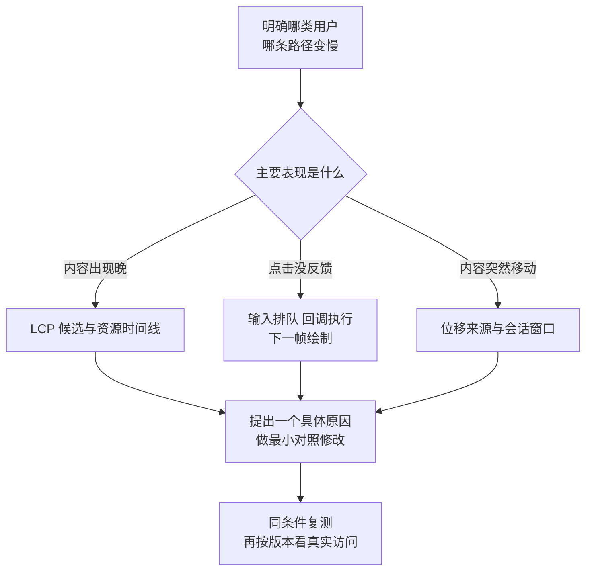

# 从体验指标走到具体的性能原因

## PERF-01 Core Web Vitals 与性能预算

“页面慢”至少可能指三件事：正文迟迟不出现，点击后没有反应，正要点的按钮突然被内容挤走。它们需要不同证据，也对应不同优化方向。

本篇从这三种体验出发，解释 LCP、INP、CLS 的含义，再用时间拆分、分位数和浏览器实验定位原因。例子以桌面学习资料站为主：首次打开讲义、切换统计面板、长时间阅读后继续操作。重点是知道为什么改善，而不是追逐一次跑分。

### 学习前先确认

- 直接前置：[OBS-01 前端可观测性、SLI/SLO、告警与隐私边界](../chinese-guides/obs-01-frontend-observability-slo-alerting-privacy.md#obs-01)。理解真实访问数据、实验室数据、事件归属与采样分母，能区分缺失值和真实的零。

### 一、三个指标对应三种不同的等待与不适

**Core Web Vitals**目前由 LCP、INP、CLS 组成，分别关注主要内容出现、交互响应和视觉稳定性。指标定义会演进；下面按本次审校时的官方定义解释。

| 指标 | 读者体验 | 良好阈值 | 容易混淆的对象 |
| --- | --- | --- | --- |
| **LCP（Largest Contentful Paint）** | 首屏主要内容何时出现 | 不高于 2.5 秒 | 不是所有资源都下载完成 |
| **INP（Interaction to Next Paint）** | 交互到下一次绘制要等多久 | 不高于 200 毫秒 | 不是请求总耗时，也不只看第一次交互 |
| **CLS（Cumulative Layout Shift）** | 页面是否出现意外位置移动 | 不高于 0.1 | 不是所有动画，也不是整段会话位移分数直接相加 |

真实访问的达标判断看各指标的第 75 百分位，并区分设备类别。这里的产品范围是桌面端，就以桌面访问和代表性的桌面条件判断；不必为不存在的移动入口投入一套验证。某个指标优秀不能抵消另一个指标明显不良。

没有发生符合条件的交互，可能没有 INP。它应记为缺失，不应人为补成零。加载后仍可能发生新的交互和布局移动，所以首屏测量结束不等于页面整个生命周期已经被观察完。

### 二、先找到指标指向的具体元素和交互

LCP 的候选可以是视口内符合条件的图片或文本块。资料页可能是文章标题与摘要，不一定是站点 Logo，更不一定是字节最大的文件。优化前先在 Performance 记录里确认具体候选及其出现时刻。

INP 对应一次交互的整体响应表现：浏览器先排队等待处理，再执行相关回调，之后完成必要的渲染并展示下一帧。长会话会遇到许多交互，不能把最初那次点击快就当作后面都快。

CLS 要看哪些既有可见元素的位置发生意外变化。例如异步插入顶部提示，把正文和工具栏一起向下推；新提示自身刚加入页面，并不是原本被移动的那个元素。只盯着新增节点，可能找不到真正受影响的区域。



“JS 太多”可以是一个待验证原因，但必须继续问：它让图片更晚被发现，还是堵住输入处理，或者在页面里插入了额外区域？同一个资源大小问题可能通过不同机制影响体验。

### 三、p75 不能用平均值代替，也不能直接求平均

第 75 百分位可以理解为排序后的一个位置，用来描述大多数访问所处的水平。不同统计系统可能用不同的分位估计方法，比较时需要统一。下面使用 **nearest-rank** 演示：把样本升序排列，取向上取整的第 `0.75 × 数量` 个值。

```js example=performance-percentile
function p75(values) {
  if (values.some((value) => !Number.isFinite(value) || value < 0)) {
    throw new RangeError('invalid duration');
  }
  if (values.length === 0) return null;
  const ordered = [...values].sort((a, b) => a - b);
  return ordered[Math.ceil(0.75 * ordered.length) - 1];
}
const common = [1000, 1000, 1000, 1000];
const slower = [4000];
console.log(p75([...common, ...slower])); // => 1000
console.log((p75(common) + p75(slower)) / 2); // => 2500
console.log(p75([])); // => null
```

合并样本的 p75 是 1000，两组 p75 的平均却是 2500。即使按两组人数加权，分位数也不能一般性地还原总体分位数；需要原始分布、直方图或具有明确精度的分位摘要。

这个五个样本的例子只是算术示意，不能证明真实产品达标。实际比较要带上样本量、时间窗口、版本、浏览器、设备能力、路由和缓存条件。少数慢用户仍然可能承担严重问题，p75 良好不代表最慢的那部分可以忽略。

分组比例改变也会使总体数字变化。例如新版刚好吸引更多新用户，冷缓存访问变多，总体 LCP 可能上升；不分组就认定新代码回归，会把用户结构变化误当成技术原因。

### 四、实验室数据用于解释原因，真实访问用于确认影响

实验室可以固定视口、网络与 CPU 条件、缓存状态和操作步骤，便于做修改前后的对照。真实访问包含实际的环境分布和长会话行为，适合判断改善是否覆盖目标人群。二者应配合使用。

Lighthouse 的性能分数是若干测量值经过评分规则形成的综合分数，不是用户任务成功率。一次导航审计通常没有执行完整交互，不能由它直接得到真实用户整个会话的 INP；TBT 可以提示主线程阻塞风险，但不能替代 INP 的定义。

**TBT（Total Blocking Time）**在测量窗口内，累计长任务超过 50 毫秒的部分。例如两个任务分别执行 80 和 40 毫秒，前者贡献 30，后者贡献 0，阻塞时间合计 30 毫秒，而不是总执行时间 120 毫秒。窗口通常从 FCP 后开始，终点取决于工具和测量模式。它可能随加载优化而下降，但用户稍后打开一个大型统计面板仍可能卡顿。需要把那条交互路径纳入实验，而不是拿首页分数代替所有页面。

比较时保持测量设置、工具版本、预热方式和路径一致，并保留有代表性的多次结果，避免只挑最快一次。若结果离散很大，先找后台任务、缓存、第三方内容和环境噪声，不必立即扩大测试数量。观测覆盖的边界见 [OBS-01 的数据来源](../chinese-guides/obs-01-frontend-observability-slo-alerting-privacy.md#二真实访问数据与实验室数据回答不同问题)。

### 五、性能预算要对应用户路径与实际成本

**性能预算（Performance Budget）**是为某条路径允许承担的成本设置上限或变化限制。预算可以针对体验指标，也可以针对较容易在构建时发现的资源与执行成本。

| 预算对象 | 例子中的约定 | 需要同时说明 |
| --- | --- | --- |
| 首次阅读入口的 JS | gzip 后合计不超过 300 KiB | 包含入口及静态依赖，压缩算法固定 |
| 按需统计面板 | 单独记录首次打开的下载与处理成本 | 不计入首屏不代表没有用户成本 |
| 关键交互 | 控制长任务并观察实际响应 | 不能只看压缩后字节数 |
| 真实访问体验 | 按版本和桌面路由比较 p75 | 样本量、窗口与采样口径一致 |

表中 300 KiB 是教学示例，不是所有站点适用的标准。把构建目录全部 JS 相加，会把尚未进入的页面也算进首次加载；只看入口文件本身，又可能漏掉它立即导入的依赖。应根据产物依赖图与实际 Network 请求核对。

gzip 或 Brotli 字节对应传输成本，未压缩大小影响解析输入，执行成本还取决于代码行为、设备和主线程竞争。一个很小的脚本也能执行百万次循环；一份较大的静态数据并不一定马上执行。因此预算最好同时有资源和体验观察，不能用一个数字包办所有成本。

预算超限后的行动也要明确：阻止明显意外的整库引入，或者由负责人解释必要增长与替代优化。若每次超限都直接提高上限，预算就失去了帮助定位变化的作用。缓存与压缩的传输背景可回看 [DEPLOY-01](../chinese-guides/deploy-01-nginx-static-assets-reverse-proxy-https-cdn.md#九cdn-缓存键决定谁会拿到同一份响应)。

### 六、把图片 LCP 拆成四段时间

对于需要下载资源的 LCP 候选，可以把时间拆成：首字节前的等待、资源开始加载前的延迟、资源加载耗时、资源完成后到元素呈现的延迟。先定位大头，再决定优化哪一段。

假设一次图片 LCP 是 3000 毫秒：文档首字节 500，发现与启动图片晚了 900，下载花了 400，下载完成后又等了 1200 才显示。即使把图片下载压缩到 100，其他阶段不变，也只能把总时间减少 300。

```js example=performance-lcp-parts
const parts = { ttfb: 500, loadDelay: 900, loadTime: 400, renderDelay: 1200 };
const total = (sample) => Object.values(sample).reduce((sum, value) => sum + value, 0);
console.log(total(parts)); // => 3000
console.log(total({ ...parts, loadTime: 100 })); // => 2700
console.log(total({ ...parts, loadDelay: 200, renderDelay: 300 })); // => 1400
```

这不是性能预测器，只是解释瓶颈的合成时间线。真实改动会改变资源竞争与候选选择，几个阶段并非永远独立。对于文本 LCP，也不要强行套一个图片下载阶段；应观察字体、样式、内容生成与渲染时机。

资源加载延迟很长时，看看图片是否等到 JS 执行或接口返回后才被发现；渲染延迟很长时，看看内容是否被隐藏直到某个初始化完成，或主线程是否忙于无关工作。不要把任何一段都默认归因于“网速慢”。

### 七、LCP 优化要围绕真正的关键路径

首屏核心图片不适合无条件懒加载。若它是 LCP 候选，浏览器越晚发现它，主要内容就越晚出现。可以让资源较早出现在 HTML 中，在确有竞争时考虑 `fetchpriority="high"`，并选择合适尺寸和压缩格式；这些提示需要实际时间线验证。

preload 适合解决关键资源发现太晚的问题，不是所有资源都预加载。预加载过多会争抢带宽；类型、跨域模式或响应式图片选择不匹配，还可能让浏览器额外下载一份。先确认真正使用哪一个资源，再发提示。

对于资料阅读页，关键内容可能是文本。服务器较晚输出正文、阻塞样式、字体替换、同步脚本和 hydration 工作都可能影响呈现。SSR 可以让内容更早到达，但如果入口仍把内容隐藏到客户端初始化结束，就浪费了这项优势。相关时序见 [RENDER-02](../chinese-guides/render-02-streaming-ssr-hydration-islands.md#render-02)。

CDN 命中改善了网络等待，却不会自动缩短本地解析和执行；图片变小却仍由晚到 JS 才创建，也可能改善有限。把优化动作和它要缩短的那一段对应起来，才能判断修改是否真正生效。

### 八、INP 包含输入等待、回调执行和呈现等待

一次点击发生时，主线程可能正在运行其他任务，浏览器需要先等它让出执行机会。轮到事件回调后，还可能进行大量计算和 DOM 更新；回调结束后，样式、布局和绘制也需要时间。只记录处理函数里的两次 `performance.now()`，会漏掉前后两段。

INP 基于页面生命周期中符合条件的交互，并对交互较多的访问排除少量极端值；它既不是所有事件 duration 的平均，也不是永远无条件取最大值。一个交互可能包含多个事件，应该按 interaction 处理，而不是把 `pointerdown`、`pointerup`、`click` 各算一次独立用户操作。按当前规则，每 50 次交互可忽略一个最高延迟：只有 10 次交互时通常取最慢的一次；恰好 50 次时取第二慢的一次。随后再在多次页面访问之间取 p75，这是两个不同层次的统计，不能混为一谈。生产统计可使用经过维护的实现，不必从一个 PerformanceObserver 片段重写全部规则。

常见误区是认为写了 `async` 就不会阻塞。函数在第一个真正让出调度的等待之前仍同步执行；`await Promise.resolve()` 主要进入微任务队列，连续微任务可能继续挡住渲染，不能作为稳定的让浏览器绘制办法。

对于必须在主线程完成的可分块任务，可把长工作拆小，在适当位置让出调度；支持时考虑 `scheduler.yield()`，或按环境选任务调度方案。纯计算也可评估 Worker，但它不能直接操作 DOM，数据传递和启动有成本。不要把“用了 Worker”当成用户必然更快的结论。

### 九、亲眼观察一次长任务与分段任务

把下方完整内容保存为 `responsiveness.html`，用桌面浏览器打开。先看帧计数持续增加，再分别点击两个按钮。两种方式都安排约 120 毫秒的人工忙碌；第一种一次执行，第二种拆成八段，每段约 15 毫秒，段间通过 timer 让出执行机会。

```html example=performance-response-page runtime=project file=responsiveness.html
<!doctype html>
<html lang="zh-CN">
<meta charset="utf-8">
<title>观察主线程何时能回应</title>
<style>
  body { margin: 48px auto; max-width: 960px; padding: 0 28px;
    font: 17px/1.8 system-ui; color: #203c49; background: #f2f7f6; }
  main { background: white; padding: 32px; border: 1px solid #d8e6e3;
    border-radius: 20px; }
  h1 { font-size: 28px; }
  button { font: inherit; padding: 10px 18px; margin: 8px 12px 8px 0;
    border: 1px solid #247163; border-radius: 8px; cursor: pointer;
    color: #185648; background: #eff8f5; }
  button:disabled { opacity: .55; cursor: wait; }
  button:focus-visible { outline: 3px solid #b96a13; }
  progress { width: 100%; height: 24px; accent-color: #247163; }
  pre { min-height: 160px; white-space: pre-wrap; padding: 16px;
    font-size: 15px; background: #edf4f2; border-radius: 10px; }
</style>
<main>
  <p>主线程观察实验 · 人工工作负载</p>
  <h1>总工作时间接近，反馈机会却不同</h1>
  <p>绘制回调计数：<strong id="frames">0</strong>。它不是 FPS 或 INP。</p>
  <button id="block">一次执行约 120 ms</button>
  <button id="chunk">分为八段执行</button>
  <p><label for="progress">任务进度</label></p>
  <progress id="progress" max="8" value="0"></progress>
  <p id="status" role="status">请选择一种方式</p>
  <p>下方仅显示收到的 Event Timing 记录，不计算标准 INP。</p>
  <pre id="events"></pre>
</main>
<script>
  const byId = (id) => document.getElementById(id);
  let frames = 0;
  function frame() {
    byId('frames').textContent = String(++frames);
    requestAnimationFrame(frame);
  }
  requestAnimationFrame(frame);
  function work(ms) {
    const end = performance.now() + ms;
    while (performance.now() < end) { /* 人工占用主线程，仅用于教学 */ }
  }
  const yieldTask = () => new Promise((resolve) => setTimeout(resolve, 0));
  async function run(chunked) {
    byId('block').disabled = byId('chunk').disabled = true;
    byId('progress').value = 0;
    byId('status').textContent = '正在处理';
    const start = performance.now();
    const beforeFrames = frames;
    try {
      for (let i = 0; i < 8; i++) {
        work(15);
        byId('progress').value = i + 1;
        if (chunked) await yieldTask();
      }
      byId('status').textContent = `完成：经过 ${Math.round(performance.now() - start)} ms，` +
        `期间绘制回调增加 ${frames - beforeFrames} 次`;
    } finally {
      byId('block').disabled = byId('chunk').disabled = false;
    }
  }
  byId('block').addEventListener('click', () => run(false));
  byId('chunk').addEventListener('click', () => run(true));
  if ('PerformanceObserver' in window &&
      PerformanceObserver.supportedEntryTypes.includes('event')) {
    const records = [];
    new PerformanceObserver((list) => {
      for (const entry of list.getEntries()) {
        if (!entry.interactionId) continue;
        records.push({ event: entry.name, interaction: entry.interactionId,
          durationMs: entry.duration });
      }
      byId('events').textContent = JSON.stringify(records.slice(-5), null, 2);
      records.splice(0, Math.max(0, records.length - 5));
    }).observe({ type: 'event', buffered: true, durationThreshold: 16 });
    byId('events').textContent = '等待符合时长门槛的事件记录';
  } else {
    byId('events').textContent = '此浏览器不支持 Event Timing；仍可观察进度与绘制回调';
  }
</script>
</html>
```

一次执行时，循环中虽然多次修改进度，浏览器仍可能直到结束才有机会绘制，用户看到的是进度直接跳到完成。分段方式给其他工作和渲染留下机会，总完成时间可能略长，反馈却通常更及时。让出任务不保证每次必然绘制，也不保证固定毫秒数；浏览器负载和后台状态都会影响调度。

这是为了放大调度现象而使用的忙循环，不是生产优化代码。帧回调数量仅帮助看见主线程有没有让出机会，不是实际绘制帧数的严密测量。事件记录还受 API 支持、报告门槛与时间量化影响，不能把列表中某个 duration 直接宣布为整页 INP。

真实场景中，应尽早显示已接收输入、保持取消和结果归属，再处理后续工作；分块期间状态可能发生变化，也要防止旧任务覆盖新页面。可接着看 [OBS-01 的任务归属](../chinese-guides/obs-01-frontend-observability-slo-alerting-privacy.md#三文档访问页面切换和业务任务分别编号)。

### 十、CLS 看最严重的位移窗口，不看全程简单总和

布局位移分数与受影响区域、移动距离有关，不是用像素直接累加。它由受影响面积比例与移动距离比例相乘得到。例如在高度大于宽度的视口中，一个占半屏的可见区域向下移动四分之一屏高，移动前后覆盖区域的并集占 75%，移动距离占视口最长边的 25%，这次分数就是 `0.75 × 0.25 = 0.1875`。这里假设没有其他移动区域和裁切；复杂布局应读取浏览器给出的记录。CLS 将符合条件的意外位移放入会话窗口：相邻位移间隔短于一秒，一个窗口最多约五秒，取窗口分数的最大值。用户近期离散输入引起的部分位移会被排除，不能把所有条目不加区分地相加。

下面把已经产生的简化记录按窗口分组。时间单位毫秒，`value` 是假设浏览器给出的分数；代码不负责计算元素几何，也未实现后台、bfcache 和 iframe 等完整生命周期。

```js example=performance-cls-windows
function maximumShiftWindow(entries) {
  let start = 0, previous = 0, sum = 0, maximum = 0;
  for (const entry of [...entries].sort((a, b) => a.time - b.time)) {
    if (entry.hadRecentInput) continue;
    if (sum > 0 && entry.time - previous < 1000 && entry.time - start < 5000) {
      sum += entry.value;
    } else {
      start = entry.time;
      sum = entry.value;
    }
    previous = entry.time;
    maximum = Math.max(maximum, sum);
  }
  return maximum;
}
const entries = [
  { time: 100, value: 0.04, hadRecentInput: false },
  { time: 700, value: 0.03, hadRecentInput: false },
  { time: 900, value: 0.20, hadRecentInput: true },
  { time: 2100, value: 0.05, hadRecentInput: false }
];
console.log(maximumShiftWindow(entries).toFixed(2)); // => 0.07
console.log(entries.filter((e) => !e.hadRecentInput).reduce((n, e) => n + e.value, 0).toFixed(2)); // => 0.12
```

第一组是 `0.04 + 0.03`，后面的 `0.05` 与上一条有效位移间隔过长，另开窗口，因此最大值为 0.07，而不是 0.12。这个小函数只接收已验证的合成条目，不作为生产 CLS 采集器。

常见修复是为图片、视频、广告和异步区域预留空间，让骨架与最终内容尺寸接近，避免加载完成后突然在用户上方插入区域。字体替换也可能改变布局。预留空间要符合内容变化范围，不能简单固定所有区域高度，再把溢出的内容裁掉。

### 十一、指标更好时，仍要确认任务更好

延迟展示一个重要面板可能降低首屏成本，却使用户每次打开它等待更久；提前禁用按钮可能减少某些交互记录，却让用户无法及时操作；移除一个大的内容元素也可能改变 LCP 候选，却没让实际学习更顺畅。

因此，性能优化应同时保留任务完整性：正文出现是否完整可读，交互是否给出及时反馈，错误与空状态是否清楚，键盘操作和焦点是否保持。指标是帮助定位体验的观察工具，不能代替产品约定。

长会话尤其值得单独关注。首次阅读很快，切换十次面板后却内存增长、事件监听重复或缓存无限扩大，问题可能出现在生命周期管理。此时只减少入口包体积不够，应沿对象保留、订阅释放和任务取消查原因。

真实访问指标还应带上 SDK 与指标定义版本。采集器升级后数字变化，可能来自测量口径调整；不能把它全部记为代码性能收益。相关事件更新规则见 [OBS-01](../chinese-guides/obs-01-frontend-observability-slo-alerting-privacy.md#十指标回调的时间不等于指标所属的时间)。

### 十二、用一次小闭环决定是否保留优化

一个完整但不冗长的过程可以是：先观察课程页正文出现较晚，定位 LCP 候选；发现其内容要等无关统计初始化；把统计推迟到需要时，保持正文优先呈现；在相同桌面条件复测，再按发布版本观察真实访问分布与任务成功。

记录具体证据比写“性能提升明显”有用：候选有没有变、哪个阶段缩短、样本与条件是什么、有没有增加后续操作成本。如果数据不足，说明“本地机制得到验证，真实访问影响仍待观察”，不要补造百分比收益。

预算检查适合尽早拦住明显资源增长，浏览器记录适合解释瓶颈，线上指标适合观察实际效果。每一种手段用在它最擅长的位置，就不需要把一个小改动扩成庞大的测试工程。

发布后若特定浏览器或路由恶化，应利用版本与分组信息停止扩大影响，必要时恢复兼容版本；流程见 [ENG-06 的放量判断](../chinese-guides/eng-06-ci-cd-artifact-promotion-release-rollback.md#八先写停止条件再等待曲线变好)。持续保留真正有效的改动，清理过期预加载、实验开关和测量代码，让优化本身不变成新的负担。

### 带着问题回看

- 图片下载只占 LCP 的一小段，继续压缩图片能解决大部分等待吗？
- 一个事件处理函数只运行 20 毫秒，为什么用户仍可能等很久才看到反馈？
- 两组用户的 p75 不能直接平均，应该保存哪些数据才能正确聚合？
- 分段任务总时间略长却更舒服，改善的是哪一种体验？
- 加载阶段 CLS 为零，为什么不能推出长会话也没有意外位移？

### 参考与延伸阅读

- [web.dev：Web Vitals](https://web.dev/articles/vitals)：查当前指标、阈值与真实访问评估口径。
- [web.dev：优化 LCP](https://web.dev/articles/optimize-lcp)：按四段时间定位资源发现、加载和呈现问题。
- [web.dev：INP](https://web.dev/articles/inp)：理解交互、生命周期与实验室限制。
- [web.dev：CLS](https://web.dev/articles/cls)：查询位移分数、会话窗口和近期输入的处理。
- [web.dev：TBT](https://web.dev/articles/tbt)：核对阻塞时间的计算与测量窗口。
- [MDN：scheduler.yield](https://developer.mozilla.org/en-US/docs/Web/API/Scheduler/yield)：查任务让出机制与浏览器支持。
- [Chrome：Lighthouse 性能评分](https://developer.chrome.com/docs/lighthouse/performance/performance-scoring)：理解综合分数与测量差异。
- [MDN：PerformanceObserver.observe](https://developer.mozilla.org/en-US/docs/Web/API/PerformanceObserver/observe)：核对 Event Timing 选项与报告门槛。
- [web-vitals 官方库](https://github.com/GoogleChrome/web-vitals)：查看维护中的指标实现与已知差异。
