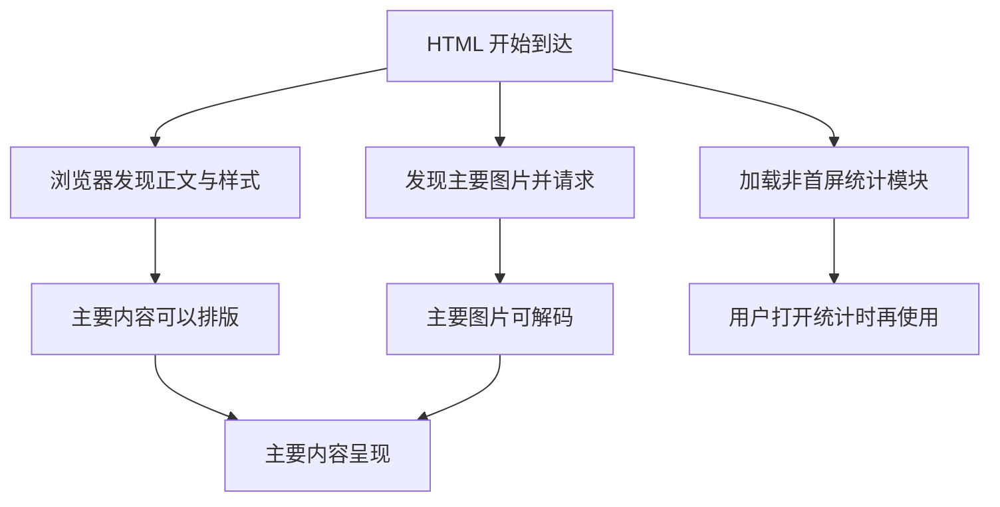

# 让关键内容更早到达，而不让旧内容误导用户

## PERF-02 Network、资源加载与缓存优化

同样一张 120 KiB 的课程封面，有的页面打开后很快就显示，有的却等了两秒才开始下载。还有一种情况：第一次访问很慢，第二次很快，但发布新版本后，用户反而打不开旧页面。

网络优化要同时回答“什么时候开始请求”“能否复用已有结果”“复用以后还对不对”。本篇沿着资料页的加载过程，讲清瀑布、依赖、图片、资源提示与几种缓存。缓存策略的完整定义可沿引用回查，这里重点解释如何作出选择、如何读懂结果。

### 学习前先确认

- 直接前置：[NET-01 浏览器网络、Fetch 与可靠性](../chinese-guides/net-01-browser-network-fetch-reliability.md#net-01)。先理解请求、状态、取消与重试，不把网络失败直接等同于业务失败。
- 直接前置：[PERF-01 Core Web Vitals 与性能预算](../chinese-guides/perf-01-core-web-vitals-performance-budgets.md#perf-01)。知道主要内容出现、交互反馈和传输大小衡量的是不同成本。

### 一、瀑布图先看什么时候开始，再看用了多久

**瀑布图（Waterfall）**把多个请求放到同一条时间轴上。横条很短，只能说明这个请求在某段阶段耗时少；如果它直到很晚才被发现，主要内容仍会出现得晚。

想象资料页的加载顺序：HTML 到达，下载入口脚本，脚本运行，取得课程信息，最后才创建图片标签。图片的下载只用了 150 毫秒，但前面的串行步骤花了一秒。此时换更快的图片服务器，无法消除“还不知道要请求哪张图”的等待。

在 Network 中先找到与用户慢点相关的请求，查看 Initiator，确认是谁触发了它；再看请求起点、优先级、协议、缓存来源和分段时间。不要先按 Size 排序，就认定最大的文件一定是最重要的瓶颈。

| 观察 | 目前能知道什么 | 还不能直接断定什么 |
| --- | --- | --- |
| 请求开始得晚 | 资源较晚进入加载流程 | 不一定是下载慢 |
| 排队时间长 | 请求在等待某些调度或连接条件 | 不一定是 JavaScript 占满主线程 |
| 等待首字节长 | 响应较晚开始到达 | 不等于服务器代码运行了同样久 |
| 下载时间长 | 响应传输阶段耗时多 | 不一定只由文件大小决定 |
| 请求已完成，内容仍没出现 | 网络完成与呈现之间还有工作 | 不应继续只盯网络 |

### 二、把主要内容画成依赖链

**关键路径（Critical Path）**是影响目标完成时间的必要依赖链。它不是“首屏所有文件”的另一个名字。正文已经可读时才用到的导出库，可能很大，却不应该挡住正文出现。



如果主要图片被藏在统计模块里，图中的两条分支就被错误地串在一起。优化可以是让图片地址更早进入 HTML，或者把无关初始化移出必要链，而不是再添加十个 preload。

下面只演示依赖关系的算术，假设两个任务互不竞争，数字不是浏览器实测结果。

```js example=network-dependency-time
const html = 300;
const image = 200;
const extraModule = 600;
console.log(html + extraModule + image); // => 1100
console.log(html + Math.max(image, extraModule)); // => 900
console.log(html + image); // => 500
```

第一行是图片被额外模块挡住；第二行是两者并行但仍等两者全部完成；第三行是正文目标只需要图片，不必等无关模块。真正的改善通常来自重新确认依赖。真实网络共享带宽、连接与 CPU，并行不能机械按最大值预测。

### 三、连接与首字节要连同观察位置一起解释

一次冷请求可能经过 DNS、建立连接、TLS、发送请求、等待与接收；复用连接后，某些阶段可能不再单独出现。**TTFB（Time to First Byte）**描述首字节到达前的时间，但工具选择的起点可能是导航开始或请求阶段，阅读报告前要确认口径。

服务端处理慢、边缘回源、重定向、身份检查和网络往返都可能抬高它。若要进一步拆服务端阶段，可以使用受控的 Server-Timing 信息或链路记录；不能把浏览器的一段等待直接归到数据库。

HTTP/2、HTTP/3 能多路复用，不表示所有请求没有竞争。流量控制、优先级、拥塞、服务端调度和不同源的连接条件仍会影响结果。过去为了突破并发限制而拆很多域名，今天可能增加连接开销；应查看实际协议和连接复用，而不是套用旧经验。

`preconnect` 可以为确定会用的关键源提前准备连接，`dns-prefetch` 只提前解析。十几个不确定第三方都提前连接，会消耗资源，并在用户尚未选择相关功能时触及第三方。先减少不必要的源，再为少数明确的依赖提供提示。

### 四、下载大小、解压大小与执行成本分开看

文本资源通常适合 gzip 或 Brotli，已压缩的图片、视频和归档再次压缩则不一定值得。静态文件预压缩可以减少在线 CPU 成本，但服务器必须发送与实际正文一致的 `Content-Encoding`，缓存也要区分编码变体。

同一个 JS，磁盘上 600 KiB，gzip 后传输 150 KiB，并不意味着浏览器只解析 150 KiB。下载后仍需解码、解析和执行。一个压缩率很好的巨大数据对象，也可能在解析、创建对象和后续渲染时带来明显成本。

Network 的 Size、Transferred，以及 Resource Timing 的 `transferSize`、`encodedBodySize`、`decodedBodySize` 表达不同含义。一个零值可能受到缓存、跨源计时权限或其他响应来源影响，不能用“等于零”作为所有环境通用的缓存命中判断。跨源详细计时还可能需要 `Timing-Allow-Origin`，它和允许读取业务响应的 CORS 头不是一回事。

HAR 很适合保存前后请求证据，但也可能包含身份头、完整 URL、请求体和响应内容。分享时应只留下当前分析需要的字段，不能仅删除 Cookie 就认为已经没有敏感信息。需要观察的数据范围可回看 [OBS-01 的采集最小化](../chinese-guides/obs-01-frontend-observability-slo-alerting-privacy.md#十一数据最小化应发生在进入队列之前)。

### 五、图片与字体要同时解决发现和呈现

主图通常应能被浏览器尽早发现，不要给确认的 LCP 图片无条件加 `loading="lazy"`。屏外插图可以延迟加载。`width`、`height` 或合适的比例约束用于预留空间，解决的又是布局稳定性问题。

下面是标记示意，假设这些资源已存在，候选图片具有相同比例。`sizes` 描述实际显示宽度，`srcset` 列出候选固有宽度；浏览器结合这些信息及设备条件选图，而不是按照文件名里的数字猜。

```html

```

实际 CSS 若把图片限制成 500px，而 `sizes` 一直宣称 90vw，就可能选到不必要的大图。桌面高 DPR 和宽屏也会遇到这个问题，不能把响应式图片只理解为手机功能。具体像素关系见 [H5-01](../chinese-guides/h5-01-viewport-responsive-safe-area-orientation.md#一css-像素描述布局dpr-描述映射)。

字体应先减少真正使用的字重与字符范围，再决定加载策略。`font-display` 影响字体等待和回退行为，但不会让两套字体的字形度量自动一致；替换后的换行变化仍可能产生位移。只预加载实际使用的关键字体，并匹配 `as="font"`、类型与 `crossorigin`，避免重复请求。

### 六、HTTP 缓存让响应复用，不保证内容永远正确

HTTP 缓存需要先决定能不能存，再决定何时能复用。新鲜响应可以按规则直接使用；需要验证时，客户端带上已有验证器，服务端可能返回 304，继续使用已有正文。

`no-cache` 允许存储但要求复用前验证，`no-store` 要求不要存储；`private` 用来排除共享缓存。带内容 hash 的静态资源适合较长新鲜期与 `immutable`，入口 HTML 通常需要及时验证。账户数据和公共帮助页不能采用同一种默认策略。完整指令对照见 [DEPLOY-01 的缓存规则](../chinese-guides/deploy-01-nginx-static-assets-reverse-proxy-https-cdn.md#八缓存指令分别回答能不能存与何时能复用)。

例如服务器给公共内容设置 60 秒新鲜期，边缘缓存已经保存了 40 秒，浏览器收到时并不是凭空又多出完整的 60 秒。HTTP 缓存会结合 Age、日期与传输经过的时间判断当前年龄。下面只演示忽略额外传输时间时的剩余量，不是完整缓存年龄算法。

```js example=network-freshness-remainder
const maxAge = 60;
const age = 40;
console.log(Math.max(0, maxAge - age)); // => 20
console.log(Math.max(0, maxAge - 80)); // => 0
```

缓存正确性还取决于键：同一路径若随语言、身份或查询参数改变表示，就要避免错误共用。给私人结果加一个高命中率缓存，可能只是把错误更快地分发给更多人。

### 七、实际看一次 200、304 与更新后的 200

保存为 `conditional-response.mjs`，用 Node.js 22 执行。它启动一个仅监听本机的临时 HTTP 服务，完成三个请求后关闭，不写磁盘、不连接外部服务。这里的客户端主动回传单个 ETag，演示条件响应；Node fetch 不在这个例子里替我们实现浏览器 HTTP 缓存。

```js example=network-conditional-response runtime=project file=conditional-response.mjs
import { createServer } from 'node:http';
import { createHash } from 'node:crypto';
import { once } from 'node:events';

let version = 1;
const server = createServer((req, res) => {
  if (req.method !== 'GET' || req.url !== '/lesson') {
    res.writeHead(404, { 'Cache-Control': 'no-store' });
    res.end();
    return;
  }
  const body = JSON.stringify({ title: '缓存的三次请求', version });
  const etag = '"' + createHash('sha256').update(body).digest('hex') + '"';
  const headers = { 'Cache-Control': 'no-cache', ETag: etag };
  // 本实验只处理客户端原样回传的一个强 ETag。
  if (req.headers['if-none-match'] === etag) {
    res.writeHead(304, headers);
    res.end();
    return;
  }
  res.writeHead(200, { ...headers, 'Content-Type': 'application/json' });
  res.end(body);
});
server.listen(0, '127.0.0.1');
await once(server, 'listening');
try {
  const url = `http://127.0.0.1:${server.address().port}/lesson`;
  const first = await fetch(url);
  const stored = await first.json();
  const etag = first.headers.get('etag');
  console.log(first.status, '保存版本', stored.version);
  const second = await fetch(url, { headers: { 'If-None-Match': etag } });
  console.log(second.status, '响应正文长度', (await second.text()).length);
  console.log('客户端继续使用版本', stored.version);
  version = 2; // 模拟服务端内容已经更新。
  const third = await fetch(url, { headers: { 'If-None-Match': etag } });
  console.log(third.status, '取得新版本', (await third.json()).version);
} finally {
  await new Promise((resolve) => server.close(resolve));
}
```

预期输出是 `200 保存版本 1`、`304 响应正文长度 0`、`客户端继续使用版本 1`、`200 取得新版本 2`。第二次仍然有网络往返，只是不用重传正文；304 不能从“没有正文”推导出页面应显示空白。

代码没有实现多个 ETag、弱验证器和所有 HTTP 前置条件，因此不是可直接替换生产框架的条件请求中间件。学习重点是表示、验证器与已有副本的关系。浏览器缓存是否真的命中，仍要在目标浏览器中观察实际请求来源与响应。

### 八、不同资源提示各提前了哪一步

不要因为名字都带 pre，就把它们当作同一个开关。

| 机制 | 提前做什么 | 典型使用条件 |
| --- | --- | --- |
| `dns-prefetch` | 域名解析 | 可能很快访问某个源 |
| `preconnect` | 准备连接 | 确定会使用的少数关键源 |
| `preload` | 请求本次导航确定需要的资源 | 关键资源正常发现得太晚 |
| `modulepreload` | 加载模块并准备使用，依赖处理依实现而定 | 当前页面的模块加载需要提前 |
| `prefetch` | 为可能的未来使用取回资源或文档 | 有一定意图、成本可接受 |
| `prerender` | 为未来导航提前加载并执行页面 | 页面允许提前执行且激活可控 |

preload 不会仅因为把 JS 下载了就自动执行它，也不会仅因为加载 CSS 就自动应用样式；页面仍需正常引用。URL、资源目的、CORS 与凭据模式不匹配，可能无法复用。不要同时预加载同一图片的多种格式，然后只用其中一种。

`fetchpriority` 调整的是提示优先级，不会创造额外带宽，也不能代替让资源变得可发现。Early Hints 可以在最终响应前提示资源，但链路中的代理与 CDN 必须支持；加上标签或头不等于获得了已验证收益。

### 九、推测导航必须控制提前发生的事情

**推测加载（Speculative Loading）**根据规则或意图为未来导航准备内容。prefetch 文档通常不执行其页面 JavaScript，但请求本身已经发生；如果 GET 地址被错误设计成删除或扣款，单靠“不执行 JS”也不安全。prerender 还可能运行脚本、读取状态和触发第三方逻辑。

可以对“阅读下一篇公开资料”设置保守的候选范围，而不要把退出、支付、单次令牌或有写入副作用的路径一起匹配。支持 Speculation Rules 的浏览器也会自行决定是否执行，声明规则并不保证每次预加载。

需要等真实访问才执行的逻辑，可以根据 `document.prerendering` 与 `prerenderingchange` 安排激活处理，并避免重复注册。浏览器支持差异需要能力检测；不支持时普通链接仍应可用。埋点不能在预渲染时就算一次真实阅读，激活后还应重新确认可能变化的身份与数据。

```html
<script type="speculationrules">
{
  "prefetch": [{
    "source": "document",
    "where": { "href_matches": "/public-lessons/*" },
    "eagerness": "conservative"
  }]
}
</script>
```

这只是规则结构示意，假设该前缀全部是可以安全预取的页面；接入前先审核实际路由。评估时同时记录使用比例、浪费字节和内存。用户没去的页面预取得再快，也不能算成已获得的体验收益。

### 十、返回页面时，先分清是哪一层恢复

**往返缓存（Back/forward Cache，bfcache）**可能在前进或后退时恢复整个文档及其 JavaScript 状态。HTTP 缓存复用的是响应，两者不是同一层。`pageshow` 的 `persisted` 为 true 时，说明这是一次 bfcache 恢复。

因此，HTML 使用 `no-cache` 不代表从 bfcache 恢复时一定先发条件请求。身份和高新鲜度数据要有恢复检查；仅在恢复后才开始清理敏感内容，还可能先短暂露出旧画面。敏感页面应结合离开时的显示策略、跨标签页退出通知和服务端权限检查设计，不能让“快速回来”绕过身份边界。

浏览器对 bfcache 的准入规则会变化，`no-store` 与各种活动资源的影响也应按当前实现确认。避免依赖 unload；诊断时使用 DevTools 的往返缓存检查和可用的未恢复原因，而不是凭一个监听器就断言所有浏览器都不能命中。

Service Worker 则可能拦截请求，再从 Cache Storage 返回应用自己维护的响应。它不是 bfcache，也不会天然照着 HTTP 缓存指令替你实施业务新鲜度。全局 cache-first 可能长期保留旧 API 结果；升级时还要考虑旧页面和新 Worker 的共存。资源版本与更新顺序见 [DEPLOY-01](../chinese-guides/deploy-01-nginx-static-assets-reverse-proxy-https-cdn.md#十一让新旧页面都能找到自己的资源)。

### 十一、导航取消与第三方失败也属于加载设计

用户从课程 A 切到 B，A 的请求可能已经在网络中运行。AbortSignal 可以减少部分无用工作，但不能保证服务端撤销已经发生的写入，也不能取消所有图片和动态 import。提交页面状态前仍应检查任务身份，避免 A 的旧结果覆盖 B。

预取、真实导航与数据缓存需要约定复用范围：相同资源可以共享，不同查询或身份不能合并。请求开始时正确，结束时账号已经切换，也不能把旧身份结果放进新会话。异步归属可回看 [OBS-01](../chinese-guides/obs-01-frontend-observability-slo-alerting-privacy.md#三文档访问页面切换和业务任务分别编号)。

第三方脚本还会增加连接、传输、执行和数据处理成本。给它明确的加载条件、负责人、预算、失败降级和禁用入口。异步脚本虽然不按传统方式阻塞 HTML 解析，下载完成后仍可能在主线程运行很重的逻辑；这部分进入 [PERF-03 的主线程分析](../chinese-guides/perf-03-main-thread-rendering-long-tasks-inp.md#一主线程为什么会挡住已经到达的输入)。

一个帮助组件加载失败，不应让核心正文一直停在 loading。优先保证用户当前任务能继续，再安排附加服务。

### 十二、用三种访问方式确认改动有效

把首次访问、再次访问、前进后退分开观察。首次访问主要暴露发现、连接和下载链；再次访问用于判断 HTTP 缓存与数据新鲜度；返回导航用于检查页面恢复、身份与任务连续性。三者不能用一次“禁用缓存”的录制互相替代。

选择一个明确问题，例如主图被无关脚本延后发现。记录原来的触发者与时间线，只改变发现方式，再在同条件下观察 LCP 对应阶段。若请求提前了，但呈现仍晚，应继续查主线程和渲染，不必再叠更多资源提示。

检查正确性也可以很小而具体：旧入口引用的资源仍可访问；更新内容后验证器改变；错误资源不返回 HTML；切换身份后不会复用私人结果；第三方失败时正文仍可阅读。没有真实 CDN 或目标浏览器证据时，保留未验证范围，不把本地条件响应实验说成全链路提速。

网络工作的终点，是用户更早取得正确内容。把字节变少、命中率变高与用户实际少等了什么连接起来，优化记录才有意义。

### 带着问题回看

- 图片下载很快，却很晚才开始，应该先改图片格式还是资源发现链？
- 304 没有正文，客户端为什么仍能展示内容？
- 为什么 `no-cache` 不能保证返回页面时总先请求服务器？
- 预取没有执行 JS，为什么仍要审核目标路由的副作用？

### 参考与延伸阅读

- [MDN：HTTP 缓存](https://developer.mozilla.org/en-US/docs/Web/HTTP/Guides/Caching)：查询新鲜度、验证器与共享缓存。
- [MDN：preload](https://developer.mozilla.org/en-US/docs/Web/HTML/Reference/Attributes/rel/preload)：核对资源目的、复用条件与字体跨源模式。
- [MDN：Resource Timing](https://developer.mozilla.org/en-US/docs/Web/API/PerformanceResourceTiming)：区分时间、体积和跨源信息限制。
- [MDN：Speculation Rules](https://developer.mozilla.org/en-US/docs/Web/API/Speculation_Rules_API)：查询规则、激活行为与安全预取边界。
- [web.dev：bfcache](https://web.dev/articles/bfcache)：理解恢复生命周期与诊断方法。
- [MDN：使用 Service Worker](https://developer.mozilla.org/en-US/docs/Web/API/Service_Worker_API/Using_Service_Workers)：区分应用缓存与 HTTP 缓存。
