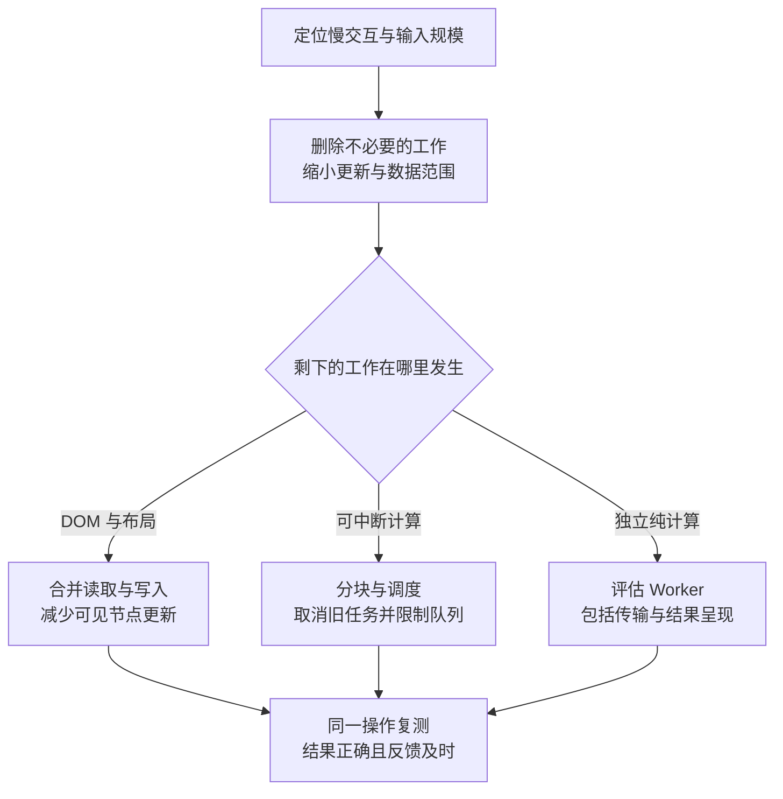

# 让页面及时回应，并让结果始终属于当前任务

## PERF-03 主线程、渲染、长任务与交互响应

用户输入新的搜索词，输入框却停了一下；结果出现时，又被上一次搜索覆盖。另一个页面没有任何超过 50 毫秒的任务，滚动和动画仍然不顺畅。

这些问题不能只靠“加一个异步”解决。主线程既要执行代码，也要为显示下一帧准备样式、布局和绘制。本篇先拆清输入到反馈的过程，再分别讨论减少工作、读写布局、调度、取消、Worker 和现场归因。

### 学习前先确认

- 直接前置：[PERF-01 Core Web Vitals 与性能预算](../chinese-guides/perf-01-core-web-vitals-performance-budgets.md#perf-01)。能区分 INP 的输入等待、处理与呈现，以及单次操作与跨访问统计。
- 直接前置：[BROWSER-02 观察器、调度与页面生命周期协作](../chinese-guides/browser-02-observers-scheduling-lifecycle-coordination.md#browser-02)。理解任务、微任务、帧机会和资源生命周期。

### 一、主线程为什么会挡住已经到达的输入

**主线程（Main Thread）**承担页面的大量脚本、事件回调、样式与布局等工作。同一条线程不能同时执行两个 JavaScript 调用栈。用户已经点击按钮，当前同步任务还没结束，回调就可能继续排队。

“网络是异步的”只说明等待网络时不用一直占着这条线程。响应到达后解析数据、创建对象、更新状态和渲染列表，仍可能产生大量主线程工作。将读取放入 async 函数，不会自动把之后的计算移到其他线程。

浏览器的渲染过程也不是每次赋值都立刻更新屏幕。代码连续改变十次进度值，如果一直不让出执行机会，用户可能只看见最终值。B25 的 [主线程观察实验](../chinese-guides/perf-01-core-web-vitals-performance-budgets.md#九亲眼观察一次长任务与分段任务)展示了这个现象；这里继续解决真实任务的取消和结果归属。

60Hz 显示器相邻刷新约隔 16.7 毫秒，120Hz 约隔 8.3 毫秒，但这不是 JavaScript 可以独占的预算。浏览器还需要完成其他工作；页面没有动画时，也不必为了“保持帧率”持续运行回调。

### 二、任务、微任务和帧机会不是三条并行队列

事件回调、定时器等工作会通过任务调度；Promise 回调等进入微任务检查点。微任务会继续处理新加入的微任务，因而一条不断延续的 Promise 链同样可能推迟渲染。

`await Promise.resolve()` 不代表把控制权稳定交给一次新的渲染机会。`setTimeout(..., 0)` 也不是立即执行，它安排后续任务，时间受队列、嵌套计时器和页面状态影响。它可以给浏览器安排其他工作的机会，却不保证每次等待都绘制一帧。

`requestAnimationFrame` 在相应渲染机会的绘制前运行，适合少量视觉更新。把 100 毫秒计算塞进去，仍会推迟这次画面。**调度（Scheduling）**只是安排工作何时执行，不会让工作本身消失。

| 方式 | 常见用途 | 不能由此保证 |
| --- | --- | --- |
| Promise 微任务 | 衔接已完成异步结果、框架批量更新 | 不保证让出渲染机会 |
| timer 或 `scheduler.yield()` | 把可中断工作放到后续任务 | 不保证固定延迟或每次必绘制 |
| `requestAnimationFrame` | 在帧边界附近合并少量视觉更新 | 不会自动把计算搬离主线程 |
| `requestIdleCallback` | 可推迟的低优先级工作 | 不保证很快获得充足空闲时间 |
| Worker | 可与 DOM 分离的计算 | 不会自动消除消息与呈现成本 |

### 三、先把一次慢交互分成三段

**输入延迟（Input Delay）**是输入到达后、相关处理开始前的等待；处理时长对应事件相关代码；呈现延迟则连接处理结束与下一次显示机会。三段需要不同证据。

假设输入发生在 100ms，回调到 180ms 才开始，220ms 结束，下一帧在 260ms 呈现。只给回调首尾计时会得到 40ms，用户等待却是 160ms。

```js example=thread-interaction-parts
const sample = { input: 100, processingStart: 180, processingEnd: 220, paint: 260 };
console.log(sample.processingStart - sample.input); // => 80
console.log(sample.processingEnd - sample.processingStart); // => 40
console.log(sample.paint - sample.processingEnd); // => 40
console.log(sample.paint - sample.input); // => 160
```

这是合成时间线，不是完整 INP 采集器。真实交互可能对应多个事件，框架更新也未必完整发生在一个监听器函数内。应在 Performance 的交互与主线程轨道中把整个过程连接起来。

输入延迟大，先查输入到达时正在运行什么；处理重，查计算、状态传播和 DOM 操作；呈现晚，查样式、布局、绘制及帧调度。不要看到按钮回调只有几行，就断言问题与这个操作无关。

### 四、Long Task 与 LoAF 从不同角度看占用

**长任务（Long Task）**指连续占用主线程超过 50 毫秒的任务。它能提示输入被推迟的风险，却不是流畅度合格线：连续几个 30～40 毫秒的任务，也可能让动画错过许多刷新机会。

**长动画帧（Long Animation Frame，LoAF）**围绕一帧观察超过 50 毫秒的工作，包括任务和后续渲染。`duration` 是帧的整体时长，`blockingDuration` 则按其阻塞计算规则估计输入等高优先级工作的等待风险，不能直接用 `duration - 50` 替代。

例如两个任务分别 60ms 和 80ms，后面有 10ms 渲染，整体约 150ms。按官方说明，把最终渲染计入最长任务再计算超出 50ms 的部分，阻塞量约为 `(60 - 50) + (80 + 10 - 50) = 50ms`，而不是 100ms。

LoAF 可能带脚本来源和强制样式/布局相关信息，但支持程度与跨源归因有边界。没有某类记录，不代表这类工作不存在；采集前检查支持情况。一个慢交互也可能跨多个帧，不应仅凭第一条 LoAF 就结束归因。

### 五、减少总工作量通常比更细的切片更划算

假设每输入一个字符都对十万条记录重新规范化、排序、筛选，再创建十万个 DOM 节点。把循环拆成小块可以改善反馈机会，但用户仍要等待大量本可避免的工作。

先问四件事：数据能否分页或按需取得；规范化能否在输入数据变化时做一次；排序是否真的随搜索词改变；视图是否只需要展示一小部分结果。数据模型、算法与呈现范围一起决定成本。

框架里一次局部输入若更新了很大的共享状态，会让无关消费者一起运行。先缩小状态传播和订阅范围，再评估 memo、缓存或编译优化。缓存也要有键、容量和失效，不然计算省下来了，内存却不断增长，见 [PERF-04 的缓存边界](../chinese-guides/perf-04-memory-listeners-resource-leaks.md#十缓存和弱引用解决不同的问题)。



### 六、布局读写交错为什么会放大成本

浏览器通常会合并多次样式修改后再计算布局。但在布局已经变脏时，代码又要求读取当前几何尺寸，浏览器可能必须先同步计算，才能给出正确数值。这就是 **强制同步布局（Forced Synchronous Layout）**常见的来源。

例如逐项执行“改变卡片宽度→读取卡片高度→调整下一项”，可能让每次读取都触发布局。若业务允许，应先一次性读取所需旧几何信息，再完成计算，最后批量写入；若必须读取修改后的几何结果，则把必要写入集中起来，再进行所需测量，而不是假装永远可以只读旧值。

`getBoundingClientRect()` 不是应该被禁用的 API。关键是调用时有没有待处理布局、调用多少次、依赖多少节点。可以在 trace 中查看强制重排提示与调用位置，再做单变量对照。

虚拟列表、`contain`、`content-visibility` 可以缩小布局或绘制工作，但会影响尺寸估计、焦点、可访问性或定位行为。一个搜索结果虽然不渲染全部节点，仍要保证键盘访问和滚动定位正确。布局约束本身的基础可回看 [WEB-02](../chinese-guides/web-02-layout-cascade-responsive-logical-properties.md#web-02)。

### 七、用可取消搜索看懂“最新任务获胜”

保存以下完整内容为 `search-slices.html`，在桌面浏览器打开。页面生成一组本地教学数据；可以先搜 React，再立即搜 CSS，或者在处理中取消。旧任务即使已经运行过一部分，也不能修改新任务的结果、进度和完成状态。

这里刻意每处理 1000 条让出一次任务，便于观察中断。分块数不是生产推荐值，不用本例耗时推断真实产品性能。

```html example=thread-search-page runtime=project file=search-slices.html
<!doctype html>
<html lang="zh-CN">
<meta charset="utf-8">
<title>可取消的分段搜索</title>
<style>
  body { max-width: 900px; margin: 48px auto; padding: 0 24px;
    font: 17px/1.8 system-ui; background: #f4f8f7; color: #163e35; }
  main { padding: 32px; background: white; border: 1px solid #d4e5df; border-radius: 18px; }
  h1 { font-size: 28px; }
  input, button { font: inherit; padding: 8px 14px; margin: 6px 8px 6px 0; }
  input { border: 1px solid #73958b; border-radius: 6px; max-width: 100%; box-sizing: border-box; }
  button { border: 1px solid #356b5c; border-radius: 6px; background: #eaf4ef; color: inherit; cursor: pointer; }
  :focus-visible { outline: 3px solid #c0781f; }
  progress { width: 100%; height: 24px; accent-color: #28785e; }
  pre { min-height: 180px; padding: 20px; background: #eef5f1; white-space: pre-wrap; }
</style>
<main>
  <p>本地教学数据 · 不发送网络请求</p>
  <h1>新搜索开始，旧结果就失去提交资格</h1>
  <form id="form">
    <label for="query">搜索词</label>
    <input id="query" value="React" maxlength="40">
    <button type="submit">开始搜索</button>
    <button id="cancel" type="button">取消当前搜索</button>
  </form>
  <label for="progress">当前任务进度</label>
  <progress id="progress" max="240000" value="0"></progress>
  <p id="status" role="status">等待搜索</p>
  <pre id="results" aria-label="搜索结果"></pre>
</main>
<script>
  const byId = (id) => document.getElementById(id);
  const topics = ['React', 'JavaScript', 'CSS'];
  const rows = Array.from({ length: 240000 }, (_, i) => ({
    title: `${topics[i % 3]} 资料 ${i}`, key: `${topics[i % 3]} 资料 ${i}`.toLowerCase()
  }));
  let active = null;
  let sequence = 0;
  const yieldTask = () => new Promise((resolve) => setTimeout(resolve, 0));
  byId('form').addEventListener('submit', async (event) => {
    event.preventDefault();
    active?.controller.abort();
    const task = { id: ++sequence, controller: new AbortController() };
    active = task;
    const query = byId('query').value.trim().toLowerCase();
    const signal = task.controller.signal;
    const current = () => active === task && !signal.aborted;
    byId('progress').value = 0;
    byId('results').textContent = '';
    byId('status').textContent = `任务 ${task.id}：正在搜索 ${query || '全部'}`;
    let matches = 0;
    const first = [];
    try {
      for (let start = 0; start < rows.length; start += 1000) {
        signal.throwIfAborted();
        const end = Math.min(start + 1000, rows.length);
        for (let i = start; i < end; i++) {
          if (rows[i].key.includes(query)) {
            matches++;
            if (first.length < 8) first.push(rows[i].title);
          }
        }
        if (current()) byId('progress').value = end;
        await yieldTask();
      }
      if (!current()) return;
      byId('results').textContent = first.join('\n');
      byId('status').textContent = `任务 ${task.id}：${query || '全部'} 找到 ${matches} 条，只显示前 8 条`;
    } catch (error) {
      if (active !== task) return;
      byId('status').textContent = signal.aborted ? `任务 ${task.id}：已取消` : '搜索失败，请重试';
    } finally {
      if (active === task) active = null;
    }
  });
  byId('cancel').addEventListener('click', () => {
    if (!active) return;
    const id = active.id;
    active.controller.abort();
    byId('status').textContent = `任务 ${id}：已取消`;
  });
</script>
</html>
```

React、JavaScript、CSS 各有 80,000 条。先提交 React，紧接着提交 CSS，最终标题、结果列表与数量都应属于 CSS。取消后，尚未触发的 timer 会完成这一次等待，随后检查到取消而退出；它不会同步抢占正在执行的一小段循环。

为什么 success、catch 和 finally 都检查身份？只防住成功写结果，旧任务的失败提示或 finally 仍可能清掉新任务的 loading 状态。**取消（Cancellation）**减少无用工作，任务身份决定谁有资格更新当前界面，两者各有作用。

### 八、分块还需要处理队列和中间状态

每段几毫秒并不是完整方案。如果每次按键都排一个搜索，输入速度长期大于处理速度，队列还是会越积越长。搜索通常可以淘汰旧输入或合并成最新输入；必须逐项执行的写入任务则需要限流、队列上限和可查询状态，不能随意丢弃。

切片会让其他操作插进来，因此中间状态要有意义。搜索可以显示已扫描数量，但不应把扫描中途的匹配数写成最终总数；批量编辑可以有进度，却不能让 UI 声称只完成一部分的事务已经整体成功。

按时间预算分块时，可检查 `performance.now()`，但一次单项处理本身若要 100ms，再小的外层预算也无法中断它。应先拆单项工作，或把适合的计算移到 Worker。`scheduler.yield()` 需要按支持情况渐进增强，fallback 只是替代调度途径，不保证同样的优先级语义。

防抖解决触发过密，不能解决最终任务本身很重；还会引入额外等待。选择前说明要减少多少次无效工作、保留怎样的及时反馈，而不是看到输入框就默认套固定延迟。

### 九、Worker 搬走计算，也引入了一份通信约定

**Web Worker**在独立线程运行脚本，不能直接操作页面 DOM。搜索索引、格式转换、压缩和部分解析可以适合它；布局测量与 DOM 创建仍留在主线程。

消息通常使用结构化克隆。对象很大、消息很频繁时，序列化与传输本身就可能抵消收益。对可转移的 ArrayBuffer，可以转移所有权，发送后原缓冲区会被分离；它不是“两边共享一份可随意修改的数据”。

```js example=thread-transfer-ownership
const original = new Uint8Array([10, 20, 30]);
const received = structuredClone(original, { transfer: [original.buffer] });
console.log(original.byteLength); // => 0
console.log(received.byteLength); // => 3
console.log(received[1]); // => 20
```

这个独立例子演示转移语义，没有启动 Worker。实际消息应带任务 ID、输入版本、结果或错误状态，接收端仍要拒绝过期结果。Worker 处理完十万条后，主线程一次性创建十万个节点，也会重新堵住页面。

取消消息不是抢占式中断：Worker 如果陷在一个长同步循环里，通常要先结束当前任务才有机会接收消息。可以在 Worker 内协作切片、检查取消状态，或者在任务边界明确时终止专用 Worker；`terminate()` 立即终止，不保证执行其清理或 finally，因此主线程必须自行结算等待中的任务并处理资源。共享 Worker 不能由一个消费者随意关掉。

### 十、绘制和合成也会成为瓶颈

布局决定几何，绘制准备内容，合成组合图层。`transform`、`opacity` 常能避开部分布局或绘制工作，但并非所有场景都能独立合成；图层太多、纹理很大或滤镜昂贵，仍有内存和处理成本。

`will-change` 是提示，不是给所有元素长期加上的加速许可证。适当提前启用、使用结束后移除，通常比让几百个卡片始终占用额外资源更可控。真正要判断是否减少了工作，应看绘制区域、图层和帧记录。

动画也要能被中断、取消和恢复，尊重减少动态效果偏好。优化不应去掉焦点提示、让关闭按钮暂时不可用，或在用户缩放后继续使用旧尺寸。

如果尺寸来自窗口或容器变化，应合并必要的测量，避免每次 resize 都遍历整棵树。响应式布局优先交给 CSS，测量回调只负责确实无法由样式表达的部分，见 [H5-01 的视口与内容约束](../chinese-guides/h5-01-viewport-responsive-safe-area-orientation.md#四响应式先说明哪些内容可以换行)。

### 十一、现场采集要轻，而且要知道看不到什么

PerformanceObserver 可以观察受支持的 event、longtask 或 long-animation-frame 条目。先检查 `supportedEntryTypes`，使用 `buffered` 时按单一 `type` 注册；不支持就标记缺失，不把它写成“零长任务”。

现场归因通常只需要有限的持续时间、事件类型、受控路由、公开版本和经过处理的来源信息。限制每次访问保存的条目数、采样和发送量，不上传用户输入或整个 DOM。为分析性能而持续序列化大型对象，可能自己制造新的问题。

同一页面或组件反复初始化时，应避免重复注册；所有者结束后断开观察器。共享观察器要由明确的服务管理订阅，不能每个组件都调用全局 disconnect。具体资源归属见 [PERF-04](../chinese-guides/perf-04-memory-listeners-resource-leaks.md#七用预览组件把创建和释放放在一起)。

还要区分用户行为造成的慢与采集缺失。跨源脚本归因受限、记录延迟和时间精度变化都可能影响结论。现场数据负责发现受影响的操作，再用受控的 trace 对准原因。

### 十二、从一条慢操作收敛到一次有依据的修改

先记录操作、数据规模、缓存状态、浏览器版本和录制范围。找到可见慢点，再看 Interactions、Main、Frames 与截图；火焰图宽说明时间消耗多，不自动证明这段代码可以删除。

可以做一个很小的对照：保持输入和数据不变，仅把重复规范化移到数据加载时；或者仅批量读写布局，再看同一区段是否缩短。不要同时换框架、改算法、开 Worker 又加缓存，最后只留下一个无法解释的“快了”。

除了时间，还核对任务结果、快速重试、取消、错误和焦点。一次搜索很快但返回了上次输入的结果，仍然是失败的优化。真实发布后按版本与路由观察影响，方法可回看 [OBS-01](../chinese-guides/obs-01-frontend-observability-slo-alerting-privacy.md#十二先验证观测链路再相信安静的面板)。

本篇实验可以证明本地切片与旧任务隔离的行为，不能替代目标产品的标准 INP 或全浏览器性能结论。把验证范围写清，比为每个小改动重复一整套跑分更有帮助。

### 带着问题回看

- 回调执行只要 20ms，为什么用户仍可能等 200ms 才看到反馈？
- 把循环改成连续的 `await Promise.resolve()`，是否稳定提供了绘制机会？
- 为什么旧任务的 finally 也必须检查身份？
- Worker 正在运行同步循环时，发送 cancel 消息为什么未必马上生效？

### 参考与延伸阅读

- [Chrome Performance](https://developer.chrome.com/docs/devtools/performance)：对照交互、主线程、帧与调用位置。
- [Chrome：Long Animation Frames](https://developer.chrome.com/docs/web-platform/long-animation-frames)：核对 duration、blockingDuration 和脚本归因。
- [web.dev：渲染性能](https://web.dev/articles/rendering-performance)：连接脚本、样式、布局、绘制和合成。
- [MDN：scheduler.yield](https://developer.mozilla.org/en-US/docs/Web/API/Scheduler/yield)：理解任务让出与支持条件。
- [MDN：可转移对象](https://developer.mozilla.org/en-US/docs/Web/API/Web_Workers_API/Transferable_objects)：查询缓冲区转移和分离语义。
- [MDN：Worker.terminate](https://developer.mozilla.org/en-US/docs/Web/API/Worker/terminate)：确认终止不等待 Worker 自行完成清理。
- [MDN：PerformanceObserver](https://developer.mozilla.org/en-US/docs/Web/API/PerformanceObserver)：查采集接口与生命周期。
