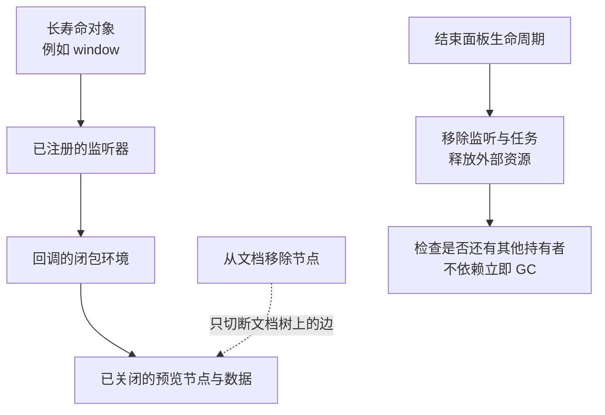

# 关闭界面以后，哪些东西还留在内存里

## PERF-04 内存、监听器与资源泄漏

一个资料预览面板第一次打开很顺畅，反复开关以后越来越慢。窗口缩放一次，日志却打印了十遍。另一边，应用加载几篇文章后内存上升，随后保持稳定，读者使用并没有异常。

这两种增长未必是同一种问题。本篇从对象为什么还活着讲起，连接堆快照、保留路径、监听器、闭包、计时器、媒体与缓存。重点是建立明确的资源所有权，并用同样的操作过程确认变化，而不是到处把变量设成 null。

### 学习前先确认

- 直接前置：[JS-03 类型、相等、复制与不可变](../chinese-guides/js-03-types-equality-copy-immutability.md#js-03)。理解对象身份与引用，同一个对象可以经由多条路径访问。
- 直接前置：[BROWSER-02 观察器、调度与页面生命周期协作](../chinese-guides/browser-02-observers-scheduling-lifecycle-coordination.md#browser-02)。知道资源的创建、暂停、恢复与最终结束是不同阶段。

### 一、增长、泄漏与频繁回收先分开

**内存泄漏（Memory Leak）**在这里指业务已经不再需要的对象或资源，因为仍被持有而没有结束应有生命周期。典型症状是反复执行同一操作并恢复到相同界面后，仍有越来越多旧对象留下。

内存膨胀可能来自合法但过量的活跃数据，例如同时保留几百张大图。频繁分配与回收则可能造成 GC 开销，即使最终没有遗留对象，也会影响响应。前者可能需要减少保留规模，后者可能需要减少临时分配，不能一律靠“加 cleanup”解决。

JS heap 不是浏览器总内存。DOM、图片解码、ArrayBuffer、媒体、GPU 和浏览器内部资源可能体现在不同统计中。任务管理器的总量与 Heap Snapshot 的大小不同，不一定是工具坏了。

先写出期望：“关闭预览后，本面板的监听、周期任务和临时图片 URL 都应停止；文章缓存可以保留最近五篇。”有了预期，才知道增长代表合理缓存还是失去控制。一个孤立的大数字，缺少时间与生命周期信息，无法单独证明泄漏。

### 二、垃圾回收看得到引用，看不懂业务已经结束

**垃圾回收（Garbage Collection，GC）**处理的是对象是否仍可达。引擎不会理解“用户已经关掉面板，所以这里的业务数据没用了”。如果全局监听器仍持有回调，而回调仍能访问面板节点，这条引用链就还在。

**可达性（Reachability）**可以理解为从引擎保留的根出发，是否还能沿引用找到对象。全局对象、正在执行的调用以及原生资源等，都可能参与让对象继续存活。



循环引用本身也不一定泄漏。两个对象互相引用，只要整组对象已无法从根到达，现代追踪式 GC 仍可以处理。真正要找的是不该存在的可达路径，而不是一看到环就手动拆开所有字段。

下面的例子没有控制 GC，只演示局部变量置空不会清除另一条强引用。

```js example=memory-another-reference
let preview = { title: '已经关闭的预览' };
const retained = new Map([['last', preview]]);
preview = null;
console.log(retained.get('last').title); // => 已经关闭的预览
retained.delete('last');
console.log(retained.size); // => 0
```

### 三、比较相同生命周期位置，才有意义

先热身一次，让模块、字体和必要缓存初始化。然后固定一个操作周期，例如打开预览、调整尺寸、关闭预览。每轮都回到同一位置，再比较对象数量、资源计数或快照。

不要拿“刚打开页面”和“正在播放视频”的内存直接比较后就宣布泄漏。它们本来承担不同工作。合理缓存可能先增长后稳定；遗留监听可能每轮多一个。趋势有助于发现候选，但仍需要查它实际保留了什么。

Chrome 的堆快照会触发相应的垃圾回收过程，以便观察仍存活的图。这个诊断动作不等于生产环境可以按业务时间要求对象马上回收。也不要把强制 GC 后总量稍微下降，当成问题已经解决。

工具本身可能影响结果。控制台打印并保留对象、选中的 DOM 元素、测试代码保存的元素句柄，都可能形成额外引用。诊断时用计数和标识记录过程，避免把被测大对象存进调试数组。

### 四、从浅大小走到真正的保留路径

**堆快照（Heap Snapshot）**记录某个时刻的对象关系。Summary 适合按类型查看，Comparison 用于比较快照，Retainers 帮助回溯是谁还持有目标对象。具体界面会随工具版本变化，但核心问题始终是“从哪里还能访问它”。

**浅大小（Shallow Size）**看对象自身占用，**保留大小（Retained Size）**考虑通过该对象独占保留的对象图。它不能简单把所有子对象相加，因为一些对象还可能被其他路径共享。

**支配关系（Dominator）**表示从根到目标的路径都必须经过某个对象。一个小回调可能间接保留一整棵节点树，因此浅大小很小，保留影响却很大。反过来，一个大缓存也可能是明确设计的活跃工作集，不能只按大小决定删除。

**保留路径（Retaining Path）**把症状连接到修复点。若看到 `window → listener → callback → panel`，应检查面板的监听清理；若是 `cache → item → panel`，则检查缓存归属与逐出。把 panel 的某个子字段置空，不代表其他路径已经消失。

分配时间线适合追“哪段操作创建了这些对象”；allocation sampling 开销较低，但提供的是抽样线索。不要混淆创建热点与泄漏根因：分配很多的函数不一定长期保留对象，长期保留对象的地方也可能没有大量分配。

### 五、移除监听需要同一个回调身份

两段长得一样的箭头函数，是两个不同的函数对象。`removeEventListener` 需要匹配目标、事件类型、回调身份和 capture 语义。passive 等其他选项不按同样方式决定移除匹配，但保持注册与清理选项清晰一致更易维护。

```js example=memory-listener-identity
const target = new EventTarget();
let calls = 0;
const onPulse = () => { calls++; };
target.addEventListener('pulse', onPulse);
target.removeEventListener('pulse', () => { calls++; });
target.dispatchEvent(new Event('pulse'));
console.log(calls); // => 1

target.removeEventListener('pulse', onPulse);
target.dispatchEvent(new Event('pulse'));
console.log(calls); // => 1
```

第一次清理失败，回调仍被调用；第二次使用原引用，才真正移除。这里用 EventTarget 演示身份规则，没有创建 DOM，也没有测量内存回收时刻。

可以用一个 AbortController 管理同一组件拥有的一组监听，但 `abort()` 不会自动关闭定时器、撤销 Object URL 或销毁所有第三方对象。它只影响接入这个 signal 的操作。`once: true` 也不等于生命周期清理：如果事件一直没发生，监听仍可能保留。

长期存在的根监听或事件委托可以是合理设计。判断标准不是页面上必须“零监听”，而是面板结束后不应继续增加它独占的旧状态。

### 六、闭包、Promise 和分离节点要一起追

闭包让函数访问创建时的环境，因此长寿命回调可能间接保留状态。不能泛化成“所有闭包都有泄漏”，也不能反过来假设引擎一定会替你精确裁掉所有无用变量。明确捕获需要的小值，结束订阅与任务，比猜优化细节可靠。

**分离节点（Detached DOM）**已经不在文档树中，却可能仍被 JavaScript 或其他对象持有。`element.remove()` 只改变树关系，不会自动清理全局监听、数组缓存或插件内部引用。节点自身和自身监听形成一个无法从根访问的整体，也不必然泄漏；要看外部保留路径。

Promise 尚未完成，不意味着它必然永久存活。要看是谁持有它、异步操作和回调。反过来，真实在途请求、全局任务队列或永不清空的订阅表，可能确实延长状态寿命。

取消 fetch 后，之前已注册或已进入队列的逻辑仍需要正确的身份判断；成功、失败和 finally 都不应修改下一次任务。可以回看 [PERF-03 的可取消搜索](../chinese-guides/perf-03-main-thread-rendering-long-tasks-inp.md#七用可取消搜索看懂最新任务获胜)。

### 七、用预览组件把创建和释放放在一起

保存为 `preview-lifecycle.html` 后直接打开。每次预览拥有一个全局尺寸监听、一个定时器和一个 Blob URL；关闭时分别释放，再移除节点。面板上的计数仅代表本例登记的资源，不是浏览器内部所有资源的统计。

```html example=memory-preview-page runtime=project file=preview-lifecycle.html
<!doctype html>
<html lang="zh-CN">
<meta charset="utf-8">
<title>预览的资源生命周期</title>
<style>
  body { max-width: 920px; margin: 48px auto; padding: 0 24px;
    font: 17px/1.8 system-ui; color: #253c56; background: #f5f7fb; }
  main { padding: 32px; border: 1px solid #dce3ef; background: white; border-radius: 18px; }
  h1 { font-size: 28px; }
  button { font: inherit; padding: 9px 16px; margin: 5px 8px 5px 0;
    border: 1px solid #496787; border-radius: 7px; background: #eff4fc; color: inherit; cursor: pointer; }
  :focus-visible { outline: 3px solid #bd7424; }
  pre { padding: 18px; background: #eff3fa; white-space: pre-wrap; }
  #host { min-height: 260px; border-block-start: 1px solid #dce3ef; padding-top: 18px; }
  img { display: block; max-width: 100%; width: 360px; height: auto; }
</style>
<main>
  <p>生命周期实验 · 所有内容仅在本页生成</p>
  <h1>关闭面板，也结束它拥有的资源</h1>
  <button id="open">打开或替换预览</button>
  <button id="close">关闭预览</button>
  <button id="pulse">模拟一次尺寸事件</button>
  <pre id="counts" aria-label="本例登记的资源计数"></pre>
  <p id="status" role="status">尚未打开预览</p>
  <section id="host" aria-label="预览区域"></section>
</main>
<script>
  const byId = (id) => document.getElementById(id);
  const counts = { listeners: 0, timers: 0, objectURLs: 0, resizeCalls: 0, timerCalls: 0 };
  const report = () => { byId('counts').textContent = JSON.stringify(counts, null, 2); };
  let stopPreview = null;
  function createPreview() {
    const panel = document.createElement('article');
    const image = document.createElement('img');
    image.alt = '本地生成的蓝色资料预览占位图';
    const note = document.createElement('p');
    note.textContent = '这份预览拥有自己的监听、计时器和临时图片地址。';
    panel.append(image, note);
    byId('host').append(panel);
    const blob = new Blob(['<svg xmlns="http://www.w3.org/2000/svg" width="360" height="120"><rect width="360" height="120" rx="16" fill="#dce9f7"/><text x="28" y="70" font-size="28" fill="#254d73">Local preview</text></svg>'], { type: 'image/svg+xml' });
    const url = URL.createObjectURL(blob);
    image.src = url;
    counts.objectURLs++;
    const controller = new AbortController();
    let disposed = false;
    window.addEventListener('resize', () => {
      if (disposed) return;
      counts.resizeCalls++;
      note.textContent = `尺寸事件已处理，预览宽度 ${Math.round(panel.getBoundingClientRect().width)}px`;
      report();
    }, { signal: controller.signal });
    counts.listeners++;
    const timer = setInterval(() => {
      if (disposed) return;
      counts.timerCalls++;
      report();
    }, 250);
    counts.timers++;
    report();
    return () => {
      if (disposed) return;
      disposed = true;
      controller.abort(); counts.listeners--;
      clearInterval(timer); counts.timers--;
      image.removeAttribute('src');
      URL.revokeObjectURL(url); counts.objectURLs--;
      panel.remove();
      report();
    };
  }
  function closePreview() {
    const dispose = stopPreview;
    stopPreview = null; // 页面不再持有这份预览的清理闭包。
    dispose?.();
    byId('status').textContent = '预览已关闭，本例的活动资源已释放';
  }
  byId('open').addEventListener('click', () => {
    closePreview();
    stopPreview = createPreview();
    byId('status').textContent = '预览已打开';
  });
  byId('close').addEventListener('click', closePreview);
  byId('pulse').addEventListener('click', () => window.dispatchEvent(new Event('resize')));
  window.addEventListener('pagehide', closePreview);
  report();
</script>
</html>
```

打开时前三项计数为 1；再次打开会先释放旧预览，因此仍为 1，而不是增长到 2。关闭后前三项为 0，再模拟尺寸事件或等待片刻，回调累计次数应保持不变。多次关闭也不应减成负数，这体现了清理的幂等性。

代码故意让页面结束持有清理闭包：如果把每次 dispose 都存进一个永不清空的调试数组，那个数组本身可能延长节点与环境的寿命。`pagehide` 在此选择关闭可重新打开的临时预览；若从 bfcache 返回，需要重新打开，不把它当作仍在运行的面板。

计数回零证明本例走到了显式释放路径，不能证明整个页面已经没有泄漏，也不能证明内存立刻归还操作系统。要确认实际对象保留，还需快照与相同周期的证据。

### 八、定时器和观察器不要在清理后复活

递归 timeout、rAF、idle callback 与各种观察器都可能让回调或目标继续被持有。记录句柄，在所有者结束时 clear、cancel、disconnect；如果回调里还会安排下一次，也要检查结束标志，防止旧回调重新注册。

IntersectionObserver、ResizeObserver 等若被多组件共享，单个组件通常应取消自己观察的目标，而不是 disconnect 整个共享实例。独占观察器则可以随组件整体结束。选择哪种模式，在创建处就应明确。

后台节流、页面冻结和恢复会改变回调时刻，不能假设计时器恰好每秒执行。页面进入 bfcache 后也不是正常持续运行，应按业务需要暂停、关闭或恢复资源。缓存恢复的背景见 [PERF-02](../chinese-guides/perf-02-network-resource-loading-cache-optimization.md#十返回页面时先分清是哪一层恢复)。

不要用额外的高频“清理轮询”弥补归属不清。尽量让创建返回 disposer，让调用者在明确边界结束它，资源清单比散落的补丁更好读。

### 九、Object URL 与媒体资源不只占 JS 堆

**Object URL**把一个 Blob 暴露为可供浏览器消费的临时地址。它被创建后，需要在不再使用时撤销。替换预览时，结束旧资源的使用，再撤销旧地址；不能在用户仍需要查看、另存或复用时过早收回。

下载场景的消费时机与图片预览不同，不能统一写成“调用 click 后立刻 revoke 就永远安全”。要依据使用方式和目标浏览器确定何时结束，避免为了释放得快反而让下载失败。

摄像头与麦克风流需要按所有权停止轨道；AudioContext、解码器、图像位图、WebGL 资源等各有适当的关闭或删除 API。隐藏播放器、移除 canvas 或停止更新 UI，不意味着底层资源已结束。

Worker、WebSocket、BroadcastChannel 和消息端口也应进入清单。共享连接要由共享服务管理最后一个使用者的退出，不能一个浮层关闭就切断全站连接。实时连接的生命周期见 [REALTIME-01](../chinese-guides/realtime-01-sse-websocket-webtransport-reliability.md#realtime-01)。

### 十、缓存和弱引用解决不同的问题

没有容量上限的 Map 可能导致内存膨胀，但不能仅因它是 Map 就断言泄漏。应说明缓存对象是否仍有业务价值、最大条目或字节、有效期和身份切换规则。缓存文章与缓存账户权限不是同一类生命周期。

下面实现一个只按条目数限制的简化 **LRU（Least Recently Used）**：读取会把条目移到最近使用的位置，写入超过容量时逐出最久未用的条目。

```js example=memory-bounded-cache
class RecentCache {
  constructor(limit) {
    if (!Number.isInteger(limit) || limit < 1) throw new RangeError('invalid limit');
    this.limit = limit;
    this.items = new Map();
  }
  get(key) {
    if (!this.items.has(key)) return undefined;
    const value = this.items.get(key);
    this.items.delete(key);
    this.items.set(key, value);
    return value;
  }
  set(key, value) {
    this.items.delete(key);
    this.items.set(key, value);
    if (this.items.size > this.limit) this.items.delete(this.items.keys().next().value);
  }
}
const cache = new RecentCache(2);
cache.set('A', '文章 A'); cache.set('B', '文章 B');
cache.get('A');
cache.set('C', '文章 C');
console.log(cache.get('B')); // => undefined
console.log([...cache.items.keys()].join(',')); // => A,C
```

最多两个条目，不等于最多两兆内存；值的大小可以完全不同。本例没有 TTL、字节限制、身份隔离或外部资源析构。若缓存值持有 Object URL 或连接，逐出时还要执行属于它的释放流程。

WeakMap 的键不会仅因为作为弱键就被它强行保活，适合把辅助信息关联到对象，但不提供可枚举的容量管理。WeakRef 与 FinalizationRegistry 不保证何时回收或执行回调，不能承担关摄像头、提交写入或删除秘密等确定性职责。显式 dispose 仍是业务资源管理的基础。

### 十一、框架生命周期要区分暂停和最终销毁

React Effect、Vue 生命周期或自定义组件都需要对称地创建与清理资源。依赖变化会结束旧一轮副作用，再启动新一轮；开发模式额外执行 setup/cleanup，可以帮助发现不对称，但不能用“开发模式才会重复”掩盖缺陷。

路由缓存、KeepAlive、离屏树和弹层隐藏可能只让组件停用，并未卸载。可以按资源需要区分 active、paused、disposed：停止不可见的高频工作，保留可恢复状态，最终销毁时释放独占资源。不要机械地把所有停用都当销毁，也不要只等 unmount 才停止昂贵轮询。

第三方编辑器、图表和播放器通常有自己的 destroy 或 dispose。封装层应该明确谁调用它、异常时如何清理、共享实例怎样退出。对于没有可靠释放能力的依赖，隔离或替换可能比反复清空 DOM 更有效。

数据读取也要与身份和缓存键一起结束。组件关闭后其结果是否还进入共享缓存，要由数据层规则决定，而不是由一个组件顺手清空其他人的缓存。相关职责见 [DATA-01](../chinese-guides/data-01-server-state-cache-keys-invalidation-deduplication.md#data-01)。

### 十二、修复后回答对象为什么不再留下

一份有说服力的记录可以是：“预览关闭后，旧 resize 回调仍通过 window 保留 panel；改为所有者 signal 后，相同开关周期不再累加回调，快照里该路径消失，预览功能仍正常。”它同时包含生命周期、保留原因、修复点和行为结果。

无需每次内容修改都长时间录制整个应用。对实际内存故障，先用资源计数或重复回调缩小对象，再抓对应快照和路径；对释放模式的教学示例，明确它验证的是释放动作，不夸成完整泄漏审计。

生产观察可以关注版本、会话长度、任务轮次与粗粒度内存趋势，不应默认上传整个 heap。快照可能包含文章、输入、凭据与其他运行内容，应在受控环境使用代表数据。

如果某条路径仍无法解释，曲线暂时平稳也不能替代说明。最终目标是让对象和外部资源的寿命都与任务相符，并让下一位维护者能从创建处找到结束方式。

### 带着问题回看

- 关闭面板并把局部变量设为 null，为什么旧节点仍可能存活？
- 两个长得一样的箭头函数，为什么不能互相完成监听移除？
- 资源计数为零与堆快照没有遗留路径，分别证明了什么？
- LRU 限制了条目数量，为什么还可能需要字节预算和逐出清理？

### 参考与延伸阅读

- [Chrome：内存问题](https://developer.chrome.com/docs/devtools/memory-problems)：区分增长趋势、膨胀和频繁回收。
- [Chrome：Heap Snapshot](https://developer.chrome.com/docs/devtools/memory-problems/heap-snapshots)：查询快照、对比和保留关系。
- [MDN：内存管理](https://developer.mozilla.org/en-US/docs/Web/JavaScript/Guide/Memory_management)：理解可达性、弱引用与回收限制。
- [MDN：removeEventListener](https://developer.mozilla.org/en-US/docs/Web/API/EventTarget/removeEventListener)：核对回调身份与 capture 匹配。
- [MDN：revokeObjectURL](https://developer.mozilla.org/en-US/docs/Web/API/URL/revokeObjectURL_static)：查询临时地址释放。
- [MDN：FinalizationRegistry](https://developer.mozilla.org/en-US/docs/Web/JavaScript/Reference/Global_Objects/FinalizationRegistry)：理解不能依赖终结回调及时执行的原因。
