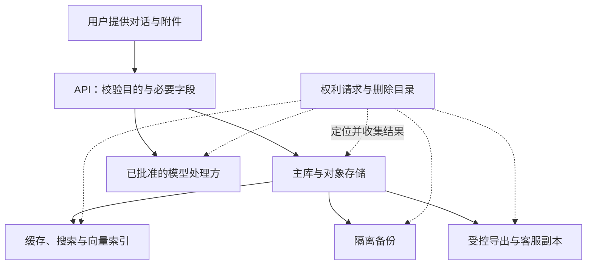

# 隐私工程知识点讲义

## PRIVACY-01 数据最小化、同意、留存与用户权利

林把一段对话和附件交给 AI 助手，希望得到回答。内容随后可能进入主库、短期缓存、搜索索引、模型供应商和备份。一个月后林点击删除，如果页面只删掉了对话列表里的卡片，数据真的结束了生命周期吗？

本讲用这条数据路径理解目的、收集、选择、保留和删除。文中的 30 天、7 天等数字是教学产品的假设，不是法律统一期限；具体适用依据和例外应由负责隐私与法务的人员确认，工程实现负责准确执行并提供证据。

### 学习前先确认

- 无直接前置。本讲从一项具体功能需要哪些数据开始，逐步连接界面选择、服务端规则与下游副本。

读完应能为字段写出明确用途，解释撤回后队列该怎样处理，并区分“主库已删”“下游待确认”和“所有范围已完成”。

### 一、先描述处理活动，再列数据库字段

**处理活动（Processing Activity）**可以用一句话写清：“为让登录用户跨设备继续最近的对话，保存账号关联与对话内容，自最后一次活动起保留 30 天。”

这句话能约束设计；“改善体验”却无法判断是否需要完整附件、精确位置或永久历史。一个字段存在于数据库，只说明技术上能取到，不说明每个团队都能用它。

| 处理活动 | 所需数据 | 用途边界 | 教学期限与负责人 |
| --- | --- | --- | --- |
| 继续对话 | 内部账号 ID、对话内容、活动时间 | 向本人展示历史 | 最后活动起 30 天；对话服务 |
| 临时检索 | 被选资料的片段与索引关联 | 回答当前问题 | 缓存 7 天；检索服务 |
| 可选故障诊断 | 错误分类、版本、耗时区间 | 排查这次功能异常 | 7 天；质量负责人 |
| 权利请求 | 请求编号、范围、执行结果 | 完成与证明请求处理 | 按已确认规则；隐私运营 |

**目的限制（Purpose Limitation）**要求处理围绕明确用途进行。为了回答问题提供的数据，不自动变成营销、训练通用模型或长期记忆的素材。新增用途意味着重新检查依据、数据范围、告知、接收方与退出方式。

### 二、最小化先问不收集还能不能完成任务

**数据最小化（Data Minimization）**发生在采集前。排查一次页面超时，通常先看错误码与耗时分组，未必需要整份对话或完整 URL。

下面从内部事件显式创建有限诊断记录；即使原对象里有文本与签名链接，也不会被顺手展开进去。

```ts example=privacy01-projection
type RawEvent = {
  feature: 'search' | 'chat'; elapsedMs: number;
  code: 'TIMEOUT' | 'NETWORK'; prompt: string; attachmentUrl: string;
};
function diagnostic(event: RawEvent) {
  return {
    feature: event.feature,
    code: event.code,
    latency: event.elapsedMs < 1000 ? 'under-1s' : 'at-least-1s',
  };
}
const result = diagnostic({
  feature: 'chat', elapsedMs: 1800, code: 'TIMEOUT',
  prompt: '仅用于教学的私人文字',
  attachmentUrl: 'https://files.example/a?signature=demo',
});
console.log(JSON.stringify(result)); // => {"feature":"chat","code":"TIMEOUT","latency":"at-least-1s"}
console.log('prompt' in result, 'attachmentUrl' in result); // => false false
```

这里展示字段投影，假设内部事件已完成校验；它不证明这些保留字段在所有产品里都必要或匿名。来自外部的值先经过[TS-07 的运行时校验](../chinese-guides/ts-07-runtime-contracts-validation-error-models.md#ts-07)。

审阅一个新字段时，可以问：去掉它，具体哪个功能无法完成？能否只在本地计算、降低精度、按需收集、缩短保留或使用抽样？“以后可能有用”不能替代清楚的目的。

### 三、哈希、向量和摘要不自动等于匿名

**假名化（Pseudonymization）**通过替换标识降低直接暴露，例如把邮箱换成内部 ID，但保留映射或其他可关联线索。**匿名化（Anonymization）**对重新识别风险有更严格要求，不能仅凭字段外观看不懂来认定。

把邮箱做固定哈希，仍可能与已知邮箱列表对应；把文本转成 embedding，仍可能通过检索关联原文或个人；摘要可能保留姓名、病史或工作经历。日志中的 requestId 也可能经另一张表找到账号。

因此数据清单需要记录派生关系。删除对话 chat-7 时，哪些摘要、切片、向量和导出文件来自它？如果没有关联标识，之后就很难准确定位需要处理的副本。关联目录本身也应最小化，避免为追踪而再建一份完整内容仓库。

加密与访问控制降低泄露风险，但不回答为什么收集、能保留多久、谁有权改变用途。安全措施与隐私目的需要同时成立。

### 四、处理依据与用户选择是不同字段

并非所有处理都以同意作为依据。合同履行、法定义务等是否适用，要结合地区、主体、数据和目的确定。工程系统保存经确认的依据、适用条件和复核版本，不能把所有活动都伪装成“用户点了同意”。

对于确实依赖同意的可选诊断，本讲采用明确规则：默认不启用，可以拒绝，可以方便撤回，拒绝后仍能阅读资料。接受服务条款不等于授权所有后续用途。

依据、告知与同意应分别记录。例如依据不需要同意，不代表可以跳过适用告知；已同意诊断，也不代表同意把附件发送给新增供应商。目的或接收方发生重要变化，要重新核对原选择覆盖什么。

中国个人信息保护法和欧盟 GDPR 对处理依据、权利及例外的规定并不完全相同；不要把某一地区的术语表机械用到所有服务。法律原文入口见文末，具体适用结论与工程示例分开保存。

### 五、撤回要让已经排队的任务重新检查

同意至少需要主体、目的、告知版本、选择状态、时间和来源。只存 consent=true，无法知道是为哪件事、看过哪个说明作出的选择。

下面用选择版本阻止旧事件在撤回后继续处理，也避免“撤回后重新同意”让旧队列自动复活。发送仅通过一个内存数组模拟，不发真实请求。

```js example=privacy01-consent-queue
let choice = { enabled: false, revision: 0 };
const queue = [];
const accepted = [];
function setChoice(enabled) {
  choice = { enabled, revision: choice.revision + 1 };
}
function collect(code) {
  if (!choice.enabled) return 'NOT_COLLECTED';
  queue.push({ code, purpose: 'diagnostics', revision: choice.revision });
  return 'QUEUED';
}
function drain() {
  for (const event of queue.splice(0)) {
    if (choice.enabled && event.revision === choice.revision) accepted.push(event.code);
  }
}
console.log(collect('TIMEOUT')); // => NOT_COLLECTED
setChoice(true);
console.log(collect('NETWORK')); // => QUEUED
setChoice(false); // 撤回
setChoice(true);  // 新选择不追认旧版本事件
drain();
console.log(accepted.length); // => 0
console.log(collect('TIMEOUT')); // => QUEUED
drain();
console.log(accepted.join(',')); // => TIMEOUT
```

真实系统应在采集入口和执行处读取服务端权威状态；同意变更、队列领取与数据发送之间仍需处理竞态。浏览器开关控制不了旧客户端、后台任务和供应商，不能只靠前端清空数组。

撤回停止依赖该同意的未来处理，既有数据如何删除或限制用途要按相应依据与义务执行。它不等于让所有过去的处理自动失效，也不应被解释为可继续所有旧用途。

### 六、把重要说明放在用户作决定的位置

好的告知能让人读完后知道什么会发生。例如诊断选项可以写：

> 允许发送错误类型、应用版本和耗时分组，用于排查故障，最多保留 7 天。不包含对话原文与附件。关闭后仍可正常使用，可随时在隐私设置撤回。

这只是教学产品的文案假设，实现必须确实做到不采集原文。详细说明再交代处理主体、接收方、权利与联系渠道，不能把关键后果藏在难找的政策页面里。

“暂不启用”和“启用诊断”应同样容易找到，默认不开启。保存选择失败时显示待重试，不把界面切换当成服务器已经记录。启用之前不要初始化会自行发送数据的分析 SDK；并不是隐藏按钮就能阻止后台请求。

用户上传附件、打开长期记忆或选择外部推理服务时，需要在数据离开预期边界之前说明相关用途。一个全局弹窗无法替代所有场景中的必要说明。

### 七、数据地图要画到索引、客服和供应商



每条边记录数据类别、目的、接收方、地区、期限和负责人。每个副本要能解释为什么存在、谁能访问，以及删除任务如何找到它。

地图应与真实事件目录、存储桶、队列、供应商配置对账。新增一个客服导出功能，也是在新增副本；导出文件的下载权限、到期和权利请求传播必须随之补齐。

访问不是只有读写权限。客服排错、模型推理和营销分析即使都只读同一字段，也有不同目的。服务端和数据平台要落实最小权限、临时授权和必要审计，不能让“有只读账号”成为任意使用数据的理由。

### 八、保留规则需要起点、期限、例外和到期动作

“保存 30 天”还不完整：从创建起，还是最后一次活动起？到期是删除正文、限制使用，还是只清理缓存？有明确保全依据时由谁审批？

```js example=privacy01-retention
const day = 24 * 60 * 60 * 1000;
function expired(lastActivity, now) {
  return now >= lastActivity + 30 * day;
}
const start = Date.UTC(2026, 8, 1);
console.log(expired(start, start + 29 * day)); // => false
console.log(expired(start, start + 30 * day)); // => true
```

这是按 UTC 经过时长计算的教学规则。如果业务按自然日计算，时区和边界需另行定义。不要在各个前端页面分别计算后当作权威删除决定。

常见规则应写清：对话的最后活动起算、缓存自身创建起算、索引跟随源数据删除、备份按约定周期淘汰。TTL 配置存在不等于任务已执行；需要知道失败积压和实际最长滞后。依法或依约暂不能删除的范围，进入受限保留并记录理由、权限与重新评估时间，不能继续用于所有分析。

### 九、运行删除观察页，看见部分成功为什么不是完成

把下列内容保存为 index.html，用桌面浏览器打开即可。页面没有网络请求，只使用合成元数据模拟五类副本；“已处理”和“供应商回执”都是教学状态，不代表真实删除证据。

```html example=privacy01-deletion-page runtime=project file=index.html
<!doctype html>
<html lang="zh-CN">
<meta charset="utf-8">
<title>一次删除如何走到所有副本</title>
<style>
  * { box-sizing: border-box; }
  body { max-width: 1080px; margin: 40px auto; padding: 0 24px; background: #f3f6fa; color: #243349; font: 16px/1.75 "Segoe UI","Microsoft YaHei",sans-serif; }
  main { padding: 30px; background: white; border-radius: 18px; }
  h1 { margin: 0; } .hint { color: #526478; }
  .controls { display: flex; gap: 10px; flex-wrap: wrap; margin: 20px 0; }
  button { font: inherit; padding: 8px 14px; cursor: pointer; border: 1px solid #aebed0; border-radius: 8px; background: #eff5ff; }
  button:focus-visible { outline: 3px solid #526ed0; outline-offset: 3px; }
  table { width: 100%; border-collapse: collapse; }
  th, td { text-align: left; padding: 12px; border-bottom: 1px solid #e0e6ef; }
  #summary { font-size: 18px; font-weight: 650; padding: 16px; background: #eef5f2; border-radius: 10px; }
  #result { min-height: 32px; }
</style>
<main>
  <p class="hint">PRIVACY-01 · 只处理合成元数据的本地模拟</p>
  <h1>主库删了，为什么还在等待</h1>
  <p>对象 chat-demo-7：没有真实对话正文。模拟供应商一次失败，再观察重试与备份淘汰。</p>
  <div class="controls">
    <button id="start">发起删除</button><button id="run">执行在线删除</button>
    <button id="retry">重试供应商</button><button id="expire">模拟备份到期</button>
    <button id="restore">演练备份恢复</button><button id="reset">重置</button>
  </div>
  <p id="summary" role="status" aria-live="polite"></p>
  <table><thead><tr><th scope="col">副本</th><th scope="col">当前结果</th><th scope="col">负责人</th></tr></thead><tbody id="rows"></tbody></table>
  <p id="result" role="status" aria-live="polite"></p>
  <p class="hint">恢复前先应用删除墓碑；供应商失败或备份未到期时，都不能宣称全部完成。</p>
</main>
<script>
const $ = id => document.getElementById(id);
const metadata = [
  ['主库', '对话服务'], ['缓存', '缓存服务'], ['搜索索引', '检索服务'],
  ['供应商', '供应商对接人'], ['隔离备份', '恢复负责人'],
];
let requested = false, states = [], tombstones = new Set();
const objectId = 'chat-demo-7';
const labels = { present: '存在', pending: '待处理', removed: '已删除', failed: '失败，待重试', waiting: '隔离保存，待到期', expired: '已到期淘汰' };
function render() {
  $('rows').replaceChildren();
  metadata.forEach(([name, owner], index) => {
    const row = document.createElement('tr');
    for (const text of [name, labels[states[index]], owner]) {
      const cell = document.createElement('td'); cell.textContent = text; row.append(cell);
    }
    $('rows').append(row);
  });
  const all = states.slice(0, 4).every(value => value === 'removed') && states[4] === 'expired';
  $('summary').textContent = !requested ? '尚未发起删除'
    : all ? '全部演示范围已完成' : '删除处理中：仍有副本等待确认或淘汰';
}
function reset() {
  requested = false; states = Array(5).fill('present'); tombstones = new Set();
  $('result').textContent = '可先恢复一次，再发起删除观察差别。'; render();
}
$('start').onclick = () => {
  if (requested) { $('result').textContent = '沿用同一请求，不重置已完成结果'; return; }
  requested = true; tombstones.add(objectId); states = ['pending','pending','pending','pending','waiting'];
  $('result').textContent = '已建立删除任务与最小墓碑，阻止旧对象重新发布'; render();
};
$('run').onclick = () => {
  if (!requested) { $('result').textContent = '请先发起删除'; return; }
  for (let i = 0; i < 3; i++) states[i] = 'removed';
  if (states[3] !== 'removed') states[3] = 'failed';
  $('result').textContent = states[3] === 'removed' ? '三个在线副本已完成；供应商已有成功回执' : '本次三个在线副本完成；供应商的模拟请求失败'; render();
};
$('retry').onclick = () => {
  if (!requested) { $('result').textContent = '请先发起删除'; return; }
  states[3] = 'removed'; $('result').textContent = '收到模拟供应商回执'; render();
};
$('expire').onclick = () => {
  if (!requested) { $('result').textContent = '请先发起删除'; return; }
  states[4] = 'expired'; $('result').textContent = '模拟隔离备份按保留规则淘汰'; render();
};
$('restore').onclick = () => {
  const recovered = states[4] === 'expired' ? [] : [{ objectId, subject: 'demo-lin' }];
  const publishable = recovered.filter(record => !tombstones.has(record.objectId));
  $('result').textContent = '可重新发布的对象数：' + publishable.length;
};
$('reset').onclick = reset;
reset();
</script>
</html>
```

先点击恢复，能看到 1 个可发布对象；发起删除后再恢复，应变成 0。执行在线删除后，供应商失败、备份等待，摘要仍是处理中。供应商重试成功后也未完成；备份到期后才显示全部演示范围完成。重复发起同一请求不应把已完成步骤退回待处理。

真实工作流需要稳定请求编号、范围快照、可重试消费者、回执、告警和负责人。外部超时不能当成功，也不能无限静默重试。任务记录只保留执行必要元数据，不能为证明删除再复制原始对话。

### 十、备份恢复要先尊重当前删除状态

**删除墓碑（Deletion Tombstone）**是最小控制记录，表示某对象不应再次被导入或发布。它保存对象标识与必要版本等信息，不保存被删正文；它本身也有权限和保留边界。

如果不可逐条修改的备份按周期淘汰，应明确隔离、停止其他用途以及恢复前的处理顺序：恢复到受控环境 → 应用最新删除和限制记录 → 核对结果 → 开放业务。不能恢复旧备份时顺便把过去的同意状态也倒退。

墓碑保留时间应覆盖可能重放的备份、消息和导出路径，并结合身份标识复用风险制定规则。只让墓碑比主库记录多活一天，没有覆盖最旧备份，就仍可能复活。多个区域的传播见[PRIVACY-02](../chinese-guides/privacy-02-cross-region-classification-engineering-controls.md#privacy-02)。

产品的进度说明应区分在线副本完成、供应商处理中、隔离备份等待淘汰与适用的受限保留。不能声称“所有介质立即物理消失”，也不能把备份当作永久保留的借口。

### 十一、导出、更正、限制与删除分别设计

导出是向有权取得数据的人提供适当范围的副本；删除改变后续保存与使用；更正还可能需要更新派生显示；限制处理则可能保留数据但禁止某些用途。它们不该全映射成一个 delete 按钮。

```ts example=privacy01-export
type Row = { subject: string; title: string; text: string; internalRisk: string };
const rows: Row[] = [
  { subject: 'lin', title: '第一条', text: '教学内容', internalRisk: '内部示例' },
  { subject: 'zhou', title: '别人的资料', text: '不应导出', internalRisk: '内部示例' },
];
function exportOwn(authenticatedSubject: string) {
  return rows.filter(row => row.subject === authenticatedSubject)
    .map(row => ({ title: row.title, text: row.text }));
}
console.log(JSON.stringify(exportOwn('lin'))); // => [{"title":"第一条","text":"教学内容"}]
```

authenticatedSubject 在正式服务里来自可信会话，不能由请求参数任意指定。例子说明范围过滤和字段投影；具体哪些数据应提供、哪些例外适用，要按权利请求确认，不是只导出 UI 当前能看见的两列。

验证身份要与风险相称：已有会话可要求近期认证，不应为了普通退出或简单请求额外索取原本不持有的证件。导出使用受控、短期下载链接并限制访问；链接本身可能是凭证，不能进入分析日志。可回看[会话与授权的区别](../chinese-guides/identity-01-session-cookie-token-browser-boundaries.md#一认证会话与授权回答三个问题)。

### 十二、供应商与 AI 用途也要能停止和退出

模型输入、回答、长期记忆、检索索引、提示缓存、人工评审、评估集和训练集是不同处理活动。用户请求一次回答，不能被解释为同时允许所有这些用途。

供应商台账要记录实际区域、子处理方、默认留存、是否用于训练、访问方式和删除能力。合同承诺应对应到控制台设置、API、审计或工单回执；无法自动删除时，明确谁跟进和何时升级。更换供应商还需处理旧副本、旧密钥、SDK 与公开告知。

如果某种训练路径无法兑现所需退出或删除能力，应在采集和设计阶段解决，而不是在用户提出请求时才告知“模型不能回滚”。上下文构建也应只选当前任务必需的资料片段，减少无关内容外发。

交付一项功能时，可以检查四个可观察结果：拒绝可选处理时没有相应采集；撤回后排队任务不再执行；导出不混入他人内容；删除任务未拿齐结果时保持未完成。出现新用途、新地区、新供应商或法律条件变化时，记录事实差异并重新复核。工程证据能证明控制是否执行，不能单凭一张清单宣布整个产品合规。

### 参考与延伸阅读

- [中华人民共和国个人信息保护法](https://www.samr.gov.cn/wljys/gzzd/art/2023/art_3ef1e889c1e644d4b65b5f5c7f432386.html)：处理原则、依据、撤回、期限与个人权利。
- [欧盟 GDPR 官方文本](https://eur-lex.europa.eu/eli/reg/2016/679/oj/eng)：Article 5、6、7、17、20、25 等相关规则；适用范围和例外需结合事实判断。
- [继续阅读 PRIVACY-02](../chinese-guides/privacy-02-cross-region-classification-engineering-controls.md#privacy-02)：把目的与权利扩展到区域、供应商和发布控制。
